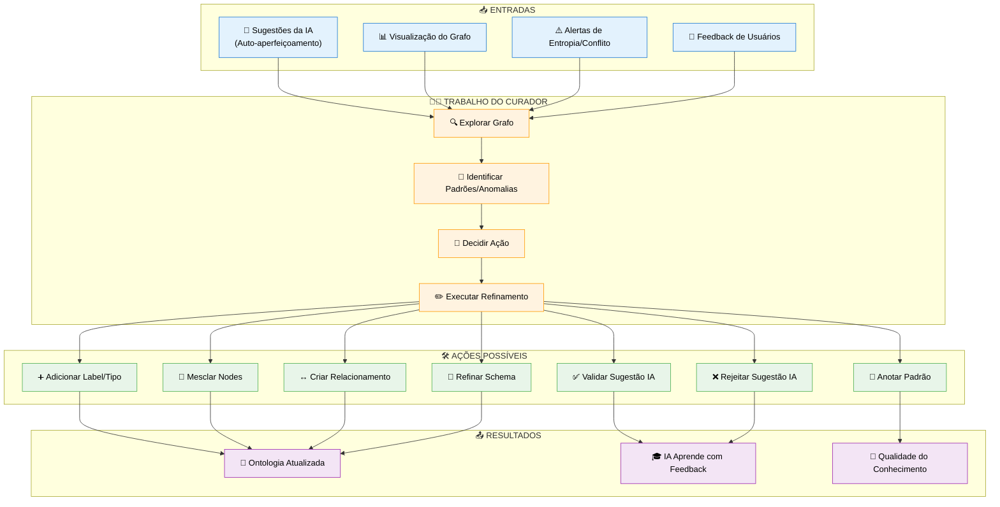
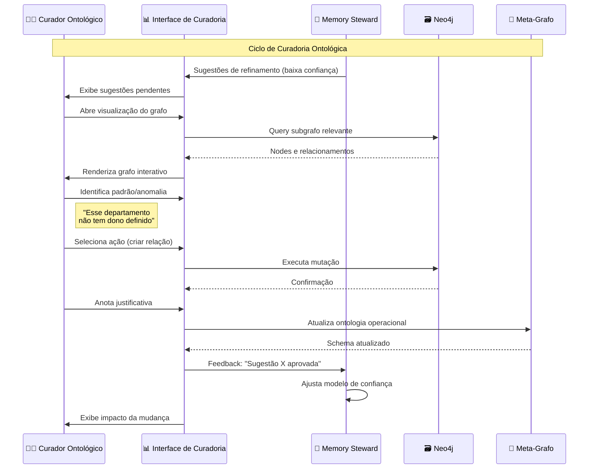
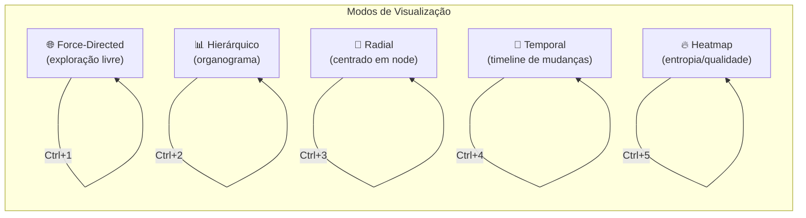
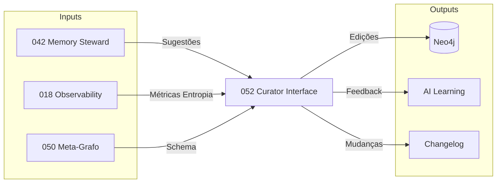

# Spec 052: Ontological Curator Interface - Interface de Curadoria Ontológica

**Feature Branch**: `052-ontological-curator-interface`  
**Created**: 2025-01-19  
**Status**: Draft  
**Priority**: P0 (Core - Epicentro do HITL)  
**Source**: chat02 + Refinamento conceitual

---

## Context & Purpose

O **Curador Ontológico** é o profissional humano que atua no ponto de fricção entre **autoaperfeiçoamento algorítmico** e **inteligência organizacional humana**. Ele não valida conteúdo isolado - ele **refina a ontologia viva do negócio**.

> "O curador atua sobre o schema semântico dinâmico, não sobre dados."

Sem esse papel, o EKS vira apenas:
- RAG sofisticado, ou
- Repositório inteligente

Nenhum dos dois é um **sistema cognitivo organizacional**.

### O que o Curador Ontológico FAZ

| Aspecto | Responsabilidade |
|---------|------------------|
| **O que existe** | Entidades legítimas do negócio |
| **Como existe** | Tipos, subclasses, estados |
| **Como se relaciona** | Relações causais, funcionais, informacionais |
| **Quando faz sentido** | Contexto, temporalidade, maturidade |

### Por que a Visualização do Grafo é CRÍTICA

O grafo **não é para "ver bonito"**. Ele é para **pensar o negócio**.

Quando o curador olha o grafo, ele consegue:
- **Detectar lacunas ontológicas**: processos sem dono, decisões sem critério, métricas sem objetivo
- **Identificar acoplamentos perigosos**: nó concentrando responsabilidade demais
- **Ver fluxos implícitos**: informação que "corre" fora do processo formal
- **Perceber antipadrões organizacionais**: decisões recorrentes sem aprendizado acumulado

> "Isso NÃO aparece em documentos. Documento é linear. Organização é relacional."

---

## Process Flow (Business View)



---

## O Papel do Curador (Não é Admin, Não é IA)

### Distinção Crítica

| Papel | Foco | Ferramenta Principal |
|-------|------|---------------------|
| **Admin** | Gestão operacional (usuários, permissões, uploads) | Dashboard administrativo |
| **Memory Steward (IA)** | Auditoria automatizada de qualidade | Algoritmos de detecção |
| **Curador Ontológico (Humano)** | Refinamento semântico do negócio | **Visualização interativa do grafo** |

### Perfil do Curador Ontológico

- **Conhece o negócio** profundamente
- **Entende grafos** (não precisa ser técnico, mas sabe "pensar relacional")
- **Distingue exceção de regra**
- **Separa workaround de prática legítima**
- **Estabiliza padrões** quando fazem sentido

> "A ontologia não é técnica. Ela é negócio formalizado."

---

## Agent Collaboration



---

## User Scenarios & Testing

### User Story 1 - Exploração Visual do Grafo (Priority: P0)

Como Curador Ontológico, quero visualizar o grafo de conhecimento de forma interativa para identificar lacunas e padrões.

**Acceptance Scenarios**:

1. **Given** curador logado, **When** acessa interface de curadoria, **Then** vê grafo renderizado com nodes coloridos por tipo (Person, Process, Department, etc.)

2. **Given** grafo exibido, **When** curador clica em um node, **Then** vê painel lateral com: propriedades, relacionamentos, métricas (entropia, confiança, frescor)

3. **Given** grafo exibido, **When** curador aplica filtro "Processos sem dono", **Then** destaca nodes :Process que não têm relação [:OWNED_BY]->(:Person)

4. **Given** grafo filtrado, **When** curador seleciona 2 nodes, **Then** pode criar relacionamento entre eles com tipo e propriedades

---

### User Story 2 - Validação de Sugestões da IA (Priority: P0)

Como Curador Ontológico, quero revisar e validar sugestões automáticas de refinamento para guiar o auto-aperfeiçoamento.

**Acceptance Scenarios**:

1. **Given** Memory Steward detectou duplicata, **When** curador abre interface, **Then** vê proposta de merge com comparação lado-a-lado

2. **Given** proposta de merge exibida, **When** curador aprova, **Then** sistema executa merge e registra aprovação com justificativa

3. **Given** proposta rejeitada, **When** curador adiciona motivo, **Then** Memory Steward aprende que esse padrão NÃO é duplicata

4. **Given** múltiplas sugestões pendentes, **When** curador visualiza lista, **Then** vê ordenadas por: severidade, impacto, confiança da IA

---

### User Story 3 - Detecção de Antipadrões (Priority: P1)

Como Curador Ontológico, quero que a interface destaque antipadrões organizacionais para que eu possa corrigi-los.

**Acceptance Scenarios**:

1. **Given** grafo carregado, **When** sistema detecta "nó centralizador" (>10 relações de dependência), **Then** destaca com halo vermelho e tooltip explicativo

2. **Given** grafo carregado, **When** sistema detecta "ciclo de decisão" (A decide → B decide → A decide), **Then** exibe alerta de loop com path destacado

3. **Given** antipadrão detectado, **When** curador clica "Analisar", **Then** vê: descrição do antipadrão, impacto potencial, sugestões de correção

4. **Given** curador corrige antipadrão, **When** cria nova estrutura, **Then** sistema valida que antipadrão foi resolvido

---

### User Story 4 - Refinamento de Schema (Priority: P1)

Como Curador Ontológico, quero propor alterações no schema do grafo para que a ontologia evolua com o negócio.

**Acceptance Scenarios**:

1. **Given** curador identifica novo tipo de entidade, **When** solicita "Criar novo Label", **Then** interface permite: nome, descrição, propriedades obrigatórias, relacionamentos esperados

2. **Given** novo label proposto, **When** curador confirma, **Then** sistema cria entrada no Meta-Grafo (spec 050) como `:SchemaLabel`

3. **Given** label criado, **When** curador seleciona nodes existentes, **Then** pode "Promover" nodes para o novo tipo

4. **Given** schema modificado, **When** curador salva, **Then** sistema gera changelog e notifica administradores

---

### User Story 5 - Análise de Cobertura Ontológica (Priority: P2)

Como Curador Ontológico, quero ver quais áreas do negócio estão sub-representadas no grafo para priorizar documentação.

**Acceptance Scenarios**:

1. **Given** BIG (Business Intent Graph) populado, **When** curador abre "Mapa de Cobertura", **Then** vê heatmap de objetivos coloridos por coverage score

2. **Given** objetivo com baixa cobertura, **When** curador clica, **Then** vê: conhecimento existente, gaps identificados, sugestões de fontes

3. **Given** gap identificado, **When** curador cria "Tarefa de Aquisição", **Then** sistema notifica responsáveis (via spec 020 - Ressonância)

---

## Interface de Visualização

### Layout Principal

```
┌─────────────────────────────────────────────────────────────────────────┐
│ 🧑‍🔬 Curadoria Ontológica                              [Admin ▼] [?]    │
├───────────────────────────────────────────────────────────────┬─────────┤
│                                                               │         │
│  ┌─────────────────────────────────────────────────────────┐ │ 📋      │
│  │                                                         │ │ PAINEL  │
│  │              [GRAFO INTERATIVO]                        │ │         │
│  │                                                         │ │ Node:   │
│  │         ┌────┐         ┌────┐                          │ │ Dept X  │
│  │         │ D1 │─────────│ P1 │                          │ │         │
│  │         └────┘         └────┘                          │ │ Tipo:   │
│  │            │              │                             │ │ Dept    │
│  │            ▼              ▼                             │ │         │
│  │         ┌────┐         ┌────┐         ┌────┐          │ │ Rels:   │
│  │         │ U1 │         │ U2 │─────────│ K1 │          │ │ 5 in    │
│  │         └────┘         └────┘         └────┘          │ │ 3 out   │
│  │                                                         │ │         │
│  │  🔍 Busca: [____________]  🎨 Layout: [Force ▼]       │ │ Entropia│
│  │  📊 Filtro: [Todos ▼]     🔬 Zoom: [- | 100% | +]     │ │ 0.34    │
│  │                                                         │ │         │
│  └─────────────────────────────────────────────────────────┘ │ [Editar]│
│                                                               │ [Mesclar│
├───────────────────────────────────────────────────────────────┤ [Criar] │
│ ⚠️ Sugestões da IA (3)                     [Ver Todas]       │         │
│ • 🔗 Merge: "TNA-RJ" ≈ "TNA RJ" (conf: 0.92)    [✓] [✗]    │         │
│ • ⚠️ Órfão: Process "Onboarding" sem dono       [Atribuir]  │         │
│ • 🔄 Ciclo: Aprovação → Revisão → Aprovação     [Analisar]  │         │
└─────────────────────────────────────────────────────────────────────────┘
```

### Ferramentas Visuais

| Ferramenta | Função | Atalho |
|------------|--------|--------|
| 🔍 **Busca** | Encontrar nodes por nome/propriedade | Ctrl+F |
| 🎯 **Filtro por Tipo** | Mostrar apenas labels específicos | F |
| 🔥 **Heatmap de Entropia** | Colorir por score de entropia | H |
| 🔗 **Criar Relação** | Conectar 2 nodes selecionados | R |
| ✂️ **Mesclar** | Unificar nodes duplicados | M |
| 📝 **Anotar** | Adicionar nota a node/relação | N |
| 🔄 **Detectar Ciclos** | Destacar loops no grafo | C |
| 👁️ **Expandir** | Mostrar vizinhos de um node | E |
| 📸 **Snapshot** | Salvar estado atual | S |

### Modos de Visualização



---

## Functional Requirements

### Visualização do Grafo

- **REQ-OCI-001**: Interface DEVE renderizar grafos de até 1000 nodes com <2s de load time
- **REQ-OCI-002**: Curador DEVE poder navegar (pan/zoom) no grafo com mouse e touch
- **REQ-OCI-003**: Nodes DEVEM ser coloridos por tipo (label) com legenda visível
- **REQ-OCI-004**: Ao clicar em node, DEVE exibir painel lateral com todas propriedades e relacionamentos
- **REQ-OCI-005**: Curador DEVE poder filtrar grafo por: tipo, departamento, data, score de entropia

### Edição Interativa

- **REQ-OCI-006**: Curador DEVE poder criar relacionamento entre 2 nodes selecionados
- **REQ-OCI-007**: Curador DEVE poder editar propriedades de nodes diretamente na interface
- **REQ-OCI-008**: Curador DEVE poder mesclar nodes duplicados com preservação de histórico
- **REQ-OCI-009**: Curador DEVE poder adicionar/remover labels de nodes existentes
- **REQ-OCI-010**: Toda edição DEVE gerar entrada em audit log com: quem, quando, o quê, por quê

### Detecção de Padrões

- **REQ-OCI-011**: Sistema DEVE destacar automaticamente "nós centralizadores" (alto grau de conexões)
- **REQ-OCI-012**: Sistema DEVE detectar e destacar ciclos no grafo
- **REQ-OCI-013**: Sistema DEVE identificar "nodes órfãos" (sem relacionamentos ou com relacionamentos esperados faltando)
- **REQ-OCI-014**: Curador DEVE poder criar "regras de antipadrão" customizadas

### Integração com Auto-aperfeiçoamento

- **REQ-OCI-015**: Sugestões do Memory Steward (spec 042) DEVEM aparecer na interface para validação
- **REQ-OCI-016**: Curador DEVE poder aprovar/rejeitar/modificar sugestões com um clique
- **REQ-OCI-017**: Feedback do curador DEVE alimentar modelo de confiança do Memory Steward
- **REQ-OCI-018**: Sistema DEVE aprender padrões de aprovação/rejeição para melhorar sugestões futuras

### Refinamento de Schema

- **REQ-OCI-019**: Curador DEVE poder propor novos labels via interface visual
- **REQ-OCI-020**: Novos labels DEVEM ser criados no Meta-Grafo (spec 050) como `:SchemaLabel`
- **REQ-OCI-021**: Curador DEVE poder definir propriedades obrigatórias para novos tipos
- **REQ-OCI-022**: Mudanças de schema DEVEM gerar changelog versionado

---

## Non-Functional Requirements

### Performance

- **REQ-OCI-NFR-001**: Grafo de 500 nodes DEVE renderizar em <1 segundo
- **REQ-OCI-NFR-002**: Filtros DEVEM aplicar em <500ms
- **REQ-OCI-NFR-003**: Edições DEVEM refletir no grafo em <1 segundo

### Usabilidade

- **REQ-OCI-NFR-004**: Curador DEVE conseguir realizar ações básicas sem treinamento (UX intuitiva)
- **REQ-OCI-NFR-005**: Todas ações DEVEM ter undo/redo disponível
- **REQ-OCI-NFR-006**: Interface DEVE funcionar em tablet (responsiva)

### Governança

- **REQ-OCI-NFR-007**: Apenas usuários com role `curator` ou `admin` DEVEM acessar esta interface
- **REQ-OCI-NFR-008**: Todas edições DEVEM ser auditáveis e rastreáveis
- **REQ-OCI-NFR-009**: Mudanças críticas (delete, schema change) DEVEM requerer confirmação

---

## Key Entities (Neo4j)

### Nodes de Curadoria

```cypher
// Ação de Curadoria do Humano
(:CuratorAction {
  id: string,
  action_type: string, // "create_rel" | "merge" | "add_label" | "edit_prop" | "validate_suggest"
  target_nodes: [string], // IDs dos nodes afetados
  justification: string, // Por que o curador fez isso
  curator_id: string,
  created_at: datetime
})

// Padrão Identificado pelo Curador
(:OntologyPattern {
  id: string,
  pattern_type: string, // "antipattern" | "best_practice" | "exception"
  description: string,
  cypher_detection: string, // Query que detecta o padrão
  severity: string, // "info" | "warning" | "critical"
  created_by: string,
  created_at: datetime
})

// Snapshot do Grafo (para comparação temporal)
(:GraphSnapshot {
  id: string,
  name: string,
  description: string,
  node_count: int,
  rel_count: int,
  created_by: string,
  created_at: datetime
})
```

### Relacionamentos

```cypher
// Curador executa ação
(:User)-[:PERFORMED]->(:CuratorAction)

// Ação afeta nodes
(:CuratorAction)-[:AFFECTED]->(:Knowledge|:Process|:Person|...)

// Snapshot preserva estado
(:GraphSnapshot)-[:CAPTURES]->(:SchemaVersion)

// Padrão detecta anomalia
(:OntologyPattern)-[:DETECTED_IN]->(:Knowledge|:Process|...)
```

---

## Technical Design

### Tech Stack

```yaml
Frontend: Next.js 14 + TypeScript
Graph Viz: D3.js (force-directed) + Cytoscape.js (layouts avançados)
State: Zustand (local) + React Query (server)
UI: Shadcn/ui + Tailwind
Real-time: WebSocket para updates colaborativos
```

### API Endpoints

```typescript
// Grafo
GET    /curator/graph                    // Subgrafo paginado
GET    /curator/graph/node/:id           // Detalhes de node
GET    /curator/graph/neighbors/:id      // Vizinhos de node

// Edição
POST   /curator/graph/relationship       // Criar relação
PUT    /curator/graph/node/:id           // Editar node
POST   /curator/graph/merge              // Mesclar nodes
POST   /curator/graph/label              // Adicionar label

// Sugestões
GET    /curator/suggestions              // Listar sugestões pendentes
POST   /curator/suggestions/:id/approve  // Aprovar sugestão
POST   /curator/suggestions/:id/reject   // Rejeitar sugestão

// Padrões
GET    /curator/patterns                 // Listar antipadrões detectados
POST   /curator/patterns                 // Criar regra de padrão

// Schema
GET    /curator/schema                   // Carregar meta-grafo
POST   /curator/schema/label             // Propor novo label
```

---

## Success Criteria

1. **Adoção**: 100% dos curadores usam a interface semanalmente
2. **Qualidade**: Score de qualidade do grafo aumenta 30% em 3 meses
3. **Eficiência**: Tempo de curadoria reduz 50% vs processo manual anterior
4. **Aprendizado**: Taxa de aprovação de sugestões da IA aumenta de 60% para 85%
5. **Cobertura**: Lacunas ontológicas reduzem 40% em 6 meses
6. **Satisfação**: NPS dos curadores >70

---

## Dependencies

- **050 - Meta-Graph Schema**: Schema-as-data para refinamento
- **042 - Memory Steward**: Sugestões automáticas para validação
- **018 - Observability Dashboard**: Métricas de entropia
- **017 - Memory Ecosystem**: Classificação de memória
- **015 - Neo4j Graph Model**: Ontologia base

---

## Integration Points



---

## Assumptions

1. Curadores têm conhecimento do negócio (não requer treinamento técnico)
2. Organizações têm pelo menos 1 curador dedicado
3. Grafos típicos têm <5000 nodes (MVP)
4. Mudanças de schema são infrequentes (<10/mês)

---

## Out of Scope (MVP)

- Edição colaborativa em tempo real (múltiplos curadores simultâneos)
- Integração com ferramentas externas de modelagem (ex: Protégé)
- Versionamento completo do grafo (apenas snapshots)
- Customização visual avançada (temas, ícones customizados)

---

## References

- chat02/chat02_08.txt: Conceito do Curador Ontológico-Operacional
- chat02/chat02_07.txt: Visualização do Grafo como instrumento cognitivo
- Spec 050 (Meta-Graph Schema)
- Spec 042 (Memory Steward)

---

**Status**: 🟡 Draft  
**Priority**: 🔴 P0 (Core - Epicentro do HITL)  
**Effort**: 5 dias  
**Dependencies**: Spec 050, Spec 042, Spec 015

---

**Criado por**: Spec Orchestrator Agent  
**Data**: 2025-01-19  
**Source**: Conceitos fundamentais de chat02 não documentados em specs

