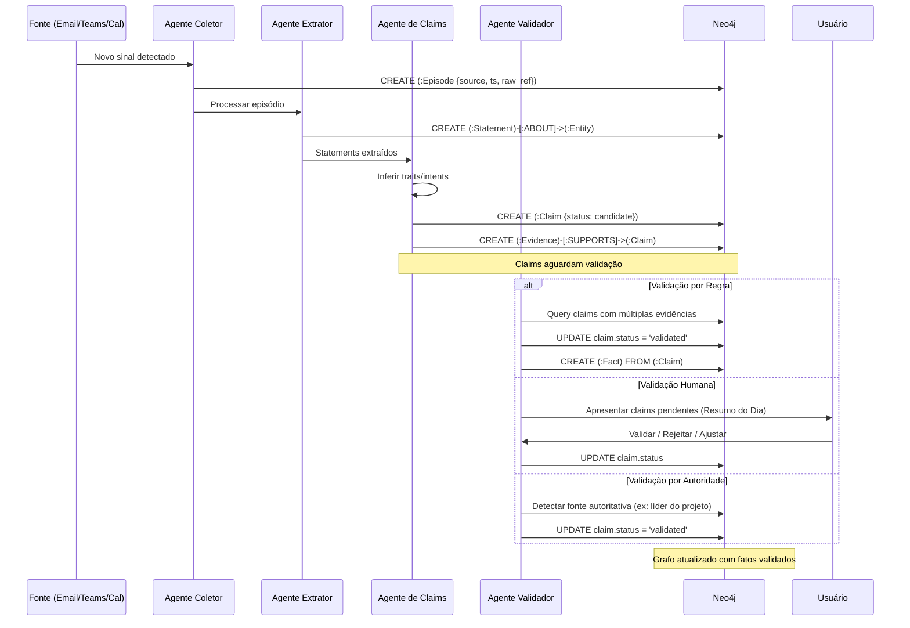
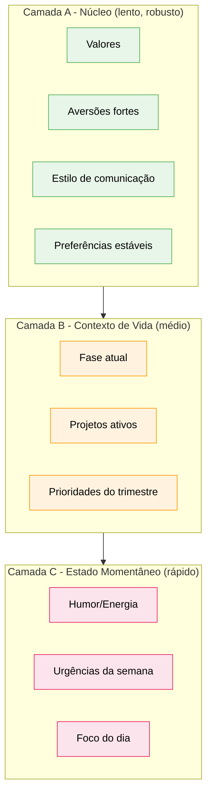
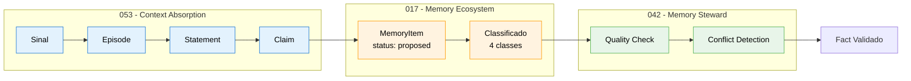

# Especificação de Feature: Sistema de Absorção de Contexto Corporativo

**Feature Branch**: `053-context-absorption-system`  
**Criado**: 2026-01-21  
**Status**: Draft  
**Prioridade**: P0 (Foundation)  
**Fonte**: chat02_09 - Pipeline de sinais corporativos para validação de grafo  
**Atualizado**: 2026-01-21 (WhatsApp, tagging manual, processamento em lotes)

## Contexto & Propósito

O **Sistema de Absorção de Contexto Corporativo** é o mecanismo que transforma sinais brutos do ambiente corporativo (e-mail, Teams, calendário, documentos) em conhecimento validado no grafo. O princípio fundamental é:

> **"Nada vira verdade no grafo sem passar por Claim → Evidence → Validação."**

Este sistema resolve o problema de "absorver contexto" de forma controlada, onde:
- Sinais brutos nunca entram diretamente como fatos
- Todo conhecimento passa por um estágio intermediário de **Claim** (candidato)
- Claims são suportados por **Evidências** rastreáveis
- Validação pode ser humana, automática por regra, ou por autoridade
- O grafo permanece consistente e auditável

O sistema também introduz o conceito de **Persona Temporal**, onde "quem a pessoa é" muda em camadas temporais (núcleo, fase atual, estado momentâneo).

---

## Fluxo de Processo (Visão de Negócio)

```mermaid
flowchart TD
    subgraph Sources["Fontes de Sinais"]
        Email[Email/Outlook/Gmail]
        Teams[Teams/Chat]
        WhatsApp[WhatsApp Business]
        Calendar[Calendário/Reuniões]
        Docs[Documentos/Tarefas]
    end
    
    subgraph Normalization["Camada de Normalização"]
        Episode[":Episode<br/>(Evento Normalizado)"]
    end
    
    subgraph Extraction["Camada de Extração"]
        Statement[":Statement<br/>(Afirmação Extraída)"]
        Entity[":Entity<br/>(Entidade Detectada)"]
    end
    
    subgraph Candidacy["Camada de Candidatura"]
        Claim[":Claim<br/>(Candidato a Fato)"]
        Evidence[":Evidence<br/>(Suporte)"]
    end
    
    subgraph Validation["Camada de Validação"]
        HumanVal[Validação Humana]
        RuleVal[Validação por Regra]
        AuthVal[Validação por Autoridade]
    end
    
    subgraph Graph["Grafo de Conhecimento"]
        Fact[":Fact<br/>(Fato Validado)"]
        Trait[":Trait<br/>(Característica)"]
        Intent[":Intent<br/>(Intenção/Objetivo)"]
    end
    
    Email --> Episode
    Teams --> Episode
    WhatsApp --> Episode
    Calendar --> Episode
    Docs --> Episode
    
    Episode --> Statement
    Statement --> Entity
    Statement --> Claim
    
    Claim --> Evidence
    Evidence --> HumanVal
    Evidence --> RuleVal
    Evidence --> AuthVal
    
    HumanVal --> Fact
    RuleVal --> Fact
    AuthVal --> Fact
    
    Fact --> Trait
    Fact --> Intent
    
    classDef source fill:#e3f2fd,stroke:#1976d2,color:#000
    classDef normalize fill:#fff3e0,stroke:#ff9800,color:#000
    classDef extract fill:#e8f5e9,stroke:#4caf50,color:#000
    classDef candidate fill:#fce4ec,stroke:#e91e63,color:#000
    classDef validate fill:#f3e5f5,stroke:#9c27b0,color:#000
    classDef graph fill:#e0f2f1,stroke:#009688,color:#000
    
    class Email,Teams,Calendar,Docs source
    class Episode normalize
    class Statement,Entity extract
    class Claim,Evidence candidate
    class HumanVal,RuleVal,AuthVal validate
    class Fact,Trait,Intent graph
```

### Insights do Fluxo

**Gaps identificados**:
- Como lidar com conflitos entre evidências de fontes diferentes?
- Qual o threshold de evidências para promoção automática?
- Como tratar claims que nunca são validados (timeout)?
- Como detectar drift entre claims novos e fatos existentes?
- Como filtrar "lixo" de email/WhatsApp automaticamente?

**Oportunidades identificadas**:
- Resumo diário como interface de validação em lote
- Detecção automática de contradições temporais
- Sugestão de claims baseada em padrões recorrentes
- Dashboard de "saúde do grafo" (claims pendentes, evidências fracas)
- **Tagging manual pelo usuário** para marcar decisões importantes
- **Resumo complementável** onde usuário adiciona contexto que o sistema não capturou
- **Exclusão de conteúdo** pelo usuário antes de processar (filtrar lixo)

**Riscos identificados**:
- Sobrecarga de validação: muitos claims podem cansar o usuário
- Latência: delay entre sinal e fato pode frustrar
- Privacidade: nem todo sinal corporativo deve ser processado
- Ruído: sinais de baixa qualidade podem gerar claims ruins
- WhatsApp: conversas informais podem gerar claims de baixa qualidade

---

## Colaboração de Agentes



---

## Persona Temporal

O sistema trata a persona do usuário em **3 camadas temporais**:



### Regras de Camada

| Camada | Frequência de Mudança | Evidência Necessária | Exemplo de Trait |
|--------|----------------------|---------------------|------------------|
| **Núcleo** | Meses/Anos | Múltiplas evidências acumuladas | "Prefere comunicação direta" |
| **Contexto** | Semanas/Meses | Declaração explícita ou padrão recorrente | "Focado no projeto X até Q2" |
| **Momentâneo** | Dias/Horas | Sinal recente | "Hoje está em reuniões externas" |

---

## Cenários de Usuário & Testes

### User Story 1 - Absorção de Email (Prioridade: P0)

Como sistema, quero processar emails do usuário e extrair claims sobre projetos, decisões e compromissos para que o grafo seja atualizado de forma controlada.

**Teste Independente**: Ingerir thread de email, verificar criação de Episode → Statements → Claims com evidências linkadas.

**Cenários de Aceitação**:

1. **Dado** novo email recebido com decisão de projeto, **Quando** Agente Coletor processa, **Então** cria `:Episode` com `source: email`, extrai `:Statement` tipo `decision`, e gera `:Claim` com `status: candidate`

2. **Dado** claim gerado de email, **Quando** mesmo assunto aparece em reunião do calendário, **Então** sistema cria segunda `:Evidence` linkada ao mesmo `:Claim`, aumentando `confidence`

3. **Dado** claim com múltiplas evidências (email + reunião + chat), **Quando** regra de promoção automática ativa, **Então** claim é promovido a `:Fact` sem validação humana

---

### User Story 2 - Resumo Diário como Validação (Prioridade: P0)

Como usuário, quero receber um resumo diário com claims pendentes de validação para que eu possa confirmar ou ajustar o que o sistema inferiu sobre mim e meu trabalho.

**Teste Independente**: Gerar resumo do dia, apresentar 5-15 claims com opções de validação, verificar atualização do grafo após ação do usuário.

**Cenários de Aceitação**:

1. **Dado** 10 claims pendentes do dia, **Quando** sistema gera resumo, **Então** apresenta lista com: título do claim, tipo (Decision/Commitment/Risk/Topic), evidências linkadas, e botões: Validar / Rejeitar / Ajustar / Temporário

2. **Dado** usuário clica "Validar" em claim, **Quando** sistema processa, **Então** claim.status = 'validated', cria `:Fact` correspondente, e registra `validated_by: user_id`

3. **Dado** usuário clica "Rejeitar" com justificativa, **Quando** sistema processa, **Então** claim.status = 'rejected', registra `rejection_reason`, e não cria `:Fact`

4. **Dado** usuário clica "Temporário", **Quando** sistema processa, **Então** cria `:Fact` com `valid_to: +7d` (escopo temporal limitado)

---

### User Story 3 - Detecção de Contradição (Prioridade: P1)

Como sistema, quero detectar quando um novo claim contradiz um fato existente para que o usuário possa resolver o conflito explicitamente.

**Teste Independente**: Criar fato "usuário prefere A", gerar claim "usuário prefere B", verificar criação de `:Contradiction` e apresentação ao usuário.

**Cenários de Aceitação**:

1. **Dado** fato existente "Prefere reuniões curtas", **Quando** novo claim "Aceita reuniões longas" é gerado, **Então** sistema cria `:Contradiction` linkando ambos e marca para revisão

2. **Dado** contradição detectada, **Quando** apresentada ao usuário, **Então** oferece opções: "A era temporário" / "B substitui A" / "Depende do contexto X"

3. **Dado** usuário escolhe "B substitui A", **Quando** sistema processa, **Então** marca fato A com `valid_to: now()`, promove claim B a fato com `valid_from: now()`

---

### User Story 4 - Persona Temporal (Prioridade: P1)

Como usuário, quero que o sistema entenda que "quem eu sou" muda em diferentes escalas de tempo para que respostas sejam contextualizadas adequadamente.

**Teste Independente**: Criar traits nas 3 camadas, fazer query "como o usuário prefere X", verificar que resposta considera camada correta.

**Cenários de Aceitação**:

1. **Dado** trait de núcleo "Prefere comunicação direta", **Quando** agente responde sobre estilo, **Então** usa trait de núcleo como base

2. **Dado** trait de contexto "Focado no projeto EKS até Q2", **Quando** agente prioriza tarefas, **Então** pondera projetos pelo contexto atual

3. **Dado** trait momentâneo "Hoje em reuniões externas", **Quando** agente sugere horário, **Então** considera indisponibilidade momentânea

---

### User Story 5 - Absorção de WhatsApp (Prioridade: P0)

Como usuário, quero que o sistema processe minhas conversas de WhatsApp Business para capturar decisões e compromissos feitos via chat.

**Teste Independente**: Exportar conversa WhatsApp, ingerir, verificar criação de Episodes e Claims.

**Cenários de Aceitação**:

1. **Dado** conversa WhatsApp exportada (CoCreate: eu + Júlio), **Quando** sistema processa, **Então** cria `:Episode` por bloco de mensagens com `source: whatsapp`, identificando participantes

2. **Dado** mensagem contendo decisão ("vamos fazer X"), **Quando** Agente Extrator processa, **Então** gera `:Claim` tipo `commitment` com ambos participantes como `stakeholders`

3. **Dado** conversa informal com muito "lixo", **Quando** sistema processa, **Então** filtra mensagens curtas (<10 chars) e emojis isolados, focando em conteúdo substantivo

---

### User Story 6 - Tagging Manual pelo Usuário (Prioridade: P0)

Como usuário, quero poder marcar emails/mensagens como "decisão", "importante" ou "ignorar" para que o sistema priorize o que realmente importa.

**Teste Independente**: Marcar email como "decisão", verificar que claim gerado tem `user_tagged: true` e `confidence` elevada.

**Cenários de Aceitação**:

1. **Dado** email na caixa de entrada, **Quando** usuário marca como "⭐ Decisão", **Então** sistema cria `:Episode` com `user_tag: decision` e processa com prioridade alta

2. **Dado** email marcado pelo usuário, **Quando** claim é gerado, **Então** claim tem `source: user_tagged` e `confidence: 0.95` (confiança alta por validação implícita)

3. **Dado** múltiplos usuários marcam mesmo email como decisão, **Quando** sistema processa, **Então** claim é automaticamente promovido a `:Fact` (validação por consenso)

---

### User Story 7 - Exclusão de Conteúdo pelo Usuário (Prioridade: P0)

Como usuário, quero poder excluir emails/mensagens da base de conhecimento para evitar que "lixo" polua o grafo.

**Teste Independente**: Excluir email, verificar que não gera Episode nem Claims.

**Cenários de Aceitação**:

1. **Dado** lista de emails pendentes de processamento, **Quando** usuário marca email como "🗑️ Ignorar", **Então** sistema adiciona `email_id` à blacklist e não processa

2. **Dado** email já processado com claims gerados, **Quando** usuário exclui retroativamente, **Então** sistema marca claims como `status: excluded_by_user` e remove de retrieval

3. **Dado** padrão de exclusão (ex: emails de remetente X sempre excluídos), **Quando** sistema detecta padrão, **Então** sugere regra automática de exclusão

---

### User Story 8 - Resumo Complementável (Prioridade: P1)

Como usuário, quero poder complementar o resumo diário com informações que o sistema não capturou para que o grafo reflita minha realidade completa.

**Teste Independente**: Adicionar nota ao resumo, verificar criação de Claim com `source: user_input`.

**Cenários de Aceitação**:

1. **Dado** resumo diário apresentado, **Quando** usuário clica "+ Adicionar", **Então** sistema abre campo para texto livre com sugestão de tipo (Decisão/Compromisso/Insight)

2. **Dado** usuário adiciona "Decidi mudar de estratégia no projeto X", **Quando** sistema processa, **Então** cria `:Claim` com `source: user_input`, `confidence: 1.0`, já validado

3. **Dado** usuário complementa claim existente com contexto, **Quando** sistema processa, **Então** adiciona `:Evidence` tipo `user_annotation` ao claim existente

---

## Requisitos Funcionais

### Pipeline de Absorção

- **REQ-CAS-001**: Sistema DEVE normalizar todo sinal corporativo em `:Episode` antes de processar
- **REQ-CAS-002**: Todo `:Episode` DEVE ter: `id`, `ts_start`, `ts_end`, `source_system`, `participants`, `raw_text_ref`, `scope` (personal/team/org)
- **REQ-CAS-003**: Sistema DEVE extrair `:Statement` de cada episódio com: `text`, `polarity`, `modality`, `confidence`
- **REQ-CAS-004**: Todo `:Statement` DEVE linkar a pelo menos uma `:Entity` via [:ABOUT]

### Sistema de Claims

- **REQ-CAS-005**: Todo conhecimento candidato DEVE ser representado como `:Claim` antes de virar `:Fact`
- **REQ-CAS-006**: Todo `:Claim` DEVE ter: `id`, `type` (Decision/Commitment/Risk/Topic/Trait/Intent), `confidence`, `status` (candidate/validated/rejected/expired), `created_at`
- **REQ-CAS-007**: Todo `:Claim` DEVE linkar a pelo menos uma `:Evidence` via [:SUPPORTED_BY]
- **REQ-CAS-008**: Toda `:Evidence` DEVE ter: `source`, `ref`, `ts`, `strength` (weak/moderate/strong)
- **REQ-CAS-009**: Sistema DEVE suportar relacionamento [:PROPOSES] de Claim para Fact (ou EdgeDraft)

### Validação

- **REQ-CAS-010**: Sistema DEVE suportar 3 tipos de validação: humana, por regra, por autoridade
- **REQ-CAS-011**: Validação DEVE registrar: `validator_type`, `validator_id`, `decision`, `timestamp`, `rationale`
- **REQ-CAS-012**: Validação por regra DEVE ser configurável (ex: 3+ evidências de fontes diferentes = auto-validar)
- **REQ-CAS-013**: Validação por autoridade DEVE respeitar hierarquia organizacional
- **REQ-CAS-014**: Claims não validados em 30 dias DEVEM ser marcados como `status: expired`

### Persona Temporal

- **REQ-CAS-015**: Todo `:Trait` DEVE ter propriedade `temporal_layer`: `core`, `context`, `momentary`
- **REQ-CAS-016**: Traits de camada `core` DEVEM requerer ≥3 evidências acumuladas para promoção
- **REQ-CAS-017**: Traits de camada `context` DEVEM ter `valid_from` e `valid_to` explícitos
- **REQ-CAS-018**: Traits de camada `momentary` DEVEM expirar automaticamente em 24-72h
- **REQ-CAS-019**: Sistema DEVE suportar interface de seleção: "Eu em geral" / "Eu agora (fase)" / "Eu hoje"

### Contradições

- **REQ-CAS-020**: Sistema DEVE detectar contradições entre claims novos e fatos existentes
- **REQ-CAS-021**: Toda `:Contradiction` DEVE linkar ambos os nodes conflitantes com propriedade `conflict_type`
- **REQ-CAS-022**: Sistema DEVE apresentar contradições ao usuário com opções de resolução
- **REQ-CAS-023**: Resolução de contradição DEVE atualizar `valid_to` do fato antigo se substituído

### Resumo Diário

- **REQ-CAS-024**: Sistema DEVE gerar resumo diário com claims pendentes agrupados por tipo
- **REQ-CAS-025**: Resumo DEVE mostrar: top 5 tópicos, decisões, compromissos, riscos, pessoas envolvidas
- **REQ-CAS-026**: Cada item do resumo DEVE ser clicável para ver evidências e raciocínio
- **REQ-CAS-027**: Resumo DEVE oferecer ações em lote: "Validar todos" / "Revisar depois"
- **REQ-CAS-028**: Resumo DEVE permitir usuário adicionar claims manualmente (complementar)
- **REQ-CAS-029**: Claims adicionados manualmente DEVEM ter `source: user_input` e `confidence: 1.0`

### WhatsApp como Fonte

- **REQ-CAS-030**: Sistema DEVE suportar WhatsApp como fonte de sinais via export ou API
- **REQ-CAS-031**: Processamento de WhatsApp DEVE identificar participantes e agrupar mensagens em blocos conversacionais
- **REQ-CAS-032**: Sistema DEVE filtrar automaticamente mensagens curtas (<10 chars), emojis isolados e stickers
- **REQ-CAS-033**: Sistema DEVE detectar padrões de decisão em WhatsApp ("ok", "combinado", "vamos fazer", "fechado")

### Tagging Manual

- **REQ-CAS-034**: Usuário DEVE poder marcar emails/mensagens com tags: `decision`, `important`, `ignore`
- **REQ-CAS-035**: Conteúdo marcado como `decision` DEVE gerar claims com `confidence: 0.95`
- **REQ-CAS-036**: Conteúdo marcado como `ignore` DEVE ser adicionado à blacklist e não processado
- **REQ-CAS-037**: Se múltiplos usuários marcam mesmo conteúdo, sistema DEVE aplicar validação por consenso

### Exclusão pelo Usuário

- **REQ-CAS-038**: Usuário DEVE poder excluir conteúdo antes ou depois do processamento
- **REQ-CAS-039**: Exclusão pré-processamento DEVE adicionar item à blacklist permanente
- **REQ-CAS-040**: Exclusão pós-processamento DEVE marcar claims como `status: excluded_by_user`
- **REQ-CAS-041**: Sistema DEVE detectar padrões de exclusão e sugerir regras automáticas

### Processamento em Lotes

- **REQ-CAS-042**: Sistema DEVE suportar processamento em lotes (hora em hora ou diário)
- **REQ-CAS-043**: Processamento em lote DEVE acumular sinais e processar de uma vez para evitar reprocessamento
- **REQ-CAS-044**: Sistema DEVE rastrear ideias e conceitos email-a-email, consolidando ao longo do tempo
- **REQ-CAS-045**: Cadência de processamento DEVE ser configurável por usuário (tempo real / hora / dia)

---

## Requisitos Não-Funcionais

### Performance

- **REQ-CAS-NFR-001**: Processamento de episódio (sinal → claim) DEVE completar em <5s
- **REQ-CAS-NFR-002**: Geração de resumo diário DEVE completar em <10s para <100 claims
- **REQ-CAS-NFR-003**: Detecção de contradição DEVE executar em <2s por claim novo

### Escalabilidade

- **REQ-CAS-NFR-004**: Sistema DEVE suportar ≥1000 episódios/dia por usuário
- **REQ-CAS-NFR-005**: Sistema DEVE suportar ≥100 claims pendentes por usuário
- **REQ-CAS-NFR-006**: Sistema DEVE escalar para entidades agregadas (Team, Project, OrgUnit)

### Privacidade

- **REQ-CAS-NFR-007**: Usuário DEVE poder excluir fontes específicas do processamento
- **REQ-CAS-NFR-008**: Sinais com `scope: personal` NÃO DEVEM ser visíveis para outros usuários
- **REQ-CAS-NFR-009**: Sistema DEVE suportar "modo silencioso" (coleta sem geração de claims)

---

## Critérios de Sucesso

1. **Cobertura de Absorção**: 80% dos eventos de trabalho (email/chat/reunião) geram pelo menos 1 claim
2. **Acurácia de Extração**: 85% dos claims gerados são considerados relevantes pelo usuário
3. **Taxa de Validação**: 70% dos claims são validados (não rejeitados ou expirados)
4. **Tempo de Validação**: Tempo médio entre geração e validação <48h
5. **Detecção de Contradição**: 95% das contradições óbvias são detectadas automaticamente
6. **Adoção de Resumo**: 60% dos usuários interagem com resumo diário pelo menos 3x/semana

---

## Entidades-Chave

### Tipos de Node Neo4j (Novos)

- **:Episode** - Evento normalizado de qualquer fonte
- **:Statement** - Afirmação extraída de episódio
- **:Claim** - Candidato a fato (aguardando validação)
- **:Evidence** - Suporte para claim (link para fonte)
- **:Fact** - Conhecimento validado no grafo
- **:Trait** - Característica da persona (com camada temporal)
- **:Intent** - Intenção/objetivo inferido
- **:Contradiction** - Conflito detectado entre claim e fato

### Relacionamentos Neo4j (Novos)

- **[:HAS_EPISODE]** - Person → Episode
- **[:CONTAINS]** - Episode → Statement
- **[:ABOUT]** - Statement → Entity
- **[:IMPLIES]** - Statement → Trait | Intent
- **[:SUPPORTED_BY]** - Claim → Evidence
- **[:PROPOSES]** - Claim → Fact
- **[:VALIDATES]** - Person | Role | Policy → Claim
- **[:CONFLICTS_WITH]** - Contradiction → Claim | Fact
- **[:HAS_TEMPORAL_SCOPE]** - Trait → TimeScope

### Propriedades

**:Episode**
- `id`, `ts_start`, `ts_end`, `source_system`, `participants[]`, `raw_text_ref`, `scope`
- `user_tag`: `decision` | `important` | `ignore` | null (tagging manual)
- `processing_status`: `pending` | `processed` | `excluded`

**:Claim**
- `id`, `type`, `text`, `confidence`, `status`, `created_at`, `validated_at`, `expired_at`
- `source`: `extracted` | `user_tagged` | `user_input` (origem do claim)
- `user_tagged`: boolean (se usuário marcou explicitamente)

**:Evidence**
- `id`, `source`, `ref`, `ts`, `strength`, `hash`
- `evidence_type`: `signal` | `user_annotation` | `consensus`

**:Trait**
- `id`, `trait_type` (Preference/Constraint/Value/Style/Habit), `temporal_layer` (core/context/momentary), `confidence`, `valid_from`, `valid_to`, `evidence_count`

**:Blacklist** (novo)
- `id`, `item_ref`, `item_type` (email/message/sender), `reason`, `created_by`, `created_at`

---

## Integração com Specs de Memória

Esta spec se integra diretamente com o ecossistema de memória existente:

### Spec 017 - Memory Ecosystem

| Conceito 017 | Conceito 053 | Integração |
|--------------|--------------|------------|
| **4 Classes de Memória** | `:Fact` validado | Facts são classificados em semantic/episodic/procedural/evaluative |
| **MemoryItem** | `:Claim` | Claim é um MemoryItem com `status: proposed` |
| **Modelo Bitemporal** | `:Trait` temporal | Traits usam `valid_from`, `valid_to`, `recorded_at` |
| **ConversationSummary** | Resumo Diário | Resumo diário é um tipo de summary complementável |
| **Claims/Decisions/Outcomes** | `:Claim` → `:Fact` | Pipeline de validação reutiliza modelo de 017 |

### Spec 042 - Memory Steward

| Conceito 042 | Conceito 053 | Integração |
|--------------|--------------|------------|
| **Conflict Detection** | `:Contradiction` | Steward detecta conflitos entre claims e facts |
| **Provenance Validation** | `:Evidence` | Steward valida cadeia Episode → Statement → Claim → Evidence |
| **Quality Scoring** | `confidence` | Steward calcula quality score de claims |
| **CurationProposal** | Validação Humana | Proposals do Steward alimentam resumo diário |

### Fluxo Integrado



---

## Dependências

- **Spec 015** (Neo4j Graph Model) - Tipos de node e relacionamentos base
- **Spec 013** (Ingestion Ecosystem) - Pipeline de ingestão (será estendido)
- **Spec 014** (Provenance System) - Rastreabilidade de origem
- **Spec 017** (Memory Ecosystem) - **INTEGRAÇÃO DIRETA** - 4 classes de memória, MemoryItem, modelo bitemporal
- **Spec 022** (Onboarding AI Profile) - Criação inicial de persona
- **Spec 040** (Business Intent Graph) - Ancoragem de conhecimento a objetivos
- **Spec 042** (Memory Steward) - **INTEGRAÇÃO DIRETA** - Detecção de conflitos, validação de provenância
- **Spec 051** (Context Depth Controller) - Controle de profundidade de contexto

---

## Premissas

1. Usuários têm acesso a pelo menos uma fonte corporativa (email ou Teams)
2. LLM consegue extrair statements de texto com acurácia ≥80%
3. Usuários estão dispostos a validar claims regularmente (mesmo que em lote)
4. Organizações permitem processamento de comunicações corporativas
5. Framework Agno suporta pipeline de agentes para extração → claims → validação

---

## Requisitos de Fontes de Dados

### Fontes e Autorização

| Fonte | Autorização | Método | Status |
|-------|-------------|--------|--------|
| **Gmail** | ✅ Requer autorização explícita | OAuth 2.0 | Usuário conecta via UI |
| **WhatsApp** | ❌ Automático | Workflow externo | Dados chegam via integração |

### Gmail (REQ-ABS-GMAIL)

- **REQ-ABS-GMAIL-001**: Gmail requer autorização explícita do usuário via OAuth 2.0.
- **REQ-ABS-GMAIL-002**: Scopes necessários: `gmail.readonly`, `gmail.metadata`.
- **REQ-ABS-GMAIL-003**: Após autorização, sistema DEVE:
  1. Salvar token criptografado em `:User.gmail_token`.
  2. Marcar `:User.gmail_connected = true`.
  3. Iniciar extração automática de episódios.
- **REQ-ABS-GMAIL-004**: Usuário PODE revogar acesso a qualquer momento via tela de configurações.
- **REQ-ABS-GMAIL-005**: Sistema DEVE respeitar rate limits da Gmail API (quota por usuário).

### WhatsApp (REQ-ABS-WHATSAPP)

- **REQ-ABS-WHATSAPP-001**: WhatsApp data vem de workflow externo, NÃO requer autorização no app.
- **REQ-ABS-WHATSAPP-002**: Dados de WhatsApp chegam já normalizados como `:Episode`.
- **REQ-ABS-WHATSAPP-003**: Sistema NÃO DEVE exibir opção de "conectar WhatsApp" na UI (transparente para usuário).
- **REQ-ABS-WHATSAPP-004**: Filtro de qualidade DEVE ser mais rigoroso para WhatsApp (conversas informais geram mais ruído).

### Modelo de Dados - DataSource

```cypher
(:DataSource {
  id: uuid,
  type: 'gmail' | 'whatsapp' | 'teams' | 'calendar',
  requires_auth: boolean,
  auth_method: 'oauth' | 'api_key' | 'workflow',
  status: 'pending' | 'connected' | 'skipped' | 'revoked',
  connected_at: datetime,
  last_sync_at: datetime
})

(:User)-[:HAS_DATA_SOURCE]->(:DataSource)
```

---

## Fora do Escopo

- Integração específica com Microsoft Graph API (spec separada)
- OCR de documentos anexados (spec separada)
- Processamento de áudio/vídeo de reuniões (spec separada)
- Análise de sentimento em comunicações (feature futura)
- Recomendação proativa de ações baseada em claims (feature futura)

---

## Notas

- O conceito de "Claim → Validação → Fact" é inspirado em sistemas de fact-checking e knowledge graphs auditáveis
- Persona temporal se alinha com teoria de identidade contextual em psicologia organizacional
- O resumo diário como interface de validação reduz fricção vs. validação síncrona
- Este sistema é a base para escalar de individual para coletivo (Team, Project, OrgUnit)
- Regra de ouro do sistema: **"Nada vira verdade no grafo sem passar por Claim → Evidence → Validação"**

---

*Especificação v1.1 - 21/01/2026*
*Origem: chat02_09 - Absorção de contexto corporativo*
*Atualização: WhatsApp, tagging manual, exclusão, resumo complementável, integração com specs 017/042*
