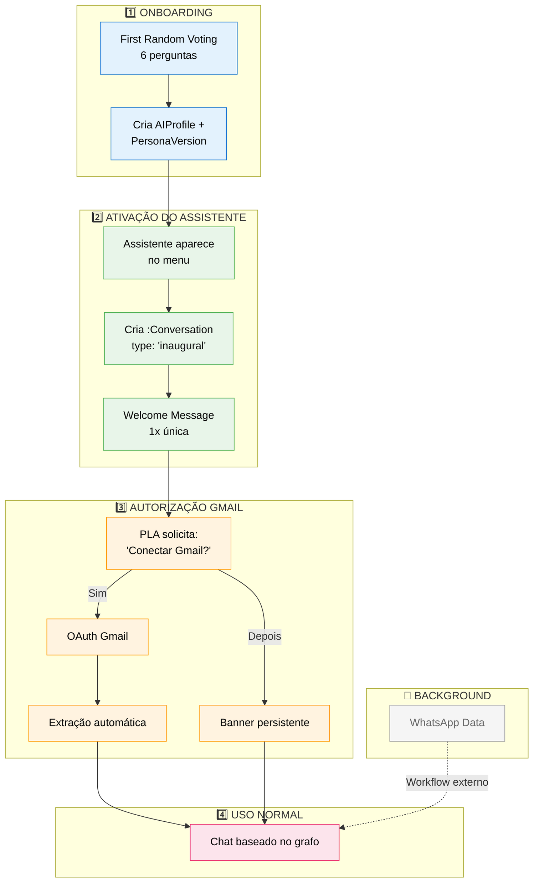
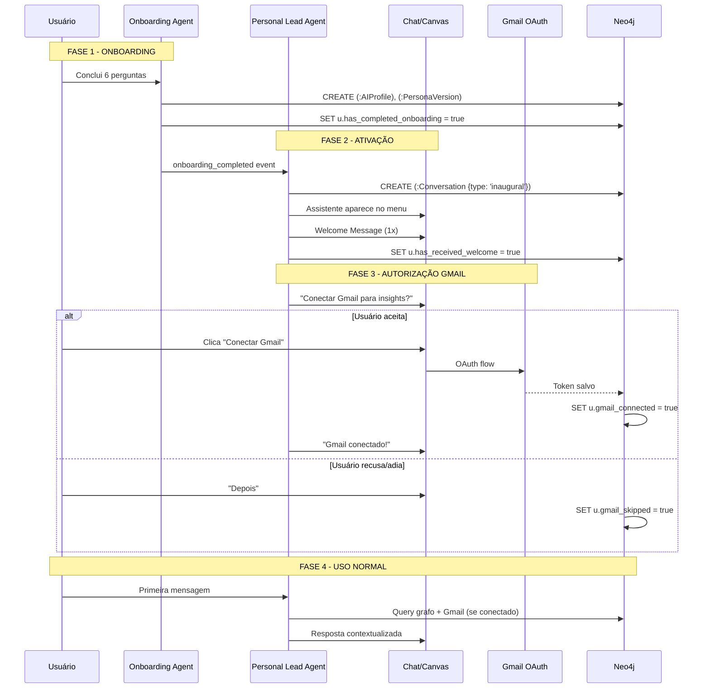

# Plano: Fluxo Onboarding → Chat Inaugural → Gmail Auth

**Criado**: 2026-01-21  
**Status**: Planejamento  
**Specs Relacionadas**: 022, 005, 053, 025

---

## Problema Identificado

O fluxo atual não define claramente:
1. **Quando** o chat é criado após o onboarding
2. **Qual** mensagem o PLA envia na primeira vez (vs conversas normais)
3. **Como** integrar autorização de fontes de dados (Gmail)

---

## Solução: Fluxo em 4 Fases



---

## Distinção de Prompts do PLA

| Tipo | Trigger | Conteúdo | Frequência |
|------|---------|----------|------------|
| **Welcome Prompt** | `has_completed_onboarding=true` AND `has_received_welcome=false` | Acolhedor, explicativo, solicita Gmail | **1x por usuário** |
| **Session Start Prompt** | Nova `:Conversation` criada | Contextual, baseado em objetivos atuais (BIG) | **Toda nova conversa** |
| **Continuation Prompt** | Mensagem em conversa existente | Baseado no grafo, memória, histórico | **Toda mensagem** |

---

## Fontes de Dados

| Fonte | Autorização | Método |
|-------|-------------|--------|
| **WhatsApp** | ❌ Automático | Workflow externo |
| **Gmail** | ✅ Requer autorização | OAuth 2.0 |

---

## Modelo de Dados - Extensões

### User Node
```cypher
(:User {
  // Novos campos
  has_completed_onboarding: boolean,
  has_received_welcome: boolean,
  onboarding_completed_at: datetime,
  gmail_connected: boolean,
  gmail_token: encrypted_string,
  gmail_skipped: boolean,
  gmail_connected_at: datetime
})
```

### Conversation Node
```cypher
(:Conversation {
  // Novo campo
  type: 'regular' | 'inaugural' | 'onboarding',
  is_first_chat: boolean
})
```

### Welcome Template
```cypher
(:WelcomeTemplate {
  id: string,
  profile_level: 'iniciante' | 'intermediário' | 'técnico',
  template_text: string,
  variables: ['user_name', 'abilities', 'suggested_actions'],
  created_at: datetime
})
```

---

## Sequência Detalhada



---

## Requisitos a Adicionar

### Spec 022 (Onboarding)
- REQ-OAI-034: Criar chat inaugural após onboarding
- REQ-OAI-035: Welcome Message personalizada por nível
- REQ-OAI-036: Welcome Message explica capacidades
- REQ-OAI-037: Solicitar autorização Gmail após welcome
- REQ-OAI-038: Opções [Conectar agora] [Depois]
- REQ-OAI-039: Banner persistente se usuário adia

### Spec 005 (PLA)
- REQ-PLA-032: Detectar primeira interação
- REQ-PLA-033: Carregar Welcome Prompt Template
- REQ-PLA-034: Welcome Message 1x única
- REQ-PLA-035: Session Start Prompt para novas conversas

### Spec 053 (Context Absorption)
- REQ-ABS-WhatsApp: Workflow externo, sem auth no app
- REQ-ABS-Gmail: OAuth 2.0, scopes gmail.readonly

---

## Exemplos de Welcome Message

### Para INICIANTE
```
Olá, [nome]! 👋

Prazer em te conhecer! Agora que sei um pouco mais sobre você, 
posso te ajudar de forma personalizada.

Com base no que você me contou, identifiquei que posso te ajudar com:
• Criação de relatórios
• Organização de tarefas
• Resumos de documentos

📬 **Uma coisa rápida**: posso analisar padrões do seu Gmail 
para entender melhor suas prioridades.

[🔗 Conectar Gmail]  [⏭️ Depois]

De qualquer forma, já podemos começar! Qual sua prioridade hoje?
```

### Para TÉCNICO
```
[nome], configuração inicial concluída. ✓

Perfil detectado: Técnico
Capacidades ativas: APIs, integrações, análise de dados

📬 Gmail disponível para extração de contexto.
[🔗 Conectar]  [⏭️ Depois]

Comandos disponíveis:
- `/task create` - gerar plano de ação
- `/knowledge` - consultar base de conhecimento

Pronto para executar.
```

---

## Próximos Passos

1. [x] Criar este plano
2. [ ] Atualizar spec 022 com REQ-OAI-034 a 039
3. [ ] Atualizar spec 005 com REQ-PLA-032 a 035
4. [ ] Atualizar spec 053 com REQ-ABS-Gmail
5. [ ] Revisar com stakeholder

---

## Notas

- WhatsApp vem de workflow externo, não requer menção na UI
- Gmail é a única fonte que requer autorização explícita do usuário
- O chat inaugural é criado UMA VEZ, após o primeiro onboarding
- Welcome Message é enviada ANTES do usuário digitar qualquer coisa
