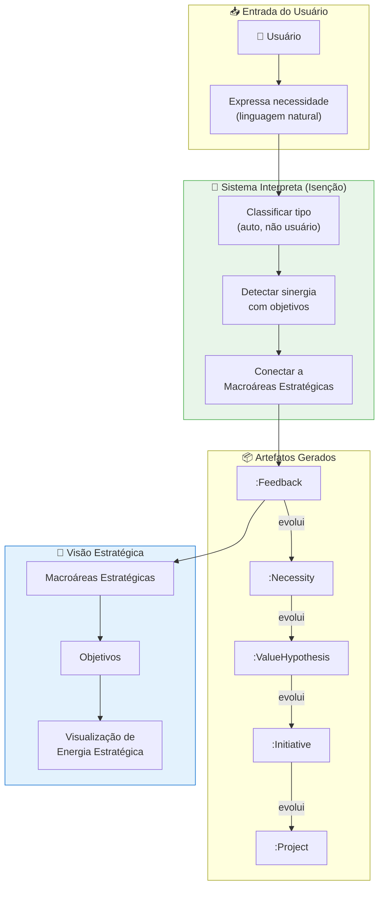

# Feature Specification: Strategic Feedback System

**Feature Branch**: `055-strategic-feedback-system`  
**Created**: 2025-02-01  
**Status**: Draft  
**Priority**: P1 (Core Experience)  
**Source**: chat02_11.txt, chat02_20.txt (conceito de feedback estratégico + saúde estratégica)

---

## Purpose

Criar um sistema de **feedback estratégico** que transforma o usuário de consumidor de conhecimento em **sensor ativo do sistema**. O feedback aqui **não é sistema de erros** — é captura de intenção, necessidades não atendidas, e hipóteses de valor que podem evoluir para projetos.

> *"Todo projeto nasce como feedback estruturado."*

### Princípio Core: Feedback ≠ Erro

| Sistema de Erro | Sistema de Feedback Estratégico |
|-----------------|--------------------------------|
| Reporte de bug | Sinalização de necessidade |
| Falha do sistema | Intenção futura |
| Reativo | Proativo |
| Corrigir | Evoluir |
| Usuário reporta problema | Usuário expressa expectativa |

O feedback é **infraestrutura**, não feature acessória.

---

## Process Flow (Business View)



### Pipeline de Evolução

```
Feedback → Necessidade → Hipótese de Valor → Iniciativa → Projeto → Impacto
```

O feedback **não vira projeto automaticamente**, mas ele:
- Já nasce **classificável** (pelo sistema)
- Já nasce **conectável** (a objetivos)
- Já nasce **avaliável** (potencial de impacto)
- Já nasce **rastreável** (gênese preservada)

---

## Conceitos Fundamentais

### 1. Separação de Papéis: Humano ≠ Classificador Estratégico

> **O humano sinaliza. O sistema interpreta.**

O usuário **NÃO deve**:
- Classificar impacto estratégico
- Declarar alinhamento com objetivos
- "Escolher" objetivo afetado

Porque isso:
- Introduz viés político
- Distorce leitura sistêmica
- Transforma feedback em autopromoção

O EKS opera como **leitor estrutural da realidade**, não como espelho da narrativa individual.

### 2. Leitura de Sinergia como Capacidade Nativa

O sistema lê a atividade, a proposta, o contexto e **detecta sinergias por padrão**, não por declaração.

**O que o EKS lê (implicitamente)**:
- Conteúdo semântico do feedback
- Área operacional afetada
- Tipo de ganho implícito
- Contexto de uso onde surgiu
- Histórico de iniciativas semelhantes
- Relações já existentes no grafo

**O que o EKS projeta**:
- Provável objetivo estratégico tocado
- Macroárea estratégica associada
- Iniciativas correlatas existentes
- Densidade de esforço naquele eixo

### 3. Proposta ≠ Decisão

O EKS:
- **Não decide** estratégia
- **Não fecha** interpretação
- **Não carimba** verdade

Ele **propõe leituras estruturais**:
- *"Esta iniciativa parece reforçar X"*
- *"Há convergência com Y"*
- *"Este eixo está recebendo mais energia"*
- *"Este objetivo parece subatendido"*

A validação pode:
- Acontecer tacitamente (ninguém contesta)
- Ser ajustada por alguém com papel estratégico
- Ou simplesmente **não acontecer** — e tudo bem

O valor está na **visibilidade**, não na confirmação.

### 4. Macroáreas Estratégicas

> *"Objetivos estratégicos são abstratos demais para o dia a dia."*

A solução é criar uma **camada semântica intermediária**:

```
Missão / Visão
   ↓
Objetivos Estratégicos
   ↓
Macroáreas Estratégicas (vetores de ataque)
   ↓
Iniciativas / Projetos / Melhorias
```

As **macroáreas** funcionam como:
- Eixos de esforço
- Campos de energia estratégica
- Zonas de investimento cognitivo e operacional

**Exemplos genéricos**:
- Eficiência Operacional
- Inteligência de Decisão
- Experiência do Cliente
- Redução de Risco
- Inovação de Produto

---

## Modelo de Dados

### Entidades Principais

```cypher
// Feedback como nó vivo (não ticket, não formulário)
(:Feedback {
  id: string,
  content: string,              // Linguagem natural do usuário
  
  // Classificação automática (pelo sistema)
  perceived_type: string,       // "improvement" | "new_capability" | "new_query" | "new_vision"
  affected_object: string,      // "information" | "process" | "decision" | "interface"
  implicit_intent: string,      // "reduce_effort" | "increase_clarity" | "anticipate_risk" | "accelerate_decision"
  
  // Ganho projetado (pelo sistema)
  cognitive_gain: float,        // 0.0-1.0
  operational_gain: float,      // 0.0-1.0
  strategic_gain: float,        // 0.0-1.0
  
  // Metadados
  status: string,               // "new" | "analyzed" | "promoted" | "archived"
  created_at: datetime,
  analyzed_at: datetime,
  
  // Gênese (preservada)
  context_description: string   // Em qual contexto surgiu
})

// Macroárea Estratégica (camada intermediária)
(:StrategicArea {
  id: string,
  name: string,                 // "Eficiência Operacional", "Inteligência de Decisão"
  description: string,
  owner_id: string,
  status: string,               // "active" | "archived"
  created_at: datetime
})

// Necessidade (evolução de feedback)
(:Necessity {
  id: string,
  title: string,
  description: string,
  priority: string,             // "low" | "medium" | "high" | "critical"
  status: string,               // "identified" | "validated" | "addressed"
  created_at: datetime
})

// Hipótese de Valor
(:ValueHypothesis {
  id: string,
  title: string,
  hypothesis: string,           // "Se fizermos X, então Y"
  expected_gain: string,
  validation_criteria: string,
  status: string,               // "proposed" | "testing" | "validated" | "rejected"
  created_at: datetime
})

// Iniciativa (pré-projeto)
(:Initiative {
  id: string,
  title: string,
  description: string,
  estimated_effort: string,
  expected_impact: string,
  status: string,               // "draft" | "approved" | "in_progress" | "completed"
  created_at: datetime
})
```

### Relacionamentos

```cypher
// Gênese e autoria
(:User)-[:SIGNALED]->(:Feedback)
(:Feedback)-[:EMERGED_IN_CONTEXT]->(:Department|:Process|:Conversation)

// Conexões estratégicas (inferidas pelo sistema)
(:Feedback)-[:INFERRED_SUPPORTS {
  confidence: float,
  inferred_by: string,          // "system"
  inferred_at: datetime
}]->(:Objective)

(:Feedback)-[:INFERRED_AFFECTS {
  confidence: float
}]->(:StrategicArea)

// Pipeline de evolução
(:Feedback)-[:EVOLVED_TO]->(:Necessity)
(:Necessity)-[:EVOLVED_TO]->(:ValueHypothesis)
(:ValueHypothesis)-[:EVOLVED_TO]->(:Initiative)
(:Initiative)-[:EVOLVED_TO]->(:Project)

// Reconhecimento de autoria (não pontuação)
(:Initiative)-[:ORIGINATED_FROM]->(:Feedback)
(:Project)-[:ORIGINATED_FROM]->(:Feedback)

// Macroáreas ligam Objetivos a Iniciativas
(:StrategicArea)-[:SERVES]->(:Objective)
(:Initiative)-[:CONTRIBUTES_TO]->(:StrategicArea)
(:Feedback)-[:SIGNALS_NEED_IN]->(:StrategicArea)
```

---

## User Scenarios & Testing

### User Story 1 – Expressar Necessidade (Priority: P0)

Usuário quer indicar uma necessidade sem preencher formulário burocrático.

**Acceptance Scenarios**:

1. **Given** área de feedback disponível, **When** usuário escreve em linguagem natural "Gostaria de poder ver relatório de vendas por região", **Then** sistema captura como `:Feedback` e classifica automaticamente como `perceived_type: new_query`, `affected_object: information`

2. **Given** feedback capturado, **When** sistema analisa, **Then** infere conexão com objetivos estratégicos SEM perguntar ao usuário

3. **Given** feedback classificado, **When** usuário visualiza, **Then** vê a interpretação do sistema com opção de complementar (não obrigatório)

---

### User Story 2 – Visualizar Energia Estratégica (Priority: P1)

Líder quer ver onde os esforços/feedbacks estão concentrados em relação aos objetivos.

**Acceptance Scenarios**:

1. **Given** múltiplos feedbacks coletados, **When** líder abre dashboard estratégico, **Then** vê visualização de densidade por Macroárea (quais estão "superalimentadas", quais estão "órfãs")

2. **Given** objetivo estratégico com pouco feedback, **When** sistema detecta, **Then** destaca como "subatendido" (não como falha, como informação)

3. **Given** múltiplos feedbacks convergindo na mesma direção, **When** sistema detecta padrão, **Then** sinaliza como "sinergia emergente"

---

### User Story 3 – Rastrear Gênese de Projeto (Priority: P1)

Qualquer pessoa quer saber de onde veio uma iniciativa/projeto.

**Acceptance Scenarios**:

1. **Given** projeto em execução, **When** usuário consulta origem, **Then** sistema mostra cadeia completa: Feedback original → quem sinalizou → em qual contexto → qual objetivo tocou

2. **Given** iniciativa aprovada, **When** exibida, **Then** mostra reconhecimento contextual do autor original (não pontos, mas menção: "Iniciativa originada por João, Comercial")

---

### User Story 4 – Feedback Evolui para Projeto (Priority: P2)

Gestor quer promover feedback relevante para projeto formal.

**Acceptance Scenarios**:

1. **Given** feedback com alto potencial estratégico (inferido), **When** gestor avalia, **Then** pode promover para `:Necessity` → `:ValueHypothesis` → `:Initiative` → `:Project`

2. **Given** promoção realizada, **When** projeto é criado, **Then** mantém vínculo `[:ORIGINATED_FROM]` com feedback original (gênese preservada)

---

## Functional Requirements

### Captura de Feedback

- **REQ-FB-001**: Sistema DEVE permitir feedback em linguagem natural (chat ou formulário mínimo)
- **REQ-FB-002**: Sistema DEVE classificar automaticamente `perceived_type`, `affected_object`, `implicit_intent`
- **REQ-FB-003**: Sistema NÃO DEVE exigir que usuário classifique impacto estratégico
- **REQ-FB-004**: Sistema DEVE preservar contexto de onde feedback surgiu (gênese)

### Inferência de Sinergia

- **REQ-FB-005**: Sistema DEVE inferir conexão com objetivos estratégicos automaticamente
- **REQ-FB-006**: Sistema DEVE inferir Macroárea afetada com confidence score
- **REQ-FB-007**: Sistema DEVE detectar convergência de múltiplos feedbacks
- **REQ-FB-008**: Inferências DEVEM ser propostas, não impostas (usuário pode ajustar)

### Visualização Estratégica

- **REQ-FB-009**: Dashboard DEVE mostrar densidade de feedbacks por Macroárea
- **REQ-FB-010**: Dashboard DEVE destacar objetivos "subatendidos" (pouco feedback)
- **REQ-FB-011**: Dashboard DEVE mostrar sinergias emergentes (convergências)
- **REQ-FB-012**: Visualização DEVE ser agregada, não por usuário individual (evitar ranking)

### Evolução e Gênese

- **REQ-FB-013**: Sistema DEVE suportar pipeline: Feedback → Necessity → Hypothesis → Initiative → Project
- **REQ-FB-014**: Cada promoção DEVE preservar vínculo `[:ORIGINATED_FROM]`
- **REQ-FB-015**: Qualquer artefato DEVE permitir rastrear gênese completa
- **REQ-FB-016**: Reconhecimento DEVE ser contextual (menção), não numérico (pontos)

### Isenção

- **REQ-FB-017**: Classificação estratégica DEVE ser feita pelo sistema, não pelo usuário
- **REQ-FB-018**: Sistema DEVE permitir ajuste humano, mas como "novo sinal", não como verdade final
- **REQ-FB-019**: Erros de classificação DEVEM ser observáveis, rastreáveis e corrigíveis

---

## Cálculo de Ganho (Não Financeiro)

O EKS calcula ganho potencial de forma **cognitivo-operacional**, não ROI financeiro.

### Tipos de Ganho

| Tipo | Descrição | Indicadores |
|------|-----------|-------------|
| **Ganho Cognitivo** | Redução de ambiguidade, aumento de previsibilidade | Clareza, menos retrabalho |
| **Ganho Operacional** | Tempo economizado, decisões antecipadas | Eficiência, velocidade |
| **Ganho Estratégico** | Alinhamento com objetivos, mitigação de risco | Coerência, prevenção |

Esses ganhos **não precisam ser exatos**, precisam ser **comparáveis**.

> O sistema não decide sozinho. Ele **organiza o argumento**.

---

## Reconhecimento Contextual (Não Gamificação)

### O que NÃO fazemos

- Rankings
- Pontos
- "Bolsa de valores" de pessoas
- Competição

### O que fazemos

Reconhecimento **narrativo e histórico**:

- *"Contribuiu para a evolução do sistema X"*
- *"Originou uma melhoria estratégica"*
- *"Levantou uma necessidade crítica antes de se tornar problema"*
- *"Ajudou a estruturar a visão Y"*

Isso cria:
- Senso de pertencimento estrutural
- Validação de contribuição real
- Motivação intrínseca
- **Não incentiva comportamento artificial**

---

## Saúde Estratégica (Conceito Core)

> *"Medir a força do negócio sem ser tendencioso."* (chat02_20)

O sistema mede **saúde estratégica** de forma isenta, baseado em:

| Indicador | Descrição | O que revela |
|-----------|-----------|-------------|
| **Coerência** | Alinhamento entre intenção (feedbacks) e execução (projetos) | Se a organização faz o que diz que precisa |
| **Densidade** | Quantidade de iniciativas por objetivo | Onde está o esforço real |
| **Equilíbrio** | Distribuição entre macroáreas | Se há concentração excessiva ou áreas negligenciadas |
| **Convergência** | Feedbacks independentes apontando mesma direção | Sinais emergentes da organização |

Isso só é possível quando:
- Input humano é **bruto** (sem classificação estratégica)
- Leitura estratégica é **sistêmica** (feita pelo EKS)
- Visualização é **agregada** (não individual)

---

## Success Criteria

1. **Captura Natural**: 80% dos feedbacks são capturados em linguagem natural sem fricção
2. **Classificação Precisa**: 85% das classificações automáticas validadas como corretas
3. **Conexão Estratégica**: 90% dos feedbacks conectados a pelo menos uma Macroárea
4. **Gênese Preservada**: 100% dos projetos permitem rastrear feedback original
5. **Visualização Útil**: Líderes identificam gaps estratégicos em <30 segundos
6. **Isenção**: 0% de classificações estratégicas feitas pelo usuário (sistema faz)
7. **Equilíbrio Visível**: Dashboard mostra distribuição de esforços por macroárea

---

## Dependencies

- **Spec 040** (Business Intent Graph) - Objetivos e OKRs
- **Spec 020** (Ressonância) - Notificações semânticas de impacto
- **Spec 015** (Graph Model) - Labels canônicos
- **Spec 050** (Meta-Graph) - Query Profiles

---

## Related Specs

- **020-gamification-user-kpis**: Ressonância complementa feedback (notifica quando feedback vira projeto)
- **040-business-intent-graph**: BIG fornece objetivos; esta spec adiciona Macroáreas
- **021-notification-center**: Notificações de evolução de feedback
- **022-onboarding-ai-profile**: PKP pode capturar feedbacks durante onboarding

---

## Notas Conceituais

> *"O EKS não gamifica contribuição. Ele revela conexão."*

> *"Feedback aqui é infraestrutura, não feature."*

> *"O humano sinaliza. O sistema interpreta."*

> *"O valor está na visibilidade, não na confirmação."*

Este sistema transforma o EKS de:
- "Um sistema que armazena conhecimento"

Para:
- **"Um sistema que organiza intenção coletiva em direção à missão"**

---

**Última Atualização**: 2025-02-02 (chat02_20: saúde estratégica + equilíbrio)
