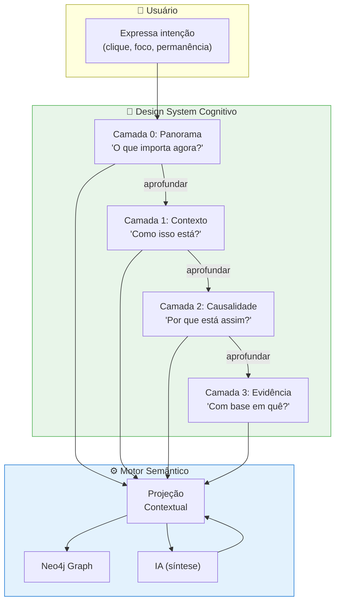

# Feature Specification: Cognitive Design System (DSC)

**Feature Branch**: `056-cognitive-design-system`  
**Created**: 2025-02-02  
**Status**: Draft  
**Priority**: P1 (Core Experience)  
**Source**: chat02_19.txt (design system cognitivo inspirado no PS5)

---

## Purpose

Definir um **Design System Cognitivo (DSC)** para o EKS que trata o front-end como **superfície de exposição cognitiva**, não como interface de dados. Inspirado no PS5 como metáfora funcional (não estética), o sistema projeta **estados de conhecimento** do grafo com progressive disclosure controlado.

> *"O front-end não representa dados. Ele representa estados de conhecimento."*

### Princípio Fundacional

Tudo no sistema responde à pergunta implícita:

> *"O que é relevante agora, neste nível de atenção?"*

---

## Process Flow (Business View)



### O que NÃO é este sistema

| ❌ Anti-padrão | ✅ Abordagem DSC |
|---------------|-----------------|
| Portal de documentos | Hub de estados cognitivos |
| Wiki corporativa | Projeções contextuais do grafo |
| Dashboard de BI clássico | Sínteses dinâmicas |
| Chat como interface principal | Chat como mecanismo auxiliar |
| Listas longas | Cards sintéticos (5 segundos) |
| Drill-down infinito | Profundidade controlada (4 camadas) |

---

## Primitivas Cognitivas (Átomos do Sistema)

### 1. Estado

Um **Estado** é uma projeção temporária do grafo.

**Características**:
- Sempre atual
- Sempre resumido
- Sempre contextual

**Exemplos**:
- "Projetos críticos em atenção"
- "Risco regulatório elevado"
- "Estratégia desalinhada com execução"

### 2. Foco

O **Foco** é a intenção ativa do usuário.

- **Explícito**: clique, seleção
- **Implícito**: tempo de permanência, sequência de navegação

> O sistema **nunca assume foco sem evidência**.

### 3. Âncora Semântica

Substitui tags e links tradicionais.

Uma âncora:
- Representa uma entidade, relação ou evento
- É clicável
- Gera nova projeção do grafo

**Exemplos**:
- `Projeto Atlas`
- `Meta OKR Q2`
- `Área Fiscal`
- `Decisão 12/01`

### 4. Profundidade

Profundidade é **controlada**, nunca automática.

- Cada interação desce **exatamente um nível**
- Não existem saltos longos
- Usuário sempre sabe onde está

---

## Camadas de Conhecimento (Arquitetura)

### Camada 0 — Panorama

**Pergunta**: *"O que importa agora?"*

- Visão executiva
- Sem detalhes
- Alta densidade semântica
- 3–5 insights sintéticos por card

**Telas canônicas**:
- Estado da Empresa
- Projetos
- Estratégia & KPIs
- Risco & Compliance
- Áreas / Departamentos
- Resultados recentes

### Camada 1 — Contexto

**Pergunta**: *"Como isso está?"*

- Um elemento em foco
- Estado atual
- Relações imediatas

### Camada 2 — Causalidade

**Pergunta**: *"Por que está assim?"*

- Dependências
- Impactos cruzados
- Tensões e conflitos

### Camada 3 — Evidência

**Pergunta**: *"Com base em quê?"*

- Decisões
- Reuniões
- Documentos
- Eventos

⚠️ **Regra crítica**: Nunca entrar automaticamente na camada 3.

---

## Componentes Cognitivos

### Card Cognitivo

O **Card** é a unidade principal da interface.

**Propriedades obrigatórias**:
- Título semântico (não técnico)
- 3–5 frases de síntese
- Indicadores de estado (tendência, alerta, estabilidade)
- Gatilho único de aprofundamento

**Regra de ouro**:
> Um card deve ser compreendido em **até 5 segundos**.

**Estrutura mínima**:
```
┌─────────────────────────────────────┐
│ 📊 Projetos em Execução            │
│                                     │
│ • 3 projetos com atraso crítico     │
│ • Atlas: dependência bloqueada      │
│ • Q2 abaixo da meta em 12%          │
│                                     │
│ [↘️ tendência negativa]             │
│                                     │
│         [Aprofundar →]              │
└─────────────────────────────────────┘
```

### Tela como Conjunto de Estados

Uma **Tela** não é uma página. É uma **coleção coerente de estados**.

Cada tela responde a **uma pergunta primária**.

### Trilha Cognitiva (Breadcrumb Semântico)

O sistema mantém sempre visível:
- Onde o usuário está
- Por quais estados passou

**Exemplo**:
```
Empresa → Projetos → Projeto Atlas → Riscos
```

Isso evita **desorientação cognitiva**, comum em sistemas baseados em grafos.

---

## Navegação Cognitiva

### Regra Central

> **Não se navega por menus. Se navega por intenção.**

### Tipos de Interação

#### 1. Aprofundar

Desce uma camada mantendo contexto.

#### 2. Reenquadrar

Troca o ponto de vista mantendo o elemento.

**Exemplo**:
- Projeto → visão estratégica
- Projeto → visão financeira
- Projeto → visão operacional

#### 3. Expandir Relações

Mostra **o que mais é afetado**, não "detalhes".

---

## Papel da IA no DSC

A IA **não é o front-end**. Ela é o **motor semântico**.

### Responsabilidades da IA

- Sintetizar estados
- Ajustar linguagem ao perfil do usuário
- Controlar profundidade
- Resolver ambiguidades de foco

### O que a IA NÃO faz

- Não decide layout
- Não cria telas arbitrárias
- Não despeja informação bruta

---

## Modelo de Dados

### Entidades de Navegação

```cypher
// Estado cognitivo (projeção temporária)
(:CognitiveState {
  id: string,
  layer: int,                    // 0-3
  primary_question: string,      // "O que importa agora?"
  entities_in_focus: [string],   // IDs dos nós em foco
  generated_at: datetime,
  ttl_seconds: int               // Tempo de vida da projeção
})

// Trilha cognitiva do usuário
(:CognitiveTrail {
  id: string,
  user_id: string,
  session_id: string,
  path: [string],                // ["Empresa", "Projetos", "Atlas", "Riscos"]
  current_layer: int,
  started_at: datetime
})

// Âncora semântica
(:SemanticAnchor {
  id: string,
  label: string,                 // "Projeto Atlas"
  entity_type: string,           // "Project", "Objective", "Decision"
  entity_id: string,             // Referência ao nó real
  context_hint: string           // Dica para IA ao aprofundar
})
```

### Relacionamentos

```cypher
// Navegação
(:User)-[:NAVIGATING]->(:CognitiveTrail)
(:CognitiveTrail)-[:CURRENT_STATE]->(:CognitiveState)
(:CognitiveState)-[:PROJECTS_FROM]->(:Node)  // Qualquer nó do grafo

// Âncoras
(:CognitiveState)-[:CONTAINS_ANCHOR]->(:SemanticAnchor)
(:SemanticAnchor)-[:REFERENCES]->(:Node)
```

---

## User Scenarios & Testing

### User Story 1 – Visão Executiva Rápida (Priority: P0)

Líder quer entender estado da empresa em segundos.

**Acceptance Scenarios**:

1. **Given** usuário abre tela inicial, **When** carrega Camada 0, **Then** vê cards de estados principais (Projetos, KPIs, Riscos) compreensíveis em <5 segundos cada

2. **Given** card mostra alerta, **When** usuário clica em "Aprofundar", **Then** desce para Camada 1 mantendo contexto visual (trilha cognitiva visível)

3. **Given** usuário na Camada 2, **When** quer voltar, **Then** pode subir camadas pela trilha sem perder orientação

---

### User Story 2 – Navegação por Intenção (Priority: P0)

Usuário quer saber "como está aquele projeto" sem navegar por menus.

**Acceptance Scenarios**:

1. **Given** card com âncora semântica "Projeto Atlas", **When** usuário clica, **Then** sistema gera nova projeção contextual (IA sintetiza estado atual do projeto)

2. **Given** projeção gerada, **When** exibida, **Then** NÃO mostra página fixa; mostra síntese dinâmica com relações relevantes (KPIs, riscos, decisões)

3. **Given** usuário quer mudar perspectiva, **When** seleciona "Reenquadrar → visão financeira", **Then** mesma entidade é projetada sob nova lente

---

### User Story 3 – Evitar Sobrecarga Cognitiva (Priority: P1)

Sistema protege usuário de excesso de informação.

**Acceptance Scenarios**:

1. **Given** tentativa de mostrar >5 itens em síntese, **When** sistema detecta, **Then** trunca e oferece "Ver mais em contexto"

2. **Given** usuário tenta drill-down infinito, **When** atinge Camada 3, **Then** sistema não oferece mais aprofundamento; oferece "Expandir relações" lateral

3. **Given** lista longa necessária, **When** exibida, **Then** é apresentada como expansão opcional, NUNCA como estado principal

---

## Functional Requirements

### Primitivas

- **REQ-DSC-001**: Sistema DEVE implementar 4 camadas de profundidade (0-3)
- **REQ-DSC-002**: Cada camada DEVE responder a uma pergunta primária explícita
- **REQ-DSC-003**: Sistema DEVE manter trilha cognitiva visível em todas as camadas
- **REQ-DSC-004**: Âncoras semânticas DEVEM gerar projeções contextuais (não páginas fixas)

### Cards Cognitivos

- **REQ-DSC-005**: Cards DEVEM ser compreensíveis em ≤5 segundos
- **REQ-DSC-006**: Cards DEVEM ter máximo 5 itens de síntese
- **REQ-DSC-007**: Cards DEVEM ter indicador visual de estado (tendência, alerta, estabilidade)
- **REQ-DSC-008**: Cards DEVEM ter gatilho único de aprofundamento

### Navegação

- **REQ-DSC-009**: Navegação DEVE ser por intenção, não por menus hierárquicos
- **REQ-DSC-010**: Sistema DEVE suportar Aprofundar, Reenquadrar, Expandir Relações
- **REQ-DSC-011**: Sistema NÃO DEVE permitir saltos de mais de 1 camada por vez
- **REQ-DSC-012**: Sistema DEVE permitir subir camadas pela trilha cognitiva

### Motor Semântico (IA)

- **REQ-DSC-013**: IA DEVE sintetizar estados a partir de query ao grafo
- **REQ-DSC-014**: IA DEVE ajustar linguagem ao perfil/persona do usuário
- **REQ-DSC-015**: IA NÃO DEVE decidir layout nem criar telas arbitrárias
- **REQ-DSC-016**: Projeções DEVEM ter TTL configurável (cache inteligente)

### Anti-padrões (Explicitamente Proibidos)

- **REQ-DSC-017**: Sistema NÃO DEVE exibir listas longas como estado principal
- **REQ-DSC-018**: Sistema NÃO DEVE permitir drill-down infinito
- **REQ-DSC-019**: Sistema NÃO DEVE usar "Ver mais" sem semântica
- **REQ-DSC-020**: Sistema NÃO DEVE ter dashboards com >6 elementos simultâneos
- **REQ-DSC-021**: Chat NÃO DEVE ser eixo principal da experiência

---

## Linguagem do Sistema (Microcopy Cognitivo)

O texto do front-end:
- É declarativo
- É sintético
- Nunca é técnico demais

### Exemplos Bons

- "Execução abaixo do esperado"
- "Risco emergente identificado"
- "Dependência crítica detectada"

### Exemplos Ruins

- "Erro de processamento"
- "Inconsistência de dados"
- "Status indefinido"

---

## Heurísticas de Validação

Antes de qualquer tela ir para produção:

1. **Dá para entender em 5 segundos?**
2. **Existe uma pergunta clara sendo respondida?**
3. **O próximo passo é óbvio?**
4. **O usuário sabe onde está?**
5. **O sistema evita excesso de profundidade?**

Se **qualquer resposta for não**, o design falhou.

---

## Success Criteria

1. **Compreensão Rápida**: 90% dos cards compreendidos em <5 segundos
2. **Orientação**: 95% dos usuários sabem onde estão (trilha cognitiva funcional)
3. **Profundidade Controlada**: 0% de drill-down além da Camada 3
4. **Síntese Efetiva**: 85% das projeções de IA consideradas úteis
5. **Anti-padrões**: 0 ocorrências de listas longas ou dashboards sobrecarregados
6. **Navegação por Intenção**: 70% das navegações via âncoras semânticas (não menus)

---

## Dependencies

- **Spec 015** (Graph Model) - Entidades a serem projetadas
- **Spec 024** (Retrieval Orchestration) - Queries para projeções
- **Spec 051** (CDC) - Níveis de profundidade de contexto
- **Spec 031** (Design System) - Componentes visuais base
- **Spec 016** (Main Interface Layout) - Estrutura Canvas/Chat/Menu

---

## Related Specs

- **031-design-system**: DSC usa componentes visuais do Design System técnico
- **016-main-interface-layout**: Layout estrutural; DSC define experiência cognitiva
- **051-context-depth-controller**: CDC controla profundidade técnica; DSC controla profundidade UX
- **022-onboarding-ai-profile**: Perfil do usuário influencia linguagem das sínteses

---

## Notas Conceituais

> *"O front-end não contém conhecimento; ele projeta estados resumidos do grafo."*

> *"Não se navega por menus. Se navega por intenção."*

> *"A IA não é o front-end. Ela é o motor semântico."*

> *"Um card deve ser compreendido em até 5 segundos."*

Este sistema é **mediação entre grafos complexos e cognição humana**.
Está **anos à frente** de dashboards, wikis e chats corporativos tradicionais.

---

**Última Atualização**: 2025-02-02 (chat02_19)
