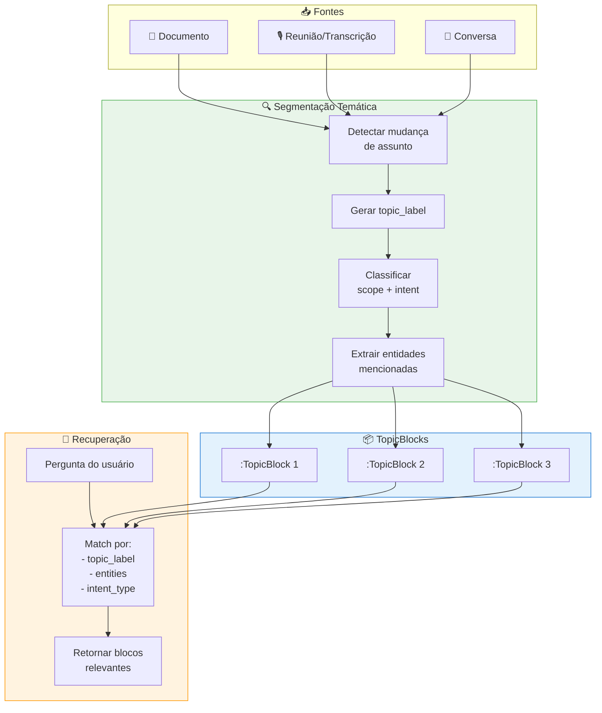
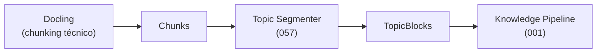

# Feature Specification: Topic Block & Retrieval-Oriented Ontology

**Feature Branch**: `057-topic-block-retrieval`  
**Created**: 2025-02-02  
**Status**: Draft  
**Priority**: P0 (Foundation)  
**Source**: chat02_18.txt (ontologia orientada à recuperação + TopicBlock)

---

## Purpose

Definir o **TopicBlock** como unidade primária de recuperação de conhecimento e estabelecer uma **ontologia orientada à busca** - onde a estrutura nasce para a query, não antes.

> *"Conhecimento corporativo só é útil se for recuperável sob intenção."*

### Princípio Fundacional

A pergunta correta **não é**:
> "Que tags colocar?"

A pergunta correta **é**:
> **"Que perguntas eu quero que o sistema consiga responder?"**

---

## Conceitos Core

### TopicBlock ≠ Chunk ≠ Statement

| Conceito | Spec | Propósito | Granularidade |
|----------|------|-----------|---------------|
| **Chunk** | 015 | Técnico (embedding, busca vetorial) | Arbitrário (tokens) |
| **Statement** | 053 | Validação (claim → fact) | Afirmação única |
| **TopicBlock** | 057 (esta) | **Recuperação temática** | Bloco de assunto |

O **TopicBlock** é o equivalente semântico de um **capítulo** ou **seção de sumário**.

### Sumário Conversacional

> *"Documento com sumário é muito mais fácil de recuperar."*

O mesmo princípio se aplica a **reuniões e conversas**:
- Documento → seções → TopicBlocks
- Reunião → segmentos → TopicBlocks

O sumário conversacional **não é resumo para leitura** - é **índice para recuperação**.

---

## Process Flow (Business View)



---

## Macro-Áreas Universais de Conhecimento Empresarial

*(O "esqueleto cognitivo" - sempre existem, mesmo quando não formalizadas)*

### 1. Direção & Intenção

**Conhecimento normativo e orientador**

- Visão, Missão, Valores
- Estratégia
- OKRs / KPIs

**Perguntas que recuperam**:
- "Essa decisão está alinhada com a estratégia?"
- "Quais projetos violam valores?"

### 2. Estrutura Organizacional

**Quem é quem e como o poder flui**

- Pessoas, Papéis, Times / Áreas
- Hierarquia (formal ou funcional)

**Perguntas que recuperam**:
- "Quem decide isso?"
- "Quem foi impactado por essa decisão?"

### 3. Operação & Execução

**Onde o trabalho acontece**

- Processos, Projetos, Tarefas
- Backlog, Dependências

**Perguntas que recuperam**:
- "O que está atrasando esse projeto?"
- "Que tarefas dependem dessa decisão?"

### 4. Conhecimento Vivo (O CORAÇÃO)

**Onde o conhecimento nasce antes de virar documento**

- Reuniões, Transcrições
- Decisões, Discussões
- Argumentações

**Perguntas que recuperam**:
- "Por que decidimos isso?"
- "Quem discordou e por quê?"

> 👉 **Documento é memória morta; reunião é cognição ativa.**

### 5. Ativos de Conhecimento

**Materialização do saber**

- Documentos, Planilhas, PDFs
- Slides, Código

**Perguntas que recuperam**:
- "Mostre evidências"
- "Qual documento sustenta essa decisão?"

### 6. Relações Externas

**A empresa não existe isolada**

- Clientes, Fornecedores
- Parceiros, Reguladores

**Perguntas que recuperam**:
- "Qual impacto disso no cliente X?"
- "O que esse fornecedor influencia?"

---

## Modelo de Dados

### TopicBlock (Nó Principal)

```cypher
(:TopicBlock {
  id: string,
  
  // Identificação temática
  topic_label: string,           // "Atraso Projeto Alpha", "Risco Regulatório"
  topic_keywords: [string],      // Palavras-chave derivadas
  
  // Classificação de recuperação
  scope: string,                 // "strategy" | "project" | "client" | "operation" | "decision"
  intent_type: string,           // "decision" | "analysis" | "problem" | "action" | "information"
  
  // Entidades mencionadas (para graph traversal)
  entities_mentioned: [string],  // IDs de Project, Client, Person, KPI...
  
  // Localização na fonte
  source_type: string,           // "document" | "meeting" | "chat"
  source_id: string,             // Referência ao documento/reunião original
  time_range_start: string,      // "00:05:30" (para reuniões) ou null
  time_range_end: string,        // "00:12:45" ou null
  section_index: int,            // Para documentos: posição da seção
  
  // Conteúdo
  raw_text: string,              // Texto original do bloco
  summary: string,               // Síntese do bloco (para display)
  
  // Metadados de qualidade
  confidence_level: string,      // "explicit" | "implicit" | "inferred"
  extraction_method: string,     // "tiling" | "llm" | "manual"
  
  // Temporais
  created_at: datetime,
  valid_from: datetime,          // Quando o conteúdo foi gerado
  
  // Embedding
  embedding_id: string           // Para busca vetorial complementar
})
```

### Relacionamentos

```cypher
// Origem
(:Document)-[:HAS_TOPIC_BLOCK]->(:TopicBlock)
(:Meeting)-[:HAS_TOPIC_BLOCK]->(:TopicBlock)
(:Conversation)-[:HAS_TOPIC_BLOCK]->(:TopicBlock)

// Entidades mencionadas (graph traversal)
(:TopicBlock)-[:MENTIONS {
  mention_type: string,          // "subject" | "stakeholder" | "reference"
  confidence: float
}]->(:Project | :Person | :Client | :KPI | :Objective)

// Derivações
(:TopicBlock)-[:CONTAINS_DECISION]->(:Decision)
(:TopicBlock)-[:CONTAINS_TASK]->(:Task)
(:TopicBlock)-[:CONTAINS_RISK]->(:Risk)
(:TopicBlock)-[:CONTAINS_INSIGHT]->(:Insight)

// Sequência (ordem no documento/reunião)
(:TopicBlock)-[:FOLLOWED_BY]->(:TopicBlock)

// Correlação semântica
(:TopicBlock)-[:RELATED_TO {
  similarity: float,
  relation_type: string          // "continuation" | "contrast" | "elaboration"
}]->(:TopicBlock)
```

---

## Tipos Mínimos de Relacionamentos (Orientados à Recuperação)

Poucos, bem semânticos, **reutilizáveis**:

| Relacionamento | Recupera | Exemplo de Query |
|---------------|----------|------------------|
| `PARTICIPATED_IN` | Quem esteve onde | "Quem participou da decisão X?" |
| `DECIDED_IN` | Onde decisões foram tomadas | "Onde decidimos sobre Y?" |
| `IMPACTS` | Consequências | "O que é impactado por Z?" |
| `DEPENDS_ON` | Dependências | "Do que isso depende?" |
| `ALIGNS_WITH` | Alinhamento estratégico | "Isso alinha com qual objetivo?" |
| `CONFLICTS_WITH` | Contradições | "O que conflita com isso?" |
| `DOCUMENTS` | Evidências | "Onde está documentado?" |
| `OWNS` | Responsabilidade | "Quem é responsável?" |

---

## Segmentação Temática (Text Tiling)

### Algoritmo Conceitual

1. **Detectar mudança de assunto** (text tiling / LLM)
2. **Gerar label semântico** para cada bloco
3. **Classificar scope e intent_type**
4. **Extrair entidades mencionadas**
5. **Criar relacionamentos com grafo existente**

### Estrutura Mínima de um TopicBlock

Cada bloco nasce já com **hipótese de recuperação** embutida:

```
TopicBlock
├── topic_label        → "Atraso Projeto Alpha"
├── scope              → "project"
├── entities_mentioned → [Project:alpha, Person:joao, KPI:deadline]
├── intent_type        → "problem"
├── time_range         → 05:30 → 12:45
└── confidence_level   → "explicit"
```

Isso responde implicitamente:

> "Se alguém procurar por X, este trecho deveria aparecer?"

---

## User Scenarios & Testing

### User Story 1 – Recuperação por Tema (Priority: P0)

Usuário quer encontrar onde se falou sobre determinado assunto.

**Acceptance Scenarios**:

1. **Given** reunião processada com 10 TopicBlocks, **When** usuário pergunta "O que foi decidido sobre o Projeto Alpha?", **Then** sistema retorna TopicBlocks com `entities_mentioned: Project:alpha` e `intent_type: decision`

2. **Given** múltiplas reuniões sobre mesmo tema, **When** usuário pergunta "Histórico de discussões sobre risco regulatório", **Then** sistema retorna TopicBlocks ordenados cronologicamente com `topic_label` contendo "risco" ou "regulatório"

3. **Given** TopicBlock com baixa confidence, **When** retornado, **Then** sistema indica "inferido" vs "explícito"

---

### User Story 2 – Sumário de Reunião como Índice (Priority: P0)

Sistema gera sumário navegável de reunião.

**Acceptance Scenarios**:

1. **Given** transcrição de reunião de 1h, **When** processada, **Then** sistema gera 5-15 TopicBlocks com topic_labels legíveis

2. **Given** sumário gerado, **When** usuário clica em TopicBlock, **Then** navega para trecho específico da transcrição (time_range)

3. **Given** reunião com decisões, **When** processada, **Then** TopicBlocks com `intent_type: decision` têm relacionamento `[:CONTAINS_DECISION]`

---

### User Story 3 – Correlação Entre Blocos (Priority: P1)

Sistema detecta blocos relacionados em diferentes fontes.

**Acceptance Scenarios**:

1. **Given** TopicBlock em reunião A sobre "Projeto X", **When** documento B menciona mesmo projeto, **Then** sistema cria `[:RELATED_TO]` entre TopicBlocks

2. **Given** múltiplos blocos sobre mesmo tema, **When** usuário consulta, **Then** sistema agrupa por correlação, não por fonte

---

## Functional Requirements

### Segmentação

- **REQ-TB-001**: Sistema DEVE segmentar documentos e transcrições em TopicBlocks
- **REQ-TB-002**: Cada TopicBlock DEVE ter: `topic_label`, `scope`, `intent_type`, `entities_mentioned`
- **REQ-TB-003**: Segmentação DEVE detectar mudança de assunto (não chunking arbitrário)
- **REQ-TB-004**: Documentos com sumário DEVEM usar seções como base para TopicBlocks

### Classificação

- **REQ-TB-005**: Sistema DEVE classificar `scope` em: strategy, project, client, operation, decision
- **REQ-TB-006**: Sistema DEVE classificar `intent_type` em: decision, analysis, problem, action, information
- **REQ-TB-007**: Classificação DEVE ser automática com confidence_level indicado

### Extração de Entidades

- **REQ-TB-008**: Sistema DEVE extrair entidades mencionadas e linkar ao grafo
- **REQ-TB-009**: Entidades DEVEM incluir: Project, Person, Client, KPI, Objective, Department
- **REQ-TB-010**: Sistema DEVE criar entidades novas se não existirem (com flag `needs_review`)

### Recuperação

- **REQ-TB-011**: Queries DEVEM poder filtrar por: topic_label, scope, intent_type, entities_mentioned
- **REQ-TB-012**: Sistema DEVE suportar busca semântica (embedding) + estrutural (graph)
- **REQ-TB-013**: Resultados DEVEM ser ordenáveis por relevância e cronologia

### Derivações

- **REQ-TB-014**: TopicBlocks com `intent_type: decision` DEVEM gerar `:Decision` candidata
- **REQ-TB-015**: TopicBlocks com `intent_type: action` DEVEM gerar `:Task` candidata
- **REQ-TB-016**: TopicBlocks com `intent_type: problem` DEVEM gerar `:Risk` candidata
- **REQ-TB-017**: Derivações DEVEM manter `[:ORIGINATED_FROM]` para o TopicBlock

---

## Integração com Outras Specs

### Spec 013 - Ingestion Ecosystem



- TopicBlock é gerado **após** chunking técnico
- TopicBlock agrupa chunks relacionados por tema

### Spec 053 - Context Absorption

| Conceito 053 | Conceito 057 | Relação |
|--------------|--------------|---------|
| Episode | TopicBlock | TopicBlock pode ser derivado de Episode |
| Statement | Conteúdo de TopicBlock | Statements são extraídos de TopicBlocks |
| Claim | Derivações | Decisions/Tasks/Risks viram Claims |

### Spec 015 - Graph Model

| Conceito 015 | Conceito 057 | Relação |
|--------------|--------------|---------|
| Chunk | TopicBlock | Complementares: Chunk=técnico, TopicBlock=semântico |
| Knowledge | Derivações de TopicBlock | Knowledge pode emergir de TopicBlocks |

---

## Success Criteria

1. **Cobertura**: 90% das reuniões geram ≥5 TopicBlocks relevantes
2. **Precisão de Label**: 85% dos topic_labels considerados úteis pelo usuário
3. **Recuperação**: Queries por tema retornam TopicBlocks relevantes em ≥80% dos casos
4. **Derivações**: 70% das decisões/tarefas detectadas corretamente
5. **Performance**: Segmentação de reunião de 1h completa em <30s

---

## MVP (Começar Sem Travar)

> *"A versão final não existe. O refinamento é contínuo."*

### Nível 1 – Obrigatório

- Reunião / Documento → TopicBlocks (5–15 por artefato)
- topic_label gerado
- Entidades mencionadas explicitamente

### Nível 2 – Quando Der

- Classificação de scope/intent_type
- Detecção de decisão / ação

### Nível 3 – Contínuo

- Correlação entre blocos
- Refinamento automático baseado em feedback de recuperação

**Nada disso quebra o sistema se estiver incompleto. O grafo aceita assimetria.**

---

## Dependencies

- **Spec 013** (Ingestion) - Pipeline de entrada
- **Spec 015** (Graph Model) - Entidades base
- **Spec 024** (Retrieval) - Orchestration de queries
- **Spec 053** (Context Absorption) - Claims derivados

---

## Notas Conceituais

> *"Ontologia nasce para o grafo. Grafo nasce para a query. Query nasce da pergunta humana."*

> *"Tag tradicional responde 'sobre o que isso fala?'. TopicBlock responde 'quando alguém procurar por isso, por quê este trecho importa?'"*

> *"Documento e reunião viram apenas fontes diferentes de blocos temáticos."*

> *"Começar simples não é gambiarra, é estratégia epistemológica."*

Este sistema é o **átomo da memória organizacional** que **aprende com o uso**, não com design perfeito inicial.

---

**Última Atualização**: 2025-02-02 (chat02_18)
