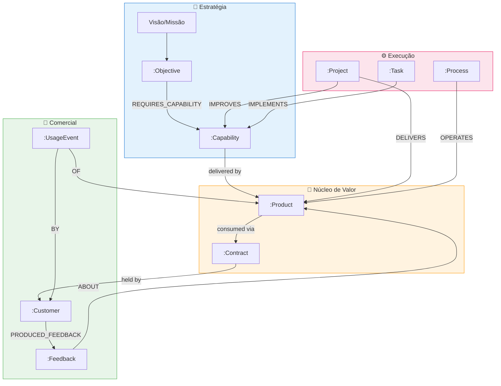
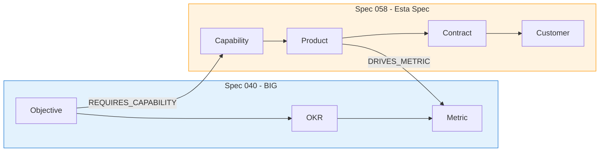

# Feature Specification: Product & Customer Ontology

**Feature Branch**: `058-product-customer-ontology`  
**Created**: 2025-02-02  
**Status**: Draft  
**Priority**: P1 (Core Commercial)  
**Source**: chat02_17.txt (modelagem de Produto/Serviço no EKS)

---

## Purpose

Modelar **Produto/Serviço** como "núcleo de valor" no EKS - o ponto onde **estratégia vira valor** e **cliente vira evidência**. Sem esta modelagem, o grafo é apenas organograma + gestão interna. Com ela, vira **sistema operacional de negócio**.

> *"Se você não modela produto, o grafo vira um organograma. Com produto, ele vira sistema operacional de negócio."*

---

## Conceito: Produto/Serviço como Núcleo de Valor

No grafo, **Produto/Serviço** é um *Value Artifact* com:

- **Identidade estável** (SKU, código interno, nome canônico)
- **Variantes/planos** (tiers, módulos, add-ons)
- **Capacidades entregues** (o que ele faz de fato)
- **Oferta comercial** (como é vendido/contratado)
- **Entrega operacional** (como é produzido/operado)
- **Evidências de consumo** (uso, SLAs, tickets, NPS, renovação)

---

## Process Flow (Business View)



### Caminho de Consulta Poderoso

Este modelo permite:

```
Objetivo → Capacidade → Produto → Cliente → Contrato → Projetos/Tarefas
```

---

## Modelo de Dados

### Entidades Principais

#### Product (Produto/Serviço)

```cypher
(:Product {
  id: string,                    // UUID
  product_id: string,            // Código interno (SKU)
  name_canonical: string,        // Nome oficial
  aliases: [string],             // Variações de nome
  
  type: string,                  // "product" | "service"
  lifecycle_stage: string,       // "idea" | "mvp" | "growth" | "mature" | "sunset"
  status: string,                // "active" | "deprecated" | "archived"
  
  description: string,
  value_proposition: string,     // O que entrega de valor
  
  pricing_model: string,         // "subscription" | "one_time" | "usage_based" | "freemium"
  
  owner_org_unit_id: string,     // Quem é dono
  
  created_at: datetime,
  updated_at: datetime
})
```

#### Customer (Cliente)

```cypher
(:Customer {
  id: string,
  customer_id: string,           // Código interno
  legal_name: string,
  trade_name: string,            // Nome fantasia
  
  segment: string,               // "enterprise" | "mid_market" | "smb" | "startup"
  industry: string,              // Setor
  
  status: string,                // "prospect" | "active" | "churned" | "archived"
  
  health_score: float,           // 0.0-1.0 (calculado)
  
  created_at: datetime,
  updated_at: datetime
})
```

#### Contract (Contrato/Assinatura)

```cypher
(:Contract {
  id: string,
  contract_id: string,
  
  start_date: date,
  end_date: date,
  
  status: string,                // "active" | "expired" | "cancelled" | "renewed"
  billing_model: string,         // "monthly" | "annual" | "multi_year"
  
  plan_tier: string,             // "basic" | "pro" | "enterprise"
  mrr: float,                    // Monthly Recurring Revenue
  
  auto_renew: boolean,
  
  created_at: datetime,
  updated_at: datetime
})
```

#### Capability (Capacidade)

```cypher
(:Capability {
  id: string,
  capability_id: string,
  
  name_canonical: string,
  description: string,
  
  domain: string,                // "Financeiro" | "Operações" | "Compliance" | "Core"
  maturity: string,              // "emerging" | "developing" | "mature" | "declining"
  
  status: string,                // "active" | "planned" | "deprecated"
  
  created_at: datetime,
  updated_at: datetime
})
```

### Entidades de Evidência (Opcionais, Evolutivas)

```cypher
// Feedback de cliente
(:Feedback {
  id: string,
  type: string,                  // "nps" | "csat" | "feature_request" | "complaint"
  score: float,
  content: string,
  created_at: datetime
})

// Evento de uso
(:UsageEvent {
  id: string,
  event_type: string,
  metric_value: float,
  timestamp: datetime
})

// SLA
(:SLA {
  id: string,
  metric: string,                // "uptime" | "response_time" | "resolution_time"
  target: float,
  unit: string
})

// Incidente
(:Incident {
  id: string,
  severity: string,
  status: string,
  created_at: datetime,
  resolved_at: datetime
})
```

---

## Relacionamentos

### Core Comercial (Valor e Consumo)

```cypher
// Cliente consome produto (alto nível)
(:Customer)-[:CONSUMES]->(:Product)

// Cliente tem contrato para produto (detalhe comercial)
(:Customer)-[:HAS_CONTRACT]->(:Contract)
(:Contract)-[:FOR_PRODUCT]->(:Product)

// Produto entrega capacidades
(:Product)-[:DELIVERS {
  delivery_type: string          // "core" | "add_on" | "premium"
}]->(:Capability)

// Contrato tem SLA
(:Contract)-[:HAS_SLA]->(:SLA)
```

### Conexão com Estratégia

```cypher
// Objetivos estratégicos requerem capacidades
(:Objective)-[:REQUIRES_CAPABILITY {
  priority: string,              // "critical" | "important" | "nice_to_have"
  target_date: date
}]->(:Capability)

// Produto impulsiona métricas de valor
(:Product)-[:DRIVES_METRIC]->(:Metric)
// Ex: "reduzir churn", "aumentar margem", "tempo de onboarding"
```

### Conexão com Execução

```cypher
// Projeto entrega produto
(:Project)-[:DELIVERS]->(:Product)

// Projeto melhora capacidade
(:Project)-[:IMPROVES]->(:Capability)

// Tarefa implementa capacidade
(:Task)-[:IMPLEMENTS]->(:Capability)

// Processo opera produto
(:Process)-[:OPERATES]->(:Product)
```

### Conexão com Feedback (Consumo vira Aprendizado)

```cypher
// Cliente produz feedback sobre produto
(:Customer)-[:PRODUCED_FEEDBACK]->(:Feedback)
(:Feedback)-[:ABOUT]->(:Product)

// Incidente impacta SLA e afeta cliente
(:Incident)-[:IMPACTS]->(:SLA)
(:Incident)-[:AFFECTS]->(:Customer)

// Evento de uso
(:UsageEvent)-[:OF]->(:Product)
(:UsageEvent)-[:BY]->(:Customer)
```

### Relacionamento com Organização

```cypher
// Produto pertence a unidade organizacional
(:Product)-[:OWNED_BY]->(:Department)

// Cliente é atendido por time
(:Customer)-[:MANAGED_BY]->(:Person)
```

---

## Regras Ontológicas

1. **Todo `Contract` referencia exatamente um `Product`** (no mínimo)
2. **Todo `Product` entrega ao menos uma `Capability`** (nem que seja "Core Delivery" no início)
3. **Objetivos estratégicos apontam para `Capabilities`, não diretamente para features/tarefas** (reduz acoplamento)
4. **Projetos entregam `Product` e/ou melhoram `Capabilities`**
5. **Consumo e feedback são evidências anexáveis**, sem mudar o núcleo

---

## User Scenarios & Testing

### User Story 1 – Registrar Produto no Grafo (Priority: P0)

Admin quer registrar um produto/serviço com suas capacidades.

**Acceptance Scenarios**:

1. **Given** admin no painel, **When** cria produto com nome, tipo e capacidades, **Then** sistema cria `:Product` com `[:DELIVERS]` para cada `:Capability`

2. **Given** produto criado, **When** vinculado a objetivo estratégico, **Then** sistema cria caminho: Objective → Capability → Product

3. **Given** produto com aliases, **When** usuário busca por variação do nome, **Then** sistema encontra o produto canônico

---

### User Story 2 – Registrar Cliente e Contrato (Priority: P0)

Admin quer registrar cliente que consome produto.

**Acceptance Scenarios**:

1. **Given** cliente criado, **When** vinculado a contrato, **Then** sistema cria: Customer-[:HAS_CONTRACT]->Contract-[:FOR_PRODUCT]->Product

2. **Given** contrato ativo, **When** sistema calcula, **Then** cliente aparece em `[:CONSUMES]` do produto

3. **Given** múltiplos contratos do mesmo cliente, **When** consultado, **Then** mostra todos os produtos consumidos

---

### User Story 3 – Consulta Estratégica (Priority: P1)

Líder quer saber quais produtos suportam um objetivo estratégico.

**Acceptance Scenarios**:

1. **Given** objetivo "Aumentar receita recorrente", **When** consulta "Quais produtos?", **Then** sistema retorna: Objective → Capability → Product

2. **Given** produto com múltiplas capacidades, **When** consultado, **Then** mostra todas as conexões estratégicas

3. **Given** capacidade órfã (sem produto), **When** detectada, **Then** sistema sinaliza como gap

---

### User Story 4 – Feedback Alimenta Aprendizado (Priority: P2)

Sistema captura feedback e conecta ao produto.

**Acceptance Scenarios**:

1. **Given** feedback de NPS, **When** processado, **Then** cria: Customer-[:PRODUCED_FEEDBACK]->Feedback-[:ABOUT]->Product

2. **Given** múltiplos feedbacks, **When** agregados, **Then** sistema calcula health_score do cliente

3. **Given** incidente, **When** resolvido, **Then** sistema vincula a SLA e cliente afetados

---

## Functional Requirements

### Produto

- **REQ-PCO-001**: Sistema DEVE suportar `:Product` com type "product" ou "service"
- **REQ-PCO-002**: Todo `:Product` DEVE ter `product_id` único e `name_canonical`
- **REQ-PCO-003**: `:Product` DEVE suportar `aliases` para variações de nome
- **REQ-PCO-004**: `:Product` DEVE ter `lifecycle_stage` para tracking de maturidade
- **REQ-PCO-005**: Todo `:Product` DEVE ter pelo menos uma `[:DELIVERS]` para `:Capability`

### Cliente

- **REQ-PCO-006**: Sistema DEVE suportar `:Customer` com segmentação
- **REQ-PCO-007**: Todo `:Customer` DEVE ter `customer_id` único
- **REQ-PCO-008**: `:Customer` DEVE ter `status` para tracking de ciclo de vida
- **REQ-PCO-009**: Sistema DEVE calcular `health_score` baseado em evidências

### Contrato

- **REQ-PCO-010**: Sistema DEVE suportar `:Contract` como vínculo temporal/comercial
- **REQ-PCO-011**: Todo `:Contract` DEVE referenciar exatamente um `:Product`
- **REQ-PCO-012**: `:Contract` DEVE ter `start_date`, `end_date`, `status`
- **REQ-PCO-013**: Sistema DEVE suportar histórico de contratos por cliente

### Capability

- **REQ-PCO-014**: Sistema DEVE suportar `:Capability` como cola semântica
- **REQ-PCO-015**: `:Capability` DEVE conectar Estratégia ↔ Produto ↔ Execução
- **REQ-PCO-016**: `:Objective` DEVE apontar para `:Capability`, não para features
- **REQ-PCO-017**: `:Task` e `:Project` DEVEM implementar/melhorar `:Capability`

### Evidências

- **REQ-PCO-018**: Sistema DEVE suportar `:Feedback` vinculado a `:Customer` e `:Product`
- **REQ-PCO-019**: Sistema DEVE suportar `:UsageEvent` para tracking de uso
- **REQ-PCO-020**: Sistema DEVE suportar `:SLA` vinculado a `:Contract`
- **REQ-PCO-021**: Sistema DEVE suportar `:Incident` com impacto em SLA e Customer

---

## Success Criteria

1. **Cobertura de Produtos**: 100% dos produtos/serviços registrados no grafo
2. **Conexão Estratégica**: 90% dos produtos conectados a pelo menos uma Capability
3. **Ciclo Completo**: Caminho Objetivo → Capability → Produto → Cliente navegável
4. **Health Score**: Clientes com >10 evidências têm health_score calculado
5. **Consulta Estratégica**: "Quais produtos suportam objetivo X?" responde em <2s

---

## MVP (Mínimo do Mínimo)

Se o objetivo é **registrar a existência do produto** sem overengineering:

### Labels MVP
- `Product`
- `Customer`
- `Contract`
- `Capability`

### Edges MVP
- `Customer-[:HAS_CONTRACT]->Contract`
- `Contract-[:FOR_PRODUCT]->Product`
- `Customer-[:CONSUMES]->Product` (derivável, mas útil)
- `Product-[:DELIVERS]->Capability`
- `Objective-[:REQUIRES_CAPABILITY]->Capability`
- `Project-[:DELIVERS]->Product`

**Evidências entram depois** - a ontologia já prevê, mas não exige no início.

---

## Dependencies

- **Spec 015** (Graph Model) - Tipos base de node
- **Spec 040** (BIG) - Objective, OKR, Metric
- **Spec 055** (Strategic Feedback) - Feedback estratégico

---

## Integração com BIG (Spec 040)

Esta spec estende o BIG adicionando a **camada de valor comercial**:



---

## Notas Conceituais

> *"Produto é onde estratégia vira valor. Cliente é onde valor vira evidência."*

> *"Capability é a cola semântica que conecta Estratégia ↔ Produto ↔ Execução."*

> *"Objetivos apontam para Capabilities, não para features - isso reduz acoplamento."*

> *"Consumo e feedback são evidências anexáveis, sem mudar o núcleo."*

Este modelo transforma o EKS de **sistema de gestão interna** para **sistema operacional de negócio**.

---

**Última Atualização**: 2025-02-02 (chat02_17)
