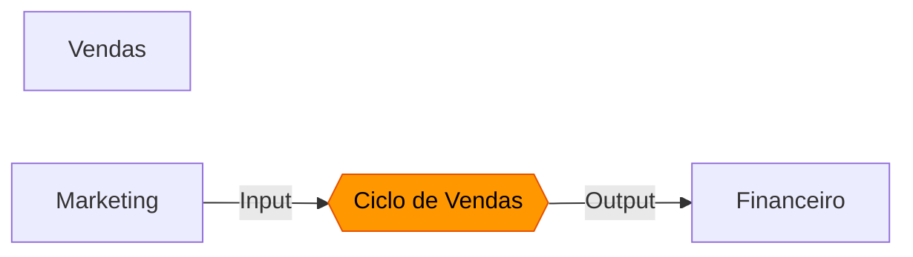

# Curator Process Mapping Interface - Documentation

**Component**: `CuratorProcessMapping.tsx`  
**Created**: 2026-02-24  
**Purpose**: Interface for Ontological Curator to define macro-level organizational processes

---

## 🎯 Overview

This is the **first step** in the collaborative process mapping workflow. The Ontological Curator uses this interface to:

1. **Define macro processes** - Main organizational processes (critical and non-critical)
2. **Identify participating areas** - Which departments are involved (multi-area by default)
3. **Map inputs/outputs** - Where processes start and end
4. **Create the foundation** - Structure that guides collaborative mapping

### Why Curator First?

> "O curador ontológico, diante do conhecimento das áreas, ele pode elencar... mapear esses processos, definir esse processo em si, para cada uma das áreas."

The curator provides **top-down structure** before bottom-up collaboration:
- Prevents chaos and duplicate mappings
- Ensures semantic consistency
- Defines the "map" that collaborators will fill in
- Identifies critical vs. supporting processes

---

## 🖥️ Interface Features

### Three Views

#### 1. **List View** (Default)
- Overview of all mapped macro processes
- Statistics: Total processes, Critical processes, Published processes
- Process cards showing:
  - Name and description
  - Critical/Normal badge
  - Draft/Published status
  - Participating departments
  - Input departments (where process starts)
  - Output departments (where process ends)
  - Edit and Delete actions

#### 2. **Form View** (Create/Edit)
- **Process Name** (required) - e.g., "Ciclo de Vendas", "Onboarding de Cliente"
- **Description** (optional) - Brief explanation of the macro process
- **Critical Flag** - Mark as critical process
- **Participating Departments** (required, multi-select) - All areas involved
- **Input Departments** (multi-select) - Where process initiates (can be multiple)
- **Output Departments** (multi-select) - Where process concludes (can be multiple)

#### 3. **Visualization View**
- Mermaid flowchart showing all macro processes
- Department nodes connected by process flows
- Input/Output arrows
- Critical processes highlighted in orange
- Interactive legend

---

## 📊 Data Model

### MacroProcess

```typescript
interface MacroProcess {
  id: string;
  name: string;                      // "Ciclo de Vendas"
  description: string;                // "Processo completo desde geração..."
  participatingDepartments: string[]; // ["dept-1", "dept-2", "dept-3"]
  inputDepartments: string[];         // ["dept-2"] - Marketing
  outputDepartments: string[];        // ["dept-3"] - Financeiro
  isCritical: boolean;                // true = critical process
  status: 'draft' | 'published';      // Publication status
  createdAt: Date;
}
```

### Key Concepts

**Multi-Area by Default**:
- `participatingDepartments` - All departments that touch the process
- Minimum 1 department required
- Typically 2-5 departments for cross-functional processes

**Multiple Inputs/Outputs**:
- Process can start in multiple departments (e.g., "Lead Generation" starts in Marketing AND Sales)
- Process can end in multiple departments (e.g., "Customer Onboarding" ends in Operations AND Support)
- This reflects real organizational complexity

**Critical Processes**:
- Marked by curator as business-critical
- Highlighted in orange in visualizations
- Prioritized for detailed mapping by collaborators

---

## 🔄 Workflow

### Step 1: Curator Defines Macro Processes

```
Curator logs in → Opens "Mapeamento Macro" →
Clicks "Novo Processo" →
Fills form:
  - Name: "Ciclo de Vendas"
  - Description: "Lead → Proposta → Fechamento"
  - Critical: Yes
  - Participating: Marketing, Vendas, Financeiro
  - Input: Marketing (lead generation)
  - Output: Financeiro (invoice)
→ Saves as Draft
```

### Step 2: Review and Publish

```
Curator reviews list →
Checks visualization (Mermaid diagram) →
Validates flows make sense →
Publishes process →
Status changes to "Published"
```

### Step 3: Collaborators Map Details

Once published, the macro process becomes available for:
- Individual collaborators to map detailed steps
- PIA to suggest sub-processes
- Handoff validation between departments
- Business rule extraction

---

## 🎨 UI/UX Highlights

### Visual Hierarchy
- **Stats Cards** at top: Quick overview of mapping progress
- **Process Cards** with color-coded badges (Critical = orange, Normal = blue)
- **Department Pills** showing participation, input, output with icons

### Interaction Patterns
- **Toggle Selection** for departments (click to select/deselect)
- **Visual Feedback** - Selected items have primary color border
- **Inline Editing** - Edit button opens form with pre-filled data
- **Confirmation Dialogs** - Delete requires confirmation

### Accessibility
- Keyboard navigation support
- Semantic HTML structure
- Clear labels and descriptions
- Color is not the only indicator (icons + text)

---

## 🔌 Backend Integration

### Required Endpoints

#### 1. GET /api/curator/macro-processes
**Purpose**: Load all macro processes  
**Response**:
```json
{
  "success": true,
  "data": {
    "processes": [
      {
        "id": "proc-1",
        "name": "Ciclo de Vendas",
        "description": "...",
        "participatingDepartments": ["dept-1", "dept-2"],
        "inputDepartments": ["dept-2"],
        "outputDepartments": ["dept-1"],
        "isCritical": true,
        "status": "published",
        "createdAt": "2026-02-24T..."
      }
    ]
  }
}
```

#### 2. POST /api/curator/macro-processes
**Purpose**: Create new macro process  
**Request Body**:
```json
{
  "name": "Onboarding de Cliente",
  "description": "Processo de ativação de novo cliente",
  "participatingDepartments": ["dept-1", "dept-4", "dept-5"],
  "inputDepartments": ["dept-1"],
  "outputDepartments": ["dept-5"],
  "isCritical": false,
  "status": "draft"
}
```

#### 3. PUT /api/curator/macro-processes
**Purpose**: Update existing macro process  
**Request Body**: Same as POST + `id` field

#### 4. DELETE /api/curator/macro-processes/:id
**Purpose**: Delete macro process  
**Response**: `{ "success": true }`

---

## 📈 Mermaid Diagram Generation

### Logic

```typescript
function generateMermaid(processes: MacroProcess[], departments: Department[]): string {
  let mermaid = 'flowchart LR\n';
  
  // 1. Create department nodes
  departments.forEach(dept => {
    mermaid += `  ${dept.id}[${dept.name}]\n`;
  });
  
  // 2. Create process nodes (diamond shape for processes)
  processes.forEach((proc, idx) => {
    const procNode = `proc${idx}`;
    mermaid += `  ${procNode}{{${proc.name}}}\n`;
    
    // 3. Connect inputs
    proc.inputDepartments.forEach(deptId => {
      mermaid += `  ${deptId} -->|Input| ${procNode}\n`;
    });
    
    // 4. Connect outputs
    proc.outputDepartments.forEach(deptId => {
      mermaid += `  ${procNode} -->|Output| ${deptId}\n`;
    });
    
    // 5. Style critical processes
    if (proc.isCritical) {
      mermaid += `  style ${procNode} fill:#ff9800,stroke:#e65100,color:#000\n`;
    }
  });
  
  return mermaid;
}
```

### Example Output



---

## 🎯 Use Cases

### Use Case 1: Map Critical Sales Process

**Scenario**: Curator wants to map the end-to-end sales cycle

**Steps**:
1. Click "Novo Processo"
2. Name: "Ciclo de Vendas Completo"
3. Description: "Lead generation até fechamento e faturamento"
4. Mark as Critical: ✓
5. Select participating departments:
   - Marketing (lead gen)
   - Vendas (qualification, proposal, negotiation)
   - Financeiro (invoicing)
   - Jurídico (contract review)
6. Input departments: Marketing
7. Output departments: Financeiro
8. Save as Draft
9. Review in visualization
10. Publish

**Result**: Sales team can now map detailed steps within this macro structure

---

### Use Case 2: Map Multi-Input Process

**Scenario**: Customer support process can be triggered by Sales OR Marketing

**Steps**:
1. Name: "Atendimento ao Cliente"
2. Participating: Vendas, Marketing, Suporte
3. Input departments: Vendas, Marketing (both can initiate)
4. Output departments: Suporte
5. Save

**Result**: Diagram shows two input arrows into the process

---

### Use Case 3: Identify Process Gaps

**Scenario**: Curator notices no process connects Operations to Finance

**Steps**:
1. Open Visualization view
2. Notice gap: Operations has no output to Finance
3. Create new process: "Entrega e Cobrança"
4. Input: Operations
5. Output: Finance
6. Fill the gap

**Result**: Complete organizational process map

---

## 🔐 Permissions

### Who Can Access?

**Ontological Curator Role Only**:
- This interface is restricted to users with `role: curator`
- Regular users cannot access macro process mapping
- Regular users only see published processes for detailed mapping

### Permission Checks

```typescript
// Backend middleware
if (user.role !== 'curator') {
  return res.status(403).json({ 
    success: false, 
    error: 'Only Ontological Curator can define macro processes' 
  });
}
```

---

## 📊 Success Metrics

### Coverage Metrics
- **Process Coverage**: % of departments with at least one process
- **Critical Coverage**: All critical business processes mapped
- **Multi-Area Ratio**: % of processes spanning 2+ departments

### Quality Metrics
- **Input/Output Completeness**: % of processes with defined inputs/outputs
- **Description Quality**: % of processes with descriptions
- **Publication Rate**: % of draft processes that get published

### Adoption Metrics
- **Time to First Process**: How quickly curator starts mapping
- **Processes per Session**: Curator productivity
- **Edit Frequency**: How often processes are refined

---

## 🚀 Next Steps After Macro Mapping

Once curator has defined macro processes:

1. **Publish Processes** → Makes them available to collaborators
2. **Collaborators Map Details** → Use `ProcessMappingView` component
3. **PIA Suggests Sub-Processes** → Based on macro structure
4. **Handoffs Validated** → Between departments
5. **Business Rules Extracted** → From detailed mappings
6. **Resonance Triggered** → When connections are made

---

## 🎨 Design Decisions

### Why Three Separate Views?

**List View**: Quick overview and management  
**Form View**: Focused data entry without distraction  
**Visualization View**: Big picture understanding

Alternative considered: Single view with tabs → Rejected because switching context is cognitively expensive

### Why Multi-Select for Inputs/Outputs?

Real processes are complex:
- "Lead Generation" can start in Marketing OR Sales
- "Customer Onboarding" ends in Operations AND Support

Single-select would oversimplify reality.

### Why Draft/Published Status?

Curator needs time to:
- Experiment with process definitions
- Review visualizations
- Validate with stakeholders

Draft status prevents premature exposure to collaborators.

---

## 🔄 Integration with Spec 060

This component implements:
- **REQ-CPM-023**: Curator dedicated interface for macro process mapping
- **REQ-CPM-024**: Define macro processes per department
- **REQ-CPM-025**: Store as `:MacroProcess` nodes in Neo4j
- **REQ-CPM-026**: Suggest linking to detailed processes
- **REQ-CPM-027**: View coverage metrics
- **REQ-CPM-028**: Resolve conflicts and merge duplicates

---

## 📝 Example: Complete Macro Mapping Session

### Organization: Aurora Corretora (Investment Brokerage)

**Curator Session**:

1. **Process 1: Ciclo de Investimento**
   - Participating: Vendas, Backoffice, Compliance, Operações
   - Input: Vendas (client interest)
   - Output: Operações (investment executed)
   - Critical: Yes

2. **Process 2: Análise de Risco**
   - Participating: Risco, Compliance, Diretoria
   - Input: Risco (risk assessment request)
   - Output: Diretoria (approval/rejection)
   - Critical: Yes

3. **Process 3: Onboarding de Cliente**
   - Participating: Vendas, Compliance, Backoffice, TI
   - Input: Vendas (new client)
   - Output: TI (account activated)
   - Critical: No

4. **Process 4: Relatório Regulatório**
   - Participating: Compliance, Financeiro, Diretoria
   - Input: Compliance (regulatory deadline)
   - Output: Diretoria (report submitted)
   - Critical: Yes

**Result**: 4 macro processes covering 8 departments, 3 critical processes identified

---

🔄 **Need another round?**
- Interface completa e funcional
- Integração com backend especificada
- Próximo passo: Implementar endpoints backend?
