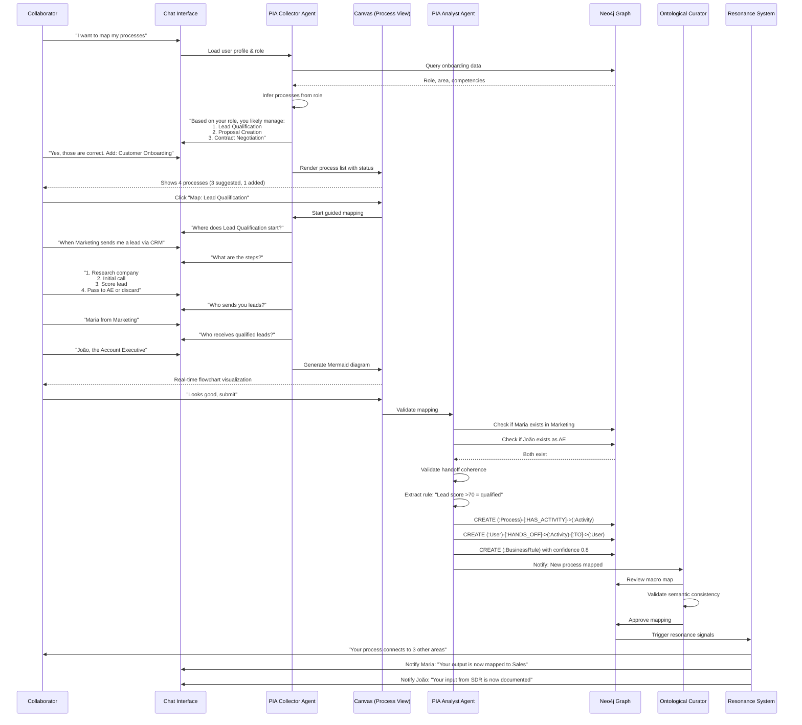

# Spec 060 – Collaborative Process Mapping (Mapeamento Colaborativo de Processos)

**Feature Branch**: `060-collaborative-process-mapping`  
**Created**: 2026-02-24  
**Status**: Draft  
**Priority**: P0 (Foundation)  
**Source**: User vision + Integration with specs 022 (Onboarding), 046 (PIA), 040 (BIG), 052 (Ontological Curator)

## Context & Purpose

**Collaborative Process Mapping** is the organizational DNA capture system. Every collaborator contributes to mapping the company's operational reality, creating a living map of how work actually flows across departments, roles, and systems.

This is NOT traditional BPMN documentation. This is **progressive, collaborative, gamified process discovery** where:
- **Every employee is a sensor** - Each person maps their slice of reality
- **Multi-area processes emerge naturally** - Cross-functional flows are discovered, not designed
- **Visualization drives understanding** - Real-time Mermaid diagrams show the evolving map
- **Curator validates coherence** - Ontological Curator (human) ensures semantic consistency
- **Gaps become visible** - Ambiguities, inconsistencies, and missing handoffs are highlighted

### Integration Points

This spec integrates with:
- **Spec 022 (Onboarding)**: First-run onboarding flows into process mapping
- **Spec 046 (PIA)**: Process Intelligence Agents guide and validate mapping
- **Spec 040 (BIG)**: Processes link to strategic objectives
- **Spec 052 (Ontological Curator)**: Human curator performs macro mapping and validation
- **Spec 020 (Resonance)**: Contributors receive semantic signals when their processes connect

### The Vision: From Onboarding to Company Map

```
User completes onboarding → Describes their role/area → 
PIA suggests initial processes → User confirms/adjusts → 
User enters "Process Mapping" tab → Chooses a process to detail →
Chat-based guided mapping → Real-time Mermaid visualization →
Defines: Start → Steps → Handoffs → End → Business Rules →
System validates coherence → Detects gaps → Notifies related users →
Curator reviews macro map → Resolves conflicts → Validates ontology →
Company has living, evolving process map
```

---

## Process Flow (Business View)

```mermaid
flowchart TD
    Start[User Completes Onboarding] --> HasRole[User Role & Area Known]
    HasRole --> PIASuggest[PIA Suggests Initial Processes<br/>Based on Role]
    
    PIASuggest --> UserReview{User Reviews<br/>Suggestions}
    UserReview -->|Confirms| ProcessList[Process List Created]
    UserReview -->|Adds New| AddProcess[User Adds Missing Processes]
    UserReview -->|Removes| RemoveProcess[User Removes Irrelevant]
    
    AddProcess --> ProcessList
    RemoveProcess --> ProcessList
    
    ProcessList --> ChooseProcess[User Chooses Process to Map]
    ChooseProcess --> ChatGuided[Chat-Based Guided Mapping]
    
    ChatGuided --> DefineStart[Define: Where Does Process Start?]
    DefineStart --> DefineSteps[Define: What Are the Steps?]
    DefineSteps --> DefineHandoffs[Define: Who Receives/Delivers?]
    DefineHandoffs --> DefineEnd[Define: Where Does Process End?]
    DefineEnd --> DefineRules[Define: Business Rules & Decisions]
    
    DefineRules --> GenerateMermaid[Generate Real-Time Mermaid Diagram]
    GenerateMermaid --> ShowDiagram[Display Diagram in Canvas]
    
    ShowDiagram --> UserValidates{User Validates<br/>Visualization}
    UserValidates -->|Adjust| ChatGuided
    UserValidates -->|Confirm| SubmitMapping[Submit Mapping]
    
    SubmitMapping --> PIAAnalyst[PIA Analyst Validates]
    PIAAnalyst --> CheckCoherence[Check Handoff Coherence]
    CheckCoherence --> DetectGaps{Gaps Found?}
    
    DetectGaps -->|Yes| NotifyGaps[Notify User & Related Parties]
    NotifyGaps --> MarkPending[Mark Handoffs as Pending]
    
    DetectGaps -->|No| ExtractRules[Extract Business Rules]
    ExtractRules --> StoreGraph[Store in Neo4j Graph]
    
    StoreGraph --> UpdateMacro[Update Macro Process Map]
    UpdateMacro --> CuratorReview[Ontological Curator Reviews]
    
    CuratorReview --> ValidateOntology[Validate Semantic Consistency]
    ValidateOntology --> ResolveConflicts[Resolve Multi-User Conflicts]
    ResolveConflicts --> PublishMap[Publish to Company Map]
    
    PublishMap --> Resonance[Trigger Resonance Signals]
    Resonance --> RelatedUsers[Notify Related Users]
    
    classDef onboarding fill:#e3f2fd,stroke:#1976d2,color:#000
    classDef mapping fill:#fff3e0,stroke:#ff9800,color:#000
    classDef validation fill:#e8f5e9,stroke:#4caf50,color:#000
    classDef curator fill:#fce4ec,stroke:#e91e63,color:#000
    
    class Start,HasRole,PIASuggest,UserReview,ProcessList onboarding
    class ChooseProcess,ChatGuided,DefineStart,DefineSteps,DefineHandoffs,DefineEnd,DefineRules,GenerateMermaid,ShowDiagram,UserValidates,SubmitMapping mapping
    class PIAAnalyst,CheckCoherence,DetectGaps,NotifyGaps,MarkPending,ExtractRules,StoreGraph validation
    class UpdateMacro,CuratorReview,ValidateOntology,ResolveConflicts,PublishMap,Resonance,RelatedUsers curator
```



### Flow Insights

**Identified Gaps**:
- How to handle processes that span multiple departments with different naming conventions? `[?]`
- What happens when two users map the same process differently? (conflict resolution protocol needed)
- How to balance detail vs usability? (too much detail = cognitive overload)
- How to keep maps current as organization evolves? (change management strategy)

**Identified Opportunities**:
- Auto-generate process documentation from mapped flows
- Detect "shadow processes" (actual vs documented workflows)
- Identify process champions (users who map most accurately)
- Suggest standardization opportunities across departments
- Generate training materials from process maps
- Enable process simulation (what-if scenarios)
- Create BPMN diagrams automatically from graph data

**Identified Risks**:
- User fatigue: Mapping takes time away from core work
- Incomplete coverage: Not all processes get mapped
- Accuracy: Users may describe idealized vs actual processes
- Maintenance burden: Keeping maps updated requires continuous effort
- Curator bottleneck: Single curator may not scale

---

## Agent Collaboration



---

## User Scenarios & Tests

### User Story 1 - Post-Onboarding Process Suggestion (Priority: P0)

As a new employee who just completed onboarding, I want the system to suggest processes I likely manage based on my role so I can quickly start mapping without starting from scratch.

**Why this priority**: Reduces friction. Users don't need to think "what processes do I have?" - system suggests based on role.

**Independent Test**: Complete onboarding as "Sales Manager", verify PIA suggests sales-related processes.

**Acceptance Criteria**:

1. **Given** user completes first-run onboarding with role "Sales Manager", **When** onboarding finishes, **Then** system suggests processes: "Lead Management", "Pipeline Review", "Forecast Planning", "Team Coaching"

2. **Given** suggested processes displayed, **When** user reviews list, **Then** user can: Confirm all, Confirm selected, Add new, Remove irrelevant

3. **Given** user adds custom process "Customer Success Handoff", **When** submitted, **Then** system creates process with source="user_defined" and confidence=1.0

4. **Given** process list finalized, **When** user navigates to "Process Mapping" tab, **Then** Canvas shows process list with status: Not Started, In Progress, Completed

---

### User Story 2 - Chat-Guided Process Mapping with Real-Time Visualization (Priority: P0)

As a user mapping a process, I want to describe it conversationally in chat while seeing a real-time Mermaid diagram update so I can validate the flow visually as I build it.

**Why this priority**: Core UX. Visual feedback is critical for understanding and validation.

**Independent Test**: Start mapping a process, verify Mermaid diagram updates with each step added.

**Acceptance Criteria**:

1. **Given** user selects process "Lead Qualification" to map, **When** mapping starts, **Then** Chat asks: "Where does this process start? (Who/what triggers it?)"

2. **Given** user answers "Marketing sends lead via CRM", **When** PIA processes, **Then** Mermaid diagram shows: `Start[Marketing: Lead via CRM]`

3. **Given** user describes steps, **When** each step is added, **Then** diagram updates in real-time showing: `Start --> Step1[Research Company] --> Step2[Initial Call] --> Step3[Score Lead] --> Decision{Score >70?}`

4. **Given** user defines handoffs, **When** "Pass to João (AE)" is mentioned, **Then** diagram shows: `Decision -->|Yes| Handoff[Pass to João AE]` and `Decision -->|No| End[Discard]`

5. **Given** diagram complete, **When** user reviews, **Then** user can: Edit steps (re-opens chat), Confirm & Submit, Save Draft

---

### User Story 3 - Handoff Coherence Validation (Priority: P0)

As PIA Analyst, I want to validate that handoffs are coherent (sender's output matches receiver's input) so process maps are accurate and actionable.

**Why this priority**: Prevents broken process maps. Ensures quality.

**Independent Test**: Map process with invalid handoff, verify PIA detects gap and notifies both parties.

**Acceptance Criteria**:

1. **Given** user maps "Pass lead to João (AE)", **When** PIA Analyst validates, **Then** queries Neo4j: Does João exist? Is João's role AE? Does João accept leads?

2. **Given** João has NOT mapped "Receive leads" in his processes, **When** gap detected, **Then** PIA marks handoff as `status: pending` and notifies both user and João

3. **Given** João confirms by mapping his process including "Receive lead from SDR", **When** both sides match, **Then** PIA updates handoff to `status: validated` and confidence=1.0

4. **Given** handoff remains pending for 7 days, **When** PIA reviews, **Then** escalates to Ontological Curator for manual resolution

---

### User Story 4 - Macro Process Mapping by Curator (Priority: P1)

As Ontological Curator, I want to perform macro-level process mapping (identify main processes per area) before detailed mapping so there's a top-down structure guiding individual contributions.

**Why this priority**: Provides structure. Prevents chaos. Curator sets the ontological foundation.

**Independent Test**: Curator creates macro process "Sales Cycle", verify users can map sub-processes within it.

**Acceptance Criteria**:

1. **Given** Curator accesses "Macro Process Mapping" interface, **When** selects department "Sales", **Then** can define macro processes: "Lead Generation", "Lead Qualification", "Opportunity Management", "Closing"

2. **Given** macro processes defined, **When** user from Sales maps their process, **Then** system suggests linking to relevant macro process

3. **Given** user maps "Initial Call" activity, **When** system detects it's part of "Lead Qualification" macro, **Then** auto-links with relationship `(:Activity)-[:PART_OF]->(:MacroProcess)`

4. **Given** Curator reviews department coverage, **When** views macro map, **Then** sees: % of macro processes with detailed mappings, gaps, conflicts

---

### User Story 5 - Multi-Area Process Discovery (Priority: P1)

As a user, I want to map processes that span multiple departments so cross-functional workflows become visible and optimizable.

**Why this priority**: Most valuable processes are cross-functional. This is where inefficiencies hide.

**Independent Test**: Map process that touches 3 departments, verify all handoffs are captured.

**Acceptance Criteria**:

1. **Given** user maps "Customer Onboarding" process, **When** describes steps, **Then** identifies handoffs to: Sales (contract), Finance (billing setup), Operations (provisioning), Support (training)

2. **Given** multi-area handoffs defined, **When** PIA validates, **Then** notifies all 4 departments and requests confirmation

3. **Given** all departments confirm their part, **When** process complete, **Then** Mermaid diagram shows full cross-functional flow with department swim lanes

4. **Given** Curator reviews, **When** detects naming inconsistency ("provisioning" vs "account setup"), **Then** flags for semantic alignment and suggests canonical term

---

### User Story 6 - Business Rule Extraction (Priority: P1)

As PIA Analyst, I want to automatically extract business rules from process descriptions so implicit knowledge becomes explicit and queryable.

**Why this priority**: Captures tacit knowledge. Enables automation. Critical for process intelligence.

**Independent Test**: User describes decision point, verify PIA extracts rule with confidence score.

**Acceptance Criteria**:

1. **Given** user states "If lead score is above 70, I pass to AE; otherwise discard", **When** PIA processes, **Then** extracts rule: `IF lead.score > 70 THEN action='pass_to_ae' ELSE action='discard'` with confidence=0.9

2. **Given** rule extracted, **When** stored in Neo4j, **Then** creates `(:BusinessRule)` node linked to `(:Activity)` via `[:GOVERNED_BY]`

3. **Given** multiple users describe same process, **When** conflicting rules detected, **Then** PIA flags conflict and requests curator resolution

4. **Given** rule validated by 3+ users, **When** confidence increases, **Then** marks as `status: golden` (high confidence, multiple sources)

---

### User Story 7 - Resonance Signals on Process Connection (Priority: P2)

As a user, I want to receive semantic signals when my mapped process connects to others so I understand my role in the organizational system.

**Why this priority**: Drives engagement. Shows impact. Reinforces contribution value.

**Independent Test**: Complete process mapping, verify related users receive resonance signals.

**Acceptance Criteria**:

1. **Given** user completes mapping "Lead Qualification", **When** process published, **Then** Maria (Marketing) receives signal: "Your lead delivery process is now connected to Sales workflow"

2. **Given** João (AE) receives signal, **When** clicks notification, **Then** sees diagram showing how his "Receive Lead" connects to upstream "Lead Qualification"

3. **Given** process touches 5 departments, **When** all connections validated, **Then** all 5 departments receive resonance signal (throttled: max 1/day per user)

4. **Given** user views their "Process Impact" dashboard, **When** opens, **Then** sees: Processes mapped, Connections created, Departments touched, Resonance score

---

## Functional Requirements

### Post-Onboarding Process Suggestion

- **REQ-CPM-001**: System MUST analyze user's `role_description`, `primary_objective`, and `competencies` from onboarding to infer likely processes
- **REQ-CPM-002**: PIA Collector MUST suggest 3-7 processes per user based on role with confidence ≥0.6
- **REQ-CPM-003**: User MUST be able to: Confirm all, Confirm selected, Add custom, Remove irrelevant
- **REQ-CPM-004**: Custom processes added by user MUST have `source: user_defined` and `confidence: 1.0`
- **REQ-CPM-005**: Process list MUST be stored as `(:User)-[:MANAGES]->(:Process)` relationships

### Chat-Guided Mapping Interface

- **REQ-CPM-006**: Mapping MUST be chat-based with PIA Collector asking structured questions
- **REQ-CPM-007**: Questions MUST follow sequence: Start → Steps → Handoffs → End → Rules
- **REQ-CPM-008**: PIA MUST detect handoff keywords: "pass to", "send to", "delegate", "transfer", "forward"
- **REQ-CPM-009**: For each handoff, PIA MUST ask clarifying questions: "To whom specifically?", "What exactly is passed?", "How is it passed?"
- **REQ-CPM-010**: User MUST be able to save draft and resume later (session persistence)

### Real-Time Mermaid Visualization

- **REQ-CPM-011**: Canvas MUST display real-time Mermaid flowchart updating as user describes process
- **REQ-CPM-012**: Diagram MUST show: Start node, Activity nodes, Decision points, Handoff nodes, End node
- **REQ-CPM-013**: Handoffs MUST be visually distinct (different color/shape) from regular activities
- **REQ-CPM-014**: Pending handoffs (not validated) MUST be marked with `[?]` suffix and orange color
- **REQ-CPM-015**: User MUST be able to click diagram nodes to edit corresponding step in chat
- **REQ-CPM-016**: Diagram MUST support zoom, pan, and export (PNG, SVG)

### Handoff Coherence Validation

- **REQ-CPM-017**: PIA Analyst MUST validate every handoff: sender exists, receiver exists, receiver accepts input type
- **REQ-CPM-018**: Handoffs MUST have status: `pending` (not confirmed), `validated` (both sides match), `broken` (conflict detected)
- **REQ-CPM-019**: When handoff is `pending`, PIA MUST notify both sender and receiver to confirm
- **REQ-CPM-020**: When receiver confirms by mapping their side, PIA MUST update status to `validated` and confidence to 1.0
- **REQ-CPM-021**: Handoffs pending >7 days MUST be escalated to Ontological Curator
- **REQ-CPM-022**: Handoff validation MUST check: output type matches input type, timing is compatible, method is feasible

### Macro Process Mapping (Curator)

- **REQ-CPM-023**: Ontological Curator MUST have dedicated interface for macro process mapping
- **REQ-CPM-024**: Curator MUST be able to define macro processes per department with: name, description, owner, expected sub-processes
- **REQ-CPM-025**: Macro processes MUST be stored as `(:MacroProcess)` nodes linked to `(:Department)`
- **REQ-CPM-026**: When user maps detailed process, system MUST suggest linking to relevant macro process
- **REQ-CPM-027**: Curator MUST be able to view coverage: % of macro processes with detailed mappings, gaps, conflicts
- **REQ-CPM-028**: Curator MUST be able to resolve conflicts: choose canonical version, merge duplicates, flag for re-mapping

### Business Rule Extraction

- **REQ-CPM-029**: PIA Analyst MUST extract business rules from process descriptions using NLP
- **REQ-CPM-030**: Rules MUST be stored as: `condition` (IF clause), `action` (THEN clause), `confidence` (0.0-1.0), `source_user_id`
- **REQ-CPM-031**: Rules MUST be linked to activities via `(:Activity)-[:GOVERNED_BY]->(:BusinessRule)`
- **REQ-CPM-032**: When multiple users describe same process, PIA MUST detect conflicting rules and flag for curator
- **REQ-CPM-033**: Rules validated by 3+ users MUST be marked as `status: golden` with increased confidence
- **REQ-CPM-034**: Extracted rules MUST be explainable: show source text, extraction reasoning, confidence factors

### Multi-Area Process Support

- **REQ-CPM-035**: System MUST support processes spanning multiple departments
- **REQ-CPM-036**: Multi-area processes MUST create handoffs to all involved departments
- **REQ-CPM-037**: Mermaid diagrams for multi-area processes MUST use swim lanes to show department boundaries
- **REQ-CPM-038**: When all departments confirm their part, process MUST be marked as `status: validated`
- **REQ-CPM-039**: Curator MUST be able to view cross-functional flows and identify optimization opportunities

### Resonance Integration

- **REQ-CPM-040**: When process is published, system MUST trigger resonance signals to all related users
- **REQ-CPM-041**: Resonance signals MUST be throttled: max 1 per day per user per department
- **REQ-CPM-042**: Signals MUST include: what connected, who mapped it, impact on user's work
- **REQ-CPM-043**: User MUST be able to view "Process Impact" dashboard showing: processes mapped, connections created, resonance score
- **REQ-CPM-044**: Resonance MUST NOT be gamification (no points/badges) - it's semantic connection awareness

### Graph Storage

- **REQ-CPM-045**: Every process MUST create `(:Process)` node with: id, name, description, owner_id, department_id, status, quality_score, source, created_at
- **REQ-CPM-046**: Every activity MUST create `(:Activity)` node with: id, name, description, sequence_order, duration_estimate, inputs, outputs, tools_used, is_decision_point
- **REQ-CPM-047**: Every handoff MUST create: `(:User)-[:HANDS_OFF {what, when, how, status, average_duration}]->(:Activity)-[:TO]->(:User)`
- **REQ-CPM-048**: Every business rule MUST create `(:BusinessRule)` node with: id, name, condition, action, confidence, source_user_id, validated_by, status
- **REQ-CPM-049**: Processes MUST be versioned with `[:SUPERSEDES]` relationships when updated
- **REQ-CPM-050**: All process nodes MUST link to BIG objectives via `(:Process)-[:SUPPORTS]->(:Objective)`

---

## Non-Functional Requirements

### Performance

- **REQ-CPM-NFR-001**: Process suggestion MUST complete in <3 seconds after onboarding
- **REQ-CPM-NFR-002**: Mermaid diagram generation MUST complete in <1 second per update
- **REQ-CPM-NFR-003**: Handoff validation MUST complete in <5 seconds per process
- **REQ-CPM-NFR-004**: Macro process coverage calculation MUST complete in <10 seconds for 100+ processes

### Usability

- **REQ-CPM-NFR-005**: Process mapping MUST be completable in <15 minutes for simple process (3-5 steps)
- **REQ-CPM-NFR-006**: Chat interface MUST provide progress indicator: "Step 2 of 5: Define handoffs"
- **REQ-CPM-NFR-007**: Mermaid diagrams MUST be readable on mobile (responsive, zoomable)
- **REQ-CPM-NFR-008**: System MUST support multiple languages (initially: Portuguese, English)

### Accuracy

- **REQ-CPM-NFR-009**: Handoff coherence validation MUST have >95% accuracy (validated by human review)
- **REQ-CPM-NFR-010**: Business rule extraction MUST have >80% accuracy (rules correctly identified)
- **REQ-CPM-NFR-011**: Process suggestion MUST have >70% acceptance rate (users confirm suggested processes)

---

## Success Criteria

1. **Coverage**: 70% of organizational processes mapped within 6 months
2. **Engagement**: 60% of employees actively participate in mapping
3. **Quality**: 85% of mapped processes have validated handoffs
4. **Rules Extracted**: 500+ business rules extracted and validated
5. **Cross-Functional Visibility**: 40% of mapped processes span 2+ departments
6. **User Satisfaction**: 80% of users find mapping interface intuitive (survey)
7. **Curator Efficiency**: Curator can review and validate 20+ processes per hour

---

## Key Entities (Neo4j)

### New Node Types

```cypher
// :Process - Organizational process
(:Process {
  id: UUID,
  name: STRING,
  description: TEXT,
  owner_id: UUID,
  department_id: UUID,
  status: "draft" | "active" | "validated" | "deprecated",
  quality_score: FLOAT,
  source: "user_mapping" | "llm_inference" | "curator_defined",
  is_macro: BOOLEAN,
  created_at: DATETIME,
  updated_at: DATETIME
})

// :Activity - Step within a process
(:Activity {
  id: UUID,
  name: STRING,
  description: TEXT,
  sequence_order: INTEGER,
  duration_estimate: INTEGER,
  inputs: [STRING],
  outputs: [STRING],
  tools_used: [STRING],
  is_decision_point: BOOLEAN,
  created_at: DATETIME
})

// :BusinessRule - Extracted business rule
(:BusinessRule {
  id: UUID,
  name: STRING,
  condition: STRING,
  action: STRING,
  confidence: FLOAT,
  source_user_id: UUID,
  validated_by: [UUID],
  status: "draft" | "validated" | "golden",
  created_at: DATETIME
})

// :MacroProcess - High-level process category
(:MacroProcess {
  id: UUID,
  name: STRING,
  description: TEXT,
  department_id: UUID,
  expected_sub_processes: [STRING],
  coverage_percentage: FLOAT,
  created_by: UUID,
  created_at: DATETIME
})
```

### New Relationships

```cypher
// User manages processes
(:User)-[:MANAGES]->(:Process)

// Process has activities
(:Process)-[:HAS_ACTIVITY]->(:Activity)

// Activity governed by rule
(:Activity)-[:GOVERNED_BY]->(:BusinessRule)

// Handoff between users
(:User)-[:HANDS_OFF {
  what: STRING,
  when: STRING,
  how: STRING,
  status: "pending" | "validated" | "broken",
  average_duration: INTEGER,
  confidence: FLOAT
}]->(:Activity)

// Activity goes to user
(:Activity)-[:TO]->(:User)

// User mapped process
(:User)-[:MAPPED]->(:Process)

// Process versioning
(:Process)-[:SUPERSEDES]->(:Process)

// Activity part of macro process
(:Activity)-[:PART_OF]->(:MacroProcess)

// Process supports objective (BIG integration)
(:Process)-[:SUPPORTS]->(:Objective)

// Department has macro processes
(:Department)-[:HAS_MACRO_PROCESS]->(:MacroProcess)
```

---

## Dependencies

- **Spec 022** (Onboarding) - Process mapping starts after onboarding completion
- **Spec 046** (PIA) - Process Intelligence Agents guide and validate mapping
- **Spec 040** (BIG) - Processes link to strategic objectives
- **Spec 052** (Ontological Curator) - Curator performs macro mapping and validation
- **Spec 020** (Resonance) - Semantic signals when processes connect
- **Spec 015** (Neo4j Graph Model) - Base graph structure
- **Spec 016** (Canvas) - UI for process visualization

---

## Assumptions

1. Employees are willing to spend time mapping processes (resonance helps motivation)
2. Managers support process mapping initiatives (top-down buy-in)
3. Process descriptions are reasonably accurate (not idealized)
4. Handoff validation is viable (users respond to confirmation requests)
5. Curator can dedicate 2-4 hours/week to macro mapping and validation
6. Mermaid diagrams are sufficient for visualization (no need for full BPMN initially)

---

## Out of Scope

- BPMN diagram generation (future feature)
- Process simulation (what-if scenarios) (future)
- Integration with project management tools (Jira, Asana) (future)
- Automatic process optimization suggestions (future AI capability)
- Process benchmarking across companies (future)
- Real-time process monitoring (process mining) (future)

---

## Notes

- This creates the "organizational digital twin" - living map of how the company actually works
- "Living map" emphasizes continuous updates, not static documentation
- Resonance is critical for adoption - make documentation feel valuable, not burdensome
- Business rule extraction captures tacit knowledge that would otherwise be lost
- Multi-area processes are where most inefficiencies hide - making them visible is high value
- Curator role is critical - prevents chaos, ensures semantic consistency
- Integration with onboarding creates natural entry point - users start mapping from day 1
- Real-time Mermaid visualization is UX differentiator - users see their work come to life

---

## Technical Implementation Notes

### Frontend Components

1. **ProcessMappingTab** - Main interface with process list and mapping canvas
2. **ProcessChatGuide** - Chat-based guided mapping interface
3. **ProcessMermaidViewer** - Real-time Mermaid diagram renderer with zoom/pan
4. **ProcessImpactDashboard** - User's process contribution and resonance score
5. **CuratorMacroMap** - Curator interface for macro process definition and validation

### Backend Endpoints

```typescript
// Process suggestion after onboarding
POST /api/process-mapping/suggest
  Input: { userId: string }
  Output: { suggestedProcesses: Process[], confidence: number }

// Start guided mapping
POST /api/process-mapping/start
  Input: { userId: string, processId: string }
  Output: { sessionId: string, firstQuestion: string }

// Submit mapping step
POST /api/process-mapping/step
  Input: { sessionId: string, answer: string }
  Output: { nextQuestion: string, mermaidDiagram: string, isComplete: boolean }

// Validate handoffs
POST /api/process-mapping/validate
  Input: { processId: string }
  Output: { validationResults: HandoffValidation[], gaps: Gap[] }

// Curator macro mapping
POST /api/process-mapping/macro
  Input: { departmentId: string, macroProcesses: MacroProcess[] }
  Output: { created: MacroProcess[], coverage: CoverageReport }

// Get process impact
GET /api/process-mapping/impact/:userId
  Output: { processesMapped: number, connectionsCreated: number, resonanceScore: number }
```

### Mermaid Generation Logic

```typescript
function generateProcessMermaid(process: Process, activities: Activity[], handoffs: Handoff[]): string {
  let mermaid = "flowchart TD\n";
  
  // Start node
  mermaid += `  Start[${process.startTrigger}]\n`;
  
  // Activities
  activities.forEach((activity, index) => {
    if (activity.isDecisionPoint) {
      mermaid += `  Decision${index}{${activity.name}}\n`;
    } else {
      mermaid += `  Activity${index}[${activity.name}]\n`;
    }
  });
  
  // Handoffs (with status styling)
  handoffs.forEach((handoff, index) => {
    const style = handoff.status === 'pending' ? ':::gap' : '';
    const suffix = handoff.status === 'pending' ? ' [?]' : '';
    mermaid += `  Handoff${index}[${handoff.what} to ${handoff.toUser}${suffix}]${style}\n`;
  });
  
  // End node
  mermaid += `  End[${process.endOutcome}]\n`;
  
  // Connections
  // ... (connect nodes based on sequence_order)
  
  // Styling
  mermaid += `  classDef gap fill:#ff9800,stroke:#e65100,color:#000\n`;
  
  return mermaid;
}
```

---

## Migration Path

### Phase 1: Foundation (Weeks 1-2)
- Create Neo4j schema for Process, Activity, BusinessRule, MacroProcess
- Implement PIA Collector agent for process suggestion
- Build basic chat-guided mapping interface

### Phase 2: Visualization (Weeks 3-4)
- Implement real-time Mermaid generation
- Build ProcessMermaidViewer component with zoom/pan
- Add handoff gap visualization

### Phase 3: Validation (Weeks 5-6)
- Implement PIA Analyst handoff validation
- Build notification system for pending handoffs
- Add business rule extraction

### Phase 4: Curator Tools (Weeks 7-8)
- Build Curator macro mapping interface
- Implement conflict resolution workflows
- Add coverage reporting

### Phase 5: Resonance (Weeks 9-10)
- Integrate with Resonance system (Spec 020)
- Build Process Impact dashboard
- Add semantic signals on process connection

---

🔄 **Need another round?**
- What's missing from this spec?
- What needs more detail?
- Any gaps in the flow or requirements?
