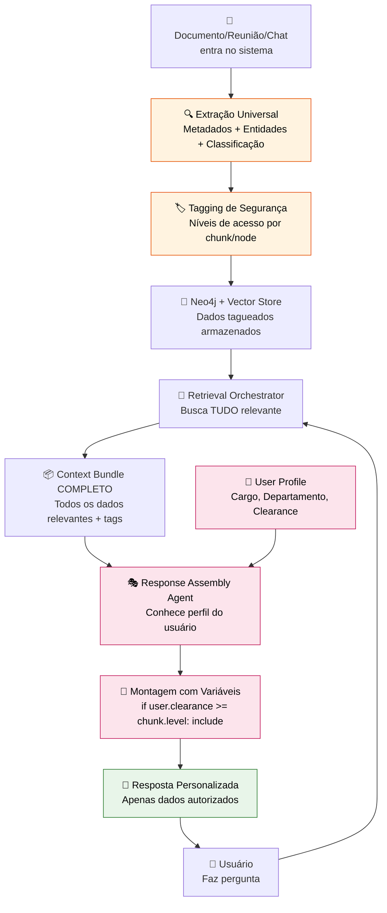
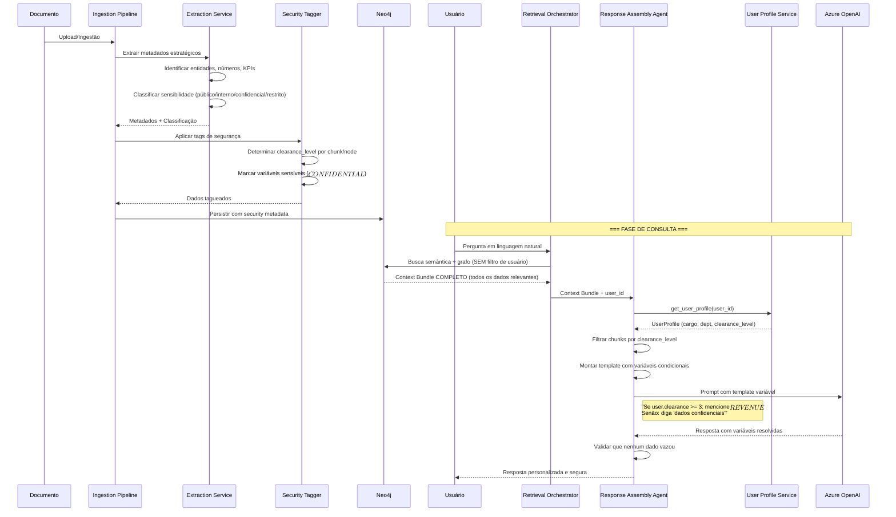

# Feature Specification: Profile-Based Data Security & Variable Response Assembly

**Feature Branch**: `062-profile-based-data-security`  
**Created**: 2026-02-27  
**Status**: Draft  
**Priority**: P0 (Critical - Security & Core Architecture)  
**Related Specs**: 024 (Retrieval), 051 (CDC), 014 (Provenance), 009 (User Memory), 010 (Data Filtration)

---

## Purpose

Resolver o problema fundamental de segurança de dados em um sistema de conhecimento empresarial: **o usuário não pode ser restrição da consulta, mas sim da resposta**.

Este spec define um sistema onde:
1. **Extração Universal**: Todo dado que entra no EKS tem metadados estratégicos extraídos (numéricos, entidades, classificações)
2. **Tagging Preventivo**: Chunks, nodes e resumos são tagueados com níveis de acesso ANTES da recuperação
3. **Resposta Variável**: A IA que responde conhece o perfil do usuário e monta a resposta com variáveis condicionais
4. **Visibilidade Granular**: Quem vê tudo é o sistema de recuperação; quem transmite é a IA que filtra baseado no perfil

> **Princípio de Ouro**: A consulta recupera tudo que é relevante. A resposta mostra apenas o que o usuário pode ver.

---

## Process Flow (Business View)



**Visão de negócio**:
- Documento entra → Sistema extrai TUDO (metadados estratégicos, entidades, números) → Tagueia com níveis de acesso
- Usuário pergunta → Sistema recupera TUDO relevante (sem filtro de usuário) → IA monta resposta filtrando por perfil
- Resultado: Respostas precisas e seguras, sem limitar a inteligência do sistema

---

## Sequence Diagram (Technical View)



---

## User Scenarios & Testing

### User Story 1 – Analista consulta dados estratégicos (Priority: P0)

Analista júnior pergunta sobre receita do trimestre. Ele NÃO tem clearance para ver números exatos, mas pode saber que "houve crescimento".

**Acceptance Scenarios**:

1. **Given** documento financeiro foi ingerido com `clearance_level: 3` (confidencial), **When** analista com `clearance_level: 1` pergunta "Qual foi a receita do Q1?", **Then**:
   - Retrieval recupera o documento completo
   - Response Assembly detecta `user.clearance < chunk.clearance`
   - IA responde: "Houve crescimento no Q1, mas dados numéricos são confidenciais"

2. **Given** mesmo documento, **When** CFO com `clearance_level: 4` faz mesma pergunta, **Then**:
   - IA responde: "A receita do Q1 foi R$ 2.5M, crescimento de 15% vs Q4"

---

### User Story 2 – Gerente vê resumo, Diretor vê detalhes (Priority: P0)

Reunião estratégica gera ata com decisões. Algumas decisões são públicas, outras restritas à diretoria.

**Acceptance Scenarios**:

1. **Given** ata de reunião com chunks tagueados em níveis diferentes:
   - Chunk 1: "Novo produto será lançado em Q2" → `clearance_level: 1` (público)
   - Chunk 2: "Margem esperada: 40%" → `clearance_level: 3` (confidencial)
   - Chunk 3: "Fornecedor XYZ foi escolhido" → `clearance_level: 2` (interno)

2. **When** gerente (`clearance_level: 2`) pergunta "O que foi decidido na reunião?", **Then**:
   - Vê chunks 1 e 3
   - Chunk 2 aparece como "Dados financeiros confidenciais foram discutidos"

3. **When** diretor (`clearance_level: 3`) faz mesma pergunta, **Then**:
   - Vê todos os 3 chunks com detalhes completos

---

### User Story 3 – Variáveis em resposta numérica (Priority: P1)

Sistema precisa responder pergunta que envolve KPI, mas KPI tem níveis diferentes de granularidade.

**Acceptance Scenarios**:

1. **Given** KPI "Taxa de Conversão" com:
   - Valor agregado: 12% → `clearance_level: 1`
   - Breakdown por canal: {email: 8%, ads: 15%} → `clearance_level: 2`
   - Custo por conversão: R$ 45 → `clearance_level: 3`

2. **When** analista (`clearance_level: 1`) pergunta "Como está a conversão?", **Then**:
   - Resposta: "Taxa de conversão está em 12%"

3. **When** coordenador (`clearance_level: 2`) pergunta, **Then**:
   - Resposta: "Taxa de conversão está em 12% (email: 8%, ads: 15%)"

4. **When** gerente (`clearance_level: 3`) pergunta, **Then**:
   - Resposta: "Taxa de conversão está em 12% (email: 8%, ads: 15%), com custo médio de R$ 45 por conversão"

---

## Functional Requirements

### Extração Universal de Metadados

- **REQ-SEC-001**: TODO documento/reunião/chat ingerido DEVE passar por extração de metadados estratégicos, incluindo:
  - Entidades nomeadas (pessoas, organizações, produtos)
  - Dados numéricos (KPIs, métricas, valores financeiros)
  - Datas e prazos
  - Decisões e ações
  - Classificação de sensibilidade

- **REQ-SEC-002**: Extração DEVE usar LLM + regras heurísticas para identificar:
  - Tipo de dado (financeiro, estratégico, operacional, pessoal)
  - Contexto de sensibilidade (público, interno, confidencial, restrito)
  - Stakeholders relacionados (quem pode/deve ver)

- **REQ-SEC-003**: Metadados extraídos DEVEM ser armazenados como propriedades do node/chunk, NÃO em tabela separada

### Tagging de Segurança Preventivo

- **REQ-SEC-004**: TODOS os chunks/nodes DEVEM receber `clearance_level` (0-4) durante ingestão:
  - 0: Público (qualquer pessoa)
  - 1: Interno (colaboradores da empresa)
  - 2: Departamental (apenas membros do departamento)
  - 3: Confidencial (gerência e acima)
  - 4: Restrito (C-level e board)

- **REQ-SEC-005**: Tagging DEVE considerar:
  - Tipo de documento (ata de board → nível 4 default)
  - Conteúdo do chunk (menção a "receita" → nível 3+)
  - Metadados explícitos (campo `confidentiality` do usuário)
  - Hierarquia organizacional (dados de CEO → nível 4)

- **REQ-SEC-006**: Chunks com dados numéricos sensíveis DEVEM ter variáveis marcadas:
  - Formato: `$$VARIABLE_NAME:clearance_level$$`
  - Exemplo: "Receita foi de $$REVENUE:3$$ no trimestre"

- **REQ-SEC-007**: Sistema DEVE permitir override manual de `clearance_level` por curador ontológico

### Retrieval Sem Filtro de Usuário

- **REQ-SEC-008**: Retrieval Orchestrator (spec 024) DEVE buscar TODOS os dados relevantes à pergunta, INDEPENDENTE do usuário que pergunta

- **REQ-SEC-009**: Context Bundle retornado DEVE incluir:
  - Todos os chunks/nodes relevantes
  - `clearance_level` de cada item
  - Variáveis marcadas com seus níveis
  - Metadados de sensibilidade

- **REQ-SEC-010**: Retrieval NÃO PODE filtrar por `clearance_level` do usuário (isso é responsabilidade do Response Assembly)

### Response Assembly com Variáveis

- **REQ-SEC-011**: Response Assembly Agent DEVE:
  - Receber Context Bundle completo
  - Carregar User Profile com `clearance_level`
  - Filtrar chunks onde `user.clearance < chunk.clearance`
  - Montar prompt para LLM com instruções condicionais

- **REQ-SEC-012**: Template de resposta DEVE usar variáveis condicionais:
  ```
  if user.clearance >= 3:
    "A receita foi de R$ 2.5M"
  else:
    "Dados financeiros são confidenciais"
  ```

- **REQ-SEC-013**: LLM DEVE receber instruções explícitas:
  - "Você tem acesso a dados de nível X"
  - "NÃO mencione dados de nível Y ou superior"
  - "Se perguntarem sobre Z, diga que é confidencial"

- **REQ-SEC-014**: Response Assembly DEVE validar resposta final antes de enviar:
  - Verificar que nenhuma variável de nível superior vazou
  - Garantir que números/entidades confidenciais não aparecem
  - Logar tentativas de acesso a dados restritos

### User Profile & Clearance

- **REQ-SEC-015**: User Profile DEVE incluir:
  - `clearance_level` (0-4)
  - `department_id` (para filtros departamentais)
  - `role` (para regras específicas de cargo)
  - `special_permissions` (acessos excepcionais)

- **REQ-SEC-016**: Clearance level DEVE ser determinado por:
  - Cargo na hierarquia (CEO → 4, Gerente → 3, Coordenador → 2, Analista → 1)
  - Departamento (Financeiro pode ter nível maior para dados financeiros)
  - Permissões especiais (auditoria pode ter acesso temporário a nível 4)

- **REQ-SEC-017**: Sistema DEVE suportar clearance contextual:
  - User pode ter nível 2 geral, mas nível 3 para seu próprio departamento
  - Formato: `{global: 2, departments: {finance: 3}}`

### Auditoria & Compliance

- **REQ-SEC-018**: TODA consulta que envolve dados com `clearance_level >= 3` DEVE ser logada:
  - `user_id`, `query`, `timestamp`
  - Chunks acessados e seus níveis
  - Se houve tentativa de acesso negado

- **REQ-SEC-019**: Sistema DEVE gerar alertas quando:
  - Usuário tenta acessar dados 2+ níveis acima do seu clearance repetidamente
  - Padrão suspeito de consultas a dados sensíveis
  - Mudança de clearance level de usuário

- **REQ-SEC-020**: Curador Ontológico DEVE ter dashboard de:
  - Dados sem `clearance_level` definido
  - Chunks com classificação automática duvidosa
  - Logs de acesso a dados restritos

---

## Key Entities (Neo4j)

```cypher
// Extensão de Chunk para incluir security metadata
(:Chunk {
  id: string,
  text: string,
  clearance_level: integer,           // 0-4
  sensitivity_type: string,           // 'public', 'internal', 'confidential', 'restricted'
  contains_pii: boolean,              // Dados pessoais identificáveis
  contains_financial: boolean,        // Dados financeiros
  contains_strategic: boolean,        // Dados estratégicos
  variable_markers: [string],         // ['$$REVENUE:3$$', '$$MARGIN:4$$']
  auto_classified: boolean,           // Se foi classificado automaticamente
  classified_by: string,              // user_id do curador (se manual)
  classified_at: datetime,
  // ... outros campos existentes
})

// Extensão de Document
(:Document {
  id: string,
  title: string,
  default_clearance_level: integer,   // Nível padrão para chunks deste doc
  document_type: string,              // 'board_minutes', 'financial_report', 'internal_memo'
  // ... outros campos existentes
})

// Extensão de Meeting
(:Meeting {
  id: string,
  title: string,
  confidentiality: string,            // Já existe (spec 007)
  clearance_level: integer,           // Derivado de confidentiality
  // ... outros campos existentes
})

// Extensão de User Profile
(:User {
  id: string,
  name: string,
  clearance_level: integer,           // Nível global
  clearance_by_dept: jsonb,           // {dept_id: level}
  special_permissions: [string],      // ['audit_access', 'temp_board_access']
  // ... outros campos existentes
})

// Novo: Security Audit Log
(:SecurityAuditLog {
  id: string,
  user_id: string,
  query: string,
  accessed_chunks: [string],          // IDs dos chunks acessados
  max_clearance_accessed: integer,    // Maior nível acessado
  denied_chunks: [string],            // IDs dos chunks negados
  timestamp: datetime,
  session_id: string
})

(:User)-[:GENERATED]->(:SecurityAuditLog)
(:SecurityAuditLog)-[:ACCESSED]->(:Chunk)
```

---

## Technical Implementation

### Fase 1: Extraction & Tagging (Ingestion)

```typescript
// backend/src/services/security-tagger.service.ts

interface SecurityMetadata {
  clearance_level: number;
  sensitivity_type: 'public' | 'internal' | 'confidential' | 'restricted';
  contains_pii: boolean;
  contains_financial: boolean;
  contains_strategic: boolean;
  variable_markers: string[];
}

class SecurityTaggerService {
  async tagChunk(chunk: string, context: DocumentContext): Promise<SecurityMetadata> {
    // 1. Análise heurística
    const heuristicLevel = this.analyzeHeuristics(chunk);
    
    // 2. Análise via LLM
    const llmClassification = await this.classifyWithLLM(chunk, context);
    
    // 3. Combinar resultados
    const clearance_level = Math.max(heuristicLevel, llmClassification.level);
    
    // 4. Identificar variáveis sensíveis
    const variable_markers = this.extractVariableMarkers(chunk, clearance_level);
    
    return {
      clearance_level,
      sensitivity_type: this.levelToType(clearance_level),
      contains_pii: this.detectPII(chunk),
      contains_financial: this.detectFinancial(chunk),
      contains_strategic: this.detectStrategic(chunk),
      variable_markers
    };
  }
  
  private analyzeHeuristics(chunk: string): number {
    // Palavras-chave que indicam nível de sensibilidade
    const level4Keywords = ['receita', 'margem', 'lucro', 'board', 'diretoria'];
    const level3Keywords = ['orçamento', 'meta', 'kpi', 'performance'];
    const level2Keywords = ['projeto', 'equipe', 'departamento'];
    
    if (level4Keywords.some(kw => chunk.toLowerCase().includes(kw))) return 4;
    if (level3Keywords.some(kw => chunk.toLowerCase().includes(kw))) return 3;
    if (level2Keywords.some(kw => chunk.toLowerCase().includes(kw))) return 2;
    return 1;
  }
  
  private extractVariableMarkers(chunk: string, baseLevel: number): string[] {
    // Identificar números e marcá-los como variáveis
    const numberPattern = /R\$\s*[\d.,]+|\d+%/g;
    const matches = chunk.match(numberPattern) || [];
    
    return matches.map((num, idx) => `$$VAR_${idx}:${baseLevel}$$`);
  }
}
```

### Fase 2: Response Assembly

```typescript
// backend/src/services/response-assembly.service.ts

interface ResponseTemplate {
  full_response: string;
  conditional_blocks: ConditionalBlock[];
}

interface ConditionalBlock {
  content: string;
  required_clearance: number;
  fallback_message: string;
}

class ResponseAssemblyService {
  async assembleResponse(
    contextBundle: ContextBundle,
    userId: string
  ): Promise<string> {
    // 1. Carregar perfil do usuário
    const userProfile = await this.getUserProfile(userId);
    
    // 2. Filtrar chunks por clearance
    const allowedChunks = contextBundle.context_items.filter(
      item => userProfile.clearance_level >= item.clearance_level
    );
    
    const deniedChunks = contextBundle.context_items.filter(
      item => userProfile.clearance_level < item.clearance_level
    );
    
    // 3. Montar template com variáveis
    const template = this.buildTemplate(allowedChunks, deniedChunks);
    
    // 4. Gerar prompt para LLM
    const prompt = this.buildSecurePrompt(template, userProfile);
    
    // 5. Chamar LLM
    const response = await this.callLLM(prompt);
    
    // 6. Validar resposta
    await this.validateResponse(response, userProfile, deniedChunks);
    
    // 7. Logar acesso
    await this.logAccess(userId, contextBundle, allowedChunks, deniedChunks);
    
    return response;
  }
  
  private buildSecurePrompt(template: ResponseTemplate, profile: UserProfile): string {
    return `
Você está respondendo para um usuário com clearance level ${profile.clearance_level}.

DADOS DISPONÍVEIS:
${template.full_response}

RESTRIÇÕES CRÍTICAS:
- Você PODE mencionar dados de nível ${profile.clearance_level} ou inferior
- Você NÃO PODE mencionar dados de nível ${profile.clearance_level + 1} ou superior
- Se perguntarem sobre dados restritos, diga: "Essa informação é confidencial para seu nível de acesso"

BLOCOS CONDICIONAIS:
${template.conditional_blocks.map(block => `
  - Se clearance >= ${block.required_clearance}: "${block.content}"
  - Senão: "${block.fallback_message}"
`).join('\n')}

Responda de forma natural, respeitando as restrições acima.
    `;
  }
  
  private async validateResponse(
    response: string,
    profile: UserProfile,
    deniedChunks: ContextItem[]
  ): Promise<void> {
    // Verificar se algum conteúdo restrito vazou
    for (const chunk of deniedChunks) {
      // Extrair variáveis do chunk
      const variables = chunk.variable_markers || [];
      
      for (const varMarker of variables) {
        const varValue = this.extractVariableValue(chunk.text, varMarker);
        
        if (response.includes(varValue)) {
          throw new SecurityViolationError(
            `Response contains restricted data: ${varMarker}`
          );
        }
      }
    }
  }
}
```

---

## Integration Points

### Com Retrieval Orchestration (024)

- Retrieval continua buscando TUDO relevante
- Context Bundle agora inclui `clearance_level` em cada item
- Response Assembly é chamado APÓS retrieval, ANTES de enviar ao usuário

### Com Context Depth Controller (051)

- CDC define profundidade de busca
- Security Tagger define profundidade de EXIBIÇÃO
- Ambos trabalham em conjunto: CDC busca fundo, Security filtra o que mostra

### Com Provenance System (014)

- Proveniência agora inclui `clearance_level` da fonte
- Citações só aparecem se usuário tem clearance para ver a fonte
- Auditoria de acesso é parte da proveniência

### Com Data Filtration (010)

- Real vs Passageiro continua aplicando
- Clearance é ortogonal: dados passageiros também têm níveis
- Expiração automática respeita clearance (dados nível 4 podem ter retenção maior)

---

## Technical Constraints

- **Performance**: Tagging automático NÃO PODE adicionar >2s ao tempo de ingestão
- **Precisão**: Classificação automática deve ter >90% de acurácia (validado por curador)
- **Segurança**: ZERO vazamento de dados restritos (validação obrigatória antes de enviar)
- **Auditoria**: 100% das consultas a dados nível 3+ devem ser logadas
- **Escalabilidade**: Sistema deve suportar 10k+ chunks tagueados por dia

---

## Success Metrics

- **Acurácia de Tagging**: % de chunks corretamente classificados (meta: >90%)
- **Zero Data Leaks**: Nenhum incidente de vazamento de dados restritos
- **Audit Coverage**: 100% de consultas sensíveis logadas
- **User Satisfaction**: Usuários reportam respostas úteis sem "acesso negado" excessivo
- **Curator Efficiency**: Tempo médio para revisar classificações automáticas <5min/dia

---

## Related Specs

- **024-retrieval-orchestration** – Busca universal sem filtro de usuário
- **051-context-depth-controller** – Profundidade de busca vs profundidade de exibição
- **014-provenance-system** – Citações respeitam clearance
- **009-user-memory-decision** – Corp vs Pessoal + clearance
- **010-data-filtration** – Real vs Passageiro + clearance
- **052-ontological-curator-interface** – Curador revisa classificações
- **015-neo4j-graph-model** – Schema estendido com security metadata

---

## References

- Constitution: Princípio de segurança de dados
- `database-schema.md` – Extensões de User, Chunk, Document
- LGPD/GDPR compliance – PII detection e auditoria
