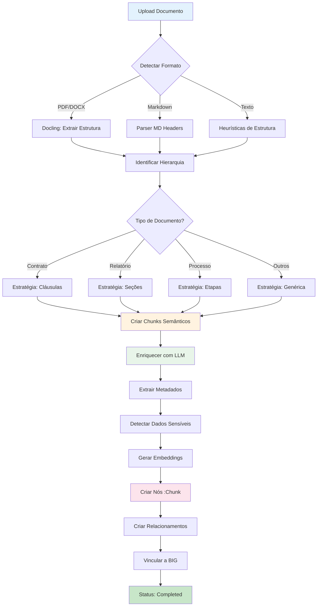

# Spec 063: Semantic Chunking - Divisão Inteligente por Estrutura de Documento

**Status**: Draft  
**Created**: 2026-02-27  
**Priority**: High  
**Dependencies**: Spec 013 (Ingestion Ecosystem), Spec 040 (BIG)

---

## 🎯 Problema

**Chunking por tokens fixos (500 tokens) é primitivo e desperdiça a estrutura semântica do documento.**

### Problemas do Chunking por Tokens:
1. **Quebra contexto semântico**: Divide parágrafos no meio, separa título de conteúdo
2. **Perde estrutura do documento**: Ignora sumário, seções, subseções
3. **Dificulta extração**: Metadados ficam fragmentados entre chunks
4. **Reduz qualidade de busca**: Embeddings capturam fragmentos sem sentido completo
5. **Impede análise estruturada**: Não é possível mapear "Cláusula 5.2" ou "Seção de Riscos"

---

## 💡 Solução: Chunking Semântico Estrutural

**Dividir documentos pela ESTRUTURA SEMÂNTICA, não por tamanho arbitrário.**

### Princípios:

1. **Respeitar a hierarquia do documento**
   - Sumário → Seções → Subseções → Parágrafos
   - Cada chunk = unidade semântica completa

2. **Adaptar ao tipo de documento**
   - Contrato: Cláusulas e subcláusulas
   - Relatório: Seções (Introdução, Metodologia, Resultados, Conclusão)
   - Ata: Tópicos de discussão
   - Processo: Etapas e atividades
   - Especificação Técnica: Requisitos funcionais/não-funcionais

3. **Enriquecer com metadados estruturais**
   - Cada chunk sabe sua posição na hierarquia
   - Relacionamentos entre chunks (FOLLOWS, PART_OF, REFERENCES)

4. **Limites flexíveis**
   - Chunk mínimo: 1 parágrafo (≈50 tokens)
   - Chunk máximo: 1 seção completa (≈2000 tokens)
   - Se seção > 2000 tokens → dividir em subseções

---

## 📋 Requisitos Funcionais

### REQ-CHUNK-001: Detecção Automática de Estrutura

**Prioridade**: Critical  
**Descrição**: Sistema deve detectar automaticamente a estrutura do documento.

**Estratégias por Formato:**

#### PDF/DOCX (com estrutura):
```python
# Usar Docling para extrair estrutura
structure = docling.parse(file)
sections = structure.get_sections()  # Detecta h1, h2, h3...
toc = structure.get_table_of_contents()  # Sumário
```

#### Markdown:
```python
# Parser de headers
# h1 → Seção principal
# h2 → Subseção
# h3 → Tópico
```

#### Texto Plano:
```python
# Heurísticas:
# - Linhas em MAIÚSCULAS = títulos
# - Numeração (1., 1.1, 1.1.1) = hierarquia
# - Linhas curtas seguidas de parágrafo = título
# - Padrões: "CLÁUSULA", "SEÇÃO", "ARTIGO"
```

#### Contratos:
```python
# Padrões específicos:
# - "CLÁUSULA PRIMEIRA", "CLÁUSULA 1", "1."
# - Subcláusulas: "1.1", "a)", "i)"
# - Anexos: "ANEXO I", "ANEXO A"
```

---

### REQ-CHUNK-002: Schema de Chunk Semântico

**Prioridade**: Critical  
**Descrição**: Nó `:Chunk` deve capturar estrutura semântica.

```cypher
(:Chunk {
  id: UUID,
  documentId: UUID,
  
  // Conteúdo
  text: String,
  textLength: Integer,
  tokenCount: Integer,
  
  // Estrutura Semântica
  chunkType: Enum,  // 'section', 'subsection', 'paragraph', 'clause', 'table', 'list'
  hierarchyLevel: Integer,  // 1 (h1), 2 (h2), 3 (h3)...
  sectionNumber: String,  // "1.2.3", "Cláusula 5", "Anexo A"
  sectionTitle: String,  // "Metodologia", "Obrigações das Partes"
  
  // Posição
  sequenceIndex: Integer,  // Ordem no documento (0, 1, 2...)
  pageNumber: Integer,  // Página de origem
  
  // Metadados Extraídos
  summary: String,  // Resumo do chunk (gerado por LLM)
  keyEntities: [String],  // Entidades mencionadas
  topics: [String],  // Tópicos identificados
  
  // Segurança (Spec 062)
  clearanceLevel: Integer,  // 0-4
  containsSensitiveData: Boolean,
  sensitiveDataTypes: [String],  // ['financial', 'personal', 'strategic']
  
  // Embedding
  embedding: Vector,  // Para busca semântica
  
  // Auditoria
  createdAt: DateTime,
  processedAt: DateTime
})
```

---

### REQ-CHUNK-003: Relacionamentos Entre Chunks

**Prioridade**: High  
**Descrição**: Chunks devem se relacionar hierarquicamente.

```cypher
// Sequência linear
(:Chunk)-[:FOLLOWS]->(:Chunk)

// Hierarquia
(:Chunk {hierarchyLevel: 1})-[:HAS_SUBSECTION]->(:Chunk {hierarchyLevel: 2})
(:Chunk)-[:PART_OF]->(:Chunk)  // Subseção pertence a seção

// Referências cruzadas
(:Chunk)-[:REFERENCES {context: String}]->(:Chunk)

// Anexos
(:Chunk {chunkType: 'annex'})-[:ANNEX_OF]->(:Document)

// Tabelas e figuras
(:Chunk {chunkType: 'table'})-[:ILLUSTRATES]->(:Chunk {chunkType: 'section'})
```

---

### REQ-CHUNK-004: Tipos de Documento e Estratégias

**Prioridade**: High  
**Descrição**: Cada tipo de documento tem estratégia específica de chunking.

| Tipo | Estratégia | Chunk Típico | Metadados Extras |
|------|-----------|--------------|------------------|
| **contract** | Cláusulas e subcláusulas | Cláusula completa | `clauseNumber`, `clauseType` (obrigação/direito/penalidade) |
| **report** | Seções estruturadas | Seção (Intro, Metodologia, Resultados) | `reportSection`, `hasCharts`, `hasData` |
| **meeting** | Tópicos de discussão | Tópico + discussão | `speaker`, `timestamp`, `actionItems` |
| **process_doc** | Etapas do processo | Etapa completa | `stepNumber`, `stepType`, `responsibleRole` |
| **strategic_plan** | Objetivos e iniciativas | Objetivo + plano de ação | `planningHorizon`, `kpis` |
| **technical_spec** | Requisitos | Requisito funcional/não-funcional | `requirementId`, `priority`, `status` |
| **policy** | Artigos e parágrafos | Artigo completo | `articleNumber`, `scope` |
| **analysis** | Seções analíticas | Análise + conclusão | `analysisType`, `dataSource` |

---

### REQ-CHUNK-005: Extração de Metadados por Chunk

**Prioridade**: High  
**Descrição**: Cada chunk deve ter metadados extraídos via LLM.

**Pipeline de Extração:**

```python
for chunk in semantic_chunks:
    # 1. Resumo
    chunk.summary = llm.summarize(chunk.text, max_tokens=100)
    
    # 2. Entidades
    chunk.keyEntities = llm.extract_entities(chunk.text)
    # Ex: ["João Silva", "Projeto Alpha", "Q1 2026"]
    
    # 3. Tópicos
    chunk.topics = llm.extract_topics(chunk.text)
    # Ex: ["orçamento", "cronograma", "riscos"]
    
    # 4. Dados Sensíveis (Spec 062)
    sensitive = llm.detect_sensitive_data(chunk.text)
    chunk.clearanceLevel = sensitive.level
    chunk.containsSensitiveData = sensitive.found
    chunk.sensitiveDataTypes = sensitive.types
    # Ex: level=3, types=['financial', 'strategic']
    
    # 5. Embedding
    chunk.embedding = embedding_model.encode(chunk.text)
```

---

### REQ-CHUNK-006: Chunking de Tabelas

**Prioridade**: Medium  
**Descrição**: Tabelas devem ser chunks especiais com dados estruturados.

```cypher
(:Chunk {
  chunkType: 'table',
  text: String,  // Representação textual
  tableData: JSON,  // Dados estruturados
  tableHeaders: [String],
  tableRows: Integer,
  tableCols: Integer,
  tableCaption: String,
  extractedKPIs: [
    {name: String, value: Number, unit: String}
  ]
})
```

**Exemplo:**
```json
{
  "tableData": {
    "headers": ["Trimestre", "Receita", "Crescimento"],
    "rows": [
      ["Q1 2026", "R$ 2.5M", "15%"],
      ["Q2 2026", "R$ 3.1M", "24%"]
    ]
  },
  "extractedKPIs": [
    {"name": "Receita Q1", "value": 2500000, "unit": "BRL"},
    {"name": "Crescimento Q1", "value": 15, "unit": "%"}
  ]
}
```

---

## 🔄 Fluxo de Processamento



---

## 🛠️ Implementação

### Fase 1: Detecção de Estrutura (Sprint Atual)

**Arquivos:**
- `EKS/backend/src/services/chunking/structure-detector.ts`
- `EKS/backend/src/services/chunking/strategies/`
  - `contract-chunker.ts`
  - `report-chunker.ts`
  - `process-chunker.ts`
  - `generic-chunker.ts`

**Exemplo: Contract Chunker**

```typescript
interface SemanticChunk {
  text: string;
  chunkType: 'section' | 'subsection' | 'clause' | 'paragraph';
  hierarchyLevel: number;
  sectionNumber: string;
  sectionTitle: string;
  sequenceIndex: number;
  pageNumber?: number;
}

class ContractChunker {
  chunk(document: string): SemanticChunk[] {
    const chunks: SemanticChunk[] = [];
    
    // Detectar cláusulas
    const clausePattern = /CLÁUSULA\s+([A-Z]+|[0-9]+)[:\s-]+(.*?)(?=CLÁUSULA|$)/gis;
    const matches = [...document.matchAll(clausePattern)];
    
    for (const [index, match] of matches.entries()) {
      const clauseNumber = match[1];
      const clauseTitle = match[2].split('\n')[0].trim();
      const clauseText = match[0];
      
      // Chunk principal da cláusula
      chunks.push({
        text: clauseText,
        chunkType: 'clause',
        hierarchyLevel: 1,
        sectionNumber: `Cláusula ${clauseNumber}`,
        sectionTitle: clauseTitle,
        sequenceIndex: index,
      });
      
      // Detectar subcláusulas (1.1, 1.2, a), b), i), ii))
      const subClauses = this.extractSubClauses(clauseText);
      for (const sub of subClauses) {
        chunks.push({
          ...sub,
          hierarchyLevel: 2,
          sequenceIndex: chunks.length,
        });
      }
    }
    
    return chunks;
  }
  
  private extractSubClauses(text: string): SemanticChunk[] {
    // Implementar detecção de subcláusulas
    // Padrões: "1.1", "a)", "i)"
    return [];
  }
}
```

---

### Fase 2: Enriquecimento com LLM

**Arquivo:** `EKS/backend/src/services/chunking/chunk-enricher.ts`

```typescript
class ChunkEnricher {
  async enrich(chunk: SemanticChunk): Promise<EnrichedChunk> {
    const prompt = `
Analise o seguinte trecho de documento e extraia:
1. Resumo (máx 100 palavras)
2. Entidades mencionadas (pessoas, organizações, projetos)
3. Tópicos principais
4. Dados sensíveis (financeiros, pessoais, estratégicos) e nível de confidencialidade (0-4)

Trecho:
${chunk.text}

Responda em JSON:
{
  "summary": "...",
  "entities": ["..."],
  "topics": ["..."],
  "sensitiveData": {
    "found": true/false,
    "types": ["financial", "personal", "strategic"],
    "clearanceLevel": 0-4
  }
}
`;

    const response = await azureOpenAI.chat({
      messages: [{ role: 'user', content: prompt }],
      temperature: 0.3,
    });
    
    const extracted = JSON.parse(response.content);
    
    return {
      ...chunk,
      summary: extracted.summary,
      keyEntities: extracted.entities,
      topics: extracted.topics,
      clearanceLevel: extracted.sensitiveData.clearanceLevel,
      containsSensitiveData: extracted.sensitiveData.found,
      sensitiveDataTypes: extracted.sensitiveData.types,
    };
  }
}
```

---

### Fase 3: Persistência no Neo4j

**Atualizar:** `EKS/backend/src/routes/documents.routes.ts`

```typescript
// Substituir chunking simples por semântico
const chunker = ChunkerFactory.create(metadata.type);
const semanticChunks = chunker.chunk(fileContent);

// Enriquecer cada chunk
const enricher = new ChunkEnricher();
const enrichedChunks = await Promise.all(
  semanticChunks.map(chunk => enricher.enrich(chunk))
);

// Criar nós no Neo4j
for (const [index, chunk] of enrichedChunks.entries()) {
  await tx.run(
    `CREATE (c:Chunk {
      id: $id,
      documentId: $documentId,
      text: $text,
      textLength: $textLength,
      chunkType: $chunkType,
      hierarchyLevel: $hierarchyLevel,
      sectionNumber: $sectionNumber,
      sectionTitle: $sectionTitle,
      sequenceIndex: $sequenceIndex,
      summary: $summary,
      keyEntities: $keyEntities,
      topics: $topics,
      clearanceLevel: $clearanceLevel,
      containsSensitiveData: $containsSensitiveData,
      sensitiveDataTypes: $sensitiveDataTypes,
      createdAt: datetime()
    })`,
    {
      id: randomUUID(),
      documentId: documentId,
      text: chunk.text,
      textLength: chunk.text.length,
      chunkType: chunk.chunkType,
      hierarchyLevel: chunk.hierarchyLevel,
      sectionNumber: chunk.sectionNumber,
      sectionTitle: chunk.sectionTitle,
      sequenceIndex: index,
      summary: chunk.summary,
      keyEntities: chunk.keyEntities,
      topics: chunk.topics,
      clearanceLevel: chunk.clearanceLevel,
      containsSensitiveData: chunk.containsSensitiveData,
      sensitiveDataTypes: chunk.sensitiveDataTypes,
    }
  );
  
  // Relacionamento com documento
  await tx.run(
    `MATCH (d:Document {id: $documentId})
     MATCH (c:Chunk {id: $chunkId})
     CREATE (d)-[:HAS_CHUNK {sequenceIndex: $index}]->(c)`,
    { documentId, chunkId: chunk.id, index }
  );
  
  // Relacionamento FOLLOWS (sequência)
  if (index > 0) {
    const prevChunkId = enrichedChunks[index - 1].id;
    await tx.run(
      `MATCH (prev:Chunk {id: $prevId})
       MATCH (curr:Chunk {id: $currId})
       CREATE (prev)-[:FOLLOWS]->(curr)`,
      { prevId: prevChunkId, currId: chunk.id }
    );
  }
}
```

---

## 📊 Exemplos Práticos

### Exemplo 1: Contrato

**Entrada:**
```
CONTRATO DE PRESTAÇÃO DE SERVIÇOS

CLÁUSULA PRIMEIRA - DO OBJETO
1.1 O presente contrato tem por objeto...
1.2 Os serviços serão prestados conforme...

CLÁUSULA SEGUNDA - DO PRAZO
2.1 O prazo de vigência será de 12 meses...
```

**Chunks Gerados:**
```json
[
  {
    "chunkType": "clause",
    "hierarchyLevel": 1,
    "sectionNumber": "Cláusula Primeira",
    "sectionTitle": "DO OBJETO",
    "text": "CLÁUSULA PRIMEIRA - DO OBJETO\n1.1 O presente contrato...",
    "summary": "Define o objeto do contrato de prestação de serviços",
    "topics": ["objeto", "escopo"],
    "clearanceLevel": 2
  },
  {
    "chunkType": "subsection",
    "hierarchyLevel": 2,
    "sectionNumber": "1.1",
    "sectionTitle": "Definição do Objeto",
    "text": "1.1 O presente contrato tem por objeto...",
    "summary": "Especifica o objeto contratual",
    "clearanceLevel": 2
  }
]
```

---

### Exemplo 2: Relatório

**Entrada:**
```
# Relatório de Resultados Q1 2026

## 1. Introdução
Este relatório apresenta...

## 2. Metodologia
### 2.1 Coleta de Dados
Os dados foram coletados...

### 2.2 Análise
A análise foi realizada...

## 3. Resultados
| Métrica | Q1 | Crescimento |
|---------|-----|-------------|
| Receita | 2.5M | 15% |
```

**Chunks Gerados:**
```json
[
  {
    "chunkType": "section",
    "hierarchyLevel": 1,
    "sectionNumber": "1",
    "sectionTitle": "Introdução",
    "text": "## 1. Introdução\nEste relatório apresenta...",
    "summary": "Introdução ao relatório de resultados do Q1 2026",
    "topics": ["contexto", "objetivos"],
    "clearanceLevel": 1
  },
  {
    "chunkType": "subsection",
    "hierarchyLevel": 2,
    "sectionNumber": "2.1",
    "sectionTitle": "Coleta de Dados",
    "text": "### 2.1 Coleta de Dados\nOs dados foram coletados...",
    "summary": "Descreve a metodologia de coleta de dados",
    "topics": ["metodologia", "dados"],
    "clearanceLevel": 2
  },
  {
    "chunkType": "table",
    "hierarchyLevel": 1,
    "sectionNumber": "3",
    "sectionTitle": "Resultados",
    "tableData": {
      "headers": ["Métrica", "Q1", "Crescimento"],
      "rows": [["Receita", "2.5M", "15%"]]
    },
    "extractedKPIs": [
      {"name": "Receita Q1", "value": 2500000, "unit": "BRL"},
      {"name": "Crescimento Q1", "value": 15, "unit": "%"}
    ],
    "clearanceLevel": 3,
    "containsSensitiveData": true,
    "sensitiveDataTypes": ["financial"]
  }
]
```

---

## 🎯 Benefícios

### 1. **Busca Semântica Precisa**
- Embeddings capturam unidades semânticas completas
- Resultados mais relevantes

### 2. **Extração de Conhecimento**
- Cada chunk = unidade de conhecimento mapeável
- Facilita criação de `:Knowledge` nodes

### 3. **Segurança Granular (Spec 062)**
- Clearance level por chunk
- Dados sensíveis identificados automaticamente

### 4. **Navegação Estruturada**
- UI pode mostrar estrutura do documento
- "Ir para Cláusula 5.2" ou "Ver Seção de Riscos"

### 5. **Análise Comparativa**
- Comparar "Seção de Resultados" entre relatórios
- Tracking de mudanças em cláusulas contratuais

---

## 🚀 Roadmap

### Sprint Atual (Semana 1-2)
- [ ] Implementar `StructureDetector` base
- [ ] Criar `ContractChunker` (contratos são críticos)
- [ ] Criar `ReportChunker` (relatórios são comuns)
- [ ] Atualizar schema `:Chunk` no Neo4j

### Sprint 2 (Semana 3-4)
- [ ] Implementar `ChunkEnricher` com LLM
- [ ] Adicionar detecção de dados sensíveis
- [ ] Criar chunkers para outros tipos (process, policy, analysis)

### Sprint 3 (Semana 5-6)
- [ ] Implementar chunking de tabelas
- [ ] Extração de KPIs de tabelas
- [ ] Relacionamentos entre chunks (REFERENCES, PART_OF)

### Sprint 4 (Semana 7-8)
- [ ] UI de navegação estruturada
- [ ] Busca semântica por chunk
- [ ] Comparação de chunks entre versões

---

## 📚 Referências

- **Spec 013**: Ingestion Ecosystem
- **Spec 040**: Business Intent Graph
- **Spec 062**: Profile-Based Data Security
- **Docling**: https://github.com/DS4SD/docling
- **Semantic Chunking**: LangChain RecursiveCharacterTextSplitter (adaptado)

---

**Autor**: User + Cascade AI  
**Data**: 2026-02-27  
**Versão**: 1.0
