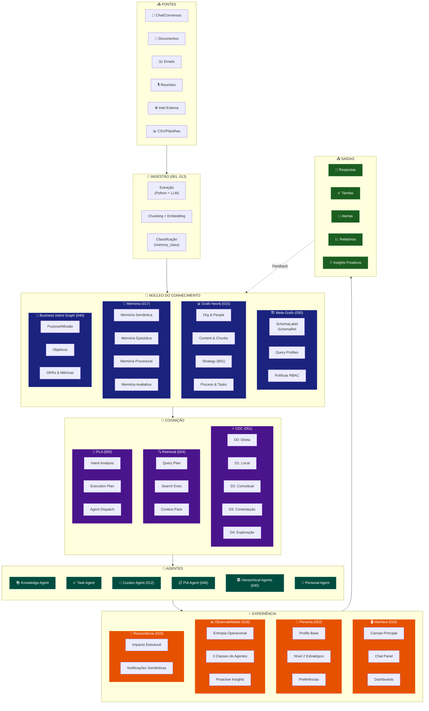
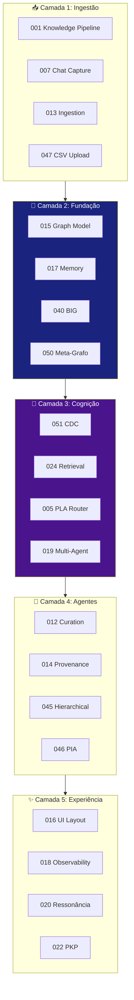

# Análise de Consolidação de Specs - EKS

**Data**: 2025-01-19  
**Objetivo**: Identificar redundâncias, merges necessários e specs obsoletas

---

## 📊 Resumo Executivo

| Categoria | Quantidade |
|-----------|------------|
| **Total de Specs** | 52 |
| **Specs Core (manter)** | 25 |
| **Specs para Merge** | 8 |
| **Specs Obsoletas (deletar)** | 5 |
| **Specs para Avaliar** | 14 |

---

## 🔴 SPECS OBSOLETAS (Recomendação: DELETAR)

### 1. `026-intelligent-router`
**Motivo**: Conceitos de "Context Depth Control" foram **totalmente absorvidos** pelo `051-context-depth-controller` que é mais completo (5 níveis D0-D4 vs 3 níveis).

**Ação**: DELETAR

---

### 2. `032-adaptive-retrieval`
**Motivo**: Conceitos de "Adaptive Retrieval" foram incorporados em:
- `024-retrieval-orchestration` (Query Profiles)
- `051-context-depth-controller` (decisão de profundidade)

**Ação**: DELETAR

---

### 3. `039-context-compression`
**Motivo**: "Rolling Summary" já está em `017-memory-ecosystem` como `ConversationSummary`. "Semantic Pruning" pode ser feito pelo CDC.

**Ação**: DELETAR (conceitos migrados para 017)

---

### 4. `027-onboarding-conversation-pipeline`
**Motivo**: Totalmente absorvido por `022-onboarding-ai-profile` que agora tem:
- Progressive Profiling (6 perguntas iniciais)
- PKP Curator Agent
- Background Extraction

**Ação**: DELETAR

---

### 5. `026-invite-only-auth` (número duplicado)
**Motivo**: Conflito de numeração com `026-intelligent-router`. Conceitos de auth devem ir para `003-admin-login-config`.

**Ação**: MERGE com 003 e DELETAR

---

## 🟡 SPECS PARA MERGE

### 1. `042-memory-steward` → MERGE com `012-graph-curation-ecosystem`

**Análise**: Memory Steward é um "agente de curadoria" focado em qualidade do grafo. O `012-graph-curation-ecosystem` já trata curadoria.

**Proposta**: 
- Adicionar conceito de "Steward Agent" como agente específico dentro de 012
- Ou referenciar como um dos "3 Agentes de Monitoramento" do 018

---

### 2. `043-trust-score-rag` → MERGE com `014-provenance-system`

**Análise**: Trust Score é essencialmente **proveniência + confiança**. O `014-provenance-system` já trata rastreabilidade.

**Proposta**:
- Adicionar seção "Trust Score Calculation" em 014
- Manter `confidence` como propriedade em 015 (já está)

---

### 3. `041-interaction-delegation-graph` → MERGE com `015-neo4j-graph-model`

**Análise**: IDG define relacionamentos de delegação e interação. Esses podem ser adicionados ao modelo de grafo.

**Proposta**:
- Adicionar em 015: `[:DELEGATED_TO]`, `[:HANDED_OFF_TO]`, `:Interaction` node
- Ou manter como extensão temática do 015

---

### 4. `030-corporate-mode` → AVALIAR MERGE com `009-user-memory-decision`

**Análise**: "Corporate Mode" parece ser uma extensão de "Corp vs Pessoal".

---

## 🟢 SPECS CORE (MANTER)

### Camada Foundation
| Spec | Status | Justificativa |
|------|--------|---------------|
| 003-admin-login-config | ✅ MANTER | Auth é essencial |
| 015-neo4j-graph-model | ✅ MANTER | Schema canônico |
| 017-memory-ecosystem | ✅ MANTER | Memória e 4 Classes |
| 040-business-intent-graph | ✅ MANTER | BIG é core |
| 050-meta-graph-schema | ✅ MANTER | Query Profiles |

### Camada Cognição
| Spec | Status | Justificativa |
|------|--------|---------------|
| 005-agent-router (PLA) | ✅ MANTER | Orquestrador principal |
| 019-multi-agent-orchestration | ✅ MANTER | Teams |
| 024-retrieval-orchestration | ✅ MANTER | Retrieval Ecosystem |
| 051-context-depth-controller | ✅ MANTER | CDC D0-D4 |

### Camada Pipeline
| Spec | Status | Justificativa |
|------|--------|---------------|
| 001-knowledge-pipeline | ✅ MANTER | Ingestão |
| 007-chat-knowledge-capture | ✅ MANTER | Captura de chat |
| 012-graph-curation-ecosystem | ✅ MANTER | Curadoria |
| 013-ingestion-ecosystem | ✅ MANTER | Ingestão docs |
| 014-provenance-system | ✅ MANTER | Proveniência |

### Camada Experiência
| Spec | Status | Justificativa |
|------|--------|---------------|
| 016-main-interface-layout | ✅ MANTER | UI principal |
| 018-observability-dashboard | ✅ MANTER | Observabilidade |
| 020-gamification-user-kpis | ✅ MANTER | Ressonância |
| 021-notification-center | ✅ MANTER | Notificações |
| 022-onboarding-ai-profile | ✅ MANTER | PKP |

### Camada Avançada
| Spec | Status | Justificativa |
|------|--------|---------------|
| 045-hierarchical-brainstorm | ✅ MANTER | Debate multi-nível |
| 046-pia-process-intelligence | ✅ MANTER | Mapeamento processos |

---

## 🔵 SPECS PARA AVALIAR (Backlog)

Estas specs podem ser úteis mas não são core para MVP:

| Spec | Avaliação |
|------|-----------|
| 002-admin-node-manager | Útil para admin |
| 004-user-agent-factory | Factory de agentes |
| 006-chat-action-menu | UX |
| 008-task-generation-canvas | Canvas |
| 009-user-memory-decision | Corp/Pessoal |
| 010-data-filtration | Real/Passageiro |
| 011-validation-agent | Validação |
| 023-agenda-calendar-system | Agenda |
| 025-conversation-persistence-system | Persistência |
| 028-file-upload | Upload |
| 029-ux-professional | UX |
| 031-design-system | Design |
| 033-mongodb-setup | MongoDB |
| 035-export-share | Export |
| 037-voice-input | Voz |
| 038-organizational-chart | Org chart |
| 044-spec-driven-simulation | Simulação |
| 047-admin-csv-upload | CSV |
| 048-meeting-participant-detection | Reuniões |
| 049-admin-dashboard | Admin |

---

## 🗑️ AÇÕES DE LIMPEZA

### Deletar Diretórios (5 specs)
```
EKS/specs/026-intelligent-router/
EKS/specs/026-invite-only-auth/
EKS/specs/027-onboarding-conversation-pipeline/
EKS/specs/032-adaptive-retrieval/
EKS/specs/039-context-compression/
```

### Renumerar Conflitos
- `026-invite-only-auth` → mover conceitos para `003-admin-login-config`
- Resolver conflito de numeração (duas 026)

---

## 📐 DIAGRAMA MACRO DA SOLUÇÃO



---

## 🎯 ARQUITETURA EM CAMADAS



---

## ✅ PRÓXIMOS PASSOS

1. **DELETAR** specs obsoletas (5 diretórios)
2. **ATUALIZAR** `_ROADMAP.md` removendo specs obsoletas
3. **MERGE** conceitos restantes
4. **VALIDAR** numeração sem conflitos
5. **DOCUMENTAR** decisões no `project-context/`

---

**Autor**: AI Assistant  
**Revisão**: Pendente aprovação do usuário

