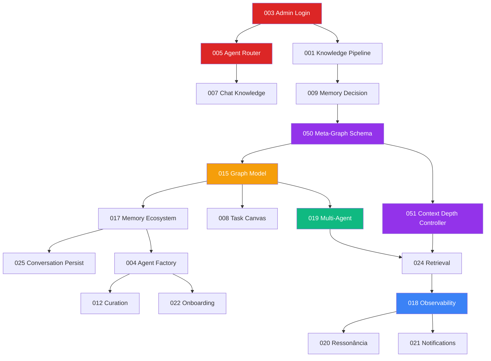
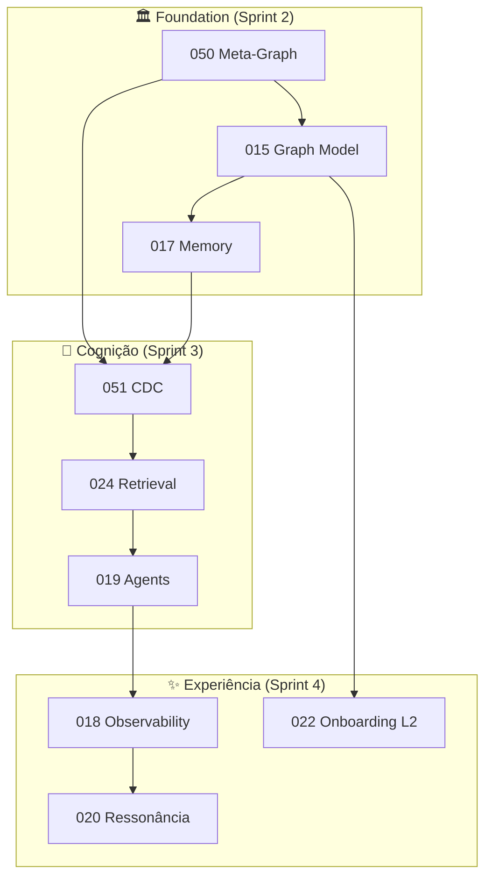

# EKS Specs - Implementation Roadmap

**Total**: 22 specs core (após consolidação)  
**Timeline**: 4 sprints (8 semanas)  
**Status**: Sprint 1 pending  
**Last Refinement**: 2025-01-19 (consolidação + limpeza de specs obsoletas)

> **Consolidação**: 5 specs removidas por serem obsoletas/duplicadas:
> - ~~026-intelligent-router~~ → absorvido por 051-CDC
> - ~~026-invite-only-auth~~ → merge com 003
> - ~~027-onboarding-conversation-pipeline~~ → absorvido por 022
> - ~~032-adaptive-retrieval~~ → absorvido por 024+051
> - ~~039-context-compression~~ → absorvido por 017

---

## Sprint 1: Foundation (Semanas 1-2)

**Objetivo**: Backend + Auth + Chat básico funcionando

### Specs Prioritárias

| # | Spec | Status | Priority | Effort |
|---|------|--------|----------|--------|
| 003 | Admin Login Config | ⏳ Todo | P0 BLOQUEANTE | 2d |
| 005 | Agent Router | ⏳ Todo | P0 CORE | 3d |
| 001 | Knowledge Pipeline | ⏳ Todo | P1 | 3d |
| 007 | Chat Knowledge Capture | ⏳ Todo | P1 | 2d |
| 009 | User Memory Decision | ⏳ Todo | P1 | 2d |

### Deliverables

- ✅ Admin login funcional
- ✅ Backend API REST + WebSocket
- ✅ Neo4j conectado e schema base
- ✅ Chat frontend↔backend funcional
- ✅ Decisão Corp/Pessoal implementada

### Dependencies

- Neo4j Aura configurado
- Azure OpenAI API key
- .env completo

---

## Sprint 2: Memory & Persistence (Semanas 3-4)

**Objetivo**: Memória + Conversas persistidas + Canvas + Meta-Grafo

### Specs Prioritárias

| # | Spec | Status | Priority | Effort |
|---|------|--------|----------|--------|
| 050 | **Meta-Graph Schema** (NEW) | ⏳ Todo | **P0 FOUNDATION** | 2d |
| 015 | Neo4j Graph Model (updated) | ⏳ Todo | P0 SCHEMA | 2d |
| 017 | Memory Ecosystem (updated) | ⏳ Todo | P0 CORE | 3d |
| 025 | Conversation Persistence | ⏳ Todo | P1 | 2d |
| 008 | Task Generation Canvas | ⏳ Todo | P1 | 3d |

### Deliverables

- ✅ Meta-Grafo com Query Profiles
- ✅ MongoDB integrado (long-term memory)
- ✅ Memory levels + MemoryItem + Claims
- ✅ Pesos em relacionamentos (confidence, coherence, recency)
- ✅ Conversas salvas com resumos
- ✅ Canvas renderizando tasks/plans

### Dependencies

- MongoDB Atlas configurado
- Sprint 1 completo

---

## Sprint 3: Agents & Teams (Semanas 5-6)

**Objetivo**: Multi-agent orchestration + Context Depth Controller + **Curadoria Ontológica (HITL Core)**

### Specs Prioritárias

| # | Spec | Status | Priority | Effort |
|---|------|--------|----------|--------|
| 051 | **Context Depth Controller** (NEW) | ⏳ Todo | **P0 FOUNDATION** | 3d |
| 052 | **Ontological Curator Interface** (NEW) | ⏳ Todo | **P0 HITL CORE** | 5d |
| 004 | User Agent Factory | ⏳ Todo | P1 | 3d |
| 019 | Multi-Agent Orchestration | ⏳ Todo | P0 CORE | 4d |
| 024 | Retrieval Orchestration (updated) | ⏳ Todo | P1 | 3d |
| 012 | Graph Curation Ecosystem | ⏳ Todo | P2 | 2d |

### Deliverables

- ✅ CDC com 5 níveis (D0-D4)
- ✅ **Interface de Curadoria Ontológica** (epicentro HITL)
- ✅ Visualização interativa do grafo para curador
- ✅ Python agents rodando (FastAPI)
- ✅ Agno Teams funcionando
- ✅ Retrieval com Query Profiles do Meta-Grafo
- ✅ Curadoria automática ativa

### Dependencies

- Agno Framework setup
- Sprint 2 completo (050 Meta-Graph)

---

## Sprint 4: Polish & Advanced (Semanas 7-8)

**Objetivo**: Observability + Ressonância + Onboarding Nível 2

### Specs Prioritárias

| # | Spec | Status | Priority | Effort |
|---|------|--------|----------|--------|
| 018 | Observability Dashboard (updated) | ⏳ Todo | P1 | 3d |
| 020 | **Incentivo por Ressonância** (renamed) | ⏳ Todo | P2 | 2d |
| 021 | Notification Center | ⏳ Todo | P2 | 2d |
| 022 | Onboarding AI Profile (updated) | ⏳ Todo | P1 | 3d |

### Deliverables

- ✅ Dashboard admin com Entropia Operacional
- ✅ 3 classes de agentes de monitoramento
- ✅ Ressonância (não gamificação clássica)
- ✅ Notificações semânticas
- ✅ Onboarding Nível 2 com Tripé Ontológico

### Dependencies

- Sprint 3 completo

---

## Backlog (Pós-MVP)

### Phase 5: Advanced Features

| # | Spec | Priority | Effort |
|---|------|----------|--------|
| 002 | Admin Node Manager | P2 | 2d |
| 006 | Chat Action Menu | P2 | 1d |
| 010 | Data Filtration | P1 | 2d |
| 011 | Validation Agent | P2 | 2d |
| 013 | Ingestion Ecosystem | P1 | 3d |
| 014 | Provenance System | P2 | 2d |
| 016 | Main Interface Layout | P1 | 3d |
| 023 | Agenda Calendar System | P3 | 3d |
| 040 | Business Intent Graph | P0 | 3d |
| 045 | Hierarchical Brainstorm | P2 | 3d |
| 046 | PIA Process Intelligence | P2 | 4d |

> **Nota**: Spec 026 foi removida - conceitos de Context Depth Control agora estão em 051-CDC

### Phase 6: Optimization

- Performance tuning
- Neo4j query optimization
- Cost reduction (LLM usage)
- UI/UX refinements

---

## Dependencies Graph

### Nova Arquitetura Conceitual

---

## Progress Tracking

### Sprint 1 Progress

- [ ] 003 - Admin Login Config
- [ ] 005 - Agent Router
- [ ] 001 - Knowledge Pipeline
- [ ] 007 - Chat Knowledge Capture
- [ ] 009 - User Memory Decision

### Sprint 2 Progress

- [ ] **050 - Meta-Graph Schema** (NEW)
- [ ] 015 - Neo4j Graph Model (updated: pesos, idx)
- [ ] 017 - Memory Ecosystem (updated: MemoryItem, Claims)
- [ ] 025 - Conversation Persistence
- [ ] 008 - Task Generation Canvas

### Sprint 3 Progress

- [ ] **051 - Context Depth Controller** (NEW)
- [ ] **052 - Ontological Curator Interface** (NEW - HITL Core)
- [ ] 004 - User Agent Factory
- [ ] 019 - Multi-Agent Orchestration
- [ ] 024 - Retrieval Orchestration (updated: Query Profiles)
- [ ] 012 - Graph Curation

### Sprint 4 Progress

- [ ] 018 - Observability Dashboard (updated: Entropia, Agentes Monitor)
- [ ] 020 - **Incentivo por Ressonância** (renamed/refocused)
- [ ] 021 - Notification Center
- [ ] 022 - Onboarding AI Profile (updated: Nível 2, Tripé)

---

## Effort Summary

| Sprint | Specs | Total Days | Team Size | Duration |
|--------|-------|------------|-----------|----------|
| Sprint 1 | 5 | 12d | 1 dev | 2 weeks |
| Sprint 2 | 5 (+050) | 12d | 1 dev | 2 weeks |
| Sprint 3 | 6 (+051, +052) | 20d | 1 dev | 2.5 weeks |
| Sprint 4 | 4 | 10d | 1 dev | 2 weeks |
| **TOTAL** | **20 core** | **54d** | **1 dev** | **8.5 weeks** |

**Note**: 11 specs restantes ficam no backlog (Phase 5/6)

### Specs Consolidadas (23 Core)

| Camada | Specs |
|--------|-------|
| **Fundação** | 015, 017, 040, 050 |
| **Cognição** | 005, 024, 051 |
| **Pipeline** | 001, 007, 012, 013, 014 |
| **Agentes** | 004, 019, 045, 046 |
| **HITL (Human-in-the-Loop)** | **052** |
| **Experiência** | 016, 018, 020, 021, 022 |
| **Auth/Config** | 003, 009 |

---

## Risk Assessment

| Risk | Impact | Mitigation |
|------|--------|------------|
| Neo4j query performance | High | Índices desde Sprint 1, benchmark early |
| Agno learning curve | Medium | Prototipar primeiro agente em Sprint 2 |
| MongoDB integration complexity | Medium | Usar driver oficial, tests desde início |
| Scope creep | High | Manter specs em backlog, não adicionar mid-sprint |
| Azure OpenAI rate limits | Medium | Exponential backoff, usage monitoring |

---

## Novas Specs Adicionadas (2025-01-19)

### 050 - Meta-Graph Schema

**Propósito**: Schema como dados consultáveis no próprio grafo.

**Principais Conceitos**:
- SchemaLabel, SchemaRel, SchemaProp como nodes
- Query Profiles por intenção (org_context, document_evidence, process_state, strategy_alignment)
- RBAC como propriedade da concessão
- Políticas de validade temporal

### 051 - Context Depth Controller (CDC)

**Propósito**: Controlar profundidade de contexto por intenção.

**Níveis de Profundidade**:
- D0: Resposta direta (mínimo)
- D1: Continuidade local
- D2: Profundidade conceitual
- D3: Contestação/correção
- D4: Exploração/mudança de frame

**Principais Conceitos**:
- Sinais de profundidade (anáfora, discordância, mudança de tema)
- Retrieval Plan por nível
- Context Pack estruturado

### 052 - Ontological Curator Interface (NEW - 2025-01-19)

**Propósito**: Epicentro do Human-in-the-Loop (HITL). Interface visual para o Curador Ontológico refinar a ontologia viva do negócio.

**O Curador Ontológico NÃO é**:
- Admin (gestão operacional)
- Agente IA (Memory Steward)

**O Curador Ontológico É**:
- Humano que conhece o negócio
- Atua sobre o schema semântico dinâmico
- Usa visualização do grafo como instrumento cognitivo

**Principais Capacidades**:
- Visualização interativa do grafo (D3.js/Cytoscape)
- Detecção de antipadrões (ciclos, centralizadores, órfãos)
- Validação de sugestões da IA (Memory Steward)
- Refinamento de schema (criar labels, relacionamentos)
- Feedback que alimenta auto-aperfeiçoamento

**Por que P0**:
> "O EKS só se autoaperfeiçoa de forma sustentável quando o aprendizado estatístico é subordinado a uma ontologia de negócio curada visualmente por humanos que entendem a organização."

### Modificações em Specs Existentes

| Spec | Modificações |
|------|-------------|
| 015 | Pesos em relacionamentos, idx para chunks, referência ao Meta-Grafo, **Consolidação Ontológica** |
| 017 | MemoryItem com ciclo de vida, Claims/Decision/Outcome, integração CDC |
| 018 | Entropia Operacional, 3 classes de agentes de monitoramento |
| 020 | Reorientado para Incentivo por Ressonância (não gamificação clássica) |
| 022 | Nível 2 com Tripé Ontológico (Estratégia, Processo, Decisão) |
| 024 | Integração com Query Profiles e CDC |
| 040 | Nota de consolidação com labels canônicos |

---

## Consolidação Ontológica (Aparando Arestas)

Para evitar conceitos concorrentes, foi estabelecida uma **ontologia unificada**:

### Labels Canônicos (Fonte: 015 + 050)

| Label Canônico | Sinônimos/Deprecated | Specs que Usam |
|----------------|---------------------|----------------|
| `:Department` | `:Area` (deprecated) | 015, 050, 018, 020 |
| `:Organization` | `:Company` (sinônimo) | 015, 040, 050 |
| `:Knowledge` | `:MemoryItem` (especialização) | 015, 017, 040, 051 |
| `:Objective` | `:StrategicObjective` (sinônimo) | 040, 022, 050 |
| `:Process` | `:MacroProcess` (especialização) | 017, 022, 050 |

### Relacionamentos Padronizados

| Relacionamento | Propriedades | Contexto |
|----------------|--------------|----------|
| `[:SUPPORTS]` (Knowledge→Objective) | `relevance_score`, `assigned_by`, `confidence` | BIG |
| `[:SUPPORTS]` (Claim→Claim) | `confidence` | Claims |
| `[:PERCEIVES]` | `confidence`, `coherence`, `perspective` | Nível 2 |
| `[:EXTRACTED_FROM]` | `confidence`, `method` | Proveniência |
| `[:GRANTS]` | `level`, `scope_type`, `valid_from` | RBAC |

### Regras de Ouro

1. **Sempre consultar Meta-Grafo (050)** para verificar label canônico
2. **Usar `:Knowledge`** como label principal, adicionar `:MemoryItem` quando precisar de ciclo de vida
3. **Usar `:Department`** em vez de `:Area`
4. **`relevance_score`** para objetivos, **`confidence`** para outras relações
5. **Dual-label** quando necessário: `(:Knowledge:MemoryItem {...})`

---

## Specs Removidas (Consolidação 2025-01-19)

As seguintes specs foram **deletadas** por serem obsoletas ou terem conceitos já absorvidos:

| Spec Removida | Motivo | Absorvida Por |
|---------------|--------|---------------|
| `026-intelligent-router` | Context Depth duplicado | `051-context-depth-controller` |
| `026-invite-only-auth` | Numeração conflitante | `003-admin-login-config` |
| `027-onboarding-conversation-pipeline` | Totalmente absorvido | `022-onboarding-ai-profile` |
| `032-adaptive-retrieval` | Conceitos incorporados | `024-retrieval` + `051-CDC` |
| `039-context-compression` | Rolling Summary existe em | `017-memory-ecosystem` |

### Specs que Absorveram Conceitos

- **051-context-depth-controller**: Agora inclui:
  - 5 níveis de profundidade (D0-D4) - antes era 3 níveis no 026
  - Sinais de detecção automática
  - Retrieval Plans por nível

- **022-onboarding-ai-profile**: Agora inclui:
  - PKP (Persona Knowledge Profile)
  - Progressive Profiling (antes era conversation pipeline)
  - Background Extraction
  - Nível 2 com Tripé Ontológico

- **017-memory-ecosystem**: Agora inclui:
  - ConversationSummary (Rolling Summary)
  - 4 Classes de Memória
  - MemoryItem com ciclo de vida
  - Claims/Decision/Outcome

- **024-retrieval-orchestration**: Agora inclui:
  - Query Profiles do Meta-Grafo
  - Integração com CDC
  - Retrieval adaptativo por intenção

---

**Last Updated**: 2025-01-19  
**Next Review**: Sprint 1 kickoff
