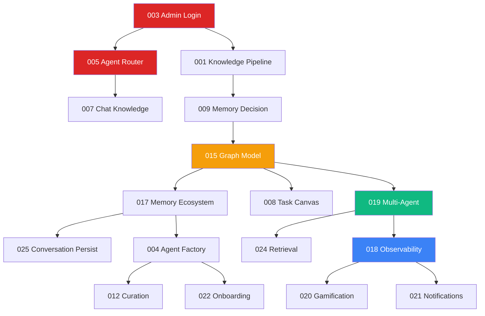

# EKS Specs - Implementation Roadmap

**Total**: 25 specs  
**Timeline**: 4 sprints (8 semanas)  
**Status**: Sprint 1 pending

---

## Sprint 1: Foundation (Semanas 1-2)

**Objetivo**: Backend + Auth + Chat básico funcionando

### Specs Prioritárias

| # | Spec | Status | Priority | Effort |
|---|------|--------|----------|--------|
| 003 | Admin Login Config | ⏳ Todo | P0 BLOQUEANTE | 2d |
| 005 | Agent Router | ⏳ Todo | P0 CORE | 3d |
| 001 | Knowledge Pipeline | ⏳ Todo | P1 | 3d |
| 007 | Chat Knowledge Capture | ⏳ Todo | P1 | 2d |
| 009 | User Memory Decision | ⏳ Todo | P1 | 2d |

### Deliverables

- ✅ Admin login funcional
- ✅ Backend API REST + WebSocket
- ✅ Neo4j conectado e schema base
- ✅ Chat frontend↔backend funcional
- ✅ Decisão Corp/Pessoal implementada

### Dependencies

- Neo4j Aura configurado
- Azure OpenAI API key
- .env completo

---

## Sprint 2: Memory & Persistence (Semanas 3-4)

**Objetivo**: Memória + Conversas persistidas + Canvas

### Specs Prioritárias

| # | Spec | Status | Priority | Effort |
|---|------|--------|----------|--------|
| 015 | Neo4j Graph Model | ⏳ Todo | P0 SCHEMA | 2d |
| 017 | Memory Ecosystem | ⏳ Todo | P0 CORE | 3d |
| 025 | Conversation Persistence | ⏳ Todo | P1 | 2d |
| 008 | Task Generation Canvas | ⏳ Todo | P1 | 3d |

### Deliverables

- ✅ MongoDB integrado (long-term memory)
- ✅ Memory levels (short/medium/long)
- ✅ Conversas salvas com resumos
- ✅ Canvas renderizando tasks/plans

### Dependencies

- MongoDB Atlas configurado
- Sprint 1 completo

---

## Sprint 3: Agents & Teams (Semanas 5-6)

**Objetivo**: Multi-agent orchestration funcionando

### Specs Prioritárias

| # | Spec | Status | Priority | Effort |
|---|------|--------|----------|--------|
| 004 | User Agent Factory | ⏳ Todo | P1 | 3d |
| 019 | Multi-Agent Orchestration | ⏳ Todo | P0 CORE | 4d |
| 024 | Retrieval Orchestration | ⏳ Todo | P1 | 3d |
| 012 | Graph Curation Ecosystem | ⏳ Todo | P2 | 2d |

### Deliverables

- ✅ Python agents rodando (FastAPI)
- ✅ Agno Teams funcionando
- ✅ Retrieval híbrido (graph+vector+grep)
- ✅ Curadoria automática ativa

### Dependencies

- Agno Framework setup
- Sprint 2 completo

---

## Sprint 4: Polish & Advanced (Semanas 7-8)

**Objetivo**: Observability + Gamification + Onboarding

### Specs Prioritárias

| # | Spec | Status | Priority | Effort |
|---|------|--------|----------|--------|
| 018 | Observability Dashboard | ⏳ Todo | P1 | 3d |
| 020 | Gamification User KPIs | ⏳ Todo | P2 | 2d |
| 021 | Notification Center | ⏳ Todo | P2 | 2d |
| 022 | Onboarding AI Profile | ⏳ Todo | P1 | 3d |

### Deliverables

- ✅ Dashboard admin com métricas
- ✅ Gamification ativa
- ✅ Notificações funcionando
- ✅ Onboarding completo

### Dependencies

- Sprint 3 completo

---

## Backlog (Pós-MVP)

### Phase 5: Advanced Features

| # | Spec | Priority | Effort |
|---|------|----------|--------|
| 026 | **Intelligent Router System** (NEW) | **P1** | **4d** |
| 002 | Admin Node Manager | P2 | 2d |
| 006 | Chat Action Menu | P2 | 1d |
| 010 | Data Filtration | P1 | 2d |
| 011 | Validation Agent | P2 | 2d |
| 013 | Ingestion Ecosystem | P1 | 3d |
| 014 | Provenance System | P2 | 2d |
| 023 | Agenda Calendar System | P3 | 3d |

**Spec 026** - Context Depth Control + LLM Router + API Gateway

### Phase 6: Optimization

- Performance tuning
- Neo4j query optimization
- Cost reduction (LLM usage)
- UI/UX refinements

---

## Dependencies Graph

---

## Progress Tracking

### Sprint 1 Progress

- [ ] 003 - Admin Login Config
- [ ] 005 - Agent Router
- [ ] 001 - Knowledge Pipeline
- [ ] 007 - Chat Knowledge Capture
- [ ] 009 - User Memory Decision

### Sprint 2 Progress

- [ ] 015 - Neo4j Graph Model
- [ ] 017 - Memory Ecosystem
- [ ] 025 - Conversation Persistence
- [ ] 008 - Task Generation Canvas

### Sprint 3 Progress

- [ ] 004 - User Agent Factory
- [ ] 019 - Multi-Agent Orchestration
- [ ] 024 - Retrieval Orchestration
- [ ] 012 - Graph Curation

### Sprint 4 Progress

- [ ] 018 - Observability Dashboard
- [ ] 020 - Gamification User KPIs
- [ ] 021 - Notification Center
- [ ] 022 - Onboarding AI Profile

---

## Effort Summary

| Sprint | Specs | Total Days | Team Size | Duration |
|--------|-------|------------|-----------|----------|
| Sprint 1 | 5 | 12d | 1 dev | 2 weeks |
| Sprint 2 | 4 | 10d | 1 dev | 2 weeks |
| Sprint 3 | 4 | 12d | 1 dev | 2 weeks |
| Sprint 4 | 4 | 10d | 1 dev | 2 weeks |
| **TOTAL** | **17** | **44d** | **1 dev** | **8 weeks** |

**Note**: 8 specs restantes ficam no backlog (Phase 5/6)

---

## Risk Assessment

| Risk | Impact | Mitigation |
|------|--------|------------|
| Neo4j query performance | High | Índices desde Sprint 1, benchmark early |
| Agno learning curve | Medium | Prototipar primeiro agente em Sprint 2 |
| MongoDB integration complexity | Medium | Usar driver oficial, tests desde início |
| Scope creep | High | Manter specs em backlog, não adicionar mid-sprint |
| Azure OpenAI rate limits | Medium | Exponential backoff, usage monitoring |

---

**Last Updated**: 2024-12-13  
**Next Review**: Sprint 1 kickoff
