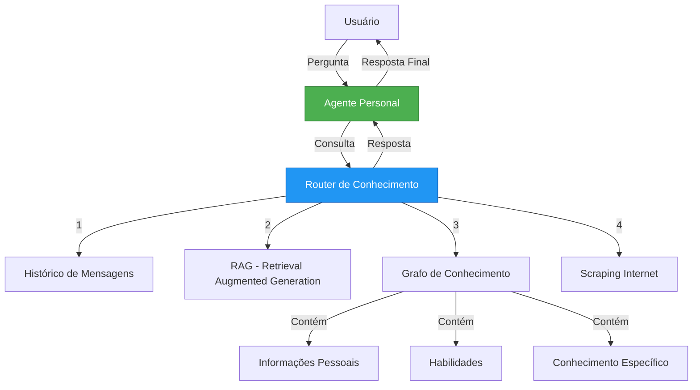
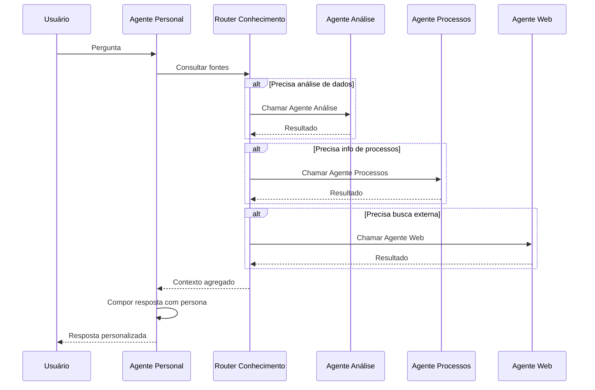
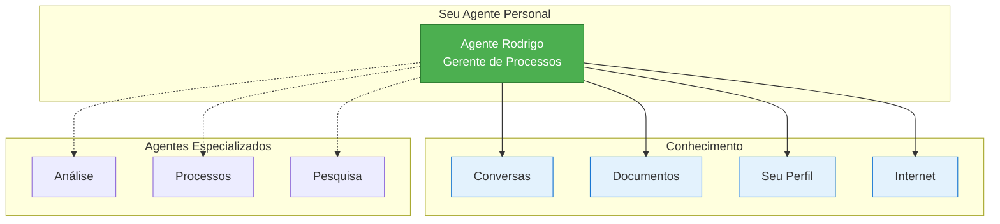

# Arquitetura: Agente Personal + Router de Conhecimento

**Versão**: 1.0.0  
**Data**: 2024-12-15  
**Status**: Escopo Inicial

---

## Visão Geral

O **Agente Personal** é o resultado principal do processo de onboarding (First-Run Experience). Ele representa a interface personalizada entre o usuário e o sistema, construído com base nos dados coletados durante o onboarding.

---

## Conceitos Fundamentais

### 1. Agente Personal

**Definição**: Agente AI personalizado que possui a persona do usuário e gerencia todas as interações.

**Características**:
- Construído a partir dos dados do onboarding (cargo, competências, objetivos, desafios, preferências AI)
- Mantém contexto e características do usuário em todas as respostas
- É a interface principal de comunicação (não o Router genérico)
- Orquestra chamadas a outros agentes internos conforme necessidade

**Prompt Base (Persona)**:
```
Composto por:
- Nome, cargo, departamento
- Competências LinkedIn
- Objetivos principais
- Desafios do dia-a-dia
- Nível de experiência AI
- Necessidades selecionadas
- Posição no organograma (gestor, subordinados, pares)
```

---

## Router de Conhecimento

O Agente Personal possui um **Router de Conhecimento** que decide onde buscar informações para compor respostas.

### Fontes de Conhecimento



### Detalhamento das Fontes

#### 1. Histórico de Mensagens
- Conversas anteriores do usuário
- Contexto de curto prazo
- Continuidade de tópicos

#### 2. RAG (Retrieval Augmented Generation)
- Documentos corporativos
- Bases de conhecimento da empresa
- Políticas e procedimentos

#### 3. Grafo de Conhecimento
- **Informações Pessoais**: dados do perfil, organograma
- **Habilidades**: competências extraídas do LinkedIn
- **Conhecimento Específico**: expertise em áreas/tópicos
- **Relacionamentos**: conexões no grafo corporativo

#### 4. Scraping Internet
- Busca de informações atualizadas
- **Frequência configurável pelo usuário**:
  - Diário (ex: cotações, notícias)
  - Semanal
  - Sob demanda
  - Eventos específicos
- Exemplos de uso:
  - Cotação de ações
  - Notícias de mercado
  - Atualizações regulatórias
  - Tendências do setor

---

## Fluxo de Interação



**Pontos-chave**:
1. Usuário **sempre** interage com seu Agente Personal
2. Agente Personal **consulta** Router de Conhecimento
3. Router pode **chamar agentes internos** especializados
4. Agente Personal **compõe resposta final** mantendo persona

---

## Escopo Futuro (Roadmap)

### Fase 1 - MVP (Atual)
- [x] Coleta de dados no onboarding
- [x] Criação do perfil de usuário
- [ ] Visualização do Agente Personal criado
- [ ] Chat básico com Agente Personal

### Fase 2 - Router de Conhecimento Básico
- [ ] Histórico de mensagens
- [ ] RAG com documentos corporativos
- [ ] Grafo de conhecimento pessoal (perfil + habilidades)

### Fase 3 - Agentes Especializados
- [ ] Agente de Análise de Dados
- [ ] Agente de Processos
- [ ] Agente de Pesquisa
- [ ] Registry de agentes disponíveis

### Fase 4 - Scraping e Automação
- [ ] Scraping configurável da internet
- [ ] Frequência de atualização por usuário
- [ ] Alertas e notificações automáticas
- [ ] Feeds personalizados

### Fase 5 - Evolução da Persona
- [ ] Aprendizado contínuo com interações
- [ ] Refinamento automático do prompt
- [ ] Feedback loop de satisfação
- [ ] A/B testing de prompts

---

## Implementação Atual

### Chat Store (chat-store.ts)

**Agente Personal no lugar do Router**:
```typescript
// Ao invés de "Router" como agente padrão:
const personalAgent = {
  id: 'personal',
  name: `Agente ${user.name.split(' ')[0]}`, // "Agente Rodrigo"
  description: `Seu assistente pessoal baseado no seu perfil de ${user.jobRole}`,
  systemPrompt: buildPersonalAgentPrompt(onboardingData),
  avatar: user.avatar,
  capabilities: ['chat', 'knowledge', 'analysis']
}
```

### Prompt do Agente Personal

Construído a partir do onboarding:

```typescript
function buildPersonalAgentPrompt(data: OnboardingResponses): string {
  return `
    Você é o assistente pessoal de ${data.fullName}.
    
    CONTEXTO DO USUÁRIO:
    - Cargo: ${data.jobRole}
    - Empresa: ${data.company}
    - Departamento: ${data.department}
    - Gestor direto: ${data.manager}
    
    COMPETÊNCIAS:
    ${data.linkedinCompetencies.join(', ')}
    
    OBJETIVOS:
    ${data.primaryObjective}
    
    DESAFIOS:
    ${data.topChallenges}
    
    PREFERÊNCIAS AI:
    - Nível: ${data.aiExperienceLevel}
    - Necessidades: ${data.needs.join(', ')}
    
    INSTRUÇÕES:
    - Mantenha tom profissional mas acessível
    - Considere o contexto corporativo (${data.company})
    - Priorize objetivos e desafios mencionados
    - Adapte linguagem ao nível de experiência
    - Use conhecimento das competências para contextualizar
  `;
}
```

---

## Visualização no Onboarding

No step **"Concluído"** (done), mostrar diagrama Mermaid do Agente Personal criado:



---

## Referências

- Spec 027: Onboarding Conversation Pipeline
- Spec 028: Organizational Chart Management
- `/EKS/frontend/src/store/chat-store.ts`
- `/EKS/frontend/src/components/canvas/OnboardingWizard.tsx`
