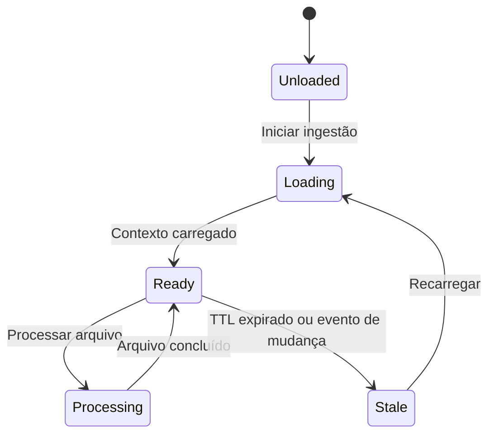
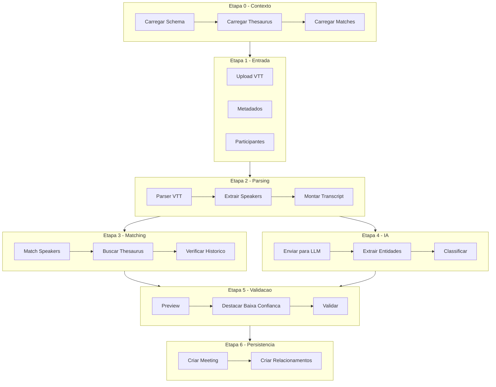
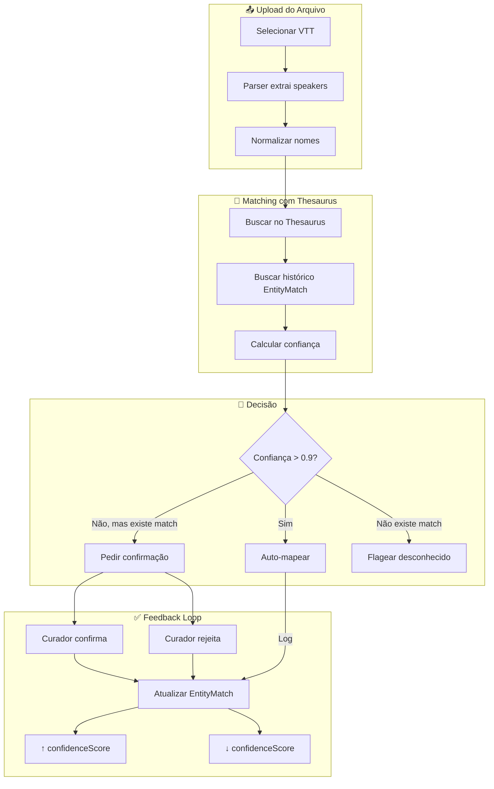
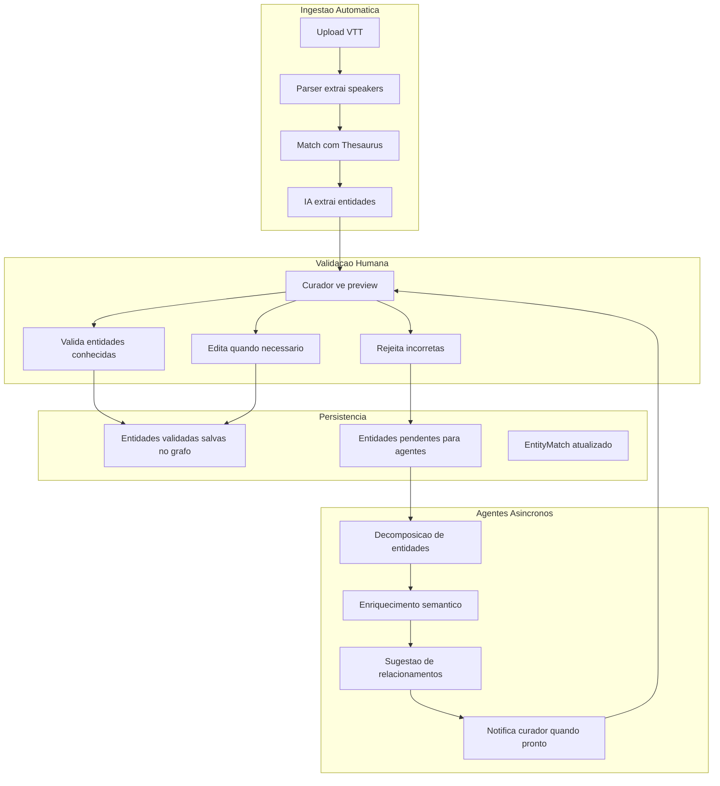

# Planejamento: Ingestão de Transcrições de Reunião

**Data**: 2026-02-04  
**Status**: Planejamento  
**Prioridade**: P1 (Core)  
**Specs Relacionadas**: 007, 010, 012, 013, 014

---

## 1. Análise do Formato VTT (Teams)

### Estrutura do Arquivo

```
WEBVTT

{segment-uuid}/{index}
{timestamp_start} --> {timestamp_end}
<v Nome Completo do Participante>Texto da fala.</v>
```

### Campos Extraíveis Automaticamente

| Campo | Fonte | Exemplo |
|-------|-------|---------|
| **Participantes (speakers)** | Tag `<v ...>` | `julio Lewkowicz`, `Vinicius Mendes Marcilio` |
| **Timestamps** | Linha de tempo | `00:00:04.817 --> 00:00:06.097` |
| **Duração total** | Último timestamp | Calculável |
| **Conteúdo** | Texto dentro de `<v>...</v>` | Fala transcrita |
| **ID único** | UUID do segmento | `5c948908-64b9-460d-816b-d9f943b87c46` |

### ⚠️ Campos NÃO Disponíveis no VTT

| Campo | Solução |
|-------|---------|
| **Data/Hora da reunião** | Input manual obrigatório |
| **Título da reunião** | Input manual ou inferir do nome do arquivo |
| **Organizador** | Inferir do primeiro speaker ou input manual |
| **Projeto relacionado** | Seleção manual (já existe no componente) |

---

## 2. Lacunas Identificadas no Componente Atual

### 2.1 Campos Faltantes na UI

| Campo | Status | Ação |
|-------|--------|------|
| **Data da Reunião** | ❌ Faltando | Adicionar `<Input type="date">` |
| **Hora da Reunião** | ❌ Faltando | Adicionar `<Input type="time">` |
| **Duração (calculada)** | ⚠️ Mock | Calcular do VTT |

### 2.2 Processamento

| Aspecto | Status | Ação |
|---------|--------|------|
| **Parser VTT real** | ❌ Mock | Implementar parser para formato Teams |
| **Extração de speakers** | ❌ Mock | Extrair de tags `<v>` |
| **Identificação de entidades mencionadas** | ❌ Não existe | Implementar com IA |
| **Mapeamento speaker → User** | ⚠️ Parcial | Melhorar fuzzy matching |
| **Validação com IA** | ❌ Não existe | Implementar pipeline de feedback |

### 2.3 Backend

| Aspecto | Status | Ação |
|---------|--------|------|
| **Endpoint de ingestão** | ❌ Não existe | Criar `/api/meetings/ingest` |
| **Pipeline de extração** | ❌ Não existe | Integrar com Azure OpenAI |
| **Persistência Neo4j** | ⚠️ Payload definido | Implementar Cypher queries |

---

## 3. Premissa Fundamental: Ontology-First

> ⚠️ **REGRA DE OURO**: Todo pipeline de ingestão DEVE conhecer o schema/ontologia do banco ANTES de processar qualquer dado.

### Por quê?

1. **Classificação correta**: Saber quais tipos de entidades existem (User, Project, Area, Knowledge...)
2. **Matching preciso**: Usar thesaurus com aliases para identificar entidades
3. **Validação semântica**: Garantir que relações criadas seguem o schema
4. **Evolução consistente**: Novos dados respeitam a estrutura existente

### APIs de Contexto (já implementadas)

| API | Retorno | Uso |
|-----|---------|-----|
| `getOntologySchema()` | Labels, propriedades, constraints | Saber O QUE existe |
| `getOntologyTaxonomy()` | Hierarquia organizacional | Contexto de áreas/deptos |
| `getOntologyThesaurus()` | Nomes canônicos + aliases | Matching de entidades |
| `getOntologyStats()` | Contagens por tipo | Métricas de cobertura |

### Objeto de Contexto de Ingestão

```typescript
interface IngestionContext {
  // Schema do banco - O QUE pode existir
  schema: {
    nodeLabels: string[];           // ['User', 'Project', 'Area', 'Knowledge', ...]
    relationshipTypes: string[];    // ['WORKS_IN', 'PARTICIPATED_IN', 'MENTIONS', ...]
    propertyKeys: Record<string, string[]>; // { User: ['name', 'email', ...] }
  };
  
  // Taxonomia - COMO está organizado
  taxonomy: {
    departments: TaxonomyNode[];    // Hierarquia de áreas
    projects: TaxonomyNode[];       // Projetos ativos
    okrs: TaxonomyNode[];           // OKRs vigentes
  };
  
  // Thesaurus - QUEM/O QUÊ pode ser reconhecido
  thesaurus: {
    entries: ThesaurusEntry[];      // Nomes canônicos + aliases
    byAlias: Map<string, string[]>; // Índice invertido: alias → [ids]
  };
  
  // Histórico de Matches - CONFIANÇA acumulada
  entityMatches: {
    patterns: EntityMatch[];        // Padrões já validados
    byPattern: Map<string, EntityMatch>; // Índice: padrão normalizado → match
  };
  
  // Metadados
  loadedAt: Date;
  version: string;
}
```

### Ciclo de Vida do Contexto



---

## 4. Fluxo Proposto de Ingestao



---

## 4. Extração de Entidades com IA

### 4.1 Tipos de Entidades a Extrair

| Tipo | Descrição | Exemplo no Transcript |
|------|-----------|----------------------|
| **Pessoa** | Pessoas mencionadas (não speakers) | "Bruno fez a revisão da interface" |
| **Projeto** | Projetos ou produtos citados | "Maverick", "Move Studio" |
| **Organização** | Empresas externas | "Pirelli", "Notion" |
| **Área/Depto** | Áreas internas | "Tecnologia", "Vendas" |
| **Prazo** | Datas e deadlines | "até sexta-feira", "semana passada" |
| **Decisão** | Decisões tomadas | "Aprovar orçamento adicional" |
| **Tarefa** | Ações a fazer | "revisar cronograma", "enviar relatório" |
| **Risco** | Riscos identificados | "atraso na entrega" |
| **Insight** | Insights de negócio | "cliente interessado em expansão" |

### 4.2 Pipeline de Extração

```
1. Parser VTT → Transcript consolidado (texto corrido com speakers)
2. Chunking → Dividir em blocos de ~2000 tokens
3. LLM Call (GPT-4o) → Extrair entidades por chunk
4. Merge → Consolidar entidades duplicadas
5. Confidence Score → Atribuir confiança baseado em:
   - Clareza da menção
   - Contexto disponível
   - Correspondência com grafo existente
6. Cross-reference → Buscar no Neo4j entidades já existentes
7. Feedback → Gerar relatório para curador
```

### 4.3 Prompt de Extração (Draft)

```markdown
Você é um especialista em extração de entidades de transcrições de reuniões corporativas.

Analise o trecho abaixo e extraia:
1. **Pessoas mencionadas** (não os speakers, mas pessoas citadas na conversa)
2. **Projetos ou produtos** mencionados
3. **Organizações externas** citadas
4. **Áreas/Departamentos** referenciados
5. **Prazos/Datas** mencionados
6. **Decisões** tomadas durante a reunião
7. **Tarefas/Ações** a serem executadas
8. **Riscos** identificados
9. **Insights** de negócio

Para cada entidade, forneça:
- **value**: Nome/descrição da entidade
- **type**: Tipo da entidade
- **context**: Trecho onde foi mencionada
- **confidence**: 0.0 a 1.0 (certeza da extração)
- **sourceRef**: Timestamp aproximado

Retorne em JSON.
```

---

## 5. Processo de Validação e Feedback

### 5.1 Níveis de Confiança

| Score | Classificação | Ação |
|-------|---------------|------|
| **0.9 - 1.0** | Alta | Auto-validar (opcional) |
| **0.7 - 0.9** | Média | Sugerir, aguardar validação |
| **0.5 - 0.7** | Baixa | Destacar em amarelo, pedir revisão |
| **< 0.5** | Muito baixa | Destacar em vermelho, exigir ação |

### 5.2 Feedback para Curador

O relatório final deve incluir:

```
📊 RELATÓRIO DE EXTRAÇÃO

📁 Arquivo: CoCreateAI - MOVE.vtt
📅 Data: 2026-02-04 14:30
⏱️ Duração: 45:32
👥 Speakers identificados: 4 (3 mapeados, 1 não reconhecido)

---

✅ ENTIDADES VALIDADAS AUTOMATICAMENTE (alta confiança)
- [Pessoa] Bruno → Node existente: User:bruno-uuid
- [Projeto] Maverick → Node existente: Project:maverick-uuid
- [Área] Tecnologia → Node existente: Department:tech-uuid

---

⚠️ ENTIDADES PARA REVISÃO (média/baixa confiança)
- [Organização] Pirelli (0.72) → Contexto: "não citou nada da pirelli"
  ❓ Ação: Confirmar se é cliente ou menção casual
  
- [Pessoa] Jorge Alberto (0.65) → Contexto: "E aí, vocês estão usando..."
  ❓ Ação: Mapear para User existente ou criar novo?

---

🔴 GAPS IDENTIFICADOS
- Speaker "Rodrigo Trindade Trindade" não mapeado para User
- 3 entidades com confiança < 0.6

---

💡 SUGESTÕES
1. Revisar mapeamento de "Rodrigo Trindade Trindade"
2. Confirmar se "Pirelli" deve ser criado como ExternalParticipant
3. Adicionar timestamp de início da reunião (não detectado no arquivo)
```

---

## 6. Fases de Implementação

### Fase 1: Parser VTT e Metadados (2-3 dias)

**Objetivo**: Parser funcional + campos de data/hora

| Task | Descrição | Prioridade |
|------|-----------|------------|
| 1.1 | Criar parser VTT para formato Teams | P0 |
| 1.2 | Extrair speakers automaticamente | P0 |
| 1.3 | Calcular duração da reunião | P1 |
| 1.4 | Adicionar campos Data/Hora na UI | P0 |
| 1.5 | Consolidar transcript para processamento | P1 |

### Fase 2: Matching de Participantes (2 dias)

**Objetivo**: Mapear speakers → Users do Neo4j

| Task | Descrição | Prioridade |
|------|-----------|------------|
| 2.1 | Implementar fuzzy matching por nome | P0 |
| 2.2 | Scoring de confiança no match | P1 |
| 2.3 | UI para resolver matches ambíguos | P1 |
| 2.4 | Permitir criar novo participante externo | P2 |

### Fase 3: Extração de Entidades com IA (3-4 dias)

**Objetivo**: Identificar entidades mencionadas no conteúdo

| Task | Descrição | Prioridade |
|------|-----------|------------|
| 3.1 | Endpoint backend `/api/meetings/extract` | P0 |
| 3.2 | Integração com Azure OpenAI GPT-4o | P0 |
| 3.3 | Prompt engineering para extração | P0 |
| 3.4 | Cross-reference com Neo4j (entidades existentes) | P1 |
| 3.5 | Consolidação e deduplicação de entidades | P1 |

### Fase 4: Validação e Feedback (3 dias)

**Objetivo**: Interface de validação para curador

| Task | Descrição | Prioridade |
|------|-----------|------------|
| 4.1 | Preview de entidades extraídas com highlights | P0 |
| 4.2 | Código de cores por confiança | P0 |
| 4.3 | Ações: validar, rejeitar, editar | P0 |
| 4.4 | Relatório de gaps e sugestões | P1 |
| 4.5 | Bulk actions (validar todos > 0.9) | P2 |

### Fase 5: Persistência no Neo4j (2-3 dias)

**Objetivo**: Salvar reunião e entidades no grafo

| Task | Descrição | Prioridade |
|------|-----------|------------|
| 5.1 | Criar node `:Meeting` com metadados | P0 |
| 5.2 | Relacionamentos `:PARTICIPATED_IN` (speakers) | P0 |
| 5.3 | Relacionamentos `:MENTIONED` (entidades) | P0 |
| 5.4 | Relacionamento `:RELATED_TO_PROJECT` | P1 |
| 5.5 | Proveniência: `:EXTRACTED_FROM` com sourceRef | P1 |

---

## 7. Modelo de Dados Neo4j

```cypher
// Meeting node
(:Meeting {
  id: string,
  title: string,
  date: date,
  time: time,
  duration: string,
  meetingType: string,
  confidentiality: string,
  recurrence: string,
  sourceFile: string,
  rawTranscript: string,
  processedAt: datetime,
  createdBy: string
})

// Relationships
(:Meeting)-[:ORGANIZED_BY]->(:User)
(:Meeting)-[:PARTICIPATED_IN {role: "speaker"}]->(:User)
(:Meeting)-[:PARTICIPATED_IN {role: "external"}]->(:ExternalParticipant)
(:Meeting)-[:RELATED_TO_PROJECT]->(:Project)
(:Meeting)-[:MENTIONED {confidence: float, context: string}]->(:Knowledge|:User|:Project|:Area)
(:Knowledge)-[:EXTRACTED_FROM {sourceRef: string}]->(:Meeting)
```

---

## 8. Riscos e Mitigações

| Risco | Probabilidade | Impacto | Mitigação |
|-------|---------------|---------|-----------|
| IA falha na extração de entidades | Alta | Alto | Sempre exigir validação humana |
| Speakers não mapeados | Média | Médio | Fuzzy matching + criação manual |
| Custo de tokens (muitas reuniões) | Média | Médio | Chunking otimizado, cache |
| Latência no processamento | Baixa | Médio | Processamento assíncrono com status |
| Falsos positivos (entidades erradas) | Alta | Alto | Threshold de confiança + revisão |

---

## 9. Métricas de Sucesso

| Métrica | Target |
|---------|--------|
| Taxa de extração correta de speakers | > 95% |
| Taxa de match speaker → User | > 85% |
| Precisão de entidades extraídas | > 80% |
| Recall de entidades importantes | > 75% |
| Tempo de processamento por reunião | < 30s |
| Taxa de validação do curador | > 70% das sugestões aceitas |

---

## 10. Integração com Ontologia Existente

### 10.1 APIs Já Disponíveis (`ontology.routes.ts`)

| Endpoint | Uso na Ingestão |
|----------|-----------------|
| `/ontology/thesaurus` | **Match de speakers** - nomes canônicos + aliases |
| `/ontology/taxonomy` | Hierarquia org para validar Áreas/Deptos |
| `/ontology/schema` | Validar tipos de entidades |
| `/ontology/stats` | Métricas de cobertura |

### 10.2 Thesaurus para Matching de Speakers

O sistema já extrai:
- **Primeiro nome** e **último nome** como aliases
- **Prefixo de email** como alias
- **Contexto** (cargo, área)

```typescript
// Exemplo de entry no thesaurus
{
  id: "user-uuid-123",
  canonicalName: "Julio Lewkowicz",
  aliases: ["Julio", "Lewkowicz", "julio.lewkowicz"],
  type: "Person",
  context: "CEO"
}
```

**Estratégia de Match**:
1. Extrair nome do speaker do VTT: `<v julio Lewkowicz>`
2. Buscar no thesaurus por nome exato OU aliases
3. Se match único → auto-mapear
4. Se múltiplos matches → pedir confirmação
5. Se zero matches → flagear como "não reconhecido"

---

## 11. Sistema de Confiança Evolutiva

### 11.1 Conceito

O sistema **aprende** com as validações humanas:
- **Primeira vez**: Confiança = 0 (sempre pede confirmação)
- **Validações confirmadas**: Confiança aumenta
- **Validações rejeitadas**: Confiança diminui
- **Threshold atingido**: Auto-validação futura

### 11.2 Modelo de Dados - EntityMatch

```cypher
// Node para rastrear histórico de matches
(:EntityMatch {
  id: string,
  sourcePattern: string,         // Ex: "julio lewkowicz" (normalizado)
  targetNodeId: string,          // Ex: "user-uuid-123"
  targetNodeLabel: string,       // Ex: "User"
  
  // Métricas evolutivas
  matchCount: integer,           // Quantas vezes este padrão apareceu
  confirmCount: integer,         // Quantas vezes foi confirmado
  rejectCount: integer,          // Quantas vezes foi rejeitado
  confidenceScore: float,        // Calculado: confirmCount / matchCount
  
  // Metadados
  firstSeenAt: datetime,
  lastSeenAt: datetime,
  lastConfirmedBy: string,       // userId do curador
  autoValidate: boolean          // Se pode auto-validar (confidenceScore > 0.9)
})

// Relacionamento com node alvo
(:EntityMatch)-[:MAPS_TO]->(:User|:Project|:Area|:ExternalParticipant)
```

### 11.3 Fluxo de Confiança Evolutiva



### 11.4 Fórmula de Confiança

```typescript
function calculateConfidence(match: EntityMatch): number {
  if (match.matchCount === 0) return 0;
  
  const baseConfidence = match.confirmCount / match.matchCount;
  
  // Penalidade por rejeições recentes
  const rejectPenalty = match.rejectCount * 0.1;
  
  // Boost por consistência (muitas confirmações consecutivas)
  const consistencyBoost = match.confirmCount > 5 ? 0.1 : 0;
  
  return Math.min(1.0, Math.max(0, baseConfidence - rejectPenalty + consistencyBoost));
}

// Thresholds
const THRESHOLDS = {
  AUTO_VALIDATE: 0.9,    // Auto-mapear sem perguntar
  SUGGEST: 0.5,          // Sugerir mas pedir confirmação
  LOW_CONFIDENCE: 0.3,   // Destacar em amarelo
  UNKNOWN: 0.0           // Não existe histórico
};
```

### 11.5 UI de Confirmação (Preview)

```
┌─────────────────────────────────────────────────────────┐
│ 👥 SPEAKERS IDENTIFICADOS                               │
├─────────────────────────────────────────────────────────┤
│                                                         │
│ ✅ julio Lewkowicz → Julio Lewkowicz (CEO)             │
│    Confiança: 95% | 19/20 confirmações | Auto-validado │
│                                                         │
│ ✅ Vinicius Mendes → Vinicius Mendes Marcilio (Dev)    │
│    Confiança: 88% | 7/8 confirmações | Auto-validado   │
│                                                         │
│ ⚠️ Bruno → [Múltiplos matches]                         │
│    • Bruno Silva (Marketing) - 60%                      │
│    • Bruno Costa (Tech) - 40%                           │
│    [Selecionar] [Criar novo]                            │
│                                                         │
│ 🔴 Rodrigo Trindade Trindade → [Não reconhecido]       │
│    Confiança: 0% | Primeira aparição                    │
│    [Mapear para existente] [Criar externo] [Ignorar]   │
│                                                         │
└─────────────────────────────────────────────────────────┘
```

---

## 12. Sincronização com Grafo (Sempre Atualizado)

### 12.1 Princípio

> "O chat sempre tem o conteúdo mais atualizado"

Antes de qualquer processamento, o sistema deve:
1. **Buscar estado atual** do Neo4j (users, projects, áreas)
2. **Atualizar thesaurus** em memória
3. **Invalidar cache** de EntityMatch se houver mudanças

### 12.2 Hooks de Atualização

```typescript
// Quando um User é criado/atualizado
async function onUserChange(userId: string) {
  // Invalidar EntityMatches que apontam para este user
  await neo4j.run(`
    MATCH (em:EntityMatch)-[:MAPS_TO]->(u:User {id: $userId})
    SET em.lastUpdated = datetime(),
        em.needsRevalidation = true
  `, { userId });
  
  // Atualizar thesaurus cache
  await thesaurusCache.invalidate();
}

// Antes de processar reunião
async function beforeMeetingProcess() {
  // Garantir thesaurus atualizado
  const thesaurus = await api.getOntologyThesaurus();
  return thesaurus;
}
```

### 12.3 Aspecto Temporal

O usuário mencionou "ainda não pensando temporal", mas é importante considerar:
- **Validade de matches**: EntityMatch pode expirar se não usado por X dias
- **Histórico de validações**: Manter log de quem validou quando
- **Versionamento**: Se usuário muda de nome/cargo, atualizar aliases

---

## 13. Arquitetura de Feedback e Agentes

### 13.1 Fluxo de Validacao pelo Curador



### 13.2 Premissa: Colaboradores Ja Conhecidos

> **IMPORTANTE**: Colaboradores internos ja estao no grafo (via OrgChart/Thesaurus).
> O matching de speakers e automatico e nao requer validacao manual.

**Foco do Curador:**
- Pessoas externas (nao cadastradas)
- Projetos mencionados
- Riscos identificados
- Tarefas extraidas
- Decisoes tomadas

### 13.3 Estados de Entidade

| Status | Descricao | Proximo Passo |
|--------|-----------|---------------|
| `auto_matched` | Speaker conhecido no grafo | Persistir automaticamente |
| `pending_validation` | Entidade extraida aguardando | Curador confirma/retira |
| `confirmed` | Curador confirmou | Persistir no grafo |
| `removed` | Curador retirou | Mover para backlog |
| `backlog` | Feedback negativo para analise | Agentes processam depois |

### 13.4 Pool de Informacoes para Curador

O curador recebe um **pool de dados extraidos** para fazer limpeza:

```
+------------------------------------------+
|  POOL DE ENTIDADES EXTRAIDAS             |
+------------------------------------------+
| SPEAKERS (auto-matched)                  |
| [x] julio Lewkowicz -> User:julio        |
| [x] Vinicius -> User:vinicius            |
+------------------------------------------+
| PROJETOS MENCIONADOS (validar)           |
| [ ] "Maverick" -> Project:maverick?      |
| [ ] "Move Studio" -> ???                 |
+------------------------------------------+
| PESSOAS EXTERNAS (validar)               |
| [ ] "Bruno da Pirelli" -> criar?         |
+------------------------------------------+
| TAREFAS EXTRAIDAS (validar)              |
| [ ] "Revisar cronograma ate sexta"       |
| [ ] "Enviar relatorio para stakeholders" |
+------------------------------------------+
| RISCOS IDENTIFICADOS (validar)           |
| [ ] "Atraso na entrega"                  |
+------------------------------------------+
```

**Primeira Versao (MVP):**
- Curador apenas **confirma** ou **retira**
- Entidades retiradas vao para **backlog**
- Backlog sera processado por agentes depois

### 13.5 Backlog de Feedback Negativo

Quando o curador **retira** uma entidade, ela vai para um backlog para analise posterior:

```typescript
interface BacklogItem {
  id: string;
  originalEntity: ExtractedEntity;
  removedBy: string;           // userId do curador
  removedAt: Date;
  reason?: string;             // Opcional: motivo da remocao
  sourceFile: string;          // Arquivo de origem
  status: 'pending' | 'reviewed' | 'discarded' | 'recovered';
}
```

**Fluxo do Backlog:**
1. Entidade retirada -> Cria BacklogItem com status `pending`
2. Agente de Analise revisa periodicamente o backlog
3. Se padrao detectado -> Sugere ajuste no thesaurus/ontologia
4. Se erro do sistema -> Melhora prompts de extracao
5. Se decisao correta -> Move para `discarded`

**Metricas do Backlog:**
- Taxa de remocao por tipo de entidade
- Padroes de remocao (mesmo curador, mesmo projeto, etc.)
- Entidades recuperadas do backlog (falsos negativos)

### 13.6 Responsabilidades dos Agentes

| Agente | Funcao | Trigger |
|--------|--------|---------|
| **Decomposition Agent** | Quebra entidades complexas em atomicas | Entidade com baixa confianca |
| **Enrichment Agent** | Busca contexto adicional no grafo | Entidade sem linkedNodeId |
| **Relationship Agent** | Sugere relacionamentos com entidades existentes | Nova entidade validada |
| **Notification Agent** | Avisa curador quando agentes terminam | Agente conclui processamento |

### 13.4 Integracao com Knowledge Graph

O fluxo garante que:
1. **Apenas dados validados** entram no grafo principal
2. **Entidades pendentes** ficam em estado intermediario
3. **Agentes enriquecem** dados antes de persistir
4. **Curador tem ultima palavra** sobre o que entra

---

## 14. Proximos Passos Imediatos

### Fase 0: Preparação (1 dia)
1. **Adicionar campos Data/Hora** na UI do `MeetingTranscriptIngestion.tsx`
2. **Garantir acesso ao Thesaurus** via API existente

### Fase 1: Parser e Match Básico (2-3 dias)
3. **Implementar parser VTT** para formato Teams
4. **Integrar com `/ontology/thesaurus`** para matching inicial
5. **UI de confirmação de speakers** (lista com status)

### Fase 2: Confiança Evolutiva (2 dias)
6. **Criar node `:EntityMatch`** no Neo4j
7. **Implementar lógica de confiança** evolutiva
8. **Feedback loop** - atualizar scores após validação

### Fase 3: Extração de Entidades (3-4 dias)
9. **Criar endpoint backend** `/api/meetings/extract`
10. **Integrar Azure OpenAI** para extração
11. **Cross-reference** com ontologia existente

### Fase 4: Persistência (2 dias)
12. **Salvar `:Meeting`** com relacionamentos
13. **Registrar EntityMatches** usados
14. **Atualizar scores** de confiança

---

## 🔄 Need another round?

- Quais aspectos precisam de mais detalhamento?
- Priorizar alguma fase específica?
- Ajustar modelo de dados ou fluxo?
- Começar implementação por algum ponto?
