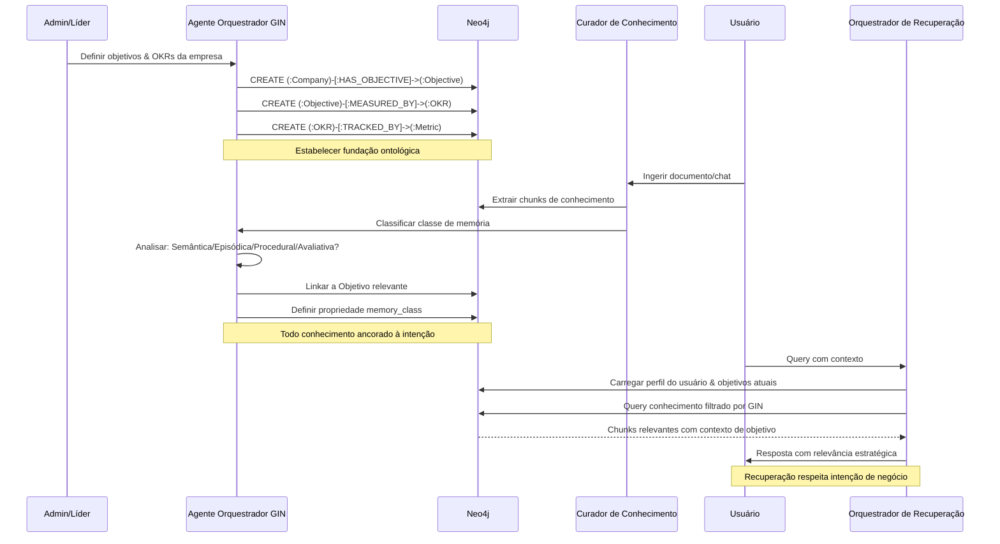

# Especificação de Feature: Grafo de Intenção de Negócio (GIN)

**Feature Branch**: `040-business-intent-graph`  
**Criado**: 2025-12-29  
**Status**: Draft  
**Prioridade**: P0 (Foundation)  
**Fonte**: Insights dos chats (chat011, chat012, chat013) + padrão arquitetural GIN

## Contexto & Propósito

O **Grafo de Intenção de Negócio (GIN)** é a "alma ontológica" do Sistema Empresarial de Conhecimento. Ele ancora todo conhecimento, memória e ações aos objetivos de negócio, criando um gêmeo digital organizacional vivo onde cada pedaço de informação está semanticamente conectado à intenção estratégica.

O GIN transforma o grafo de conhecimento de um repositório passivo em um **framework cognitivo ativo** onde:
- Todo conhecimento é filtrado por relevância estratégica
- Memória é classificada por propósito cognitivo (4 classes de memória)
- Recuperação respeita contexto e objetivos de negócio
- O "porquê" da organização dirige o "o quê" e o "como"

Esta é a spec fundamental que todas as outras features referenciam.

---

## Fluxo de Processo (Visão de Negócio)

```mermaid
flowchart TD
    OrgOnboard[Onboarding Organizacional] --> DefineVision[Definir Visão & Missão]
    DefineVision --> CreateObjectives[Criar Objetivos Estratégicos]
    CreateObjectives --> DefineOKRs[Definir OKRs por Objetivo]
    DefineOKRs --> SetMetrics[Definir Métricas Mensuráveis]
    
    SetMetrics --> AnchorMemory[Ancorar Classes de Memória]
    
    AnchorMemory --> Semantic[Memória Semântica:<br/>Ontologia & Conceitos]
    AnchorMemory --> Episodic[Memória Episódica:<br/>Eventos & Timeline]
    AnchorMemory --> Procedural[Memória Procedural:<br/>Playbooks & Processos]
    AnchorMemory --> Evaluative[Memória Avaliativa:<br/>Lições & Insights]
    
    Semantic --> KnowledgeGraph[Grafo de Conhecimento Vivo]
    Episodic --> KnowledgeGraph
    Procedural --> KnowledgeGraph
    Evaluative --> KnowledgeGraph
    
    KnowledgeGraph --> ContextRetrieval[Recuperação Consciente de Contexto]
    ContextRetrieval --> FilterByIntent[Filtrar por Intenção de Negócio]
    FilterByIntent --> AgentResponse[Resposta do Agente]
    
    AgentResponse --> UpdateGraph[Atualizar Grafo com Novo Conhecimento]
    UpdateGraph --> KnowledgeGraph
    
    classDef foundation fill:#e3f2fd,stroke:#1976d2,color:#000
    classDef memory fill:#fff3e0,stroke:#ff9800,color:#000
    classDef graph fill:#e8f5e9,stroke:#4caf50,color:#000
    classDef retrieval fill:#fce4ec,stroke:#e91e63,color:#000
    
    class OrgOnboard,DefineVision,CreateObjectives,DefineOKRs,SetMetrics foundation
    class Semantic,Episodic,Procedural,Evaluative memory
    class KnowledgeGraph,UpdateGraph graph
    class ContextRetrieval,FilterByIntent,AgentResponse retrieval
```

### Insights do Fluxo

**Gaps identificados**:
- Como lidar com objetivos que mudam ao longo do tempo? (versionamento temporal necessário)
- O que acontece quando conhecimento não mapeia para nenhum objetivo? (tratamento de conhecimento órfão)
- Como balancear objetivos estratégicos vs operacionais? (profundidade da hierarquia)
- Como medir alcance de objetivos automaticamente? (automação de métricas)

**Oportunidades identificadas**:
- Auto-sugerir OKRs baseado em benchmarks da indústria e perfil da empresa
- Detectar gaps de conhecimento analisando cobertura de objetivos
- Prever risco de objetivos monitorando frescor do conhecimento relacionado
- Gerar insights estratégicos analisando distribuição de classes de memória
- Habilitar "queries estratégicas" (ex: "Mostre todo conhecimento suportando OKR #3 do Q1")

**Riscos identificados**:
- Over-engineering: Muitos objetivos criam complexidade
- Rigidez: Ancoragem estrita pode limitar conhecimento exploratório
- Burden de manutenção: Objetivos precisam curadoria contínua
- Adoção do usuário: Usuários de negócio podem resistir à estrutura formal de OKR

---

## Colaboração de Agentes



---

## Cenários de Usuário & Testes

### User Story 1 - Onboarding Organizacional com GIN (Prioridade: P0)

Como gestor de CVC, quero definir os objetivos de investimento do meu fundo durante o onboarding para que todo conhecimento ingerido seja automaticamente filtrado por relevância estratégica.

**Por que esta prioridade**: Fundação para todas as outras features. Sem GIN, o sistema é apenas uma base de conhecimento genérica.

**Teste Independente**: Criar empresa com objetivos, ingerir documento, verificar que conhecimento está linkado aos objetivos.

**Cenários de Aceitação**:

1. **Dado** novo onboarding organizacional, **Quando** admin define visão "Apoiar B2B SaaS early-stage na LatAm", **Então** Agente GIN cria node (:Company) com propriedade vision e sugere objetivos iniciais baseados em padrões da indústria

2. **Dado** objetivos definidos, **Quando** admin cria OKR "Investir em 10 startups até Q4", **Então** sistema cria (:Objective)-[:MEASURED_BY]->(:OKR) com métricas alvo e timeline

3. **Dado** estrutura GIN criada, **Quando** usuário ingere primeiro documento, **Então** Curador de Conhecimento automaticamente linka conhecimento extraído aos objetivos relevantes com score de confiança

---

### User Story 2 - Classificação de Memória por Propósito Cognitivo (Prioridade: P0)

Como sistema, quero classificar cada chunk de conhecimento em uma das 4 classes de memória para que a recuperação respeite o tipo de informação sendo solicitada.

**Por que esta prioridade**: Arquitetura cognitiva central. Diferentes tipos de memória requerem estratégias de recuperação diferentes.

**Teste Independente**: Ingerir conteúdo diverso (definição, reunião, doc de processo, lição aprendida), verificar classificação correta de memory_class.

**Cenários de Aceitação**:

1. **Dado** documento com definições de conceitos, **Quando** Curador de Conhecimento processa, **Então** chunks são classificados como `memory_class: semantic` e linkados a nodes (:Concept)

2. **Dado** transcrição de reunião, **Quando** processada, **Então** chunks são classificados como `memory_class: episodic` e linkados a (:TimePoint) com propriedades temporais

3. **Dado** documentação de processo, **Quando** processada, **Então** chunks são classificados como `memory_class: procedural` e linkados a nodes (:Process) como playbooks

4. **Dado** retrospectiva ou lição aprendida, **Quando** processada, **Então** chunks são classificados como `memory_class: evaluative` e linkados a nodes (:Insight)

---

### User Story 3 - Recuperação Estratégica de Conhecimento (Prioridade: P1)

Como usuário, quero que minhas queries retornem conhecimento filtrado pelos meus objetivos atuais para que eu veja apenas informação estrategicamente relevante.

**Por que esta prioridade**: Demonstra valor do GIN. Usuários veem benefício imediato de conhecimento ancorado em objetivos.

**Teste Independente**: Query mesmo termo com diferentes contextos de objetivo, verificar resultados diferentes.

**Cenários de Aceitação**:

1. **Dado** usuário trabalhando no objetivo "Fundraising Q1", **Quando** consulta "pitch deck", **Então** recuperação prioriza conhecimento linkado ao objetivo de fundraising sobre outros contextos

2. **Dado** usuário troca para objetivo "Monitoramento de portfólio", **Quando** consulta "métricas", **Então** recuperação prioriza conhecimento de métricas operacionais sobre métricas de fundraising

3. **Dado** query sem objetivo claro, **Quando** usuário faz pergunta genérica, **Então** sistema pergunta "A qual objetivo isto se relaciona?" ou usa objetivo padrão do usuário

---

## Requisitos Funcionais

### Estrutura & Ontologia do GIN

- **REQ-GIN-001**: Sistema DEVE suportar hierarquia de objetivos: Company → Area → Project → Objective
- **REQ-GIN-002**: Todo node (:Objective) DEVE ter: `title`, `description`, `owner_id`, `status` (active/archived), `created_at`, `target_date`
- **REQ-GIN-003**: Todo (:Objective) DEVE linkar a pelo menos um (:OKR) via relacionamento [:MEASURED_BY]
- **REQ-GIN-004**: Todo (:OKR) DEVE ter: `title`, `key_result_type` (quantitative/qualitative), `target_value`, `current_value`, `unit`, `deadline`
- **REQ-GIN-005**: Todo (:OKR) PODE linkar a múltiplos nodes (:Metric) via [:TRACKED_BY] para medição automatizada
- **REQ-GIN-006**: Sistema DEVE suportar versionamento de objetivos com relacionamento [:SUPERSEDES] entre versões

### 4 Classes de Memória

- **REQ-GIN-007**: Todo node de conhecimento DEVE ter propriedade `memory_class` com valores: `semantic`, `episodic`, `procedural`, `evaluative`
- **REQ-GIN-008**: Nodes de memória semântica DEVEM linkar a nodes (:Concept) via relacionamento [:DEFINES]
- **REQ-GIN-009**: Nodes de memória episódica DEVEM linkar a nodes (:TimePoint) via relacionamento [:OCCURRED_AT]
- **REQ-GIN-010**: Nodes de memória procedural DEVEM linkar a nodes (:Process) via relacionamento [:DESCRIBES_STEP]
- **REQ-GIN-011**: Nodes de memória avaliativa DEVEM linkar a nodes (:Insight) via relacionamento [:SUPPORTS_LESSON]
- **REQ-GIN-012**: Classe de memória DEVE ser automaticamente atribuída pelo Agente GIN com score de confiança ≥ 0.7, caso contrário marcada para revisão humana

### Modelo Bitemporal

- **REQ-GIN-013**: Todo node de conhecimento DEVE ter propriedades bitemporais: `valid_from`, `valid_to`, `recorded_at`, `updated_at`
- **REQ-GIN-014**: `valid_from` representa quando o fato se tornou verdadeiro no mundo real (fornecido pelo usuário ou inferido)
- **REQ-GIN-015**: `valid_to` representa quando o fato deixou de ser verdadeiro (null = ainda válido)
- **REQ-GIN-016**: `recorded_at` representa quando o sistema registrou este fato pela primeira vez (auto-gerado)
- **REQ-GIN-017**: `updated_at` representa quando o node foi modificado pela última vez (auto-atualizado)
- **REQ-GIN-018**: Sistema DEVE suportar queries temporais: "as-of" (tempo de transação) e "valid-at" (tempo válido)

### Cadeia de Proveniência (PROV-O)

- **REQ-GIN-019**: Todo node de conhecimento DEVE linkar à fonte via relacionamento [:DERIVED_FROM]
- **REQ-GIN-020**: Cadeia de proveniência DEVE ser navegável: Knowledge → Chunk → Document → User
- **REQ-GIN-021**: Sistema DEVE registrar passos de transformação: extração, classificação, enriquecimento
- **REQ-GIN-022**: Toda transformação DEVE ter: `agent_id`, `method`, `confidence`, `timestamp`

### Ancoragem de Conhecimento

- **REQ-GIN-023**: Todo node de conhecimento DEVE linkar a pelo menos um (:Objective) via relacionamento [:SUPPORTS]
- **REQ-GIN-024**: Relacionamento [:SUPPORTS] DEVE ter: `relevance_score` (0.0-1.0), `assigned_by` (agent/human), `assigned_at`
- **REQ-GIN-025**: Sistema DEVE marcar "conhecimento órfão" (sem link de objetivo) para revisão humana
- **REQ-GIN-026**: Usuário DEVE poder sobrescrever manualmente linkagem de objetivo com justificativa

### Agente GIN

- **REQ-GIN-027**: Agente Orquestrador GIN DEVE executar em toda ingestão de conhecimento para classificar classe de memória
- **REQ-GIN-028**: Agente GIN DEVE analisar conteúdo do chunk e sugerir linkagem de objetivo com confiança ≥ 0.6
- **REQ-GIN-029**: Agente GIN DEVE detectar quando novos objetivos devem ser criados baseado em padrões de conhecimento
- **REQ-GIN-030**: Agente GIN DEVE monitorar saúde de objetivos: cobertura, frescor, progresso de métricas

---

## Requisitos Não-Funcionais

### Performance

- **REQ-GIN-NFR-001**: Query de hierarquia de objetivos DEVE completar em <100ms para profundidade ≤ 5
- **REQ-GIN-NFR-002**: Classificação de classe de memória DEVE completar em <2s por documento
- **REQ-GIN-NFR-003**: Query temporal (as-of/valid-at) DEVE completar em <500ms para conjunto de resultados <1000 nodes

### Escalabilidade

- **REQ-GIN-NFR-004**: Sistema DEVE suportar ≥100 objetivos ativos por empresa
- **REQ-GIN-NFR-005**: Sistema DEVE suportar ≥1M nodes de conhecimento por empresa
- **REQ-GIN-NFR-006**: Sistema DEVE suportar ≥10 anos de histórico temporal por node

### Usabilidade

- **REQ-GIN-NFR-007**: Fluxo de criação de objetivo DEVE completar em <5 minutos para usuários não-técnicos
- **REQ-GIN-NFR-008**: Atribuição de classe de memória DEVE ser explicável (mostrar raciocínio)
- **REQ-GIN-NFR-009**: Dashboard GIN DEVE visualizar hierarquia de objetivos e cobertura em <3s

---

## Critérios de Sucesso

1. **Ancoragem de Objetivos**: 95% do conhecimento ingerido é automaticamente linkado a objetivos com confiança ≥ 0.7
2. **Acurácia de Classificação de Memória**: 90% das atribuições de classe de memória são validadas como corretas por revisão humana
3. **Relevância de Recuperação**: Usuários reportam melhoria de 40% na relevância dos resultados de busca comparado a baseline sem GIN
4. **Acurácia Temporal**: 100% das queries temporais retornam resultados corretos para cenários "as-of" e "valid-at"
5. **Adoção de Usuário**: 80% das organizações completam onboarding GIN na primeira semana
6. **Insight de Cobertura**: Líderes podem identificar objetivos sub-documentados em 30 segundos

---

## Entidades-Chave

### Tipos de Node Neo4j (Novos)

- **:Objective** - Objetivo estratégico de negócio
- **:OKR** - Objective Key Result (resultado mensurável)
- **:Metric** - Métrica quantitativa para rastreamento de OKR
- **:Concept** - Conceito de memória semântica (ontologia)
- **:TimePoint** - Âncora temporal para memória episódica
- **:Process** - Processo/playbook de memória procedural
- **:Insight** - Lição aprendida de memória avaliativa

### Relacionamentos Neo4j (Novos)

- **[:HAS_OBJECTIVE]** - Company/Area/Project → Objective
- **[:MEASURED_BY]** - Objective → OKR
- **[:TRACKED_BY]** - OKR → Metric
- **[:SUPPORTS]** - Knowledge → Objective (com relevance_score)
- **[:DEFINES]** - Knowledge → Concept (memória semântica)
- **[:OCCURRED_AT]** - Knowledge → TimePoint (memória episódica)
- **[:DESCRIBES_STEP]** - Knowledge → Process (memória procedural)
- **[:SUPPORTS_LESSON]** - Knowledge → Insight (memória avaliativa)
- **[:SUPERSEDES]** - Objective → Objective (versionamento)
- **[:DERIVED_FROM]** - Knowledge → Chunk (proveniência)

### Propriedades (Estendidas)

Todos os nodes de conhecimento herdam propriedades base de `database-schema.md` mais:

- `memory_class`: `semantic` | `episodic` | `procedural` | `evaluative`
- `valid_from`: DateTime (quando fato se tornou verdadeiro)
- `valid_to`: DateTime | null (quando fato deixou de ser verdadeiro)
- `recorded_at`: DateTime (quando sistema registrou)
- `updated_at`: DateTime (última modificação)

---

## Dependências

- **Spec 015** (Neo4j Graph Model) - Tipos de node e relacionamentos base
- **Spec 012** (Graph Curation Ecosystem) - Pipeline de ingestão de conhecimento
- **Spec 017** (Memory Ecosystem) - Níveis de memória (será estendido com classes de memória)
- **Spec 024** (Retrieval Orchestration) - Recuperação consciente de contexto (usará GIN para filtragem)

---

## Premissas

1. Organizações estão dispostas a definir objetivos estratégicos explicitamente (nem todas têm OKRs formais)
2. Classe de memória pode ser inferida automaticamente com acurácia razoável (≥70%) usando análise LLM
3. Usuários entendem o valor de conhecimento ancorado em objetivos (pode requerer educação)
4. Complexidade do modelo bitemporal é justificada por requisitos de auditoria/compliance
5. Framework Agno suporta orquestração de agentes para classificação GIN

---

## Fora do Escopo

- Rastreamento automático de progresso de OKR de sistemas externos (integração futura)
- Compartilhamento/benchmarking de objetivos multi-empresa (feature futura)
- Recomendação de objetivos baseada em melhores práticas da indústria (capacidade IA futura)
- Predição em tempo real de alcance de objetivos (analytics futura)
- Integração com ferramentas de gestão de projetos (Jira, Asana) para automação de métricas

---

## Notas

- GIN é inspirado por ciência cognitiva (4 tipos de memória) e teoria organizacional (orientado por objetivos)
- Modelo bitemporal segue padrão Slowly Changing Dimensions (SCD Type 2) de data warehousing
- PROV-O é padrão W3C para proveniência: https://www.w3.org/TR/prov-o/
- OWL-Time é padrão W3C para representação temporal: https://www.w3.org/TR/owl-time/
- Classes de memória se alinham com psicologia cognitiva: semântica (fatos), episódica (eventos), procedural (como fazer), avaliativa (sabedoria)

