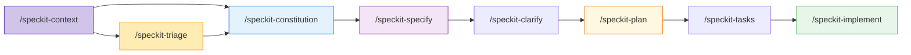

# Spec Orchestrator ( thanks19275 )

> An AI-native Spec-Driven Development toolkit that keeps your specs, code, and agents in sync

Use this if you’re currently coding by vibe with AI and want to move to a visual, spec-driven, PDCA-aligned workflow.

**Version**: 1.0.0 | **License**: MIT | **Status**: Production Ready

---

## 🎯 What is Spec Orchestrator?

Spec Orchestrator is an AI-first methodology and toolkit for **specification-driven development**. Instead of starting from code or ad-hoc prompts, you start from living specifications and let AI agents help you generate and evolve the code around them.

You use Spec Orchestrator when you want to:
- Capture project intent as living specs, diagrams, and rules.
- Keep a single orchestration plan that tells you which agent to call next.
- Turn vague ideas or legacy context into a clear, iterative workflow with visible gaps.

### Core Philosophy

```
Specifications are truth. Code is generated.
Plans evolve. Quality is built-in.
Gaps are visible. Learning is continuous.
```

**Traditional Development**:
```
Requirements → Code → Documentation (often outdated)
```

**Spec-Driven Development**:
```
Living Specification ↔ AI-Assisted Code ← Always in sync
```

---

## ✨ Key Features

### 🔄 SDP-PDCA Methodology
Continuous improvement cycle adapted for AI-assisted development:
- **PLAN**: Context → (Optional: Triage) → Constitution → Specify → Clarify → Design
- **DO**: Tasks → Implementation (test-first, traceable)
- **CHECK**: 6-level validation (artifacts, quality, tests, acceptance, constitution, user)
- **ACT**: Learn, refine, iterate with versioned artifacts

### 🧠 Memory System
Continuous project state management:
- **Orchestration**: `project-workplan.md` (which agent to call next)
- **Dashboard**: `project-overview.md` (macro view with gaps)
- **Principles**: `constitution.md` (evolving rules)
- **Knowledge**: Captured in artifact versions and constitution evolution

### 📊 Visual-First
All specifications and plans MUST include Mermaid diagrams:
- Process flows (business view)
- System interactions (technical view)
- Component architecture
- Gap notation (`[?]` and `:::gap` for uncertainties)

### 🤖 AI-Native
Designed for AI agents from the ground up:
- Clear, parseable specifications
- Explicit traceability (every code line → requirement)
- Structured commands (`/speckit-*`)
- Iterative refinement ("🔄 Need another round?")

---

## 🚀 Quick Start

### Prerequisites

- Git
- Text editor or IDE (Windsurf, VS Code, Cursor, etc.)
- Markdown preview with Mermaid support

### Installation

```bash
# Clone the repository
git clone https://github.com/yourusername/spec-orchestrator.git
cd spec-orchestrator

# Initialize your project
# (Windows PowerShell)
.\.specify\scripts\powershell\check-prerequisites.ps1

# (Optional) Copy methodology + command definitions to your existing project
cp -r .specify /path/to/your/project/
cp -r commands /path/to/your/project/
```

### First Steps

1. **Read the rules and documentation**:
   ```
   Start with: Project Rules (AI behavior & workflow for this repo)
        Then: SYSTEM-PROMPT-CONTEXT.md (for AI agents)
          or: CATALOG.md (for humans)
   ```
   - Recommendation: Configure `Project Rules` as your IDE's project-level rules/system prompt so it is always applied automatically for every AI session. If your tools cannot do this, make sure AI agents explicitly read `Project Rules` at the beginning of each session.

2. **Initialize project context**:
   ```
   Run: /speckit-context
   This creates project-workplan.md and project-overview.md
   ```

3. **Define project rails (stack + non-negotiable rules)**:
   ```
   Run: /speckit-constitution
   Start by recording a minimal constitution: stack, compliance, and principles that apply to ALL features.
   ```

4. **Define your scope (choose a flow)**:
   ```
   Default: /speckit-specify "Your feature description"  # direct conversation about the first feature
   Optional (big dump/legacy): /speckit-triage (multiple rounds)  # separates principles from feature requests and fills backlogs, which will later be absorbed by /speckit-constitution and /speckit-specify
   ```

5. **Create additional specs**:
   ```
   Run: /speckit-specify "Your feature description"
   ```

---

## 📚 Documentation Structure

### For First-Time Users

| Document | Purpose | Read When |
|----------|---------|-----------|
| **README.md** | Project overview | You are here! |
| **Project Rules** | AI behavior rules & workflow integration for this repo | Before using AI agents |
| **SYSTEM-PROMPT-CONTEXT.md** | Condensed context for AI | Using AI agents |
| **CATALOG.md** | Complete document inventory | Need to find something |
| `.specify/docs/README.md` | Documentation hub | Learning the methodology |

### For AI Agents

**Essential Reading Order**:
1. `Project Rules` - Project behavior rules & workflow integration
2. `project-context/project-workplan.md` - Current phase & next action
3. `project-context/project-overview.md` - Macro state & gaps
4. `.specify/memory/constitution.md` - Project principles
5. `SYSTEM-PROMPT-CONTEXT.md` - Quick reference

### Core Methodology

| Document | Topic | Location |
|----------|-------|----------|
| **SDP-PDCA** | Spec-Driven Plan-Do-Check-Act | `.specify/docs/sdp-pdca.md` |
| **Memory System** | Continuous state management | `.specify/docs/memory-system.md` |
| **Project Lifecycle** | Macro → Micro evolution | `.specify/docs/flows/project-lifecycle.md` |
| **Best Practices** | Guidelines & anti-patterns | `.specify/docs/best-practices.md` |

### Visual Guides

All in `.specify/docs/flows/`:
- `overview.md` - SDD methodology overview
- `command-flow.md` - Each command detailed
- `triage-system.md` - Backlog architecture
- `gap-notation.md` - Uncertainty visualization
- `decision-tree.md` - Decision frameworks

---

## 🔀 Workflow Commands

### Available Commands (`/speckit-*`)

| Command | Purpose | Input | Output |
|---------|---------|-------|--------|
| `/speckit-context` | Initialize project context | Project info | `project-context/` folder |
| `/speckit-specify` | Create feature spec (WHAT/WHY) and update overview/workplan | Feature description or backlog entry | `spec.md` + updated project context |
| `/speckit-triage` | (Optional) Separate principles from features for large/mixed input, filling backlogs | Mixed/legacy input | Backlogs + workplan + overview |
| `/speckit-constitution` | Create/update project principles (including stack/compliance rails) | Backlog or input | `constitution.md` |
| `/speckit-clarify` | Resolve ambiguities | Spec with gaps | Updated `spec.md` |
| `/speckit-plan` | Create technical plan (HOW) | Spec | `plan.md` |
| `/speckit-tasks` | Break into tasks | Plan | `tasks.md` |
| `/speckit-implement` | Execute implementation | Tasks | Code + tests |
| `/speckit-analyze` | Cross-artifact analysis | Spec + plan + tasks | Analysis report |
| `/speckit-checklist` | Generate quality checklist | Spec/plan | Checklist file |
| `/speckit-taskstoissues` | Convert tasks to GitHub issues | Tasks | GitHub issues |

### Command Sequence (New Project)



---

## 📁 Project Structure

```
spec-orchestrator/
├── .specify/                   # Methodology toolkit
│   ├── docs/                   # Documentation
│   │   ├── sdp-pdca.md        # Methodology
│   │   ├── memory-system.md   # State management
│   │   └── flows/             # Visual guides
│   ├── memory/
│   │   └── constitution.md    # Project principles
│   ├── templates/             # Artifact templates
│   ├── scripts/               # Automation
│   └── triage/                # Backlog system
│
├── commands/                   # /speckit-* command definitions (IDE-agnostic)
│
├── project-context/            # Project-specific (created by /speckit-context)
│   ├── project-workplan.md    # 🎯 Orchestration
│   ├── project-overview.md    # 📊 Dashboard
│   ├── env-vars.md
│   ├── database-schema.md
│   ├── tools-registry.md
│   ├── agent-framework.md
│   └── folder-structure.md
│
├── specs/                      # Features (created by /speckit-specify)
│   └── ###-feature-name/
│       ├── spec.md            # Specification
│       ├── plan.md            # Implementation plan
│       ├── tasks.md           # Task breakdown
│       └── checklists/        # Quality gates
│
├── CATALOG.md                  # Document inventory
├── SYSTEM-PROMPT-CONTEXT.md   # AI agent quick reference
├── Project Rules               # Source of truth for AI rules in this repo
└── README.md                   # This file
```

---

## 🎨 Example: Creating a Feature

### Step 1: Specify (WHAT and WHY)

```bash
/speckit-specify "User authentication with OAuth2 (Google + GitHub)"
```

**Output**: `specs/001-user-authentication/spec.md` with:
- Process flow diagram (Mermaid)
- User stories (P1/P2/P3)
- Functional requirements (FR-001, FR-002...)
- Success criteria (measurable)

### Step 2: Clarify (if needed)

```bash
/speckit-clarify
```

**Agent asks**:
- Q1: Session storage? → Redis
- Q2: Logout behavior? → Invalidate everywhere

### Step 3: Plan (HOW)

```bash
/speckit-plan
```

**Output**: `plan.md` with:
- System interaction diagram (sequenceDiagram)
- Component architecture
- Tech stack (Passport.js, Redis)
- API contracts

### Step 4: Break into Tasks

```bash
/speckit-tasks
```

**Output**: `tasks.md` with phases:
- Setup: Passport.js + Redis
- Tests: OAuth strategies
- Core: Authentication logic
- Integration: Session management

### Step 5: Implement

```bash
/speckit-implement
```

**Executes tasks**, generates code, runs tests, updates tracking.

---

## 🏆 Key Principles

### 1. Visual Modeling First
**Every spec and plan MUST have Mermaid diagrams**. Diagrams are requirements, not decoration.

### 2. Iterative Completeness
**ALWAYS ask "🔄 Need another round?"** before closing any phase. Never assume completeness.

### 3. Gap Visibility
**Use `[?]` and `:::gap`** to show uncertainties explicitly. Never hide what you don't know.

### 4. Constitution Compliance
**All work follows constitution principles**. Violations must be explicitly justified.

### 5. Traceability
**Every code line links to a requirement** (FR-XXX). No orphan code.

### 6. Multi-Level Validation
**CHECK at 6 levels**: Artifacts, Quality, Tests, Acceptance, Constitution, User.

### 7. Continuous Learning
**Capture knowledge** in artifact version history and constitution evolution. Mistakes are lessons, not failures.

### 8. Memory-Driven
**Update workplan + overview** after every significant change. Memory is truth.

---

## 📊 Project Statistics

- **Total Documentation**: 49 files
- **Total Content**: ~347,000 characters (~87k tokens)
- **Workflows**: 11 automated commands
- **Templates**: 14 artifact templates
- **Documentation Guides**: 15 methodology docs
- **Scripts**: 5 automation utilities
- **Languages**: Markdown, PowerShell, Mermaid

---

## 🤝 Contributing

We welcome contributions! Here's how:

1. **Read the methodology**: Start with `.specify/docs/README.md`
2. **Follow the workflow**: For new projects, run `/speckit-context` + `/speckit-constitution`; for new features, use `/speckit-specify` (or `/speckit-triage` when you have a big/mixed dump of ideas)
3. **Create specs first**: Run `/speckit-specify` for new features
4. **Maintain quality**: All PRs must pass `/speckit-analyze`
5. **Update memory**: Always update `project-overview.md`

### Contribution Guidelines

- **Specs before code**: No PR without a corresponding spec
- **Tests required**: Test coverage ≥80%
- **Constitution compliance**: Follow all principles
- **Documentation**: Update docs with features
- **Changelog**: Add to `CHANGELOG.md`

---

## 📖 Learning Resources

### Getting Started
1. Read `Project Rules` (5–10 min)
2. Read `SYSTEM-PROMPT-CONTEXT.md` (10 min)
3. Watch the visual flows in `.specify/docs/flows/` (20 min)
4. Read `best-practices.md` (15 min)
5. Try `/speckit-context` + `/speckit-constitution` in a test project (10–15 min)

### Deep Dive
1. Study `sdp-pdca.md` for methodology (30 min)
2. Learn `memory-system.md` for state management (25 min)
3. Explore `examples.md` for complete walkthrough (30 min)

### Master Level
1. Read all `.specify/docs/flows/*.md` (2h)
2. Study all workflow definitions in `commands/` (3h)
3. Understand template system in `.specify/templates/` (1h)
4. Review all scripts in `.specify/scripts/` (1h)

---

## 🌟 Why Spec Orchestrator?

Spec Orchestrator is for developers and teams who want to move from fast-but-fragile *vibe coding* to a deliberate, visual, PDCA-aligned way of working with AI.

### Problems It Solves

❌ **Without Spec Orchestrator (typical vibe coding)**:
- Work starts directly from code or ad-hoc prompts.
- PLAN is shallow, DO is long and chaotic, CHECK/ACT arrive late.
- Specifications and diagrams are missing or quickly become outdated.
- AI sessions are one-off; there is no shared memory or orchestration.
- Project state is unclear; gaps are discovered late and expensively.

✅ **With Spec Orchestrator (spec-driven flow)**:
- You design flows, specs, and rules before (and while) coding.
- The PDCA cycle is explicit: deep PLAN, focused DO, objective CHECK, fast ACT.
- Visual diagrams make business flows, agent interactions, and gaps explicit.
- A single workplan + overview keeps AI agents and humans aligned.
- Rework is reduced and learning is captured in living artifacts.

### Benefits

| Benefit | Impact |
|---------|--------|
| **Clarity** | Visual models make requirements explicit |
| **AI-Ready** | Specs serve as perfect AI context |
| **Traceability** | Every line of code links to a requirement |
| **Quality** | Multi-level validation catches issues early |
| **Learning** | Continuous improvement through captured learnings |
| **Collaboration** | Non-devs can read and validate specs |
| **Scalability** | AI agents adapt to any project speed |
| **Memory** | Project always knows its state |

---

## 🔮 Roadmap

### Version 1.x (Current)
- ✅ Core methodology (SDP-PDCA)
- ✅ 11 workflow commands
- ✅ Complete documentation
- ✅ Memory system
- ✅ Visual flows

### Version 2.0 (Planned)
- [ ] Web dashboard for project-overview.md
- [ ] Automated integrity checks (Git hooks)
- [ ] Semantic search across memory
- [ ] Memory snapshots and diffing
- [ ] AI memory summarization
- [ ] CLI tool for workflow commands
- [ ] VS Code extension
- [ ] Templates for additional frameworks

### Future
- [ ] Multi-repo orchestration
- [ ] Team collaboration features
- [ ] Analytics and insights
- [ ] Integration with project management tools
- [ ] Mobile app for reviews

---

## 📜 License

MIT License - See [LICENSE](LICENSE) file for details.

---

## 🙏 Acknowledgments

- **W. Edwards Deming** - For PDCA methodology
- **Mermaid.js** - For beautiful diagrams
- **Spec-Driven Development community** - For inspiration
- **GitHub Spec Kit** - Original specification toolkit this methodology was adapted from: <https://github.com/github/spec-kit>
- **Rodrigo Trindade** - Author and maintainer of this adaptation: <https://www.linkedin.com/in/rtcoutinho/>
- **AI Agent developers** - For pushing the boundaries

---

## 📞 Support

- **Documentation**: Browse `.specify/docs/`
- **Examples**: See `.specify/docs/examples.md`
- **Issues**: GitHub Issues
- **Discussions**: GitHub Discussions
- **Email**: trindade@cocreateai.com.br

---

## 🎵 Project Motto

> "Specifications are truth. Plans evolve. Code is generated.  
> Gaps are visible. Quality is built-in. Learning is continuous.  
> Always ask: 🔄 Need another round?"

---

**Ready to orchestrate your specifications?**

Start with: `/speckit-context` → `/speckit-constitution` → `/speckit-specify` (or `/speckit-triage` feeding constitution/specify for a big dump) → Build something amazing! 🚀

---

**Last Updated**: 2024-12-05  
**Version**: 1.0.0  
**Maintained by**: Spec Orchestrator Core Team (CoCreateAI)
