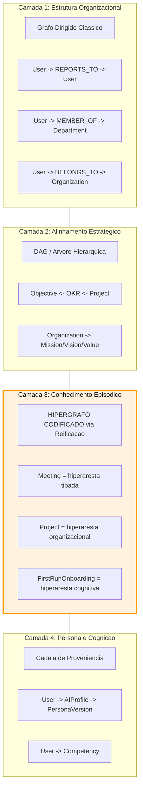
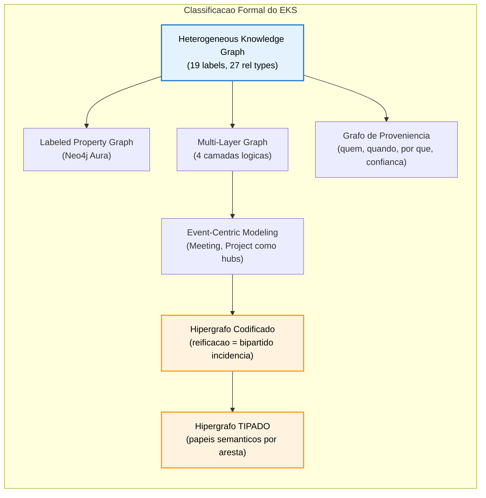

# Avaliacao Formal: EKS e Hipergrafos

> **Data**: 2026-02-13
> **Autor**: Cascade (AI Agent com acesso ao projeto EKS e Neo4j)
> **Contexto**: Analise precisa para comunicacao externa
> **Fontes**: Neo4j Aura (producao), database-schema.md, Ontology/docs/, project-context/, BRIEFING-EKS-V1.md, schema real (19 labels, 27 relationship types)

---

## 1. Veredicto Direto

**O EKS NAO e um hipergrafo nativo, mas CODIFICA semantica de hipergrafo nas suas estruturas de evento.**

Classificacao formal precisa:

> **EKS e um Grafo de Conhecimento Heterogeneo Multi-Relacional** (Heterogeneous Knowledge Graph), implementado como **Labeled Property Graph (LPG)** em Neo4j, que emprega **codificacao de hipergrafo via reificacao** nas suas subestruturas centradas em eventos.

Essa frase e segura para uso externo. Abaixo, a fundamentacao completa.

---

## 2. O Que Diz a Teoria

### 2.1 Definicoes Formais

| Conceito | Definicao | Referencia |
|----------|-----------|------------|
| **Grafo** G=(V,E) | Cada aresta e ∈ E conecta **exatamente 2** vertices | Teoria de grafos classica |
| **Hipergrafo** H=(V,E) | Cada hiperaresta e ∈ E e um **subconjunto** de V (2, 3, ..., N vertices) | Berge, 1973 |
| **Property Graph (LPG)** | Grafo dirigido com labels tipados e propriedades em nos e arestas; cada relacao conecta **exatamente 2** nos | Neo4j, TinkerPop |
| **Grafo Heterogeneo (HIN)** | Grafo com **multiplos tipos** de nos e arestas | Sun & Han, 2012 |
| **Reificacao** | Transformar uma relacao N-aria em um **no intermediario** conectado por relacoes binarias | Padrao classico de modelagem |

### 2.2 A Equivalencia Fundamental

Um hipergrafo H=(V,E) pode ser representado como um **grafo bipartido de incidencia** B=(V ∪ E, I), onde:
- V = vertices originais
- E = hiperarestas (agora como nos)
- I = arestas de incidencia (vertice pertence a hiperaresta)

**Essa e exatamente a reificacao.** Um no-evento no property graph faz o papel da hiperaresta no hipergrafo.

---

## 3. Analise do EKS Real (Evidencias do Neo4j)

### 3.1 Dados Reais do Grafo (2026-02-09)

| Metrica | Valor |
|---------|-------|
| Total Nodes | 69 |
| Total Relationships | 114 |
| Labels unicos | 19 |
| Relationship Types | 27 |
| R/N (rels/no) | 1.65 |
| Superno maximo | 37 conexoes (User "Rodrigo Trindade") |

### 3.2 Os 19 Labels do EKS

```
ESTRUTURAIS:        User, Organization, Department, ExternalParticipant
ESTRATEGICOS:       Objective, OKR, Project
EPISODICOS/EVENTO:  Meeting, Task, Decision, Risk, Insight
IDENTIDADE ORG:     Mission, Vision, Value
PERSONA/COGNITIVO:  FirstRunOnboarding, AIProfile, PersonaVersion, Competency
```

### 3.3 Mapeamento: O Que e Hipergrafo e O Que NAO E

Analisei cada padrao estrutural no grafo real do EKS:

#### PADROES COM SEMANTICA DE HIPERGRAFO (reificacao de relacoes N-arias)

| No-Evento | Funcao | Conecta Simultaneamente | Papel no Hipergrafo |
|-----------|--------|-------------------------|---------------------|
| **Meeting** | Hiperaresta episodica | N Users (PARTICIPATED_IN), N Decisions (EXTRACTED_FROM), N Tasks (EXTRACTED_FROM), N Risks (EXTRACTED_FROM), N Insights (EXTRACTED_FROM), N Organizations (MENTIONS) | **Hiperaresta tipada** — conecta participantes heterogeneos com papeis semanticos distintos |
| **Project** | Hiperaresta organizacional | Owner (OWNED_BY), N Team Members (HAS_TEAM_MEMBER), N External Participants (HAS_EXTERNAL_PARTICIPANT), OKR (LINKED_TO_OKR), Department (BELONGS_TO) | **Hiperaresta tipada** — agrupa equipe + contexto estrategico |
| **FirstRunOnboarding** | Hiperaresta cognitiva | User (COMPLETED_...), AIProfile (INITIATES), PersonaVersion (GENERATES), User novamente (CONFIRMS_POSITION) | **Hiperaresta de evento** — materializa o processo de onboarding |

**Evidencia concreta no Neo4j**: O no `Meeting` (grau 24) conecta simultaneamente Users, Decisions, Tasks, Risks, Insights e Organizations. Sem esse no intermediario, seria necessaria uma **expansao de clique** com dezenas de arestas par-a-par — exatamente o problema que a imagem ilustra.

#### PADROES SEM SEMANTICA DE HIPERGRAFO (grafo classico)

| Padrao | Tipo | Exemplo | Por Que NAO e Hipergrafo |
|--------|------|---------|--------------------------|
| Hierarquia | Grafo dirigido | `User -[REPORTS_TO]-> User` | Relacao binaria pura (1:1) |
| Membresia | Grafo bipartido simples | `User -[MEMBER_OF]-> Department` | Relacao binaria pura (1:1) |
| Pertencimento | Grafo dirigido | `User -[BELONGS_TO]-> Organization` | Relacao binaria pura (1:1) |
| Cadeia estrategica | DAG (arvore dirigida) | `Objective <- OKR <- Project` | Hierarquia 1:N em cadeia |
| Composicao organizacional | Estrela 1:N | `Organization -[HAS_MISSION/VISION/VALUE]-> ...` | Decomposicao simples de atributos em nos |
| Persona | Cadeia linear | `User -> AIProfile -> PersonaVersion` | Cadeia de proveniencia sequencial |

---

## 4. Classificacao Formal Precisa

### 4.1 Taxonomia em Camadas

O EKS e melhor descrito como um **grafo multi-camada** (multi-layer graph):



**Apenas a Camada 3 exibe semantica de hipergrafo.** As demais camadas sao grafos classicos.

### 4.2 Termos Formais Corretos

| Termo | Aplicabilidade ao EKS | Seguro para Uso Externo? |
|-------|----------------------|--------------------------|
| **Heterogeneous Knowledge Graph (HKG)** | SIM — 19 tipos de nos, 27 tipos de relacoes | SIM |
| **Labeled Property Graph (LPG)** | SIM — implementado em Neo4j | SIM |
| **Hipergrafo codificado via reificacao** | PARCIAL — apenas subestruturas de evento | SIM, com qualificacao |
| **Grafo multi-camada** | SIM — camadas com logicas distintas | SIM |
| **Event-centric Knowledge Graph** | SIM — Meeting/Project como hubs de contexto | SIM |
| **Grafo de Proveniencia** | SIM — rastreabilidade quem/quando/por que | SIM |
| **"EKS e um hipergrafo"** | NAO — impreciso e tecnicamente incorreto | NAO |
| **"Neo4j suporta hipergrafos"** | NAO — Neo4j e LPG, relacoes sao binarias | NAO |

### 4.3 A Nuance Critica: Hipergrafo Tipado vs Hipergrafo Simples

O EKS vai **alem** de um hipergrafo simples. Em um hipergrafo classico:
- Hiperaresta e = {A, B, C} — um conjunto homogeneo de vertices

No EKS, o `Meeting` conecta vertices com **papeis semanticos distintos**:
- Users via `PARTICIPATED_IN` (papel: participante)
- Decisions via `EXTRACTED_FROM` (papel: artefato extraido)
- Tasks via `EXTRACTED_FROM` (papel: acao derivada)
- Organizations via `MENTIONS` (papel: entidade mencionada)

Isso e formalmente um **hipergrafo tipado/colorido** (typed/colored hypergraph), ou equivalentemente, um **metagrafo** — onde a hiperaresta tem **portas** (slots) para diferentes tipos de participantes.

Essa riqueza semantica e uma **vantagem** da representacao em property graph sobre um hipergrafo puro, porque cada aresta de incidencia carrega tipo, direcao e propriedades (confidence, timestamp, sourceRef).

---

## 5. Diagrama Comparativo: EKS vs Hipergrafo Puro

### 5.1 Se o Meeting fosse Modelado como Hipergrafo Puro

```
Hiperaresta e_meeting = {User_Rodrigo, User_Julio, Decision_D1, Task_T1, Risk_R1, Insight_I1}
```

**Problema**: Perde-se a informacao de **quem participou** vs **o que foi extraido** — todos os vertices estao no mesmo "saco".

### 5.2 Se o Meeting fosse Modelado como Clique (Grafo Simples)

Para 2 Users + 4 Decisions + 5 Tasks + 3 Risks + 3 Insights = 17 entidades:
- Clique: `17 * 16 / 2 = 136` arestas par-a-par
- **EKS real**: 24 arestas (Meeting como hub)

**Economia**: ~82% menos arestas, **sem perda de informacao**.

### 5.3 EKS: Hipergrafo Tipado Codificado (Melhor dos Dois Mundos)

```
Meeting M1:
  PARTICIPATED_IN: {Rodrigo, Julio, ExternalParticipant_X}     [papel: participantes]
  EXTRACTED_FROM:  {Decision_D1, D2, D3, D4}                    [papel: decisoes]
  EXTRACTED_FROM:  {Task_T1, T2, T3, T4, T5}                    [papel: tarefas]
  EXTRACTED_FROM:  {Risk_R1, R2, R3}                             [papel: riscos]
  EXTRACTED_FROM:  {Insight_I1, I2, I3}                          [papel: insights]
  MENTIONS:        {Organization_CoCreateAI, Org_CVC, ...}      [papel: entidades mencionadas]
```

Cada aresta carrega: `confidence`, `createdAt`, `sourceRef` — metadados que um hipergrafo puro nao tem nativamente.

---

## 6. O Que Dizer (e NAO Dizer) Externamente

### SEGURO — Frases Recomendadas

1. > "O EKS utiliza modelagem centrada em eventos (event-centric) com reificacao de relacoes N-arias, o que e estruturalmente equivalente a um hipergrafo codificado como grafo bipartido de incidencia."

2. > "Nos de evento como Meeting e Project funcionam como hiperarestas materializadas, conectando multiplas entidades heterogeneas simultaneamente — preservando a identidade do contexto compartilhado."

3. > "O EKS e um grafo de conhecimento heterogeneo multi-camada, implementado em Neo4j, onde a camada episodica codifica semantica de hipergrafo tipado via reificacao."

4. > "A escolha por property graph com reificacao nos da o melhor dos dois mundos: a expressividade das relacoes N-arias (hipergrafo) com a riqueza de metadados por aresta (property graph)."

### INSEGURO — Evitar

| Afirmacao | Problema |
|-----------|----------|
| "O EKS e um hipergrafo" | Falso. Neo4j e LPG; relacoes sao binarias. A **semantica** e de hipergrafo, a **implementacao** nao. |
| "Neo4j suporta hipergrafos nativamente" | Falso. Neo4j exige reificacao para simular hipergrafos. |
| "Todo o grafo do EKS e um hipergrafo" | Falso. Apenas as subestruturas de evento (Meeting, Project, Onboarding) exibem padrao de hipergrafo. Hierarquias e membresias sao grafo classico. |
| "Hipergrafos sao 30x mais rapidos" | Contextual. Os benchmarks da imagem referem-se a algoritmos especificos (clustering, message passing) em implementacoes nativas de hipergrafo — nao a property graphs com reificacao. |

---

## 7. Sintese Visual



---

## 8. Avaliacao do Chat com a IA (chat01.txt)

A IA do chat (sem acesso ao projeto) fez uma analise **correta nos fundamentos**, com algumas imprecisoes que corrijo:

| Ponto do Chat | Avaliacao | Correcao/Refinamento |
|---------------|-----------|----------------------|
| "Hipergrafo = relacao N-aria representada explicitamente" | CORRETO | — |
| "Neo4j nao e hipergrafo, mas consegue representar via nos-evento" | CORRETO | — |
| "Voce esta modelando relacoes multi-entidade como eventos" | CORRETO | — |
| "Heterogeneous knowledge graph" | CORRETO | — |
| "Event graph e um hipergrafo codificado" | PARCIALMENTE CORRETO | E um **hipergrafo tipado** codificado — mais rico que hipergrafo simples, porque as arestas de incidencia carregam tipo e propriedades |
| "Provenance graph" | CORRETO | EKS tem rastreabilidade completa: quem criou, quando, confianca, fonte |
| Nao diferenciou camadas (o que E e o que NAO E hipergrafo) | LACUNA | Apenas Meeting/Project/Onboarding exibem padrao de hipergrafo. Hierarquias, membresias e cadeia estrategica sao grafo classico. |
| Nao mencionou hipergrafo tipado/colorido | LACUNA | A diferenciacao de papeis semanticos (PARTICIPATED_IN vs EXTRACTED_FROM) vai alem de um hipergrafo simples |

**Nota**: A analise do chat foi boa como introducao, mas insuficiente para comunicacao academica ou tecnica precisa.

---

## 9. Conclusao

O EKS e um sistema sofisticado que **transcende** a dicotomia simples "grafo vs hipergrafo":

1. **E um Grafo de Conhecimento Heterogeneo** — multiplos tipos de nos e relacoes com semantica rica
2. **Codifica hipergrafo** nas subestruturas episodicas — Meeting como hiperaresta materializada
3. **Vai alem do hipergrafo simples** — usa hipergrafo tipado com papeis semanticos e metadados temporais
4. **Complementa com grafo classico** — hierarquias, membresias e cadeia estrategica nao precisam de hipergrafo
5. **Agrega proveniencia** — cada no e aresta carrega contexto de origem, confianca e temporalidade

A modelagem e **tecnicamente correta e elegante**. A reificacao em property graph e a forma pratica e amplamente aceita de trazer semantica de hipergrafo para bancos de grafo tradicionais, com a vantagem adicional de metadados ricos por aresta.

> **Frase-sintese para uso externo:**
> 
> "O EKS e um grafo de conhecimento heterogeneo multi-camada que emprega modelagem centrada em eventos com reificacao de relacoes N-arias — estruturalmente equivalente a um hipergrafo tipado codificado como grafo bipartido de incidencia, implementado em Neo4j como labeled property graph."

---

## Apendice A: Glossario para Comunicacao Externa

| Termo | Definicao Simples |
|-------|-------------------|
| **Labeled Property Graph (LPG)** | Modelo de grafo onde nos e arestas tem tipos (labels) e propriedades (key-value). Neo4j usa esse modelo. |
| **Hipergrafo** | Generalizacao de grafo onde uma aresta pode conectar mais de 2 vertices simultaneamente. |
| **Reificacao** | Tecnica de transformar uma relacao complexa (N-aria) em um no com identidade propria. |
| **Grafo Bipartido de Incidencia** | Representacao de hipergrafo como grafo com dois tipos de nos: vertices originais e hiperarestas. |
| **Hipergrafo Tipado** | Hipergrafo onde as conexoes entre vertices e hiperarestas carregam tipos/papeis distintos. |
| **Grafo Heterogeneo (HIN)** | Grafo com multiplos tipos de nos e arestas — diferente de grafos homogeneos. |
| **Event-Centric Modeling** | Padrao de modelagem onde eventos (reunioes, transacoes) sao nos de primeira classe. |
| **Grafo de Proveniencia** | Grafo que rastreia a origem, autoria e contexto de cada informacao. |

---

## Apendice B: Referencias Academicas

- **Berge, C. (1973)**. *Graphs and Hypergraphs*. North-Holland. — Definicao formal de hipergrafo.
- **Sun, Y. & Han, J. (2012)**. *Mining Heterogeneous Information Networks*. — Grafos heterogeneos.
- **Feng, Y. et al. (2019)**. *Hypergraph Neural Networks*. AAAI. — Deep learning em hipergrafos.
- **Neo4j Documentation**. *Property Graph Model*. — Modelo LPG.
- **W3C PROV-O**. *The PROV Ontology*. — Padrao de proveniencia.

---

*Documento gerado com acesso completo ao codigo-fonte, schema Neo4j (producao), ontologia, e documentacao do projeto EKS.*
