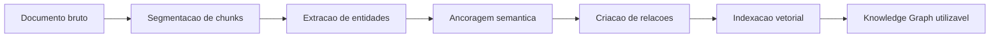
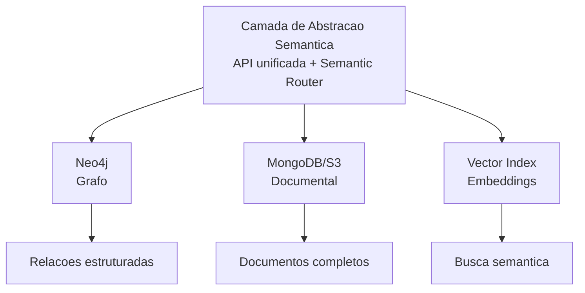
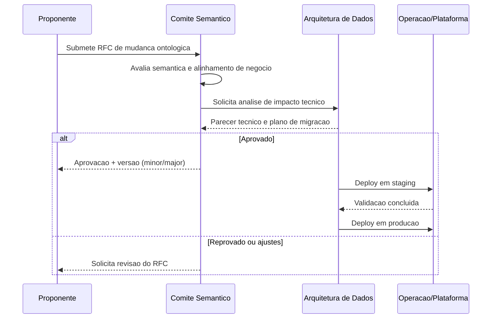
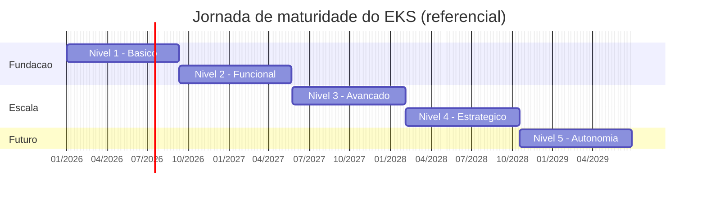

# Ontology Engineering & Enterprise Knowledge Systems
## Um Guia Prático para Transformar Conhecimento em Inteligência Organizacional

**Autor**: Rodrigo Trindade  
**Baseado no projeto**: EKS — Enterprise Knowledge System (CoCreateAI)

---

# Prefácio

Este livro nasceu de um projeto real.

Enquanto construía o **EKS (Enterprise Knowledge System)**, uma plataforma de inteligência organizacional baseada em grafos de conhecimento, agentes de IA e ontologias formais, percebi que o conhecimento que eu estava acumulando não deveria ficar preso dentro de um repositório de código. Ele deveria ser compartilhável. Acessível. Útil não apenas para engenheiros de software, mas para qualquer profissional que queira entender como transformar conhecimento disperso em inteligência acionável.

**Para quem é este livro?**

Para dois tipos de leitor:

- **O profissional técnico** que quer entender ontologias, knowledge graphs e arquitetura de sistemas de conhecimento com profundidade, mas a partir de uma aplicação real, não de um paper acadêmico.
- **O profissional de negócios** que sente que a empresa sabe mais do que consegue usar, que decisões se perdem, que o conhecimento institucional evapora quando alguém sai, e quer entender como a tecnologia pode resolver isso.

Se você pertence a qualquer um desses grupos (ou a ambos), este livro é para você.

**Como este livro está organizado**

A progressão é intencionalmente gradual:

1. **Parte I**: Começamos pelo problema: o que é conhecimento organizacional e por que ele se perde. Passamos pela epistemologia (sem medo da palavra), pela lógica formal e pelos modelos de representação.
2. **Parte II**: Entramos nas ontologias: o que são, como se constroem, quais linguagens existem, como validá-las.
3. **Parte III**: Operacionalizamos: o Knowledge Graph corporativo, como ele vive, envelhece, e precisa de cuidado.
4. **Parte IV**: A arquitetura completa: ingestão, armazenamento híbrido, memória organizacional, agentes de IA.
5. **Parte V**: Governança: como tornar o sistema permanente, mensurável e confiável.
6. **Parte VI**: O nível estratégico: quando o sistema de conhecimento se torna infraestrutura de decisão.

Cada capítulo pode ser lido de forma independente, mas a leitura sequencial revela uma narrativa: da teoria à prática, do conceito à implementação, do entendimento à operação.

**O que este livro não é**

Não é um manual de programação. Você encontrará exemplos de código e queries, mas eles existem para ilustrar conceitos, não para serem copiados e colados. O objetivo é que, ao terminar a leitura, você saiba *pensar* sobre sistemas de conhecimento, independentemente da ferramenta que usar.

**Como ler este livro**

Se você é um **profissional de negócios** e não tem familiaridade com código: não se preocupe. Os exemplos técnicos (trechos de código, queries de banco de dados) são sempre precedidos por uma explicação em linguagem natural e seguidos por uma interpretação do resultado. Você pode ler o texto ao redor e pular os blocos de código sem perder a compreensão conceitual. Pense nos blocos de código como "caixas de detalhamento técnico": eles existem para quem quiser se aprofundar, mas o texto narrativo é autocontido.

Se você é um **profissional técnico**: os blocos de código mostram implementações reais (Cypher, Python, JSON) que podem servir de referência para sua própria implementação. Eles são complementares ao texto, não substitutos.

Vamos começar.

---

# PARTE I: FUNDAMENTOS — O QUE É CONHECIMENTO ORGANIZACIONAL?

---

# Capítulo 1: O Problema do Conhecimento nas Organizações

## 1.1 O conhecimento invisível

Toda organização sabe mais do que consegue usar.

Essa afirmação pode parecer paradoxal, mas basta observar o dia a dia de qualquer empresa para perceber que ela é verdadeira. As decisões importantes que foram tomadas na reunião do mês passado? Estão em uma ata que ninguém relê. O processo que o João criou para resolver aquele problema recorrente? Está na cabeça dele, e ele saiu da empresa. A relação entre o projeto X e o objetivo estratégico Y? Todo mundo "sabe", mas ninguém consegue mostrar de forma clara.

O conhecimento organizacional é, em grande parte, **invisível**. Ele existe disperso em e-mails, documentos, conversas de chat, apresentações, planilhas e, talvez o mais importante, nas mentes das pessoas que compõem a organização. Esse conhecimento tácito, não formalizado, é frequentemente o mais valioso e o mais frágil.

Quando uma pessoa deixa uma empresa, ela não leva apenas sua capacidade técnica. Ela leva consigo uma rede de contextos, relações, decisões passadas e entendimentos sutis que nenhum documento de handover consegue capturar completamente. Isso não é um bug organizacional. É uma característica fundamental de como o conhecimento humano funciona. Ele é contextual, relacional e dinâmico.

O desafio, portanto, não é eliminar o conhecimento tácito (isso seria impossível e indesejável), mas criar **estruturas formais** que capturem o máximo possível do conhecimento organizacional de forma navegável, conectada e reutilizável.

## 1.2 O custo de não saber o que se sabe

Existe um termo em inglês que captura bem esse problema: *"We don't know what we know."* A organização possui o conhecimento, mas não consegue acessá-lo quando precisa.

Os custos são concretos:

- **Retrabalho**: equipes refazem análises que já foram feitas porque não sabiam que existiam.
- **Decisões desconectadas**: um departamento toma uma decisão que contradiz o que outro departamento já descobriu.
- **Perda de memória institucional**: cada reorganização, cada turnover, cada projeto encerrado leva consigo camadas de contexto.
- **Ineficiência na busca**: quanto tempo um profissional gasta procurando informação por dia? Estudos estimam entre 20% e 30% do tempo de trabalho.
- **Risco não mapeado**: decisões críticas são tomadas sem acesso ao histórico de tentativas anteriores, fracassos e lições aprendidas.

Esses custos raramente aparecem em um balanço financeiro. São custos de oportunidade, custos de atrito, custos silenciosos. Mas são reais e crescem proporcionalmente ao tamanho e à complexidade da organização.

## 1.3 Por que planilhas, documentos e e-mails falham

A maioria das organizações tenta resolver o problema do conhecimento com ferramentas de informação: sistemas de documentos, intranets, wikis corporativas, drives compartilhados. Essas ferramentas são úteis, mas fundamentalmente insuficientes.

**O problema do documento como unidade de conhecimento**

Um documento é linear. Ele tem começo, meio e fim. Ele foi escrito por alguém, em um momento, com um propósito. Quando você precisa de uma informação específica que está *dentro* de um documento, você precisa primeiro encontrar o documento (saber que ele existe), depois ler ou pesquisar dentro dele, e então extrair mentalmente a informação relevante.

Agora multiplique isso por milhares de documentos, dezenas de autores, anos de acúmulo. O resultado é um cemitério de PDFs onde o conhecimento está tecnicamente "disponível", mas praticamente inacessível.

**O problema da busca por palavras-chave**

Buscar informação por palavras-chave funciona quando você sabe exatamente o que está procurando. Mas o conhecimento mais valioso frequentemente é aquele que você *não sabe que precisa*. Nenhuma busca por palavras-chave vai te mostrar que a decisão que você está prestes a tomar contradiz uma lição aprendida há dois anos, a menos que a lição esteja conectada ao contexto da sua decisão atual.

**O problema do e-mail e do chat**

Conversas são o meio natural de troca de conhecimento. Mas são efêmeras por natureza. O insight brilhante que surgiu na conversa das 15h? Está soterrado sob 200 mensagens. A decisão tomada por e-mail? Está em uma thread que só duas pessoas tiveram acesso.

Todos esses meios (documentos, buscas, e-mails) tratam conhecimento como **texto**. E texto, sem estrutura, sem conexões, sem contexto formalizado, é apenas informação bruta esperando para ser esquecida.

## 1.4 O que muda quando o conhecimento ganha estrutura

Imagine um cenário diferente.

Imagine que toda decisão tomada em uma reunião fosse automaticamente registrada como uma entidade no sistema, com autor, data, contexto, justificativa e conexão com o objetivo estratégico que ela serve.

Imagine que todo profissional da organização pudesse perguntar, em linguagem natural: *"Quais decisões tomamos sobre o projeto X que impactam o OKR de crescimento?"* e receber uma resposta precisa, com fontes rastreáveis.

Imagine que quando um risco fosse identificado, o sistema automaticamente verificasse se riscos similares já foram mapeados antes, quais mitigações foram tentadas, e quais funcionaram.

Isso não é ficção científica. É o que um **Enterprise Knowledge System** bem projetado faz.

A diferença fundamental é esta: em vez de tratar conhecimento como texto armazenado em arquivos, ele é tratado como uma **rede de entidades conectadas** (pessoas, projetos, decisões, objetivos, documentos, riscos, insights) onde cada conexão carrega significado.

Um documento diz: *"Na reunião de janeiro, decidimos pausar o projeto Alpha por questões de orçamento."*

Um grafo de conhecimento diz:

```
(Decisão: "Pausar projeto Alpha")
  --[DECIDIDO_POR]--> (Pessoa: "Maria Costa")
  --[EXTRAÍDO_DE]--> (Reunião: "Review Janeiro 2026")
  --[IMPACTA]--> (Projeto: "Alpha")
  --[MOTIVADO_POR]--> (Risco: "Restrição orçamentária Q1")
  --[CONECTADO_A]--> (Objetivo: "Eficiência operacional")
```

A diferença não é apenas de formato. É de **capacidade cognitiva**. Com essa estrutura, o sistema pode responder perguntas que nenhuma busca textual responderia. Pode inferir conexões. Pode alertar sobre contradições. Pode mostrar o caminho entre uma decisão tática e um objetivo estratégico.

Essa é a promessa de um Enterprise Knowledge System, e é o que vamos construir, conceito por conceito, ao longo deste livro.

> **Em resumo:** Organizações sabem mais do que conseguem usar. O conhecimento mais valioso está disperso em documentos, e-mails, conversas e, principalmente, na cabeça das pessoas. Ferramentas tradicionais tratam conhecimento como texto, mas texto sem estrutura é informação esperando para ser esquecida. A solução é transformar conhecimento em uma *rede de entidades conectadas*, onde cada decisão, projeto, pessoa e objetivo tem relações explícitas. É isso que um Enterprise Knowledge System faz, e é o que vamos construir neste livro.

---

# Capítulo 2: Epistemologia Aplicada ao Contexto Corporativo

## 2.1 O que é conhecimento? (Uma definição prática)

Antes de construir um sistema que gerencia conhecimento, precisamos responder uma pergunta aparentemente simples: **o que é conhecimento?**

A filosofia debate essa questão há milênios. A definição clássica, atribuída a Platão, diz que conhecimento é "crença verdadeira justificada" (*justified true belief*). Embora essa definição tenha suas limitações filosóficas, ela nos dá um ponto de partida útil para o contexto corporativo:

- **Crença**: alguém acredita que algo é o caso.
- **Verdade**: aquilo corresponde à realidade (ou ao melhor entendimento disponível).
- **Justificação**: existe uma razão fundamentada para essa crença.

No contexto organizacional, podemos traduzir isso de forma pragmática:

> **Conhecimento organizacional é informação que foi validada, contextualizada e é acionável dentro de um domínio específico.**

A palavra-chave aqui é **acionável**. Dados sobre vendas do último trimestre são informação. A compreensão de *por que* as vendas caíram em uma região específica, baseada em análise contextual e experiência do time comercial, é conhecimento. A primeira pode ser obtida com uma query no banco de dados. A segunda requer interpretação, contexto e julgamento.

## 2.2 Conhecimento explícito vs tácito

A distinção mais importante para quem constrói sistemas de conhecimento é a proposta por Michael Polanyi e popularizada por Ikujiro Nonaka: a diferença entre **conhecimento explícito** e **conhecimento tácito**.

**Conhecimento explícito** é aquele que pode ser articulado, codificado e transmitido em linguagem formal. Um manual de procedimentos, uma fórmula matemática, um fluxograma de processo: todos são exemplos de conhecimento explícito. Ele pode ser armazenado, buscado e compartilhado de forma relativamente direta.

**Conhecimento tácito** é aquele que reside na experiência, na intuição e no julgamento das pessoas. É o que o vendedor sênior "sabe" sobre como lidar com um cliente difícil, mas não consegue colocar em um documento. É o que o engenheiro "sente" quando algo não está certo em um sistema, antes mesmo de identificar o bug. É o que o gestor percebe ao ler a dinâmica de uma reunião.

A maioria dos sistemas de gestão do conhecimento foca quase exclusivamente no conhecimento explícito, e é por isso que tantos falham. Eles capturam documentos, mas perdem o contexto. Armazenam procedimentos, mas não capturam o julgamento de quem os criou.

Um Enterprise Knowledge System eficaz precisa fazer algo mais sofisticado: **criar pontes entre o tácito e o explícito**. Isso não significa tornar todo conhecimento tácito em explícito (isso é impossível), mas criar estruturas que capturem o máximo de contexto, proveniência e conexão, de modo que o conhecimento explícito carregue consigo parte da riqueza do tácito.

Quando o sistema registra que uma decisão foi tomada *por quem*, *em qual contexto*, *com base em quais evidências*, e *conectada a quais objetivos*, ele está capturando uma camada de conhecimento que vai muito além do texto da decisão em si.

## 2.3 De dado a informação, de informação a conhecimento

Existe uma hierarquia clássica na gestão do conhecimento, frequentemente chamada de pirâmide **DIKW** (Data, Information, Knowledge, Wisdom):

- **Dados**: fatos brutos, sem contexto. *"Vendas: R$ 1.2M"*
- **Informação**: dados com contexto e significado. *"Vendas caíram 15% na região Sul no Q3"*
- **Conhecimento**: informação interpretada com experiência. *"A queda na região Sul está relacionada à perda do distribuidor principal em julho, e o padrão sugere que precisamos diversificar canais"*
- **Sabedoria**: conhecimento aplicado com julgamento. *"Dado nosso histórico com dependência de distribuidores únicos, devemos adotar uma política de no mínimo 3 canais por região antes de expandir"*

Para um Enterprise Knowledge System, cada nível dessa hierarquia tem um papel:

| Nível | Onde vive no EKS | Exemplo |
|-------|-------------------|---------|
| **Dados** | Propriedades de nós | `revenue: 1200000` |
| **Informação** | Nós com contexto | `Insight: "Queda de 15% na região Sul"` |
| **Conhecimento** | Conexões entre nós | `Insight --[CAUSADO_POR]--> Evento: "Perda do distribuidor"` |
| **Sabedoria** | Padrões e regras inferidas | `Regra: "Diversificar canais antes de expandir"` |

O Knowledge Graph é particularmente poderoso na camada do **conhecimento**, porque ele formaliza exatamente aquilo que torna informação em conhecimento: as **conexões e o contexto**.

## 2.4 Estruturas de validação e confiabilidade

Nem todo conhecimento tem o mesmo peso. Uma decisão baseada em dados auditados tem mais peso do que uma baseada em uma conversa informal. Um insight validado por três especialistas é mais confiável do que uma impressão de um estagiário.

Em um sistema de conhecimento sério, essa distinção precisa ser **formalizada**. Não basta armazenar informação. É preciso armazenar **o grau de confiança** dessa informação.

Isso se traduz em conceitos como:

- **Proveniência**: de onde veio essa informação? Foi extraída automaticamente de um documento? Foi inserida manualmente por um especialista? Foi inferida por um algoritmo?
- **Trust score**: qual o nível de confiança nessa informação, em uma escala de 0 a 1?
- **Validação humana**: essa informação foi revisada por alguém qualificado?
- **Temporalidade**: quando essa informação foi criada? Quando foi validada pela última vez? Ela tem prazo de validade?

Esses conceitos não são luxo acadêmico. Em um sistema onde agentes de IA geram respostas baseadas no conhecimento armazenado, a diferença entre um trust score de 0.9 e 0.3 pode ser a diferença entre uma resposta útil e uma alucinação perigosa.

## 2.5 A camada epistemológica como fundação de um sistema de conhecimento

A camada epistemológica de um Enterprise Knowledge System é o conjunto de regras e princípios que definem:

1. **O que conta como conhecimento** no contexto da organização
2. **Como o conhecimento é validado** (quem pode validar, quais critérios)
3. **Como o conhecimento envelhece** (quando perde relevância, quando precisa ser revisado)
4. **Como conflitos são resolvidos** (quando duas fontes se contradizem)
5. **Quais são os níveis de confiança** e como são atribuídos

Sem essa camada, um sistema de conhecimento é apenas um banco de dados sofisticado. Com ela, ele se torna um **sistema epistemológico**, capaz de distinguir o que sabe do que acha, o que é certo do que é provável, o que é atual do que é obsoleto.

Essa fundação epistemológica é o que permite, por exemplo, que o sistema diga ao usuário: *"Encontrei essa informação, mas ela foi extraída automaticamente e ainda não foi validada por um humano. O trust score é 0.6."* Em vez de apresentar tudo como verdade absoluta, o sistema pratica uma forma de **humildade epistêmica**: sabe o que sabe, e sabe o que não sabe.

> **Em resumo:** Epistemologia é a disciplina que pergunta "como sabemos o que sabemos?", e essa pergunta é essencial para qualquer sistema de conhecimento corporativo. Sem uma camada epistemológica, o sistema trata toda informação como igualmente verdadeira. Com ela, o sistema sabe distinguir fato de opinião, atual de obsoleto, confiável de duvidoso. Essa fundação (que inclui proveniência, trust score, validação humana e temporalidade) é o que separa um banco de dados inteligente de um verdadeiro sistema de conhecimento.

---

# Capítulo 3: Lógica Formal — A Linguagem por Trás da Estrutura

## 3.1 Por que lógica importa (mesmo para quem não é programador)

Quando falamos em "ontologia formal" ou "raciocínio automatizado", estamos falando, na essência, de **lógica**. Não a lógica do dia a dia ("é lógico que isso não funciona"), mas a lógica como disciplina formal: um sistema de regras que permite derivar conclusões válidas a partir de premissas.

Por que isso importa para um profissional de negócios?

Porque toda vez que você define uma regra de negócio (*"Todo projeto precisa de um responsável"*, *"Um OKR pertence a exatamente um objetivo estratégico"*, *"Nenhum departamento pode ter mais de um diretor"*), você está fazendo lógica formal, mesmo sem saber.

A diferença é que, no contexto de um Enterprise Knowledge System, essas regras não ficam apenas em documentos de política. Elas são **codificadas** no sistema, de modo que violações são detectadas automaticamente e inferências são realizadas de forma consistente.

## 3.2 Lógica proposicional: o básico do raciocínio

A lógica proposicional é o nível mais simples. Ela lida com proposições (afirmações que são verdadeiras ou falsas) e com conectivos lógicos:

- **E** (conjunção): "O projeto está ativo **e** tem orçamento aprovado"
- **OU** (disjunção): "O risco é alto **ou** o impacto é crítico"
- **NÃO** (negação): "O documento **não** foi validado"
- **SE...ENTÃO** (implicação): "**Se** o risk score é acima de 0.8, **então** requer aprovação do diretor"

Com esses conectivos simples, já é possível expressar muitas regras de negócio. A lógica proposicional é a base sobre a qual tudo o mais se constrói.

## 3.3 Lógica de predicados: descrevendo o mundo

A lógica de predicados vai além, introduzindo **variáveis**, **predicados** e **quantificadores**:

- **Predicados**: descrevem propriedades ou relações. `É_Gerente(Maria)`, `Pertence_A(Projeto_Alpha, Departamento_TI)`
- **Variáveis**: representam entidades genéricas. `x`, `y`
- **Quantificador universal (∀)**: "para todo". *∀x: Se É_Projeto(x), então Tem_Responsável(x)* — "Todo projeto tem um responsável"
- **Quantificador existencial (∃)**: "existe". *∃x: É_Diretor(x) ∧ Pertence_A(x, Departamento_TI)* — "Existe um diretor no departamento de TI"

Essa linguagem pode parecer distante do cotidiano, mas é exatamente assim que as regras de uma ontologia são definidas internamente. Quando você diz, em linguagem natural, "todo projeto deve estar ligado a pelo menos um OKR", o sistema traduz isso para algo como:

```
∀x: Projeto(x) → ∃y: OKR(y) ∧ Vinculado_A(x, y)
```

Você não precisa escrever essa fórmula. Mas entender que ela existe por trás do sistema ajuda a compreender o que o sistema pode e não pode verificar.

## 3.4 Lógicas descritivas: a base do OWL e das ontologias

As **lógicas descritivas** (Description Logics, ou DL) são uma família de linguagens lógicas que servem como fundamento teórico para o OWL (Web Ontology Language), a linguagem padrão para definir ontologias na web semântica.

As lógicas descritivas operam com três elementos básicos:

- **Conceitos** (classes): Pessoa, Projeto, Departamento
- **Papéis** (relações): pertence_a, gerencia, é_membro_de
- **Indivíduos** (instâncias): Maria, Projeto_Alpha, Departamento_TI

E permitem construir definições complexas:

- `Gerente ≡ Pessoa ⊓ ∃gerencia.Departamento` — "Um gerente é uma pessoa que gerencia pelo menos um departamento"
- `Projeto_Crítico ≡ Projeto ⊓ ∃tem_risco.(Risco ⊓ ∃tem_score.≥0.8)` — "Um projeto crítico é um projeto que tem pelo menos um risco com score acima de 0.8"

O poder das lógicas descritivas é que elas são **decidíveis**: existem algoritmos que podem verificar automaticamente se um conjunto de afirmações é consistente, se uma instância pertence a uma classe, ou se uma conclusão é logicamente válida.

Isso é o que permite que um sistema ontológico faça **inferência**: descobrir fatos novos a partir de fatos conhecidos, sem que alguém precise declarar explicitamente cada relação.

## 3.5 Como a lógica se traduz em regras de negócio

Na prática, a lógica formal se manifesta em um Enterprise Knowledge System de várias formas:

| Regra de negócio | Tradução lógica | O que o sistema faz |
|------------------|-----------------|---------------------|
| "Todo projeto tem um responsável" | ∀x: Projeto(x) → ∃y: responsável(x,y) | Alerta se um projeto é criado sem responsável |
| "Um OKR pertence a exatamente um objetivo" | Cardinalidade = 1 na relação | Impede que um OKR seja ligado a dois objetivos |
| "Decisões precisam de justificativa" | Propriedade obrigatória | Valida que o campo `rationale` está preenchido |
| "Tarefas atrasadas geram alerta" | Se status ≠ concluído ∧ data > due_date | Inferência automática de estado |

O profissional de negócios não precisa pensar em lógica formal. Mas o arquiteto do sistema precisa — porque é a lógica formal que garante que as regras de negócio são implementadas de forma **consistente, verificável e automatizável**.

> **Em resumo:** A lógica formal é a gramática invisível que permite a um sistema de conhecimento raciocinar com rigor. Assim como uma linguagem precisa de regras gramaticais para ser compreendida, um EKS precisa de lógica formal para garantir que suas regras de negócio sejam consistentes, verificáveis e automatizáveis. Na prática, isso significa que o sistema pode detectar contradições, validar dados automaticamente e derivar conclusões — tudo sem intervenção humana.

---

# Capítulo 4: Representação do Conhecimento — Dos Modelos Mentais à Formalização

## 4.1 Modelos baseados em regras

Os primeiros sistemas de inteligência artificial, nas décadas de 1970 e 1980, tentaram representar conhecimento humano na forma de regras **SE-ENTÃO** (sistemas especialistas):

```
SE temperatura > 38°C E dor_de_cabeça = sim
ENTÃO diagnóstico = possível_infecção
```

Esse modelo funciona bem para domínios estreitos e bem definidos. Mas rapidamente se torna ingerenciável quando o domínio é amplo, as regras se multiplicam, e exceções aparecem. Um sistema com milhares de regras IF-THEN é difícil de manter, difícil de debugar, e frágil diante de situações não previstas.

A principal lição dos sistemas baseados em regras: **representar conhecimento não é apenas listar regras — é estruturar um modelo do mundo.**

## 4.2 Redes semânticas — o conhecimento como rede

As redes semânticas, propostas nos anos 1960, trouxeram uma ideia revolucionária: representar conhecimento como um **grafo** de nós (conceitos) e arestas (relações).

```
[Cachorro] --é_um--> [Animal]
[Cachorro] --tem--> [Patas]
[Rex] --é_instância_de--> [Cachorro]
```

Essa representação é intuitiva — espelha como pensamos naturalmente. Organizamos conhecimento em categorias, fazemos associações, navegamos por relações. As redes semânticas são ancestrais diretas dos Knowledge Graphs modernos.

A limitação? Falta de formalismo. Em uma rede semântica básica, não há regras claras sobre o que cada tipo de relação significa, quais são obrigatórias, ou quais inferências são válidas. É uma estrutura expressiva, mas imprecisa.

## 4.3 Frames — estruturas de expectativa

Os frames, propostos por Marvin Minsky em 1975, organizam conhecimento em **estruturas tipadas** com slots (propriedades) e valores padrão:

```
Frame: Reunião
  - Tipo: [Presencial, Virtual, Híbrida]
  - Participantes: [lista de Pessoas]
  - Data: [data]
  - Pauta: [texto]
  - Decisões: [lista de Decisões]
  - Valor padrão para Tipo: Virtual
```

Os frames são poderosos porque capturam **expectativas**: quando você pensa em "reunião", já tem uma estrutura mental do que esperar. Os frames formalizam isso. São ancestrais diretos dos schemas de banco de dados e das classes em programação orientada a objetos.

## 4.4 Ontologias como evolução natural da representação

As ontologias combinam o melhor de todas essas abordagens:

- **Das regras**: a capacidade de expressar restrições e condições
- **Das redes semânticas**: a representação como grafo de conceitos conectados
- **Dos frames**: a estruturação tipada com propriedades e valores

Mas adicionam algo que nenhuma dessas abordagens tinha de forma completa: **semântica formal**. Uma ontologia não é apenas um desenho de caixas e flechas — é uma especificação formal que pode ser processada por máquinas, verificada por algoritmos, e usada para inferência automática.

Uma ontologia define:

- **Classes**: os tipos de coisas que existem no domínio (Pessoa, Projeto, Decisão)
- **Propriedades**: as características dessas coisas (nome, data, status)
- **Relações**: como as coisas se conectam (pertence_a, gerencia, extraído_de)
- **Axiomas**: as regras que governam essas conexões (todo projeto tem um responsável)
- **Restrições**: os limites do que é válido (um OKR pertence a exatamente um objetivo)

## 4.5 O momento em que representar se torna operar

Existe um ponto de inflexão na jornada de gestão do conhecimento. É o momento em que a representação deixa de ser um exercício teórico e se torna **operacional**.

Esse momento acontece quando:

1. A ontologia não é apenas um diagrama em um documento — ela está **implementada** em um banco de dados de grafos.
2. As relações não são apenas flechas em um quadro branco — elas são **consultas** que retornam respostas.
3. As restrições não são apenas políticas escritas — elas são **validações** que o sistema executa automaticamente.
4. As inferências não são apenas raciocínios humanos — elas são **derivadas** pelo sistema a partir de regras lógicas.

É nesse ponto que um modelo de conhecimento se transforma em um **Enterprise Knowledge System**. E é para esse ponto que este livro está te levando.

Nos próximos capítulos, vamos mergulhar nos detalhes: como construir uma ontologia formal, quais linguagens usar, como validá-la, e como operacionalizá-la em um Knowledge Graph vivo.

> **Em resumo:** Representar conhecimento é dar forma ao que sabemos. Das regras SE-ENTÃO dos anos 1970 às redes semânticas e frames, cada abordagem trouxe avanços. As ontologias combinam o melhor de todas: a capacidade de expressar restrições, a representação como grafo e a estruturação tipada — tudo com semântica formal que permite processamento por máquinas. O ponto de inflexão acontece quando a representação deixa de ser teórica e se torna operacional: ontologia implementada no grafo, relações como consultas, restrições como validações automáticas.

---

# PARTE II: ONTOLOGIAS — DANDO FORMA AO CONHECIMENTO

---

# Capítulo 5: Taxonomia, Ontologia e Knowledge Graph — Entendendo as Diferenças

## 5.1 Taxonomia — classificar é o primeiro passo

Uma **taxonomia** é uma estrutura hierárquica de classificação. É o modelo mais simples de organização do conhecimento: categorias e subcategorias.

```
Organização
├── Departamentos
│   ├── Tecnologia
│   ├── Comercial
│   └── Financeiro
├── Projetos
│   ├── Internos
│   └── Externos
└── Pessoas
    ├── Colaboradores
    ├── Gestores
    └── Diretores
```

Taxonomias são úteis. Elas criam ordem onde havia caos. Todo sistema de pastas, todo menu de navegação, toda classificação de produtos é uma taxonomia.

Mas taxonomias têm uma limitação fundamental: elas só expressam **relações hierárquicas** (é-um, pertence-a). No mundo real, as relações entre conceitos são muito mais ricas do que "A é subcategoria de B".

Uma pessoa *pertence a* um departamento, mas também *gerencia* projetos, *participa de* reuniões, *é responsável por* decisões, e *possui* competências. Uma taxonomia não captura nada disso.

## 5.2 Ontologia — estruturar é o segundo

Uma **ontologia** vai além da taxonomia porque define não apenas a hierarquia de classes, mas também:

- **Relações arbitrárias** entre classes (não apenas "é-um")
- **Propriedades** de cada classe (atributos e seus tipos)
- **Restrições** (cardinalidade, domínio, alcance)
- **Axiomas** (regras lógicas que devem ser verdadeiras)

Enquanto uma taxonomia diz "Gerente é um tipo de Pessoa", uma ontologia diz:

- Gerente é uma Pessoa
- Gerente gerencia exatamente um Departamento
- Gerente pode ter zero ou mais Subordinados diretos
- Se uma Pessoa gerencia um Departamento, ela pertence a esse Departamento
- Gerente é uma subclasse de Colaborador (herança)

Essa riqueza expressiva é o que torna ontologias adequadas para modelar domínios complexos como organizações, sistemas de saúde, cadeias de suprimentos, ou — no nosso caso — sistemas de conhecimento corporativo.

## 5.3 Knowledge Graph — conectar é o objetivo

Um **Knowledge Graph** é a materialização de uma ontologia em dados reais. Se a ontologia é o *schema* (a estrutura), o Knowledge Graph é a *instância* (os dados populados).

```
Ontologia (schema):
  Classe: Pessoa
  Classe: Departamento
  Relação: PERTENCE_A (Pessoa → Departamento)

Knowledge Graph (dados):
  (Maria) --[PERTENCE_A]--> (Departamento de TI)
  (João) --[PERTENCE_A]--> (Departamento Comercial)
  (Maria) --[GERENCIA]--> (Projeto Alpha)
  (Projeto Alpha) --[CONECTADO_A]--> (OKR: Crescimento Q1)
```

O Knowledge Graph é onde o conhecimento vive de fato. É navegável, consultável, e — fundamentalmente — **conectado**. Cada nó conhece seus vizinhos. Cada relação carrega significado. O todo é maior que a soma das partes.

| Conceito | O que define | Analogia |
|----------|-------------|----------|
| **Taxonomia** | Hierarquia de categorias | Índice de um livro |
| **Ontologia** | Estrutura formal com classes, relações e regras | Gramática de um idioma |
| **Knowledge Graph** | Dados reais conectados seguindo a ontologia | Texto escrito nesse idioma |

## 5.4 Classes, instâncias, relações, axiomas e restrições

Vamos definir cada elemento formalmente:

**Classes** são os tipos de entidades no seu domínio. No contexto organizacional: `Pessoa`, `Departamento`, `Projeto`, `Reunião`, `Decisão`, `OKR`, `Risco`, `Tarefa`. Cada classe define um conceito abstrato.

**Instâncias** (ou indivíduos) são entidades concretas que pertencem a uma classe. `Maria Costa` é uma instância de `Pessoa`. `Projeto Alpha` é uma instância de `Projeto`.

**Relações** (ou propriedades de objeto) conectam instâncias entre si. `Maria --[GERENCIA]--> Projeto Alpha`. Cada relação tem um tipo, e cada tipo tem um domínio (de onde parte) e um alcance (para onde vai).

**Axiomas** são afirmações que são sempre verdadeiras no domínio. "Todo projeto tem exatamente um responsável" é um axioma. "Se uma pessoa gerencia um departamento, então ela pertence a esse departamento" é um axioma. Axiomas permitem inferência automática.

**Restrições** limitam o que é válido. "Um OKR pertence a no máximo um objetivo" (restrição de cardinalidade máxima). "A propriedade `status` de uma Tarefa aceita apenas os valores: pendente, em_progresso, concluída, cancelada" (restrição de valor).

## 5.5 Herança: como o conhecimento se propaga na estrutura

Uma das propriedades mais poderosas das ontologias é a **herança**. Se `Gerente` é subclasse de `Pessoa`, então tudo o que é verdade sobre `Pessoa` é automaticamente verdade sobre `Gerente` — sem precisar redeclarar.

Se `Pessoa` tem as propriedades `nome`, `email`, `departamento`, então `Gerente` herda automaticamente todas essas propriedades — e pode adicionar as suas próprias, como `departamento_gerenciado` ou `orçamento_aprovado`.

A herança permite construir ontologias **modulares e extensíveis**: você define o geral uma vez e especializa conforme necessário, sem duplicação.

> **Em resumo:** Taxonomia, ontologia e knowledge graph são três níveis crescentes de sofisticação na organização do conhecimento. Taxonomia classifica (pastas de um arquivo). Ontologia define tipos, propriedades, relações e regras (o dicionário completo do domínio). Knowledge Graph implementa essa ontologia em um banco de dados, criando uma rede navegável e consultável. Cada nível adiciona capacidades — e é a combinação dos três que torna possível um sistema que realmente "entende" o negócio.

---

# Capítulo 6: A Linguagem das Ontologias — OWL, RDF(S) e SKOS

Imagine que você está construindo um dicionário muito especial para a sua empresa. Esse dicionário não define apenas palavras — ele define *coisas* (pessoas, projetos, decisões), *propriedades* dessas coisas (nome, data, status), e *regras* sobre como essas coisas se relacionam (todo projeto tem um responsável). As linguagens que veremos neste capítulo — RDF, OWL, SKOS — são os "idiomas" nos quais esses dicionários corporativos são escritos. Cada uma tem um nível diferente de sofisticação, e juntas formam a base sobre a qual sistemas de conhecimento são construídos.

## 6.1 O modelo de tripla — sujeito, predicado, objeto

No coração de todas as linguagens de ontologia está o **modelo de tripla**: a ideia de que qualquer fato pode ser expresso como três elementos — como uma frase simples com sujeito, verbo e complemento.

```
(Sujeito) --[Predicado]--> (Objeto)
```

Exemplos:

- `(Maria) --[pertence_a]--> (Departamento TI)`
- `(Projeto Alpha) --[tem_status]--> ("Ativo")`
- `(Reunião Jan 2026) --[participou]--> (Maria)`

Cada tripla é uma afirmação atômica — a menor unidade de conhecimento. Um Knowledge Graph inteiro é um conjunto de triplas. Milhares, milhões de afirmações simples que, juntas, descrevem um domínio complexo.

A beleza do modelo de tripla é sua **simplicidade e universalidade**. Qualquer fato pode ser decomposto em triplas. Qualquer domínio pode ser modelado como um conjunto de triplas. E triplas podem ser combinadas, consultadas, inferidas e versionadas.

## 6.2 RDF e RDF Schema — os tijolos básicos

O **RDF** (Resource Description Framework) é o padrão W3C para representar informação na forma de triplas. É a linguagem mais básica da web semântica.

O **RDF Schema** (RDFS) adiciona vocabulário para definir classes e hierarquias:

- `rdfs:Class` — define uma classe
- `rdfs:subClassOf` — define hierarquia ("Gerente é subclasse de Pessoa")
- `rdfs:domain` — define o domínio de uma propriedade
- `rdfs:range` — define o alcance de uma propriedade

Com RDFS, já é possível criar ontologias simples. Mas a expressividade é limitada — não há como definir cardinalidade, restrições complexas, ou classes definidas por condições.

## 6.3 OWL — a potência das ontologias formais

Se o RDF é como aprender a fazer frases simples em um idioma novo, o OWL é como dominar a gramática completa — incluindo regras, exceções e nuances que permitem expressar ideias sofisticadas.

O **OWL** (Web Ontology Language) é onde a ontologia ganha poder real. Construído sobre RDF, o OWL adiciona:

- **Restrições de cardinalidade**: "exatamente 1", "no mínimo 2", "no máximo 5"
- **Classes definidas**: `Projeto_Crítico ≡ Projeto ⊓ ∃tem_risco.Risco_Alto`
- **Propriedades inversas**: se `gerencia` vai de Pessoa para Departamento, `é_gerenciado_por` vai de Departamento para Pessoa
- **Propriedades transitivas**: se A `é_parte_de` B, e B `é_parte_de` C, então A `é_parte_de` C
- **Disjunção de classes**: Pessoa e Departamento são classes disjuntas (nenhuma instância pode ser ambas)
- **Equivalência**: duas classes podem ser declaradas equivalentes

O OWL existe em três perfis de expressividade:

| Perfil | Expressividade | Uso típico |
|--------|---------------|------------|
| **OWL Lite** | Básica | Taxonomias com restrições simples |
| **OWL DL** | Alta | Ontologias corporativas completas |
| **OWL Full** | Máxima | Pesquisa acadêmica (decidibilidade não garantida) |

Para a maioria dos projetos corporativos, **OWL DL** oferece o equilíbrio ideal entre expressividade e computabilidade.

## 6.4 SKOS — vocabulários controlados

O **SKOS** (Simple Knowledge Organization System) não é uma linguagem de ontologia no sentido formal, mas é extremamente útil para representar **tesauros** e **vocabulários controlados**.

Enquanto OWL define classes e relações lógicas, SKOS define **conceitos** e suas relações semânticas:

- `skos:broader` — conceito mais amplo ("Marketing Digital" é mais amplo que "SEO")
- `skos:narrower` — conceito mais específico
- `skos:related` — conceito relacionado
- `skos:altLabel` — rótulo alternativo (sinônimo)
- `skos:prefLabel` — rótulo preferido

Em um EKS, SKOS é particularmente útil para lidar com o problema de **aliases** — quando a mesma coisa é referenciada por nomes diferentes ("AWS", "Amazon Web Services", "aws").

## 6.5 Propriedades de objeto vs propriedades de dado

Uma distinção fundamental em OWL:

**Propriedades de objeto** (Object Properties) conectam instâncias a outras instâncias:
- `pertence_a` (Pessoa → Departamento)
- `gerencia` (Pessoa → Projeto)
- `extraído_de` (Decisão → Reunião)

**Propriedades de dado** (Datatype Properties) conectam instâncias a valores literais:
- `nome` (Pessoa → String)
- `data_criação` (Projeto → Date)
- `trust_score` (Conhecimento → Float)

Essa distinção parece simples, mas é crucial para a modelagem: propriedades de objeto criam **conexões navegáveis** no grafo, enquanto propriedades de dado armazenam **atributos**. Um Knowledge Graph rico tem muitas propriedades de objeto — são elas que dão ao grafo sua capacidade de responder perguntas complexas.

## 6.6 Domínio, alcance e cardinalidade

Três conceitos que garantem a **integridade** de uma ontologia:

**Domínio** (domain): de que tipo de entidade parte a relação.  
*A propriedade `gerencia` tem domínio `Pessoa`* — só pessoas podem gerenciar.

**Alcance** (range): para que tipo de entidade a relação aponta.  
*A propriedade `gerencia` tem alcance `Departamento`* — só departamentos podem ser gerenciados (neste contexto).

**Cardinalidade**: quantas vezes a relação pode ocorrer.
- `min 1` — obrigatória (todo projeto tem pelo menos um membro)
- `max 1` — única (cada OKR pertence a exatamente um objetivo)
- `exactly 1` — exatamente uma ocorrência
- Sem restrição — livre (uma pessoa pode participar de qualquer número de reuniões)

Quando essas regras são definidas na ontologia, o sistema pode **validar automaticamente** os dados: se alguém tentar criar um projeto sem responsável, o sistema detecta a violação.

## 6.7 Inferência — quando o sistema descobre sozinho

Um dos recursos mais poderosos de ontologias formais é a **inferência**: a capacidade de derivar novos fatos a partir de fatos conhecidos e regras definidas.

Exemplo:

- **Fato**: Maria gerencia o Departamento de TI
- **Regra**: Se uma pessoa gerencia um departamento, ela pertence a esse departamento
- **Inferência**: Maria pertence ao Departamento de TI ✓

Outro exemplo mais sofisticado:

- **Fato**: Projeto Alpha tem um risco com score 0.9
- **Definição**: Projeto_Crítico ≡ Projeto com pelo menos um risco com score > 0.8
- **Inferência**: Projeto Alpha é um Projeto_Crítico ✓

A inferência elimina a necessidade de declarar explicitamente tudo o que é verdade no sistema. Basta declarar os fatos fundamentais e as regras — o resto é derivado automaticamente.

Em um EKS, inferência é o que permite perguntas como *"Quais projetos críticos estão no departamento da Maria?"* — mesmo que ninguém nunca tenha explicitamente classificado projetos como críticos ou associado Maria ao departamento. O sistema infere.

> **Em resumo:** OWL, RDF(S) e SKOS são os "idiomas" nos quais ontologias são escritas. RDF fornece a gramática básica (triplas sujeito-predicado-objeto), OWL adiciona expressividade avançada (restrições, cardinalidade, equivalências), e SKOS oferece vocabulários controlados para quando a formalidade total não é necessária. Reasoners são os "motores de inferência" que derivam conclusões automaticamente a partir dos fatos e regras declarados. Juntas, essas tecnologias permitem que o conhecimento organizacional seja não apenas armazenado, mas compreendido e raciocinado por máquinas.

---

# Capítulo 7: Validação e Consistência Ontológica

## 7.1 O que significa uma ontologia "saudável"

Uma ontologia saudável é aquela que é:

- **Conectada**: as entidades relevantes estão ligadas de forma significativa
- **Equilibrada**: sem concentração excessiva em poucos nós (supernós problemáticos)
- **Consistente**: não contém contradições lógicas
- **Manutenível**: pode evoluir sem quebrar o que já existe

Medir a saúde de uma ontologia não é subjetivo — existem métricas concretas:

| Métrica | O que mede | Valor saudável |
|---------|-----------|----------------|
| **R/N** (Relationships/Nodes) | Densidade do grafo | 1-3 para grafos corporativos |
| **p50 (mediana do grau)** | Conexões típicas | 2-4 |
| **p90 (percentil 90)** | Presença de hubs | < 5x a mediana |
| **% nós órfãos** | Nós sem conexão | < 10% |
| **Trust score médio** | Confiabilidade geral | > 0.6 |

Essas métricas não são teóricas — são medidas que podem ser calculadas diretamente a partir do Knowledge Graph em produção.

## 7.2 SHACL — validação de formas

Pense no SHACL como um "checklist de qualidade" para o seu grafo de conhecimento. Assim como um formulário online impede que você envie um cadastro sem preencher o e-mail, o SHACL impede que o sistema aceite dados incompletos ou malformados.

O **SHACL** (Shapes Constraint Language) é o padrão W3C para validar grafos RDF. Enquanto OWL define o que *pode* existir, SHACL define o que *deve* existir.

SHACL funciona através de **shapes** (formas) — templates que definem como os dados devem ser:

```
shape:ProjetoShape
  - targetClass: Projeto
  - propriedade: nome (obrigatório, string, mínimo 3 caracteres)
  - propriedade: status (obrigatório, valores: ativo/pausado/concluído)
  - propriedade: responsável (obrigatório, mínimo 1, tipo: Pessoa)
  - propriedade: data_início (obrigatório, tipo: data)
```

Quando dados são inseridos ou modificados, SHACL verifica se eles respeitam a shape correspondente. Violações são reportadas com detalhes: qual nó, qual propriedade, qual restrição foi violada.

É o equivalente ontológico da **validação de formulário** — mas aplicado à estrutura do conhecimento inteiro.

## 7.3 Consistência lógica — contradições que quebram tudo

Uma ontologia é **inconsistente** quando contém contradições lógicas. Por exemplo:

- Declarar que Pessoa e Departamento são classes disjuntas
- E depois criar uma instância que é simultaneamente Pessoa e Departamento

Em uma ontologia inconsistente, **qualquer conclusão pode ser derivada** (princípio da explosão). Isso torna a inferência inútil — o sistema pode "provar" qualquer coisa, verdadeira ou falsa.

Ferramentas chamadas **reasoners** (raciocinadores) verificam automaticamente a consistência de uma ontologia. Os mais conhecidos são Pellet, HermiT e ELK. Eles são o equivalente ontológico de um compilador que verifica erros antes de o programa rodar.

## 7.4 Verificação de integridade semântica

Além da consistência lógica pura, existe a **integridade semântica** — verificar se a ontologia faz sentido no domínio.

Perguntas de integridade:

- Existem classes sem instâncias? (classes inúteis)
- Existem propriedades nunca usadas? (excesso de modelagem)
- Existem ciclos indesejados? (A é_parte_de B, B é_parte_de A)
- Existem relações ambíguas? (uso excessivo de `RELATED_TO` genérico)
- A hierarquia faz sentido? (subclasses são realmente especializações?)

Essa verificação é parcialmente automatizável, mas frequentemente requer **revisão humana** — o curador ontológico que entende do domínio e pode dizer: "essa relação não faz sentido no nosso contexto".

## 7.5 Convenções de nomenclatura que salvam projetos

Um aspecto prático mas crucial: como nomear coisas.

| Elemento | Convenção | Exemplo |
|----------|-----------|---------|
| Classes (Labels) | `PascalCase` | `ExternalParticipant` |
| Relações (Relationships) | `UPPER_SNAKE_CASE` | `BELONGS_TO_OBJECTIVE` |
| Propriedades | `snake_case` | `created_at`, `trust_score` |
| Instâncias | Nome natural | `"Rodrigo Trindade"`, `"Projeto Alpha"` |

Parecem detalhes menores, mas em um grafo com milhares de entidades, convenções inconsistentes geram confusão, erros de consulta e dificuldade de manutenção. Defina as convenções no início e aplique-as rigorosamente.

> **Em resumo:** Validação é o que garante que uma ontologia funciona na prática. SHACL atua como um "inspetor de qualidade" que verifica se os dados seguem as regras definidas — campos obrigatórios, formatos corretos, relações válidas. As métricas de saúde (razão R/N, grau médio, nós órfãos) funcionam como um "exame de saúde" do grafo. E convenções de nomenclatura consistentes são a base para que tudo funcione sem confusão. Sem validação, a ontologia degenera rapidamente conforme dados reais são inseridos.

---

# Capítulo 8: Ontology Design Patterns — Soluções para Problemas Recorrentes

## 8.1 O que são design patterns ontológicos

Assim como na engenharia de software, a engenharia de ontologias possui **padrões de design** — soluções testadas e reutilizáveis para problemas de modelagem recorrentes.

Design patterns ontológicos economizam tempo, evitam erros comuns, e produzem ontologias mais consistentes e interoperáveis. Não é preciso reinventar a roda cada vez que você precisa modelar papéis, eventos ou composição.

## 8.2 Part-of — representando composição

O pattern **Part-of** (parte-de) modela relações de composição:

```
(Organização) --[TEM_DEPARTAMENTO]--> (Departamento)
(Departamento) --[TEM_EQUIPE]--> (Equipe)
(Documento) --[TEM_SEÇÃO]--> (Seção)
(Reunião) --[TEM_PAUTA]--> (Item de Pauta)
```

Propriedades importantes desse pattern:

- **Transitividade**: se A é parte de B, e B é parte de C, então A é parte de C? (Nem sempre — depende do domínio)
- **Exclusividade**: uma parte pode pertencer a mais de um todo? (Uma pessoa pode pertencer a mais de um departamento?)
- **Essencialidade**: o todo pode existir sem a parte? (O departamento pode existir sem equipes?)

## 8.3 Agent-role — pessoas e seus papéis

O pattern **Agent-Role** separa a entidade (a pessoa) do papel que ela desempenha:

```
(Maria) --[TEM_PAPEL]--> (Papel: Gerente de Projeto)
(Papel: Gerente de Projeto) --[NO_CONTEXTO_DE]--> (Projeto Alpha)
(Papel: Gerente de Projeto) --[VIGÊNCIA]--> (Jan 2026 - presente)
```

Por que não simplesmente dizer `Maria --[GERENCIA]--> Projeto Alpha`?

Porque a relação direta perde informação temporal e contextual. Maria pode ter sido gerente do Projeto Alpha de janeiro a março, e depois ter assumido outro papel. O pattern Agent-Role captura essa dinâmica sem perder histórico.

Esse pattern é especialmente relevante em organizações onde pessoas mudam frequentemente de papel, acumulam funções, ou desempenham papéis diferentes em contextos diferentes.

## 8.4 Event — o que aconteceu, quando e com quem

O pattern **Event** modela acontecimentos com participantes, tempo e resultado:

```
(Evento: Reunião de Review)
  --[OCORREU_EM]--> (Data: 2026-01-15)
  --[LOCAL]--> (Sala Virtual Zoom)
  --[PARTICIPOU]--> (Maria, João, Pedro)
  --[RESULTOU_EM]--> (Decisão: Pausar Projeto Beta)
  --[GEROU]--> (Tarefa: Realocar orçamento)
```

O pattern Event é fundamental para **memória episódica** — a capacidade do sistema de responder perguntas como "O que aconteceu na última reunião de review?" ou "Quais decisões foram tomadas no primeiro trimestre?".

## 8.5 Temporal patterns — o tempo como dimensão do conhecimento

O tempo é talvez a dimensão mais negligenciada em sistemas de conhecimento, e uma das mais importantes. Patterns temporais capturam:

**Estado vs evento**: um estado é contínuo ("Maria é gerente"), um evento é pontual ("Maria foi promovida em janeiro"). Ambos precisam ser modelados, mas de formas diferentes.

**Bitemporal**: dois eixos temporais distintos:
- **Tempo de validade**: quando o fato era verdadeiro no mundo real
- **Tempo de registro**: quando o fato foi registrado no sistema

Por que isso importa? Porque você pode registrar hoje que uma decisão foi tomada na semana passada. O tempo de validade é a semana passada; o tempo de registro é hoje. Sem bitemporalidade, você perde essa distinção.

**Freshness decay**: o conhecimento envelhece. Uma análise de mercado de dois anos atrás tem menos relevância que uma de ontem. O pattern de freshness decay modela essa perda gradual de relevância.

## 8.6 Aplicando patterns a um domínio real

Na prática, uma ontologia corporativa combina múltiplos patterns simultaneamente:

```
(Organização: CoCreateAI)
  --[TEM_DEPARTAMENTO]--> (Departamento: Tecnologia)        [Part-of]
  
(Maria: Pessoa)
  --[TEM_PAPEL]--> (Papel: Diretora de Tecnologia)          [Agent-Role]
  --[NO_CONTEXTO]--> (Departamento: Tecnologia)
  
(Reunião de Kickoff: Evento)                                  [Event]
  --[PARTICIPOU]--> (Maria, João)
  --[RESULTOU_EM]--> (Decisão: Adotar Neo4j)
  
(Decisão: Adotar Neo4j)
  --[VÁLIDA_DESDE]--> (2026-01-15)                           [Temporal]
  --[REGISTRADA_EM]--> (2026-01-16)
  --[TRUST_SCORE]--> (0.95)
  --[CONECTADA_A]--> (Objetivo: Modernização tecnológica)
```

A combinação de patterns cria uma representação rica, navegável e formalmente válida do domínio organizacional. Cada fato está conectado, contextualizado, e rastreável.

> **Em resumo:** Design patterns ontológicos são soluções testadas para problemas recorrentes de modelagem — assim como design patterns em engenharia de software. Os principais padrões (Agent-Role, Part-of, Event, Temporal/Bitemporalidade e Freshness Decay) resolvem desafios comuns como "uma pessoa pode ter múltiplos papéis", "partes compõem um todo" e "o conhecimento envelhece". Na prática, uma ontologia corporativa combina múltiplos patterns simultaneamente, criando uma representação onde cada fato está conectado, contextualizado e rastreável.

---

# PARTE III: KNOWLEDGE GRAPH CORPORATIVO — O SISTEMA VIVO

> *Na Parte II, aprendemos a criar o vocabulário formal para descrever o conhecimento — as ontologias. Agora, vamos dar vida a esse vocabulário. Um Knowledge Graph corporativo não é um arquivo estático: é um sistema vivo que cresce, envelhece e precisa de cuidado, assim como um jardim. Nesta parte, veremos como projetá-lo, alimentá-lo e mantê-lo saudável.*

---

# Capítulo 9: Arquitetura Conceitual — As Três Camadas do EKS

## 9.0 Uma analogia: a biblioteca, os catálogos e os livros

Antes de entrar na arquitetura técnica, imagine uma biblioteca pública bem organizada:

- **Os leitores** chegam e fazem perguntas ao balcão: "Quero livros sobre história do Brasil". Eles não precisam saber como os livros estão organizados nos bastidores — eles apenas interagem com o sistema de consulta. Essa é a **camada externa**.
- **O catálogo da biblioteca** — o sistema de classificação Dewey, as fichas catalográficas — organiza *logicamente* todo o acervo: quais categorias existem, como os livros se relacionam, quais são as regras de catalogação. Essa é a **camada conceitual**.
- **As estantes físicas**, os depósitos, a forma como os livros estão armazenados no espaço — essa é a **camada interna**.

Se a biblioteca decidir mudar do sistema Dewey para outro sistema de classificação, os leitores nem percebem — eles continuam pedindo livros no balcão. Se a biblioteca mudar os livros de sala, o catálogo continua válido. Essa independência entre camadas é exatamente o que buscamos em um sistema de conhecimento.

## 9.1 A arquitetura ANSI/SPARC aplicada ao conhecimento

A arquitetura descrita na analogia acima tem nome: **ANSI/SPARC**, proposta em 1975 para sistemas de banco de dados. Ela define três camadas de abstração:

- **Camada externa**: como os usuários veem os dados (o balcão da biblioteca)
- **Camada conceitual**: a estrutura lógica completa (o catálogo)
- **Camada interna**: como os dados são fisicamente armazenados (as estantes)

Um Enterprise Knowledge System bem projetado segue essa mesma lógica:

| Camada | O que define | No contexto EKS |
|--------|-------------|-----------------|
| **Externa** | Interface com usuários e agentes | Chat, dashboards, APIs |
| **Conceitual** | Ontologia e modelo semântico | Classes, relações, regras |
| **Física** | Armazenamento e persistência | Neo4j, vector stores, documentos |

Essa separação é crucial por uma razão simples: permite **evoluir cada camada independentemente**. Você pode mudar o banco de dados sem alterar a ontologia. Pode adicionar um novo agente sem reestruturar o grafo. Pode refinar a interface sem tocar na lógica de inferência.

## 9.2 Camada conceitual: o schema ontológico

A camada conceitual é onde vive a ontologia formal. No projeto EKS, essa camada define:

**Entidades centrais do domínio organizacional:**

```
Person (Pessoa)
  - Propriedades: name, email, current_role, expertise_areas, availability
  - Relações: WORKS_FOR, HAS_ROLE, PARTICIPATES_IN, OWNS

Organization (Organização)
  - Propriedades: name, type (CoCreate/CVC/Startup), founding_date
  - Relações: HAS_DEPARTMENT, HAS_PROJECT, HAS_OBJECTIVE

Project (Projeto)
  - Propriedades: name, status, start_date, budget
  - Relações: MANAGED_BY, CONNECTED_TO, HAS_TASK

Meeting (Reunião)
  - Propriedades: title, date, location, summary
  - Relações: PARTICIPATED, RESULTED_IN, ABOUT_PROJECT

Decision (Decisão)
  - Propriedades: title, rationale, date, confidence
  - Relações: MADE_BY, EXTRACTED_FROM, IMPACTS, CONNECTED_TO

Knowledge (Conhecimento)
  - Propriedades: content, type, confidence, freshness_score
  - Relações: EXTRACTED_FROM, ABOUT, RELATED_TO, GENERATES
```

Cada uma dessas classes possui um **schema explícito** — não são tags arbitrárias, mas entidades com semântica formal.

## 9.3 Camada lógica: operações semânticas

A camada lógica é onde o conhecimento se transforma em **operação**. Se a camada conceitual é o catálogo da biblioteca, a camada lógica é o bibliotecário que sabe *usar* o catálogo para responder suas perguntas, verificar se os livros estão catalogados corretamente e encontrar conexões que você não esperava.

Na prática, ela faz quatro coisas:

**1. Queries semânticas** — responder perguntas sobre o conhecimento armazenado.

Pergunta em linguagem natural: *"Quais decisões impactam o projeto EKS?"*

O sistema traduz isso em uma consulta ao grafo (os blocos de código abaixo são escritos em **Cypher**, a linguagem de consulta do Neo4j — pense neles como "perguntas formais" feitas ao grafo):

```cypher
MATCH (d:Decision)-[:IMPACTS]->(p:Project {name: "Projeto EKS"})
RETURN d.title, d.date, d.rationale
ORDER BY d.date DESC;
```

**2. Inferências** — derivar novos fatos que ninguém declarou explicitamente.

Regra: *"Se alguém gerencia um departamento, então essa pessoa pertence àquele departamento."*

```cypher
MATCH (p:Person)-[:MANAGES]->(d:Department)
WHERE NOT (p)-[:BELONGS_TO]->(d)
MERGE (p)-[:BELONGS_TO]->(d);
```

O sistema descobre sozinho que Maria pertence ao departamento de TI, sem que ninguém precise dizer isso explicitamente.

**3. Validações** — verificar se o conhecimento está completo e correto.

Regra de negócio: *"Todo projeto precisa de um responsável."*

```cypher
MATCH (p:Project)
WHERE NOT EXISTS {
  (p)-[:MANAGED_BY]->(:Person)
}
RETURN p.name AS projeto_invalido;
```

Se algum projeto não tiver responsável, o sistema alerta. É como se o bibliotecário avisasse: "Este livro não tem ficha catalográfica completa — falta o autor."

**4. Navegação contextual** — descobrir caminhos entre informações aparentemente desconectadas.

Pergunta: *"Qual é o caminho de uma decisão técnica até o objetivo estratégico que ela serve?"*

```cypher
MATCH path = (d:Decision)-[*1..5]-(o:Objective)
WHERE d.title CONTAINS "Adotar Neo4j"
RETURN path;
```

Essa query revela a cadeia: a decisão de adotar Neo4j conecta-se ao projeto EKS, que se conecta ao objetivo de modernização tecnológica. Essa rastreabilidade é o que permite a uma organização responder *"por que fizemos isso?"*.

Essa camada transforma o grafo estático em um **sistema cognitivo** — capaz de responder, inferir, validar e navegar.

## 9.4 Camada física: Neo4j e armazenamento

A camada física implementa o armazenamento. No projeto EKS, a escolha foi **Neo4j Aura** (banco de grafos nativo na nuvem).

**Por que Neo4j?**

- **Navegação eficiente**: Traversals de múltiplos níveis são nativamente otimizados
- **Cypher**: Linguagem de query declarativa e expressiva
- **Indexes semânticos**: Suporte a full-text search e vetores
- **Transações ACID**: Confiabilidade para dados críticos
- **Escalabilidade**: Horizontal e vertical

**Estrutura física do grafo EKS:**

```
Nodes: 69
Relationships: 114
R/N ratio: 1.65 (densidade saudável)
Órfãos: 0 (zero nós desconectados)
Supernós: 5 (nós com > 10 conexões)
```

Cada nó carrega **metadados universais**:

```json
{
  "id": "uuid",
  "created_at": "timestamp",
  "updated_at": "timestamp",
  "source_type": "document | chat | form | inference",
  "confidence": 0.85,
  "freshness_score": 0.92,
  "last_validated_at": "timestamp"
}
```

Esses metadados não são luxo — são infraestrutura epistemológica. Cada fato carrega consigo sua proveniência, confiabilidade e atualidade.

## 9.5 A separação de preocupações que permite escala

A beleza dessa arquitetura em camadas é a **separação de preocupações**:

- Um cientista de dados pode escrever queries na camada lógica sem entender detalhes de índices do Neo4j
- Um engenheiro de ontologias pode evoluir o schema conceitual sem quebrar queries existentes
- Um desenvolvedor de interface pode criar novos agentes consumindo a camada lógica via API

Essa modularidade não é apenas elegância técnica — é **requisito para manutenibilidade**. Um EKS precisa evoluir continuamente. Novos tipos de entidades surgem, novas relações são descobertas, novas perguntas precisam ser respondidas. A arquitetura em camadas permite que cada mudança seja localizada, testada e deployada de forma independente.

> **Em resumo:** A arquitetura em três camadas funciona como uma biblioteca bem organizada: o leitor (camada externa) faz perguntas, o catálogo (camada conceitual) organiza o conhecimento, e as estantes (camada interna) armazenam os dados. Separar essas preocupações permite que cada parte evolua sem quebrar as outras — e isso é fundamental para um sistema que precisa crescer com a organização.

---

# Capítulo 10: Estrutura Mínima de um Enterprise Knowledge Graph

## 10.0 Uma analogia: os quatro pilares de uma empresa

Toda empresa, independente de tamanho ou setor, pode ser entendida através de quatro lentes:

1. **Para onde estamos indo?** — Os objetivos estratégicos, as metas, as métricas de sucesso.
2. **O que estamos fazendo agora?** — Os projetos, as tarefas, os riscos em andamento.
3. **Quem faz o quê?** — As pessoas, suas competências, seus papéis e relações.
4. **O que sabemos?** — Os documentos, relatórios, decisões registradas e o conhecimento acumulado.

Em uma empresa pequena, essas quatro lentes estão na cabeça do fundador. Em uma empresa de 100 pessoas, elas já estão fragmentadas em planilhas, emails, drives compartilhados e a memória de pessoas-chave. Em uma empresa de 1.000 pessoas, a fragmentação é tão grande que a organização literalmente *não sabe o que sabe*.

Um Enterprise Knowledge Graph resolve isso ao representar explicitamente esses quatro pilares — e, crucialmente, as **conexões entre eles**.

## 10.1 Os quatro núcleos do grafo corporativo

Um Knowledge Graph corporativo bem estruturado possui **quatro núcleos semânticos** interconectados, correspondendo às quatro lentes acima:

### 1. Núcleo Estratégico ("Para onde estamos indo?")

Captura objetivos, OKRs, métricas e decisões estratégicas.

```
(Objective: "Modernização Tecnológica")
  --[HAS_KEY_RESULT]--> (OKR: "Migrar 80% dos sistemas para cloud até Q3")
  --[MEASURED_BY]--> (KPI: "Percentual de sistemas migrados")
  --[CONNECTED_TO]--> (Decision: "Adotar Neo4j para Knowledge Graph")
```

**Por que esse núcleo existe:**  
Sem ele, o sistema não consegue responder à pergunta mais importante de uma organização: *"Por que estamos fazendo isso?"* Cada projeto, cada decisão, cada tarefa deveria, idealmente, ser rastreável até um objetivo estratégico.

### 2. Núcleo Operacional ("O que estamos fazendo agora?")

Captura projetos, tarefas, riscos e execução.

```
(Project: "EKS - Enterprise Knowledge System")
  --[MANAGED_BY]--> (Person: "Rodrigo Trindade")
  --[HAS_TASK]--> (Task: "Implementar pipeline de ingestão")
  --[ASSIGNED_TO]--> (Person: "João Silva")
  --[HAS_RISK]--> (Risk: "Latência na extração de entidades")
  --[MITIGATED_BY]--> (Action: "Implementar cache de embeddings")
```

**Por que esse núcleo existe:**  
É onde a estratégia se transforma em ação. Ele responde: *"O que estamos fazendo agora? Quem é responsável? O que pode dar errado?"*

### 3. Núcleo Relacional ("Quem faz o quê?")

Captura pessoas, suas competências, papéis e relações.

```
(Person: "Maria Costa")
  --[HAS_ROLE]--> (Role: "Engenheira de Dados")
  --[WORKS_FOR]--> (Organization: "CoCreateAI")
  --[BELONGS_TO]--> (Department: "Tecnologia")
  --[HAS_SKILL]--> (Skill: "Neo4j", "Python", "Ontologias")
  --[PARTICIPATES_IN]--> (Project: "EKS")
```

**Por que esse núcleo existe:**  
Conhecimento não existe no vácuo — ele reside em pessoas. Saber *quem sabe o quê* é frequentemente mais valioso do que ter o conhecimento documentado. Esse núcleo transforma o EKS em um **mapeador de expertise organizacional**.

### 4. Núcleo Documental ("O que sabemos?")

Captura documentos, chunks e conhecimento extraído.

```
(Document: "Especificação Técnica - EKS v2")
  --[HAS_CHUNK]--> (Chunk: "Seção 3.2 - Arquitetura")
  --[RELATES_TO]--> (Knowledge: "Neo4j é usado como backend principal")
  --[MENTIONS]--> (Person: "Rodrigo")
  --[ABOUT]--> (Project: "EKS")
```

**Por que esse núcleo existe:**  
Documentos são a memória institucional. Mas um documento inteiro é grande demais como unidade de conhecimento. O núcleo documental quebra documentos em **chunks semanticamente coerentes** e extrai conhecimento estruturado deles.

## 10.2 Como os núcleos se interconectam

Se cada núcleo fosse um departamento isolado, teríamos apenas quatro bancos de dados separados — algo que a maioria das empresas já tem (em planilhas, sistemas ERP, CRMs e drives). A verdadeira magia acontece nas **conexões entre núcleos**:

```
(Decision: "Adotar Neo4j")
  --[CONNECTED_TO]--> (Objective: "Modernização")           [Estratégico]
  --[IMPACTS]--> (Project: "EKS")                           [Operacional]
  --[MADE_BY]--> (Person: "Rodrigo")                        [Relacional]
  --[EXTRACTED_FROM]--> (Document: "Meeting notes Jan 15")  [Documental]
```

Uma única decisão atravessa todos os quatro núcleos. Essa interconexão permite responder perguntas como:

- *"Quais decisões impactam o projeto X?"* (Operacional → Estratégico)
- *"Quem toma decisões sobre modernização tecnológica?"* (Estratégico → Relacional)
- *"Onde foi documentada a decisão de usar Neo4j?"* (Estratégico → Documental)
- *"Quais projetos estão conectados ao objetivo Y?"* (Estratégico → Operacional)

## 10.3 Exemplo real: snapshot do grafo EKS

**Métricas atuais do grafo EKS em produção:**

| Métrica | Valor | Interpretação |
|---------|-------|---------------|
| Total de nós | 69 | Base sólida inicial |
| Total de relações | 114 | Boa conectividade |
| Relações/Nó (R/N) | 1.65 | Densidade saudável |
| Grau médio | 3.30 | Cada nó tem ~3 conexões |
| Nós órfãos | 0 (0%) | Zero ruído ✅ |

**Top 5 supernós (hubs com mais conexões):**

| Entidade | Tipo | Grau | Análise |
|----------|------|------|---------|
| Rodrigo Trindade | Person | 37 | **Líder central** — participação em tudo |
| Meeting (unnamed) | Meeting | 24 | **Atenção**: Falta de metadados |
| CoCreateAI | Organization | 14 | **Esperado** — raiz organizacional |
| Julio Lewkowicz | Person | 14 | **Colaborador ativo** |
| Projeto EKS | Project | 11 | **Projeto central** |

**Análise de saúde ontológica: 8/10**

Pontos positivos:
- Zero nós desconectados (órfãos)
- Densidade moderada e equilibrada
- Distribuição de grau saudável (p90 = 5.4)

Pontos de atenção:
- Supernó "Rodrigo" com 37 conexões — possível gargalo organizacional ou artefato da fase inicial
- Meeting sem nome — erro de extração que precisa ser corrigido

## 10.4 Queries Cypher fundamentais

As consultas abaixo são escritas em **Cypher** (a linguagem do Neo4j). Para o leitor não técnico, pense nelas como "perguntas formais" ao grafo — cada uma traduz uma pergunta de negócio em algo que o computador entende. A explicação em linguagem natural precede cada uma.

**1. Encontrar caminho entre entidades:**

*Pergunta de negócio: "Qual é a conexão entre a decisão de adotar Neo4j e nossos objetivos estratégicos?"*

```cypher
MATCH path = shortestPath(
  (d:Decision {title: "Adotar Neo4j"})-[*]-(o:Objective)
)
RETURN path;
```

**2. Listar projetos órfãos (não conectados a objetivos):**

*Pergunta de negócio: "Existem projetos em andamento que não estão vinculados a nenhum objetivo estratégico?"* (Esses projetos podem estar consumindo recursos sem contribuir para os resultados da empresa.)

```cypher
MATCH (p:Project)
WHERE NOT EXISTS {
  (p)-[*1..3]-(o:Objective)
}
RETURN p.name AS projeto_orfao;
```

**3. Identificar supernós (potenciais gargalos):**

*Pergunta de negócio: "Quem ou o que concentra conexões demais na organização?"* (Uma pessoa com 37 conexões pode ser um gargalo — tudo depende dela.)

```cypher
MATCH (n)
WITH n, COUNT { (n)--() } AS degree
WHERE degree > 10
RETURN labels(n)[0] AS tipo, n.name AS nome, degree
ORDER BY degree DESC;
```

**4. Calcular freshness médio por tipo:**

*Pergunta de negócio: "Quais tipos de informação estão mais desatualizados?"* (Uma análise de mercado com três meses é menos confiável que uma política interna de longo prazo.)

```cypher
MATCH (n)
WHERE n.freshness_score IS NOT NULL
RETURN labels(n)[0] AS tipo,
       avg(n.freshness_score) AS freshness_medio
ORDER BY freshness_medio DESC;
```

> **Em resumo:** Um Knowledge Graph corporativo é construído sobre quatro pilares que toda organização já tem (estratégia, operação, pessoas e documentos) — a diferença é que, no grafo, esses pilares estão *explicitamente conectados*. Isso permite perguntas que cruzam domínios: "Quem sabe sobre o projeto ligado ao nosso objetivo estratégico?" — algo impossível em silos de informação tradicionais.

---

# Capítulo 11: Temporalidade e Evolução — O Conhecimento Que Envelhece

## 11.0 Por que o tempo importa: uma história do dia a dia

Imagine que você entra em uma reunião de diretoria. Alguém apresenta uma análise de concorrentes — mas foi feita há oito meses. O mercado mudou, um concorrente foi adquirido, outro lançou um produto disruptivo. A análise, que era excelente quando foi criada, agora é **perigosamente desatualizada**. Mas como saber disso se o sistema só mostra a data de criação, escondida em um rodapé?

Agora imagine outra situação: a empresa descobre que uma decisão crítica foi tomada seis meses atrás, mas nunca foi documentada. Quando exatamente ela foi tomada? E quando o sistema tomou conhecimento dela? Essas duas datas são diferentes — e ambas importam.

Conhecimento não é como um diamante — ele não é eterno. Ele **envelhece, perde relevância e precisa ser cuidado**. Este capítulo explica como um sistema inteligente lida com o tempo.

## 11.1 Estado vs Evento: duas formas de representar tempo

Um dos erros mais comuns em sistemas de conhecimento é tratar tudo como **estado** — uma fotografia estática do presente. A realidade organizacional é feita de **eventos** — coisas que aconteceram em momentos específicos.

**Estado** é contínuo:  
*"Maria é gerente de projeto"* — verdadeiro desde algum momento até agora (ou até que mude).

**Evento** é pontual:  
*"Maria foi promovida a gerente em 15/01/2026"* — aconteceu uma vez, em um instante.

No EKS, ambos coexistem:

```
(Maria:Person)
  --[HAS_ROLE {since: "2026-01-15"}]--> (Role: "Gerente de Projeto")

(Event: "Promoção de Maria")
  --[OCCURRED_AT]--> (Date: "2026-01-15")
  --[ACTOR]--> (Maria)
  --[RESULTED_IN]--> (Role: "Gerente de Projeto")
```

A primeira forma (relação com `since`) captura o **estado atual**. A segunda (nó de evento) captura o **histórico**. Ambas são necessárias: estado para queries rápidas, eventos para auditoria e análise temporal.

## 11.2 Temporalidade bitemporal: quando vs quando sabíamos

A maioria dos sistemas só rastreia um tipo de tempo: *"quando o fato foi registrado no sistema"*. Mas há dois tempos distintos:

**Valid Time (tempo de validade):**  
Quando o fato era verdadeiro no mundo real.  
*"A decisão de pausar o projeto foi tomada em 10/01/2026"*

**Transaction Time (tempo de transação):**  
Quando o fato foi registrado no sistema.  
*"Essa decisão foi registrada no EKS em 12/01/2026"*

Por que isso importa?

Imagine que você descobre, em fevereiro, que uma decisão crítica foi tomada em dezembro — mas ninguém havia documentado. O tempo de validade é dezembro; o tempo de transação é fevereiro. Se você perguntar *"Quais decisões tínhamos em janeiro?"*, a resposta depende de qual tempo você está consultando:

- **Por valid time**: sim, a decisão existia (foi tomada em dezembro)
- **Por transaction time**: não, a decisão não estava no sistema (foi registrada em fevereiro)

No EKS, implementamos bitemporalidade com metadados:

```json
{
  "valid_from": "2025-12-15",
  "valid_to": null,
  "registered_at": "2026-02-10",
  "updated_at": "2026-02-10"
}
```

## 11.3 Freshness decay: como o conhecimento perde relevância

Nem todo conhecimento tem prazo de validade explícito. Uma análise de mercado não vem com uma etiqueta dizendo *"válida até 30/06/2026"*. Mas ela claramente perde relevância com o tempo.

Pense nisso como **frutas no supermercado**: uma maçã fresca tem pontuação 10 no primeiro dia. A cada dia, ela perde um pouco de frescor. Após uma semana, ainda é comestível (pontuação 7). Após um mês, está imprópria (pontuação 2). Diferentes frutas estragam em velocidades diferentes — morangos perdem frescor rápido, maçãs demoram mais.

Da mesma forma, diferentes tipos de conhecimento "estragam" em velocidades diferentes. Uma análise de mercado perde relevância em semanas. Uma política interna pode valer por anos. O EKS modela isso matematicamente com o conceito de **freshness decay** (decaimento de frescor):

```
freshness_score(t) = initial_score × e^(-λ × Δt)
```

Para o leitor não técnico: essa fórmula simplesmente diz que o frescor começa alto e vai diminuindo gradualmente ao longo do tempo, numa curva que desacelera — semelhante ao resfriamento de uma xícara de café.

Onde:
- `initial_score` = confiabilidade inicial (ex: 0.9)
- `λ` (lambda) = taxa de decaimento (velocidade com que o conhecimento "estraga" — definida por tipo)
- `Δt` = tempo desde a última validação ou criação

**Exemplo prático:**

| Tipo de conhecimento | Lambda (λ) | Meia-vida |
|----------------------|------------|-----------|
| Análise de mercado | 0.02 | ~35 dias |
| Decisão estratégica | 0.005 | ~140 dias |
| Informação sobre pessoa | 0.001 | ~700 dias |
| Fato histórico | 0.0001 | ~7000 dias |

No EKS, cada nó carrega `freshness_score` e `freshness_decay_rate`. Um serviço em background recalcula os scores periodicamente (o código abaixo mostra como — leitores não técnicos podem pular para o próximo parágrafo):

```cypher
MATCH (n)
WHERE n.freshness_score IS NOT NULL
WITH n,
     duration.inDays(n.last_validated_at, datetime()).days AS days_since,
     n.freshness_decay_rate AS lambda
SET n.freshness_score = n.confidence * exp(-lambda * days_since);
```

O resultado prático: o sistema automaticamente rebaixa a pontuação de informações que não foram revisadas recentemente. Quando um agente vai buscar conhecimento, ele pode filtrar por freshness mínimo — garantindo que só informação "fresca" seja apresentada:

```cypher
MATCH (k:Knowledge)
WHERE k.freshness_score > 0.7
RETURN k
ORDER BY k.freshness_score DESC;
```

## 11.4 Versionamento semântico: ontologias que evoluem

Ontologias não são estáticas. Elas evoluem:

- Novas classes são adicionadas (*"Vamos começar a rastrear Fornecedores"*)
- Relações são refinadas (*"RELATED_TO é vago demais, vamos criar DEPENDS_ON e INFLUENCES"*)
- Restrições mudam (*"Agora um projeto pode ter múltiplos responsáveis"*)

Como gerenciar essa evolução sem quebrar o sistema em produção?

**Versionamento semântico da ontologia:**

```
v1.0.0 → Ontologia inicial
v1.1.0 → Adição de classe Supplier (minor — backward compatible)
v2.0.0 → Mudança de cardinalidade em MANAGED_BY (major — breaking change)
```

**Estratégias de migração:**

1. **Migração imediata**: Execute scripts Cypher que atualizam o grafo inteiro de uma vez (adequado para grafos pequenos)
2. **Migração lazy**: Nós antigos convivem com nós novos; um processo em background migra gradualmente
3. **Dupla escrita**: Escreva tanto no schema antigo quanto no novo durante período de transição

No EKS, adotamos migração lazy para mudanças não-breaking e migração imediata para breaking changes (com janela de manutenção).

## 11.5 Exemplo real: monitoramento de freshness no EKS

**Query para identificar conhecimento obsoleto:**

```cypher
MATCH (k:Knowledge)
WHERE k.freshness_score < 0.5
RETURN k.content AS conteudo_obsoleto,
       k.freshness_score AS score,
       k.last_validated_at AS ultima_validacao
ORDER BY k.freshness_score ASC
LIMIT 10;
```

**Resultado típico:**

| Conteúdo | Score | Última validação |
|----------|-------|------------------|
| "Roadmap Q3 2025" | 0.32 | 2025-09-10 |
| "Análise de concorrentes" | 0.41 | 2025-10-15 |
| "Especificação API v1" | 0.48 | 2025-11-20 |

Esses resultados são apresentados ao **agente de curadoria**, que pode:
- Solicitar revisão humana
- Marcar como obsoleto (soft delete)
- Revalidar automaticamente se houver fonte confiável

> **Em resumo:** Conhecimento envelhece como frutas — cada tipo em velocidade diferente. Um sistema inteligente rastreia não apenas *o que* sabe, mas *quando* aprendeu e *quão fresco* está esse conhecimento. Isso evita decisões baseadas em informação desatualizada — um dos erros mais caros em qualquer organização.

---

# Capítulo 12: Camada de Confiança — Quando o Sistema Sabe o Que Não Sabe

## 12.0 Uma história sobre confiança

Imagine que seu assistente de IA diz: *"O orçamento do projeto EKS é R$ 500 mil."* Você toma decisões com base nisso. Mas essa informação veio de onde? De um documento oficial aprovado pela diretoria? Ou de uma transcrição de reunião informal onde alguém *mencionou* esse valor como estimativa?

A diferença importa — e muito. No mundo real, nós avaliamos a confiabilidade de informação o tempo todo: confiamos mais em um contrato assinado do que em um boato de corredor. Confiamos mais em dados de um sistema oficial do que em anotações pessoais. Mas a maioria dos sistemas de IA trata todas as informações como igualmente confiáveis — e isso é perigoso.

Este capítulo trata de como construir um sistema que **sabe o que não sabe**, que é transparente sobre suas incertezas, e que pede ajuda humana quando necessário. Chamamos isso de **camada de confiança**.

## 12.1 Humildade epistêmica em sistemas de IA

Um dos maiores riscos de sistemas baseados em IA é a **ilusão de certeza** — apresentar informação gerada ou inferida como se fosse fato validado. Isso é especialmente perigoso em contextos corporativos, onde decisões baseadas em informação incorreta têm consequências reais: orçamentos alocados incorretamente, contratos baseados em premissas falsas, estratégias construídas sobre dados desatualizados.

A solução não é evitar IA — é construir **humildade epistêmica** no sistema. Isso significa que o sistema deve:

1. **Diferenciar** conhecimento validado de conhecimento inferido
2. **Quantificar** a confiança em cada afirmação
3. **Rastrear** a proveniência de cada fato
4. **Alertar** quando a confiança é baixa
5. **Solicitar validação** quando apropriado

## 12.2 Trust score: quantificando a confiabilidade

Cada nó no EKS carrega um **confidence score** (0.0 a 1.0) que indica o nível de confiança nessa informação:

| Score | Interpretação | Exemplo |
|-------|---------------|---------|
| **0.9-1.0** | Altamente confiável | Informação validada por múltiplos especialistas |
| **0.7-0.9** | Confiável | Extraído de fonte oficial, mas não validado |
| **0.5-0.7** | Moderado | Inferido por IA com boa confiança |
| **0.3-0.5** | Baixo | Extraído de fonte informal ou IA incerta |
| **0.0-0.3** | Muito baixo | Especulação, precisa validação |

**Como o score é calculado:**

A lógica é intuitiva: informação de fontes oficiais começa com score alto; informação inferida por IA começa com score moderado. Se um humano validou, o score sobe. Se vem de múltiplas fontes, sobe mais. E o frescor (do capítulo anterior) é aplicado como multiplicador — informação antiga perde pontos.

O trecho de código abaixo detalha essa lógica (leitores não técnicos podem pular para a seção 12.3):

```python
def calculate_confidence(item):
    base_confidence = {
        "document": 0.8,      # Texto extraído de documento
        "chat": 0.6,          # Conversa informal
        "form": 0.9,          # Formulário estruturado
        "api": 0.95,          # Integração com sistema externo
        "inference": 0.5      # Inferido por IA
    }[item.source_type]
    
    # Ajustes
    if item.human_validated:
        base_confidence = min(1.0, base_confidence + 0.2)
    
    if item.multiple_sources:
        base_confidence = min(1.0, base_confidence + 0.1)
    
    # Freshness decay
    freshness_factor = calculate_freshness(item)
    
    return base_confidence * freshness_factor
```

## 12.3 Proveniência: de onde veio essa informação

Todo conhecimento no EKS carrega metadados de proveniência:

```json
{
  "source_type": "document",
  "source_ref": "doc-uuid-12345",
  "extracted_by": "extraction_agent_v2",
  "extraction_date": "2026-02-10T14:30:00Z",
  "owner_id": "user-rodrigo",
  "human_validated": false,
  "validators": []
}
```

Quando um agente apresenta informação ao usuário, ele pode explicar a proveniência:

> **Agente:** "Encontrei que o projeto EKS tem orçamento aprovado de R$ 500k."  
> **Proveniência:** Extraído de "Planejamento 2026.pdf" (seção 3.2), não validado por humano. Confidence: 0.75.  
> **Ação sugerida:** Confirmar com o departamento financeiro.

Essa transparência transforma o sistema de uma "caixa preta" em um **assistente explicável**.

## 12.4 Validação humana (Human-in-the-Loop)

Por mais sofisticada que seja a IA, há conhecimento crítico que **requer validação humana** antes de ser considerado confiável.

No EKS, implementamos **Human-in-the-Loop (HITL)** para:

- Decisões estratégicas extraídas automaticamente
- Conhecimento com confidence < 0.7
- Relações inferidas entre entidades críticas
- Informações financeiras ou juridicamente sensíveis

**Fluxo de validação:**

```
1. IA extrai conhecimento → confidence = 0.6
2. Sistema identifica que precisa validação (< 0.7)
3. Cria tarefa para validador humano
4. Validador revisa e aprova/rejeita/edita
5. Se aprovado: confidence → 0.9, marca como validated
6. Se rejeitado: soft delete ou marca como incorrect
```

**Query para listar itens pendentes de validação:**

```cypher
MATCH (k:Knowledge)
WHERE k.confidence < 0.7
  AND k.human_validated = false
  AND k.created_at > datetime() - duration({days: 30})
RETURN k.content, k.confidence, k.source_type
ORDER BY k.confidence ASC;
```

## 12.5 Histórico de revisão: auditoria de mudanças

Toda alteração em conhecimento crítico é registrada:

```
(Knowledge: "Orçamento projeto EKS")
  --[HAS_REVISION]--> (Revision v1: "R$ 300k", date: 2025-12-01, by: Maria)
  --[HAS_REVISION]--> (Revision v2: "R$ 500k", date: 2026-01-15, by: João)
  --[CURRENT_VALUE]--> "R$ 500k"
```

Isso permite responder perguntas temporais:

- *"Qual era o orçamento do projeto em dezembro?"* → R$ 300k
- *"Quem alterou o orçamento e quando?"* → João, em 15/01/2026
- *"Quantas vezes esse valor mudou?"* → 2 revisões

Para informações críticas (financeiras, contratuais, estratégicas), o histórico de revisão é **requisito de compliance**, não apenas boa prática.

> **Em resumo:** Confiança não é binário (confiável ou não). É um espectro. Um sistema de conhecimento maduro trata cada informação como um depoimento: registra quem disse, de onde veio, quando foi dito, quem confirmou e quão "fresca" está. Essa transparência transforma a IA de uma caixa preta em um assistente que explica seu raciocínio — e admite quando não tem certeza.

---

# PARTE IV: ARQUITETURA COMPLETA DO ENTERPRISE KNOWLEDGE SYSTEM

> *Nas partes anteriores, entendemos o "quê" e o "por quê" de um sistema de conhecimento. Agora, entramos no "como". Esta parte é mais técnica — mas os conceitos são explicados com analogias que tornam cada ideia acessível. Para profissionais de negócios: os blocos de código que aparecem nos próximos capítulos podem ser pulados; o texto narrativo ao redor é autocontido.*

---

# Capítulo 13: Pipeline de Ingestão — De Documento a Conhecimento

## 13.0 A fábrica de conhecimento

Pense no pipeline de ingestão como uma **fábrica**: a matéria-prima (documentos, transcrições, emails) entra de um lado, e do outro sai conhecimento estruturado, classificado, conectado e pronto para uso. Assim como em uma fábrica, cada etapa tem uma função específica, e a qualidade do produto final depende de cada etapa funcionar bem.

## 13.1 As cinco etapas do pipeline

Transformar um documento não estruturado em conhecimento estruturado no grafo não é um passo único — é um **pipeline** com cinco etapas distintas:



Vamos detalhar cada etapa:

### 1. Segmentação (Chunking)

Documentos grandes são quebrados em **chunks** semanticamente coerentes. Um chunk ideal:

- Representa uma unidade lógica (parágrafo, seção, tópico)
- Tem tamanho entre 500-1500 tokens
- Preserva contexto suficiente para ser compreensível isoladamente

**Estratégias de chunking:**

- **Fixed-size**: chunks de tamanho fixo (simples, mas quebra contexto)
- **Semântico**: divide em mudanças de tópico (melhor qualidade)
- **Hierárquico**: preserva estrutura de seções e subseções

No EKS, usamos chunking semântico com tamanho médio de 800 tokens.

### 2. Extração de Entidades (NER + LLM)

De cada chunk, a IA "lê" o texto e identifica entidades relevantes: pessoas mencionadas, decisões tomadas, tarefas atribuídas, riscos identificados. É como se um estagiário muito atento lesse a transcrição e fizesse fichas para cada informação importante.

Cada entidade extraída segue uma estrutura padronizada (o trecho técnico abaixo mostra os campos — leitores não técnicos podem pular direto para o "Exemplo de extração"):

```python
class ExtractedItem:
    type: str  # "task", "decision", "risk", "insight", "person", "project"
    value: str  # Título ou nome
    description: str
    confidence: float
    related_person: Optional[str]
    related_area: Optional[str]
    priority: Optional[str]
    deadline: Optional[str]
```

**Exemplo de extração:**

**Texto original:**  
*"Na reunião de kickoff, decidimos adotar Neo4j como banco principal do EKS. Rodrigo será o tech lead do projeto, e a primeira entrega está prevista para março."*

**Entidades extraídas:**

```json
[
  {
    "type": "decision",
    "value": "Adotar Neo4j como banco principal",
    "confidence": 0.9,
    "related_person": "Rodrigo"
  },
  {
    "type": "person",
    "value": "Rodrigo",
    "role": "Tech Lead",
    "confidence": 0.95
  },
  {
    "type": "task",
    "value": "Primeira entrega",
    "deadline": "março 2026",
    "confidence": 0.7
  }
]
```

### 3. Ancoragem Semântica (Entity Matching)

Aqui entra um problema sutil mas crucial: nem toda menção a "Rodrigo" no texto é uma nova entidade — provavelmente se refere ao Rodrigo que já existe no grafo. É o mesmo desafio que você enfrenta ao organizar contatos: "Rodrigo Trindade", "Rodrigo T." e "o Rodrigo da TI" são a mesma pessoa? **Ancoragem** é o processo de conectar entidades extraídas a nós existentes, evitando duplicações.

**Estratégias:**

- **Exact match**: nome exato + propriedades (ex: email)
- **Fuzzy match**: similaridade de string (Levenshtein distance)
- **Embedding similarity**: embeddings semânticos do contexto

No EKS, usamos uma combinação: exact match quando possível, embedding similarity quando há ambiguidade.

### 4. Criação de Relações

Entidades extraídas são conectadas tanto entre si quanto a entidades já existentes. É como desenhar setas em um quadro branco: "essa decisão foi feita por esta pessoa e impacta aquele projeto." O código abaixo mostra como isso é feito tecnicamente (leitores não técnicos: o importante é entender que cada conexão tem um *tipo* — "FEITA POR", "IMPACTA", "CONTÉM" — que dá significado à seta):

```cypher
MATCH (d:Document {id: $doc_id})
MATCH (p:Person {name: "Rodrigo Trindade"})
MATCH (proj:Project {name: "EKS"})

CREATE (decision:Decision {
  id: $uuid,
  title: "Adotar Neo4j",
  date: $date,
  confidence: 0.9
})

CREATE (d)-[:CONTAINS]->(decision)
CREATE (decision)-[:MADE_BY]->(p)
CREATE (decision)-[:IMPACTS]->(proj)
```

### 5. Indexação Vetorial Contextualizada

Além do grafo estruturado, cada chunk de texto é transformado em uma representação numérica (um "embedding vetorial") e armazenado em um **vector store**. Pense nisso como criar uma "impressão digital semântica" de cada trecho — textos com significados parecidos têm impressões digitais parecidas, mesmo que usem palavras diferentes.

Isso permite **busca semântica** — encontrar informação por *significado*, não por palavras-chave exatas:

```python
query = "Como foi decidida a escolha do banco de dados?"
embedding = embed(query)

results = vector_store.similarity_search(
    embedding=embedding,
    limit=5,
    filter={"type": "decision"}
)
```

A busca vetorial complementa o grafo: enquanto o grafo responde perguntas estruturadas (*"Quais decisões impactam o projeto X?"*), a busca vetorial responde perguntas semânticas abertas (*"O que sabemos sobre escalabilidade?"*).

## 13.2 Agentes especializados do pipeline

Cada etapa do pipeline é executada por um **agente especializado**:

| Agente | Responsabilidade | Modelo usado |
|--------|------------------|--------------|
| **Chunking Agent** | Segmentar documento | Heurísticas + LLM para boundaries |
| **Extraction Agent** | Extrair entidades estruturadas | GPT-4o / Claude 3.5 Sonnet |
| **NER Agent** | Detectar nomes, datas, locais | spaCy + LLM |
| **Matching Agent** | Ancorar entidades no grafo | Embeddings + fuzzy match |
| **Linking Agent** | Criar relações semânticas | LLM com contexto do grafo |

Cada agente é **stateless** e **composable** — pode ser testado, trocado ou melhorado independentemente.

## 13.3 Exemplo real: ingestão de uma transcrição de reunião

**Input:**  
Transcrição de 30 minutos de reunião de planning (arquivo .txt, 8.000 palavras)

**Processamento:**

1. **Chunking**: 12 chunks de ~650 palavras cada
2. **Extraction**: 23 entidades detectadas (7 decisões, 5 tarefas, 4 riscos, 7 menções a pessoas)
3. **Matching**: 15 entidades ancoradas em nós existentes, 8 novas criadas
4. **Linking**: 34 relações criadas
5. **Indexação**: 12 embeddings vetoriais gerados

**Resultado final no grafo:**

- 8 novos nós (Decision, Task, Risk)
- 34 novas relações
- Todos conectados à reunião de origem e aos participantes
- Trust scores atribuídos (0.7-0.9 dependendo da clareza)
- 3 itens marcados para validação humana (confidence < 0.7)

**Tempo total de processamento**: ~45 segundos

> **Em resumo:** O pipeline de ingestão funciona como uma fábrica de conhecimento: um documento entra cru e sai como informação estruturada, classificada, conectada ao contexto existente e pronta para ser consultada. Os cinco estágios (segmentar, extrair, ancorar, conectar, indexar) garantem que nenhuma informação valiosa se perca na tradução.

---

# Capítulo 14: Arquitetura Híbrida — Grafos, Documentos e Vetores

## 14.0 Por que precisamos de mais de uma "prateleira"

Se a biblioteca da nossa analogia anterior tivesse apenas um tipo de prateleira, ela não funcionaria bem: mapas precisam de gavetas especiais, livros de referência ficam na estante, periódicos ficam em revisteiros, e material digital está no computador. Cada tipo de conteúdo tem um armazenamento ideal.

O mesmo vale para conhecimento: relações entre pessoas e projetos são melhores em um grafo; documentos originais precisam ser preservados inteiros; e buscas por significado precisam de uma tecnologia diferente. Um sistema maduro usa cada ferramenta para o que ela faz melhor.

## 14.1 Por que um banco de dados não é suficiente

Um erro comum ao projetar um EKS é tentar forçar tudo em um único tipo de armazenamento. A realidade é que diferentes tipos de conhecimento têm requisitos diferentes:

| Tipo de conhecimento | Melhor armazenamento | Por quê |
|----------------------|----------------------|---------|
| **Relações estruturadas** | Grafo (Neo4j) | Navegação eficiente, queries semânticas |
| **Documentos completos** | Documental (MongoDB/S3) | Preserva formatação, permite versioning |
| **Busca semântica** | Vector Store | Similaridade por embeddings |
| **Séries temporais** | TimeSeries DB | Agregações temporais eficientes |
| **Dados transacionais** | Relacional (PostgreSQL) | ACID, integridade referencial |

Um Enterprise Knowledge System maduro usa **arquitetura híbrida** — cada tipo de dado no armazenamento mais adequado, com uma **camada de abstração semântica** que unifica o acesso.

## 14.2 A arquitetura híbrida do EKS



**Quando cada camada é usada:**

**Neo4j (Grafo):**
- Queries como *"Quais decisões impactam o projeto X?"*
- Navegação de relações multi-hop
- Inferências baseadas em regras ontológicas
- Métricas de centralidade, caminhos mínimos

**MongoDB (Documental):**
- Armazenar documento completo (para download/visualização)
- Versioning de documentos
- Metadados não estruturados

**Vector Index:**
- Perguntas abertas como *"O que sabemos sobre otimização de performance?"*
- Busca por similaridade semântica
- Recomendação de conteúdo relacionado

## 14.3 Camada de abstração: o Semantic Router

O **Semantic Router** é um componente inteligente que recebe uma pergunta do usuário e decide qual backend consultar — ou combinar respostas de múltiplos backends.

**Exemplo de roteamento:**

**Pergunta:** *"Quais projetos estão conectados ao objetivo de modernização tecnológica?"*

→ **Roteado para:** Neo4j (query estruturada no grafo)

```cypher
MATCH (o:Objective {name: "Modernização tecnológica"})-[*1..2]-(p:Project)
RETURN p.name, p.status;
```

---

**Pergunta:** *"O que foi discutido sobre escalabilidade nas últimas reuniões?"*

→ **Roteado para:** Vector Index (busca semântica em transcrições)

```python
embeddings = embed("escalabilidade reuniões")
results = vector_search(embeddings, filter={"source": "meeting"}, limit=10)
```

---

**Pergunta:** *"Quem participou da decisão de migrar para cloud e qual foi a justificativa?"*

→ **Roteado para:** Neo4j (estrutura) + MongoDB (documento completo)

```cypher
MATCH (d:Decision {title: "Migrar para cloud"})-[:MADE_BY]->(p:Person)
MATCH (d)-[:EXTRACTED_FROM]->(doc:Document)
RETURN p.name, d.rationale, doc.id;
```

Depois, busca o documento completo no MongoDB para mostrar contexto adicional.

## 14.4 Trade-offs e quando usar o quê

| Cenário | Melhor escolha | Razão |
|---------|----------------|-------|
| "Liste todos os projetos de Maria" | **Grafo** | Relação direta MANAGES |
| "Mostre o documento de especificação" | **Documental** | Preserva formatação |
| "Encontre conteúdo similar a este parágrafo" | **Vector** | Similaridade semântica |
| "Quantas tarefas foram criadas por mês?" | **Grafo + agregação** | Propriedade temporal |
| "Transcrição completa da reunião de janeiro" | **Documental** | Texto longo não estruturado |

A arquitetura híbrida adiciona complexidade — mas é a única forma de escalar um EKS para domínios corporativos reais, onde conhecimento assume múltiplas formas.

### Em resumo: Capítulo 14

Um único banco de dados não é suficiente para a complexidade do conhecimento corporativo — assim como uma biblioteca precisa de diferentes tipos de prateleiras para diferentes materiais. A arquitetura híbrida combina grafos (para relações estruturadas), armazenamento documental (para textos completos) e vetores (para busca por significado). O Semantic Router é o componente inteligente que decide qual backend consultar — ou combinar múltiplos — para cada pergunta do usuário. Essa abordagem adiciona complexidade, mas é a única forma realista de escalar um sistema de conhecimento para o mundo corporativo real.

---

# Capítulo 15 — Agentes Orientados por Ontologia

*Imagine que você contrata um novo consultor para sua empresa. Na primeira semana, ele recebe acesso a todos os documentos e sistemas — mas sem explicação nenhuma. Ele pode até ler tudo, mas não entende como as peças se encaixam. Agora imagine um segundo consultor que, no primeiro dia, recebe um mapa completo da organização: quem faz o quê, como os projetos se conectam aos objetivos, quais decisões foram tomadas e por quê. Esse segundo consultor é infinitamente mais eficaz. A diferença entre um chatbot comum e um agente orientado por ontologia é exatamente essa: o agente semântico "entende" a estrutura do negócio antes de responder qualquer pergunta.*

## 15.1 O que faz um agente "semântico"

A maioria dos chatbots baseados em LLM funciona assim:

1. Recebe pergunta
2. Busca contexto em um vector store
3. Monta prompt com contexto
4. LLM gera resposta

Isso funciona para perguntas gerais, mas falha em domínios especializados porque o agente não "entende" a estrutura do domínio.

Um **agente orientado por ontologia** é diferente:

1. Recebe pergunta
2. **Consulta a ontologia** para entender quais entidades e relações são relevantes
3. **Executa queries estruturadas** no grafo para obter fatos precisos
4. **Complementa com busca vetorial** se necessário
5. LLM gera resposta **baseada em fatos verificáveis**, não em geração livre

A diferença fundamental: o agente **raciocina sobre a estrutura formal do conhecimento**, não apenas sobre texto.

## 15.2 Agente de onboarding: contexto adaptativo

**Função:**  
Quando um novo usuário entra no sistema, o agente de onboarding constrói um perfil inicial e adapta o contexto às necessidades do usuário.

**Como usa a ontologia:**

*Para personalizar a experiência do usuário, o agente primeiro consulta o grafo para entender quem é essa pessoa — qual seu papel, em que departamento trabalha e de quais projetos participa. Essa consulta é o equivalente a perguntar "quem é você e o que importa para você?" na linguagem do grafo:*

```cypher
// Identifica o papel do usuário
MATCH (u:User {id: $user_id})-[:HAS_ROLE]->(r:Role)
MATCH (u)-[:BELONGS_TO]->(d:Department)
MATCH (u)-[:PARTICIPATES_IN]->(p:Project)
RETURN r.name AS role, d.name AS dept, collect(p.name) AS projects;
```

Com base no papel, o agente personaliza:

- **Para um Gerente de Projeto:** Mostra status de projetos, tarefas pendentes, riscos não mitigados
- **Para um Analista de Negócios:** Mostra OKRs, conexões estratégicas, insights recentes
- **Para um Desenvolvedor:** Mostra tarefas técnicas, documentação relevante, dependências

**Exemplo de interação:**

> **Sistema:** Olá, Maria! Vi que você é Gerente do Projeto Alpha. Quer que eu mostre o status atual, riscos recentes ou tarefas da equipe?

## 15.3 Agente de curadoria: manutenção da saúde ontológica

**Função:**  
Monitora a saúde do Knowledge Graph e sugere ações de curadoria.

**O que ele faz:**

- Identifica nós órfãos (desconectados)
- Detecta supernós (gargalos)
- Marca conhecimento obsoleto (freshness < threshold)
- Sugere validação humana para itens de baixa confiança
- Detecta inconsistências (violação de axiomas)

**Query típica:**

*Para manter o grafo saudável, o agente de curadoria executa consultas como estas, que identificam "nós órfãos" (informações desconectadas de tudo, como fichas perdidas em um arquivo) e "conhecimento obsoleto" (informações cuja relevância decaiu com o tempo):*

```cypher
// Encontra nós órfãos
MATCH (n)
WHERE NOT EXISTS { (n)--() }
RETURN labels(n)[0] AS tipo, count(n) AS quantidade;

// Identifica conhecimento obsoleto
MATCH (k:Knowledge)
WHERE k.freshness_score < 0.5
RETURN k.content, k.last_validated_at
ORDER BY k.freshness_score ASC
LIMIT 10;
```

**Ação do agente:**

> **Agente de Curadoria:** Detectei 3 itens de conhecimento com freshness < 0.5. Deseja que eu solicite revisão humana ou marque como obsoleto?

## 15.4 Agente estratégico: conectando tática a estratégia

**Função:**  
Responde perguntas sobre conexões entre execução e estratégia.

**Exemplos de perguntas que ele responde:**

- *"Quais projetos não estão conectados a objetivos estratégicos?"* (projetos órfãos)
- *"Qual o caminho de impacto entre essa decisão e nossos OKRs?"*
- *"Quais riscos identificados afetam diretamente nossos Key Results?"*

**Query de exemplo:**

*Estas consultas permitem ao agente estratégico encontrar projetos que não estão conectados a nenhum objetivo (como iniciativas soltas, sem propósito claro) e traçar o caminho entre uma decisão específica e os objetivos que ela impacta:*

```cypher
// Projetos órfãos (não conectados a objetivos)
MATCH (p:Project)
WHERE NOT EXISTS {
  (p)-[*1..3]-(o:Objective)
}
RETURN p.name AS projeto_orfao;

// Caminho entre decisão e objetivo
MATCH path = shortestPath(
  (d:Decision)-[*]-(o:Objective)
)
WHERE d.title CONTAINS $query
RETURN path;
```

## 15.5 Agente de apoio executivo: insights em linguagem natural

**Função:**  
Gera relatórios executivos baseados no Knowledge Graph.

**Capacidades:**

- Resumir decisões do último trimestre
- Identificar temas recorrentes em reuniões
- Mapear expertise da equipe
- Sugerir alocação de pessoas baseado em competências e projetos

**Exemplo de relatório gerado:**

> **Resumo Executivo — Janeiro 2026**
>
> - **Decisões tomadas:** 12 (8 estratégicas, 4 operacionais)
> - **Projetos ativos:** 7 (2 em risco de atraso)
> - **OKRs no caminho:** 80% (12 de 15)
> - **Principais riscos:** Latência no pipeline de ingestão (score 0.8), dependência de fornecedor único (score 0.7)
> - **Recomendação:** Alocar mais recursos no time de infraestrutura para mitigar risco de latência.

O agente não inventa nada — cada afirmação é rastreável até um nó no grafo com proveniência e confidence score.

### Em resumo: Capítulo 15

*Agentes orientados por ontologia são fundamentalmente diferentes de chatbots convencionais. Em vez de simplesmente buscar textos parecidos e gerar respostas, eles "entendem" a estrutura do conhecimento organizacional — quem faz o quê, o que está conectado a quê, o que é confiável e o que está obsoleto. Isso permite que cada agente (onboarding, curadoria, estratégico, executivo) entregue respostas precisas, verificáveis e personalizadas ao contexto de cada usuário. O resultado não é um chatbot que "inventa" — é um sistema que responde com base em fatos rastreáveis.*

---

# Capítulo 16 — Interface Cognitiva: Texto Estruturado como Meio de Exposição

*Quando pensamos em "interface de um sistema de dados", a maioria das pessoas imagina dashboards com gráficos coloridos e tabelas. Mas para conhecimento organizacional — que é complexo, contextual e cheio de nuances — dashboards são insuficientes. Imagine tentar entender uma decisão estratégica e seus impactos apenas olhando para um gráfico de barras. A interface cognitiva do EKS aposta em algo diferente: respostas em linguagem natural, geradas pela IA, mas ancoradas em fatos verificáveis do grafo de conhecimento. É como ter um analista que não apenas apresenta os dados, mas explica o que eles significam.*

## 16.1 Por que texto estruturado supera dashboards

Dashboards são úteis para métricas estáveis e bem definidas (vendas, uptime, conversões). Mas para conhecimento complexo e contextual, texto estruturado é superior:

**Dashboards:**
- Fixos: mostram o que foi pré-definido
- Limitados: difícil de navegar relacionamentos multi-hop
- Estáticos: não respondem perguntas novas

**Texto estruturado gerado por IA:**
- Dinâmico: responde exatamente à pergunta feita
- Navegável: pode incluir links para nós relacionados
- Contextual: adapta o nível de detalhe ao usuário

**Exemplo comparativo:**

**Dashboard tradicional:**

```
┌─────────────────────┐
│ Projetos: 7         │
│ Tarefas: 34         │
│ Riscos: 5           │
└─────────────────────┘
```

**Resposta textual do agente:**

> Você tem 7 projetos ativos. Dois deles (Projeto Alpha e Projeto Delta) têm riscos com score > 0.7. O Projeto Alpha está atrasado em 15 dias, e a última decisão relacionada foi "Realocar orçamento" feita por Maria em 10/01. Quer que eu mostre detalhes dos riscos ou das tarefas críticas?

A segunda forma é **conversacional, contextual e acionável**.

## 16.2 Contexto semântico como base de geração

Quando um usuário faz uma pergunta, o agente não gera texto do zero — ele **ancora a resposta em fatos do grafo**:

**Prompt interno do agente:**

```
Pergunta do usuário: "Quais são os projetos em risco?"

Contexto extraído do grafo:
- Projeto: Alpha, status: atrasado, risco_score: 0.8, responsável: João
- Projeto: Delta, status: ativo, risco_score: 0.75, responsável: Maria
- Risco: "Latência de API", projeto: Alpha, mitigação: nenhuma
- Risco: "Dependência de fornecedor", projeto: Delta, mitigação: "Buscar alternativas"

Instrução: Gere uma resposta executiva baseada nesses fatos. Cite fontes quando relevante.
```

**Resposta gerada:**

> Dois projetos estão em risco:
>
> 1. **Projeto Alpha** (gerenciado por João)  
>    - Risco principal: Latência de API (score 0.8)  
>    - Status: atrasado em 15 dias  
>    - Mitigação: nenhuma implementada ainda
>
> 2. **Projeto Delta** (gerenciado por Maria)  
>    - Risco principal: Dependência de fornecedor único (score 0.75)  
>    - Mitigação em andamento: Buscar fornecedores alternativos
>
> Recomendo reunião de revisão para o Projeto Alpha, dado que não há mitigação para o risco identificado.

Cada afirmação é **verificável** — o usuário pode pedir "mostre o grafo" e ver os nós e relações que fundamentam a resposta.

## 16.3 Expansão contextual: perguntas que viram consultas

Uma das capacidades mais poderosas de um agente semântico é **expandir perguntas vagas em consultas precisas**.

**Pergunta vaga:** *"O que está acontecendo no projeto EKS?"*

**Expansão semântica:**

1. Identifica que "projeto EKS" é uma entidade `Project`
2. Consulta relações relevantes: tarefas, decisões recentes, riscos, responsável
3. Calcula métricas derivadas: % conclusão, dias até deadline
4. Gera resposta estruturada

**Query Cypher gerada automaticamente:**

```cypher
MATCH (p:Project {name: "EKS"})
OPTIONAL MATCH (p)-[:HAS_TASK]->(t:Task)
OPTIONAL MATCH (p)-[:HAS_RISK]->(r:Risk)
OPTIONAL MATCH (p)-[:MANAGED_BY]->(person:Person)
OPTIONAL MATCH (p)<-[:IMPACTS]-(d:Decision)
WHERE d.date > datetime() - duration({days: 30})
RETURN p, collect(t) AS tasks, collect(r) AS risks, person, collect(d) AS recent_decisions;
```

O usuário não precisa saber Cypher. Ele faz perguntas em linguagem natural, e o agente as traduz em consultas formais.

## 16.4 Hiperlinks semânticos: navegação além do texto

Respostas textuais podem incluir **links para nós do grafo**:

> O Projeto Alpha está gerenciado por [João Silva](#person:uuid-123). A última decisão foi [Realocar orçamento](#decision:uuid-456), conectada ao objetivo [Eficiência operacional](#objective:uuid-789).

Ao clicar em um link, o usuário navega para a visão detalhada daquele nó — com todas as suas propriedades e relações.

Isso transforma o texto em uma **interface de navegação semântica** — cada conceito mencionado é um ponto de entrada para exploração mais profunda.

### Em resumo: Capítulo 16

*A interface cognitiva representa uma mudança de paradigma: em vez de dashboards estáticos que mostram apenas o que foi pré-programado, o EKS oferece respostas conversacionais, contextuais e navegáveis. O sistema gera texto baseado em fatos do grafo (não em "invenção" da IA), adapta o nível de detalhe ao perfil do usuário, e transforma cada conceito mencionado em um link navegável. O resultado é uma experiência onde o usuário interage com o conhecimento organizacional como se estivesse conversando com um colega extremamente bem informado — e cada afirmação pode ser verificada.*

---

# PARTE V: GOVERNANÇA ONTOLÓGICA CORPORATIVA

*Até aqui, construímos a base teórica (epistemologia, ontologias), a estrutura (Knowledge Graph) e a arquitetura do sistema (pipeline, agentes). Mas um sistema de conhecimento corporativo não se sustenta apenas com boa tecnologia — ele precisa de **governança**. Assim como uma empresa precisa de processos para gerenciar suas finanças, recursos humanos e compliance, um EKS precisa de processos claros para gerenciar seu ativo mais valioso: a ontologia que estrutura todo o conhecimento. Esta parte explora como transformar a ontologia em um ativo estratégico gerenciado, com métricas, processos e controle de acesso formais.*

---

# Capítulo 17: Ontologia como Ativo Estratégico

*Pense na ontologia como a "constituição" da sua organização de conhecimento. Assim como uma constituição define os princípios fundamentais de um país e precisa de processos formais para ser alterada (emendas, votações, promulgação), a ontologia define a estrutura fundamental do seu conhecimento e precisa de governança formal para evoluir sem caos. Este capítulo trata de como transformar algo que parece "técnico" em algo gerenciado como qualquer outro ativo estratégico da empresa.*

## 17.1 Da ferramenta à infraestrutura

A maioria dos sistemas de conhecimento falha porque são tratados como **projetos** — têm começo, meio e fim. Um EKS bem-sucedido precisa ser tratado como **infraestrutura** — algo permanente, mantido, evoluído.

A ontologia não é uma especificação que você escreve uma vez e esquece. É um **ativo vivo** que:

- Evolui com a organização (novos departamentos, novos produtos)
- Requer curadoria contínua (validação, limpeza, enriquecimento)
- Precisa de governança formal (quem pode mudar o quê, como)
- Gera valor crescente com o tempo (quanto mais conhecimento, mais útil)

## 17.2 Ciclo de vida ontológico

Uma ontologia corporativa passa por cinco fases:

### 1. **Design inicial**
- Modelagem do domínio core
- Definição de classes, relações e axiomas fundamentais
- Validação com stakeholders

### 2. **Implementação**
- Criação do schema no Neo4j
- Configuração de constraints e índices
- Deployment da versão v1.0.0

### 3. **População**
- Ingestão de dados iniciais
- Migração de sistemas legados
- Extração de documentos históricos

### 4. **Operação**
- Uso por agentes e usuários
- Monitoramento de métricas de saúde
- Detecção de inconsistências

### 5. **Evolução**
- Refinamento baseado em uso real
- Adição de novas classes e relações
- Versionamento semântico (v1.1.0, v2.0.0)

E o ciclo recomeça — a ontologia nunca está "pronta".

## 17.3 Processo de evolução ontológica

Quando alguém quer adicionar uma nova classe ou modificar uma relação, não pode simplesmente alterar o schema em produção. Precisa seguir um processo:



**1. Proposta de mudança (RFC - Request for Change)**

*Um RFC (Request for Change) é um documento formal que descreve o que se quer mudar na ontologia e por quê — similar a como engenheiros propõem mudanças em padrões técnicos, ou como um departamento jurídico propõe alterações em políticas internas. Veja um exemplo:*

```markdown
# RFC-023: Adicionar classe Supplier

**Motivação:** Precisamos rastrear fornecedores e suas relações com projetos.

**Classes propostas:**
- `Supplier` (nome, CNPJ, categoria, rating)

**Relações propostas:**
- `Project -[USES_SUPPLIER]-> Supplier`
- `Risk -[RELATED_TO_SUPPLIER]-> Supplier`

**Impacto:** Baixo (adição, não modificação)

**Versão:** v1.3.0 (minor)
```

**2. Revisão por comitê semântico**

Um grupo de stakeholders (ontologistas, arquitetos, domain experts) revisa:
- A mudança está alinhada com a ontologia existente?
- Há sobreposição com classes existentes?
- As relações fazem sentido semanticamente?

**3. Aprovação e versionamento**

Se aprovado:
- Atualiza especificação formal (arquivo OWL ou schema.md)
- Cria script de migração Cypher
- Incrementa versão (v1.2.0 → v1.3.0)

**4. Deploy em staging**

Migração é testada em ambiente de staging com dados reais anonimizados.

**5. Deploy em produção**

Após validação, deploy com janela de manutenção ou migração lazy.

## 17.4 O comitê semântico

Governança ontológica requer **responsabilidade clara**. Não pode ser um "comum acordo" informal — precisa haver um grupo com autoridade para aprovar mudanças.

**Composição típica do comitê semântico:**

- **Ontologista-chefe** (1): garante consistência formal
- **Arquiteto de dados** (1): valida impacto técnico
- **Domain experts** (2-3): validam semântica do domínio
- **Representante de negócios** (1): valida alinhamento estratégico

**Reuniões:**
- Mensal (para mudanças minor)
- Ad-hoc (para mudanças major ou urgentes)

**Métricas de governança:**
- Tempo médio de aprovação de RFCs
- Taxa de aceitação de propostas
- Número de breaking changes por ano

### Em resumo: Capítulo 17

*Uma ontologia corporativa não é um documento técnico que se escreve e esquece — é um ativo estratégico que precisa de governança formal, assim como qualquer outro ativo crítico da empresa. O ciclo de vida ontológico (design, implementação, população, operação, evolução) nunca acaba. Mudanças passam por RFCs formais, são revisadas por um comitê semântico multidisciplinar (que inclui representantes de negócios), e são versionadas com o mesmo rigor de software. Sem governança, a ontologia vira um caos; com ela, vira a base confiável de toda a inteligência organizacional.*

---

# Capítulo 18: Métricas Estruturais — Medindo a Saúde do Conhecimento

*"O que não se mede, não se gerencia." Essa máxima da gestão se aplica perfeitamente a um Knowledge Graph. Como saber se a sua base de conhecimento está saudável? Se ela está crescendo de forma equilibrada? Se há "buracos" (informações importantes que faltam) ou "excessos" (nós sobrecarregados que podem ser gargalos)? Este capítulo apresenta as métricas fundamentais para monitorar a saúde do seu EKS — traduzidas para o contexto de negócios, de forma que qualquer gestor possa entender se o sistema está funcionando bem.*

## 18.1 Densidade relacional (R/N ratio)

A métrica mais básica de um Knowledge Graph é a **relação entre edges e nodes**:

```
R/N = Total de Relações / Total de Nós
```

**Interpretação:**

| R/N | Interpretação | Status |
|-----|---------------|--------|
| < 0.5 | Grafo extremamente esparso | ⚠️ Baixa conectividade |
| 0.5-1.0 | Grafo esparso | ⚠️ Pode ter nós órfãos |
| 1.0-3.0 | Densidade saudável | ✅ Bom equilíbrio |
| 3.0-5.0 | Grafo denso | ✅ Alta conectividade |
| > 5.0 | Grafo extremamente denso | ⚠️ Possível ruído |

**No EKS atual:**  
R/N = 1.65 (114 relações / 69 nós) → **Densidade saudável** ✅

## 18.2 Centralidade de entidades estratégicas

Nem todos os nós têm a mesma importância. **Centralidade** mede o quão "importante" um nó é na estrutura do grafo.

**Métricas de centralidade:**

### Degree Centrality (grau)
Quantas conexões o nó tem. É a métrica mais intuitiva: quanto mais conexões, mais "importante" (ou sobrecarregado) é o nó.

*A consulta abaixo lista os 10 nós mais conectados do grafo — pense nisso como um ranking das "entidades mais referenciadas" na organização:*

```cypher
MATCH (n)
WITH n, COUNT { (n)--() } AS degree
RETURN labels(n)[0] AS type, n.name AS name, degree
ORDER BY degree DESC
LIMIT 10;
```

### Betweenness Centrality (intermediação)
Quantos caminhos mais curtos passam por esse nó. Em termos práticos, nós com alta intermediação são "pontes" — se essa entidade desaparecesse, a informação pararia de fluir entre diferentes partes da organização.

*A consulta abaixo identifica esses "pontos de passagem obrigatória" no grafo:*

```cypher
CALL gds.betweenness.stream('myGraph')
YIELD nodeId, score
RETURN gds.util.asNode(nodeId).name AS name, score
ORDER BY score DESC;
```

Nós com alta betweenness são **pontes** — removê-los fragmentaria o grafo. Em uma organização, isso pode representar pessoas que centralizam conhecimento (risco se saírem) ou projetos que conectam múltiplas áreas.

### PageRank
Versão ponderada de centralidade (o mesmo algoritmo usado pelo Google para ranking de páginas web). No contexto organizacional, identifica quais entidades são mais "referenciadas" por outras entidades importantes.

*A consulta calcula esse ranking para todos os nós:*

```cypher
CALL gds.pageRank.stream('myGraph')
YIELD nodeId, score
RETURN gds.util.asNode(nodeId).name AS name, score
ORDER BY score DESC;
```

**No EKS:**

| Nó | Tipo | Degree | Betweenness | PageRank |
|----|------|--------|-------------|----------|
| Rodrigo Trindade | Person | 37 | 0.42 | 0.18 |
| CoCreateAI | Organization | 14 | 0.31 | 0.12 |
| Projeto EKS | Project | 11 | 0.28 | 0.09 |

Rodrigo é o nó mais central em todas as métricas — o que pode indicar:
- Liderança forte (positivo)
- Potencial gargalo (atenção)

## 18.3 Cobertura do domínio

**Cobertura** mede o quanto do domínio organizacional está representado no grafo.

**Métricas de cobertura:**

| Métrica | Cálculo | Objetivo |
|---------|---------|----------|
| **Cobertura de pessoas** | % de colaboradores no grafo | > 90% |
| **Cobertura de projetos** | % de projetos ativos registrados | 100% |
| **Cobertura de decisões** | % de decisões estratégicas documentadas | > 80% |
| **Cobertura temporal** | % de meses com conhecimento registrado | > 70% |

**Query de exemplo (cobertura de projetos):**

*Para calcular a cobertura, o sistema compara quantos projetos existem no EKS com quantos existem no sistema oficial da empresa (por exemplo, Jira). Se a cobertura é baixa, significa que o Knowledge Graph não reflete a realidade completa da organização:*

```cypher
// Projetos no sistema oficial (ex: Jira)
WITH 25 AS total_projetos_oficiais

// Projetos no EKS
MATCH (p:Project)
WITH count(p) AS projetos_no_eks, total_projetos_oficiais
RETURN projetos_no_eks, 
       total_projetos_oficiais,
       round(toFloat(projetos_no_eks) / total_projetos_oficiais * 100, 2) AS cobertura_pct;
```

## 18.4 Grau de validação

Nem todo conhecimento é igual — alguns itens foram validados por humanos, outros não.

**Métrica de validação:**

*Nem todo conhecimento extraído automaticamente é 100% confiável. A métrica de validação mostra qual porcentagem dos itens de conhecimento foi confirmada por um ser humano — essencial para compliance e tomada de decisão:*

```cypher
MATCH (k:Knowledge)
WITH count(k) AS total,
     sum(CASE WHEN k.human_validated THEN 1 ELSE 0 END) AS validated
RETURN validated, total, 
       round(toFloat(validated) / total * 100, 2) AS validacao_pct;
```

**Objetivo:** > 60% de validação para conhecimento crítico (decisões estratégicas, dados financeiros)

## 18.5 Dashboard de saúde ontológica

As métricas acima são consolidadas em um dashboard de monitoramento contínuo:

```
┌─────────────────── EKS Health Dashboard ────────────────────┐
│                                                              │
│  🟢 R/N Ratio: 1.65  (saudável)                              │
│  🟢 Órfãos: 0  (0%)                                          │
│  🟡 Supernós: 5  (atenção)                                   │
│  🟢 Freshness médio: 0.78                                    │
│  🟡 Validação: 58%  (abaixo do objetivo)                     │
│  🟢 Cobertura de projetos: 92%                               │
│                                                              │
│  ⚠️ Alertas:                                                 │
│    - Supernó "Rodrigo" com 37 conexões (revisar)            │
│    - 12 itens de Knowledge aguardando validação             │
│                                                              │
└──────────────────────────────────────────────────────────────┘
```

Este dashboard é atualizado diariamente e gera alertas automáticos quando thresholds são violados.

### Em resumo: Capítulo 18

*Medir a saúde de um Knowledge Graph não é muito diferente de medir a saúde de uma organização. A densidade relacional (R/N) mostra se o conhecimento está bem conectado; a centralidade revela quais entidades são as mais importantes (e quais podem ser gargalos); a cobertura mede se o grafo reflete a realidade da organização; e o grau de validação garante que o conhecimento é confiável. Tudo isso é consolidado em um dashboard que funciona como um "check-up" contínuo, gerando alertas quando algo precisa de atenção — como um painel de saúde empresarial para o seu conhecimento organizacional.*

---

# Capítulo 19: Controle de Acesso Semântico

*Em qualquer organização, nem toda informação é acessível a todos. Dados financeiros são restritos à diretoria; detalhes de projetos são visíveis aos participantes; informações pessoais de colaboradores são confidenciais. Em um banco de dados tradicional, o controle de acesso opera em tabelas e colunas. Mas em um Knowledge Graph, onde tudo está conectado por relações semânticas, o controle precisa ser mais inteligente: ele precisa entender **quem** está perguntando, **o quê** está sendo acessado, e **em que contexto**. Este capítulo explora como o EKS implementa um controle de acesso que respeita a estrutura do conhecimento.*

## 19.1 RBAC baseado em entidades

Controle de acesso tradicional opera em tabelas e colunas. Em um Knowledge Graph, o controle precisa operar em **nós e relações**.

**RBAC Semântico:**

| Papel | Pode acessar | Pode editar | Exemplo |
|-------|-------------|-------------|---------|
| **Admin** | Tudo | Tudo | Ontologista-chefe |
| **Gerente** | Seu departamento e projetos gerenciados | Decisões, tarefas de sua equipe | Maria (Gerente de TI) |
| **Colaborador** | Projetos dos quais participa | Suas tarefas | João (Desenvolvedor) |
| **Externo** | Informações públicas | Nada | Consultor temporário |

**Implementação em Cypher:**

*Para verificar se um usuário tem acesso a um projeto, o sistema consulta o grafo e verifica se existe uma relação de participação ou gerenciamento entre o usuário e o projeto — ou se o usuário é administrador:*

```cypher
// Verificar se usuário pode acessar projeto
MATCH (u:User {id: $user_id})
MATCH (p:Project {id: $project_id})
WHERE (u)-[:PARTICIPATES_IN]->(p)
   OR (u)-[:MANAGES]->(p)
   OR u.role = 'Admin'
RETURN count(p) > 0 AS has_access;
```

## 19.2 Permissões por tipo de nó

Nem todos os nós têm a mesma sensibilidade. Informações financeiras requerem mais restrição que informações de projeto.

**Níveis de sensibilidade:**

| Tipo de Nó | Sensibilidade | Acesso padrão |
|------------|---------------|---------------|
| `Decision:Financial` | Alta | Admin, CFO |
| `Risk` | Média | Gerente do projeto |
| `Task` | Baixa | Participantes |
| `Knowledge:Public` | Pública | Todos |

Cada nó carrega uma propriedade `visibility`:

```json
{
  "visibility": "personal" | "project" | "corporate" | "public"
}
```

**Query respeitando visibilidade:**

*Quando um usuário busca conhecimento, o sistema automaticamente filtra os resultados de acordo com o nível de visibilidade permitido para aquele usuário — garantindo que ninguém veja o que não deveria:*

```cypher
MATCH (k:Knowledge)
WHERE k.visibility IN $user_allowed_visibilities
  OR k.owner_id = $user_id
RETURN k;
```

## 19.3 Restrições por contexto organizacional

Às vezes o acesso depende do **contexto**:

- Um gerente pode editar decisões do seu departamento, mas não de outros
- Um colaborador vê tarefas do projeto em que participa, mas não de outros
- Dados históricos (> 2 anos) podem ter visibilidade reduzida

**Política de contexto exemplo:**

*O código abaixo ilustra como uma política de acesso pode combinar múltiplas regras — papel do usuário, visibilidade do nó, departamento e participação em projetos — para decidir se o acesso é permitido:*

```python
def can_access(user, node):
    if user.role == "Admin":
        return True
    
    if node.visibility == "public":
        return True
    
    if node.owner_id == user.id:
        return True
    
    # Verifica contexto departamental
    if node.type == "Decision":
        user_dept = get_user_department(user)
        node_dept = get_node_department(node)
        if user_dept == node_dept and user.role in ["Manager", "Director"]:
            return True
    
    # Verifica participação em projeto
    if node.type in ["Task", "Risk"]:
        user_projects = get_user_projects(user)
        node_project = get_node_project(node)
        if node_project in user_projects:
            return True
    
    return False
```

## 19.4 Auditoria de acesso

Todo acesso a conhecimento sensível é registrado:

*Cada vez que alguém acessa uma informação sensível no sistema, um registro de auditoria é criado automaticamente — permitindo responder a perguntas de compliance e segurança:*

```cypher
CREATE (access:AccessLog {
  user_id: $user_id,
  node_id: $node_id,
  action: "READ",
  timestamp: datetime(),
  ip_address: $ip,
  success: true
});
```

Isso permite auditorias de compliance (*"Quem acessou informações financeiras no último trimestre?"*) e detecção de anomalias (*"Por que esse usuário acessou 500 nós em 1 minuto?"*).

### Em resumo: Capítulo 19

*O controle de acesso em um Knowledge Graph vai muito além de "quem pode acessar qual tabela". Ele opera em nível semântico: baseado em relações (você participa desse projeto? gerencia essa equipe?), em sensibilidade do conteúdo (informação financeira vs. informação pública), e em contexto organizacional (em que departamento você está? que projetos são seus?). Cada acesso a dados sensíveis é registrado para auditoria, garantindo compliance e segurança. O resultado é um sistema onde a informação certa chega à pessoa certa — nem mais, nem menos.*

---

# PARTE VI: ENTERPRISE KNOWLEDGE SYSTEM COMO SISTEMA ESTRATÉGICO

*Esta é a parte mais importante para quem vê tecnologia como meio e não como fim. Até aqui, construímos uma base sólida — epistemologia, ontologias, Knowledge Graphs, arquitetura, agentes e governança. Agora, vamos ver como tudo isso se traduz em **valor estratégico real**: decisões melhores, produtos mais bem informados, equipes mais inteligentes e uma organização que, literalmente, aprende com o tempo.*

---

# Capítulo 20: EKS como Infraestrutura de Decisão

*Toda organização toma decisões — centenas por dia, milhares por mês. A maioria dessas decisões é baseada em informações incompletas, memória individual e intuição. Imagine se cada decisão pudesse ser fundamentada em todo o conhecimento histórico da organização: decisões passadas similares, riscos já identificados, resultados de projetos anteriores, expertise disponível. Este capítulo mostra como o EKS transforma conhecimento passivo em infraestrutura ativa de decisão — passando de "lugar onde guardamos informações" para "sistema que nos ajuda a decidir melhor".*

## 20.1 De repositório a sistema decisório

A transformação final de um EKS maduro é deixar de ser um "lugar onde conhecimento é armazenado" para se tornar um **sistema onde decisões são fundamentadas**.

A diferença é sutil mas profunda:

**EKS como repositório:**
- "Onde posso encontrar informação sobre o projeto X?"
- Passivo: você busca, o sistema responde

**EKS como sistema decisório:**
- "Devo aprovar esse projeto? Quais riscos históricos são relevantes?"
- Ativo: o sistema sugere, alerta, contextualiza

## 20.2 Estratégia conectada à execução

Em organizações tradicionais, há um abismo entre estratégia e execução:

- Objetivos estratégicos ficam em apresentações de PowerPoint
- Projetos são executados sem conexão clara com objetivos
- Decisões táticas não são rastreáveis até a estratégia

Um EKS bem implementado cria **rastreabilidade vertical**:

```
(Objetivo: "Crescer 50% em receita")
  --[HAS_KEY_RESULT]--> (OKR: "Lançar 3 novos produtos")
  --[CONNECTED_TO]--> (Project: "Desenvolvimento Produto Y")
  --[HAS_TASK]--> (Task: "Implementar feature X")
  --[ASSIGNED_TO]--> (Person: "João")
```

Quando João completa a tarefa, o sistema automaticamente atualiza:
- O progresso do projeto
- A métrica do OKR
- A proximidade do objetivo estratégico

Agora, qualquer um pode perguntar:
- *"Essa tarefa contribui para qual objetivo?"* → Crescer 50% em receita
- *"Quais tarefas impactam diretamente nossos OKRs?"* → Lista filtrada
- *"Se João está atrasado, qual OKR é afetado?"* → Inferência automática

## 20.3 OKRs conectados a tarefas

**Query: Mostrar o caminho de uma tarefa até um objetivo**

*A consulta abaixo traça o caminho completo de uma tarefa até o objetivo estratégico que ela serve — imagine poder responder "por que estamos fazendo isso?" para qualquer tarefa da empresa:*

```cypher
MATCH path = (t:Task {id: $task_id})-[*]-(o:Objective)
RETURN path;
```

**Visualização:**

```
Tarefa: "Implementar autenticação JWT"
  ↓ PART_OF
Projeto: "Migração para microservices"
  ↓ CONNECTED_TO
OKR: "Modernizar 80% da stack tecnológica"
  ↓ BELONGS_TO_OBJECTIVE
Objetivo: "Eficiência operacional e escalabilidade"
```

Essa visualização pode ser gerada automaticamente e mostrada em relatórios executivos.

## 20.4 Riscos mapeados como entidades

Riscos não devem viver apenas em planilhas de gerenciamento de projeto — eles são **entidades de primeira classe** no EKS.

```
(Risk: "Latência na API de pagamentos")
  --[IDENTIFIED_IN]--> (Project: "E-commerce Platform")
  --[AFFECTS]--> (OKR: "Reduzir tempo de checkout em 30%")
  --[MITIGATED_BY]--> (Action: "Implementar cache Redis")
  --[ASSIGNED_TO]--> (Person: "Maria")
  --[HAS_SCORE]--> 0.75 (alta severidade)
```

Quando um risco com score > 0.7 não tem mitigação implementada há mais de 30 dias, o sistema gera um alerta automático para o gerente do projeto.

**Query: Riscos críticos sem mitigação**

*Uma das consultas mais valiosas para gestores: identifica todos os riscos graves (score > 0.7) que afetam OKRs e que ainda não possuem nenhuma ação de mitigação — um alerta vermelho automático:*

```cypher
MATCH (r:Risk)-[:AFFECTS]->(okr:OKR)
WHERE r.score > 0.7
  AND NOT EXISTS { (r)-[:MITIGATED_BY]->(:Action) }
RETURN r.title, r.score, okr.name
ORDER BY r.score DESC;
```

## 20.5 Conexão entre decisão e evidência

Decisões estratégicas devem ser rastreáveis até as evidências que as fundamentaram:

```
(Decision: "Adotar arquitetura serverless")
  --[BASED_ON]--> (Analysis: "Comparação AWS Lambda vs EC2")
  --[EXTRACTED_FROM]--> (Document: "Tech Evaluation Report")
  --[VALIDATED_BY]--> (Person: "Rodrigo")
  --[SUPPORTS]--> (Objective: "Reduzir custos de infra em 40%")
```

Quando alguém questiona a decisão meses depois, o sistema pode mostrar o caminho completo de raciocínio.

### Em resumo: Capítulo 20

*Um EKS maduro não é apenas um repositório de conhecimento — é uma infraestrutura ativa de decisão. Ao conectar tarefas a projetos, projetos a OKRs, e OKRs a objetivos estratégicos, o sistema cria rastreabilidade vertical completa. Riscos são tratados como entidades de primeira classe, com alertas automáticos quando estão sem mitigação. Decisões são rastreáveis até suas evidências. O resultado é uma organização onde "por que fizemos isso?" nunca mais fica sem resposta, e "o que devemos priorizar?" é respondido com dados, não com opinião.*

---

# Capítulo 21: Produtos e Serviços no Grafo

*Para a maioria das empresas, produtos e serviços são o que geram receita e entregam valor ao cliente. Mas o conhecimento sobre esses produtos geralmente está fragmentado: a equipe de desenvolvimento sabe sobre as features, o comercial sabe sobre os clientes, o RH sabe sobre as competências necessárias. E ninguém tem a visão completa. Ao modelar produtos como entidades de primeira classe em um Knowledge Graph, conectamos todas essas perspectivas — criando uma inteligência de produto que vai muito além do que qualquer CRM ou sistema de gestão pode oferecer.*

## 21.1 Produto como entidade estratégica

Produtos não são apenas itens em um catálogo — eles são **entidades estratégicas** conectadas a:

- Objetivos de negócio
- Projetos de desenvolvimento
- Capacidades organizacionais necessárias
- Clientes que os usam
- Receita gerada

```
(Product: "Plataforma EKS")
  --[CONTRIBUTES_TO]--> (Objective: "Crescimento em IA corporativa")
  --[DEVELOPED_BY]--> (Project: "EKS Development")
  --[REQUIRES_CAPABILITY]--> (Skill: "Graph Databases", "NLP", "Ontology Engineering")
  --[USED_BY]--> (Customer: "Empresa Alpha")
  --[GENERATES_REVENUE]--> (RevenueStream: "SaaS Subscription")
```

## 21.2 Relação com cliente

Conhecer o cliente vai além de CRM — é entender como ele se conecta ao produto, quem na organização dele usa, quais problemas ele está resolvendo.

```
(Customer: "Empresa Alpha")
  --[USES_PRODUCT]--> (Product: "EKS")
  --[CONTACT_PERSON]--> (Person: "João Silva")
  --[HAS_USE_CASE]--> (UseCase: "Gestão de conhecimento jurídico")
  --[REPORTED_ISSUE]--> (Issue: "Latência em queries complexas")
  --[GENERATED_INSIGHT]--> (Insight: "Empresas jurídicas precisam de busca full-text otimizada")
```

Esse mapeamento permite **customer intelligence**:
- Quais clientes usam features similares? (oportunidade de cross-sell)
- Quais problemas recorrentes indicam gaps do produto?
- Quais insights de clientes devem virar roadmap?

## 21.3 Relação com projeto e capacidade organizacional

Produtos dependem de **capacidades** — competências que a organização precisa ter para desenvolver, manter e evoluir o produto.

```
(Product: "EKS") --[REQUIRES_CAPABILITY]--> (Skill: "Ontology Engineering")

(Skill: "Ontology Engineering")
  --[POSSESSED_BY]--> (Person: "Maria", level: "Senior")
  --[POSSESSED_BY]--> (Person: "João", level: "Junior")
  --[REQUIRED_BY]--> (Project: "EKS v2")
```

Isso permite análise de **gaps de capacidade**:

**Query: Produtos em risco por falta de expertise**

*Uma das consultas mais estratégicas para RH e gestão: identifica quais produtos dependem de competências que ninguém na organização possui em nível sênior — revelando vulnerabilidades invisíveis:*

```cypher
MATCH (prod:Product)-[:REQUIRES_CAPABILITY]->(skill:Skill)
WHERE NOT EXISTS {
  (skill)<-[:POSSESSED_BY {level: 'Senior'}]-(:Person)
}
RETURN prod.name, skill.name AS missing_capability;
```

### Em resumo: Capítulo 21

*Modelar produtos e serviços como entidades de primeira classe no Knowledge Graph transforma a gestão de portfólio. Cada produto é conectado aos objetivos de negócio que serve, aos projetos que o desenvolvem, às competências necessárias para mantê-lo, aos clientes que o utilizam e à receita que gera. Isso permite análises antes impossíveis: quais produtos estão em risco por falta de expertise? Quais clientes têm problemas recorrentes que indicam gaps no produto? Quais insights de clientes devem se tornar roadmap? O resultado é customer intelligence e product intelligence em um único sistema integrado.*

---

# Capítulo 22: Sistemas Multiagentes Corporativos

*Imagine uma empresa de consultoria onde cada consultor é especialista em uma área: um entende de finanças, outro de operações, outro de estratégia. Quando um cliente faz uma pergunta complexa, os consultores não trabalham isolados — eles colaboram, cada um contribuindo com sua expertise, e um líder consolida as respostas. Um sistema multiagente funciona exatamente assim: vários "agentes" especializados colaboram para responder perguntas que nenhum deles poderia responder sozinho. Este capítulo mostra como esses agentes se organizam, se comunicam e são supervisionados.*

## 22.1 Orquestração de agentes

Um EKS maduro não é um agente único, mas um **sistema multiagente** — vários agentes especializados trabalhando de forma coordenada.

**Agentes do EKS:**

| Agente | Responsabilidade | Interage com |
|--------|------------------|--------------|
| **Ingestion Agent** | Extrair conhecimento de documentos | Extraction, NER, Matching |
| **Curation Agent** | Manter saúde ontológica | Grafo, Admin |
| **Personal Agent** | Responder perguntas de usuários | Grafo, Vector Store, LLM |
| **Strategic Agent** | Insights estratégicos | Grafo (camadas estratégicas) |
| **Orchestrator** | Coordenar múltiplos agentes | Todos |

**Exemplo de orquestração:**

**Usuário:** *"Quais projetos estão em risco e por quê?"*

1. **Orchestrator** recebe pergunta
2. **Strategic Agent** consulta projetos com riscos ativos
3. **Personal Agent** busca contexto adicional (reuniões recentes, decisões)
4. **Curation Agent** verifica freshness dos dados retornados
5. **Orchestrator** consolida respostas e apresenta ao usuário

## 22.2 Fluxos orientados por contexto

Agentes não executam sempre a mesma lógica — eles **adaptam seu comportamento ao contexto**:

- Se o usuário é gerente → prioriza visão de equipe e riscos
- Se o usuário é desenvolvedor → prioriza tarefas técnicas e dependências
- Se a pergunta é sobre financeiro → aumenta nível de validação (HITL)

**Exemplo de fluxo contextual:**

*O código abaixo ilustra como o sistema decide qual agente acionar com base em quem está perguntando e sobre o quê. Um gerente perguntando sobre riscos recebe uma análise detalhada; um desenvolvedor perguntando sobre tarefas recebe uma lista acionável:*

```python
def process_question(question, user):
    context = build_context(user)
    # context = {role: "Manager", department: "Technology", projects: [...]}
    
    if "risk" in question.lower() and user.role == "Manager":
        # Gerente perguntando sobre riscos → detalhar mais
        return strategic_agent.analyze_risks(context, detail_level="high")
    
    elif "task" in question.lower() and user.role == "Developer":
        # Desenvolvedor perguntando sobre tarefas → focar em ação
        return personal_agent.list_tasks(user, actionable=True)
    
    else:
        # Pergunta genérica → orquestrar
        return orchestrator.handle(question, context)
```

## 22.3 Supervisão humana

Por mais sofisticados que sejam os agentes, há momentos onde **supervisão humana** é crítica:

- Decisões financeiras acima de certo valor
- Mudanças na ontologia (breaking changes)
- Resolução de conflitos (duas fontes contraditórias)
- Validação de conhecimento crítico

**Fluxo com HITL:**

```
Agente detecta decisão financeira no documento
  ↓
Extrai: "Aprovado investimento de R$ 2M no projeto X"
  ↓
Verifica threshold: R$ 2M > R$ 500k
  ↓
Cria tarefa de validação para CFO
  ↓
CFO valida (ou edita)
  ↓
Agente insere no grafo com confidence = 0.95
```

### Em resumo: Capítulo 22

*Um sistema multiagente é a evolução natural de um agente único: em vez de um "faz-tudo", temos especialistas que colaboram. O orquestrador coordena, o agente estratégico analisa, o agente pessoal contextualiza, o agente de curadoria valida. O comportamento se adapta ao contexto — quem pergunta, sobre o quê, e qual a sensibilidade da informação. E em momentos críticos (decisões financeiras, mudanças na ontologia, conflitos de informação), a supervisão humana é acionada automaticamente. O resultado é um sistema que combina a velocidade da IA com o julgamento humano.*

---

# Capítulo 23: EKS como Memória Organizacional

*Organizações sofrem de uma "amnésia institucional" crônica: quando uma pessoa sai, seu conhecimento vai junto. Quando uma decisão é tomada, o contexto se perde em semanas. Quando um projeto falha, as lições aprendidas são esquecidas — até que o mesmo erro se repita. O EKS resolve isso ao criar uma **memória institucional persistente**: um sistema que não apenas armazena informações, mas preserva contexto, recupera conhecimento relevante no momento certo e, no estágio mais avançado, aprende com o próprio histórico. Este capítulo explora como uma organização pode, literalmente, parar de esquecer.*

## 23.1 Persistência do conhecimento institucional

O maior valor de um EKS maduro não é o que ele sabe hoje — é o que ele **continua sabendo amanhã**.

Organizações têm memória frágil:
- Pessoas saem, levando conhecimento tácito
- Decisões são esquecidas
- Contextos se perdem
- Lições aprendidas não são aplicadas

Um EKS bem implementado cria **memória institucional persistente**:

```
(Decision: "Não usar biblioteca X por questões de licença")
  --[MADE_IN]--> (Date: "2024-03-15")
  --[RATIONALE]--> "Licença incompatível com uso comercial"
  --[LESSON_LEARNED]--> "Sempre verificar licença antes de adotar dependência"
```

Dois anos depois, quando alguém sugere usar biblioteca X novamente, o sistema alerta:

> **Agente:** "Atenção: Em março de 2024, decidimos não usar biblioteca X por questões de licença. Essa decisão ainda é válida?"

## 23.2 Recuperação contextual

O sistema não apenas guarda conhecimento — ele **recupera contexto relevante** no momento certo.

**Cenários de recuperação contextual:**

| Situação | Contexto recuperado automaticamente |
|----------|-------------------------------------|
| Novo projeto é criado | Projetos similares, lições aprendidas, riscos históricos |
| Decisão está sendo tomada | Decisões anteriores similares, resultados, validações |
| Pessoa entra na empresa | Expertise necessária, documentos relevantes, contatos-chave |
| Produto é lançado | Use cases similares, feedback de clientes, capacidades necessárias |

**Query: Recuperar contexto para novo projeto**

*Quando alguém cria um novo projeto, o sistema automaticamente busca projetos similares anteriores, junto com seus riscos e lições aprendidas — como um consultor que diz "da última vez que fizemos algo parecido, aprendemos que...":*

```cypher
MATCH (novo:Project {id: $new_project_id})
MATCH (similar:Project)
WHERE similar.name CONTAINS novo.domain
  OR similar.technology CONTAINS novo.technology

OPTIONAL MATCH (similar)-[:HAS_RISK]->(risk:Risk)
OPTIONAL MATCH (similar)<-[:LESSON_LEARNED]-(lesson)

RETURN similar.name AS projeto_similar,
       collect(DISTINCT risk.title) AS riscos_historicos,
       collect(DISTINCT lesson.content) AS licoes
LIMIT 5;
```

## 23.3 Aprendizado institucional

O último estágio da maturidade de um EKS é quando ele não apenas armazena conhecimento, mas **aprende** com ele.

**Formas de aprendizado:**

### 1. Padrões emergentes
Identificar que "projetos que não fazem kick-off formal têm 3x mais chance de atraso". Com dados suficientes, o sistema pode descobrir padrões como este automaticamente:

*A consulta compara o atraso médio de projetos com e sem reunião de kick-off — revelando se essa prática realmente importa:*

```cypher
MATCH (p:Project)
WHERE NOT EXISTS { (p)-[:HAD_KICKOFF]->(:Meeting) }
WITH p, avg(p.delay_days) AS avg_delay

MATCH (p2:Project)-[:HAD_KICKOFF]->(:Meeting)
WITH avg(p2.delay_days) AS avg_delay_with_kickoff, avg_delay AS avg_delay_without

RETURN avg_delay_without / avg_delay_with_kickoff AS risk_multiplier;
```

### 2. Recomendações baseadas em histórico
"Projetos similares ao seu tiveram sucesso ao alocar pessoa com skill X"

### 3. Alertas proativos
"Risco Y foi identificado. Em 4 casos anteriores, ele se concretizou quando não foi mitigado em < 30 dias"

### 4. Auto-curadoria
O sistema identifica automaticamente conhecimento obsoleto, nós órfãos, supernós problemáticos, e sugere correções.

### Em resumo: Capítulo 23

*A memória organizacional é talvez o valor mais transformador de um EKS. Em vez de depender da memória individual de pessoas (que saem, esquecem, ou simplesmente não compartilham), o sistema cria uma memória institucional persistente que preserva não apenas informações, mas **contexto** — por que uma decisão foi tomada, quais eram as alternativas, o que aprendemos com projetos anteriores. A recuperação contextual garante que o conhecimento certo aparece no momento certo. E no nível mais avançado, o sistema aprende com seus próprios dados — identificando padrões, fazendo recomendações e se auto-curando. É a diferença entre uma organização que repete erros e uma que evolui sistematicamente.*

---

# Capítulo 24: Roadmap de Maturidade — Do MVP ao EKS Avançado

*Construir um EKS é uma jornada, não um evento. Ninguém implementa um sistema completo de conhecimento organizacional em um sprint. Este capítulo apresenta um roadmap pragmático com cinco níveis de maturidade — desde o MVP mais básico até um sistema autônomo capaz de aprendizado. Use este roadmap como guia para saber onde você está, para onde vai, e o que priorizar em cada estágio.*

## 24.1 Níveis de maturidade de um EKS

| Nível | Características | Tempo típico |
|-------|----------------|--------------|
| **0 - Inexistente** | Conhecimento disperso, sem estrutura | — |
| **1 - Básico** | Grafo inicial, ontologia core, ingestão manual | 3-6 meses |
| **2 - Funcional** | Pipeline de ingestão automatizado, agentes básicos | 6-12 meses |
| **3 - Avançado** | Inferência automática, multiagentes, governança formal | 12-18 meses |
| **4 - Estratégico** | Sistema decisório, aprendizado institucional, ROI mensurável | 18-24 meses |
| **5 - Autonomia** | Sistema auto-curável, agentes proativos, inteligência emergente | 24+ meses |



## 24.2 Checklist por nível

### Nível 1 - Básico

- [ ] Ontologia core modelada (Pessoa, Projeto, Decisão, Conhecimento)
- [ ] Neo4j configurado e populado com dados iniciais
- [ ] 3-5 fontes de dados ingeridas manualmente
- [ ] Query básica funcionando (busca por nome, listar relações)
- [ ] Pelo menos 1 agente funcional (ex: agente de busca)

### Nível 2 - Funcional

- [ ] Pipeline de ingestão automatizado (documentos → grafo)
- [ ] Extração de entidades com LLM
- [ ] Vector store integrado para busca semântica
- [ ] Agentes: Personal, Ingestion, Curation
- [ ] Métricas básicas de saúde ontológica (R/N, órfãos)
- [ ] Interface de chat funcional

### Nível 3 - Avançado

- [ ] Inferência automática baseada em axiomas ontológicos
- [ ] Governança formal (comitê semântico, RFCs)
- [ ] Versionamento da ontologia
- [ ] HITL (validação humana) implementado
- [ ] Controle de acesso semântico (RBAC)
- [ ] Freshness decay e revalidação automática
- [ ] Dashboard de saúde ontológica
- [ ] Sistema multiagente orquestrado

### Nível 4 - Estratégico

- [ ] Rastreabilidade vertical (tarefa → objetivo estratégico)
- [ ] Análise de impacto de decisões
- [ ] Alertas proativos baseados em padrões históricos
- [ ] Produto/Serviço como entidade de primeira classe
- [ ] Customer intelligence integrada
- [ ] Análise de gaps de capacidade organizacional
- [ ] ROI mensurável do sistema

### Nível 5 - Autonomia

- [ ] Auto-curadoria (sistema detecta e corrige problemas)
- [ ] Agentes proativos (sugerem ações antes de serem solicitados)
- [ ] Aprendizado de padrões e recomendações automáticas
- [ ] Sistema se adapta a mudanças organizacionais
- [ ] Inteligência emergente (insights não programados explicitamente)

## 24.3 Próximos passos para o projeto EKS

**Status atual: Nível 2 - Funcional** ✅

**Próximas metas (Q2-Q3 2026):**

1. **Inferência automática** → Implementar reasoner e axiomas OWL
2. **Governança formal** → Criar comitê semântico e processo de RFCs
3. **HITL completo** → Fluxo de validação humana para knowledge crítico
4. **Dashboard de saúde** → Monitoramento contínuo com alertas automáticos
5. **Rastreabilidade vertical** → Conectar todas as tarefas a OKRs e objetivos

**Meta para fim de 2026:** Nível 3 - Avançado

### Em resumo: Capítulo 24

*A maturidade de um EKS é uma escala contínua: do nível 0 (conhecimento disperso, sem estrutura) ao nível 5 (sistema autônomo com inteligência emergente). Cada nível tem critérios claros e um checklist prático. O mais importante não é "chegar ao nível 5 rapidamente", mas avançar de forma sustentável — cada nível gera valor incremental. Use este roadmap para comunicar expectativas a stakeholders, planejar investimentos e medir progresso.*

---

# Conclusão: Da Teoria à Transformação

Ao longo desta jornada, percorremos um caminho que vai muito além da tecnologia. Começamos com questões filosóficas fundamentais — *o que é conhecimento? Como representamos o que sabemos?* — e chegamos a sistemas concretos, com agentes inteligentes, métricas de saúde e dashboards de governança.

Mas o valor de tudo o que discutimos não está nas ferramentas. Não está no Neo4j, no LLM, no OWL ou nos agentes. O valor está na **transformação** que essas ferramentas possibilitam:

- **Decisões fundamentadas** em vez de intuitivas — porque cada decisão é rastreável até suas evidências
- **Conhecimento acessível** em vez de esquecido — porque a memória organizacional é persistente
- **Rastreabilidade** em vez de mistério — porque tarefas, projetos e objetivos estão conectados
- **Aprendizado institucional** em vez de repetição de erros — porque lições aprendidas são preservadas e recuperadas no momento certo

### Para profissionais de negócios

Se você é um gestor, executivo ou profissional de negócios que chegou até aqui, parabéns. Você agora entende algo que poucos líderes compreendem: que o conhecimento organizacional não é apenas "informação guardada em algum lugar" — é um **ativo estratégico** que pode ser estruturado, gerenciado, medido e potencializado. Você não precisa implementar um EKS pessoalmente, mas agora pode:

- Fazer as perguntas certas à sua equipe técnica
- Avaliar propostas de sistemas de conhecimento com olhar crítico
- Entender por que investir em gestão de conhecimento não é custo, mas infraestrutura

### Para profissionais técnicos

Se você é um engenheiro, arquiteto ou cientista de dados, este livro lhe deu a base teórica que a maioria dos profissionais técnicos nunca recebe. A tecnologia muda rapidamente — Neo4j pode ser substituído por outro banco de grafos, LLMs evoluem a cada mês, frameworks aparecem e desaparecem. Mas os princípios permanecem: epistemologia formal, design ontológico, governança de conhecimento, temporalidade. Esses são os fundamentos que tornam qualquer implementação robusta.

### O próximo passo

Este livro apresentou a base teórica e os princípios práticos para construir um EKS. O projeto EKS da CoCreateAI é uma implementação real desses conceitos — não um exemplo acadêmico, mas um sistema em produção, evoluindo, aprendendo.

Se você chegou até aqui, já sabe mais sobre ontologias, knowledge graphs e sistemas de conhecimento do que a maioria absoluta dos profissionais. O próximo passo não é ler mais — é **construir**.

Comece pequeno:

1. **Mapeie o domínio** — Quais são as entidades mais importantes da sua organização? (Pessoas, Projetos, Decisões, Clientes, Produtos...)
2. **Conecte** — Quais relações existem entre essas entidades? (Quem gerencia quê? O que depende de quê?)
3. **Popule** — Mesmo que manualmente, coloque dados reais no grafo
4. **Pergunte** — Crie uma query que responda uma pergunta estratégica que ninguém conseguia responder antes
5. **Mostre** — Apresente o resultado a um tomador de decisão
6. **Itere** — Expanda, refine, governe, automatize

A cada ciclo, o sistema fica mais valioso. O conhecimento está aí, dentro da sua organização, esperando para ser estruturado. Agora você sabe como.

Boa jornada.

---

**Rodrigo Trindade**  
Ontology Engineer & EKS Architect  
Fevereiro, 2026

---

> **Nota final**: Este material é vivo — assim como o EKS que ele descreve. Novas versões serão publicadas conforme o projeto evolui, incorporando aprendizados, métricas reais e funcionalidades implementadas. Contribuições, sugestões e feedback são bem-vindos. A jornada continua.

