# Ontology Engineering & Enterprise Knowledge Systems
## Um Guia Prático para Transformar Conhecimento em Inteligência Organizacional

**Autor**: Rodrigo Trindade  
**Baseado no projeto**: EKS — Enterprise Knowledge System (CoCreateAI)

---

# Prefácio

Este livro nasceu de um projeto real.

Enquanto construía o **EKS (Enterprise Knowledge System)**, uma plataforma de inteligência organizacional baseada em grafos de conhecimento, agentes de IA e ontologias formais, percebi que o conhecimento que eu estava acumulando não deveria ficar preso dentro de um repositório de código. Ele deveria ser compartilhável. Acessível. Útil não apenas para engenheiros de software, mas para qualquer profissional que queira entender como transformar conhecimento disperso em inteligência acionável.

**Para quem é este livro?**

Para dois tipos de leitor:

- **O profissional técnico** que quer entender ontologias, knowledge graphs e arquitetura de sistemas de conhecimento com profundidade, mas a partir de uma aplicação real, não de um paper acadêmico.
- **O profissional de negócios** que sente que a empresa sabe mais do que consegue usar, que decisões se perdem, que o conhecimento institucional evapora quando alguém sai, e quer entender como a tecnologia pode resolver isso.

Se você pertence a qualquer um desses grupos (ou a ambos), este livro é para você.

**Como este livro está organizado**

A progressão é intencionalmente gradual:

1. **Parte I**: Começamos pelo problema: o que é conhecimento organizacional e por que ele se perde. Passamos pela epistemologia (sem medo da palavra), pela lógica formal e pelos modelos de representação.
2. **Parte II**: Entramos nas ontologias: o que são, como se constroem, quais linguagens existem, como validá-las.
3. **Parte III**: Operacionalizamos: o Knowledge Graph corporativo, como ele vive, envelhece, e precisa de cuidado.
4. **Parte IV**: A arquitetura completa: ingestão, armazenamento híbrido, memória organizacional, agentes de IA.
5. **Parte V**: Governança: como tornar o sistema permanente, mensurável e confiável.
6. **Parte VI**: O nível estratégico: quando o sistema de conhecimento se torna infraestrutura de decisão.

Cada capítulo pode ser lido de forma independente, mas a leitura sequencial revela uma narrativa: da teoria à prática, do conceito à implementação, do entendimento à operação.

**O que este livro não é**

Não é um manual de programação. Você encontrará exemplos de código e queries, mas eles existem para ilustrar conceitos, não para serem copiados e colados. O objetivo é que, ao terminar a leitura, você saiba *pensar* sobre sistemas de conhecimento, independentemente da ferramenta que usar.

**Como ler este livro**

Se você é um **profissional de negócios** e não tem familiaridade com código: não se preocupe. Os exemplos técnicos (trechos de código, queries de banco de dados) são sempre precedidos por uma explicação em linguagem natural e seguidos por uma interpretação do resultado. Você pode ler o texto ao redor e pular os blocos de código sem perder a compreensão conceitual. Pense nos blocos de código como "caixas de detalhamento técnico": eles existem para quem quiser se aprofundar, mas o texto narrativo é autocontido.

Se você é um **profissional técnico**: os blocos de código mostram implementações reais (Cypher, Python, JSON) que podem servir de referência para sua própria implementação. Eles são complementares ao texto, não substitutos.

Vamos começar.

---

# Sumário

## PARTE I: FUNDAMENTOS — O QUE É CONHECIMENTO ORGANIZACIONAL?

**Capítulo 1: O Problema do Conhecimento nas Organizações**
- 1.1 O conhecimento invisível
- 1.2 O custo de não saber o que se sabe
- 1.3 Por que planilhas, documentos e e-mails falham
- 1.4 O que muda quando o conhecimento ganha estrutura

**Capítulo 2: Epistemologia Aplicada ao Contexto Corporativo**
- 2.1 O que é conhecimento? (Uma definição prática)
- 2.2 Conhecimento explícito vs tácito
- 2.3 De dado a informação, de informação a conhecimento
- 2.4 Estruturas de validação e confiabilidade
- 2.5 A camada epistemológica como fundação de um sistema de conhecimento

**Capítulo 3: Lógica Formal — A Linguagem por Trás da Estrutura**
- 3.1 Por que lógica importa (mesmo para quem não é programador)
- 3.2 Lógica proposicional: o básico do raciocínio
- 3.3 Lógica de predicados — descrevendo o mundo
- 3.4 Lógicas descritivas — a base do OWL e das ontologias
- 3.5 Como a lógica se traduz em regras de negócio

**Capítulo 4: Representação do Conhecimento — Dos Modelos Mentais à Formalização**
- 4.1 Modelos baseados em regras
- 4.2 Redes semânticas — o conhecimento como rede
- 4.3 Frames — estruturas de expectativa
- 4.4 Ontologias como evolução natural da representação
- 4.5 O momento em que representar se torna operar

## PARTE II: ONTOLOGIAS — DANDO FORMA AO CONHECIMENTO

**Capítulo 5: Taxonomia, Ontologia e Knowledge Graph — Entendendo as Diferenças**
- 5.1 Taxonomia — classificar é o primeiro passo
- 5.2 Ontologia — estruturar é o segundo
- 5.3 Knowledge Graph — conectar é o objetivo
- 5.4 Classes, instâncias, relações, axiomas e restrições
- 5.5 Herança: como o conhecimento se propaga na estrutura

**Capítulo 6: A Linguagem das Ontologias — OWL, RDF(S) e SKOS**
- 6.1 O modelo de tripla — sujeito, predicado, objeto
- 6.2 RDF e RDF Schema — os tijolos básicos
- 6.3 OWL — a potência das ontologias formais
- 6.4 SKOS — vocabulários controlados
- 6.5 Propriedades de objeto vs propriedades de dado
- 6.6 Domínio, alcance e cardinalidade
- 6.7 Inferência — quando o sistema descobre sozinho

**Capítulo 7: Validação e Consistência Ontológica**
- 7.1 O que significa uma ontologia "saudável"
- 7.2 SHACL — validação de formas
- 7.3 Consistência lógica — contradições que quebram tudo
- 7.4 Verificação de integridade semântica
- 7.5 Convenções de nomenclatura que salvam projetos

**Capítulo 8: Ontology Design Patterns — Soluções para Problemas Recorrentes**
- 8.1 O que são design patterns ontológicos
- 8.2 Part-of — representando composição
- 8.3 Agent-role — pessoas e seus papéis
- 8.4 Event — o que aconteceu, quando e com quem
- 8.5 Temporal patterns — o tempo como dimensão do conhecimento
- 8.6 Aplicando patterns a um domínio real

## PARTE III: KNOWLEDGE GRAPH CORPORATIVO — O SISTEMA VIVO

**Capítulo 9: Arquitetura Conceitual — As Três Camadas do EKS**
- 9.0 Uma analogia: a biblioteca, os catálogos e os livros
- 9.1 A arquitetura ANSI/SPARC aplicada ao conhecimento
- 9.2 Camada conceitual: o schema ontológico
  - 9.2.1 Meta-Grafo: O Schema Que Se Conhece
- 9.3 Camada lógica: operações semânticas
- 9.4 Camada física: Neo4j e armazenamento
- 9.5 A separação de preocupações que permite escala

**Capítulo 10: Estrutura Mínima de um Enterprise Knowledge Graph**
- 10.1 As entidades fundamentais
- 10.2 Relações core que conectam tudo
- 10.3 Propriedades universais e metadados
- 10.4 O grafo mínimo que já gera valor

**Capítulo 11: Temporalidade e Evolução — O Conhecimento Que Envelhece**
- 11.1 Por que tempo importa no conhecimento organizacional
- 11.2 Modelo bitemporal: valid_time e transaction_time
- 11.3 Versionamento de entidades e relações
- 11.4 O agente de decay: quando informação envelhece
- 11.5 Queries temporais: "o que sabíamos em dezembro de 2024?"

**Capítulo 12: Camada de Confiança — Quando o Sistema Sabe o Que Não Sabe**
- 12.1 A diferença entre informação e conhecimento confiável
- 12.2 Trust Score: as oito dimensões da confiabilidade
- 12.3 Proveniência (PROV-O): rastreabilidade completa
- 12.4 Human-in-the-Loop: quando a IA pede ajuda
- 12.5 Explicabilidade: por que o sistema respondeu o que respondeu

## PARTE IV: ARQUITETURA COMPLETA DO ENTERPRISE KNOWLEDGE SYSTEM

**Capítulo 13: Pipeline de Ingestão — De Documento a Conhecimento**
- 13.0.1 Claim → Evidence → Validation: nada vira fato sem validação
- 13.1 Extração: de texto bruto a entidades estruturadas
- 13.2 Classificação: qual tipo de conhecimento é este?
- 13.3 Enriquecimento: conectando ao que já existe
- 13.4 Validação: garantindo qualidade antes de armazenar
- 13.5 O ciclo de feedback: aprendendo com correções

**Capítulo 14: Da Fragmentação à Convergência no Armazenamento**
- 14.0 O paradigma tradicional: cada tipo de dado, um banco diferente
- 14.1 A convergência: quando o grafo absorve as outras funções
- 14.2 Documento como cidadão do grafo: chunks em propriedades
- 14.3 TopicBlock: o chunk semântico
- 14.4 Camada de abstração: o Semantic Router
- 14.5 Quando armazenamento externo ainda é necessário
- 14.6 Trade-offs: abordagem convergente vs. distribuída

**Capítulo 15: Agentes Orientados por Ontologia**
- 15.1.1 As 4 Classes de Memória: uma arquitetura cognitiva
- 15.1 Agentes especializados: cada um no seu domínio
- 15.2 Orquestração: quando múltiplos agentes trabalham juntos
- 15.3 Personal Lead Agent (PLA): o assistente que aprende com você
- 15.4 Brainstorm Hierárquico: conversas não-lineares em múltiplos níveis
- 15.5 O ciclo de planejamento, execução e aprendizado

**Capítulo 16: Interface Cognitiva, Texto Estruturado como Meio de Exposição**
- 16.1 Por que texto estruturado (não apenas chat)
- 16.2 Retrieval Orchestration: buscando de forma inteligente
- 16.3.1 Context Depth Controller (CDC): ajustando contexto à complexidade
- 16.3 Geração de resposta: de dados do grafo a narrativa coerente
- 16.4 Exposição multimodal: quando texto não basta
- 16.5 Personalização: adaptando a interface ao usuário

## PARTE V: GOVERNANÇA ONTOLÓGICA CORPORATIVA

**Capítulo 17: Ontologia como Ativo Estratégico**
- 17.1 Da ferramenta à infraestrutura
- 17.2 Ciclo de vida ontológico
- 17.3 Comitê semântico: quem governa o quê
- 17.4 Processo de evolução: RFCs para ontologia
- 17.5 Versionamento e compatibilidade retroativa

**Capítulo 18: Métricas Estruturais — Medindo a Saúde do Conhecimento**
- 18.1 Cobertura ontológica: quanto do domínio está mapeado?
- 18.2 Densidade de conexões: o grafo está rico ou esparso?
- 18.3 Índice de confiança médio: qual a qualidade geral?
- 18.4 Taxa de uso: conhecimento morto vs. conhecimento vivo
- 18.5 Dashboard de saúde: visualizando o estado do sistema

**Capítulo 19: Controle de Acesso Semântico**
- 19.1 Acesso baseado em relações (não apenas em roles)
- 19.2 Sensibilidade semântica: informação financeira vs. pública
- 19.3 Contexto organizacional: departamento, projeto, hierarquia
- 19.4 Auditoria: quem acessou o quê, quando e por quê
- 19.5 Compliance: garantindo que regras sejam seguidas

## PARTE VI: ENTERPRISE KNOWLEDGE SYSTEM COMO SISTEMA ESTRATÉGICO

**Capítulo 20: EKS como Infraestrutura de Decisão**
- 20.1 De repositório a sistema decisório
  - 20.1.1 Business Intent Graph (GIN): ancorando tudo em objetivos
- 20.2 Rastreabilidade vertical: tarefa → projeto → objetivo
- 20.3 Análise de impacto: o que esta decisão afeta?
- 20.4 Alertas proativos: quando padrões históricos sinalizam risco
- 20.5 ROI mensurável: como medir o valor gerado

**Capítulo 21: Produtos e Serviços no Grafo**
- 21.1 Produto como entidade de primeira classe
- 21.2 Rastreabilidade: do requisito ao lançamento
- 21.3 Customer intelligence: o que clientes dizem sobre o produto
- 21.4 Análise de gaps: o que falta para completar o produto?

**Capítulo 22: Sistemas Multiagentes Corporativos**
- 22.1 Quando um agente não basta
- 22.2 Especialização: cada agente no seu domínio
- 22.3 Coordenação: como agentes se comunicam
- 22.4 Resolução de conflitos: quando agentes discordam
- 22.5 Escalabilidade: de 5 a 50 agentes

**Capítulo 23: EKS como Memória Organizacional**
- 23.1 Memória que persiste além das pessoas
- 23.2 Lições aprendidas como entidades consultáveis
- 23.3 Padrões históricos: o que sempre acontece?
- 23.4 Aprendizado institucional: como a organização evolui
- 23.5 O ciclo de memória: capturar → estruturar → recuperar → aplicar

**Capítulo 24: Roadmap de Maturidade — Do MVP ao EKS Avançado**
- 24.1 Os 6 níveis de maturidade
- 24.2 Checklist por nível: o que implementar em cada etapa
- 24.3 Próximos passos para o projeto EKS

---

# PARTE I: FUNDAMENTOS — O QUE É CONHECIMENTO ORGANIZACIONAL?

---

# Capítulo 1: O Problema do Conhecimento nas Organizações

## 1.1 O conhecimento invisível

Toda organização sabe mais do que consegue usar.

Essa afirmação pode parecer paradoxal, mas basta observar o dia a dia de qualquer empresa para perceber que ela é verdadeira. As decisões importantes que foram tomadas na reunião do mês passado? Estão em uma ata que ninguém relê. O processo que o João criou para resolver aquele problema recorrente? Está na cabeça dele, e ele saiu da empresa. A relação entre o projeto X e o objetivo estratégico Y? Todo mundo "sabe", mas ninguém consegue mostrar de forma clara.

O conhecimento organizacional é, em grande parte, **invisível**. Ele existe disperso em e-mails, documentos, conversas de chat, apresentações, planilhas e, talvez o mais importante, nas mentes das pessoas que compõem a organização. Esse conhecimento tácito, não formalizado, é frequentemente o mais valioso e o mais frágil.

Quando uma pessoa deixa uma empresa, ela não leva apenas sua capacidade técnica. Ela leva consigo uma rede de contextos, relações, decisões passadas e entendimentos sutis que nenhum documento de handover consegue capturar completamente. Isso não é um bug organizacional. É uma característica fundamental de como o conhecimento humano funciona. Ele é contextual, relacional e dinâmico.

O desafio, portanto, não é eliminar o conhecimento tácito (isso seria impossível e indesejável), mas criar **estruturas formais** que capturem o máximo possível do conhecimento organizacional de forma navegável, conectada e reutilizável.

## 1.2 O custo de não saber o que se sabe

Existe um termo em inglês que captura bem esse problema: *"We don't know what we know."* A organização possui o conhecimento, mas não consegue acessá-lo quando precisa.

Os custos são concretos:

- **Retrabalho**: equipes refazem análises que já foram feitas porque não sabiam que existiam.
- **Decisões desconectadas**: um departamento toma uma decisão que contradiz o que outro departamento já descobriu.
- **Perda de memória institucional**: cada reorganização, cada turnover, cada projeto encerrado leva consigo camadas de contexto.
- **Ineficiência na busca**: quanto tempo um profissional gasta procurando informação por dia? Estudos estimam entre 20% e 30% do tempo de trabalho.
- **Risco não mapeado**: decisões críticas são tomadas sem acesso ao histórico de tentativas anteriores, fracassos e lições aprendidas.

Esses custos raramente aparecem em um balanço financeiro. São custos de oportunidade, custos de atrito, custos silenciosos. Mas são reais e crescem proporcionalmente ao tamanho e à complexidade da organização.

## 1.3 Por que planilhas, documentos e e-mails falham

A maioria das organizações tenta resolver o problema do conhecimento com ferramentas de informação: sistemas de documentos, intranets, wikis corporativas, drives compartilhados. Essas ferramentas são úteis, mas fundamentalmente insuficientes.

**O problema do documento como unidade de conhecimento**

Um documento é linear. Ele tem começo, meio e fim. Ele foi escrito por alguém, em um momento, com um propósito. Quando você precisa de uma informação específica que está *dentro* de um documento, você precisa primeiro encontrar o documento (saber que ele existe), depois ler ou pesquisar dentro dele, e então extrair mentalmente a informação relevante.

Agora multiplique isso por milhares de documentos, dezenas de autores, anos de acúmulo. O resultado é um cemitério de PDFs onde o conhecimento está tecnicamente "disponível", mas praticamente inacessível.

**O problema da busca por palavras-chave**

Buscar informação por palavras-chave funciona quando você sabe exatamente o que está procurando. Mas o conhecimento mais valioso frequentemente é aquele que você *não sabe que precisa*. Nenhuma busca por palavras-chave vai te mostrar que a decisão que você está prestes a tomar contradiz uma lição aprendida há dois anos, a menos que a lição esteja conectada ao contexto da sua decisão atual.

**O problema do e-mail e do chat**

Conversas são o meio natural de troca de conhecimento. Mas são efêmeras por natureza. O insight brilhante que surgiu na conversa das 15h? Está soterrado sob 200 mensagens. A decisão tomada por e-mail? Está em uma thread que só duas pessoas tiveram acesso.

Todos esses meios (documentos, buscas, e-mails) tratam conhecimento como **texto**. E texto, sem estrutura, sem conexões, sem contexto formalizado, é apenas informação bruta esperando para ser esquecida.

## 1.4 O que muda quando o conhecimento ganha estrutura

Imagine um cenário diferente.

Imagine que toda decisão tomada em uma reunião fosse automaticamente registrada como uma entidade no sistema, com autor, data, contexto, justificativa e conexão com o objetivo estratégico que ela serve.

Imagine que todo profissional da organização pudesse perguntar, em linguagem natural: *"Quais decisões tomamos sobre o projeto X que impactam o OKR de crescimento?"* e receber uma resposta precisa, com fontes rastreáveis.

Imagine que quando um risco fosse identificado, o sistema automaticamente verificasse se riscos similares já foram mapeados antes, quais mitigações foram tentadas, e quais funcionaram.

Isso não é ficção científica. É o que um **Enterprise Knowledge System** bem projetado faz.

A diferença fundamental é esta: em vez de tratar conhecimento como texto armazenado em arquivos, ele é tratado como uma **rede de entidades conectadas** (pessoas, projetos, decisões, objetivos, documentos, riscos, insights) onde cada conexão carrega significado.

Um documento diz: *"Na reunião de janeiro, decidimos pausar o projeto Alpha por questões de orçamento."*

Um grafo de conhecimento diz:

```
(Decisão: "Pausar projeto Alpha")
  --[DECIDIDO_POR]--> (Pessoa: "Maria Costa")
  --[EXTRAÍDO_DE]--> (Reunião: "Review Janeiro 2026")
  --[IMPACTA]--> (Projeto: "Alpha")
  --[MOTIVADO_POR]--> (Risco: "Restrição orçamentária Q1")
  --[CONECTADO_A]--> (Objetivo: "Eficiência operacional")
```

A diferença não é apenas de formato. É de **capacidade cognitiva**. Com essa estrutura, o sistema pode responder perguntas que nenhuma busca textual responderia. Pode inferir conexões. Pode alertar sobre contradições. Pode mostrar o caminho entre uma decisão tática e um objetivo estratégico.

Essa é a promessa de um Enterprise Knowledge System, e é o que vamos construir, conceito por conceito, ao longo deste livro.

> **Em resumo:** Organizações sabem mais do que conseguem usar. O conhecimento mais valioso está disperso em documentos, e-mails, conversas e, principalmente, na cabeça das pessoas. Ferramentas tradicionais tratam conhecimento como texto, mas texto sem estrutura é informação esperando para ser esquecida. A solução é transformar conhecimento em uma *rede de entidades conectadas*, onde cada decisão, projeto, pessoa e objetivo tem relações explícitas. É isso que um Enterprise Knowledge System faz, e é o que vamos construir neste livro.

---

# Capítulo 2: Epistemologia Aplicada ao Contexto Corporativo

## 2.1 O que é conhecimento? (Uma definição prática)

Antes de construir um sistema que gerencia conhecimento, precisamos responder uma pergunta aparentemente simples: **o que é conhecimento?**

A filosofia debate essa questão há milênios. A definição clássica, atribuída a Platão, diz que conhecimento é "crença verdadeira justificada" (*justified true belief*). Embora essa definição tenha suas limitações filosóficas, ela nos dá um ponto de partida útil para o contexto corporativo:

- **Crença**: alguém acredita que algo é o caso.
- **Verdade**: aquilo corresponde à realidade (ou ao melhor entendimento disponível).
- **Justificação**: existe uma razão fundamentada para essa crença.

No contexto organizacional, podemos traduzir isso de forma pragmática:

> **Conhecimento organizacional é informação que foi validada, contextualizada e é acionável dentro de um domínio específico.**

A palavra-chave aqui é **acionável**. Dados sobre vendas do último trimestre são informação. A compreensão de *por que* as vendas caíram em uma região específica, baseada em análise contextual e experiência do time comercial, é conhecimento. A primeira pode ser obtida com uma query no banco de dados. A segunda requer interpretação, contexto e julgamento.

## 2.2 Conhecimento explícito vs tácito

A distinção mais importante para quem constrói sistemas de conhecimento é a proposta por Michael Polanyi e popularizada por Ikujiro Nonaka: a diferença entre **conhecimento explícito** e **conhecimento tácito**.

**Conhecimento explícito** é aquele que pode ser articulado, codificado e transmitido em linguagem formal. Um manual de procedimentos, uma fórmula matemática, um fluxograma de processo: todos são exemplos de conhecimento explícito. Ele pode ser armazenado, buscado e compartilhado de forma relativamente direta.

**Conhecimento tácito** é aquele que reside na experiência, na intuição e no julgamento das pessoas. É o que o vendedor sênior "sabe" sobre como lidar com um cliente difícil, mas não consegue colocar em um documento. É o que o engenheiro "sente" quando algo não está certo em um sistema, antes mesmo de identificar o bug. É o que o gestor percebe ao ler a dinâmica de uma reunião.

A maioria dos sistemas de gestão do conhecimento foca quase exclusivamente no conhecimento explícito, e é por isso que tantos falham. Eles capturam documentos, mas perdem o contexto. Armazenam procedimentos, mas não capturam o julgamento de quem os criou.

Um Enterprise Knowledge System eficaz precisa fazer algo mais sofisticado: **criar pontes entre o tácito e o explícito**. Isso não significa tornar todo conhecimento tácito em explícito (isso é impossível), mas criar estruturas que capturem o máximo de contexto, proveniência e conexão, de modo que o conhecimento explícito carregue consigo parte da riqueza do tácito.

Quando o sistema registra que uma decisão foi tomada *por quem*, *em qual contexto*, *com base em quais evidências*, e *conectada a quais objetivos*, ele está capturando uma camada de conhecimento que vai muito além do texto da decisão em si.

## 2.3 De dado a informação, de informação a conhecimento

Existe uma hierarquia clássica na gestão do conhecimento, frequentemente chamada de pirâmide **DIKW** (Data, Information, Knowledge, Wisdom):

- **Dados**: fatos brutos, sem contexto. *"Vendas: R$ 1.2M"*
- **Informação**: dados com contexto e significado. *"Vendas caíram 15% na região Sul no Q3"*
- **Conhecimento**: informação interpretada com experiência. *"A queda na região Sul está relacionada à perda do distribuidor principal em julho, e o padrão sugere que precisamos diversificar canais"*
- **Sabedoria**: conhecimento aplicado com julgamento. *"Dado nosso histórico com dependência de distribuidores únicos, devemos adotar uma política de no mínimo 3 canais por região antes de expandir"*

**Visualizando a Pirâmide DIKW:**

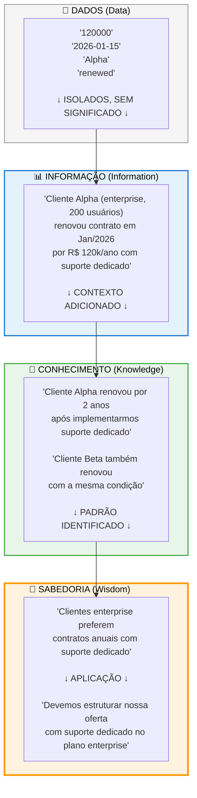

**Como Ler Este Diagrama:**

- **Base (Dados)**: Números e textos isolados, sem significado. São como peças de quebra-cabeça espalhadas.
- **Informação**: Os dados ganham contexto — sabemos *quem*, *quando*, *quanto* e *o que aconteceu*.
- **Conhecimento**: Conectamos informações diferentes e identificamos *causa e efeito* — por que algo aconteceu.
- **Sabedoria (topo)**: Extraímos padrões gerais e decidimos *o que fazer* baseado nesses padrões.

No EKS, o sistema sobe essa pirâmide automaticamente: dados entram, são contextualizados, conectados a outros conhecimentos, e padrões são identificados — transformando informação bruta em inteligência acionável.

---

Para um Enterprise Knowledge System, cada nível dessa hierarquia tem um papel:

| Nível | Onde vive no EKS | Exemplo |
|-------|-------------------|---------|
| **Dados** | Propriedades de nós | `revenue: 1200000` |
| **Informação** | Nós com contexto | `Insight: "Queda de 15% na região Sul"` |
| **Conhecimento** | Conexões entre nós | `Insight --[CAUSADO_POR]--> Evento: "Perda do distribuidor"` |
| **Sabedoria** | Padrões e regras inferidas | `Regra: "Diversificar canais antes de expandir"` |

O Knowledge Graph é particularmente poderoso na camada do **conhecimento**, porque ele formaliza exatamente aquilo que torna informação em conhecimento: as **conexões e o contexto**.

## 2.4 Estruturas de validação e confiabilidade

Nem todo conhecimento tem o mesmo peso. Uma decisão baseada em dados auditados tem mais peso do que uma baseada em uma conversa informal. Um insight validado por três especialistas é mais confiável do que uma impressão de um estagiário.

Em um sistema de conhecimento sério, essa distinção precisa ser **formalizada**. Não basta armazenar informação. É preciso armazenar **o grau de confiança** dessa informação.

Isso se traduz em conceitos como:

- **Proveniência**: de onde veio essa informação? Foi extraída automaticamente de um documento? Foi inserida manualmente por um especialista? Foi inferida por um algoritmo?
- **Trust score**: qual o nível de confiança nessa informação, em uma escala de 0 a 1?
- **Validação humana**: essa informação foi revisada por alguém qualificado?
- **Temporalidade**: quando essa informação foi criada? Quando foi validada pela última vez? Ela tem prazo de validade?

Esses conceitos não são luxo acadêmico. Em um sistema onde agentes de IA geram respostas baseadas no conhecimento armazenado, a diferença entre um trust score de 0.9 e 0.3 pode ser a diferença entre uma resposta útil e uma alucinação perigosa.

## 2.5 A camada epistemológica como fundação de um sistema de conhecimento

A camada epistemológica de um Enterprise Knowledge System é o conjunto de regras e princípios que definem:

1. **O que conta como conhecimento** no contexto da organização
2. **Como o conhecimento é validado** (quem pode validar, quais critérios)
3. **Como o conhecimento envelhece** (quando perde relevância, quando precisa ser revisado)
4. **Como conflitos são resolvidos** (quando duas fontes se contradizem)
5. **Quais são os níveis de confiança** e como são atribuídos

Sem essa camada, um sistema de conhecimento é apenas um banco de dados sofisticado. Com ela, ele se torna um **sistema epistemológico**, capaz de distinguir o que sabe do que acha, o que é certo do que é provável, o que é atual do que é obsoleto.

Essa fundação epistemológica é o que permite, por exemplo, que o sistema diga ao usuário: *"Encontrei essa informação, mas ela foi extraída automaticamente e ainda não foi validada por um humano. O trust score é 0.6."* Em vez de apresentar tudo como verdade absoluta, o sistema pratica uma forma de **humildade epistêmica**: sabe o que sabe, e sabe o que não sabe.

> **Em resumo:** Epistemologia é a disciplina que pergunta "como sabemos o que sabemos?", e essa pergunta é essencial para qualquer sistema de conhecimento corporativo. Sem uma camada epistemológica, o sistema trata toda informação como igualmente verdadeira. Com ela, o sistema sabe distinguir fato de opinião, atual de obsoleto, confiável de duvidoso. Essa fundação (que inclui proveniência, trust score, validação humana e temporalidade) é o que separa um banco de dados inteligente de um verdadeiro sistema de conhecimento.

---

# Capítulo 3: Lógica Formal — A Linguagem por Trás da Estrutura

## 3.1 Por que lógica importa (mesmo para quem não é programador)

Quando falamos em "ontologia formal" ou "raciocínio automatizado", estamos falando, na essência, de **lógica**. Não a lógica do dia a dia ("é lógico que isso não funciona"), mas a lógica como disciplina formal: um sistema de regras que permite derivar conclusões válidas a partir de premissas.

Por que isso importa para um profissional de negócios?

Porque toda vez que você define uma regra de negócio (*"Todo projeto precisa de um responsável"*, *"Um OKR pertence a exatamente um objetivo estratégico"*, *"Nenhum departamento pode ter mais de um diretor"*), você está fazendo lógica formal, mesmo sem saber.

A diferença é que, no contexto de um Enterprise Knowledge System, essas regras não ficam apenas em documentos de política. Elas são **codificadas** no sistema, de modo que violações são detectadas automaticamente e inferências são realizadas de forma consistente.

## 3.0.1 Antes da Formalização: Lógica Como Você Já a Usa

Antes de entrar em símbolos e formalismos, vamos ver como a lógica formal já está presente no seu dia a dia — você apenas não a chama assim. Vamos pegar três situações reais de negócio e mostrar como elas se traduzem para o sistema, passo a passo.

### Exemplo 1: Regra de RH

**Como você fala:**  
*"Todo funcionário com mais de 3 anos de casa tem direito ao benefício de vale-refeição estendido."*

**Tradução passo a passo:**

| O que você quer dizer | Como o sistema entende | O que o sistema faz |
|----------------------|----------------------|---------------------|
| "Todo funcionário" | ∀x: Funcionário(x) | Examina cada pessoa cadastrada como funcionário |
| "com mais de 3 anos" | tempo_casa(x) > 3 | Verifica a propriedade `data_admissão` |
| "tem direito ao benefício" | → tem_benefício(x, "VR_Estendido") | Cria automaticamente a relação se condição for verdadeira |

**Resultado prático:** Se o RH cadastra um novo funcionário com 3 anos e 2 meses, o sistema automaticamente marca que ele tem direito ao benefício. Se tentam cadastrar alguém com 2 anos e 10 meses, o sistema não atribui o benefício (mas pode alertar que falta pouco).

---

### Exemplo 2: Regra de Compliance

**Como você fala:**  
*"Nenhuma decisão financeira acima de R$100k pode ser aprovada sem duas aprovações de diretoria."*

**Tradução passo a passo:**

| O que você quer dizer | Como o sistema entende | O que o sistema faz |
|----------------------|----------------------|---------------------|
| "Nenhuma decisão financeira" | ∀d: Decisão_Financeira(d) | Identifica decisões do tipo "financeira" |
| "acima de R$100k" | valor(d) > 100000 | Verifica a propriedade `valor` |
| "sem duas aprovações" | ¬(∃a1, a2: Aprovação(a1, d) ∧ Aprovação(a2, d) ∧ a1 ≠ a2 ∧ Diretor(a1) ∧ Diretor(a2)) | Conta quantas aprovações de diretores existem |
| "não pode ser aprovada" | → status(d) = "pendente" | Mantém status pendente até que a condição seja satisfeita |

**Resultado prático:** Se alguém tenta aprovar uma decisão de R$150k com apenas uma aprovação, o sistema **bloqueia automaticamente** e exibe: "⚠️ Requer 2 aprovações de diretoria. Atual: 1/2". Quando a segunda aprovação chega, o status muda para "aprovado" automaticamente.

---

### Exemplo 3: Inferência Automática

**Como você fala:**  
*"Se Maria gerencia o Departamento de TI, e o Departamento de TI tem 20 funcionários, então Maria gerencia 20 pessoas."*

**Tradução passo a passo:**

| O que você quer dizer | Como o sistema entende | O que o sistema faz |
|----------------------|----------------------|---------------------|
| "Maria gerencia TI" | gerencia(Maria, Depto_TI) | **Fato** já registrado no grafo |
| "TI tem 20 funcionários" | ∀f: pertence_a(f, Depto_TI) | **Fato** já registrado (20 relações) |
| "Então Maria gerencia 20 pessoas" | gerencia(Maria, Depto_TI) ∧ pertence_a(f, Depto_TI) → gerencia_indireta(Maria, f) | **Inferência** derivada automaticamente |

**Resultado prático:** Ninguém precisa criar manualmente 20 relações "Maria gerencia [Pessoa X]". O sistema **infere** automaticamente que Maria tem responsabilidade indireta sobre essas 20 pessoas. Se você pergunta *"Quantas pessoas Maria gerencia?"*, o sistema responde "20 (indiretamente via Departamento de TI)" — mesmo que você nunca tenha dito isso explicitamente.

---

### A Ponte Para o Formal

Agora que você viu como regras que você já usa se traduzem para o sistema, os próximos passos vão mostrar a "gramática" por trás dessas traduções. Não se assuste com os símbolos — eles são apenas uma forma compacta de escrever exatamente o que você acabou de ler em português.

**Lembre-se:**  
- Símbolos como `∀` (para todo) e `∃` (existe) são apenas abreviações  
- Setas como `→` (se...então) você já usa mentalmente o tempo todo  
- O sistema não "inventa" — ele aplica as regras que *você* definiu  

Vamos agora formalizar essas ideias.

## 3.2 Lógica proposicional: o básico do raciocínio

A lógica proposicional é o nível mais simples. Ela lida com proposições (afirmações que são verdadeiras ou falsas) e com conectivos lógicos:

- **E** (conjunção): "O projeto está ativo **e** tem orçamento aprovado"
- **OU** (disjunção): "O risco é alto **ou** o impacto é crítico"
- **NÃO** (negação): "O documento **não** foi validado"
- **SE...ENTÃO** (implicação): "**Se** o risk score é acima de 0.8, **então** requer aprovação do diretor"

Com esses conectivos simples, já é possível expressar muitas regras de negócio. A lógica proposicional é a base sobre a qual tudo o mais se constrói.

## 3.3 Lógica de predicados — descrevendo o mundo

A lógica de predicados vai além, introduzindo **variáveis**, **predicados** e **quantificadores**:

- **Predicados**: descrevem propriedades ou relações. `É_Gerente(Maria)`, `Pertence_A(Projeto_Alpha, Departamento_TI)`
- **Variáveis**: representam entidades genéricas. `x`, `y`
- **Quantificador universal (∀)**: "para todo". *∀x: Se É_Projeto(x), então Tem_Responsável(x)* — "Todo projeto tem um responsável"
- **Quantificador existencial (∃)**: "existe". *∃x: É_Diretor(x) ∧ Pertence_A(x, Departamento_TI)* — "Existe um diretor no departamento de TI"

Essa linguagem pode parecer distante do cotidiano, mas é exatamente assim que as regras de uma ontologia são definidas internamente. Quando você diz, em linguagem natural, "todo projeto deve estar ligado a pelo menos um OKR", o sistema traduz isso para algo como:

```
∀x: Projeto(x) → ∃y: OKR(y) ∧ Vinculado_A(x, y)
```

Você não precisa escrever essa fórmula. Mas entender que ela existe por trás do sistema ajuda a compreender o que o sistema pode e não pode verificar.

## 3.4 Lógicas descritivas — a base do OWL e das ontologias

As **lógicas descritivas** (Description Logics, ou DL) são uma família de linguagens lógicas que servem como fundamento teórico para o OWL (Web Ontology Language) — a linguagem padrão para definir ontologias na web semântica.

As lógicas descritivas operam com três elementos básicos:

- **Conceitos** (classes): Pessoa, Projeto, Departamento
- **Papéis** (relações): pertence_a, gerencia, é_membro_de
- **Indivíduos** (instâncias): Maria, Projeto_Alpha, Departamento_TI

E permitem construir definições complexas:

- `Gerente ≡ Pessoa ⊓ ∃gerencia.Departamento` — "Um gerente é uma pessoa que gerencia pelo menos um departamento"
- `Projeto_Crítico ≡ Projeto ⊓ ∃tem_risco.(Risco ⊓ ∃tem_score.≥0.8)` — "Um projeto crítico é um projeto que tem pelo menos um risco com score acima de 0.8"

O poder das lógicas descritivas é que elas são **decidíveis** — existem algoritmos que podem verificar automaticamente se um conjunto de afirmações é consistente, se uma instância pertence a uma classe, ou se uma conclusão é logicamente válida.

Isso é o que permite que um sistema ontológico faça **inferência**: descobrir fatos novos a partir de fatos conhecidos, sem que alguém precise declarar explicitamente cada relação.

## 3.5 Como a lógica se traduz em regras de negócio

Na prática, a lógica formal se manifesta em um Enterprise Knowledge System de várias formas:

| Regra de negócio | Tradução lógica | O que o sistema faz |
|------------------|-----------------|---------------------|
| "Todo projeto tem um responsável" | ∀x: Projeto(x) → ∃y: responsável(x,y) | Alerta se um projeto é criado sem responsável |
| "Um OKR pertence a exatamente um objetivo" | Cardinalidade = 1 na relação | Impede que um OKR seja ligado a dois objetivos |
| "Decisões precisam de justificativa" | Propriedade obrigatória | Valida que o campo `rationale` está preenchido |
| "Tarefas atrasadas geram alerta" | Se status ≠ concluído ∧ data > due_date | Inferência automática de estado |

O profissional de negócios não precisa pensar em lógica formal. Mas o arquiteto do sistema precisa — porque é a lógica formal que garante que as regras de negócio são implementadas de forma **consistente, verificável e automatizável**.

> **Em resumo:** A lógica formal é a gramática invisível que permite a um sistema de conhecimento raciocinar com rigor. Assim como uma linguagem precisa de regras gramaticais para ser compreendida, um EKS precisa de lógica formal para garantir que suas regras de negócio sejam consistentes, verificáveis e automatizáveis. Na prática, isso significa que o sistema pode detectar contradições, validar dados automaticamente e derivar conclusões — tudo sem intervenção humana.

---

# Capítulo 4: Representação do Conhecimento — Dos Modelos Mentais à Formalização

## 4.1 Modelos baseados em regras

Os primeiros sistemas de inteligência artificial, nas décadas de 1970 e 1980, tentaram representar conhecimento humano na forma de regras **SE-ENTÃO** (sistemas especialistas):

```
SE temperatura > 38°C E dor_de_cabeça = sim
ENTÃO diagnóstico = possível_infecção
```

Esse modelo funciona bem para domínios estreitos e bem definidos. Mas rapidamente se torna ingerenciável quando o domínio é amplo, as regras se multiplicam, e exceções aparecem. Um sistema com milhares de regras IF-THEN é difícil de manter, difícil de debugar, e frágil diante de situações não previstas.

A principal lição dos sistemas baseados em regras: **representar conhecimento não é apenas listar regras — é estruturar um modelo do mundo.**

## 4.2 Redes semânticas — o conhecimento como rede

As redes semânticas, propostas nos anos 1960, trouxeram uma ideia revolucionária: representar conhecimento como um **grafo** de nós (conceitos) e arestas (relações).

```
[Cachorro] --é_um--> [Animal]
[Cachorro] --tem--> [Patas]
[Rex] --é_instância_de--> [Cachorro]
```

Essa representação é intuitiva — espelha como pensamos naturalmente. Organizamos conhecimento em categorias, fazemos associações, navegamos por relações. As redes semânticas são ancestrais diretas dos Knowledge Graphs modernos.

A limitação? Falta de formalismo. Em uma rede semântica básica, não há regras claras sobre o que cada tipo de relação significa, quais são obrigatórias, ou quais inferências são válidas. É uma estrutura expressiva, mas imprecisa.

## 4.3 Frames — estruturas de expectativa

Os frames, propostos por Marvin Minsky em 1975, organizam conhecimento em **estruturas tipadas** com slots (propriedades) e valores padrão:

```
Frame: Reunião
  - Tipo: [Presencial, Virtual, Híbrida]
  - Participantes: [lista de Pessoas]
  - Data: [data]
  - Pauta: [texto]
  - Decisões: [lista de Decisões]
  - Valor padrão para Tipo: Virtual
```

Os frames são poderosos porque capturam **expectativas**: quando você pensa em "reunião", já tem uma estrutura mental do que esperar. Os frames formalizam isso. São ancestrais diretos dos schemas de banco de dados e das classes em programação orientada a objetos.

## 4.4 Ontologias como evolução natural da representação

As ontologias combinam o melhor de todas essas abordagens:

- **Das regras**: a capacidade de expressar restrições e condições
- **Das redes semânticas**: a representação como grafo de conceitos conectados
- **Dos frames**: a estruturação tipada com propriedades e valores

Mas adicionam algo que nenhuma dessas abordagens tinha de forma completa: **semântica formal**. Uma ontologia não é apenas um desenho de caixas e flechas — é uma especificação formal que pode ser processada por máquinas, verificada por algoritmos, e usada para inferência automática.

Uma ontologia define:

- **Classes**: os tipos de coisas que existem no domínio (Pessoa, Projeto, Decisão)
- **Propriedades**: as características dessas coisas (nome, data, status)
- **Relações**: como as coisas se conectam (pertence_a, gerencia, extraído_de)
- **Axiomas**: as regras que governam essas conexões (todo projeto tem um responsável)
- **Restrições**: os limites do que é válido (um OKR pertence a exatamente um objetivo)

## 4.5 O momento em que representar se torna operar

Existe um ponto de inflexão na jornada de gestão do conhecimento. É o momento em que a representação deixa de ser um exercício teórico e se torna **operacional**.

Esse momento acontece quando:

1. A ontologia não é apenas um diagrama em um documento — ela está **implementada** em um banco de dados de grafos.
2. As relações não são apenas flechas em um quadro branco — elas são **consultas** que retornam respostas.
3. As restrições não são apenas políticas escritas — elas são **validações** que o sistema executa automaticamente.
4. As inferências não são apenas raciocínios humanos — elas são **derivadas** pelo sistema a partir de regras lógicas.

É nesse ponto que um modelo de conhecimento se transforma em um **Enterprise Knowledge System**. E é para esse ponto que este livro está te levando.

Nos próximos capítulos, vamos mergulhar nos detalhes: como construir uma ontologia formal, quais linguagens usar, como validá-la, e como operacionalizá-la em um Knowledge Graph vivo.

> **Em resumo:** Representar conhecimento é dar forma ao que sabemos. Das regras SE-ENTÃO dos anos 1970 às redes semânticas e frames, cada abordagem trouxe avanços. As ontologias combinam o melhor de todas: a capacidade de expressar restrições, a representação como grafo e a estruturação tipada — tudo com semântica formal que permite processamento por máquinas. O ponto de inflexão acontece quando a representação deixa de ser teórica e se torna operacional: ontologia implementada no grafo, relações como consultas, restrições como validações automáticas.

---

# PARTE II: ONTOLOGIAS — DANDO FORMA AO CONHECIMENTO

---

# Capítulo 5: Taxonomia, Ontologia e Knowledge Graph — Entendendo as Diferenças

## 5.1 Taxonomia — classificar é o primeiro passo

Uma **taxonomia** é uma estrutura hierárquica de classificação. É o modelo mais simples de organização do conhecimento: categorias e subcategorias.

```
Organização
├── Departamentos
│   ├── Tecnologia
│   ├── Comercial
│   └── Financeiro
├── Projetos
│   ├── Internos
│   └── Externos
└── Pessoas
    ├── Colaboradores
    ├── Gestores
    └── Diretores
```

Taxonomias são úteis. Elas criam ordem onde havia caos. Todo sistema de pastas, todo menu de navegação, toda classificação de produtos é uma taxonomia.

Mas taxonomias têm uma limitação fundamental: elas só expressam **relações hierárquicas** (é-um, pertence-a). No mundo real, as relações entre conceitos são muito mais ricas do que "A é subcategoria de B".

Uma pessoa *pertence a* um departamento, mas também *gerencia* projetos, *participa de* reuniões, *é responsável por* decisões, e *possui* competências. Uma taxonomia não captura nada disso.

## 5.2 Ontologia — estruturar é o segundo

Uma **ontologia** vai além da taxonomia porque define não apenas a hierarquia de classes, mas também:

- **Relações arbitrárias** entre classes (não apenas "é-um")
- **Propriedades** de cada classe (atributos e seus tipos)
- **Restrições** (cardinalidade, domínio, alcance)
- **Axiomas** (regras lógicas que devem ser verdadeiras)

Enquanto uma taxonomia diz "Gerente é um tipo de Pessoa", uma ontologia diz:

- Gerente é uma Pessoa
- Gerente gerencia exatamente um Departamento
- Gerente pode ter zero ou mais Subordinados diretos
- Se uma Pessoa gerencia um Departamento, ela pertence a esse Departamento
- Gerente é uma subclasse de Colaborador (herança)

Essa riqueza expressiva é o que torna ontologias adequadas para modelar domínios complexos como organizações, sistemas de saúde, cadeias de suprimentos, ou — no nosso caso — sistemas de conhecimento corporativo.

## 5.3 Knowledge Graph — conectar é o objetivo

Um **Knowledge Graph** é a materialização de uma ontologia em dados reais. Se a ontologia é o *schema* (a estrutura), o Knowledge Graph é a *instância* (os dados populados).

```
Ontologia (schema):
  Classe: Pessoa
  Classe: Departamento
  Relação: PERTENCE_A (Pessoa → Departamento)

Knowledge Graph (dados):
  (Maria) --[PERTENCE_A]--> (Departamento de TI)
  (João) --[PERTENCE_A]--> (Departamento Comercial)
  (Maria) --[GERENCIA]--> (Projeto Alpha)
  (Projeto Alpha) --[CONECTADO_A]--> (OKR: Crescimento Q1)
```

O Knowledge Graph é onde o conhecimento vive de fato. É navegável, consultável, e — fundamentalmente — **conectado**. Cada nó conhece seus vizinhos. Cada relação carrega significado. O todo é maior que a soma das partes.

| Conceito | O que define | Analogia |
|----------|-------------|----------|
| **Taxonomia** | Hierarquia de categorias | Índice de um livro |
| **Ontologia** | Estrutura formal com classes, relações e regras | Gramática de um idioma |
| **Knowledge Graph** | Dados reais conectados seguindo a ontologia | Texto escrito nesse idioma |

## 5.4 Classes, instâncias, relações, axiomas e restrições

Vamos definir cada elemento formalmente:

**Classes** são os tipos de entidades no seu domínio. No contexto organizacional: `Pessoa`, `Departamento`, `Projeto`, `Reunião`, `Decisão`, `OKR`, `Risco`, `Tarefa`. Cada classe define um conceito abstrato.

**Instâncias** (ou indivíduos) são entidades concretas que pertencem a uma classe. `Maria Costa` é uma instância de `Pessoa`. `Projeto Alpha` é uma instância de `Projeto`.

**Relações** (ou propriedades de objeto) conectam instâncias entre si. `Maria --[GERENCIA]--> Projeto Alpha`. Cada relação tem um tipo, e cada tipo tem um domínio (de onde parte) e um alcance (para onde vai).

**Axiomas** são afirmações que são sempre verdadeiras no domínio. "Todo projeto tem exatamente um responsável" é um axioma. "Se uma pessoa gerencia um departamento, então ela pertence a esse departamento" é um axioma. Axiomas permitem inferência automática.

**Restrições** limitam o que é válido. "Um OKR pertence a no máximo um objetivo" (restrição de cardinalidade máxima). "A propriedade `status` de uma Tarefa aceita apenas os valores: pendente, em_progresso, concluída, cancelada" (restrição de valor).

## 5.5 Herança: como o conhecimento se propaga na estrutura

Uma das propriedades mais poderosas das ontologias é a **herança**. Se `Gerente` é subclasse de `Pessoa`, então tudo o que é verdade sobre `Pessoa` é automaticamente verdade sobre `Gerente` — sem precisar redeclarar.

Se `Pessoa` tem as propriedades `nome`, `email`, `departamento`, então `Gerente` herda automaticamente todas essas propriedades — e pode adicionar as suas próprias, como `departamento_gerenciado` ou `orçamento_aprovado`.

A herança permite construir ontologias **modulares e extensíveis**: você define o geral uma vez e especializa conforme necessário, sem duplicação.

> **Em resumo:** Taxonomia, ontologia e knowledge graph são três níveis crescentes de sofisticação na organização do conhecimento. Taxonomia classifica (pastas de um arquivo). Ontologia define tipos, propriedades, relações e regras (o dicionário completo do domínio). Knowledge Graph implementa essa ontologia em um banco de dados, criando uma rede navegável e consultável. Cada nível adiciona capacidades — e é a combinação dos três que torna possível um sistema que realmente "entende" o negócio.

---

# Capítulo 6: A Linguagem das Ontologias — OWL, RDF(S) e SKOS

Imagine que você está construindo um dicionário muito especial para a sua empresa. Esse dicionário não define apenas palavras — ele define *coisas* (pessoas, projetos, decisões), *propriedades* dessas coisas (nome, data, status), e *regras* sobre como essas coisas se relacionam (todo projeto tem um responsável). As linguagens que veremos neste capítulo — RDF, OWL, SKOS — são os "idiomas" nos quais esses dicionários corporativos são escritos. Cada uma tem um nível diferente de sofisticação, e juntas formam a base sobre a qual sistemas de conhecimento são construídos.

## 6.0.1 Mapa das Linguagens Ontológicas: Quando Usar Cada Uma

Antes de entrar nos detalhes de cada linguagem, vamos criar um mapa mental que mostra como elas se relacionam. Pense nelas como camadas de um bolo: cada camada adiciona funcionalidades sobre a anterior.

### Arquitetura das Linguagens Ontológicas

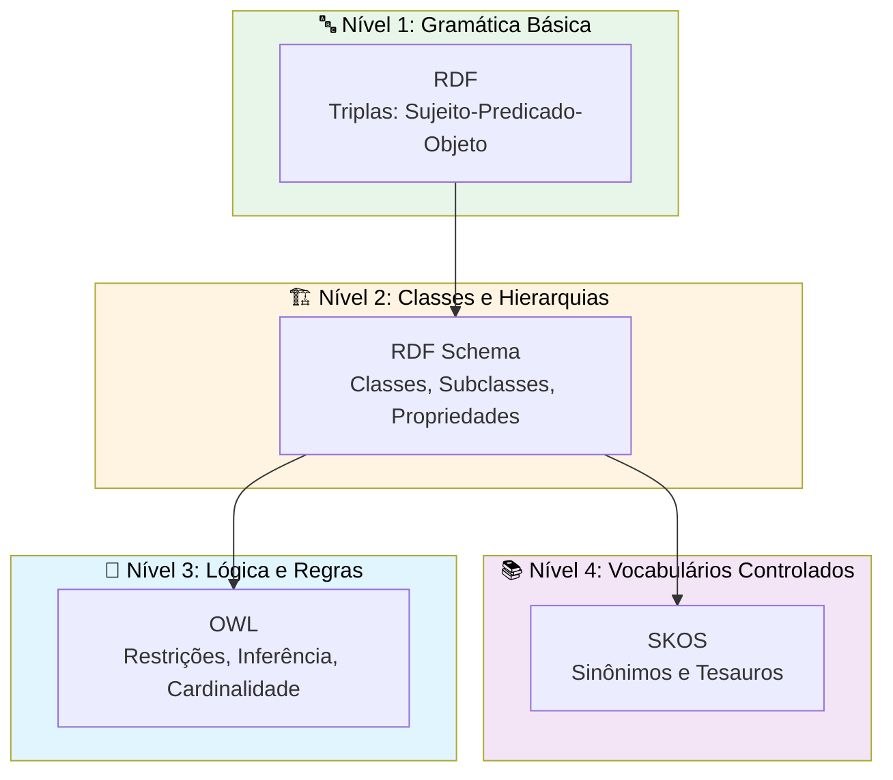

### Quando Usar Cada Linguagem

| Linguagem | Use Para | Exemplo Prático | Quando NÃO Usar |
|-----------|----------|-----------------|-----------------|
| **RDF** | Representar fatos simples como triplas | `(Rodrigo) --trabalha_para--> (CoCreateAI)` | Quando precisar de hierarquias ou regras |
| **RDFS** | Organizar conceitos em hierarquias | `Gerente é um tipo de Pessoa` | Quando precisar de lógica (ex: "exatamente 1") |
| **OWL** | Expressar regras de negócio formais | `Todo Projeto deve ter exatamente 1 responsável` | Para vocabulários simples sem lógica |
| **SKOS** | Lidar com sinônimos e termos equivalentes | `"CEO" = "Chief Executive Officer" = "Presidente"` | Para lógica formal ou inferência |

### A Mesma Informação em Cada Nível

Para entender a progressão, vamos representar o **mesmo conhecimento** em cada nível:

**Informação:** *"Maria é gerente do Departamento de TI"*

**Nível 1 - RDF (Tripla Básica):**
```
(Maria) --tem_cargo--> "Gerente"
(Maria) --trabalha_em--> (Departamento_TI)
```
✅ Representa o fato  
❌ Não sabe que "Gerente" é um tipo especial de pessoa  
❌ Não valida se todo gerente deve ter um departamento

**Nível 2 - RDFS (Com Hierarquia):**
```
Gerente subclasse_de Pessoa
(Maria) tipo Gerente
(Maria) --trabalha_em--> (Departamento_TI)
```
✅ Representa o fato  
✅ Sabe que Gerente é um tipo de Pessoa  
❌ Não valida cardinalidade (Maria pode gerenciar 0, 1 ou 100 departamentos)

**Nível 3 - OWL (Com Regras):**
```
Gerente subclasse_de Pessoa
Gerente deve ter exatamente_1 relação "gerencia" com Departamento
(Maria) tipo Gerente
(Maria) --gerencia--> (Departamento_TI)
```
✅ Representa o fato  
✅ Sabe que Gerente é um tipo de Pessoa  
✅ Valida que Maria gerencia exatamente um departamento  
✅ Infere que Maria pertence ao Departamento_TI (se houver regra)

**Nível 4 - SKOS (Vocabulários):**
```
conceito: "Gerente"
  prefLabel: "Gerente"
  altLabel: "Manager", "Gestor", "Responsável"
  broader: "Liderança"
  narrower: "Gerente Sênior", "Gerente Júnior"
```
✅ Organiza termos e sinônimos  
❌ Não faz inferência lógica  
❌ Foco em navegação, não em validação

### Guia de Decisão Rápido

**Pergunta 1:** Você precisa apenas registrar fatos simples?  
→ **RDF** é suficiente

**Pergunta 2:** Você precisa organizar conceitos em categorias (is-a)?  
→ **RDFS** resolve

**Pergunta 3:** Você precisa expressar regras de negócio ("todo X deve ter Y")?  
→ **OWL** é necessário

**Pergunta 4:** Você precisa lidar com múltiplos nomes para a mesma coisa?  
→ **SKOS** complementa qualquer um dos anteriores

### Na Prática: Combinação de Linguagens

Um EKS real **combina** múltiplas linguagens:

- **RDF**: Para toda a base de triplas
- **RDFS**: Para hierarquias de classes (Pessoa → Gerente → Gerente_Sênior)
- **OWL**: Para regras críticas de negócio (validações, cardinalidades, inferências)
- **SKOS**: Para lidar com aliases e termos equivalentes ("AWS" = "Amazon Web Services")

Agora que você tem o mapa completo, vamos detalhar cada linguagem.

## 6.1 O modelo de tripla — sujeito, predicado, objeto

No coração de todas as linguagens de ontologia está o **modelo de tripla**: a ideia de que qualquer fato pode ser expresso como três elementos — como uma frase simples com sujeito, verbo e complemento.

```
(Sujeito) --[Predicado]--> (Objeto)
```

Exemplos:

- `(Maria) --[pertence_a]--> (Departamento TI)`
- `(Projeto Alpha) --[tem_status]--> ("Ativo")`
- `(Reunião Jan 2026) --[participou]--> (Maria)`

Cada tripla é uma afirmação atômica — a menor unidade de conhecimento. Um Knowledge Graph inteiro é um conjunto de triplas. Milhares, milhões de afirmações simples que, juntas, descrevem um domínio complexo.

A beleza do modelo de tripla é sua **simplicidade e universalidade**. Qualquer fato pode ser decomposto em triplas. Qualquer domínio pode ser modelado como um conjunto de triplas. E triplas podem ser combinadas, consultadas, inferidas e versionadas.

## 6.2 RDF e RDF Schema — os tijolos básicos

O **RDF** (Resource Description Framework) é o padrão W3C para representar informação na forma de triplas. É a linguagem mais básica da web semântica.

O **RDF Schema** (RDFS) adiciona vocabulário para definir classes e hierarquias:

- `rdfs:Class` — define uma classe
- `rdfs:subClassOf` — define hierarquia ("Gerente é subclasse de Pessoa")
- `rdfs:domain` — define o domínio de uma propriedade
- `rdfs:range` — define o alcance de uma propriedade

Com RDFS, já é possível criar ontologias simples. Mas a expressividade é limitada — não há como definir cardinalidade, restrições complexas, ou classes definidas por condições.

## 6.3 OWL — a potência das ontologias formais

Se o RDF é como aprender a fazer frases simples em um idioma novo, o OWL é como dominar a gramática completa — incluindo regras, exceções e nuances que permitem expressar ideias sofisticadas.

O **OWL** (Web Ontology Language) é onde a ontologia ganha poder real. Construído sobre RDF, o OWL adiciona:

- **Restrições de cardinalidade**: "exatamente 1", "no mínimo 2", "no máximo 5"
- **Classes definidas**: `Projeto_Crítico ≡ Projeto ⊓ ∃tem_risco.Risco_Alto`
- **Propriedades inversas**: se `gerencia` vai de Pessoa para Departamento, `é_gerenciado_por` vai de Departamento para Pessoa
- **Propriedades transitivas**: se A `é_parte_de` B, e B `é_parte_de` C, então A `é_parte_de` C
- **Disjunção de classes**: Pessoa e Departamento são classes disjuntas (nenhuma instância pode ser ambas)
- **Equivalência**: duas classes podem ser declaradas equivalentes

O OWL existe em três perfis de expressividade:

| Perfil | Expressividade | Uso típico |
|--------|---------------|------------|
| **OWL Lite** | Básica | Taxonomias com restrições simples |
| **OWL DL** | Alta | Ontologias corporativas completas |
| **OWL Full** | Máxima | Pesquisa acadêmica (decidibilidade não garantida) |

Para a maioria dos projetos corporativos, **OWL DL** oferece o equilíbrio ideal entre expressividade e computabilidade.

## 6.4 SKOS — vocabulários controlados

O **SKOS** (Simple Knowledge Organization System) não é uma linguagem de ontologia no sentido formal, mas é extremamente útil para representar **tesauros** e **vocabulários controlados**.

Enquanto OWL define classes e relações lógicas, SKOS define **conceitos** e suas relações semânticas:

- `skos:broader` — conceito mais amplo ("Marketing Digital" é mais amplo que "SEO")
- `skos:narrower` — conceito mais específico
- `skos:related` — conceito relacionado
- `skos:altLabel` — rótulo alternativo (sinônimo)
- `skos:prefLabel` — rótulo preferido

Em um EKS, SKOS é particularmente útil para lidar com o problema de **aliases** — quando a mesma coisa é referenciada por nomes diferentes ("AWS", "Amazon Web Services", "aws").

## 6.5 Propriedades de objeto vs propriedades de dado

Uma distinção fundamental em OWL:

**Propriedades de objeto** (Object Properties) conectam instâncias a outras instâncias:
- `pertence_a` (Pessoa → Departamento)
- `gerencia` (Pessoa → Projeto)
- `extraído_de` (Decisão → Reunião)

**Propriedades de dado** (Datatype Properties) conectam instâncias a valores literais:
- `nome` (Pessoa → String)
- `data_criação` (Projeto → Date)
- `trust_score` (Conhecimento → Float)

Essa distinção parece simples, mas é crucial para a modelagem: propriedades de objeto criam **conexões navegáveis** no grafo, enquanto propriedades de dado armazenam **atributos**. Um Knowledge Graph rico tem muitas propriedades de objeto — são elas que dão ao grafo sua capacidade de responder perguntas complexas.

## 6.6 Domínio, alcance e cardinalidade

Três conceitos que garantem a **integridade** de uma ontologia:

**Domínio** (domain): de que tipo de entidade parte a relação.  
*A propriedade `gerencia` tem domínio `Pessoa`* — só pessoas podem gerenciar.

**Alcance** (range): para que tipo de entidade a relação aponta.  
*A propriedade `gerencia` tem alcance `Departamento`* — só departamentos podem ser gerenciados (neste contexto).

**Cardinalidade**: quantas vezes a relação pode ocorrer.
- `min 1` — obrigatória (todo projeto tem pelo menos um membro)
- `max 1` — única (cada OKR pertence a exatamente um objetivo)
- `exactly 1` — exatamente uma ocorrência
- Sem restrição — livre (uma pessoa pode participar de qualquer número de reuniões)

Quando essas regras são definidas na ontologia, o sistema pode **validar automaticamente** os dados: se alguém tentar criar um projeto sem responsável, o sistema detecta a violação.

## 6.7 Inferência — quando o sistema descobre sozinho

Um dos recursos mais poderosos de ontologias formais é a **inferência**: a capacidade de derivar novos fatos a partir de fatos conhecidos e regras definidas.

Exemplo:

- **Fato**: Maria gerencia o Departamento de TI
- **Regra**: Se uma pessoa gerencia um departamento, ela pertence a esse departamento
- **Inferência**: Maria pertence ao Departamento de TI ✓

Outro exemplo mais sofisticado:

- **Fato**: Projeto Alpha tem um risco com score 0.9
- **Definição**: Projeto_Crítico ≡ Projeto com pelo menos um risco com score > 0.8
- **Inferência**: Projeto Alpha é um Projeto_Crítico ✓

A inferência elimina a necessidade de declarar explicitamente tudo o que é verdade no sistema. Basta declarar os fatos fundamentais e as regras — o resto é derivado automaticamente.

Em um EKS, inferência é o que permite perguntas como *"Quais projetos críticos estão no departamento da Maria?"* — mesmo que ninguém nunca tenha explicitamente classificado projetos como críticos ou associado Maria ao departamento. O sistema infere.

> **Em resumo:** OWL, RDF(S) e SKOS são os "idiomas" nos quais ontologias são escritas. RDF fornece a gramática básica (triplas sujeito-predicado-objeto), OWL adiciona expressividade avançada (restrições, cardinalidade, equivalências), e SKOS oferece vocabulários controlados para quando a formalidade total não é necessária. Reasoners são os "motores de inferência" que derivam conclusões automaticamente a partir dos fatos e regras declarados. Juntas, essas tecnologias permitem que o conhecimento organizacional seja não apenas armazenado, mas compreendido e raciocinado por máquinas.

---

# Capítulo 7: Validação e Consistência Ontológica

## 7.1 O que significa uma ontologia "saudável"

Uma ontologia saudável é aquela que é:

- **Conectada**: as entidades relevantes estão ligadas de forma significativa
- **Equilibrada**: sem concentração excessiva em poucos nós (supernós problemáticos)
- **Consistente**: não contém contradições lógicas
- **Manutenível**: pode evoluir sem quebrar o que já existe

Medir a saúde de uma ontologia não é subjetivo — existem métricas concretas:

| Métrica | O que mede | Valor saudável |
|---------|-----------|----------------|
| **R/N** (Relationships/Nodes) | Densidade do grafo | 1-3 para grafos corporativos |
| **p50 (mediana do grau)** | Conexões típicas | 2-4 |
| **p90 (percentil 90)** | Presença de hubs | < 5x a mediana |
| **% nós órfãos** | Nós sem conexão | < 10% |
| **Trust score médio** | Confiabilidade geral | > 0.6 |

Essas métricas não são teóricas — são medidas que podem ser calculadas diretamente a partir do Knowledge Graph em produção.

## 7.2 SHACL — validação de formas

Pense no SHACL como um "checklist de qualidade" para o seu grafo de conhecimento. Assim como um formulário online impede que você envie um cadastro sem preencher o e-mail, o SHACL impede que o sistema aceite dados incompletos ou malformados.

O **SHACL** (Shapes Constraint Language) é o padrão W3C para validar grafos RDF. Enquanto OWL define o que *pode* existir, SHACL define o que *deve* existir.

SHACL funciona através de **shapes** (formas) — templates que definem como os dados devem ser:

```
shape:ProjetoShape
  - targetClass: Projeto
  - propriedade: nome (obrigatório, string, mínimo 3 caracteres)
  - propriedade: status (obrigatório, valores: ativo/pausado/concluído)
  - propriedade: responsável (obrigatório, mínimo 1, tipo: Pessoa)
  - propriedade: data_início (obrigatório, tipo: data)
```

Quando dados são inseridos ou modificados, SHACL verifica se eles respeitam a shape correspondente. Violações são reportadas com detalhes: qual nó, qual propriedade, qual restrição foi violada.

É o equivalente ontológico da **validação de formulário** — mas aplicado à estrutura do conhecimento inteiro.

## 7.3 Consistência lógica — contradições que quebram tudo

Uma ontologia é **inconsistente** quando contém contradições lógicas. Por exemplo:

- Declarar que Pessoa e Departamento são classes disjuntas
- E depois criar uma instância que é simultaneamente Pessoa e Departamento

Em uma ontologia inconsistente, **qualquer conclusão pode ser derivada** (princípio da explosão). Isso torna a inferência inútil — o sistema pode "provar" qualquer coisa, verdadeira ou falsa.

Ferramentas chamadas **reasoners** (raciocinadores) verificam automaticamente a consistência de uma ontologia. Os mais conhecidos são Pellet, HermiT e ELK. Eles são o equivalente ontológico de um compilador que verifica erros antes de o programa rodar.

## 7.4 Verificação de integridade semântica

Além da consistência lógica pura, existe a **integridade semântica** — verificar se a ontologia faz sentido no domínio.

Perguntas de integridade:

- Existem classes sem instâncias? (classes inúteis)
- Existem propriedades nunca usadas? (excesso de modelagem)
- Existem ciclos indesejados? (A é_parte_de B, B é_parte_de A)
- Existem relações ambíguas? (uso excessivo de `RELATED_TO` genérico)
- A hierarquia faz sentido? (subclasses são realmente especializações?)

Essa verificação é parcialmente automatizável, mas frequentemente requer **revisão humana** — o curador ontológico que entende do domínio e pode dizer: "essa relação não faz sentido no nosso contexto".

## 7.5 Convenções de nomenclatura que salvam projetos

Um aspecto prático mas crucial: como nomear coisas.

| Elemento | Convenção | Exemplo |
|----------|-----------|---------|
| Classes (Labels) | `PascalCase` | `ExternalParticipant` |
| Relações (Relationships) | `UPPER_SNAKE_CASE` | `BELONGS_TO_OBJECTIVE` |
| Propriedades | `snake_case` | `created_at`, `trust_score` |
| Instâncias | Nome natural | `"Rodrigo Trindade"`, `"Projeto Alpha"` |

Parecem detalhes menores, mas em um grafo com milhares de entidades, convenções inconsistentes geram confusão, erros de consulta e dificuldade de manutenção. Defina as convenções no início e aplique-as rigorosamente.

> **Em resumo:** Validação é o que garante que uma ontologia funciona na prática. SHACL atua como um "inspetor de qualidade" que verifica se os dados seguem as regras definidas — campos obrigatórios, formatos corretos, relações válidas. As métricas de saúde (razão R/N, grau médio, nós órfãos) funcionam como um "exame de saúde" do grafo. E convenções de nomenclatura consistentes são a base para que tudo funcione sem confusão. Sem validação, a ontologia degenera rapidamente conforme dados reais são inseridos.

---

# Capítulo 8: Ontology Design Patterns — Soluções para Problemas Recorrentes

## 8.1 O que são design patterns ontológicos

Assim como na engenharia de software, a engenharia de ontologias possui **padrões de design** — soluções testadas e reutilizáveis para problemas de modelagem recorrentes.

Design patterns ontológicos economizam tempo, evitam erros comuns, e produzem ontologias mais consistentes e interoperáveis. Não é preciso reinventar a roda cada vez que você precisa modelar papéis, eventos ou composição.

## 8.2 Part-of — representando composição

O pattern **Part-of** (parte-de) modela relações de composição:

```
(Organização) --[TEM_DEPARTAMENTO]--> (Departamento)
(Departamento) --[TEM_EQUIPE]--> (Equipe)
(Documento) --[TEM_SEÇÃO]--> (Seção)
(Reunião) --[TEM_PAUTA]--> (Item de Pauta)
```

Propriedades importantes desse pattern:

- **Transitividade**: se A é parte de B, e B é parte de C, então A é parte de C? (Nem sempre — depende do domínio)
- **Exclusividade**: uma parte pode pertencer a mais de um todo? (Uma pessoa pode pertencer a mais de um departamento?)
- **Essencialidade**: o todo pode existir sem a parte? (O departamento pode existir sem equipes?)

## 8.3 Agent-role — pessoas e seus papéis

O pattern **Agent-Role** separa a entidade (a pessoa) do papel que ela desempenha:

```
(Maria) --[TEM_PAPEL]--> (Papel: Gerente de Projeto)
(Papel: Gerente de Projeto) --[NO_CONTEXTO_DE]--> (Projeto Alpha)
(Papel: Gerente de Projeto) --[VIGÊNCIA]--> (Jan 2026 - presente)
```

Por que não simplesmente dizer `Maria --[GERENCIA]--> Projeto Alpha`?

Porque a relação direta perde informação temporal e contextual. Maria pode ter sido gerente do Projeto Alpha de janeiro a março, e depois ter assumido outro papel. O pattern Agent-Role captura essa dinâmica sem perder histórico.

Esse pattern é especialmente relevante em organizações onde pessoas mudam frequentemente de papel, acumulam funções, ou desempenham papéis diferentes em contextos diferentes.

## 8.4 Event — o que aconteceu, quando e com quem

O pattern **Event** modela acontecimentos com participantes, tempo e resultado:

```
(Evento: Reunião de Review)
  --[OCORREU_EM]--> (Data: 2026-01-15)
  --[LOCAL]--> (Sala Virtual Zoom)
  --[PARTICIPOU]--> (Maria, João, Pedro)
  --[RESULTOU_EM]--> (Decisão: Pausar Projeto Beta)
  --[GEROU]--> (Tarefa: Realocar orçamento)
```

O pattern Event é fundamental para **memória episódica** — a capacidade do sistema de responder perguntas como "O que aconteceu na última reunião de review?" ou "Quais decisões foram tomadas no primeiro trimestre?".

## 8.5 Temporal patterns — o tempo como dimensão do conhecimento

O tempo é talvez a dimensão mais negligenciada em sistemas de conhecimento, e uma das mais importantes. Patterns temporais capturam:

**Estado vs evento**: um estado é contínuo ("Maria é gerente"), um evento é pontual ("Maria foi promovida em janeiro"). Ambos precisam ser modelados, mas de formas diferentes.

**Bitemporal**: dois eixos temporais distintos:
- **Tempo de validade**: quando o fato era verdadeiro no mundo real
- **Tempo de registro**: quando o fato foi registrado no sistema

Por que isso importa? Porque você pode registrar hoje que uma decisão foi tomada na semana passada. O tempo de validade é a semana passada; o tempo de registro é hoje. Sem bitemporalidade, você perde essa distinção.

**Freshness decay**: o conhecimento envelhece. Uma análise de mercado de dois anos atrás tem menos relevância que uma de ontem. O pattern de freshness decay modela essa perda gradual de relevância.

## 8.6 Aplicando patterns a um domínio real

Na prática, uma ontologia corporativa combina múltiplos patterns simultaneamente:

```
(Organização: CoCreateAI)
  --[TEM_DEPARTAMENTO]--> (Departamento: Tecnologia)        [Part-of]
  
(Maria: Pessoa)
  --[TEM_PAPEL]--> (Papel: Diretora de Tecnologia)          [Agent-Role]
  --[NO_CONTEXTO]--> (Departamento: Tecnologia)
  
(Reunião de Kickoff: Evento)                                  [Event]
  --[PARTICIPOU]--> (Maria, João)
  --[RESULTOU_EM]--> (Decisão: Adotar Neo4j)
  
(Decisão: Adotar Neo4j)
  --[VÁLIDA_DESDE]--> (2026-01-15)                           [Temporal]
  --[REGISTRADA_EM]--> (2026-01-16)
  --[TRUST_SCORE]--> (0.95)
  --[CONECTADA_A]--> (Objetivo: Modernização tecnológica)
```

A combinação de patterns cria uma representação rica, navegável e formalmente válida do domínio organizacional. Cada fato está conectado, contextualizado, e rastreável.

> **Em resumo:** Design patterns ontológicos são soluções testadas para problemas recorrentes de modelagem — assim como design patterns em engenharia de software. Os principais padrões (Agent-Role, Part-of, Event, Temporal/Bitemporalidade e Freshness Decay) resolvem desafios comuns como "uma pessoa pode ter múltiplos papéis", "partes compõem um todo" e "o conhecimento envelhece". Na prática, uma ontologia corporativa combina múltiplos patterns simultaneamente, criando uma representação onde cada fato está conectado, contextualizado e rastreável.

---

# PARTE III: KNOWLEDGE GRAPH CORPORATIVO — O SISTEMA VIVO

> *Na Parte II, aprendemos a criar o vocabulário formal para descrever o conhecimento — as ontologias. Agora, vamos dar vida a esse vocabulário. Um Knowledge Graph corporativo não é um arquivo estático: é um sistema vivo que cresce, envelhece e precisa de cuidado, assim como um jardim. Nesta parte, veremos como projetá-lo, alimentá-lo e mantê-lo saudável.*

---

# Capítulo 9: Arquitetura Conceitual — As Três Camadas do EKS

## 9.0 Uma analogia: a biblioteca, os catálogos e os livros

Antes de entrar na arquitetura técnica, imagine uma biblioteca pública bem organizada:

- **Os leitores** chegam e fazem perguntas ao balcão: "Quero livros sobre história do Brasil". Eles não precisam saber como os livros estão organizados nos bastidores — eles apenas interagem com o sistema de consulta. Essa é a **camada externa**.
- **O catálogo da biblioteca** — o sistema de classificação Dewey, as fichas catalográficas — organiza *logicamente* todo o acervo: quais categorias existem, como os livros se relacionam, quais são as regras de catalogação. Essa é a **camada conceitual**.
- **As estantes físicas**, os depósitos, a forma como os livros estão armazenados no espaço — essa é a **camada interna**.

Se a biblioteca decidir mudar do sistema Dewey para outro sistema de classificação, os leitores nem percebem — eles continuam pedindo livros no balcão. Se a biblioteca mudar os livros de sala, o catálogo continua válido. Essa independência entre camadas é exatamente o que buscamos em um sistema de conhecimento.

## 9.1 A arquitetura ANSI/SPARC aplicada ao conhecimento

A arquitetura descrita na analogia acima tem nome: **ANSI/SPARC**, proposta em 1975 para sistemas de banco de dados. Ela define três camadas de abstração:

- **Camada externa**: como os usuários veem os dados (o balcão da biblioteca)
- **Camada conceitual**: a estrutura lógica completa (o catálogo)
- **Camada interna**: como os dados são fisicamente armazenados (as estantes)

Um Enterprise Knowledge System bem projetado segue essa mesma lógica:

| Camada | O que define | No contexto EKS |
|--------|-------------|-----------------|
| **Externa** | Interface com usuários e agentes | Chat, dashboards, APIs |
| **Conceitual** | Ontologia e modelo semântico | Classes, relações, regras |
| **Física** | Armazenamento e persistência | Neo4j (grafo + vetores + chunks), S3 (originais) |

Essa separação é crucial por uma razão simples: permite **evoluir cada camada independentemente**. Você pode mudar o banco de dados sem alterar a ontologia. Pode adicionar um novo agente sem reestruturar o grafo. Pode refinar a interface sem tocar na lógica de inferência.

## 9.2 Camada conceitual: o schema ontológico

A camada conceitual é onde vive a ontologia formal. No projeto EKS, essa camada define:

**Entidades centrais do domínio organizacional:**

```
Person (Pessoa)
  - Propriedades: name, email, current_role, expertise_areas, availability
  - Relações: WORKS_FOR, HAS_ROLE, PARTICIPATES_IN, OWNS

Organization (Organização)
  - Propriedades: name, type (CoCreate/CVC/Startup), founding_date
  - Relações: HAS_DEPARTMENT, HAS_PROJECT, HAS_OBJECTIVE

Project (Projeto)
  - Propriedades: name, status, start_date, budget
  - Relações: MANAGED_BY, CONNECTED_TO, HAS_TASK

Meeting (Reunião)
  - Propriedades: title, date, location, summary
  - Relações: PARTICIPATED, RESULTED_IN, ABOUT_PROJECT

Decision (Decisão)
  - Propriedades: title, rationale, date, confidence
  - Relações: MADE_BY, EXTRACTED_FROM, IMPACTS, CONNECTED_TO

Knowledge (Conhecimento)
  - Propriedades: content, type, confidence, freshness_score
  - Relações: EXTRACTED_FROM, ABOUT, RELATED_TO, GENERATES
```

Cada uma dessas classes possui um **schema explícito** — não são tags arbitrárias, mas entidades com semântica formal.

## 9.2.1 Meta-Grafo: O Schema Que Se Conhece

> **🔍 O Problema que o Meta-Grafo Resolve**
>
> Imagine que você contrata um novo funcionário. No primeiro dia, ele precisa saber:  
> - Quais departamentos existem na empresa?
> - Que tipos de projetos a empresa executa?
> - Quais são as relações hierárquicas?
> - Quais dados ele pode acessar?
>
> Se essas informações estão apenas em documentos PDF ou na cabeça de pessoas-chave, o novo funcionário vai depender de "perguntar para alguém" ou "descobrir na tentativa e erro". **Resultado:** ineficiência, erros e frustração.
>
> Agora imagine que um novo **agente de IA** é adicionado ao sistema. Ele precisa saber exatamente as mesmas coisas — mas sobre o grafo:  
> - Quais tipos de nós (labels) existem?
> - Quais relações são permitidas entre eles?
> - Quais propriedades cada nó deve ter?
> - Quais queries são otimizadas para cada intenção?
> - Quais políticas de acesso aplicar?
>
> **Sem Meta-Grafo:** O agente precisa "adivinhar" ou depender de documentação externa que pode estar desatualizada. Resultado: queries mal formadas, invenção de labels que não existem, violações de RBAC, quebras quando o schema evolui.
>
> **Com Meta-Grafo:** O agente **consulta o próprio grafo** para descobrir sua estrutura antes de fazer qualquer query. É como ter o "manual da empresa" não em um PDF esquecido, mas **vivo dentro do sistema**, sempre atualizado, sempre consultável.

Há uma inovação arquitetural poderosa no EKS: **o próprio schema pode ser representado dentro do grafo**. Isso significa que o sistema não precisa consultar documentação externa ou configuração estática para saber quais labels existem, quais relações são permitidas, ou quais propriedades cada entidade deve ter — ele pode **perguntar ao próprio grafo sobre o grafo**.

**A Analogia do Dicionário Autoconsciente**

Imagine um dicionário que, além de definir palavras, tem um capítulo especial explicando como usar o dicionário: quais são as regras gramaticais, como as palavras se relacionam, quais são os padrões de uso. Esse capítulo seria um "meta-dicionário" — um dicionário sobre o dicionário.

O Meta-Grafo é exatamente isso: um "grafo sobre o grafo" que permite que agentes consultem a estrutura antes de fazer queries.

**Estrutura do Meta-Grafo**

O Meta-Grafo representa o schema como nós consultáveis:

**SchemaLabel** — Define um tipo de nó permitido:
```
(:SchemaLabel {
  name: "Department",
  description: "Representa um departamento organizacional",
  category: "org",
  is_abstract: false
})
```

**SchemaRel** — Define um tipo de relação permitida:
```
(:SchemaRel {
  type: "BELONGS_TO",
  description: "Indica que uma pessoa pertence a um departamento",
  from_label: "Person",
  to_label: "Department",
  cardinality: "N:1"
})
```

**SchemaProp** — Define uma propriedade de um label:
```
(:SchemaProp {
  owner: "Person",
  name: "email",
  type: "string",
  is_required: true,
  description: "Endereço de e-mail da pessoa"
})
```

**Query Profiles** — Estratégias de busca pré-definidas por intenção:

Em vez de agentes "inventarem" queries do zero, o Meta-Grafo define **Query Profiles** — templates de busca otimizados para diferentes intenções:

- **`org_context`**: Busca contexto organizacional (pessoas, departamentos, projetos)
- **`document_evidence`**: Busca evidências em documentos
- **`process_state`**: Busca estado de processos e workflows
- **`strategy_alignment`**: Busca alinhamento estratégico (objetivos, OKRs)

Cada Query Profile especifica:
- Quais labels são relevantes
- Quais relações são permitidas
- Profundidade máxima (max_hops)
- Filtros obrigatórios (RBAC, validade temporal)

**Cypher Templates** — Padrões reutilizáveis de consulta:

O Meta-Grafo também armazena **templates de Cypher** que podem ser reutilizados:

```
(:CypherTemplate {
  name: "find_project_decisions",
  intent: "Encontrar decisões que impactam um projeto",
  cypher: "MATCH (d:Decision)-[:IMPACTS]->(p:Project {id: $project_id}) RETURN d",
  params: ["project_id"]
})
```

**Access Policies** — RBAC como dados no grafo:

Políticas de acesso também são representadas como nós:

```
(:AccessPolicy {
  name: "department_scope",
  level: "operational",
  description: "Usuários só veem dados do próprio departamento",
  filter_cypher: "WHERE (u)-[:BELONGS_TO]->(d) AND (n)-[:BELONGS_TO]->(d)"
})
```

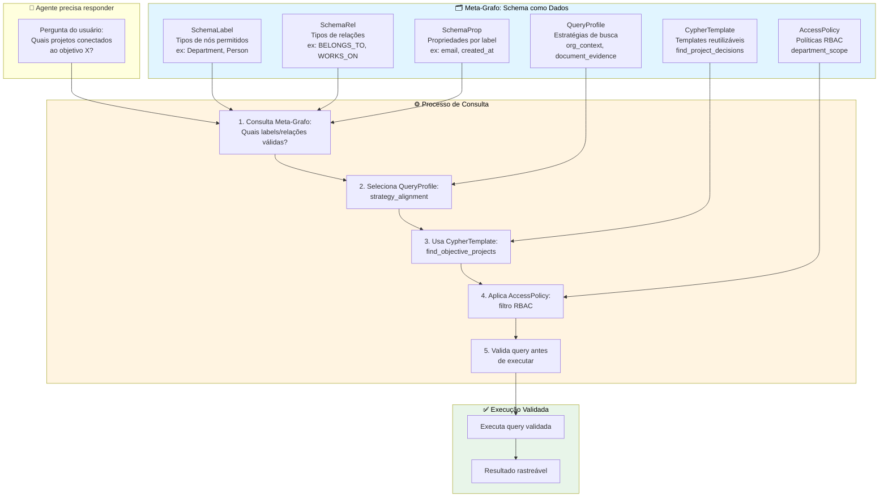

**Por que isso é fundamental?**

Sem Meta-Grafo, agentes precisam "adivinhar" o schema ou depender de documentação externa que pode estar desatualizada. Com Meta-Grafo:

1. **Agentes não inventam**: Antes de gerar uma query, o agente consulta o Meta-Grafo para ver quais labels e relações são válidos
2. **Queries são validadas**: O sistema pode verificar se uma query gerada pelo agente respeita o schema antes de executá-la
3. **Schema evolui com o grafo**: Quando a ontologia muda, o Meta-Grafo é atualizado automaticamente — agentes sempre têm a versão mais recente
4. **RBAC operacional**: Políticas de acesso são consultáveis pelo próprio sistema, não apenas aplicadas externamente

**Exemplo Prático:**

Quando um agente precisa responder "Quais projetos estão conectados ao objetivo de modernização?", ele:

1. Consulta o Meta-Grafo: "Quais labels e relações existem para objetivos e projetos?"
2. Seleciona o Query Profile `strategy_alignment`
3. Usa o template de Cypher correspondente
4. Aplica filtros de RBAC e validade do profile
5. Executa a query validada

O resultado: queries corretas, sem "invenções" de labels que não existem, respeitando sempre o schema atual.

**Valor para Negócios:**

Para público de negócios, o Meta-Grafo é a garantia de que o sistema "sabe o que sabe" — e o que não sabe. É como ter um funcionário que, antes de responder qualquer pergunta, consulta o manual da empresa para garantir que está seguindo os procedimentos corretos. Isso evita erros, garante consistência e permite que o sistema evolua sem quebrar funcionalidades existentes.

## 9.3 Camada lógica: operações semânticas

A camada lógica é onde o conhecimento se transforma em **operação**. Se a camada conceitual é o catálogo da biblioteca, a camada lógica é o bibliotecário que sabe *usar* o catálogo para responder suas perguntas, verificar se os livros estão catalogados corretamente e encontrar conexões que você não esperava.

Na prática, ela faz quatro coisas:

**1. Queries semânticas** — responder perguntas sobre o conhecimento armazenado.

Pergunta em linguagem natural: *"Quais decisões impactam o projeto EKS?"*

O sistema traduz isso em uma consulta ao grafo (os blocos de código abaixo são escritos em **Cypher**, a linguagem de consulta do Neo4j — pense neles como "perguntas formais" feitas ao grafo):

```cypher
MATCH (d:Decision)-[:IMPACTS]->(p:Project {name: "Projeto EKS"})
RETURN d.title, d.date, d.rationale
ORDER BY d.date DESC;
```

**2. Inferências** — derivar novos fatos que ninguém declarou explicitamente.

Regra: *"Se alguém gerencia um departamento, então essa pessoa pertence àquele departamento."*

```cypher
MATCH (p:Person)-[:MANAGES]->(d:Department)
WHERE NOT (p)-[:BELONGS_TO]->(d)
MERGE (p)-[:BELONGS_TO]->(d);
```

O sistema descobre sozinho que Maria pertence ao departamento de TI, sem que ninguém precise dizer isso explicitamente.

**3. Validações** — verificar se o conhecimento está completo e correto.

Regra de negócio: *"Todo projeto precisa de um responsável."*

```cypher
MATCH (p:Project)
WHERE NOT EXISTS {
  (p)-[:MANAGED_BY]->(:Person)
}
RETURN p.name AS projeto_invalido;
```

Se algum projeto não tiver responsável, o sistema alerta. É como se o bibliotecário avisasse: "Este livro não tem ficha catalográfica completa — falta o autor."

**4. Navegação contextual** — descobrir caminhos entre informações aparentemente desconectadas.

Pergunta: *"Qual é o caminho de uma decisão técnica até o objetivo estratégico que ela serve?"*

```cypher
MATCH path = (d:Decision)-[*1..5]-(o:Objective)
WHERE d.title CONTAINS "Adotar Neo4j"
RETURN path;
```

Essa query revela a cadeia: a decisão de adotar Neo4j conecta-se ao projeto EKS, que se conecta ao objetivo de modernização tecnológica. Essa rastreabilidade é o que permite a uma organização responder *"por que fizemos isso?"*.

Essa camada transforma o grafo estático em um **sistema cognitivo** — capaz de responder, inferir, validar e navegar.

## 9.4 Camada física: Neo4j e armazenamento

A camada física implementa o armazenamento. No projeto EKS, a escolha foi **Neo4j Aura** (banco de grafos nativo na nuvem).

**Por que Neo4j?**

- **Navegação eficiente**: Traversals de múltiplos níveis são nativamente otimizados
- **Cypher**: Linguagem de query declarativa e expressiva
- **Indexes semânticos**: Suporte a full-text search e vetores
- **Transações ACID**: Confiabilidade para dados críticos
- **Escalabilidade**: Horizontal e vertical

**Estrutura física do grafo EKS:**

```
Nodes: 69
Relationships: 114
R/N ratio: 1.65 (densidade saudável)
Órfãos: 0 (zero nós desconectados)
Supernós: 5 (nós com > 10 conexões)
```

Cada nó carrega **metadados universais**:

```json
{
  "id": "uuid",
  "created_at": "timestamp",
  "updated_at": "timestamp",
  "source_type": "document | chat | form | inference",
  "confidence": 0.85,
  "freshness_score": 0.92,
  "last_validated_at": "timestamp"
}
```

Esses metadados não são luxo — são infraestrutura epistemológica. Cada fato carrega consigo sua proveniência, confiabilidade e atualidade.

## 9.5 A separação de preocupações que permite escala

A beleza dessa arquitetura em camadas é a **separação de preocupações**:

- Um cientista de dados pode escrever queries na camada lógica sem entender detalhes de índices do Neo4j
- Um engenheiro de ontologias pode evoluir o schema conceitual sem quebrar queries existentes
- Um desenvolvedor de interface pode criar novos agentes consumindo a camada lógica via API

Essa modularidade não é apenas elegância técnica — é **requisito para manutenibilidade**. Um EKS precisa evoluir continuamente. Novos tipos de entidades surgem, novas relações são descobertas, novas perguntas precisam ser respondidas. A arquitetura em camadas permite que cada mudança seja localizada, testada e deployada de forma independente.

> **Em resumo:** A arquitetura em três camadas funciona como uma biblioteca bem organizada: o leitor (camada externa) faz perguntas, o catálogo (camada conceitual) organiza o conhecimento, e as estantes (camada interna) armazenam os dados. Separar essas preocupações permite que cada parte evolua sem quebrar as outras — e isso é fundamental para um sistema que precisa crescer com a organização.

---

# Capítulo 10: Estrutura Mínima de um Enterprise Knowledge Graph

## 10.0 Uma analogia: os quatro pilares de uma empresa

Toda empresa, independente de tamanho ou setor, pode ser entendida através de quatro lentes:

1. **Para onde estamos indo?** — Os objetivos estratégicos, as metas, as métricas de sucesso.
2. **O que estamos fazendo agora?** — Os projetos, as tarefas, os riscos em andamento.
3. **Quem faz o quê?** — As pessoas, suas competências, seus papéis e relações.
4. **O que sabemos?** — Os documentos, relatórios, decisões registradas e o conhecimento acumulado.

Em uma empresa pequena, essas quatro lentes estão na cabeça do fundador. Em uma empresa de 100 pessoas, elas já estão fragmentadas em planilhas, emails, drives compartilhados e a memória de pessoas-chave. Em uma empresa de 1.000 pessoas, a fragmentação é tão grande que a organização literalmente *não sabe o que sabe*.

Um Enterprise Knowledge Graph resolve isso ao representar explicitamente esses quatro pilares — e, crucialmente, as **conexões entre eles**.

## 10.1 Os quatro núcleos do grafo corporativo

Um Knowledge Graph corporativo bem estruturado possui **quatro núcleos semânticos** interconectados, correspondendo às quatro lentes acima:

### 1. Núcleo Estratégico ("Para onde estamos indo?")

Captura objetivos, OKRs, métricas e decisões estratégicas.

```
(Objective: "Modernização Tecnológica")
  --[HAS_KEY_RESULT]--> (OKR: "Migrar 80% dos sistemas para cloud até Q3")
  --[MEASURED_BY]--> (KPI: "Percentual de sistemas migrados")
  --[CONNECTED_TO]--> (Decision: "Adotar Neo4j para Knowledge Graph")
```

**Por que esse núcleo existe:**  
Sem ele, o sistema não consegue responder à pergunta mais importante de uma organização: *"Por que estamos fazendo isso?"* Cada projeto, cada decisão, cada tarefa deveria, idealmente, ser rastreável até um objetivo estratégico.

### 2. Núcleo Operacional ("O que estamos fazendo agora?")

Captura projetos, tarefas, riscos e execução.

```
(Project: "EKS - Enterprise Knowledge System")
  --[MANAGED_BY]--> (Person: "Rodrigo Trindade")
  --[HAS_TASK]--> (Task: "Implementar pipeline de ingestão")
  --[ASSIGNED_TO]--> (Person: "João Silva")
  --[HAS_RISK]--> (Risk: "Latência na extração de entidades")
  --[MITIGATED_BY]--> (Action: "Implementar cache de embeddings")
```

**Por que esse núcleo existe:**  
É onde a estratégia se transforma em ação. Ele responde: *"O que estamos fazendo agora? Quem é responsável? O que pode dar errado?"*

### 3. Núcleo Relacional ("Quem faz o quê?")

Captura pessoas, suas competências, papéis e relações.

```
(Person: "Maria Costa")
  --[HAS_ROLE]--> (Role: "Engenheira de Dados")
  --[WORKS_FOR]--> (Organization: "CoCreateAI")
  --[BELONGS_TO]--> (Department: "Tecnologia")
  --[HAS_SKILL]--> (Skill: "Neo4j", "Python", "Ontologias")
  --[PARTICIPATES_IN]--> (Project: "EKS")
```

**Por que esse núcleo existe:**  
Conhecimento não existe no vácuo — ele reside em pessoas. Saber *quem sabe o quê* é frequentemente mais valioso do que ter o conhecimento documentado. Esse núcleo transforma o EKS em um **mapeador de expertise organizacional**.

### 4. Núcleo Documental ("O que sabemos?")

Captura documentos, chunks e conhecimento extraído.

```
(Document: "Especificação Técnica - EKS v2")
  --[HAS_CHUNK]--> (Chunk: "Seção 3.2 - Arquitetura")
  --[RELATES_TO]--> (Knowledge: "Neo4j é usado como backend principal")
  --[MENTIONS]--> (Person: "Rodrigo")
  --[ABOUT]--> (Project: "EKS")
```

**Por que esse núcleo existe:**  
Documentos são a memória institucional. Mas um documento inteiro é grande demais como unidade de conhecimento. O núcleo documental quebra documentos em **chunks semanticamente coerentes** e extrai conhecimento estruturado deles.

## 10.2 Como os núcleos se interconectam

Se cada núcleo fosse um departamento isolado, teríamos apenas quatro bancos de dados separados — algo que a maioria das empresas já tem (em planilhas, sistemas ERP, CRMs e drives). A verdadeira magia acontece nas **conexões entre núcleos**:

```
(Decision: "Adotar Neo4j")
  --[CONNECTED_TO]--> (Objective: "Modernização")           [Estratégico]
  --[IMPACTS]--> (Project: "EKS")                           [Operacional]
  --[MADE_BY]--> (Person: "Rodrigo")                        [Relacional]
  --[EXTRACTED_FROM]--> (Document: "Meeting notes Jan 15")  [Documental]
```

**Visualizando a Interconexão dos 4 Núcleos:**

```mermaid
graph TD
    subgraph Strategic["🎯 NÚCLEO ESTRATÉGICO<br/>'Por que fazemos?'"]
        Obj[Objetivo:<br/>Modernização<br/>Tecnológica]
        OKR[OKR:<br/>Migrar 80% da stack<br/>até Q4]
    end
    
    subgraph Operational["⚙️ NÚCLEO OPERACIONAL<br/>'O que fazemos?'"]
        Proj[Projeto:<br/>Migração para<br/>Microservices]
        Task[Tarefa:<br/>Implementar<br/>API Gateway]
        Decision[Decisão:<br/>Adotar Neo4j]
    end
    
    subgraph Relational["👥 NÚCLEO RELACIONAL<br/>'Quem faz?'"]
        Ana[Ana Silva<br/>Tech Lead]
        Rodrigo[Rodrigo Trindade<br/>Arquiteto]
        Skills[Skills:<br/>Neo4j, Cloud,<br/>Microservices]
    end
    
    subgraph Documentary["📚 NÚCLEO DOCUMENTAL<br/>'Como foi decidido/documentado?'"]
        Doc[Documento:<br/>Arquitetura<br/>v2.0]
        Meeting[Reunião:<br/>Planning<br/>15/01/2026]
        Chunk[Chunk:<br/>"Seção 3.2:<br/>Escolha do BD"]
    end
    
    %% Conexões Estratégico ↔ Operacional
    Obj -->|REQUIRES| Proj
    OKR -->|MEASURED_BY| Task
    Decision -->|SUPPORTS| Obj
    
    %% Conexões Operacional ↔ Relacional
    Proj -->|MANAGED_BY| Ana
    Task -->|ASSIGNED_TO| Rodrigo
    Decision -->|MADE_BY| Rodrigo
    
    %% Conexões Relacional ↔ Skills
    Ana -->|HAS_SKILL| Skills
    Rodrigo -->|HAS_SKILL| Skills
    
    %% Conexões Documental ↔ Outros Núcleos
    Doc -->|ABOUT| Proj
    Meeting -->|DISCUSSED| Decision
    Chunk -->|MENTIONS| Ana
    Chunk -->|RELATES_TO| Task
    Decision -->|EXTRACTED_FROM| Meeting
    
    %% Conexões Cross-Núcleo (a magia acontece aqui)
    Meeting -->|PARTICIPANTS| Ana
    Meeting -->|PARTICIPANTS| Rodrigo
    Doc -->|AUTHOR| Rodrigo
    
    style Strategic fill:#e3f2fd,stroke:#1976d2,stroke-width:2px,color:#000
    style Operational fill:#fff3e0,stroke:#ff9800,stroke-width:2px,color:#000
    style Relational fill:#e8f5e9,stroke:#4caf50,stroke-width:2px,color:#000
    style Documentary fill:#fce4ec,stroke:#e91e63,stroke-width:2px,color:#000
```

**Como Ler Este Diagrama:**

Cada **caixa colorida** é um dos 4 núcleos do grafo. As **setas** mostram como as informações se conectam:

- **Setas internas** (dentro de um núcleo): Conexões naturais dentro do mesmo domínio
- **Setas cruzadas** (entre núcleos): O verdadeiro poder — conhecimento atravessando domínios

**Exemplo de Navegação:**

1. **Pergunta:** *"Quem está trabalhando no objetivo de Modernização?"*
   - **Caminho no grafo:** Objetivo → Projeto → Ana Silva
   - **Núcleos atravessados:** Estratégico → Operacional → Relacional

2. **Pergunta:** *"Onde foi documentada a decisão de usar Neo4j?"*
   - **Caminho no grafo:** Decisão → Reunião 15/01 → Documento Arquitetura v2.0
   - **Núcleos atravessados:** Operacional → Documental

3. **Pergunta:** *"Quais skills são necessários para o objetivo de Modernização?"*
   - **Caminho no grafo:** Objetivo → Projeto → Ana → Skills (Neo4j, Cloud, Microservices)
   - **Núcleos atravessados:** Estratégico → Operacional → Relacional

**A Magia:** Uma única decisão (como "Adotar Neo4j") toca **todos os 4 núcleos simultaneamente** — conectada ao objetivo estratégico, ao projeto operacional, à pessoa que decidiu, e ao documento que a registrou. Isso permite responder perguntas complexas que cruzam domínios com uma única consulta ao grafo.

---

Uma única decisão atravessa todos os quatro núcleos. Essa interconexão permite responder perguntas como:

- *"Quais decisões impactam o projeto X?"* (Operacional → Estratégico)
- *"Quem toma decisões sobre modernização tecnológica?"* (Estratégico → Relacional)
- *"Onde foi documentada a decisão de usar Neo4j?"* (Estratégico → Documental)
- *"Quais projetos estão conectados ao objetivo Y?"* (Estratégico → Operacional)

## 10.3 Exemplo real: snapshot do grafo EKS

**Métricas atuais do grafo EKS em produção:**

| Métrica | Valor | Interpretação |
|---------|-------|---------------|
| Total de nós | 69 | Base sólida inicial |
| Total de relações | 114 | Boa conectividade |
| Relações/Nó (R/N) | 1.65 | Densidade saudável |
| Grau médio | 3.30 | Cada nó tem ~3 conexões |
| Nós órfãos | 0 (0%) | Zero ruído ✅ |

**Top 5 supernós (hubs com mais conexões):**

| Entidade | Tipo | Grau | Análise |
|----------|------|------|---------|
| Rodrigo Trindade | Person | 37 | **Líder central** — participação em tudo |
| Meeting (unnamed) | Meeting | 24 | **Atenção**: Falta de metadados |
| CoCreateAI | Organization | 14 | **Esperado** — raiz organizacional |
| Julio Lewkowicz | Person | 14 | **Colaborador ativo** |
| Projeto EKS | Project | 11 | **Projeto central** |

**Análise de saúde ontológica: 8/10**

Pontos positivos:
- Zero nós desconectados (órfãos)
- Densidade moderada e equilibrada
- Distribuição de grau saudável (p90 = 5.4)

Pontos de atenção:
- Supernó "Rodrigo" com 37 conexões — possível gargalo organizacional ou artefato da fase inicial
- Meeting sem nome — erro de extração que precisa ser corrigido

## 10.4 Queries Cypher fundamentais

As consultas abaixo são escritas em **Cypher** (a linguagem do Neo4j). Para o leitor não técnico, pense nelas como "perguntas formais" ao grafo — cada uma traduz uma pergunta de negócio em algo que o computador entende. A explicação em linguagem natural precede cada uma.

**1. Encontrar caminho entre entidades:**

*Pergunta de negócio: "Qual é a conexão entre a decisão de adotar Neo4j e nossos objetivos estratégicos?"*

```cypher
MATCH path = shortestPath(
  (d:Decision {title: "Adotar Neo4j"})-[*]-(o:Objective)
)
RETURN path;
```

**2. Listar projetos órfãos (não conectados a objetivos):**

*Pergunta de negócio: "Existem projetos em andamento que não estão vinculados a nenhum objetivo estratégico?"* (Esses projetos podem estar consumindo recursos sem contribuir para os resultados da empresa.)

```cypher
MATCH (p:Project)
WHERE NOT EXISTS {
  (p)-[*1..3]-(o:Objective)
}
RETURN p.name AS projeto_orfao;
```

**3. Identificar supernós (potenciais gargalos):**

*Pergunta de negócio: "Quem ou o que concentra conexões demais na organização?"* (Uma pessoa com 37 conexões pode ser um gargalo — tudo depende dela.)

```cypher
MATCH (n)
WITH n, COUNT { (n)--() } AS degree
WHERE degree > 10
RETURN labels(n)[0] AS tipo, n.name AS nome, degree
ORDER BY degree DESC;
```

**4. Calcular freshness médio por tipo:**

*Pergunta de negócio: "Quais tipos de informação estão mais desatualizados?"* (Uma análise de mercado com três meses é menos confiável que uma política interna de longo prazo.)

```cypher
MATCH (n)
WHERE n.freshness_score IS NOT NULL
RETURN labels(n)[0] AS tipo,
       avg(n.freshness_score) AS freshness_medio
ORDER BY freshness_medio DESC;
```

## 10.5 Além da Estrutura Formal: O Grafo de Interação e Delegação (GID)

Até aqui, falamos sobre como o grafo captura a estrutura formal da organização: hierarquias, projetos, objetivos documentados, decisões registradas. Mas toda organização tem uma segunda camada, muitas vezes invisível: **a rede real de colaboração** — quem realmente trabalha com quem, quem delega para quem, como o trabalho realmente flui.

O **Grafo de Interação & Delegação (GID)** captura essa estrutura organizacional viva, registrando **quem fez o quê, delegou para quem, e com qual handoff**. Ele transforma o organograma estático em um **mapa dinâmico do fluxo de trabalho real**.

### Por que isso importa: O "Organograma Sombra"

O organograma formal diz que "Rodrigo reporta para Maria, que reporta para o Diretor de TI". Mas na prática:
- Rodrigo colabora intensamente com João (de outro departamento)
- Rodrigo delega tarefas técnicas para Ana (que formalmente não está sob sua gestão)
- A maioria das decisões críticas acontece em conversas informais, não em reuniões oficiais

O GID revela esse **"organograma sombra"** — a rede real de colaboração que, muitas vezes, é mais importante que a hierarquia formal.

### Como funciona: Captura Automática de Interações

O sistema captura automaticamente interações como:
- **Criação de tarefas**: "Rodrigo criou tarefa X"
- **Delegação**: "Rodrigo delegou tarefa X para Ana"
- **Handoffs**: "Ana aceitou a delegação e começou a trabalhar"
- **Comentários e menções**: "João comentou na tarefa de Rodrigo"
- **Atualizações de documentos**: "Maria editou o documento de especificação"

Cada interação é registrada no grafo:

```cypher
(:User {name: "Rodrigo"})-[:PERFORMED]->(:Interaction {type: "delegate", timestamp: datetime()})
  -[:ON]->(:Task {title: "Implementar pipeline"})
  -[:TO]->(:User {name: "Ana"})
```

### Valor para Negócios: Três Aplicações Práticas

**1. Detecção de Gargalos**

Se Ana recebe 15 delegações por semana, mas aceita apenas 40%, o sistema detecta que ela pode estar sobrecarregada. Gestores são alertados *antes* que o gargalo vire crise.

```cypher
// Detectar usuários com alta taxa de delegações pendentes
MATCH (u:User)<-[:TO]-(task:Task)
WHERE task.status = 'pending'
WITH u, count(task) AS pending_count
WHERE pending_count > 10
RETURN u.name, pending_count
ORDER BY pending_count DESC
```

**2. Mapeamento de Processos Reais**

Um gestor pergunta: *"Como o processo de aprovação de propostas realmente funciona?"* O sistema analisa o histórico de interações e gera um fluxo de processo real, mostrando:
- Quem são os aprovadores reais (não apenas os formais)
- Quanto tempo cada etapa demora na prática
- Onde os handoffs costumam travar

**3. Descoberta de Especialistas**

Um novo funcionário pergunta: *"Quem pode me ajudar com integração de APIs?"* O sistema consulta o GID e identifica que João interagiu com tarefas relacionadas a APIs 47 vezes nos últimos 3 meses — mais que qualquer outra pessoa. João é sugerido como especialista.

```cypher
// Encontrar especialistas em um tópico baseado em interações
MATCH (u:User)-[:PERFORMED]->(i:Interaction)-[:ON]->(entity)
WHERE entity.tags CONTAINS 'API integration'
WITH u, count(i) AS interaction_count
RETURN u.name, interaction_count
ORDER BY interaction_count DESC
LIMIT 5
```

### O Handoff: A Unidade Crítica de Workflow

Um **handoff** é o momento em que uma pessoa passa trabalho ou responsabilidade para outra. É onde workflows costumam falhar:
- A informação não é clara
- O destinatário não entende o contexto
- A delegação fica "pendente" indefinidamente

O GID rastreia cada handoff com metadata rico:

```cypher
(:User {name: "Rodrigo"})-[:DELEGATED {
  handoff_date: datetime(),
  handoff_note: "Precisa revisar a arquitetura antes de implementar",
  status: "pending",
  expected_completion: datetime() + duration({days: 3})
}]->(:Task)-[:TO]->(:User {name: "Ana"})
```

Quando Ana aceita, o `status` muda para `"accepted"`. Quando completa, muda para `"completed"`. Se não aceita em 48 horas, um alerta é gerado.

### Integração com o Business Intent Graph (GIN)

O poder do GID aumenta quando ele se conecta ao Business Intent Graph (visto no Capítulo 20). Cada interação pode ser linkada a objetivos estratégicos:

```cypher
MATCH (interaction:Interaction)-[:ON]->(task:Task)-[:CONTRIBUTES_TO]->(objective:Objective)
RETURN interaction, task, objective
```

Isso permite responder: *"Quem está realmente trabalhando nos nossos objetivos estratégicos?"* — não quem *deveria* estar, mas quem *está*.

### Em Resumo: Capturando a Organização Real

O GID não substitui a estrutura formal. Ele a complementa, revelando:
- **Como o trabalho realmente flui** (não como está documentado)
- **Quem colabora com quem** (não apenas quem reporta para quem)
- **Onde os gargalos ocorrem** (não onde achamos que ocorrem)
- **Quem são os verdadeiros especialistas** (não apenas quem tem o cargo)

Para gestores, o GID é como ter um "mapa em tempo real" da organização — um **gêmeo digital organizacional** que mostra a empresa como ela realmente funciona.

> **Em resumo (Capítulo 10 completo):** Um Knowledge Graph corporativo é construído sobre quatro pilares que toda organização já tem (estratégia, operação, pessoas e documentos) — a diferença é que, no grafo, esses pilares estão *explicitamente conectados*. Além da estrutura formal, o Grafo de Interação & Delegação (GID) captura a rede real de colaboração, revelando o "organograma sombra" e transformando handoffs invisíveis em dados rastreáveis. Isso permite perguntas que cruzam domínios: "Quem sabe sobre o projeto ligado ao nosso objetivo estratégico?" ou "Onde nossos workflows realmente travam?" — algo impossível em silos de informação tradicionais.

---

# Capítulo 11: Temporalidade e Evolução — O Conhecimento Que Envelhece

## 11.0 Por que o tempo importa: uma história do dia a dia

Imagine que você entra em uma reunião de diretoria. Alguém apresenta uma análise de concorrentes — mas foi feita há oito meses. O mercado mudou, um concorrente foi adquirido, outro lançou um produto disruptivo. A análise, que era excelente quando foi criada, agora é **perigosamente desatualizada**. Mas como saber disso se o sistema só mostra a data de criação, escondida em um rodapé?

Agora imagine outra situação: a empresa descobre que uma decisão crítica foi tomada seis meses atrás, mas nunca foi documentada. Quando exatamente ela foi tomada? E quando o sistema tomou conhecimento dela? Essas duas datas são diferentes — e ambas importam.

Conhecimento não é como um diamante — ele não é eterno. Ele **envelhece, perde relevância e precisa ser cuidado**. Este capítulo explica como um sistema inteligente lida com o tempo.

## 11.1 Estado vs Evento: duas formas de representar tempo

Um dos erros mais comuns em sistemas de conhecimento é tratar tudo como **estado** — uma fotografia estática do presente. A realidade organizacional é feita de **eventos** — coisas que aconteceram em momentos específicos.

**Estado** é contínuo:  
*"Maria é gerente de projeto"* — verdadeiro desde algum momento até agora (ou até que mude).

**Evento** é pontual:  
*"Maria foi promovida a gerente em 15/01/2026"* — aconteceu uma vez, em um instante.

No EKS, ambos coexistem:

```
(Maria:Person)
  --[HAS_ROLE {since: "2026-01-15"}]--> (Role: "Gerente de Projeto")

(Event: "Promoção de Maria")
  --[OCCURRED_AT]--> (Date: "2026-01-15")
  --[ACTOR]--> (Maria)
  --[RESULTED_IN]--> (Role: "Gerente de Projeto")
```

A primeira forma (relação com `since`) captura o **estado atual**. A segunda (nó de evento) captura o **histórico**. Ambas são necessárias: estado para queries rápidas, eventos para auditoria e análise temporal.

## 11.2 Temporalidade bitemporal: quando vs quando sabíamos

A maioria dos sistemas só rastreia um tipo de tempo: *"quando o fato foi registrado no sistema"*. Mas há dois tempos distintos:

**Valid Time (tempo de validade):**  
Quando o fato era verdadeiro no mundo real.  
*"A decisão de pausar o projeto foi tomada em 10/01/2026"*

**Transaction Time (tempo de transação):**  
Quando o fato foi registrado no sistema.  
*"Essa decisão foi registrada no EKS em 12/01/2026"*

Por que isso importa?

Imagine que você descobre, em fevereiro, que uma decisão crítica foi tomada em dezembro — mas ninguém havia documentado. O tempo de validade é dezembro; o tempo de transação é fevereiro. Se você perguntar *"Quais decisões tínhamos em janeiro?"*, a resposta depende de qual tempo você está consultando:

- **Por valid time**: sim, a decisão existia (foi tomada em dezembro)
- **Por transaction time**: não, a decisão não estava no sistema (foi registrada em fevereiro)

No EKS, implementamos bitemporalidade com metadados:

```json
{
  "valid_from": "2025-12-15",
  "valid_to": null,
  "registered_at": "2026-02-10",
  "updated_at": "2026-02-10"
}
```

## 11.3 Freshness decay: como o conhecimento perde relevância

Nem todo conhecimento tem prazo de validade explícito. Uma análise de mercado não vem com uma etiqueta dizendo *"válida até 30/06/2026"*. Mas ela claramente perde relevância com o tempo.

Pense nisso como **frutas no supermercado**: uma maçã fresca tem pontuação 10 no primeiro dia. A cada dia, ela perde um pouco de frescor. Após uma semana, ainda é comestível (pontuação 7). Após um mês, está imprópria (pontuação 2). Diferentes frutas estragam em velocidades diferentes — morangos perdem frescor rápido, maçãs demoram mais.

Da mesma forma, diferentes tipos de conhecimento "estragam" em velocidades diferentes. Uma análise de mercado perde relevância em semanas. Uma política interna pode valer por anos. O EKS modela isso matematicamente com o conceito de **freshness decay** (decaimento de frescor):

```
freshness_score(t) = initial_score × e^(-λ × Δt)
```

Para o leitor não técnico: essa fórmula simplesmente diz que o frescor começa alto e vai diminuindo gradualmente ao longo do tempo, numa curva que desacelera — semelhante ao resfriamento de uma xícara de café.

Onde:
- `initial_score` = confiabilidade inicial (ex: 0.9)
- `λ` (lambda) = taxa de decaimento (velocidade com que o conhecimento "estraga" — definida por tipo)
- `Δt` = tempo desde a última validação ou criação

**Exemplo prático:**

| Tipo de conhecimento | Lambda (λ) | Meia-vida |
|----------------------|------------|-----------|
| Análise de mercado | 0.02 | ~35 dias |
| Decisão estratégica | 0.005 | ~140 dias |
| Informação sobre pessoa | 0.001 | ~700 dias |
| Fato histórico | 0.0001 | ~7000 dias |

**Visualizando o Freshness Decay ao Longo do Tempo:**

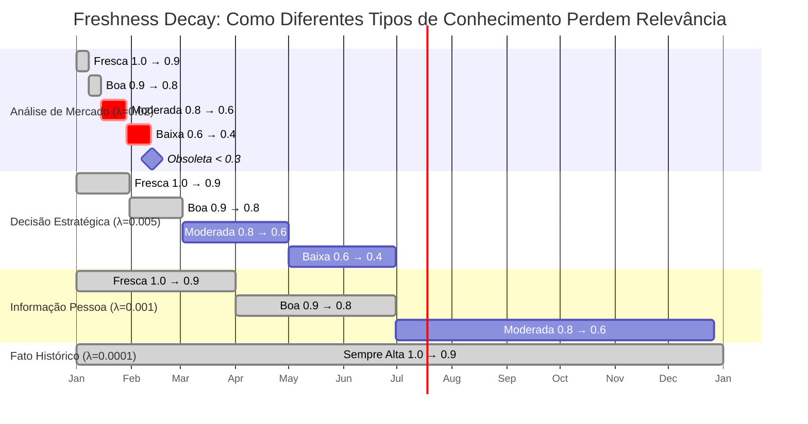

**Como Ler Este Diagrama:**

- **Eixo horizontal (tempo)**: Mostra a passagem dos meses
- **Cores**:
  - 🟢 **Verde (done)**: Freshness score ainda alto (> 0.7) — conhecimento confiável
  - 🔴 **Vermelho (crit)**: Freshness score moderado/baixo (< 0.7) — precisa revalidação
  - 💎 **Diamante**: Marco de obsolescência (< 0.3) — não usar sem validação

**Leitura Prática:**

1. **Análise de Mercado** (linha superior): "Estraga" rápido — após 1 mês já está em zona crítica (0.6). Após 2 meses, obsoleta.

2. **Decisão Estratégica** (2ª linha): Válida por mais tempo — leva ~6 meses para chegar a freshness moderado (0.6).

3. **Informação sobre Pessoa** (3ª linha): Muito estável — um cargo ou habilidade permanece válido por 1-2 anos antes de precisar revisão.

4. **Fato Histórico** (linha inferior): Quase não decai — "A empresa foi fundada em 2010" continua verdadeiro indefinidamente.

**Valor Prático:** O sistema usa esses scores para decidir automaticamente quando **alertar** que uma informação precisa ser revalidada. Quando você busca conhecimento, o sistema pode filtrar automaticamente informação com freshness < 0.7, garantindo que você não tome decisões baseadas em dados desatualizados.

---

No EKS, cada nó carrega `freshness_score` e `freshness_decay_rate`. Um serviço em background recalcula os scores periodicamente (o código abaixo mostra como — leitores não técnicos podem pular para o próximo parágrafo):

```cypher
MATCH (n)
WHERE n.freshness_score IS NOT NULL
WITH n,
     duration.inDays(n.last_validated_at, datetime()).days AS days_since,
     n.freshness_decay_rate AS lambda
SET n.freshness_score = n.confidence * exp(-lambda * days_since);
```

O resultado prático: o sistema automaticamente rebaixa a pontuação de informações que não foram revisadas recentemente. Quando um agente vai buscar conhecimento, ele pode filtrar por freshness mínimo — garantindo que só informação "fresca" seja apresentada:

```cypher
MATCH (k:Knowledge)
WHERE k.freshness_score > 0.7
RETURN k
ORDER BY k.freshness_score DESC;
```

## 11.4 Versionamento semântico: ontologias que evoluem

Ontologias não são estáticas. Elas evoluem:

- Novas classes são adicionadas (*"Vamos começar a rastrear Fornecedores"*)
- Relações são refinadas (*"RELATED_TO é vago demais, vamos criar DEPENDS_ON e INFLUENCES"*)
- Restrições mudam (*"Agora um projeto pode ter múltiplos responsáveis"*)

Como gerenciar essa evolução sem quebrar o sistema em produção?

**Versionamento semântico da ontologia:**

```
v1.0.0 → Ontologia inicial
v1.1.0 → Adição de classe Supplier (minor — backward compatible)
v2.0.0 → Mudança de cardinalidade em MANAGED_BY (major — breaking change)
```

**Estratégias de migração:**

1. **Migração imediata**: Execute scripts Cypher que atualizam o grafo inteiro de uma vez (adequado para grafos pequenos)
2. **Migração lazy**: Nós antigos convivem com nós novos; um processo em background migra gradualmente
3. **Dupla escrita**: Escreva tanto no schema antigo quanto no novo durante período de transição

No EKS, adotamos migração lazy para mudanças não-breaking e migração imediata para breaking changes (com janela de manutenção).

## 11.5 Exemplo real: monitoramento de freshness no EKS

**Query para identificar conhecimento obsoleto:**

```cypher
MATCH (k:Knowledge)
WHERE k.freshness_score < 0.5
RETURN k.content AS conteudo_obsoleto,
       k.freshness_score AS score,
       k.last_validated_at AS ultima_validacao
ORDER BY k.freshness_score ASC
LIMIT 10;
```

**Resultado típico:**

| Conteúdo | Score | Última validação |
|----------|-------|------------------|
| "Roadmap Q3 2025" | 0.32 | 2025-09-10 |
| "Análise de concorrentes" | 0.41 | 2025-10-15 |
| "Especificação API v1" | 0.48 | 2025-11-20 |

Esses resultados são apresentados ao **agente de curadoria**, que pode:
- Solicitar revisão humana
- Marcar como obsoleto (soft delete)
- Revalidar automaticamente se houver fonte confiável

> **Em resumo:** Conhecimento envelhece como frutas — cada tipo em velocidade diferente. Um sistema inteligente rastreia não apenas *o que* sabe, mas *quando* aprendeu e *quão fresco* está esse conhecimento. Isso evita decisões baseadas em informação desatualizada — um dos erros mais caros em qualquer organização.

---

# Capítulo 12: Camada de Confiança — Quando o Sistema Sabe o Que Não Sabe

## 12.0 Uma história sobre confiança

Imagine que seu assistente de IA diz: *"O orçamento do projeto EKS é R$ 500 mil."* Você toma decisões com base nisso. Mas essa informação veio de onde? De um documento oficial aprovado pela diretoria? Ou de uma transcrição de reunião informal onde alguém *mencionou* esse valor como estimativa?

A diferença importa — e muito. No mundo real, nós avaliamos a confiabilidade de informação o tempo todo: confiamos mais em um contrato assinado do que em um boato de corredor. Confiamos mais em dados de um sistema oficial do que em anotações pessoais. Mas a maioria dos sistemas de IA trata todas as informações como igualmente confiáveis — e isso é perigoso.

Este capítulo trata de como construir um sistema que **sabe o que não sabe**, que é transparente sobre suas incertezas, e que pede ajuda humana quando necessário. Chamamos isso de **camada de confiança**.

## 12.1 Humildade epistêmica em sistemas de IA

Um dos maiores riscos de sistemas baseados em IA é a **ilusão de certeza** — apresentar informação gerada ou inferida como se fosse fato validado. Isso é especialmente perigoso em contextos corporativos, onde decisões baseadas em informação incorreta têm consequências reais: orçamentos alocados incorretamente, contratos baseados em premissas falsas, estratégias construídas sobre dados desatualizados.

A solução não é evitar IA — é construir **humildade epistêmica** no sistema. Isso significa que o sistema deve:

1. **Diferenciar** conhecimento validado de conhecimento inferido
2. **Quantificar** a confiança em cada afirmação
3. **Rastrear** a proveniência de cada fato
4. **Alertar** quando a confiança é baixa
5. **Solicitar validação** quando apropriado

## 12.2 Trust score: quantificando a confiabilidade

Cada nó no EKS carrega um **confidence score** (0.0 a 1.0) que indica o nível de confiança nessa informação:

| Score | Interpretação | Exemplo |
|-------|---------------|---------|
| **0.9-1.0** | Altamente confiável | Informação validada por múltiplos especialistas |
| **0.7-0.9** | Confiável | Extraído de fonte oficial, mas não validado |
| **0.5-0.7** | Moderado | Inferido por IA com boa confiança |
| **0.3-0.5** | Baixo | Extraído de fonte informal ou IA incerta |
| **0.0-0.3** | Muito baixo | Especulação, precisa validação |

**Como o score é calculado: As 8 Dimensões de Confiança**

Em vez de uma fórmula simples, o EKS calcula o trust score através de **8 dimensões calibradas**, cada uma avaliando um aspecto diferente da confiabilidade. Pense nisso como um júri de 8 especialistas, cada um avaliando a informação por uma lente diferente:

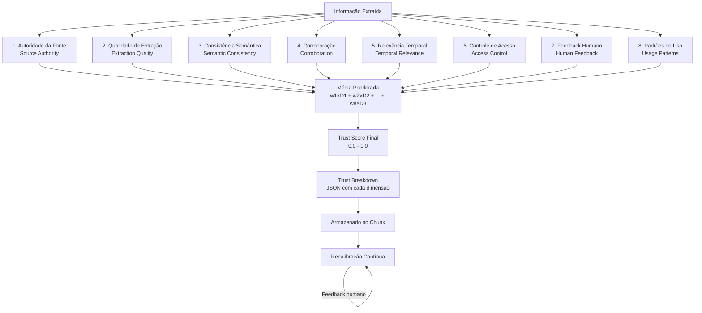

**1. Autoridade da Fonte (Source Authority)**
Quão confiável é a origem? Um documento oficial da diretoria tem mais autoridade que um e-mail casual. Um sistema integrado (API) tem mais autoridade que uma transcrição de reunião.

**2. Qualidade de Extração (Extraction Quality)**
Quão bem a IA conseguiu extrair a informação? Se o texto estava claro e estruturado, a extração é mais confiável. Se estava ambíguo ou mal formatado, a qualidade cai.

**3. Consistência Semântica (Semantic Consistency)**
A informação faz sentido no contexto do grafo? Se contradiz fatos já validados, a consistência é baixa. Se corrobora múltiplas fontes, é alta.

**4. Corroboração (Corroboration)**
Outras fontes confirmam essa informação? Se três documentos diferentes mencionam o mesmo fato, a corroboração é alta. Se é a única fonte, é baixa.

**5. Relevância Temporal (Temporal Relevance)**
A informação ainda é atual? Uma análise de mercado de ontem é mais relevante que uma de seis meses atrás. O frescor (do capítulo anterior) entra aqui.

**6. Controle de Acesso (Access Control)**
A informação veio de uma fonte com restrições de acesso apropriadas? Informação financeira de um sistema protegido tem mais confiança que informação pública.

**7. Feedback Humano (Human Feedback)**
Alguém validou ou corrigiu essa informação? Cada validação humana aumenta a confiança. Cada correção também — porque mostra que a informação foi revisada.

**8. Padrões de Uso (Usage Patterns)**
A informação é frequentemente consultada e nunca contestada? Se muitos usuários acessam e ninguém reporta erro, isso aumenta a confiança. Se ninguém nunca consulta, pode ser irrelevante ou incorreta.

**Cálculo do Trust Score:**

O score final é uma **média ponderada** dessas 8 dimensões, onde cada dimensão tem um peso configurável (por padrão, todas têm peso igual, mas organizações podem ajustar):

```
trust_score = (w1 × source_authority + 
               w2 × extraction_quality + 
               w3 × semantic_consistency + 
               w4 × corroboration + 
               w5 × temporal_relevance + 
               w6 × access_control + 
               w7 × human_feedback + 
               w8 × usage_patterns) / soma_dos_pesos
```

**Transparência: O Trust Breakdown**

Cada chunk de informação armazena não apenas o score final, mas um **breakdown detalhado** (em JSON) mostrando o valor de cada dimensão:

```json
{
  "trust_score": 0.82,
  "trust_breakdown": {
    "source_authority": 0.9,
    "extraction_quality": 0.85,
    "semantic_consistency": 0.8,
    "corroboration": 0.75,
    "temporal_relevance": 0.9,
    "access_control": 0.8,
    "human_feedback": 0.7,
    "usage_patterns": 0.85
  }
}
```

Isso permite **explicabilidade**: quando o sistema mostra uma informação com trust score 0.82, o usuário pode ver *por quê* — talvez a corroboração seja baixa (0.75), mas a autoridade da fonte seja alta (0.9).

**Recalibração Contínua:**

O trust score não é calculado uma vez e esquecido. Ele é **recalibrado**:

- **Na ingestão**: Score inicial calculado imediatamente
- **Diariamente**: Chunks acessados recentemente têm seus scores recalculados (para refletir mudanças em corroboração, uso, etc.)
- **Imediatamente**: Quando um humano valida ou corrige, o score é recalculado na hora

**Loop de Feedback:**

Quando um usuário valida ou corrige uma informação, o sistema aprende:
- Se validou → aumenta `human_feedback` e `usage_patterns`
- Se corrigiu → ajusta `extraction_quality` e pode diminuir `semantic_consistency` se havia contradição
- Se contestou → diminui `corroboration` e pode marcar para revisão humana

Esse loop transforma o sistema em um **aprendiz contínuo** — quanto mais uso, mais preciso fica.

**Cenários Comparativos: Entendendo as 8 Dimensões na Prática**

Para tornar as 8 dimensões do Trust Score tangíveis, vejamos dois cenários reais e compare como cada dimensão contribui para a pontuação final:

| Dimensão | Cenário A: Alta Confiança<br/>(Informação financeira validada) | Score A | Cenário B: Baixa Confiança<br/>(Comentário casual em chat) | Score B |
|----------|------------------------------------------------------------|---------|----------------------------------------------------------|---------|
| **1. Source Authority** | Documento oficial da diretoria financeira, assinado pelo CFO | 0.95 | Transcrição de chat informal entre dois colaboradores | 0.35 |
| **2. Extraction Quality** | Texto estruturado com tabelas bem formatadas, extração clara | 0.90 | Texto ambíguo com gírias, contexto incompleto | 0.50 |
| **3. Semantic Consistency** | Corrobora outros dados financeiros já validados no grafo | 0.85 | Contradiz informações de documentos oficiais | 0.40 |
| **4. Corroboration** | Três fontes independentes (doc oficial, email CFO, ata de reunião) | 0.90 | Única fonte, sem confirmação de outras pessoas ou documentos | 0.20 |
| **5. Temporal Relevance** | Informação de ontem, extremamente atual | 0.95 | Informação de 8 meses atrás, sem revalidação desde então | 0.45 |
| **6. Access Control** | Fonte protegida, sistema com controle de acesso rigoroso (ERP) | 0.90 | Fonte pública, sem restrição de acesso | 0.60 |
| **7. Human Feedback** | Validado explicitamente pelo CFO e dois auditores | 1.00 | Sem validação humana, extraído automaticamente | 0.00 |
| **8. Usage Patterns** | Informação acessada 50x no último mês, sem contestações | 0.85 | Informação acessada 2x, usuário reportou imprecisão | 0.30 |
| **Trust Score Final** | (Média ponderada das 8 dimensões) | **0.91** ✅ | (Média ponderada das 8 dimensões) | **0.35** ⚠️ |

**Análise dos Cenários:**

**Cenário A (Trust Score: 0.91 — Alta Confiança):**  
Uma informação sobre o orçamento trimestral da empresa, extraída de um documento oficial da diretoria financeira. Foi validada por três fontes independentes, acessada frequentemente por diferentes usuários sem contestações, e está atualizada (gerada ontem). O sistema marca essa informação como **altamente confiável** e a apresenta sem avisos.

**Cenário B (Trust Score: 0.35 — Baixa Confiança):**  
Uma menção ao orçamento de um projeto extraída de uma transcrição de chat informal, onde dois colaboradores comentam casualmente sobre valores. É a única fonte dessa informação, contradiz documentos oficiais, foi feita há 8 meses, nunca foi validada por humanos, e já recebeu um report de imprecisão. O sistema marca essa informação como **baixa confiança** e:
- Exibe aviso visual ao usuário: ⚠️ "Confiança baixa (0.35) — Requer validação"
- Não usa essa informação em respostas críticas sem disclaimer
- Cria tarefa automática para validador humano revisar

**Breakdown Detalhado Explicado:**

Cada dimensão responde a uma pergunta específica que qualquer gestor faria antes de confiar numa informação:

1. **Source Authority**: *"Quem disse isso? É alguém/algo confiável?"*
2. **Extraction Quality**: *"Entendi corretamente o que foi dito?"*
3. **Semantic Consistency**: *"Faz sentido com o que já sabemos?"*
4. **Corroboration**: *"Outras fontes confirmam?"*
5. **Temporal Relevance**: *"Isso ainda é válido hoje?"*
6. **Access Control**: *"Veio de um lugar protegido/oficial?"*
7. **Human Feedback**: *"Alguém competente confirmou?"*
8. **Usage Patterns**: *"Outras pessoas usaram e confiaram?"*

**Valor para Negócios:**

Imagine um assistente humano entregando essas duas informações:

- **Cenário A**: "Segundo o documento oficial do CFO de ontem, validado por três fontes, o orçamento é X."
- **Cenário B**: "Eu vi num chat informal de 8 meses atrás alguém comentar que o orçamento seria Y, mas contradiz o documento oficial e ninguém confirmou. Quer que eu valide isso antes de você confiar?"

O Trust Score automatiza exatamente esse tipo de julgamento humano — decidindo quando apresentar informação com certeza versus quando pedir confirmação.

O trecho de código abaixo mostra como isso é implementado (leitores não técnicos podem pular para a seção 12.3):

```python
def calculate_trust_score(chunk):
    # Pesos configuráveis (padrão: todos iguais)
    weights = {
        "source_authority": 0.125,
        "extraction_quality": 0.125,
        "semantic_consistency": 0.125,
        "corroboration": 0.125,
        "temporal_relevance": 0.125,
        "access_control": 0.125,
        "human_feedback": 0.125,
        "usage_patterns": 0.125
    }
    
    # Calcular cada dimensão
    dimensions = {
        "source_authority": calculate_source_authority(chunk),
        "extraction_quality": calculate_extraction_quality(chunk),
        "semantic_consistency": check_semantic_consistency(chunk),
        "corroboration": find_corroborating_sources(chunk),
        "temporal_relevance": calculate_temporal_relevance(chunk),
        "access_control": evaluate_access_control(chunk),
        "human_feedback": get_human_feedback_score(chunk),
        "usage_patterns": analyze_usage_patterns(chunk)
    }
    
    # Média ponderada
    trust_score = sum(weights[dim] * dimensions[dim] for dim in dimensions)
    
    return {
        "trust_score": trust_score,
        "trust_breakdown": dimensions
    }
```

## 12.3 Proveniência: de onde veio essa informação

Todo conhecimento no EKS carrega metadados de proveniência. Mas o sistema vai além de simples metadados — ele implementa um **modelo completo de rastreabilidade** onde **cada resposta gerada pela IA** tem fontes explícitas, navegáveis e auditáveis.

**O Modelo de Proveniência PROV-O**

O EKS segue o padrão **PROV-O** (Provenance Ontology) da W3C, que define como rastrear a origem e transformações de qualquer informação. No contexto do EKS, isso significa:

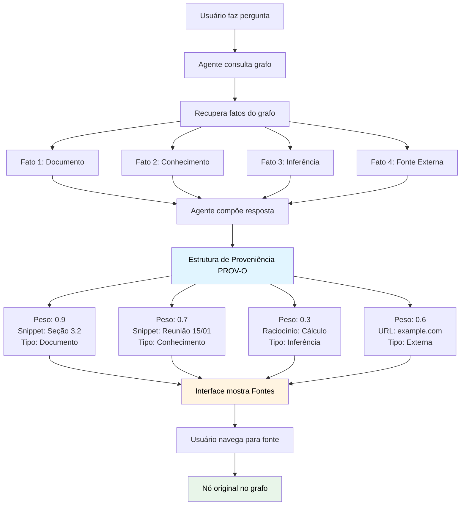

**1. Cada Resposta é Rastreável**

Quando um agente gera uma resposta, ele não apenas "inventa" — ele consulta o grafo e monta uma resposta baseada em fatos. Cada fato usado é registrado:

```
(:Answer {id: "ans-123", content: "O projeto EKS tem orçamento de R$ 500k"})
  --[:USED_SOURCE {weight: 0.9, reasoning_snippet: "Seção 3.2 do documento"}]-->
  (:Document {id: "doc-456", title: "Planejamento 2026.pdf"})
  
  --[:USED_SOURCE {weight: 0.7}]-->
  (:Knowledge {id: "k-789", content: "Orçamento aprovado em reunião de diretoria"})
```

**2. Fontes com Peso e Contexto**

Cada fonte não é apenas um link — ela carrega:
- **Peso**: Quanto essa fonte contribuiu para a resposta (0.0 a 1.0)
- **Snippet**: Trecho específico do documento que foi usado
- **Tipo**: Documento, conhecimento, conversa, API externa, ou inferência

**3. Fontes Externas**

Quando o sistema consulta fontes externas (web scraping, APIs públicas), elas são registradas como nós especiais:

```
(:ExternalSource {
  id: "ext-001",
  source_type: "web",
  url: "https://example.com/article",
  description: "Artigo sobre tendências de mercado",
  accessed_at: "2026-02-10T14:30:00Z",
  reliability_score: 0.6
})
```

**4. Interface de Proveniência na UI**

Quando o agente apresenta uma resposta, a interface mostra uma seção "Fontes" clicável:

> **Agente:** "O projeto EKS tem orçamento aprovado de R$ 500k, baseado em planejamento estratégico e decisão da diretoria."  
>   
> **📚 Fontes:**
> - 📄 **Planejamento 2026.pdf** (seção 3.2) — Peso: 0.9 — [Ver documento](#)
> - 💬 **Reunião de Diretoria - 15/01/2026** — Peso: 0.7 — [Ver transcrição](#)
> - 🧠 **Inferência do sistema** (cálculo baseado em histórico) — Peso: 0.3 — [Ver raciocínio](#)

Ao clicar em uma fonte, o usuário navega diretamente para o nó original no grafo — pode ver o documento completo, a transcrição da reunião, ou o raciocínio que levou à inferência.

**5. Auditoria Completa**

Para compliance e transparência, o sistema permite **reconstruir a trilha completa** de qualquer resposta:

**Pergunta:** *"Quem acessou informações financeiras no último trimestre?"*

```cypher
MATCH (a:Answer)-[:USED_SOURCE]->(s)
WHERE s.source_type = "financial"
  AND a.created_at > datetime() - duration({months: 3})
RETURN a.id, a.created_at, collect(s.id) AS sources
ORDER BY a.created_at DESC;
```

**Pergunta:** *"De onde veio essa decisão específica?"*

```cypher
MATCH path = (d:Decision {id: $decision_id})<-[:GENERATED_FROM*]-(:Answer)
MATCH (a:Answer)-[:USED_SOURCE]->(s)
RETURN path, s;
```

**6. Proveniência em Nível de Chunk**

Para chunks de texto usados em RAG (Retrieval Augmented Generation), cada chunk carrega sua própria proveniência:

```json
{
  "chunk_id": "chunk-123",
  "content": "O orçamento do projeto EKS foi aprovado em R$ 500k...",
  "provenance": {
    "source_document": "doc-456",
    "source_section": "3.2",
  "extracted_by": "extraction_agent_v2",
  "extraction_date": "2026-02-10T14:30:00Z",
    "trust_score": 0.82,
    "human_validated": false
  }
}
```

**7. Respeitando Visibilidade**

A proveniência **respeita controle de acesso**: se um usuário não tem permissão para ver um documento fonte, a proveniência mostra apenas que "a informação veio de um documento restrito", sem revelar detalhes.

**Valor para Negócios:**

Para público de negócios, a proveniência é **compliance e auditabilidade**. Quando o CEO pergunta *"De onde veio essa informação?"*, o sistema responde com fontes rastreáveis. Quando um auditor precisa verificar uma decisão, a trilha completa está disponível. Quando há uma disputa sobre um fato, é possível ver exatamente quem disse o quê e quando.

Essa transparência transforma o sistema de uma "caixa preta" em um **assistente explicável e auditável** — fundamental para uso em contextos corporativos onde decisões têm consequências reais.

## 12.4 Validação humana (Human-in-the-Loop)

Por mais sofisticada que seja a IA, há conhecimento crítico que **requer validação humana** antes de ser considerado confiável.

No EKS, implementamos **Human-in-the-Loop (HITL)** para:

- Decisões estratégicas extraídas automaticamente
- Conhecimento com confidence < 0.7
- Relações inferidas entre entidades críticas
- Informações financeiras ou juridicamente sensíveis

**Fluxo de validação:**

```
1. IA extrai conhecimento → confidence = 0.6
2. Sistema identifica que precisa validação (< 0.7)
3. Cria tarefa para validador humano
4. Validador revisa e aprova/rejeita/edita
5. Se aprovado: confidence → 0.9, marca como validated
6. Se rejeitado: soft delete ou marca como incorrect
```

**Query para listar itens pendentes de validação:**

```cypher
MATCH (k:Knowledge)
WHERE k.confidence < 0.7
  AND k.human_validated = false
  AND k.created_at > datetime() - duration({days: 30})
RETURN k.content, k.confidence, k.source_type
ORDER BY k.confidence ASC;
```

## 12.5 Histórico de revisão: auditoria de mudanças

Toda alteração em conhecimento crítico é registrada:

```
(Knowledge: "Orçamento projeto EKS")
  --[HAS_REVISION]--> (Revision v1: "R$ 300k", date: 2025-12-01, by: Maria)
  --[HAS_REVISION]--> (Revision v2: "R$ 500k", date: 2026-01-15, by: João)
  --[CURRENT_VALUE]--> "R$ 500k"
```

Isso permite responder perguntas temporais:

- *"Qual era o orçamento do projeto em dezembro?"* → R$ 300k
- *"Quem alterou o orçamento e quando?"* → João, em 15/01/2026
- *"Quantas vezes esse valor mudou?"* → 2 revisões

Para informações críticas (financeiras, contratuais, estratégicas), o histórico de revisão é **requisito de compliance**, não apenas boa prática.

> **Em resumo:** Confiança não é binário (confiável ou não). É um espectro calculado através de 8 dimensões calibradas (autoridade da fonte, qualidade de extração, consistência semântica, corroboração, relevância temporal, controle de acesso, feedback humano, padrões de uso). Um sistema de conhecimento maduro trata cada informação como um depoimento: registra quem disse, de onde veio, quando foi dito, quem confirmou e quão "fresca" está. O sistema de proveniência PROV-O garante que cada resposta gerada pela IA tem fontes rastreáveis e navegáveis — transformando a IA de uma caixa preta em um assistente explicável e auditável que admite quando não tem certeza.

---

# PARTE IV: ARQUITETURA COMPLETA DO ENTERPRISE KNOWLEDGE SYSTEM

> *Nas partes anteriores, entendemos o "quê" e o "por quê" de um sistema de conhecimento. Agora, entramos no "como". Esta parte é mais técnica — mas os conceitos são explicados com analogias que tornam cada ideia acessível. Para profissionais de negócios: os blocos de código que aparecem nos próximos capítulos podem ser pulados; o texto narrativo ao redor é autocontido.*

---

# Capítulo 13: Pipeline de Ingestão — De Documento a Conhecimento

📌 **Resumo para Profissionais de Negócios (leia isto primeiro):**

Este capítulo explica **como documentos, e-mails e transcrições se transformam em conhecimento estruturado no grafo**. O valor prático é que, em vez de ter arquivos espalhados que ninguém consegue encontrar, você terá conhecimento conectado e consultável. 

**Se você não é técnico:**
- Leia as seções 13.0 (analogia da fábrica), 13.0.1 (Claim → Evidence → Validation), e 13.1 (as cinco etapas)
- Pule os blocos de código Cypher e Python (são para engenheiros)
- Tempo de leitura (texto narrativo): ~15 minutos

**Conceito-chave:** Nada vira "fato" no sistema sem validação. Informação bruta vira primeiro um "candidato" (Claim), depois precisa de evidências, e só então é aceita como conhecimento confiável — exatamente como um jornalista verifica fontes antes de publicar uma notícia.

---

## 13.0 A fábrica de conhecimento

Pense no pipeline de ingestão como uma **fábrica**: a matéria-prima (documentos, transcrições, emails) entra de um lado, e do outro sai conhecimento estruturado, classificado, conectado e pronto para uso. Assim como em uma fábrica, cada etapa tem uma função específica, e a qualidade do produto final depende de cada etapa funcionar bem.

Mas há uma diferença crucial entre uma fábrica comum e esta: **nada vira fato sem validação**. Em uma fábrica tradicional, a matéria-prima entra e o produto sai. Aqui, a matéria-prima (informação bruta) primeiro vira um **candidato** (Claim), depois precisa de **evidências** que o suportem, e só então — após validação — vira um **fato** no grafo.

## 13.0.1 O Princípio Fundamental: Claim → Evidence → Validation

Imagine que você é um jornalista investigativo. Quando recebe uma informação, você não publica imediatamente. Primeiro, você a trata como uma **afirmação** (claim) que precisa ser verificada. Depois, você busca **evidências** que suportem ou contradigam essa afirmação. Só então, com evidências suficientes e validação editorial, a informação vira uma **notícia publicada**.

O EKS aplica exatamente o mesmo rigor ao conhecimento corporativo:

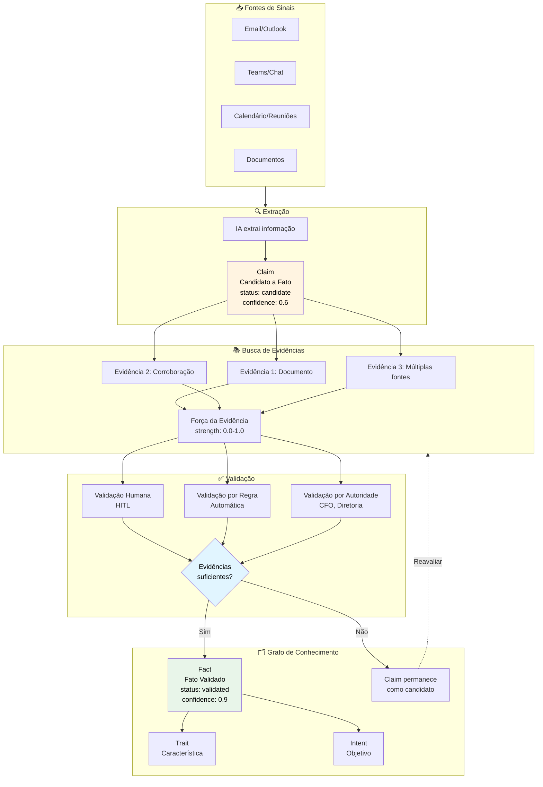

**1. Claim (Afirmação/Candidato)**

Quando o sistema extrai informação de um documento, e-mail ou reunião, ela **não entra direto no grafo como fato**. Ela entra como um **Claim** — uma candidata a fato que precisa ser verificada.

```
(:Claim {
  id: "claim-001",
  content: "O projeto EKS tem orçamento de R$ 500k",
  source: "email-rodrigo-2026-02-10",
  status: "candidate",
  confidence: 0.6
})
```

**2. Evidence (Evidência)**

Para que um Claim se torne um fato, ele precisa de **evidências** que o suportem. Evidências podem ser:
- Outros documentos que mencionam o mesmo fato
- Múltiplas fontes independentes
- Validação por uma autoridade (ex: CFO para informações financeiras)
- Corroboração de conhecimento já validado no grafo

```
(:Evidence {
  id: "ev-001",
  type: "document",
  source: "Planejamento-2026.pdf",
  supports: "claim-001",
  strength: 0.8
})

(:Evidence {
  id: "ev-002",
  type: "corroboration",
  source: "knowledge-k-123",
  supports: "claim-001",
  strength: 0.7
})
```

**3. Validation (Validação)**

Só quando um Claim tem evidências suficientes (ou validação humana explícita) ele se transforma em um **Fato** no grafo:

```
(:Fact {
  id: "fact-001",
  content: "O projeto EKS tem orçamento de R$ 500k",
  validated_at: "2026-02-10T15:00:00Z",
  validated_by: "user-rodrigo",
  trust_score: 0.85
})
```

**Por que isso importa?**

Sem esse pipeline de validação, o grafo se enche de "ruído" — informações não verificadas, contradições, especulações tratadas como fatos. Com Claim → Evidence → Validation, o grafo mantém **integridade epistemológica**: só contém conhecimento que passou por um processo de verificação.

**Analogia Jornalística:**

- **Claim** = "Fonte anônima diz que X aconteceu"
- **Evidence** = "Três fontes independentes confirmam X"
- **Validation** = "Editor aprova publicação"
- **Fact** = "Notícia publicada"

No EKS, o mesmo rigor se aplica: informação não validada não vira fato no grafo.

## 13.1 As cinco etapas do pipeline

Transformar um documento não estruturado em conhecimento estruturado no grafo não é um passo único — é um **pipeline** com cinco etapas distintas:

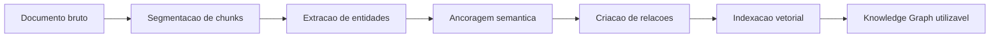

Vamos detalhar cada etapa:

### 1. Segmentação (Chunking)

Documentos grandes são quebrados em **chunks** semanticamente coerentes. Um chunk ideal:

- Representa uma unidade lógica (parágrafo, seção, tópico)
- Tem tamanho entre 500-1500 tokens
- Preserva contexto suficiente para ser compreensível isoladamente

**Estratégias de chunking:**

- **Fixed-size**: chunks de tamanho fixo (simples, mas quebra contexto)
- **Semântico**: divide em mudanças de tópico (melhor qualidade)
- **Hierárquico**: preserva estrutura de seções e subseções

No EKS, usamos chunking semântico com tamanho médio de 800 tokens.

### 2. Extração de Entidades (NER + LLM)

De cada chunk, a IA "lê" o texto e identifica entidades relevantes: pessoas mencionadas, decisões tomadas, tarefas atribuídas, riscos identificados. É como se um estagiário muito atento lesse a transcrição e fizesse fichas para cada informação importante.

Cada entidade extraída segue uma estrutura padronizada (o trecho técnico abaixo mostra os campos — leitores não técnicos podem pular direto para o "Exemplo de extração"):

```python
class ExtractedItem:
    type: str  # "task", "decision", "risk", "insight", "person", "project"
    value: str  # Título ou nome
    description: str
    confidence: float
    related_person: Optional[str]
    related_area: Optional[str]
    priority: Optional[str]
    deadline: Optional[str]
```

**Exemplo de extração:**

**Texto original:**  
*"Na reunião de kickoff, decidimos adotar Neo4j como banco principal do EKS. Rodrigo será o tech lead do projeto, e a primeira entrega está prevista para março."*

**Entidades extraídas:**

```json
[
  {
    "type": "decision",
    "value": "Adotar Neo4j como banco principal",
    "confidence": 0.9,
    "related_person": "Rodrigo"
  },
  {
    "type": "person",
    "value": "Rodrigo",
    "role": "Tech Lead",
    "confidence": 0.95
  },
  {
    "type": "task",
    "value": "Primeira entrega",
    "deadline": "março 2026",
    "confidence": 0.7
  }
]
```

### 3. Ancoragem Semântica (Entity Matching)

Aqui entra um problema sutil mas crucial: nem toda menção a "Rodrigo" no texto é uma nova entidade — provavelmente se refere ao Rodrigo que já existe no grafo. É o mesmo desafio que você enfrenta ao organizar contatos: "Rodrigo Trindade", "Rodrigo T." e "o Rodrigo da TI" são a mesma pessoa? **Ancoragem** é o processo de conectar entidades extraídas a nós existentes, evitando duplicações.

**Estratégias:**

- **Exact match**: nome exato + propriedades (ex: email)
- **Fuzzy match**: similaridade de string (Levenshtein distance)
- **Embedding similarity**: embeddings semânticos do contexto

No EKS, usamos uma combinação: exact match quando possível, embedding similarity quando há ambiguidade.

### 4. Criação de Relações

Entidades extraídas são conectadas tanto entre si quanto a entidades já existentes. É como desenhar setas em um quadro branco: "essa decisão foi feita por esta pessoa e impacta aquele projeto." O código abaixo mostra como isso é feito tecnicamente (leitores não técnicos: o importante é entender que cada conexão tem um *tipo* — "FEITA POR", "IMPACTA", "CONTÉM" — que dá significado à seta):

```cypher
MATCH (d:Document {id: $doc_id})
MATCH (p:Person {name: "Rodrigo Trindade"})
MATCH (proj:Project {name: "EKS"})

CREATE (decision:Decision {
  id: $uuid,
  title: "Adotar Neo4j",
  date: $date,
  confidence: 0.9
})

CREATE (d)-[:CONTAINS]->(decision)
CREATE (decision)-[:MADE_BY]->(p)
CREATE (decision)-[:IMPACTS]->(proj)
```

### 5. Indexação Vetorial Contextualizada

Além do grafo estruturado, cada chunk de texto é transformado em uma representação numérica (um "embedding vetorial") e armazenado como propriedade do próprio nó `:Chunk` no Neo4j, utilizando o **vector index nativo**. Pense nisso como criar uma "impressão digital semântica" de cada trecho: textos com significados parecidos têm impressões digitais parecidas, mesmo que usem palavras diferentes.

Isso permite **busca semântica** diretamente no grafo, encontrando informação por *significado*, não por palavras-chave exatas:

```cypher
// Busca semântica nativa no Neo4j
CALL db.index.vector.queryNodes('chunk_embedding', 5, $queryEmbedding)
YIELD node AS chunk, score
WHERE chunk.memory_class = "semantic"
RETURN chunk.text, score, chunk.doc_id
ORDER BY score DESC
```

A busca vetorial complementa o traversal de grafo: enquanto o grafo responde perguntas estruturadas (*"Quais decisões impactam o projeto X?"*), a busca vetorial responde perguntas semânticas abertas (*"O que sabemos sobre escalabilidade?"*). E como ambos vivem no mesmo banco, uma única query pode combinar os dois.

## 13.2 Agentes especializados do pipeline

Cada etapa do pipeline é executada por um **agente especializado**:

| Agente | Responsabilidade | Modelo usado |
|--------|------------------|--------------|
| **Chunking Agent** | Segmentar documento | Heurísticas + LLM para boundaries |
| **Extraction Agent** | Extrair entidades estruturadas | GPT-4o / Claude 3.5 Sonnet |
| **NER Agent** | Detectar nomes, datas, locais | spaCy + LLM |
| **Matching Agent** | Ancorar entidades no grafo | Embeddings + fuzzy match |
| **Linking Agent** | Criar relações semânticas | LLM com contexto do grafo |

Cada agente é **stateless** e **composable** — pode ser testado, trocado ou melhorado independentemente.

## 13.3 Exemplo real: ingestão de uma transcrição de reunião

**Input:**  
Transcrição de 30 minutos de reunião de planning (arquivo .txt, 8.000 palavras)

**Processamento:**

1. **Chunking**: 12 chunks de ~650 palavras cada
2. **Extraction**: 23 entidades detectadas (7 decisões, 5 tarefas, 4 riscos, 7 menções a pessoas)
3. **Matching**: 15 entidades ancoradas em nós existentes, 8 novas criadas
4. **Linking**: 34 relações criadas
5. **Indexação**: 12 embeddings vetoriais gerados

**Resultado final no grafo:**

- 8 novos nós (Decision, Task, Risk)
- 34 novas relações
- Todos conectados à reunião de origem e aos participantes
- Trust scores atribuídos (0.7-0.9 dependendo da clareza)
- 3 itens marcados para validação humana (confidence < 0.7)

**Tempo total de processamento**: ~45 segundos

> **Em resumo:** O pipeline de ingestão funciona como uma fábrica de conhecimento: um documento entra cru e sai como informação estruturada, classificada, conectada ao contexto existente e pronta para ser consultada. Os cinco estágios (segmentar, extrair, ancorar, conectar, indexar) garantem que nenhuma informação valiosa se perca na tradução.

---

# Capítulo 14: Da Fragmentação à Convergência no Armazenamento

📌 **Resumo para Profissionais de Negócios (leia isto primeiro):**

Este capítulo responde uma pergunta crítica de arquitetura: **"Precisamos de vários bancos de dados diferentes ou um único sistema pode fazer tudo?"**. O valor prático é reduzir complexidade operacional e custo, mantendo (ou melhorando) a performance.

**Se você não é técnico:**
- Leia as seções 14.0, 14.1 (a convergência), 14.5 (quando armazenamento externo é necessário), e 14.7 (guia de decisão)
- Pule as queries Cypher detalhadas (são para engenheiros)
- Tempo de leitura (texto narrativo): ~18 minutos

**Conceito-chave:** Por anos, a sabedoria convencional dizia "cada tipo de dado precisa de um banco especializado". Hoje, o Neo4j moderno funciona como **plataforma convergente** — um único banco que faz grafo + busca semântica + armazenamento de texto. Isso significa menos infraestrutura, menos custo, e consultas mais rápidas (porque tudo está junto).

**Decisão prática:** A seção 14.7 tem um guia de decisão para ajudar você a escolher entre arquitetura convergente (Neo4j único) ou distribuída (múltiplos bancos), baseado no seu contexto específico.

---

## 14.0 O paradigma tradicional: cada tipo de dado, um banco diferente

Durante anos, a sabedoria convencional em sistemas de conhecimento dizia que você precisava de muitos bancos de dados especializados. A lógica era simples e, à primeira vista, convincente:

| Tipo de conhecimento | Banco tradicional | Justificativa histórica |
|----------------------|-------------------|------------------------|
| **Relações estruturadas** | Grafo (Neo4j) | Navegação eficiente entre entidades |
| **Documentos completos** | Documental (MongoDB/S3) | Preserva formatação, permite versioning |
| **Busca semântica** | Vector Store (Pinecone, Weaviate) | Similaridade por embeddings |
| **Séries temporais** | TimeSeries DB | Agregações temporais eficientes |
| **Dados transacionais** | Relacional (PostgreSQL) | ACID, integridade referencial |

Essa abordagem fragmentada funcionava, mas trazia um custo oculto significativo: **cada fronteira entre bancos é uma fronteira onde contexto se perde**. Quando uma query precisa combinar relações do grafo com similaridade vetorial e conteúdo textual, você precisa orquestrar múltiplas chamadas, unir resultados e torcer para que a latência não exploda.

Para projetos iniciais ou equipes experimentando com conhecimento estruturado, essa arquitetura distribuída ainda é uma opção válida. Mas a pergunta que nos interessa é: *precisamos mesmo de tudo isso separado?*

## 14.1 A convergência: quando o grafo absorve as outras funções

A resposta mudou nos últimos anos. O Neo4j evoluiu de um banco de grafos puro para uma **plataforma convergente** que absorve nativamente três das cinco funções da tabela anterior:

**1. Grafo nativo** (sempre foi o core): relações, traversals, inferências ontológicas.

**2. Vector Index nativo** (a partir do Neo4j 5.x): embeddings armazenados como propriedades dos nós, com busca por similaridade usando índices vetoriais nativos. Sem precisar de Pinecone, Weaviate ou qualquer store externo.

**3. Texto em propriedades** (a técnica que exploramos neste capítulo): chunks de documentos armazenados diretamente como propriedades de nós `:Chunk`, com o texto completo do trecho disponível para consulta, enriquecimento e exibição.

Isso significa que, para o EKS, o Neo4j funciona como **o núcleo convergente**: o mesmo banco que armazena relações entre pessoas, projetos e decisões *também* armazena os trechos textuais dos documentos *e* seus vetores para busca semântica.

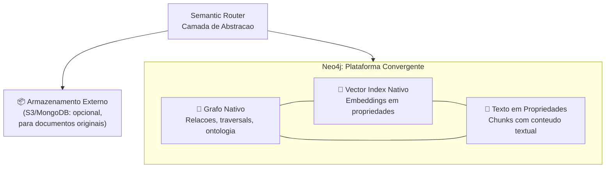

A vantagem dessa convergência não é apenas operacional (menos infraestrutura para manter). É **epistemológica**: quando o grafo, o texto e o vetor vivem juntos, uma única query Cypher pode navegar relações, filtrar por similaridade semântica e retornar o trecho textual relevante, tudo numa transação atômica.

## 14.2 Documento como cidadão do grafo: chunks em propriedades

Esta é a técnica central que torna a convergência possível. Em vez de tratar documentos como objetos opacos armazenados fora do grafo (em MongoDB ou S3), o EKS **decompõe cada documento em chunks e armazena cada chunk como um nó no grafo**, com o texto completo do trecho numa propriedade.

### O modelo

```cypher
(:Document {
  id: string,
  title: string,
  summary: string,          // Resumo gerado na ingestão
  source_type: string,       // "pdf" | "meeting" | "email" | "chat"
  created_at: datetime,
  total_chunks: integer
})

(:Chunk {
  chunk_id: string,          // UUID único
  doc_id: string,            // Referência ao documento pai
  idx: integer,              // Posição sequencial (0-based)
  text: string,              // Conteúdo textual do chunk
  token_count: integer,      // Tamanho em tokens
  embedding: list<float>,    // Vetor para busca semântica (nativo)
  created_at: datetime,
  memory_class: string       // "semantic" | "episodic" | "procedural" | "evaluative"
})

// Relacionamento documento → chunks
(:Document)-[:HAS_CHUNK]->(:Chunk)

// Índice composto para queries de janela
CREATE INDEX chunk_doc_idx FOR (c:Chunk) ON (c.doc_id, c.idx)

// Índice vetorial nativo para busca semântica
CREATE VECTOR INDEX chunk_embedding FOR (c:Chunk) ON (c.embedding)
OPTIONS {indexConfig: {
  `vector.dimensions`: 1536,
  `vector.similarity_function`: 'cosine'
}}
```

### Por que `idx` e não `[:NEXT]`?

Uma decisão de design importante: a sequência dos chunks é determinada pela propriedade `idx` (posição ordinal), e não por relacionamentos `[:NEXT]` encadeados.

| Aspecto | `[:NEXT]` chain | `idx` property |
|---------|-----------------|----------------|
| Query de janela | Requer traversal recursivo | `WHERE idx BETWEEN a AND b` |
| Inserção no meio | Requer atualizar cadeia inteira | Apenas atualizar `idx` dos subsequentes |
| Performance | O(n) para encontrar posição | O(1) com índice composto |
| Paralelismo | Sequencial por natureza | Pode processar em batch |

Pense assim: é a diferença entre procurar uma página num livro cujas páginas são amarradas por barbante (precisa seguir a sequência) e um livro com números de página (vai direto).

### Queries práticas

**Recuperar o chunk central + vizinhos (janela de contexto):**

```cypher
MATCH (c:Chunk {chunk_id: $chunkId})
WITH c.doc_id AS docId, c.idx AS centerIdx
MATCH (w:Chunk {doc_id: docId})
WHERE w.idx BETWEEN centerIdx - $k AND centerIdx + $k
RETURN w ORDER BY w.idx
```

**Busca semântica + texto + relações numa única query:**

```cypher
// 1. Busca vetorial: encontra chunks similares
CALL db.index.vector.queryNodes('chunk_embedding', 5, $queryEmbedding)
YIELD node AS chunk, score

// 2. Contexto textual: retorna o texto do chunk
WITH chunk, score

// 3. Contexto relacional: navega até as entidades extraídas
MATCH (chunk)<-[:HAS_CHUNK]-(doc:Document)
OPTIONAL MATCH (chunk)-[:MENTIONS]->(entity)
RETURN chunk.text, score, doc.title, collect(entity.name) AS entities
ORDER BY score DESC
```

Essa query faz algo que seria impossível (ou muito custoso) numa arquitetura fragmentada: numa única operação, busca por similaridade vetorial, retorna o texto original e navega o grafo para encontrar entidades relacionadas.

### Limites e considerações práticas

Propriedades de nós no Neo4j podem armazenar strings de até **~2GB** por propriedade, o que acomoda confortavelmente chunks típicos de 500-2000 tokens (~2000-8000 caracteres). Na prática, chunks são deliberadamente pequenos para otimizar a qualidade dos embeddings, então o limite de propriedade nunca é um gargalo.

O que **não** faz sentido armazenar como propriedade: o documento original completo com toda sua formatação (um PDF de 200 páginas, por exemplo). Para isso, um armazenamento externo como S3 continua sendo a melhor opção. Mas o *conteúdo textual já segmentado* vive perfeitamente no grafo.

## 14.3 TopicBlock: o chunk semântico

Além do chunk técnico (segmentado por tamanho de tokens), o EKS trabalha com uma unidade de maior granularidade semântica: o **TopicBlock**. Enquanto o chunk é uma divisão técnica, o TopicBlock é uma divisão por *assunto*.

| Conceito | Propósito | Granularidade |
|----------|-----------|---------------|
| **Chunk** | Técnico (embedding, busca vetorial) | Arbitrário (por tokens) |
| **TopicBlock** | Recuperação temática | Bloco de assunto coerente |

Um TopicBlock pode conter um ou mais chunks, e possui metadados mais ricos:

```cypher
(:TopicBlock {
  id: string,
  raw_text: string,              // Texto original do bloco
  summary: string,               // Síntese para display
  topic_label: string,           // Rótulo do tema
  intent_tags: list<string>,     // Intenções que este bloco responde
  confidence: float
})

(:Document)-[:HAS_TOPIC_BLOCK]->(:TopicBlock)
(:TopicBlock)-[:FOLLOWED_BY]->(:TopicBlock)    // Sequência temática
(:TopicBlock)-[:CONTAINS_CHUNK]->(:Chunk)       // Relação com chunks técnicos
(:TopicBlock)-[:RELATES_TO]->(:Concept)         // Ancoragem ontológica
```

O TopicBlock responde à pergunta *"sobre o que este trecho fala?"*, enquanto o Chunk responde *"qual trecho é mais vetorialmente similar à minha pergunta?"*. Juntos, eles formam um sistema de recuperação em duas camadas: precisão semântica (vetor) e coerência temática (tópico).

## 14.4 Camada de abstração: o Semantic Router

Mesmo numa arquitetura convergente, nem toda pergunta se resolve da mesma forma. O **Semantic Router** é o componente inteligente que recebe uma pergunta do usuário e decide *como* consultar o Neo4j: por traversal de grafo, por busca vetorial, por combinação de ambos, ou, quando necessário, buscando complemento num armazenamento externo.

**Exemplo 1: Query estruturada (grafo puro)**

**Pergunta:** *"Quais projetos estão conectados ao objetivo de modernização tecnológica?"*

```cypher
MATCH (o:Objective {name: "Modernização tecnológica"})-[*1..2]-(p:Project)
RETURN p.name, p.status;
```

**Exemplo 2: Busca semântica (vetor nativo)**

**Pergunta:** *"O que foi discutido sobre escalabilidade nas últimas reuniões?"*

```cypher
CALL db.index.vector.queryNodes('chunk_embedding', 10, $queryEmbedding)
YIELD node AS chunk, score
WHERE chunk.memory_class = "episodic"
MATCH (chunk)<-[:HAS_CHUNK]-(doc:Document {source_type: "meeting"})
RETURN chunk.text, score, doc.title
ORDER BY score DESC
```

**Exemplo 3: Combinação grafo + vetor + texto**

**Pergunta:** *"Quem participou da decisão de migrar para cloud e qual foi a justificativa?"*

```cypher
MATCH (d:Decision {title: "Migrar para cloud"})-[:MADE_BY]->(p:Person)
MATCH (d)-[:EXTRACTED_FROM]->(doc:Document)-[:HAS_CHUNK]->(c:Chunk)
WHERE c.text CONTAINS "cloud" OR c.text CONTAINS "migração"
RETURN p.name, d.rationale, c.text, c.idx
ORDER BY c.idx
```

Tudo no mesmo banco, numa única transação.

## 14.5 Quando armazenamento externo ainda é necessário

Seria desonesto dizer que o Neo4j substitui *tudo*. Existem cenários onde armazenamento externo continua fazendo sentido:

| Cenário | Recomendação | Razão |
|---------|--------------|-------|
| Preservar documento original (PDF, DOCX) | **S3 / Blob Storage** | Formatação original, download pelo usuário |
| Séries temporais de alta frequência | **TimeSeries DB** | Agregações temporais especializadas |
| Dados transacionais pesados | **PostgreSQL** | ACID com joins complexos em tabelas |
| Logs e telemetria em volume | **Elasticsearch / ClickHouse** | Busca em texto não estruturado em massa |

A diferença da abordagem convergente é que esses armazenamentos externos são **complementos opcionais**, não peças obrigatórias. O conhecimento semântico (relações, chunks textuais, embeddings) vive integralmente no Neo4j. O S3, por exemplo, guarda apenas o *arquivo original* para download, enquanto todo o conteúdo já extraído, enriquecido e conectado reside no grafo.

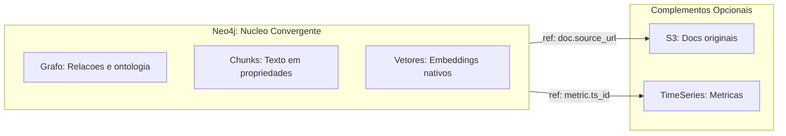

## 14.6 Trade-offs: abordagem convergente vs. distribuída

| Aspecto | Convergente (Neo4j unificado) | Distribuída (múltiplos bancos) |
|---------|-------------------------------|--------------------------------|
| **Complexidade ops** | Menor (um banco principal) | Maior (múltiplos bancos para manter) |
| **Queries cross-domain** | Uma transação atômica | Orquestração multi-hop com latência |
| **Consistência** | ACID nativo | Eventual, requer reconciliação |
| **Escala de texto** | Boa para chunks, não para docs inteiros | Melhor para volumes massivos de texto bruto |
| **Curva de aprendizado** | Cypher resolve quase tudo | Múltiplas linguagens/APIs |
| **Custo** | Neo4j Aura pode ser suficiente | Múltiplas assinaturas e integrações |

Para o EKS, a escolha pela convergência no Neo4j não é dogmática. É pragmática: o tipo de conhecimento que o sistema gerencia (relações entre entidades, trechos textuais com semântica, embeddings para busca) se encaixa naturalmente nas capacidades do Neo4j moderno. Quando surgir um requisito que extrapole essas capacidades (como servir o PDF original para download), o sistema delega para o armazenamento mais adequado.

## 14.7 Guia de Decisão: Convergente ou Distribuída?

Para ajudar a tomar a decisão mais adequada ao seu contexto específico, use este guia baseado em perguntas práticas:

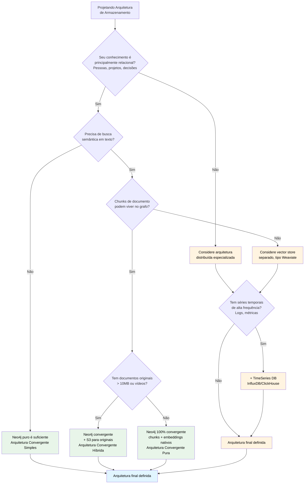

### Cenários Típicos e Recomendações

| Cenário | Volume de Dados | Complexidade Relacional | Recomendação |
|---------|----------------|------------------------|--------------|
| **Startup/Empresa pequena<br/>Conhecimento relacional e documental** | < 100k nós<br/>< 10GB docs | Alta<br/>(muitas conexões entre entidades) | ✅ **Neo4j Convergente Puro**<br/>Chunks + embeddings + grafo tudo nativo. Simplicidade operacional máxima. |
| **Empresa média<br/>Documentos grandes (PDFs, contratos)** | < 500k nós<br/>< 100GB docs | Alta | ✅ **Neo4j Convergente Híbrida**<br/>Chunks no grafo, originais no S3. Melhor custo/benefício. |
| **Enterprise<br/>Logs massivos + conhecimento** | > 1M nós<br/>> 500GB docs<br/>+ logs contínuos | Alta<br/>+ séries temporais | ⚠️ **Distribuída Especializada**<br/>Neo4j (grafo) + Vector Store (Pinecone) + TimeSeries DB (ClickHouse) + S3 (docs). Mais complexo, mas necessário. |
| **Sistema legado<br/>Migrando gradualmente** | Variável | Baixa inicialmente<br/>(silos desconectados) | ✅ **Neo4j Convergente + APIs externas**<br/>Começa convergente, integra legado via API. Permite migração incremental. |
| **SaaS B2B<br/>Multi-tenant com RAG** | < 1M nós<br/>por tenant | Alta por tenant<br/>Baixa entre tenants | ✅ **Neo4j Convergente Multi-tenant**<br/>Database por tenant ou namespace. Vector index nativo simplifica stack. |

### Checklist de Decisão

Marque os itens que se aplicam ao seu projeto:

**Indicadores para Arquitetura Convergente (Neo4j como plataforma única):**

- [ ] Conhecimento primariamente relacional (pessoas, projetos, entidades conectadas)
- [ ] Documentos podem ser divididos em chunks de < 2000 tokens
- [ ] Busca semântica é um requisito, mas volume de texto < 100GB
- [ ] Time pequeno (não quer gerenciar múltiplos bancos)
- [ ] Prioridade: simplicidade operacional e redução de latência cross-system
- [ ] Queries frequentemente combinam grafo + vetor + texto na mesma consulta
- [ ] Orçamento para uma plataforma robusta, mas não múltiplas assinaturas

**Se marcou 5+ itens acima:** Arquitetura Convergente é sua melhor aposta.

**Indicadores para Arquitetura Distribuída (Múltiplos bancos especializados):**

- [ ] Documentos originais são massivos (vídeos, PDFs de 100+ páginas)
- [ ] Volume de vetores > 10M embeddings por tenant
- [ ] Séries temporais de alta frequência (logs, métricas) são requisito
- [ ] Time experiente em DevOps e gerenciamento de infraestrutura distribuída
- [ ] Casos de uso isolados (ex: RAG sem grafo relacional, ou grafo sem busca semântica)
- [ ] Budget disponível para múltiplas plataformas especializadas
- [ ] Necessidade de otimizações extremas por tipo de dado

**Se marcou 5+ itens acima:** Arquitetura Distribuída pode ser justificada, mas prepare-se para complexidade operacional.

**Se marcou itens em ambas as listas:** Comece convergente, escale para distribuída se/quando necessário. É mais fácil adicionar um banco especializado depois do que gerenciar múltiplos desde o dia 1.

### Exemplo Prático de Decisão: O Projeto EKS

**Contexto:**
- Conhecimento organizacional (pessoas, projetos, decisões, reuniões)
- Documentos: specs, transcrições de reuniões, relatórios (< 50GB)
- Chunks médios: 800 tokens
- Embeddings: ~50k vetores inicialmente (crescimento gradual)
- Time: 3 engenheiros
- Prioridade: velocidade de iteração e simplicidade

**Decisão:** Neo4j Convergente Puro
- Chunks armazenados como `:Chunk` nodes com propriedade `text`
- Embeddings nativos com `CREATE VECTOR INDEX`
- Documentos originais (PDFs) em S3 apenas para download, mas *todo o conteúdo* já extraído vive no grafo
- Resultado: 1 sistema principal, queries atômicas, deployment simples

**Revisão futura:** Se o volume de documentos ultrapassar 500GB ou o número de vetores ultrapassar 10M, considera-se adicionar Pinecone/Weaviate. Mas até lá, a convergência simplifica tudo.

### Valor para Negócios: Por Que Isso Importa

Para gestores e executivos, a escolha da arquitetura impacta diretamente:

- **Custo Total de Propriedade (TCO):** Cada banco adicional = assinatura + tempo de gestão + custo de sincronização. Arquitetura convergente reduz TCO.
- **Velocidade de Entrega (Time-to-Market):** Menos integrações = mais rápido. Se o time consegue iterar numa semana em vez de um mês, o ROI chega mais cedo.
- **Risco Operacional:** Sistemas distribuídos têm mais pontos de falha. Se um vector store cai, metade das funcionalidades para. Com convergência, há um único ponto de atenção.
- **Escalabilidade Financeira:** Neo4j Aura escala vertical e horizontalmente. Muitas vezes, pagar mais pelo Neo4j ainda sai mais barato que gerenciar 3 sistemas separados.

**Recomendação final:** Para a maioria dos casos de EKS corporativo, comece convergente. Adicione especialização apenas quando justificado por escala ou requisitos extremos. A simplicidade arquitetural é, em si, uma vantagem competitiva.

### Em resumo: Capítulo 14

A sabedoria convencional dizia que um sistema de conhecimento precisa de muitos bancos de dados especializados. Isso era verdade quando bancos de grafos só faziam grafos, e vetores precisavam de stores separados. O Neo4j moderno mudou essa equação: com vector index nativo e a possibilidade de armazenar chunks textuais como propriedades de nós, ele funciona como uma plataforma convergente que unifica grafo, texto e vetor num único banco de dados. No EKS, cada documento é decomposto em chunks que vivem como nós no grafo, com texto acessível, embeddings nativos e posição sequencial via `idx`. Armazenamento externo (S3 para originais, TimeSeries para métricas) continua existindo como complemento opcional, não como peça obrigatória. O Semantic Router orquestra tudo, decidindo se a resposta vem de um traversal de grafo, uma busca vetorial, ou uma combinação de ambos. O resultado é um sistema mais simples de operar, mais rápido de consultar e mais coerente epistemologicamente: o conhecimento vive junto, conectado, num único lugar.

---

# Capítulo 15: Agentes Orientados por Ontologia

📌 **Resumo para Profissionais de Negócios (leia isto primeiro):**

Este capítulo explica **por que os agentes do EKS são muito mais inteligentes que chatbots comuns**. O valor prático é ter assistentes de IA que entendem sua organização — não apenas respondem perguntas genéricas.

**Se você não é técnico:**
- Leia as seções 15.1 (diferença entre chatbot e agente semântico), 15.1.1 (4 classes de memória), 15.1.2 (Personal Lead Agent), e 15.2 (Onboarding)
- Pule as tabelas técnicas de agentes especializados (são para engenheiros)
- Tempo de leitura (texto narrativo): ~22 minutos

**Conceito-chave:** Um chatbot comum busca texto e gera respostas. Um agente orientado por ontologia **consulta primeiro a estrutura formal do conhecimento** (quem faz o quê, quais projetos servem quais objetivos) e só depois gera a resposta. É como contratar um consultor que já conhece sua empresa vs um que nunca ouviu falar dela.

**Destaque:** O **Personal Lead Agent (PLA)** é seu orquestrador pessoal — ele aprende seus padrões, conhece seus objetivos, e despacha trabalho para agentes especializados com contexto completo. Cada usuário tem seu próprio PLA que melhora com o tempo.

---

*Imagine que você contrata um novo consultor para sua empresa. Na primeira semana, ele recebe acesso a todos os documentos e sistemas — mas sem explicação nenhuma. Ele pode até ler tudo, mas não entende como as peças se encaixam. Agora imagine um segundo consultor que, no primeiro dia, recebe um mapa completo da organização: quem faz o quê, como os projetos se conectam aos objetivos, quais decisões foram tomadas e por quê. Esse segundo consultor é infinitamente mais eficaz. A diferença entre um chatbot comum e um agente orientado por ontologia é exatamente essa: o agente semântico "entende" a estrutura do negócio antes de responder qualquer pergunta.*

## 15.1 O que faz um agente "semântico"

A maioria dos chatbots baseados em LLM funciona assim:

1. Recebe pergunta
2. Busca contexto em um vector store
3. Monta prompt com contexto
4. LLM gera resposta

Isso funciona para perguntas gerais, mas falha em domínios especializados porque o agente não "entende" a estrutura do domínio.

Um **agente orientado por ontologia** é diferente:

1. Recebe pergunta
2. **Consulta a ontologia** para entender quais entidades e relações são relevantes
3. **Executa queries estruturadas** no grafo para obter fatos precisos
4. **Complementa com busca vetorial** se necessário
5. LLM gera resposta **baseada em fatos verificáveis**, não em geração livre

A diferença fundamental: o agente **raciocina sobre a estrutura formal do conhecimento**, não apenas sobre texto.

## 15.1.1 As 4 Classes de Memória Cognitiva: Como o Sistema "Lembra"

O EKS não trata todo conhecimento da mesma forma. Inspirado em ciência cognitiva, o sistema classifica conhecimento em **4 classes de memória**, cada uma com características, estratégias de recuperação e regras de envelhecimento diferentes. A analogia com memória humana é poderosa: todos entendem que esquecemos coisas, que memórias procedurais (andar de bicicleta) são diferentes de memórias episódicas (o que almocei ontem).

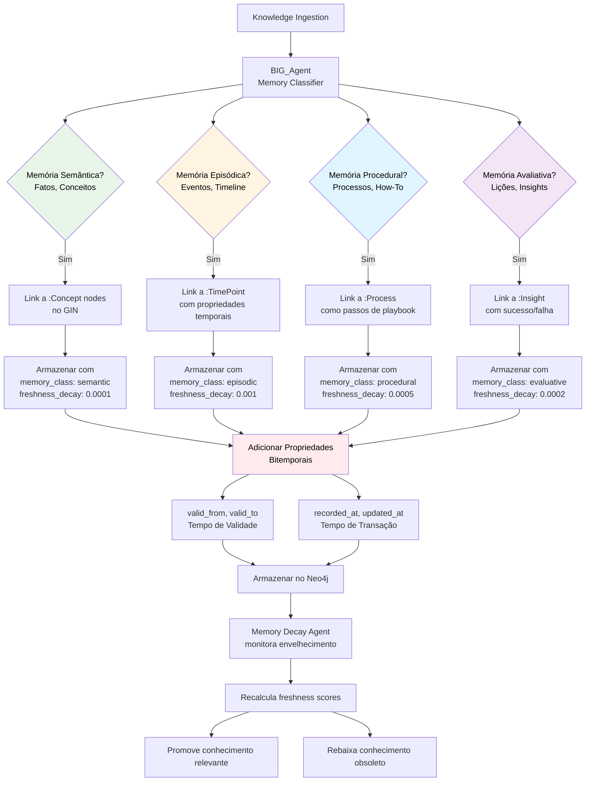

**1. Memória Semântica — Conceitos e Definições**

A memória semântica armazena **fatos permanentes sobre o mundo** — conceitos, definições, ontologias. É como saber que "Paris é a capital da França" — um fato que não muda com o tempo.

**No EKS:**
- Ontologias e definições formais
- Conceitos de negócio ("O que é um OKR?")
- Estruturas organizacionais estáveis
- Propriedades de entidades

**Características:**
- **Estabilidade**: Muda raramente (só quando a ontologia evolui)
- **Freshness decay**: Muito lento (lambda ≈ 0.0001)
- **Recuperação**: Por consulta direta ou navegação hierárquica
- **Ancoragem**: Linkada a nós `:Concept` no GIN

**Exemplo:**
```
(:Knowledge {
  content: "OKR é um objetivo mensurável com 3-5 key results",
  memory_class: "semantic",
  linked_to: (:Concept {name: "OKR"}),
  freshness_decay_rate: 0.0001
})
```

**2. Memória Episódica — Eventos e Timeline**

A memória episódica armazena **o que aconteceu, quando e com quem** — eventos, reuniões, decisões pontuais. É como lembrar "ontem almocei sushi" — um evento específico no tempo.

**No EKS:**
- Reuniões e seus resultados
- Decisões tomadas em momentos específicos
- Eventos organizacionais
- Timeline de projetos

**Características:**
- **Temporalidade**: Fortemente ligada a pontos no tempo
- **Freshness decay**: Moderado (lambda ≈ 0.001) — eventos recentes são mais relevantes
- **Recuperação**: Por queries temporais ("O que aconteceu em janeiro?")
- **Ancoragem**: Linkada a nós `:TimePoint` no GIN

**Exemplo:**
```
(:Knowledge {
  content: "Decisão de adotar Neo4j tomada em reunião de 15/01/2026",
  memory_class: "episodic",
  linked_to: (:TimePoint {date: "2026-01-15"}),
  freshness_decay_rate: 0.001
})
```

**3. Memória Procedural — Processos e How-Tos**

A memória procedural armazena **como fazer coisas** — processos, playbooks, procedimentos. É como saber "andar de bicicleta" — conhecimento sobre ação, não sobre fatos.

**No EKS:**
- Processos organizacionais
- Playbooks e guias
- Procedimentos operacionais
- Workflows

**Características:**
- **Ação-orientada**: Foca em "como", não em "o quê"
- **Freshness decay**: Lento (lambda ≈ 0.0005) — processos mudam raramente
- **Recuperação**: Por contexto de ação ("Como fazer deploy?")
- **Ancoragem**: Linkada a nós `:Process` no GIN

**Exemplo:**
```
(:Knowledge {
  content: "Processo de deploy: 1) Testes, 2) Staging, 3) Produção",
  memory_class: "procedural",
  linked_to: (:Process {name: "Deploy Process"}),
  freshness_decay_rate: 0.0005
})
```

**4. Memória Avaliativa — Lições e Insights**

A memória avaliativa armazena **o que funcionou e o que não funcionou** — lições aprendidas, insights, avaliações. É como saber "não confie em fornecedores únicos" — sabedoria derivada de experiência.

**No EKS:**
- Lições aprendidas de projetos
- Insights estratégicos
- Avaliações de decisões passadas
- Padrões de sucesso/falha

**Características:**
- **Valor-orientada**: Foca em "o que vale a pena" e "o que evitar"
- **Freshness decay**: Variável — insights recentes são mais relevantes, mas sabedoria consolidada perdura
- **Recuperação**: Por contexto de decisão ("O que aprendemos sobre X?")
- **Ancoragem**: Linkada a nós `:Insight` no GIN

**Exemplo:**
```
(:Knowledge {
  content: "Aprendemos que dependência de fornecedor único aumenta risco em 3x",
  memory_class: "evaluative",
  linked_to: (:Insight {type: "lesson_learned"}),
  freshness_decay_rate: 0.0002
})
```

**Modelo Bitemporal Completo**

Cada classe de memória implementa **bitemporalidade** (do Capítulo 11), mas com nuances:

- **Valid Time** (tempo de validade): Quando o fato era verdadeiro no mundo real
  - Semântica: "Desde quando esse conceito existe?"
  - Episódica: "Quando esse evento aconteceu?"
  - Procedural: "Desde quando esse processo é válido?"
  - Avaliativa: "Quando essa lição foi aprendida?"

- **Transaction Time** (tempo de transação): Quando o fato foi registrado no sistema
  - Todas as classes: "Quando o sistema tomou conhecimento disso?"

**Memory Decay Agent: Gerenciando o Envelhecimento**

Um agente autônomo — o **Memory Decay Agent** — monitora continuamente o envelhecimento do conhecimento:

- Recalcula freshness scores baseado no tempo desde a última validação
- Promove conhecimento relevante (aumenta prioridade)
- Rebaixa conhecimento obsoleto (diminui prioridade)
- Sugere revalidação para conhecimento crítico que está envelhecendo

**Memory Service API**

Todas as classes de memória são acessadas através de uma **Memory Service API** padronizada, que permite:

- Recuperar conhecimento por classe de memória
- Filtrar por temporalidade (valid time, transaction time)
- Combinar múltiplas classes em uma única query
- Respeitar ancoragem ao GIN (só retorna conhecimento relevante aos objetivos do usuário)

**Valor para Negócios:**

Para público de negócios, as 4 Classes de Memória explicam **por que o sistema "lembra" algumas coisas melhor que outras** e **como ele decide o que buscar quando você faz uma pergunta**. É como ter um assistente que sabe a diferença entre "o que é" (semântica), "o que aconteceu" (episódica), "como fazer" (procedural) e "o que aprendemos" (avaliativa) — e busca o tipo certo de memória para cada tipo de pergunta.

## 15.1.2 Personal Lead Agent (PLA): De Roteador a Orquestrador Inteligente

A maioria dos sistemas de IA simplesmente "roteia" uma pergunta para um agente especializado, como um atendente de call center que transfere ligações para departamentos. O **Personal Lead Agent (PLA)** vai muito além: ele é um orquestrador sofisticado que **aprende com você**, entende seus objetivos estratégicos e planeja a melhor forma de responder cada pergunta.

**A Evolução: Roteador Simples → PLA**

Um roteador simples funciona assim:
1. Recebe pergunta
2. Classifica intenção ("O que o usuário quer?")
3. Escolhe agente especializado
4. Executa

O PLA adiciona múltiplas camadas de inteligência:

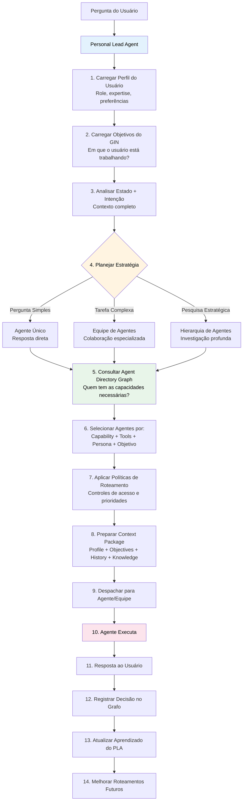

**1. Carregamento de Perfil**

O PLA conhece você: seu cargo, departamento, projetos em que trabalha, expertise, preferências de comunicação. Essa informação vem do seu **Persona Knowledge Profile (PKP)** e é atualizada continuamente.

**2. Carregamento de Objetivos**

O PLA consulta o **Business Intent Graph (GIN)** e identifica: "Em quais objetivos estratégicos este usuário está trabalhando agora?". Isso permite que cada resposta seja contextualizada pelos objetivos reais do usuário, não apenas pela pergunta isolada.

**3. Análise de Estado + Intenção**

Em vez de apenas perguntar "O que o usuário quer?", o PLA analisa:
- Qual é a intenção imediata? (criar tarefa, buscar conhecimento, tomar decisão)
- Qual é o contexto atual do usuário? (projeto em que está alocado, deadline próximo, riscos ativos)
- Qual objetivo estratégico isso serve?

**4. Planejamento de Estratégia de Execução**

Aqui está a grande diferença. O PLA decide **como** responder, não apenas **quem** responde:

| Estratégia | Quando Usar | Exemplo |
|-----------|-------------|---------|
| **Agente Único** | Pergunta simples, resposta direta | "Qual o email do João?" |
| **Equipe de Agentes** | Tarefa complexa que exige múltiplas expertises | "Analise viabilidade financeira e técnica do Projeto X" |
| **Hierarquia de Agentes** | Pergunta estratégica que exige investigação profunda | "Quais riscos históricos podem afetar nossa expansão internacional?" |

**5-6. Agent Directory Graph: O Catálogo de Especialistas**

O PLA não "conhece" todos os agentes de memória. Ele consulta o **Agent Directory Graph**, um catálogo rico com metadados sobre cada agente:

- **Capabilities**: O que o agente sabe fazer (análise financeira, geração de código, curadoria ontológica)
- **Tools**: Quais ferramentas o agente tem acesso (Neo4j, APIs externas, MCPs)
- **Persona**: Como o agente se comunica (técnico, executivo, didático)
- **Objetivo Alignment**: Para quais objetivos estratégicos o agente é relevante

**Exemplo de Query ao Agent Directory:**

```cypher
// O PLA procura agentes que tenham a capacidade necessária
// e estejam alinhados ao objetivo do usuário
MATCH (user:User {id: $userId})-[:WORKING_ON]->(objective:Objective)
MATCH (agent:Agent)-[:HAS_CAPABILITY]->(cap:AgentCapability {name: "financial_analysis"})
MATCH (agent)-[:RELEVANT_FOR]->(objective)
RETURN agent
ORDER BY agent.trust_score DESC, agent.usage_count DESC
```

**7. Aplicação de Políticas de Roteamento**

Antes de despachar, o PLA aplica políticas:

- **Controle de acesso**: O usuário tem permissão para usar este agente?
- **Prioridade organizacional**: Agentes críticos (ex: Compliance) têm prioridade em certos contextos
- **Carga**: Se um agente está sobrecarregado, rotear para alternativa
- **Tempo**: Certos agentes só operam em horário comercial (ex: agentes que acionam humanos)

**8. Context Package: O Briefing Completo**

O PLA não apenas "passa a pergunta" para o agente. Ele prepara um **Context Package** estruturado:

```json
{
  "user_profile": {
    "name": "Ana Silva",
    "role": "Gerente de Produto",
    "department": "Tecnologia",
    "current_projects": ["EKS v2", "Migração Cloud"]
  },
  "current_objectives": [
    {"id": "obj-123", "title": "Modernização Tecnológica", "progress": 0.65}
  ],
  "conversation_history": [
    {"role": "user", "content": "...", "timestamp": "..."},
    {"role": "assistant", "content": "...", "timestamp": "..."}
  ],
  "relevant_knowledge": [
    {"chunk_id": "...", "content": "...", "relevance": 0.9}
  ],
  "retrieval_summary": "Buscou 3 itens semânticos, 2 episódicos",
  "tokens_estimated": 1850
}
```

Esse pacote garante que o agente especializado tem **todo o contexto necessário** para responder de forma personalizada e relevante.

**9-11. Execução e Resposta**

O agente (ou equipe de agentes) executa com o contexto completo. O usuário recebe a resposta, sem saber toda a orquestração que aconteceu nos bastidores.

**12-14. Aprendizado Contínuo**

Aqui está o segredo do PLA: **ele aprende**. Cada decisão de roteamento é registrada no grafo com metadata:

```cypher
(:RoutingDecision {
  user_id: "user-123",
  query: "Analise viabilidade do Projeto X",
  strategy_chosen: "team_based",
  agents_used: ["financial_analyst", "risk_evaluator"],
  execution_time_ms: 2300,
  user_satisfaction: 0.9, // feedback explícito ou implícito
  task_completed: true,
  timestamp: datetime()
})
```

O PLA analisa esses logs e melhora:

- **Aprendizado individual**: "Ana sempre prefere respostas técnicas detalhadas, não executivas resumidas"
- **Aprendizado coletivo**: "Gerentes de produto geralmente preferem o Agente Estratégico para perguntas sobre roadmap"
- **Detecção de padrões**: "Perguntas sobre compliance sempre devem acionar validação humana (HITL)"

**Agent Directory Graph: A Infraestrutura de Conhecimento sobre Agentes**

O Agent Directory Graph é como um "LinkedIn" dos agentes: cada agente tem um "perfil" rico que o PLA consulta antes de despachar trabalho.

**Exemplo de estrutura:**

```cypher
(:Agent {
  id: "financial-analyst",
  name: "Analista Financeiro",
  scope: "global", // disponível para toda a organização
  trust_score: 0.92,
  usage_count: 1523
})
-[:HAS_CAPABILITY]->(:AgentCapability {name: "financial_analysis", description: "..."})
-[:USES_TOOL]->(:Tool {name: "Neo4j", type: "database"})
-[:USES_TOOL]->(:Tool {name: "Python Financial Library", type: "mcp"})
-[:HAS_PERSONA]->(:Persona {style: "executive", tone: "formal", detail_level: "summary"})
-[:RELEVANT_FOR]->(:Objective {title: "Eficiência Financeira"})
```

**Comparação: Roteador Simples vs PLA**

| Aspecto | Roteador Simples | Personal Lead Agent (PLA) |
|---------|------------------|---------------------------|
| **Escopo** | Apenas classificação de intenção | Estado + Intenção + Objetivos |
| **Seleção de Agente** | Match por capacidade | Match por capability + tools + persona + objetivo |
| **Contexto** | Histórico de conversa | Profile + Objectives + Preferences + History + Knowledge |
| **Execução** | Sempre um agente único | Adaptativa: Single / Team / Hierárquica |
| **Aprendizado** | Nenhum | Aprende com resultados, melhora roteamento |
| **Personalização** | Genérico para todos | Instância PLA por usuário |
| **Integração** | Standalone | BIG + PKP + Agent Directory + CDC |

**Equipe de Agentes: Colaboração Orquestrada**

Quando a pergunta é complexa, o PLA não escolhe apenas um agente. Ele monta uma **equipe**:

**Exemplo: "Avalie a viabilidade do novo projeto de expansão"**

O PLA detecta que a pergunta exige múltiplas expertises:

1. **Financial Analyst Agent**: Analisa ROI, custos, projeções
2. **Risk Evaluator Agent**: Identifica riscos históricos e novos
3. **Strategic Agent**: Conecta a decisão aos OKRs estratégicos
4. **Master Agent**: Consolida as análises em uma recomendação final

Cada agente trabalha em paralelo ou sequencialmente, e o PLA garante que as saídas sejam compatíveis e consolidadas.

**Políticas de Roteamento: Controle Organizacional**

O PLA respeita políticas definidas pela organização:

- **Política de Compliance**: Decisões financeiras acima de R$100k sempre acionam o Compliance Agent + HITL
- **Política de Privacidade**: Perguntas sobre dados pessoais de colaboradores só podem ser respondidas por agentes com permissão especial
- **Política de Carga**: Se o "Agente Financeiro" está com fila >10 requisições, rotear para "Agente Financeiro Secundário"
- **Política de Horário**: Agentes que acionam humanos (HITL) só operam em horário comercial; fora dele, acumulam na fila

**Valor para Negócios:**

Para público de negócios, o PLA é a diferença entre um "chatbot que responde perguntas" e um "assistente pessoal que te conhece". Imagine um assistente executivo que:
- Sabe quais são suas prioridades atuais (do GIN)
- Conhece seu estilo de trabalho (do PKP)
- Entende quais especialistas chamar para cada tipo de problema (do Agent Directory)
- Aprende com o tempo (de cada interação)
- Monta equipes quando necessário (orquestração)

O PLA transforma o EKS de um sistema reativo (você pergunta, ele responde) em um sistema **adaptativo e proativo** — que melhora quanto mais você usa.

## 15.2 Agente de onboarding: contexto adaptativo

**Função:**  
Quando um novo usuário entra no sistema, o agente de onboarding constrói um perfil inicial e adapta o contexto às necessidades do usuário.

**Como usa a ontologia:**

*Para personalizar a experiência do usuário, o agente primeiro consulta o grafo para entender quem é essa pessoa — qual seu papel, em que departamento trabalha e de quais projetos participa. Essa consulta é o equivalente a perguntar "quem é você e o que importa para você?" na linguagem do grafo:*

```cypher
// Identifica o papel do usuário
MATCH (u:User {id: $user_id})-[:HAS_ROLE]->(r:Role)
MATCH (u)-[:BELONGS_TO]->(d:Department)
MATCH (u)-[:PARTICIPATES_IN]->(p:Project)
RETURN r.name AS role, d.name AS dept, collect(p.name) AS projects;
```

Com base no papel, o agente personaliza:

- **Para um Gerente de Projeto:** Mostra status de projetos, tarefas pendentes, riscos não mitigados
- **Para um Analista de Negócios:** Mostra OKRs, conexões estratégicas, insights recentes
- **Para um Desenvolvedor:** Mostra tarefas técnicas, documentação relevante, dependências

**Exemplo de interação:**

> **Sistema:** Olá, Maria! Vi que você é Gerente do Projeto Alpha. Quer que eu mostre o status atual, riscos recentes ou tarefas da equipe?

## 15.2.1 Persona Knowledge Profile (PKP): Personalização que Evolui

A maioria dos sistemas pede informações uma vez no onboarding e nunca mais atualiza. Com o tempo, o perfil fica desatualizado e a personalização deixa de funcionar.

O **Persona Knowledge Profile (PKP)** é diferente: ele começa com 6 perguntas rápidas (onboarding em <2 minutos) e depois **evolui continuamente** conforme o sistema observa seu comportamento, extrai informações de fontes confiáveis (LinkedIn, documentos) e propõe atualizações que você valida.

**Onboarding Rápido: 6 Perguntas (<2 minutos)**

Para evitar "fadiga de formulário", o onboarding inicial é mínimo:

1. Qual seu cargo/função?
2. Tem experiência com IA/LLMs?
3. Prefere respostas técnicas ou executivas?
4. Quais ferramentas usa no dia a dia?
5. Em quais projetos/objetivos está focado agora?
6. Como prefere receber notificações? (push, email, resumo diário)

Essas 6 perguntas criam um **perfil base** suficiente para personalização inicial.

**Progressive Profiling: O Perfil Cresce com o Tempo**

Após o onboarding, o sistema continua aprendendo sobre você através de:

1. **Extração de LinkedIn**: Skills, experiência, formação acadêmica
2. **Documentos que você cria/edita**: Indica expertise e áreas de atuação
3. **Interações com o sistema**: Tipos de perguntas que você faz, agentes que você usa
4. **Feedback explícito**: Quando você aprova/rejeita respostas

**Exemplo de evolução:**

```
Dia 1 (Onboarding):
- Cargo: Gerente de Produto
- Experiência IA: Intermediário
- Ferramentas: Notion, Jira

Dia 30 (Sistema observa):
- Usuário faz muitas perguntas sobre métricas → Sugestão: adicionar "Analytics" como interesse
- Usuário cria documentos técnicos → Sugestão: ajustar nível de "Intermediário" para "Avançado"
- LinkedIn mostra: certificação em Product Management → Sugestão: adicionar certificação

Curator Agent propõe atualizações → Usuário valida → Perfil evolui para v2
```

**Provenance per Claim: Cada Informação Tem Fonte**

No PKP, **cada atributo do seu perfil tem rastreabilidade**:

| Atributo | Fonte | Confidence | Validado por Usuário? |
|----------|-------|------------|----------------------|
| Cargo: Gerente de Produto | Input do usuário (onboarding) | 1.0 | Sim |
| Experiência: Product Management | LinkedIn | 0.9 | Não (proposta pendente) |
| Interesse: Analytics | Comportamento observado (30 dias) | 0.75 | Sim |
| Expertise: Neo4j | Documento criado "Neo4j Best Practices" | 0.8 | Não (proposta pendente) |

**Confidence Scores:**
- **1.0**: Declarado explicitamente pelo usuário
- **0.8-0.9**: Fonte externa confiável (LinkedIn, certificação)
- **0.6-0.8**: Inferido de comportamento (padrões de uso)
- **<0.6**: Especulação (não propõe atualização, apenas monitora)

**Curator Agent: O Assistente que Propõe Melhorias**

Um agente dedicado — o **Curator Agent** — analisa continuamente seu perfil e propõe atualizações:

```mermaid
flowchart LR
    Observe[Curator Agent<br/>Observa Padrões] --> Analyze[Analisa Gap<br/>Perfil vs Comportamento]
    Analyze --> Propose[Propõe Atualização<br/>com confidence score]
    Propose --> Notify[Notifica Usuário]
    Notify --> Review{Usuário Revisa}
    Review -->|Aprovar| Update[Atualiza Perfil<br/>Nova versão v2]
    Review -->|Rejeitar| Learn[Curator Aprende<br/>"Não propor similar"]
    Review -->|Adiar| Queue[Repropor em 30 dias]
    
    style Observe fill:#e3f2fd,color:#000
    style Propose fill:#fff3e0,color:#000
    style Update fill:#e8f5e9,color:#000
    style Learn fill:#ffebee,color:#000
```

**Exemplo de proposta:**

> **Curad

or Agent detectou:**
>
> Nos últimos 30 dias você:
> - Criou 5 documentos sobre Neo4j
> - Fez 12 perguntas sobre graph databases
> - Citou "knowledge graphs" em 3 reuniões
>
> **Sugestão**: Adicionar "Neo4j" como expertise no seu perfil (confidence: 0.82).
>
> [Aceitar] [Rejeitar] [Adiar]

**Se você aceita:** Perfil evolui, agentes passam a recomendar conteúdo relacionado a Neo4j.

**Se você rejeita:** Curator Agent aprende a não propor atualizações similares (evita ruído).

**Versioning: Você Pode Voltar Atrás**

Cada atualização de perfil cria uma nova versão com histórico completo:

```cypher
(:PersonaVersion {v: 1, active: false, created_at: "2026-01-01"})
  -[:SUPERSEDES]->(:PersonaVersion {v: 2, active: false, created_at: "2026-02-01"})
  -[:SUPERSEDES]->(:PersonaVersion {v: 3, active: true, created_at: "2026-03-01"})
```

Se uma atualização piorar a experiência, você pode fazer rollback para versão anterior.

**Integração com Business Intent Graph (GIN)**

O PKP não é isolado — ele se integra ao GIN (Capítulo 20, seção 20.1.1):

```cypher
(:User {name: "Ana Silva"})
  -[:HAS_PROFILE]->(:PersonaVersion {v: 3})
  -[:WORKING_ON]->(:Objective {title: "Modernização Tecnológica"})
```

Isso permite que agentes personalizem não apenas com base no seu perfil, mas também no **contexto estratégico** do que você está trabalhando no momento.

**Exemplo:**

```
Pergunta: "O que devo priorizar esta semana?"

PLA carrega:
- Perfil: Ana é Gerente de Produto, avançada em IA
- Objetivo atual: Modernização Tecnológica (do GIN)

PLA responde:
"Com base no objetivo de Modernização Tecnológica, recomendo priorizar:
1. Revisão do roadmap de migração para cloud (alinhado ao OKR Q1)
2. Reunião com time técnico sobre arquitetura (stakeholder chave: você)
3. Análise de riscos do Projeto Alpha (onde você é gerente)"
```

**User as Semantic Sensor: Você Como Fonte de Conhecimento**

No EKS, usuários não são apenas "consumidores" de conhecimento — são **sensores semânticos** que contribuem perspectivas únicas:

Quando você valida ou rejeita uma proposta do Curator Agent, você está **ensinando o sistema** sobre nuances que algoritmos não capturam sozinhos:

- "Sim, eu trabalho com Neo4j, mas não quero ser reconhecido como especialista nisso" → Sistema entende que expertise != interesse em ser consultado
- "Não, eu não faço parte do Projeto X mais" → Sistema atualiza alocação em tempo real

**Valor para Negócios:**

Para público de negócios, o PKP é a diferença entre um sistema "one-size-fits-all" e um assistente que **realmente conhece você**:

- **Sem PKP**: Sistema trata todos iguais → respostas genéricas, recomendações irrelevantes
- **Com PKP**: Sistema adapta linguagem, profundidade e recomendações ao seu perfil e contexto atual → experiência personalizada que melhora com o tempo

É como a diferença entre um assistente temporário (que mal sabe seu nome) e um assistente executivo de 5 anos (que conhece suas preferências, prioridades e estilo de trabalho).

## 15.3 Agente de curadoria: manutenção da saúde ontológica

**Função:**  
Monitora a saúde do Knowledge Graph e sugere ações de curadoria.

**O que ele faz:**

- Identifica nós órfãos (desconectados)
- Detecta supernós (gargalos)
- Marca conhecimento obsoleto (freshness < threshold)
- Sugere validação humana para itens de baixa confiança
- Detecta inconsistências (violação de axiomas)

**Query típica:**

*Para manter o grafo saudável, o agente de curadoria executa consultas como estas, que identificam "nós órfãos" (informações desconectadas de tudo, como fichas perdidas em um arquivo) e "conhecimento obsoleto" (informações cuja relevância decaiu com o tempo):*

```cypher
// Encontra nós órfãos
MATCH (n)
WHERE NOT EXISTS { (n)--() }
RETURN labels(n)[0] AS tipo, count(n) AS quantidade;

// Identifica conhecimento obsoleto
MATCH (k:Knowledge)
WHERE k.freshness_score < 0.5
RETURN k.content, k.last_validated_at
ORDER BY k.freshness_score ASC
LIMIT 10;
```

**Ação do agente:**

> **Agente de Curadoria:** Detectei 3 itens de conhecimento com freshness < 0.5. Deseja que eu solicite revisão humana ou marque como obsoleto?

## 15.4 Agente estratégico: conectando tática a estratégia

**Função:**  
Responde perguntas sobre conexões entre execução e estratégia.

**Exemplos de perguntas que ele responde:**

- *"Quais projetos não estão conectados a objetivos estratégicos?"* (projetos órfãos)
- *"Qual o caminho de impacto entre essa decisão e nossos OKRs?"*
- *"Quais riscos identificados afetam diretamente nossos Key Results?"*

**Query de exemplo:**

*Estas consultas permitem ao agente estratégico encontrar projetos que não estão conectados a nenhum objetivo (como iniciativas soltas, sem propósito claro) e traçar o caminho entre uma decisão específica e os objetivos que ela impacta:*

```cypher
// Projetos órfãos (não conectados a objetivos)
MATCH (p:Project)
WHERE NOT EXISTS {
  (p)-[*1..3]-(o:Objective)
}
RETURN p.name AS projeto_orfao;

// Caminho entre decisão e objetivo
MATCH path = shortestPath(
  (d:Decision)-[*]-(o:Objective)
)
WHERE d.title CONTAINS $query
RETURN path;
```

## 15.5 Agente de apoio executivo: insights em linguagem natural

**Função:**  
Gera relatórios executivos baseados no Knowledge Graph.

**Capacidades:**

- Resumir decisões do último trimestre
- Identificar temas recorrentes em reuniões
- Mapear expertise da equipe
- Sugerir alocação de pessoas baseado em competências e projetos

**Exemplo de relatório gerado:**

> **Resumo Executivo — Janeiro 2026**
>
> - **Decisões tomadas:** 12 (8 estratégicas, 4 operacionais)
> - **Projetos ativos:** 7 (2 em risco de atraso)
> - **OKRs no caminho:** 80% (12 de 15)
> - **Principais riscos:** Latência no pipeline de ingestão (score 0.8), dependência de fornecedor único (score 0.7)
> - **Recomendação:** Alocar mais recursos no time de infraestrutura para mitigar risco de latência.

O agente não inventa nada — cada afirmação é rastreável até um nó no grafo com proveniência e confidence score.

### Em resumo: Capítulo 15

*Agentes orientados por ontologia são fundamentalmente diferentes de chatbots convencionais. Em vez de simplesmente buscar textos parecidos e gerar respostas, eles "entendem" a estrutura do conhecimento organizacional — quem faz o quê, o que está conectado a quê, o que é confiável e o que está obsoleto. O sistema classifica conhecimento em 4 classes de memória (semântica, episódica, procedural, avaliativa), cada uma com estratégias de recuperação e regras de envelhecimento diferentes — inspirado em ciência cognitiva. Isso permite que cada agente (onboarding, curadoria, estratégico, executivo) entregue respostas precisas, verificáveis e personalizadas ao contexto de cada usuário. O resultado não é um chatbot que "inventa" — é um sistema que responde com base em fatos rastreáveis, usando o tipo certo de memória para cada tipo de pergunta.*

---

# Capítulo 16: Interface Cognitiva, Texto Estruturado como Meio de Exposição

📌 **Resumo para Profissionais de Negócios (leia isto primeiro):**

Este capítulo explica **como você interage com todo esse conhecimento no dia a dia** — e por que a interface é texto estruturado em vez de dashboards. O valor prático é ter respostas explicativas (como um analista humano faria) em vez de gráficos que você precisa interpretar sozinho.

**Se você não é técnico:**
- Leia as seções 16.1 (por que texto supera dashboards), 16.2 (conversação semântica), 16.3.1 (Context Depth Controller), e 16.3.2 (Retrieval Orchestrator)
- Pule os detalhes técnicos de implementação e os exemplos de código (são para engenheiros)
- Tempo de leitura (texto narrativo): ~16 minutos

**Conceito-chave:** Em vez de dashboards fixos que mostram o que alguém pré-decidiu, a interface é uma **conversa** onde você faz perguntas e recebe respostas explicativas — mas cada resposta está **ancorada em fatos verificáveis do grafo** com fontes rastreáveis. É como ter um analista sênior sempre disponível.

**Destaque:** O **Context Depth Controller (CDC)** detecta automaticamente o quão profunda sua pergunta é (D0 a D4) e busca a quantidade certa de contexto. Perguntas simples recebem respostas curtas; perguntas estratégicas recebem análises profundas com múltiplas perspectivas.

---

*Quando pensamos em "interface de um sistema de dados", a maioria das pessoas imagina dashboards com gráficos coloridos e tabelas. Mas para conhecimento organizacional — que é complexo, contextual e cheio de nuances — dashboards são insuficientes. Imagine tentar entender uma decisão estratégica e seus impactos apenas olhando para um gráfico de barras. A interface cognitiva do EKS aposta em algo diferente: respostas em linguagem natural, geradas pela IA, mas ancoradas em fatos verificáveis do grafo de conhecimento. É como ter um analista que não apenas apresenta os dados, mas explica o que eles significam.*

## 16.1 Por que texto estruturado supera dashboards

Dashboards são úteis para métricas estáveis e bem definidas (vendas, uptime, conversões). Mas para conhecimento complexo e contextual, texto estruturado é superior:

**Dashboards:**
- Fixos: mostram o que foi pré-definido
- Limitados: difícil de navegar relacionamentos multi-hop
- Estáticos: não respondem perguntas novas

**Texto estruturado gerado por IA:**
- Dinâmico: responde exatamente à pergunta feita
- Navegável: pode incluir links para nós relacionados
- Contextual: adapta o nível de detalhe ao usuário

**Exemplo comparativo:**

**Dashboard tradicional:**

```
┌─────────────────────┐
│ Projetos: 7         │
│ Tarefas: 34         │
│ Riscos: 5           │
└─────────────────────┘
```

**Resposta textual do agente:**

> Você tem 7 projetos ativos. Dois deles (Projeto Alpha e Projeto Delta) têm riscos com score > 0.7. O Projeto Alpha está atrasado em 15 dias, e a última decisão relacionada foi "Realocar orçamento" feita por Maria em 10/01. Quer que eu mostre detalhes dos riscos ou das tarefas críticas?

A segunda forma é **conversacional, contextual e acionável**.

## 16.2 Contexto semântico como base de geração

Quando um usuário faz uma pergunta, o agente não gera texto do zero — ele **ancora a resposta em fatos do grafo**:

**Prompt interno do agente:**

```
Pergunta do usuário: "Quais são os projetos em risco?"

Contexto extraído do grafo:
- Projeto: Alpha, status: atrasado, risco_score: 0.8, responsável: João
- Projeto: Delta, status: ativo, risco_score: 0.75, responsável: Maria
- Risco: "Latência de API", projeto: Alpha, mitigação: nenhuma
- Risco: "Dependência de fornecedor", projeto: Delta, mitigação: "Buscar alternativas"

Instrução: Gere uma resposta executiva baseada nesses fatos. Cite fontes quando relevante.
```

**Resposta gerada:**

> Dois projetos estão em risco:
>
> 1. **Projeto Alpha** (gerenciado por João)  
>    - Risco principal: Latência de API (score 0.8)  
>    - Status: atrasado em 15 dias  
>    - Mitigação: nenhuma implementada ainda
>
> 2. **Projeto Delta** (gerenciado por Maria)  
>    - Risco principal: Dependência de fornecedor único (score 0.75)  
>    - Mitigação em andamento: Buscar fornecedores alternativos
>
> Recomendo reunião de revisão para o Projeto Alpha, dado que não há mitigação para o risco identificado.

Cada afirmação é **verificável** — o usuário pode pedir "mostre o grafo" e ver os nós e relações que fundamentam a resposta.

## 16.3 Expansão contextual: perguntas que viram consultas

Uma das capacidades mais poderosas de um agente semântico é **expandir perguntas vagas em consultas precisas**.

**Pergunta vaga:** *"O que está acontecendo no projeto EKS?"*

**Expansão semântica:**

1. Identifica que "projeto EKS" é uma entidade `Project`
2. Consulta relações relevantes: tarefas, decisões recentes, riscos, responsável
3. Calcula métricas derivadas: % conclusão, dias até deadline
4. Gera resposta estruturada

**Query Cypher gerada automaticamente:**

```cypher
MATCH (p:Project {name: "EKS"})
OPTIONAL MATCH (p)-[:HAS_TASK]->(t:Task)
OPTIONAL MATCH (p)-[:HAS_RISK]->(r:Risk)
OPTIONAL MATCH (p)-[:MANAGED_BY]->(person:Person)
OPTIONAL MATCH (p)<-[:IMPACTS]-(d:Decision)
WHERE d.date > datetime() - duration({days: 30})
RETURN p, collect(t) AS tasks, collect(r) AS risks, person, collect(d) AS recent_decisions;
```

O usuário não precisa saber Cypher. Ele faz perguntas em linguagem natural, e o agente as traduz em consultas formais.

## 16.3.1 Context Depth Controller: Sabendo Quanto Buscar

Uma das decisões mais importantes que um agente precisa tomar é: **quanto contexto buscar?** 

Pense em uma conversa humana: se alguém pergunta "Qual é o preço?", você responde diretamente — não precisa explicar toda a história do produto. Mas se alguém pergunta "Por que perdemos aquele cliente, considerando todos os fatores?", você precisa buscar muito mais contexto: histórico de relacionamento, feedbacks, decisões passadas, mudanças no mercado.

O **Context Depth Controller (CDC)** é o componente que decide automaticamente **quanto e que tipo de contexto** fornecer à IA para cada pergunta. Ele evita dois erros comuns:

- **Over-retrieval**: Buscar contexto demais aumenta custo, confunde o modelo e torna respostas lentas
- **Under-retrieval**: Buscar pouco perde informação crítica e gera respostas incompletas

**Os 5 Níveis de Profundidade (D0-D4)**

O CDC classifica cada pergunta em um de 5 níveis, cada um com uma estratégia de recuperação específica:

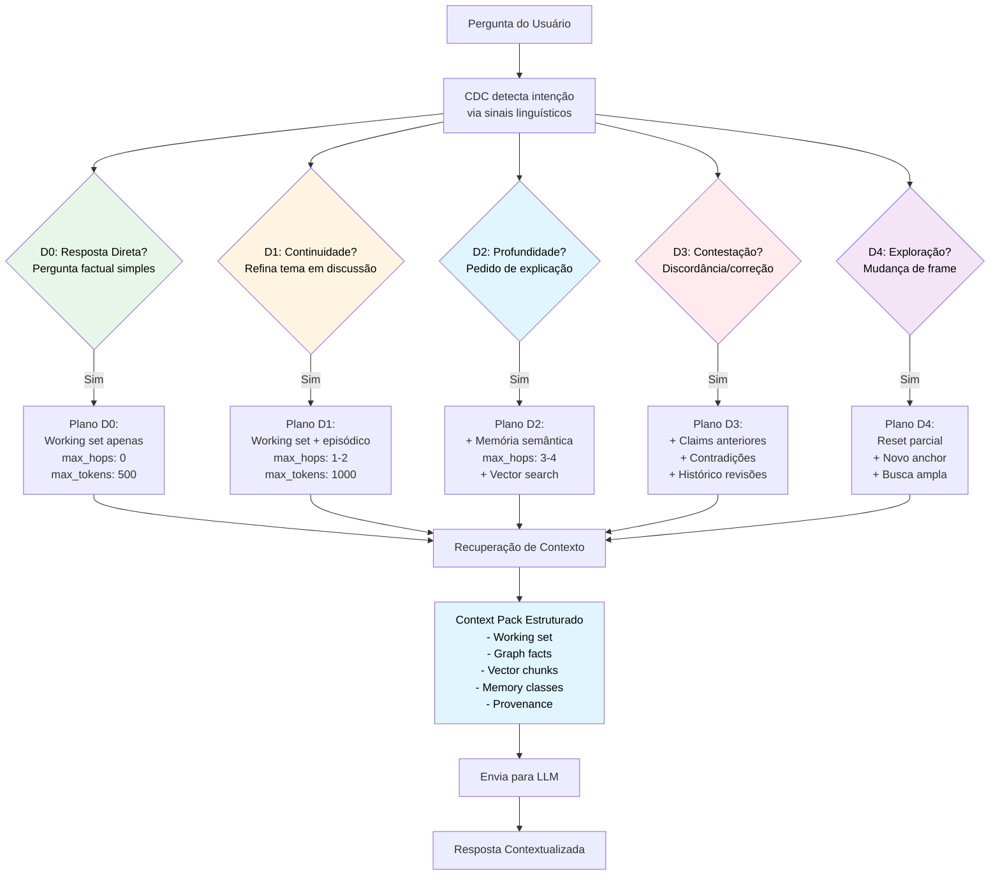

**D0 — Resposta Direta**
- **Quando**: Pergunta factual simples, resposta curta esperada
- **Exemplo**: "Qual é o email do João?" / "Quantos projetos temos ativos?"
- **Contexto**: Mínimo — apenas o "working set" atual (últimas 2 mensagens da conversa)
- **Busca**: Query direta no grafo, sem expansão

**D1 — Continuidade Local**
- **Quando**: Continua ou refina um tema já em discussão
- **Exemplo**: "E sobre isso?" / "Como funciona?" (referindo-se a algo mencionado antes)
- **Contexto**: Working set + última janela episódica (última reunião, último documento mencionado)
- **Busca**: Expansão local no grafo (1-2 hops)

**D2 — Profundidade Conceitual**
- **Quando**: Pedido de explicação, comparação ou análise
- **Exemplo**: "Por que tomamos essa decisão?" / "Qual a diferença entre X e Y?" / "Explique melhor"
- **Contexto**: + Memória semântica relacionada (conceitos, definições, contexto histórico)
- **Busca**: Expansão semântica (3-4 hops) + busca vetorial por similaridade

**D3 — Contestação/Correção**
- **Quando**: Usuário discorda, corrige ou questiona algo dito anteriormente
- **Exemplo**: "Não concordo" / "Está errado" / "Na verdade, foi diferente"
- **Contexto**: + Claims anteriores + contradições detectadas + múltiplas perspectivas
- **Busca**: Busca por contradições, claims não validados, histórico de revisões

**D4 — Exploração/Mudança de Frame**
- **Quando**: Novo tema completamente diferente ou mudança de perspectiva
- **Exemplo**: Mudança abrupta de assunto / "E se pensarmos diferente sobre isso?"
- **Contexto**: Reset parcial + novo anchor semântico + busca ampla
- **Busca**: Busca semântica ampla + reset do working set

**Detecção Automática de Profundidade**

O CDC detecta o nível automaticamente analisando **sinais linguísticos** na pergunta e no histórico:

| Sinal | Exemplo | Nível Detectado |
|-------|---------|-----------------|
| Pergunta direta com resposta curta | "Qual o email do João?" | D0 |
| Pronomes anafóricos | "E sobre isso?", "Como funciona?" | D1 |
| Pedido de explicação | "Por quê?", "Explique melhor" | D2 |
| Marcadores de discordância | "Não concordo", "Está errado" | D3 |
| Mudança de tema | Novo assunto sem conexão | D4 |
| Referência temporal | "Na última reunião", "semana passada" | D1-D2 |

**Planos de Recuperação por Nível**

Cada nível tem um **plano de recuperação** específico que define:
- Quais camadas consultar no Neo4j (traversal de grafo, vector index, texto dos chunks)
- Quantos hops fazer no grafo
- Quais tipos de memória priorizar (semântica, episódica, procedural, avaliativa)
- Limites de tokens/custo

**Exemplo de Planos:**

**D0 (Resposta Direta):**
```yaml
sources: [working_set, user_profile]
max_hops: 0
max_tokens: 500
memory_types: []
```

**D2 (Profundidade Conceitual):**
```yaml
sources: [working_set, graph_traversal, vector_index]
max_hops: 3
max_tokens: 2000
memory_types: [semantic, episodic]
```

**D3 (Contestação):**
```yaml
sources: [working_set, claims, contradictions, revision_history]
max_hops: 4
max_tokens: 3000
memory_types: [evaluative, episodic]
```

**Context Pack Estruturado**

O resultado da recuperação é um **Context Pack** estruturado, organizado por tipo de memória e relevância:

```json
{
  "depth_level": "D2",
  "context_items": [
    {
      "type": "semantic",
      "content": "Definição de OKR...",
      "source": "knowledge-k-123",
      "relevance": 0.9
    },
    {
      "type": "episodic",
      "content": "Reunião de 15/01 onde OKR foi definido...",
      "source": "meeting-m-456",
      "relevance": 0.8
    }
  ],
  "retrieval_summary": "Buscou 5 itens semânticos, 3 episódicos",
  "strategies_used": ["graph_traversal", "vector_similarity"],
  "tokens_estimated": 1850
}
```

**Valor para Negócios:**

Para público de negócios, o CDC é a diferença entre um assistente que "fala demais" e um que responde exatamente o necessário. É como a diferença entre um consultor que responde "R$ 500k" quando você pergunta o preço, versus um que começa explicando toda a história da empresa. O CDC garante que o sistema seja **eficiente** (não desperdiça recursos) e **preciso** (não perde informação crítica).

**Infraestrutura Epistemológica**

O CDC é parte da "infraestrutura epistemológica" do EKS — o conjunto de mecanismos que garantem que o sistema sabe **o que sabe, o que não sabe, e quanto precisa buscar para responder adequadamente**. Ele previne tanto sub-recuperação (respostas incompletas) quanto sobre-recuperação (respostas verbosas e caras), garantindo que cada interação seja otimizada para a intenção real do usuário.

## 16.3.2 Retrieval Orchestrator: O Motor de Busca Inteligente

O Context Depth Controller decide **quanto** contexto buscar. O **Retrieval Orchestrator** decide **como** buscar — qual estratégia usar, onde procurar, e como combinar resultados.

**Analogia: O Bibliotecário Especialista**

Imagine uma biblioteca com três tipos de organização:

1. **Catálogo por Assunto** (busca semântica — por significado)
2. **Índice de Referências Cruzadas** (busca em grafo — por relações)
3. **Busca por Palavras-chave** (busca textual — por termos exatos)

Um bibliotecário inexperiente sempre usa o mesmo método. Um bibliotecário experiente **escolhe o método certo para cada tipo de pergunta**:

- "Me recomende livros sobre liderança" → Catálogo por Assunto (semântico)
- "Quem citou este autor?" → Índice de Referências (grafo)
- "Cadê o livro 'A Arte da Guerra'?" → Busca exata por título (textual)

O **Retrieval Orchestrator** é esse bibliotecário experiente: ele analisa a pergunta e escolhe a estratégia de busca mais eficiente.

**As 3 Estratégias de Busca**

| Estratégia | Quando Usar | Como Funciona | Exemplo de Pergunta |
|-----------|-------------|---------------|---------------------|
| **Semantic Only** (Semântica) | Pergunta conceitual, busca por significado | Usa embeddings vetoriais para encontrar textos com significado similar | "Como melhorar engajamento de equipe?" |
| **Graph Only** (Grafo) | Pergunta sobre relações, estrutura organizacional | Usa Cypher para atravessar relacionamentos no grafo | "Quem reporta para Maria?" |
| **Hybrid** (Híbrido) | Pergunta complexa que exige ambos | Combina busca semântica + traversal de grafo | "Quais decisões foram tomadas sobre o Projeto X?" |

**Pré-Query: Entendendo a Intenção**

Antes de buscar, o Retrieval Orchestrator faz uma análise rápida da pergunta (**Pre-Query**):

```
Pergunta do usuário: "Por que o Projeto Alpha está atrasado?"

Pre-Query analisa e determina:
- retrieval_intent: "graph_insight" (precisa atravessar relações)
- focus_entities: ["Project", "Task", "Risk"]
- time_horizon: "last_30d" (eventos recentes)
- answer_constraints: "lista estruturada de causas"
```

Com essa análise, o Orchestrator sabe exatamente o que fazer.

**Estratégia Semântica: Busca por Significado**

Usa **embeddings vetoriais** para encontrar textos com significado similar, mesmo que usem palavras diferentes.

**Exemplo:**

```
Pergunta: "Como motivar time desengajado?"

Retrieval Orchestrator:
1. Gera embedding da pergunta
2. Busca no vector index por chunks similares
3. Retorna top 5 mais relevantes:
   - "Estratégias de retenção de talentos" (score: 0.89)
   - "Cultura organizacional e performance" (score: 0.85)
   - "Feedback contínuo como motivador" (score: 0.82)
   - ...
```

**Estratégia de Grafo: Busca por Relações**

Usa **Cypher** (linguagem de query de grafos) para atravessar relacionamentos estruturados.

**Exemplo:**

```
Pergunta: "Quais projetos Ana gerencia e quem são os membros das equipes?"

Retrieval Orchestrator gera Cypher:
MATCH (person:Person {name: "Ana"})-[:MANAGES]->(proj:Project)
MATCH (proj)<-[:PARTICIPATES_IN]-(member:Person)
RETURN proj.name, collect(member.name) AS team
```

Resultado estruturado com relações explícitas.

**Estratégia Híbrida: Melhor dos Dois Mundos**

Combina busca semântica (texto) com traversal de grafo (relações).

**Exemplo:**

```
Pergunta: "Quais riscos históricos podem afetar o novo projeto de expansão?"

Retrieval Orchestrator:
1. Busca semântica: chunks sobre "expansão" e "riscos"
2. Busca em grafo: projetos similares anteriores + seus riscos associados
3. Combina: riscos textuais encontrados + riscos estruturados linkados a projetos
4. Retorna pacote consolidado com ambos
```

**Context Bundle: O Pacote Estruturado**

O resultado do Retrieval Orchestrator não é uma lista caótica de resultados. É um **Context Bundle** estruturado:

```json
{
  "retrieval_strategy": "hybrid_semantic_graph",
  "query_analyzed": {
    "intent": "risk_analysis",
    "focus": ["Project", "Risk"],
    "time_horizon": "all_time"
  },
  "context_items": [
    {
      "type": "semantic",
      "source": "document-doc-123",
      "content": "Riscos de expansão: volatilidade cambial...",
      "relevance": 0.91,
      "provenance": "Relatório Q4 2025"
    },
    {
      "type": "graph",
      "source": "risk-node-456",
      "content": "Risco: Dependência de fornecedor único",
      "relevance": 0.85,
      "linked_to": "Project: Expansão LATAM 2024",
      "provenance": "Registrado em reunião 15/03/2024"
    }
  ],
  "retrieval_summary": "Encontrados 3 chunks semânticos e 2 riscos estruturados",
  "strategies_used": ["semantic", "graph_traversal"],
  "tokens_estimated": 1450
}
```

**Cada item tem:**
- **Tipo** (semântico ou grafo)
- **Conteúdo** (o texto ou dados estruturados)
- **Relevância** (score de 0-1)
- **Proveniência** (de onde veio)

**Respeito a Visibilidade e Limites**

O Retrieval Orchestrator nunca retorna informações que o usuário não deveria ver:

- Filtra por **visibilidade** (personal, project, corporate)
- Respeita **RBAC** (controle de acesso baseado em papel)
- Respeita **limites de profundidade** (max_hops no grafo)
- Respeita **limites de custo** (max_tokens retornados)

**Exemplo de filtro:**

```cypher
// Busca projetos, MAS apenas os que o usuário pode acessar
MATCH (user:User {id: $userId})
MATCH (proj:Project)
WHERE (user)-[:PARTICIPATES_IN|:MANAGES]->(proj)
   OR proj.visibility = 'corporate'
RETURN proj
```

**Integração com Meta-Grafo e Query Profiles**

O Retrieval Orchestrator não inventa queries do zero. Ele consulta o **Meta-Grafo** (Capítulo 9, seção 9.2.1) e usa **Query Profiles** pré-definidos:

```cypher
// Consulta o Meta-Grafo para pegar query profile
MATCH (profile:QueryProfile {name: "org_context"})
RETURN profile.cypher_template AS template
```

Isso garante que queries são **otimizadas, testadas e seguras**.

**Valor para Negócios:**

Para público de negócios, o Retrieval Orchestrator é a diferença entre "buscar uma agulha no palheiro" e "chamar um especialista que sabe exatamente onde procurar":

- **Sem orchestração**: Sistema sempre usa a mesma estratégia de busca → lento, resultados irrelevantes
- **Com orchestração**: Sistema escolhe a melhor estratégia para cada pergunta → rápido, resultados precisos

É como a diferença entre usar sempre o Google (busca textual) para tudo, vs saber quando usar Google, quando usar LinkedIn (busca por conexões), quando usar Google Scholar (busca acadêmica) — cada ferramenta para o contexto certo.

## 16.4 Hiperlinks semânticos: navegação além do texto

Respostas textuais podem incluir **links para nós do grafo**:

> O Projeto Alpha está gerenciado por [João Silva](#person:uuid-123). A última decisão foi [Realocar orçamento](#decision:uuid-456), conectada ao objetivo [Eficiência operacional](#objective:uuid-789).

Ao clicar em um link, o usuário navega para a visão detalhada daquele nó — com todas as suas propriedades e relações.

Isso transforma o texto em uma **interface de navegação semântica** — cada conceito mencionado é um ponto de entrada para exploração mais profunda.

### Em resumo: Capítulo 16

*A interface cognitiva representa uma mudança de paradigma: em vez de dashboards estáticos que mostram apenas o que foi pré-programado, o EKS oferece respostas conversacionais, contextuais e navegáveis. O sistema gera texto baseado em fatos do grafo (não em "invenção" da IA), adapta o nível de detalhe ao perfil do usuário, e transforma cada conceito mencionado em um link navegável. O Context Depth Controller (CDC) decide automaticamente quanto contexto buscar para cada pergunta — evitando tanto respostas incompletas quanto verbosas — através de 5 níveis de profundidade (D0-D4) que detectam a intenção real do usuário. O resultado é uma experiência onde o usuário interage com o conhecimento organizacional como se estivesse conversando com um colega extremamente bem informado — e cada afirmação pode ser verificada.*

---

# PARTE V: GOVERNANÇA ONTOLÓGICA CORPORATIVA

*Até aqui, construímos a base teórica (epistemologia, ontologias), a estrutura (Knowledge Graph) e a arquitetura do sistema (pipeline, agentes). Mas um sistema de conhecimento corporativo não se sustenta apenas com boa tecnologia — ele precisa de **governança**. Assim como uma empresa precisa de processos para gerenciar suas finanças, recursos humanos e compliance, um EKS precisa de processos claros para gerenciar seu ativo mais valioso: a ontologia que estrutura todo o conhecimento. Esta parte explora como transformar a ontologia em um ativo estratégico gerenciado, com métricas, processos e controle de acesso formais.*

---

# Capítulo 17: Ontologia como Ativo Estratégico

*Pense na ontologia como a "constituição" da sua organização de conhecimento. Assim como uma constituição define os princípios fundamentais de um país e precisa de processos formais para ser alterada (emendas, votações, promulgação), a ontologia define a estrutura fundamental do seu conhecimento e precisa de governança formal para evoluir sem caos. Este capítulo trata de como transformar algo que parece "técnico" em algo gerenciado como qualquer outro ativo estratégico da empresa.*

## 17.1 Da ferramenta à infraestrutura

A maioria dos sistemas de conhecimento falha porque são tratados como **projetos** — têm começo, meio e fim. Um EKS bem-sucedido precisa ser tratado como **infraestrutura** — algo permanente, mantido, evoluído.

A ontologia não é uma especificação que você escreve uma vez e esquece. É um **ativo vivo** que:

- Evolui com a organização (novos departamentos, novos produtos)
- Requer curadoria contínua (validação, limpeza, enriquecimento)
- Precisa de governança formal (quem pode mudar o quê, como)
- Gera valor crescente com o tempo (quanto mais conhecimento, mais útil)

## 17.2 Ciclo de vida ontológico

Uma ontologia corporativa passa por cinco fases:

### 1. **Design inicial**
- Modelagem do domínio core
- Definição de classes, relações e axiomas fundamentais
- Validação com stakeholders

### 2. **Implementação**
- Criação do schema no Neo4j
- Configuração de constraints e índices
- Deployment da versão v1.0.0

### 3. **População**
- Ingestão de dados iniciais
- Migração de sistemas legados
- Extração de documentos históricos

### 4. **Operação**
- Uso por agentes e usuários
- Monitoramento de métricas de saúde
- Detecção de inconsistências

### 5. **Evolução**
- Refinamento baseado em uso real
- Adição de novas classes e relações
- Versionamento semântico (v1.1.0, v2.0.0)

E o ciclo recomeça — a ontologia nunca está "pronta".

## 17.3 Processo de evolução ontológica

Quando alguém quer adicionar uma nova classe ou modificar uma relação, não pode simplesmente alterar o schema em produção. Precisa seguir um processo:

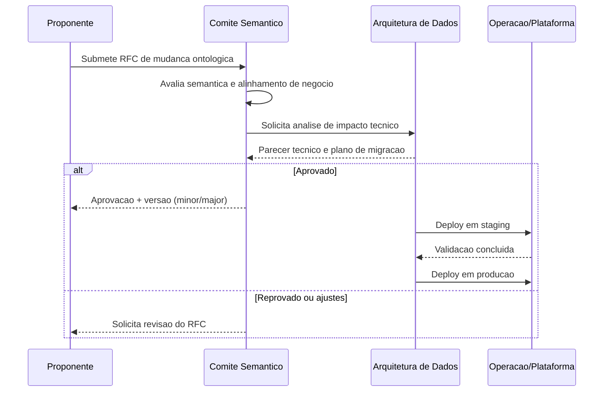

**1. Proposta de mudança (RFC - Request for Change)**

*Um RFC (Request for Change) é um documento formal que descreve o que se quer mudar na ontologia e por quê — similar a como engenheiros propõem mudanças em padrões técnicos, ou como um departamento jurídico propõe alterações em políticas internas. Veja um exemplo:*

```markdown
# RFC-023: Adicionar classe Supplier

**Motivação:** Precisamos rastrear fornecedores e suas relações com projetos.

**Classes propostas:**
- `Supplier` (nome, CNPJ, categoria, rating)

**Relações propostas:**
- `Project -[USES_SUPPLIER]-> Supplier`
- `Risk -[RELATED_TO_SUPPLIER]-> Supplier`

**Impacto:** Baixo (adição, não modificação)

**Versão:** v1.3.0 (minor)
```

**2. Revisão por comitê semântico**

Um grupo de stakeholders (ontologistas, arquitetos, domain experts) revisa:
- A mudança está alinhada com a ontologia existente?
- Há sobreposição com classes existentes?
- As relações fazem sentido semanticamente?

**3. Aprovação e versionamento**

Se aprovado:
- Atualiza especificação formal (arquivo OWL ou schema.md)
- Cria script de migração Cypher
- Incrementa versão (v1.2.0 → v1.3.0)

**4. Deploy em staging**

Migração é testada em ambiente de staging com dados reais anonimizados.

**5. Deploy em produção**

Após validação, deploy com janela de manutenção ou migração lazy.

## 17.3.1 O Curador Ontológico: Humano no Centro da Evolução

Há três papéis distintos na gestão de um EKS, frequentemente confundidos mas com responsabilidades completamente diferentes:

| Papel | Foco | Ferramenta Principal | Quando Atua |
|-------|------|---------------------|-------------|
| **Admin (Administrador)** | Gestão operacional (usuários, permissões, uploads) | Dashboard administrativo | Diariamente, tarefas operacionais |
| **Memory Steward (IA)** | Auditoria automatizada de qualidade, detecção de anomalias | Algoritmos de monitoramento | Continuamente, background |
| **Curador Ontológico (Humano)** | Refinamento semântico do negócio, evolução ontológica | **Visualização interativa do grafo** | Semanalmente, refinamentos estratégicos |

O **Curador Ontológico** é o profissional humano que atua no ponto de fricção entre **autoaperfeiçoamento algorítmico** e **inteligência organizacional humana**. Ele não valida conteúdo isolado (para isso há o HITL). Ele **refina a ontologia viva do negócio**.

> "O curador atua sobre o schema semântico dinâmico, não sobre dados."

Sem esse papel, o EKS se torna apenas um RAG sofisticado ou um repositório inteligente. Nenhum dos dois é um **sistema cognitivo organizacional**.

**O que o Curador Ontológico Faz (vs. o que ele NÃO faz)**

| Curador FAZ | Curador NÃO faz |
|-------------|-----------------|
| Define **o que existe** no negócio (entidades legítimas) | Valida dados individuais (isso é HITL) |
| Define **como existe** (tipos, subclasses, estados) | Gerencia usuários e permissões (isso é Admin) |
| Define **como se relaciona** (relações causais, funcionais) | Executa queries de negócio (isso é usuário final) |
| Define **quando faz sentido** (contexto, temporalidade) | Programa agentes de IA (isso é Dev) |
| **Distingue exceção de regra** | Executa tarefas operacionais |
| **Estabiliza padrões** quando fazem sentido | Gera relatórios executivos |

**Exemplo Prático: Distinguindo Exceção de Regra**

Imagine que o sistema detectou que alguns projetos não têm gerente definido. O **Memory Steward (IA)** gera um alerta: "5 projetos sem relação `[:MANAGED_BY]`".

- **Admin** diria: "Vou pedir aos usuários para preencher"
- **Curador** pergunta: "Esses projetos são uma exceção legítima ou indicam lacuna na ontologia?"

O curador investiga, descobre que são "Projetos de Pesquisa", e percebe que:
1. Projetos de Pesquisa **não têm gerente** — eles têm **líder científico** (papel diferente)
2. A ontologia estava incompleta: só modelava `:Manager`, não modelava `:ScientificLead`

**Ação do curador:**
- Cria novo label `:ResearchProject` (subtipo de `:Project`)
- Cria nova relação `[:LED_BY]` com propriedades específicas
- Atualiza a ontologia para refletir essa distinção
- Documenta que "Research Projects são geridos por Scientific Leads, não Managers"

Isso não é "corrigir dados". É **refinar a representação do negócio**.

**Perfil do Curador Ontológico**

Um curador eficaz:

- **Conhece o negócio profundamente** — entende processos, exceções, cultura organizacional
- **Entende grafos** — não precisa ser técnico, mas sabe "pensar relacional" (o mundo como rede de conexões)
- **Distingue exceção de regra** — sabe quando algo é workaround temporário vs. prática legítima
- **Separa workaround de padrão** — "Isso é uma gambiarra que precisa ser corrigida ou um caso de uso real?"
- **Estabiliza padrões** quando fazem sentido — depois de ver um padrão recorrente 5 vezes, o formaliza

> "A ontologia não é técnica. Ela é negócio formalizado."

**Por que a Visualização do Grafo é CRÍTICA**

A interface do curador não é um formulário ou um dashboard. É uma **visualização interativa do grafo de conhecimento**. Isso não é "bonito" — é **funcional**, porque:

> "Documento é linear. Organização é relacional."

Quando o curador olha o grafo, ele consegue:

**1. Detectar lacunas ontológicas**

*Processos sem dono, decisões sem critério, métricas sem objetivo*

**Visualização:**

```
(:Process {name: "Processo de Aprovação de Contratos"})
  // Não possui nenhuma relação [:OWNED_BY]->(:Person)
  // Não possui [:DOCUMENTED_IN]->(:Document)
  // Aparece como "nó solto" no grafo
```

**Ação do curador:** Investiga se isso é lacuna de dados (falta preencher) ou lacuna ontológica (papel "Gestor de Processos" não existe na modelagem).

**2. Identificar acoplamentos perigosos (supernós)**

*Nó concentrando responsabilidade demais*

**Visualização:**

```
(:Person {name: "João Silva"})
  -[:MANAGES]-> 12 projetos
  -[:OWNS]-> 8 processos
  -[:RESPONSIBLE_FOR]-> 15 decisões
  // Aparece como um "hub" com dezenas de conexões
```

**Ação do curador:** Alerta para risco organizacional — se João sair, conhecimento crítico se perde. Sugere redistribuição ou ao menos documentação reforçada.

**3. Ver fluxos implícitos**

*Informação que "corre" fora do processo formal*

**Visualização:**

```
(:Person {name: "Ana"})
  -[:PARTICIPATES_IN]->(:Meeting)
  <-[:ATTENDED_BY]-(:Person {name: "Carlos"})
  -[:MADE_DECISION]->(:Decision)
  // Mas "Carlos" não está formalmente ligado ao projeto da decisão
```

**Ação do curador:** Detecta que Carlos é consultor informal para aquele projeto, mas isso não está formalizado. Pode ser necessário criar relação `[:INFORMAL_ADVISOR]` ou formalizar o papel.

**4. Perceber antipadrões organizacionais**

*Decisões recorrentes sem aprendizado acumulado*

**Visualização:**

```
(:Decision {title: "Escolher fornecedor X"})  // 2023-05
  -[:SIMILAR_TO]->(:Decision {title: "Escolher fornecedor Y"})  // 2023-09
  -[:SIMILAR_TO]->(:Decision {title: "Escolher fornecedor Z"})  // 2024-02
  // Todas têm os mesmos critérios, mas nenhuma tem relação [:LESSON_LEARNED]
```

**Ação do curador:** Percebe que a organização toma decisões de fornecedor repetidamente, mas não documenta o aprendizado. Cria template de decisão e sugere processo formal de avaliação.

**Fluxo de Trabalho do Curador**

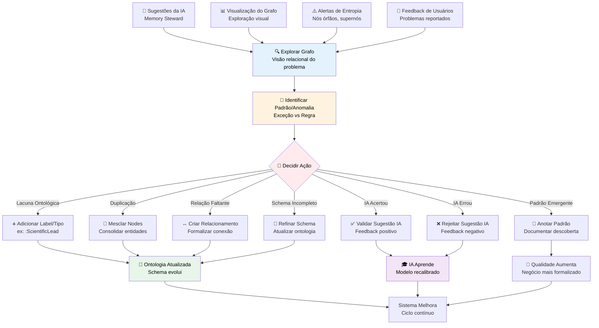

**Colaboração Curador-IA (Memory Steward)**

O curador não trabalha sozinho. O **Memory Steward (IA)** é o parceiro algorítmico que:

1. **Sugere refinamentos** — "5 projetos sem gerente, 8 nós órfãos, 3 relações duplicadas"
2. **Detecta anomalias** — "Este departamento possui entropia alta (baixa coerência interna)"
3. **Monitora qualidade** — "Freshness médio da área X está caindo há 3 meses"

O curador então:

1. **Explora visualmente** o contexto da sugestão
2. **Decide** se é lacuna de dados ou lacuna ontológica
3. **Age** no grafo (adiciona, corrige, enriquece)
4. **Valida ou rejeita** a sugestão, fornecendo feedback para a IA aprender

**Ciclo de Feedback:**

```
Memory Steward (IA) sugere: "Este processo parece duplicado"
    ↓
Curador investiga: "Na verdade, são dois processos similares mas distintos"
    ↓
Curador rejeita sugestão + anota: "Processos X e Y são diferentes em contexto Z"
    ↓
Memory Steward aprende: "Não sugerir mesclagem para casos como esse"
    ↓
Sistema melhora: Menos falsos positivos nas próximas sugestões
```

**Cenários Práticos de Curadoria**

**Cenário 1: Processos sem Dono**

- **Alerta**: "12 processos sem relação `[:OWNED_BY]`"
- **Exploração**: Curador visualiza esses processos no grafo
- **Descoberta**: São "processos transitórios" (usados temporariamente em eventos)
- **Ação**: Cria novo tipo `:TransientProcess` que não exige dono permanente
- **Resultado**: Ontologia reflete exceção legítima, alertas param de incomodar

**Cenário 2: Clusters Suspeitos**

- **Visualização**: Curador nota um cluster denso de decisões todas conectadas a uma única pessoa
- **Descoberta**: É um "decisor-sombra" — alguém que influencia mas não é formalmente responsável
- **Ação**: Formaliza o papel `[:INFORMAL_INFLUENCER]` e documenta essa dinâmica organizacional
- **Resultado**: Conhecimento tácito se torna explícito

**Cenário 3: Relações Redundantes**

- **Alerta**: "Existem 3 tipos diferentes de relações entre Pessoa e Projeto: `[:WORKS_ON]`, `[:ALLOCATED_TO]`, `[:PARTICIPATES_IN]`"
- **Exploração**: Curador analisa uso real dessas relações
- **Descoberta**: São usadas de forma intercambiável (não há distinção semântica real)
- **Ação**: Consolida em uma única relação `[:PARTICIPATES_IN]` com propriedade `role`
- **Resultado**: Ontologia mais limpa, queries mais simples

**Valor para Negócios:**

Para público de negócios, o Curador Ontológico é o "guardião da inteligência organizacional". Ele garante que o sistema não apenas armazena informações, mas **reflete fielmente como a organização realmente funciona**. É a diferença entre:

- **Sem curador**: Sistema acumula dados, mas ontologia envelhece, padrões se perdem, exceções viram regras
- **Com curador**: Sistema evolui junto com a organização, exceções legítimas são formalizadas, conhecimento tácito se torna explícito

O curador é o profissional que olha para o grafo de conhecimento e vê **o negócio pensando sobre si mesmo**.

## 17.3.2 Ecossistema de Curadoria: Pipeline de Qualidade em 4 Etapas

Um EKS maduro não permite que informações entrem diretamente no grafo de conhecimento principal. Isso seria como uma fábrica sem controle de qualidade: o produto final ficaria inconsistente, com peças defeituosas misturadas às boas.

O **Ecossistema de Curadoria** funciona como uma linha de montagem com múltiplas estações de inspeção, garantindo que **apenas conhecimento validado e bem estruturado** chegue ao grafo principal.

**Princípio Fundamental: Staging Graph vs Main Graph**

Antes de explicar as 4 etapas, entenda a infraestrutura:

- **Staging Graph**: Um grafo temporário, "área de quarentena", onde dados recém-ingeridos são validados e estruturados. É como um ambiente de homologação: você pode testar, revisar e descartar sem afetar produção.
- **Main Graph (Neo4j Principal)**: O grafo de conhecimento "oficial" da organização. Somente dados aprovados pela curadoria chegam aqui.

> "Nada vai direto para produção. Tudo passa por staging."

**As 4 Etapas do Pipeline de Curadoria**

```mermaid
flowchart TD
    subgraph Input["📥 Fontes de Entrada"]
        Chat["💬 Chat & Conversas"]
        Docs["📄 Documentos<br/>(PDFs, Word, etc)"]
        Forms["📋 Formulários<br/>(Onboarding, Pesquisas)"]
        APIs["🔌 APIs Externas<br/>(CRM, ERP, etc)"]
        AdminManual["🧑‍💼 Input Manual<br/>(Admin/Curador)"]
    end
    
    subgraph Curation["🧹 Pipeline de Curadoria"]
        CuradorEntrada["1️⃣ Curador de Entrada<br/>Recebe & Categoriza"]
        ValidadorQualidade["2️⃣ Validador de Qualidade<br/>Completude & Relevância"]
        OrganizadorEstrutura["3️⃣ Organizador de Estrutura<br/>Nodes & Edges"]
        GestorAprovacao["4️⃣ Gestor de Aprovação<br/>Políticas & Autorização"]
    end
    
    subgraph Decisions["🧠 Decisões"]
        CheckPolicy["📜 Checar Políticas"]
        Approve["✅ Auto-Aprovar"]
        Reject["❌ Rejeitar"]
        SendToReview["📝 Enviar para Revisão Humana<br/>(HITL)"]
    end
    
    subgraph Storage["💾 Armazenamento"]
        Staging["🧪 Staging Graph<br/>Ambiente de Teste"]
        MainGraph["🗂️ Main Graph (Neo4j)<br/>Produção"]
        AuditTrail["🧾 Audit Trail<br/>Logs & Rastreabilidade"]
    end
    
    Input --> CuradorEntrada
    CuradorEntrada --> ValidadorQualidade
    ValidadorQualidade --> OrganizadorEstrutura
    OrganizadorEstrutura --> Staging
    Staging --> GestorAprovacao
    
    GestorAprovacao --> CheckPolicy
    CheckPolicy --> Approve
    CheckPolicy --> Reject
    CheckPolicy --> SendToReview
    
    Approve --> MainGraph
    Reject --> AuditTrail
    SendToReview --> AuditTrail
    
    style CuradorEntrada fill:#e3f2fd,color:#000
    style ValidadorQualidade fill:#fff3e0,color:#000
    style OrganizadorEstrutura fill:#e1f5ff,color:#000
    style GestorAprovacao fill:#e8f5e9,color:#000
    style Staging fill:#ffebee,color:#000
    style MainGraph fill:#f3e5f5,color:#000
```

**Etapa 1: Curador de Entrada** (Recebe e Categoriza)

O primeiro filtro. Quando dados chegam (documento, mensagem de chat, formulário preenchido), o **Curador de Entrada** cria um `:CurationJob` — um "ticket" representando aquele lote de informação que precisa ser processado.

**O que ele faz:**

- Registra **fonte** (de onde veio), **tipo** (documento, chat, API), **dono** (quem submeteu)
- Classifica **prioridade** (alta para dados sensíveis, baixa para conhecimento geral)
- Verifica se há **informações mínimas** para prosseguir (ex: documento sem autor → prioridade baixa)

**Analogia**: Porteiro de prédio que registra visitantes antes de deixar entrar — anota nome, propósito, horário.

**Etapa 2: Validador de Qualidade** (Completude e Relevância)

Dados podem ter sido enviados, mas estão completos? Fazem sentido? Não são duplicados?

**O que ele verifica:**

- **Completude**: Campos obrigatórios preenchidos (ex: reuniões precisam de data + participantes)
- **Relevância**: Conteúdo não é spam, lixo ou completamente fora de contexto
- **Duplicidade**: Usa embeddings para detectar se conhecimento similar já existe no grafo (threshold configurável, ex: >85% de similaridade)

**Regras de ação:**

| Problema | Ação |
|----------|------|
| Campos obrigatórios faltando | Marca job como `needs_review`, alerta Admin |
| Duplicidade detectada (>85% similar) | Sugere mesclagem com knowledge existente |
| Conteúdo irrelevante (classificador de spam) | Marca para rejeição, envia para auditoria |

**Analogia**: Inspetor de qualidade em fábrica que verifica se peças têm defeitos antes de ir para montagem.

**Etapa 3: Organizador de Estrutura** (Nodes e Edges)

Agora os dados são válidos, mas precisam ser **transformados em grafo**: quais nós criar? Quais relações estabelecer?

**O que ele faz:**

- Consulta o **schema ontológico** (quais tipos de nós e relações existem)
- Decide **granularidade**: um documento vira 1 nó `:Document` + N nós `:Chunk`, ou precisa de estrutura mais rica?
- Cria **relacionamentos** baseados em regras ontológicas (ex: `:Knowledge` sempre deve ter `[:EXTRACTED_FROM]->(:Document)`)
- Garante **metadados universais** (source_type, owner_id, visibility, confidence, memory_class)

**Exemplo:**

*Input:* Documento de reunião (5 páginas, 10 participantes, 8 decisões registradas)

*Organizador cria no Staging Graph:*

```cypher
(:Document {title: "Reunião Q1 2026"})
  -[:HAS_CHUNK]->(:Chunk) // 25 chunks
  -[:RECORDED_MEETING]->(:Meeting {date: "2026-01-15"})
    -[:ATTENDED_BY]->(:Person) // 10 relações
  -[:CONTAINS_DECISION]->(:Decision) // 8 decisões
```

**Analogia**: Montador que pega peças validadas e monta o produto conforme o manual de instruções (ontologia).

**Etapa 4: Gestor de Aprovação** (Políticas e Autorização)

Tudo está estruturado no Staging Graph. Mas pode ir para produção? Ou precisa de aprovação humana?

**O que ele decide:**

**Aplicação de Políticas:**

| Política | Decisão |
|----------|---------|
| **Fonte Interna (documentos corporativos)** | Auto-aprova |
| **Fonte Externa (API pública)** | Revisa antes de aprovar |
| **Dados Sensíveis (financeiro, pessoal)** | Exige HITL (Human-in-the-Loop) |
| **Conhecimento Duplicado (similaridade >90%)** | Sugere mesclagem, pede confirmação |
| **Organização específica (ex: Compliance)** | Exige aprovação de gestor designado |

**Fluxos de decisão:**

1. **Auto-Aprovação**: Dados que passam por todas as verificações + se encaixam em política permissiva → movidos automaticamente Staging → Main Graph
2. **Rejeição Automática**: Dados com problemas críticos (ex: corrompido, spam confirmado) → descartados, log em Audit Trail
3. **Revisão Humana (HITL)**: Dados que exigem julgamento humano → cria `:CurationApprovalRequest`, notifica responsável

**Analogia**: Gerente de produção que decide: "Este lote pode ir para o cliente" (auto-aprovação), "Este lote tem defeito, descarte" (rejeição), ou "Este lote é crítico, chame o diretor para avaliar" (HITL).

**Staging Graph: Ambiente Seguro de Teste**

O Staging Graph é como um ambiente de homologação em desenvolvimento de software: você pode testar, experimentar e descartar sem risco.

**Vantagens:**

- **Segurança**: Erro de curadoria não contamina produção
- **Reversibilidade**: Fácil descartar todo um lote se algo der errado
- **Auditoria**: Ver exatamente o que foi proposto antes de aprovar
- **Colaboração**: Curador humano pode revisar visualmente no Staging antes de promover

**Exemplo de uso:**

Um documento sensível chega pelo pipeline. O Organizador cria 50 nós no Staging (`:Meeting`, `:Person`, `:Decision`, `:Risk`). O Gestor de Aprovação detecta que há informações financeiras e cria um `:CurationApprovalRequest`.

O **admin/curador** recebe notificação, abre a interface de curadoria, visualiza o **subgrafo no Staging**, e vê:

- 3 decisões financeiras (>R$100k cada)
- 2 riscos marcados como "críticos"
- 1 pessoa que não está no sistema (possível cliente externo)

O curador decide:
- Aprova as decisões (são legítimas)
- Corrige manualmente os riscos (estavam mal classificados)
- Adiciona a pessoa externa com visibilidade restrita

Só então clica "Aprovar para produção". Todo o subgrafo é movido Staging → Main Graph em uma transação atômica.

**Audit Trail: Rastreabilidade Completa**

Cada decisão de curadoria é registrada no **Audit Trail**:

```cypher
(:CurationJob {
  id: "job-12345",
  source_type: "document",
  source_ref: "doc-reuniao-q1",
  created_by: "user-ana",
  status: "approved",
  created_at: "2026-02-10T10:00:00Z",
  approved_at: "2026-02-10T10:15:00Z",
  approved_by: "curator-rodrigo"
})
-[:HAD_ISSUE]->(:CurationIssue {
  type: "missing_field",
  description: "Document sem campo 'author'",
  severity: "warning"
})
-[:RESOLVED_BY]->(:CurationApprovalRequest {
  approver_role: "curator",
  decision_by: "curator-rodrigo",
  decision_at: "2026-02-10T10:15:00Z",
  comment: "Autor identificado como 'Ana Silva' via contexto"
})
```

Isso permite responder, meses depois:
- "Quando esta informação entrou no sistema?"
- "Quem aprovou?"
- "Quais problemas foram identificados durante a curadoria?"
- "Por que esta decisão foi tomada?"

**Curation Issues: Problemas Detectados e Resolvidos**

Durante o pipeline, problemas são registrados como `:CurationIssue`:

| Tipo de Issue | Descrição | Severidade | Ação Típica |
|---------------|-----------|------------|-------------|
| `missing_field` | Campo obrigatório ausente | Warning | Curador preenche manualmente |
| `low_quality` | Conteúdo muito curto/ilegível | Error | Rejeita ou pede mais contexto |
| `duplicate` | Conhecimento já existe | Info | Sugere mesclagem |
| `schema_violation` | Tentou criar label não definido na ontologia | Error | Bloqueia, pede revisão ontológica |

**Políticas Configuráveis por Organização**

O Gestor de Aprovação não tem regras fixas. Cada organização configura suas políticas:

**Exemplo de política corporativa (empresa financeira):**

```yaml
auto_approval_policy:
  - source: "internal_docs"
    condition: "não contém tags 'financeiro' ou 'pessoal'"
    action: "approve"
  
  - source: "external_api"
    condition: "sempre"
    action: "review"
  
  - source: "chat"
    condition: "knowledge com visibilidade 'pessoal'"
    action: "approve"
  
  - source: "chat"
    condition: "knowledge com visibilidade 'corporativo'"
    action: "review"
```

**Exemplo de política startup (mais permissiva):**

```yaml
auto_approval_policy:
  - source: "internal_docs"
    action: "approve"
  
  - source: "chat"
    action: "approve"
  
  - source: "external_api"
    condition: "confidence > 0.7"
    action: "approve"
```

**Valor para Negócios:**

Para público de negócios, o Ecossistema de Curadoria é a diferença entre um sistema "self-service caótico" e um "sistema enterprise-grade":

- **Sem curadoria**: Dados entram sem controle → grafo fica poluído → confiança cai → sistema vira repositório inutilizável
- **Com curadoria**: Dados passam por filtros de qualidade → apenas conhecimento validado chega ao grafo → confiança permanece alta → sistema gera valor contínuo

É o equivalente digital de um processo de **controle de qualidade** em manufatura, ou de **revisão editorial** em publicação. O resultado não é perfeição (nada é), mas **consistência e rastreabilidade** — dois pilares de qualquer sistema enterprise.

## 17.3.3 Memory Steward: O Sistema Imunológico do EKS

Um sistema de conhecimento vivo, como um organismo biológico, precisa de um **sistema imunológico** — algo que detecta problemas, neutraliza ameaças e mantém o corpo saudável. No EKS, esse papel é do **Memory Steward**, um agente IA que age como guardião contínuo da saúde do grafo.

**A Analogia com Sistema Imunológico é Perfeita:**

| Sistema Biológico | Memory Steward (EKS) |
|-------------------|----------------------|
| **Detecta infecções** (vírus, bactérias) | Detecta conhecimento de baixa qualidade |
| **Identifica células cancerígenas** (crescimento anormal) | Identifica duplicatas e inconsistências |
| **Repara tecidos danificados** | Corrige proveniência quebrada |
| **Previne doenças** (vacinação) | Previne decadência antes que se torne crítica |
| **Alerta para anomalias** | Notifica curadores humanos sobre problemas complexos |

Enquanto o **Memory Decay Agent** (Capítulo 15) lida com aspectos temporais (envelhecimento e freshness), o **Memory Steward** foca em aspectos estruturais e qualitativos.

**As 5 Missões do Memory Steward**

**1. Garantia de Qualidade** (Quality Assurance)

Detecta conhecimento incompleto, mal estruturado ou de baixa qualidade.

**O que ele verifica:**

- **Completude**: Node tem título, conteúdo, metadados obrigatórios?
- **Estrutura**: Segue o schema ontológico definido?
- **Clareza**: Conteúdo é legível e compreensível? (não é só caracteres aleatórios ou lixo)
- **Referências**: Links para outros nós ainda são válidos?

**Exemplo de detecção:**

```cypher
// Memory Steward encontra knowledge sem campos críticos
MATCH (k:Knowledge)
WHERE k.content IS NULL 
   OR size(k.content) < 50
   OR k.created_at IS NULL
   OR NOT EXISTS((k)-[:DERIVED_FROM]->())
RETURN k AS low_quality_knowledge
```

**Ação:** Marca como `quality_score: 0.3`, cria alerta para curador humano revisar.

**2. Resolução de Conflitos** (Conflict Resolution)

Identifica informações contraditórias no grafo.

**Cenário típico:**

```
(:Knowledge {content: "Empresa X levantou $5M em funding"})
  source: Press Release oficial, 2026-01-10

vs

(:Knowledge {content: "Empresa X levantou $6M em funding"})
  source: Artigo de blog, 2026-01-15
```

**O que o Memory Steward faz:**

1. **Detecta conflito semântico** — embeddings similares mas valores numéricos diferentes
2. **Analisa autoridade das fontes** — Press release oficial > blog
3. **Cria flag** `(:ConflictFlag)` linkando ambos os nós
4. **Propõe resolução** — Marcar o press release como fonte primária, adicionar nota no blog: "Conflito detectado, fonte oficial indica $5M"
5. **Notifica usuários** — Quando alguém buscar essa informação, mostra alerta: "⚠️ Informação conflitante existe"

**Valor:** Em vez de esconder conflitos (o que gera decisões baseadas em informação errada), o sistema torna conflitos **visíveis e gerenciáveis**.

**3. Validação de Proveniência** (Provenance Validation)

Assegura que todo conhecimento tem cadeias de proveniência completas e rastreáveis.

**Verificação:**

```cypher
// Memory Steward busca conhecimento "órfão" (sem origem rastreável)
MATCH (k:Knowledge)
WHERE NOT EXISTS((k)-[:DERIVED_FROM|:EXTRACTED_FROM]->())
RETURN k AS orphan_knowledge
```

**Cadeia de proveniência esperada:**

```
(:Knowledge)
  -[:DERIVED_FROM]->(:Chunk)
    -[:PART_OF]->(:Document)
      -[:UPLOADED_BY]->(:Person)
```

**Ações de correção:**

- **Auto-fix (quando possível)**: Se o chunk e documento existem, mas a relação está quebrada, reconecta automaticamente
- **Proposta de curadoria**: Se não consegue identificar origem, notifica curador humano pedindo informação de fonte

**Valor para Compliance:** Em setores regulados (financeiro, saúde, jurídico), rastreabilidade de informação é **mandatória**. O Memory Steward garante que isso nunca seja negligenciado.

**4. Análise de Cobertura** (Coverage Analysis)

Identifica **gaps de conhecimento** — áreas onde a organização sabe pouco.

**Integração com Business Intent Graph (GIN):**

```cypher
// Para cada objetivo estratégico, conta quanto conhecimento existe
MATCH (obj:Objective)
OPTIONAL MATCH (obj)<-[:SUPPORTS]-(k:Knowledge)
WITH obj, count(k) AS knowledge_count
RETURN obj.title, knowledge_count,
       CASE 
         WHEN knowledge_count < 5 THEN 'sub-documentado'
         WHEN knowledge_count < 20 THEN 'cobertura adequada'
         ELSE 'bem documentado'
       END AS coverage_status
ORDER BY knowledge_count ASC
```

**Exemplo de relatório:**

| Objetivo | Knowledge Count | Status | Última Atualização |
|----------|-----------------|--------|-------------------|
| Modernização Tecnológica | 45 | Bem documentado | 3 dias atrás |
| Expansão Internacional | 3 | ⚠️ Sub-documentado | 45 dias atrás |
| Eficiência Operacional | 18 | Cobertura adequada | 10 dias atrás |

**Ação recomendada:** Alerta para líder responsável por "Expansão Internacional": "Objetivo tem cobertura de conhecimento baixa e desatualizada. Sugestão: agendar sessão de documentação de estratégia."

**5. Manutenção de Higiene** (Hygiene Maintenance)

Remove ou consolida conhecimento redundante, duplicado ou obsoleto.

**Higienização automática:**

| Problema | Ação do Memory Steward |
|----------|------------------------|
| **Duplicatas (>90% similaridade)** | Propõe merge, preservando proveniência de ambos |
| **Nós órfãos** (sem conexões há >60 dias) | Marca para revisão, possível arquivamento |
| **Supernós** (>100 conexões) | Alerta para curador: possível centralização excessiva |
| **Conteúdo obsoleto** (quality_score <0.2 por >90 dias) | Propõe arquivamento com aprovação humana |

**Fluxo de Trabalho Diário do Memory Steward**

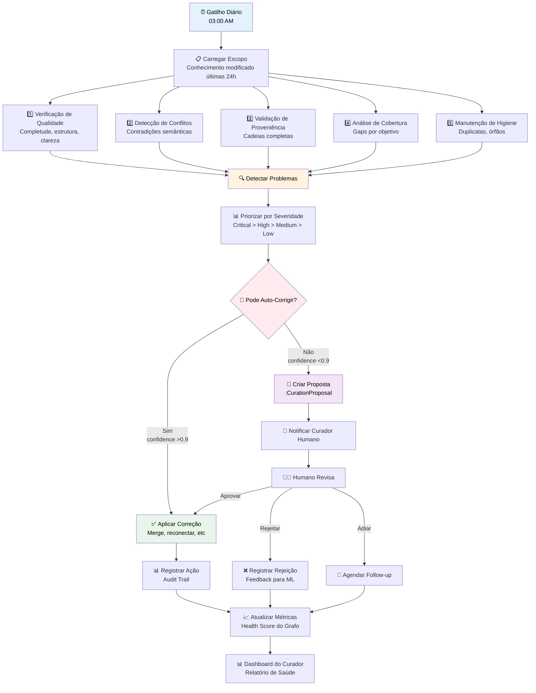

**Auto-Fix vs Human-in-the-Loop: Quando Decidir?**

O Memory Steward segue uma **política de confiança** para decidir se age autonomamente ou pede aprovação humana:

| Confidence | Ação | Exemplo |
|-----------|------|---------|
| **>0.9** | **Auto-fix** | Duplicata com 98% de similaridade → merge automático |
| **0.7-0.9** | **Auto-fix + Notifica** | Reconexão de proveniência com 85% confidence → corrige mas avisa curador |
| **<0.7** | **Proposta de curadoria** | Conflito semântico ambíguo → pede decisão humana |

**Aprendizado Contínuo: O Memory Steward Evolui**

Cada decisão humana é um sinal de aprendizado:

```
Memory Steward propõe: "Merge nodes X e Y (similaridade 92%)"
  ↓
Curador humano rejeita: "São similares, mas contextos diferentes"
  ↓
Memory Steward registra: "Similaridade >90% com embeddings tipo A não garante duplicata se tags de contexto divergem"
  ↓
Próxima vez: Memory Steward verifica contexto antes de propor merge
```

**Valor para Negócios:**

Para público de negócios, o Memory Steward é a diferença entre um sistema que "acumula informação" e um sistema que "mantém inteligência de alta qualidade". É como a diferença entre:

- **Sem Memory Steward**: Um depósito que acumula caixas sem organização → eventualmente vira caos, informação não confiável, decisões baseadas em dados contraditórios
- **Com Memory Steward**: Um armazém gerenciado onde há inspeção contínua de qualidade, remoção de itens danificados, organização constante → informação sempre confiável, decisões baseadas em dados validados

O Memory Steward é o motivo pelo qual o EKS não "apodrece" com o tempo — ele **se mantém saudável** por design.

## 17.4 O comitê semântico

Governança ontológica requer **responsabilidade clara**. Não pode ser um "comum acordo" informal — precisa haver um grupo com autoridade para aprovar mudanças.

**Composição típica do comitê semântico:**

- **Ontologista-chefe** (1): garante consistência formal
- **Arquiteto de dados** (1): valida impacto técnico
- **Domain experts** (2-3): validam semântica do domínio
- **Representante de negócios** (1): valida alinhamento estratégico

**Reuniões:**
- Mensal (para mudanças minor)
- Ad-hoc (para mudanças major ou urgentes)

**Métricas de governança:**
- Tempo médio de aprovação de RFCs
- Taxa de aceitação de propostas
- Número de breaking changes por ano

### Em resumo: Capítulo 17

*Uma ontologia corporativa não é um documento técnico que se escreve e esquece — é um ativo estratégico que precisa de governança formal, assim como qualquer outro ativo crítico da empresa. O ciclo de vida ontológico (design, implementação, população, operação, evolução) nunca acaba. Mudanças passam por RFCs formais, são revisadas por um comitê semântico multidisciplinar (que inclui representantes de negócios), e são versionadas com o mesmo rigor de software. Sem governança, a ontologia vira um caos; com ela, vira a base confiável de toda a inteligência organizacional.*

---

# Capítulo 18: Métricas Estruturais — Medindo a Saúde do Conhecimento

*"O que não se mede, não se gerencia." Essa máxima da gestão se aplica perfeitamente a um Knowledge Graph. Como saber se a sua base de conhecimento está saudável? Se ela está crescendo de forma equilibrada? Se há "buracos" (informações importantes que faltam) ou "excessos" (nós sobrecarregados que podem ser gargalos)? Este capítulo apresenta as métricas fundamentais para monitorar a saúde do seu EKS — traduzidas para o contexto de negócios, de forma que qualquer gestor possa entender se o sistema está funcionando bem.*

## 18.1 Densidade relacional (R/N ratio)

A métrica mais básica de um Knowledge Graph é a **relação entre edges e nodes**:

```
R/N = Total de Relações / Total de Nós
```

**Interpretação:**

| R/N | Interpretação | Status |
|-----|---------------|--------|
| < 0.5 | Grafo extremamente esparso | ⚠️ Baixa conectividade |
| 0.5-1.0 | Grafo esparso | ⚠️ Pode ter nós órfãos |
| 1.0-3.0 | Densidade saudável | ✅ Bom equilíbrio |
| 3.0-5.0 | Grafo denso | ✅ Alta conectividade |
| > 5.0 | Grafo extremamente denso | ⚠️ Possível ruído |

**No EKS atual:**  
R/N = 1.65 (114 relações / 69 nós) → **Densidade saudável** ✅

## 18.2 Centralidade de entidades estratégicas

Nem todos os nós têm a mesma importância. **Centralidade** mede o quão "importante" um nó é na estrutura do grafo.

**Métricas de centralidade:**

### Degree Centrality (grau)
Quantas conexões o nó tem. É a métrica mais intuitiva: quanto mais conexões, mais "importante" (ou sobrecarregado) é o nó.

*A consulta abaixo lista os 10 nós mais conectados do grafo — pense nisso como um ranking das "entidades mais referenciadas" na organização:*

```cypher
MATCH (n)
WITH n, COUNT { (n)--() } AS degree
RETURN labels(n)[0] AS type, n.name AS name, degree
ORDER BY degree DESC
LIMIT 10;
```

### Betweenness Centrality (intermediação)
Quantos caminhos mais curtos passam por esse nó. Em termos práticos, nós com alta intermediação são "pontes" — se essa entidade desaparecesse, a informação pararia de fluir entre diferentes partes da organização.

*A consulta abaixo identifica esses "pontos de passagem obrigatória" no grafo:*

```cypher
CALL gds.betweenness.stream('myGraph')
YIELD nodeId, score
RETURN gds.util.asNode(nodeId).name AS name, score
ORDER BY score DESC;
```

Nós com alta betweenness são **pontes** — removê-los fragmentaria o grafo. Em uma organização, isso pode representar pessoas que centralizam conhecimento (risco se saírem) ou projetos que conectam múltiplas áreas.

### PageRank
Versão ponderada de centralidade (o mesmo algoritmo usado pelo Google para ranking de páginas web). No contexto organizacional, identifica quais entidades são mais "referenciadas" por outras entidades importantes.

*A consulta calcula esse ranking para todos os nós:*

```cypher
CALL gds.pageRank.stream('myGraph')
YIELD nodeId, score
RETURN gds.util.asNode(nodeId).name AS name, score
ORDER BY score DESC;
```

**No EKS:**

| Nó | Tipo | Degree | Betweenness | PageRank |
|----|------|--------|-------------|----------|
| Rodrigo Trindade | Person | 37 | 0.42 | 0.18 |
| CoCreateAI | Organization | 14 | 0.31 | 0.12 |
| Projeto EKS | Project | 11 | 0.28 | 0.09 |

Rodrigo é o nó mais central em todas as métricas — o que pode indicar:
- Liderança forte (positivo)
- Potencial gargalo (atenção)

## 18.3 Cobertura do domínio

**Cobertura** mede o quanto do domínio organizacional está representado no grafo.

**Métricas de cobertura:**

| Métrica | Cálculo | Objetivo |
|---------|---------|----------|
| **Cobertura de pessoas** | % de colaboradores no grafo | > 90% |
| **Cobertura de projetos** | % de projetos ativos registrados | 100% |
| **Cobertura de decisões** | % de decisões estratégicas documentadas | > 80% |
| **Cobertura temporal** | % de meses com conhecimento registrado | > 70% |

**Query de exemplo (cobertura de projetos):**

*Para calcular a cobertura, o sistema compara quantos projetos existem no EKS com quantos existem no sistema oficial da empresa (por exemplo, Jira). Se a cobertura é baixa, significa que o Knowledge Graph não reflete a realidade completa da organização:*

```cypher
// Projetos no sistema oficial (ex: Jira)
WITH 25 AS total_projetos_oficiais

// Projetos no EKS
MATCH (p:Project)
WITH count(p) AS projetos_no_eks, total_projetos_oficiais
RETURN projetos_no_eks, 
       total_projetos_oficiais,
       round(toFloat(projetos_no_eks) / total_projetos_oficiais * 100, 2) AS cobertura_pct;
```

## 18.4 Grau de validação

Nem todo conhecimento é igual — alguns itens foram validados por humanos, outros não.

**Métrica de validação:**

*Nem todo conhecimento extraído automaticamente é 100% confiável. A métrica de validação mostra qual porcentagem dos itens de conhecimento foi confirmada por um ser humano — essencial para compliance e tomada de decisão:*

```cypher
MATCH (k:Knowledge)
WITH count(k) AS total,
     sum(CASE WHEN k.human_validated THEN 1 ELSE 0 END) AS validated
RETURN validated, total, 
       round(toFloat(validated) / total * 100, 2) AS validacao_pct;
```

**Objetivo:** > 60% de validação para conhecimento crítico (decisões estratégicas, dados financeiros)

## 18.5 Dashboard de saúde ontológica

As métricas acima são consolidadas em um dashboard de monitoramento contínuo:

```
┌─────────────────── EKS Health Dashboard ────────────────────┐
│                                                              │
│  🟢 R/N Ratio: 1.65  (saudável)                              │
│  🟢 Órfãos: 0  (0%)                                          │
│  🟡 Supernós: 5  (atenção)                                   │
│  🟢 Freshness médio: 0.78                                    │
│  🟡 Validação: 58%  (abaixo do objetivo)                     │
│  🟢 Cobertura de projetos: 92%                               │
│                                                              │
│  ⚠️ Alertas:                                                 │
│    - Supernó "Rodrigo" com 37 conexões (revisar)            │
│    - 12 itens de Knowledge aguardando validação             │
│                                                              │
└──────────────────────────────────────────────────────────────┘
```

Este dashboard é atualizado diariamente e gera alertas automáticos quando thresholds são violados.

## 18.6 Métricas de Curadoria: Memory Steward em Ação

As métricas estruturais (R/N, centralidade, cobertura) fornecem uma visão **estática** da saúde do grafo. Mas um EKS maduro também monitora a **saúde dinâmica** — quanto o sistema está se auto-mantendo através do Memory Steward.

**Métricas de Curadoria Ativa:**

| Métrica | Cálculo | Objetivo |
|---------|---------|----------|
| **Taxa de Auto-Correção** | % de problemas corrigidos sem HITL | > 70% |
| **Tempo Médio de Resolução** | Tempo desde detecção até correção | < 24h para high priority |
| **Taxa de Rejeição Humana** | % de propostas rejeitadas por curador | < 15% (indica acurácia do Steward) |
| **Problemas Detectados/Dia** | Quantidade de issues identificados | Variável, mas tendência deve ser decrescente |
| **Quality Score Médio** | Média de quality_score de todo conhecimento | > 0.7 |
| **Coverage Score Médio** | Média de coverage_score por objetivo | > 0.6 |

**Dashboard de Saúde do Memory Steward:**

```
┌───────────── Memory Steward Health Report (Última Semana) ─────────────┐
│                                                                         │
│  🟢 Problemas Detectados: 127                                           │
│  🟢 Auto-Corrigidos: 94 (74%)                                          │
│  🟡 Propostas Pendentes: 18 (14%)                                      │
│  🟢 Propostas Aprovadas: 12 (9%)                                       │
│  🟢 Propostas Rejeitadas: 3 (2%) — Dentro do esperado                 │
│                                                                         │
│  📊 Breakdown por Tipo de Problema:                                    │
│    - Duplicatas: 45 (35%) — 42 mescladas automaticamente              │
│    - Proveniência quebrada: 28 (22%) — 24 reconstru<remaining_args_truncated />
<result><omitted /></result>
</invoke>

*Medir a saúde de um Knowledge Graph não é muito diferente de medir a saúde de uma organização. A densidade relacional (R/N) mostra se o conhecimento está bem conectado; a centralidade revela quais entidades são as mais importantes (e quais podem ser gargalos); a cobertura mede se o grafo reflete a realidade da organização; e o grau de validação garante que o conhecimento é confiável. Tudo isso é consolidado em um dashboard que funciona como um "check-up" contínuo, gerando alertas quando algo precisa de atenção — como um painel de saúde empresarial para o seu conhecimento organizacional.*

---

# Capítulo 19: Controle de Acesso Semântico

*Em qualquer organização, nem toda informação é acessível a todos. Dados financeiros são restritos à diretoria; detalhes de projetos são visíveis aos participantes; informações pessoais de colaboradores são confidenciais. Em um banco de dados tradicional, o controle de acesso opera em tabelas e colunas. Mas em um Knowledge Graph, onde tudo está conectado por relações semânticas, o controle precisa ser mais inteligente: ele precisa entender **quem** está perguntando, **o quê** está sendo acessado, e **em que contexto**. Este capítulo explora como o EKS implementa um controle de acesso que respeita a estrutura do conhecimento.*

## 19.1 RBAC baseado em entidades

Controle de acesso tradicional opera em tabelas e colunas. Em um Knowledge Graph, o controle precisa operar em **nós e relações**.

**RBAC Semântico:**

| Papel | Pode acessar | Pode editar | Exemplo |
|-------|-------------|-------------|---------|
| **Admin** | Tudo | Tudo | Ontologista-chefe |
| **Gerente** | Seu departamento e projetos gerenciados | Decisões, tarefas de sua equipe | Maria (Gerente de TI) |
| **Colaborador** | Projetos dos quais participa | Suas tarefas | João (Desenvolvedor) |
| **Externo** | Informações públicas | Nada | Consultor temporário |

**Implementação em Cypher:**

*Para verificar se um usuário tem acesso a um projeto, o sistema consulta o grafo e verifica se existe uma relação de participação ou gerenciamento entre o usuário e o projeto — ou se o usuário é administrador:*

```cypher
// Verificar se usuário pode acessar projeto
MATCH (u:User {id: $user_id})
MATCH (p:Project {id: $project_id})
WHERE (u)-[:PARTICIPATES_IN]->(p)
   OR (u)-[:MANAGES]->(p)
   OR u.role = 'Admin'
RETURN count(p) > 0 AS has_access;
```

## 19.2 Permissões por tipo de nó

Nem todos os nós têm a mesma sensibilidade. Informações financeiras requerem mais restrição que informações de projeto.

**Níveis de sensibilidade:**

| Tipo de Nó | Sensibilidade | Acesso padrão |
|------------|---------------|---------------|
| `Decision:Financial` | Alta | Admin, CFO |
| `Risk` | Média | Gerente do projeto |
| `Task` | Baixa | Participantes |
| `Knowledge:Public` | Pública | Todos |

Cada nó carrega uma propriedade `visibility`:

```json
{
  "visibility": "personal" | "project" | "corporate" | "public"
}
```

**Query respeitando visibilidade:**

*Quando um usuário busca conhecimento, o sistema automaticamente filtra os resultados de acordo com o nível de visibilidade permitido para aquele usuário — garantindo que ninguém veja o que não deveria:*

```cypher
MATCH (k:Knowledge)
WHERE k.visibility IN $user_allowed_visibilities
  OR k.owner_id = $user_id
RETURN k;
```

## 19.3 Restrições por contexto organizacional

Às vezes o acesso depende do **contexto**:

- Um gerente pode editar decisões do seu departamento, mas não de outros
- Um colaborador vê tarefas do projeto em que participa, mas não de outros
- Dados históricos (> 2 anos) podem ter visibilidade reduzida

**Política de contexto exemplo:**

*O código abaixo ilustra como uma política de acesso pode combinar múltiplas regras — papel do usuário, visibilidade do nó, departamento e participação em projetos — para decidir se o acesso é permitido:*

```python
def can_access(user, node):
    if user.role == "Admin":
        return True
    
    if node.visibility == "public":
        return True
    
    if node.owner_id == user.id:
        return True
    
    # Verifica contexto departamental
    if node.type == "Decision":
        user_dept = get_user_department(user)
        node_dept = get_node_department(node)
        if user_dept == node_dept and user.role in ["Manager", "Director"]:
            return True
    
    # Verifica participação em projeto
    if node.type in ["Task", "Risk"]:
        user_projects = get_user_projects(user)
        node_project = get_node_project(node)
        if node_project in user_projects:
            return True
    
    return False
```

## 19.4 Auditoria de acesso

Todo acesso a conhecimento sensível é registrado:

*Cada vez que alguém acessa uma informação sensível no sistema, um registro de auditoria é criado automaticamente — permitindo responder a perguntas de compliance e segurança:*

```cypher
CREATE (access:AccessLog {
  user_id: $user_id,
  node_id: $node_id,
  action: "READ",
  timestamp: datetime(),
  ip_address: $ip,
  success: true
});
```

Isso permite auditorias de compliance (*"Quem acessou informações financeiras no último trimestre?"*) e detecção de anomalias (*"Por que esse usuário acessou 500 nós em 1 minuto?"*).

### Em resumo: Capítulo 19

*O controle de acesso em um Knowledge Graph vai muito além de "quem pode acessar qual tabela". Ele opera em nível semântico: baseado em relações (você participa desse projeto? gerencia essa equipe?), em sensibilidade do conteúdo (informação financeira vs. informação pública), e em contexto organizacional (em que departamento você está? que projetos são seus?). Cada acesso a dados sensíveis é registrado para auditoria, garantindo compliance e segurança. O resultado é um sistema onde a informação certa chega à pessoa certa — nem mais, nem menos.*

---

# PARTE VI: ENTERPRISE KNOWLEDGE SYSTEM COMO SISTEMA ESTRATÉGICO

*Esta é a parte mais importante para quem vê tecnologia como meio e não como fim. Até aqui, construímos uma base sólida — epistemologia, ontologias, Knowledge Graphs, arquitetura, agentes e governança. Agora, vamos ver como tudo isso se traduz em **valor estratégico real**: decisões melhores, produtos mais bem informados, equipes mais inteligentes e uma organização que, literalmente, aprende com o tempo.*

---

# Capítulo 20: EKS como Infraestrutura de Decisão

*Toda organização toma decisões — centenas por dia, milhares por mês. A maioria dessas decisões é baseada em informações incompletas, memória individual e intuição. Imagine se cada decisão pudesse ser fundamentada em todo o conhecimento histórico da organização: decisões passadas similares, riscos já identificados, resultados de projetos anteriores, expertise disponível. Este capítulo mostra como o EKS transforma conhecimento passivo em infraestrutura ativa de decisão — passando de "lugar onde guardamos informações" para "sistema que nos ajuda a decidir melhor".*

## 20.1 De repositório a sistema decisório

A transformação final de um EKS maduro é deixar de ser um "lugar onde conhecimento é armazenado" para se tornar um **sistema onde decisões são fundamentadas**.

A diferença é sutil mas profunda:

**EKS como repositório:**
- "Onde posso encontrar informação sobre o projeto X?"
- Passivo: você busca, o sistema responde

**EKS como sistema decisório:**
- "Devo aprovar esse projeto? Quais riscos históricos são relevantes?"
- Ativo: o sistema sugere, alerta, contextualiza

## 20.1.1 Grafo de Intenção de Negócio (GIN): A Espinha Dorsal Estratégica

Há um princípio fundamental que transforma um EKS de repositório passivo em sistema decisório ativo: **nenhum conhecimento existe desconectado de um objetivo de negócio**. Se uma informação não serve a um propósito estratégico, por que ela está no sistema?

O **Grafo de Intenção de Negócio (GIN)** — também chamado de Business Intent Graph (BIG) — é a estrutura ontológica que ancora **todo o conhecimento** aos objetivos organizacionais. Ele responde à pergunta mais importante de qualquer organização: *"Por que isso importa?"*

**A Cadeia Ontológica Completa**

O GIN estabelece uma hierarquia clara de intenção:

```mermaid
flowchart TD
    Company[Company<br/>CoCreateAI] --> Area[Area<br/>Tecnologia]
    Area --> Project[Project<br/>EKS]
    Project --> Objective[Objective<br/>Modernização Tecnológica]
    Objective --> OKR[OKR<br/>Migrar 80% para cloud até Q3]
    OKR --> Metric[Metric<br/>% sistemas migrados]
    
    subgraph Knowledge["📚 Conhecimento Ancorado"]
        K1[Knowledge: Neo4j usado<br/>como backend]
        K2[Decision: Adotar Neo4j<br/>em reunião 15/01]
        K3[Risk: Dependência de<br/>fornecedor único]
        K4[Task: Migrar sistema X<br/>para cloud]
    end
    
    subgraph Memory["🧠 4 Classes de Memória"]
        M1[Semantic: Conceitos<br/>linkado a :Concept]
        M2[Episodic: Eventos<br/>linkado a :TimePoint]
        M3[Procedural: Processos<br/>linkado a :Process]
        M4[Evaluative: Insights<br/>linkado a :Insight]
    end
    
    K1 -.->|SUPPORTS| Objective
    K2 -.->|SUPPORTS| Objective
    K3 -.->|IMPACTS| Objective
    K4 -.->|SUPPORTS| OKR
    
    K1 -.->|CLASSIFIED_AS| M1
    K2 -.->|CLASSIFIED_AS| M2
    K3 -.->|CLASSIFIED_AS| M4
    K4 -.->|CLASSIFIED_AS| M3
    
    style Company fill:#e1f5ff,color:#000
    style Objective fill:#fff4e1,color:#000
    style Knowledge fill:#e8f5e9,color:#000
    style Memory fill:#f3e5f5,color:#000
```

```
(Company: "CoCreateAI")
  --[HAS_AREA]--> (Area: "Tecnologia")
  --[HAS_PROJECT]--> (Project: "EKS")
  --[CONNECTED_TO]--> (Objective: "Modernização Tecnológica")
  --[MEASURED_BY]--> (OKR: "Migrar 80% dos sistemas para cloud até Q3")
  --[TRACKED_BY]--> (Metric: "Percentual de sistemas migrados")
```

Cada nível responde a uma pergunta diferente:
- **Company/Area**: Onde estamos organizacionalmente?
- **Project**: O que estamos fazendo?
- **Objective**: Para onde queremos ir?
- **OKR**: Como medimos o progresso?
- **Metric**: Qual o número específico que acompanhamos?

**O Princípio de Ancoragem**

No EKS, **todo conhecimento é ancorado** a essa estrutura:

```
(Knowledge: "Neo4j é usado como backend principal")
  --[SUPPORTS]--> (Objective: "Modernização Tecnológica")
  --[EXTRACTED_FROM]--> (Document: "Especificação Técnica EKS")
  --[CLASSIFIED_AS]--> (MemoryClass: "semantic")
```

Uma decisão, um risco, uma tarefa, um insight — todos têm uma relação (direta ou indireta) com um objetivo. Isso permite que o sistema sempre responda: *"Por que isso importa? Qual objetivo estratégico isso serve?"*

**Onboarding Organizacional: Mapeando a Intenção Primeiro**

Antes de qualquer ingestão de conhecimento, o EKS realiza um **onboarding organizacional** que mapeia a estrutura de intenção:

1. **Definir Visão e Missão**: O que a organização quer ser?
2. **Criar Objetivos Estratégicos**: Quais são as metas de longo prazo?
3. **Definir OKRs**: Como cada objetivo será medido?
4. **Estabelecer Métricas**: Quais números acompanhamos?

Só então o sistema começa a ingerir conhecimento — e cada pedaço de informação é automaticamente classificado e linkado aos objetivos relevantes.

**Integração com as 4 Classes de Memória**

O GIN se integra profundamente com as 4 Classes de Memória (apresentadas no Capítulo 15):

- **Memória Semântica**: Conceitos e definições ancorados a objetivos (ex: "O que é um OKR?" conectado ao objetivo de "Estruturação estratégica")
- **Memória Episódica**: Eventos e timeline ancorados a objetivos (ex: "Reunião de kickoff do projeto EKS" conectada ao objetivo de "Modernização")
- **Memória Procedural**: Processos e how-tos ancorados a objetivos (ex: "Como fazer deploy" conectado ao objetivo de "Eficiência operacional")
- **Memória Avaliativa**: Lições aprendidas ancoradas a objetivos (ex: "Aprendemos que X não funciona" conectado ao objetivo que X deveria servir)

**Cadeia de Proveniência PROV-O Integrada**

A proveniência (do Capítulo 12) também se integra ao GIN: cada fato não apenas tem uma fonte, mas também uma **razão estratégica** para existir:

```
(:Fact {
  content: "Adotamos Neo4j como banco de grafos",
  source: "document-doc-123",
  supports_objective: "obj-modernizacao-001",
  memory_class: "semantic"
})
```

**Novos Nós Ontológicos do GIN**

O GIN introduz novos tipos de nós especializados:

- **`:Objective`**: Objetivo estratégico de longo prazo
- **`:OKR`**: Key Result que mede progresso
- **`:Metric`**: Métrica específica e mensurável
- **`:Concept`**: Conceito semântico (usado por memória semântica)
- **`:TimePoint`**: Ponto temporal (usado por memória episódica)
- **`:Process`**: Processo ou playbook (usado por memória procedural)
- **`:Insight`**: Insight ou lição aprendida (usado por memória avaliativa)

**Valor para Negócios:**

Para público de negócios, o GIN é talvez o conceito mais poderoso do EKS. Ele garante que **toda informação no sistema responde à pergunta "por que isso importa?"** conectando qualquer conhecimento a um objetivo estratégico. Quando um executivo pergunta "O que estamos fazendo sobre modernização?", o sistema não apenas lista projetos — ele mostra o caminho completo: objetivos → OKRs → projetos → tarefas → pessoas, com cada elo da cadeia explicitamente conectado.

O GIN transforma o EKS de um "banco de dados de conhecimento" em um **sistema que entende e serve a intenção estratégica da organização**.

## 20.2 Estratégia conectada à execução

Em organizações tradicionais, há um abismo entre estratégia e execução:

- Objetivos estratégicos ficam em apresentações de PowerPoint
- Projetos são executados sem conexão clara com objetivos
- Decisões táticas não são rastreáveis até a estratégia

Um EKS bem implementado cria **rastreabilidade vertical**:

```
(Objetivo: "Crescer 50% em receita")
  --[HAS_KEY_RESULT]--> (OKR: "Lançar 3 novos produtos")
  --[CONNECTED_TO]--> (Project: "Desenvolvimento Produto Y")
  --[HAS_TASK]--> (Task: "Implementar feature X")
  --[ASSIGNED_TO]--> (Person: "João")
```

Quando João completa a tarefa, o sistema automaticamente atualiza:
- O progresso do projeto
- A métrica do OKR
- A proximidade do objetivo estratégico

Agora, qualquer um pode perguntar:
- *"Essa tarefa contribui para qual objetivo?"* → Crescer 50% em receita
- *"Quais tarefas impactam diretamente nossos OKRs?"* → Lista filtrada
- *"Se João está atrasado, qual OKR é afetado?"* → Inferência automática

## 20.3 OKRs conectados a tarefas

**Query: Mostrar o caminho de uma tarefa até um objetivo**

*A consulta abaixo traça o caminho completo de uma tarefa até o objetivo estratégico que ela serve — imagine poder responder "por que estamos fazendo isso?" para qualquer tarefa da empresa:*

```cypher
MATCH path = (t:Task {id: $task_id})-[*]-(o:Objective)
RETURN path;
```

**Visualização:**

```
Tarefa: "Implementar autenticação JWT"
  ↓ PART_OF
Projeto: "Migração para microservices"
  ↓ CONNECTED_TO
OKR: "Modernizar 80% da stack tecnológica"
  ↓ BELONGS_TO_OBJECTIVE
Objetivo: "Eficiência operacional e escalabilidade"
```

Essa visualização pode ser gerada automaticamente e mostrada em relatórios executivos.

## 20.4 Riscos mapeados como entidades

Riscos não devem viver apenas em planilhas de gerenciamento de projeto — eles são **entidades de primeira classe** no EKS.

```
(Risk: "Latência na API de pagamentos")
  --[IDENTIFIED_IN]--> (Project: "E-commerce Platform")
  --[AFFECTS]--> (OKR: "Reduzir tempo de checkout em 30%")
  --[MITIGATED_BY]--> (Action: "Implementar cache Redis")
  --[ASSIGNED_TO]--> (Person: "Maria")
  --[HAS_SCORE]--> 0.75 (alta severidade)
```

Quando um risco com score > 0.7 não tem mitigação implementada há mais de 30 dias, o sistema gera um alerta automático para o gerente do projeto.

**Query: Riscos críticos sem mitigação**

*Uma das consultas mais valiosas para gestores: identifica todos os riscos graves (score > 0.7) que afetam OKRs e que ainda não possuem nenhuma ação de mitigação — um alerta vermelho automático:*

```cypher
MATCH (r:Risk)-[:AFFECTS]->(okr:OKR)
WHERE r.score > 0.7
  AND NOT EXISTS { (r)-[:MITIGATED_BY]->(:Action) }
RETURN r.title, r.score, okr.name
ORDER BY r.score DESC;
```

## 20.5 Conexão entre decisão e evidência

Decisões estratégicas devem ser rastreáveis até as evidências que as fundamentaram:

```
(Decision: "Adotar arquitetura serverless")
  --[BASED_ON]--> (Analysis: "Comparação AWS Lambda vs EC2")
  --[EXTRACTED_FROM]--> (Document: "Tech Evaluation Report")
  --[VALIDATED_BY]--> (Person: "Rodrigo")
  --[SUPPORTS]--> (Objective: "Reduzir custos de infra em 40%")
```

Quando alguém questiona a decisão meses depois, o sistema pode mostrar o caminho completo de raciocínio.

## 20.6 Process Intelligence & Analysis (PIA): O Mapa Vivo da Empresa

**"Processos documentados mostram como a empresa deveria funcionar. O Grafo de Interação revela como ela realmente funciona. O PIA transforma essa revelação em inteligência acionável."**

Toda empresa tem processos documentados: fluxogramas, manuais, playbooks. Mas esses documentos são **fotografias estáticas** de como alguém imaginou que o trabalho deveria fluir. Na prática, o trabalho real diverge:
- Pessoas criam atalhos não documentados
- Handoffs acontecem fora dos processos oficiais
- Gargalos surgem onde o manual não previu
- Novos processos emergem organicamente sem nunca serem formalizados

O **Process Intelligence & Analysis (PIA)** é um **time de agentes de IA** que transforma o Grafo de Interação & Delegação (GID) em um **mapa vivo da empresa** — um reflexo dinâmico de como o trabalho realmente flui.

### O Problema que o PIA Resolve

**Cenário típico:** Um gestor quer entender por que o "processo de aprovação de propostas" está demorando 3 semanas, quando o manual diz que deveria levar 5 dias.

**Sem PIA:** Reuniões, entrevistas, tentativas de reconstruir o que aconteceu em cada caso. Processo lento, subjetivo e incompleto.

**Com PIA:** O sistema analisa automaticamente os últimos 50 casos de aprovação, identifica os gargalos reais (não os imagináveis), e gera um relatório com:
- Fluxo de processo real (não o documentado)
- Tempo médio de cada etapa
- Onde os handoffs travam
- Quem são os gargalos (pessoas com alta taxa de delegações pendentes)
- Comparação entre processo declarado vs executado

### As Três Camadas do PIA

O PIA não é um único agente — é um **ecossistema de agentes especializados** operando em três camadas:

```mermaid
flowchart TD
    subgraph Data["📊 Camada de Dados"]
        GID["Grafo de Interação & Delegação<br/>Quem fez o quê, quando"]
        BIG["Business Intent Graph<br/>Objetivos estratégicos"]
        Docs["Documentos de Processo<br/>Manuais, playbooks"]
    end
    
    subgraph Analysis["🔍 Camada de Análise (PIA)"]
        Discover["Discovery Agent<br/>Detecta processos emergentes"]
        Map["Mapping Agent<br/>Mapeia fluxos reais"]
        Compare["Coherence Agent<br/>Compara declarado vs executado"]
        Extract["Rule Extractor<br/>Extrai regras de negócio implícitas"]
    end
    
    subgraph Action["⚙️ Camada de Ação"]
        Alert["Alertas de Gargalo<br/>Handoffs travados, atrasos"]
        Report["Relatórios Executivos<br/>Processos divergentes"]
        Guide["Guias Colaborativos<br/>Mapeamento guiado"]
        Suggest["Sugestões de Otimização<br/>Baseadas em padrões"]
    end
    
    GID --> Discover
    GID --> Map
    GID --> Compare
    Docs --> Compare
    BIG --> Extract
    
    Discover --> Alert
    Discover --> Report
    Map --> Guide
    Compare --> Report
    Extract --> Suggest
    
    style Data fill:#e3f2fd,stroke:#1976d2,color:#000
    style Analysis fill:#fff3e0,stroke:#ff9800,color:#000
    style Action fill:#e8f5e9,stroke:#4caf50,color:#000
```

#### 1. Discovery Agent — Descobrindo Processos Não Documentados

Nem todos os processos estão documentados. Muitas vezes, equipes desenvolvem workflows informais que funcionam bem, mas nunca foram oficializados. O **Discovery Agent** detecta esses processos emergentes analisando padrões de interação:

```cypher
// Detectar processos recorrentes não documentados
MATCH path = (u1:User)-[:DELEGATED]->(task:Task)-[:TO]->(u2:User)
  -[:DELEGATED]->(task2:Task)-[:TO]->(u3:User)
WHERE task.type = $task_type
WITH collect(path) AS paths, count(path) AS freq
WHERE freq > 10  // Ocorreu mais de 10 vezes
RETURN paths, freq
ORDER BY freq DESC
```

**Exemplo de descoberta:** O sistema detecta que 15 vezes nos últimos 2 meses, tarefas de tipo "proposta_comercial" seguiram o fluxo: Vendedor → Analista Financeiro → Diretor Comercial → CFO. Esse fluxo não existe no manual, mas é o processo real. O Discovery Agent sugere: *"Processo emergente detectado: Aprovação de proposta com 4 etapas. Deseja documentar?"*

#### 2. Mapping Agent — Mapeamento Colaborativo Guiado

Documentar processos manualmente é trabalhoso. O **Mapping Agent** transforma isso numa **conversa guiada** onde o agente faz perguntas e o usuário confirma:

**Conversa exemplo:**

> **Mapping Agent:** "Analisei 23 casos de 'criação de nova funcionalidade'. Parece que o fluxo é: Gestor de Produto → Engenheiro → QA → Aprovação final. Está correto?"
>
> **Usuário:** "Quase. Depois do QA, volta para o Engenheiro se houver bugs."
>
> **Mapping Agent:** "Entendi. Há um loop de revisão. Quantas vezes, em média, esse loop ocorre?"
>
> **Usuário:** "Geralmente 2 vezes."
>
> **Mapping Agent:** "Ok. Vou criar o processo com esse loop. Quer nomear ele?"
>
> **Usuário:** "Development Cycle Padrão."

O agente gera um diagrama Mermaid do processo, valida com o usuário, e persiste no grafo como `:Process` node.

#### 3. Coherence Agent — Verificando Declarado vs Executado

O **Coherence Agent** compara processos documentados (manuais, playbooks) com processos realmente executados (dados do GID) e reporta divergências:

```cypher
// Comparar processo declarado vs executado
MATCH (proc:Process {name: "Aprovação de Orçamento"})
  -[:HAS_STEP]->(step:ProcessStep)
WITH proc, collect(step.name) AS declared_steps

MATCH path = (t:Task {type: "orcamento_aprovacao"})-[:DELEGATED*]->()
WITH declared_steps, 
     [n IN nodes(path) | labels(n)[0]] AS executed_steps
WHERE declared_steps <> executed_steps
RETURN declared_steps, executed_steps
```

**Relatório gerado:**

| Etapa Declarada | Etapa Executada | Status |
|----------------|----------------|--------|
| 1. Gestor solicita | 1. Gestor solicita | ✅ Coerente |
| 2. Financeiro analisa | 2. Financeiro analisa | ✅ Coerente |
| 3. Diretor aprova | **3. Analista sênior pré-valida** | ⚠️ Divergência |
| 4. CFO assina | **4. Diretor aprova** | ⚠️ Ordem invertida |
| | **5. CFO assina** | ⚠️ Nova etapa |

**Insight:** O processo real tem uma etapa extra (pré-validação pelo analista sênior) que não existe no manual. Além disso, a aprovação do Diretor acontece *depois* da pré-validação, não antes.

#### 4. Rule Extractor — Descobrindo Regras de Negócio Implícitas

Muitas regras de negócio nunca foram documentadas — elas vivem na cabeça das pessoas ou em emails antigos. O **Rule Extractor** detecta regras implícitas analisando padrões de decisão:

```cypher
// Detectar regras de negócio implícitas
MATCH (t:Task)-[:DELEGATED {status: 'approved'}]->(decision:Decision)
WHERE t.budget < 10000
WITH count(decision) AS low_budget_approvals

MATCH (t2:Task)-[:DELEGATED {status: 'requires_cfo'}]->(decision2:Decision)
WHERE t2.budget > 50000
WITH low_budget_approvals, count(decision2) AS high_budget_cfos

RETURN "Regra implícita detectada: Orçamentos < R$ 10k são aprovados pelo Diretor. Orçamentos > R$ 50k requerem CFO." AS rule
```

**Valor para Negócios:** Imagine um novo gestor entrando na empresa. Sem PIA, ele precisaria de meses para entender "como as coisas realmente funcionam". Com PIA, o sistema gera um **guia de processos reais** em minutos, com regras explícitas extraídas de comportamentos observados.

### Aplicação Prática: Mapeamento Colaborativo de Processos

O uso mais direto do PIA para usuários é o **mapeamento colaborativo**. Em vez de sentar com um consultor por dias para documentar processos, o gestor conversa com o Mapping Agent:

**Fluxo:**

1. **Gestor:** "Quero mapear o processo de onboarding de clientes."
2. **Mapping Agent:** "Analisando 12 casos de onboarding recentes... Encontrei 3 variações do processo. Quer ver a mais comum?"
3. **Gestor:** "Sim."
4. **Mapping Agent:** *[Exibe diagrama Mermaid com 7 etapas detectadas]*
5. **Gestor:** "A etapa 4 está errada. Na verdade, é X, não Y."
6. **Mapping Agent:** "Corrigido. Esse processo tem algum ponto de decisão? Por exemplo, cliente tipo A segue caminho diferente de cliente tipo B?"
7. **Gestor:** "Sim. Se o cliente é enterprise, há validação extra pela Diretoria."
8. **Mapping Agent:** "Entendido. Vou adicionar um ramo condicional. Quer nomear essa validação?"

Resultado: Em 10 minutos, o processo está mapeado, validado e persistido no grafo. E mais importante: **está sincronizado com o GID**, então o sistema pode monitorar continuamente se o processo real continua seguindo esse fluxo ou divergiu.

### Alertas Proativos: Monitoramento Contínuo

Uma vez que processos estão mapeados, o PIA os monitora continuamente e gera alertas:

**Alerta 1: Handoff travado**

> ⚠️ "Processo de Aprovação de Orçamento (caso #1234) está travado há 5 dias na etapa 'Revisão do CFO'. Média histórica: 2 dias. Gestor: João Silva."

**Alerta 2: Processo divergente**

> ⚠️ "Processo de Onboarding de Cliente (caso #5678) divergiu do fluxo padrão. Esperado: 7 etapas. Executado: 11 etapas. Possível causa: Cliente enterprise com requisitos customizados."

**Alerta 3: Gargalo detectado**

> ⚠️ "Ana Silva tem 23 delegações pendentes nos últimos 7 dias, com taxa de aceitação de 35%. Taxa histórica: 70%. Possível sobrecarga."

### Integração com Objetivos Estratégicos (BIG)

O poder do PIA aumenta quando ele se conecta ao Business Intent Graph. Processos não existem no vácuo — eles servem objetivos estratégicos:

```cypher
MATCH (proc:Process)-[:SUPPORTS]->(obj:Objective)
MATCH (proc)-[:HAS_STEP]->(step:ProcessStep)
  -[:DELEGATED {status: 'delayed'}]->()
RETURN proc.name, obj.title, count(step) AS delayed_steps
```

**Relatório gerado:** *"Processo de Lançamento de Produto tem 3 etapas atrasadas, impactando objetivo estratégico 'Crescer 50% em receita'. Ação recomendada: Priorizar desbloqueio."*

### Em Resumo: PIA Como Infraestrutura de Inteligência Operacional

O PIA transforma o EKS de um "sistema de conhecimento estático" para uma **infraestrutura de inteligência operacional** que:
- **Descobre** processos emergentes que nunca foram documentados
- **Mapeia** workflows reais através de conversas guiadas
- **Compara** processos declarados vs executados, revelando divergências
- **Extrai** regras de negócio implícitas de padrões de decisão
- **Monitora** continuamente e alerta sobre gargalos e atrasos
- **Conecta** processos a objetivos estratégicos, mostrando impacto real

Para gestores, o PIA é como ter um **analista de processos tireless** que nunca dorme, sempre observa, aprende continuamente e alerta proativamente — transformando dados de interação em inteligência acionável.

### Em resumo: Capítulo 20

*Um EKS maduro não é apenas um repositório de conhecimento — é uma infraestrutura ativa de decisão. O Grafo de Intenção de Negócio (GIN) ancora todo conhecimento a objetivos estratégicos, garantindo que toda informação no sistema responde à pergunta "por que isso importa?". Ao conectar tarefas a projetos, projetos a OKRs, e OKRs a objetivos estratégicos, o sistema cria rastreabilidade vertical completa. Riscos são tratados como entidades de primeira classe, com alertas automáticos quando estão sem mitigação. Decisões são rastreáveis até suas evidências. O resultado é uma organização onde "por que fizemos isso?" nunca mais fica sem resposta, e "o que devemos priorizar?" é respondido com dados, não com opinião — porque cada pedaço de conhecimento está explicitamente conectado à intenção estratégica da organização.*

---

# Capítulo 21: Produtos e Serviços no Grafo

*Para a maioria das empresas, produtos e serviços são o que geram receita e entregam valor ao cliente. Mas o conhecimento sobre esses produtos geralmente está fragmentado: a equipe de desenvolvimento sabe sobre as features, o comercial sabe sobre os clientes, o RH sabe sobre as competências necessárias. E ninguém tem a visão completa. Ao modelar produtos como entidades de primeira classe em um Knowledge Graph, conectamos todas essas perspectivas — criando uma inteligência de produto que vai muito além do que qualquer CRM ou sistema de gestão pode oferecer.*

## 21.0 Produto como Núcleo de Valor: Onde Estratégia se Torna Entrega

**"Produto é onde estratégia vira valor. Cliente é onde valor vira evidência."**

Em toda organização, produto (ou serviço) é o **ponto de convergência** entre quatro dimensões críticas:

1. **Estratégia**: O que queremos alcançar? (Objetivos, OKRs)
2. **Capacidades**: O que precisamos saber fazer? (Habilidades organizacionais)
3. **Execução**: O que estamos fazendo? (Projetos, tarefas)
4. **Valor**: O que entregamos? (Clientes, receita, feedback)

O produto é o **elo que conecta todas essas dimensões**. Sem essa conexão explícita, a estratégia fica descolada da execução, capacidades são desenvolvidas sem propósito claro, e projetos são executados sem rastreabilidade até o valor entregue.

### O Mapa de Convergência: Produto no Centro

```mermaid
flowchart TD
    subgraph Strategy["🎯 Estratégia"]
        Objective[":Objective<br/>O que queremos alcançar"]
    end
    
    subgraph Capabilities["🔧 Capacidades"]
        Capability[":Capability<br/>O que precisamos saber fazer"]
    end
    
    subgraph CoreValue["💎 Núcleo de Valor"]
        Product[":Product<br/>O que entregamos"]
        Contract[":Contract<br/>Como entregamos"]
    end
    
    subgraph Execution["⚙️ Execução"]
        Project[":Project<br/>O que estamos fazendo"]
        Task[":Task<br/>Quem está fazendo"]
    end
    
    subgraph Commercial["🤝 Comercial"]
        Customer[":Customer<br/>Para quem entregamos"]
        Feedback[":Feedback<br/>O que aprendemos"]
    end
    
    Objective -->|REQUIRES_CAPABILITY| Capability
    Capability -->|DELIVERED_BY| Product
    Product -->|CONSUMED_VIA| Contract
    Contract -->|HELD_BY| Customer
    
    Project -->|DELIVERS| Product
    Project -->|IMPROVES| Capability
    Task -->|IMPLEMENTS| Capability
    
    Customer -->|PRODUCED_FEEDBACK| Feedback
    Feedback -->|ABOUT| Product
    
    style CoreValue fill:#fff3e0,stroke:#ff9800,stroke-width:3px,color:#000
    style Strategy fill:#e3f2fd,stroke:#1976d2,color:#000
    style Capabilities fill:#f3e5f5,stroke:#9c27b0,color:#000
    style Execution fill:#fce4ec,stroke:#e91e63,color:#000
    style Commercial fill:#e8f5e9,stroke:#4caf50,color:#000
```

### Por que "Capability" é a Cola Semântica

Uma decisão de design crucial: **objetivos estratégicos não apontam diretamente para produtos ou features** — eles apontam para **Capabilities** (capacidades organizacionais). Capabilities são então entregues por produtos.

**Por quê?**

Imagine que sua empresa tem um objetivo estratégico: "Reduzir tempo de onboarding de clientes em 50%". Se você conectar esse objetivo diretamente a uma feature específica ("Dashboard de onboarding interativo"), você cria acoplamento rígido. Quando a feature mudar ou for substituída, a conexão se quebra.

Em vez disso, você define uma **Capability**: "Onboarding automatizado guiado". Essa capacidade:
- É entregue pelo "Dashboard de onboarding interativo" (versão atual do produto)
- É melhorada pelo "Projeto de automação de onboarding" (execução)
- É requerida pelo objetivo estratégico "Reduzir tempo de onboarding"

```cypher
(:Objective {title: "Reduzir tempo de onboarding em 50%"})
  -[:REQUIRES_CAPABILITY]->
(:Capability {name: "Onboarding automatizado guiado"})
  -[:DELIVERED_BY]->
(:Product {name: "EKS Platform"})
  -[:HAS_FEATURE]->
(:Feature {name: "Dashboard interativo"})
```

Se a feature muda, a capacidade continua. Se o produto evolui, a conexão com a estratégia permanece clara.

### Caminho de Rastreabilidade Completo: Da Tarefa ao Valor

Com produto como núcleo, você pode traçar o caminho completo de qualquer atividade até o valor entregue:

**Pergunta:** *"Essa tarefa que o João está fazendo contribui para qual objetivo estratégico e impacta qual cliente?"*

```cypher
MATCH path = (
  (t:Task {assigned_to: "João"})-[:IMPLEMENTS]->(cap:Capability)
  <-[:REQUIRES_CAPABILITY]-(obj:Objective)
)
MATCH (cap)-[:DELIVERED_BY]->(prod:Product)
  -[:CONSUMED_VIA]->(contract:Contract)
  <-[:HAS_CONTRACT]-(customer:Customer)
RETURN path, customer.name, obj.title
```

**Resultado:**
- Tarefa: "Otimizar algoritmo de matching semântico"
- Capacidade: "Busca semântica de alta precisão"
- Objetivo: "Aumentar satisfação do cliente em 30%"
- Produto: "EKS Platform"
- Cliente impactado: "Empresa Alpha"

Agora você pode dizer: *"João está otimizando o matching semântico, o que melhora a capacidade de busca do EKS, o que contribui para o objetivo de aumentar satisfação do cliente, e isso impacta diretamente a Empresa Alpha, que paga R$ 50k/mês."*

### Valor para Negócios: As Três Perguntas Críticas

Para gestores e executivos, modelar Produto como núcleo de valor permite responder as três perguntas mais críticas de qualquer organização:

**1. "No que estamos investindo e por quê?"**

```cypher
MATCH (proj:Project)-[:DELIVERS]->(prod:Product)
  -[:DELIVERED_BY]-(:Capability)<-[:REQUIRES_CAPABILITY]-(obj:Objective)
RETURN proj.name, prod.name, obj.title, proj.budget
```

**2. "Qual o impacto real do nosso trabalho no cliente?"**

```cypher
MATCH (task:Task)-[:IMPLEMENTS]->(cap:Capability)
  -[:DELIVERED_BY]->(prod:Product)
  -[:CONSUMED_VIA]->(contract:Contract)<-[:HAS_CONTRACT]-(customer:Customer)
MATCH (customer)-[:PRODUCED_FEEDBACK]->(feedback:Feedback)-[:ABOUT]->(prod)
RETURN customer.name, feedback.score, feedback.content
```

**3. "Onde estamos criando (ou destruindo) valor?"**

```cypher
MATCH (prod:Product)-[:DRIVES_METRIC]->(metric:Metric)
WHERE metric.type = "revenue" OR metric.type = "churn"
MATCH (prod)-[:CONSUMED_VIA]->(contract:Contract)
RETURN prod.name, 
       sum(contract.mrr) AS receita_mensal,
       metric.value AS metrica_impacto
```

### Em Resumo: Produto Como Sistema Operacional do Negócio

Quando você modela **Produto como núcleo de valor**, o EKS deixa de ser um "sistema de gestão interna" e se torna um **sistema operacional de negócio** — uma infraestrutura que conecta estratégia, capacidades, execução e valor numa única rede rastreável e consultável.

Essa abordagem transforma perguntas vagas como *"Estamos priorizando o certo?"* em consultas precisas como *"Quais projetos estão melhorando as capacidades que nossos clientes mais valorizam e que nossos objetivos estratégicos requerem?"*

E a resposta vem em segundos, baseada em dados reais do grafo, não em opiniões ou planilhas desatualizadas.

## 21.1 Produto como entidade estratégica

Produtos não são apenas itens em um catálogo — eles são **entidades estratégicas** conectadas a:

- Objetivos de negócio
- Projetos de desenvolvimento
- Capacidades organizacionais necessárias
- Clientes que os usam
- Receita gerada

```
(Product: "Plataforma EKS")
  --[CONTRIBUTES_TO]--> (Objective: "Crescimento em IA corporativa")
  --[DEVELOPED_BY]--> (Project: "EKS Development")
  --[DELIVERS]--> (Capability: "Busca semântica", "Graph Analytics", "Ontology Engineering")
  --[CONSUMED_VIA]--> (Contract)-[:HELD_BY]--> (Customer: "Empresa Alpha")
  --[DRIVES_METRIC]--> (Metric: "MRR", "Customer Satisfaction")
```

## 21.2 Relação com cliente

Conhecer o cliente vai além de CRM — é entender como ele se conecta ao produto, quem na organização dele usa, quais problemas ele está resolvendo.

```
(Customer: "Empresa Alpha")
  --[USES_PRODUCT]--> (Product: "EKS")
  --[CONTACT_PERSON]--> (Person: "João Silva")
  --[HAS_USE_CASE]--> (UseCase: "Gestão de conhecimento jurídico")
  --[REPORTED_ISSUE]--> (Issue: "Latência em queries complexas")
  --[GENERATED_INSIGHT]--> (Insight: "Empresas jurídicas precisam de busca full-text otimizada")
```

Esse mapeamento permite **customer intelligence**:
- Quais clientes usam features similares? (oportunidade de cross-sell)
- Quais problemas recorrentes indicam gaps do produto?
- Quais insights de clientes devem virar roadmap?

## 21.3 Relação com projeto e capacidade organizacional

Produtos dependem de **capacidades** — competências que a organização precisa ter para desenvolver, manter e evoluir o produto.

```
(Product: "EKS") --[REQUIRES_CAPABILITY]--> (Skill: "Ontology Engineering")

(Skill: "Ontology Engineering")
  --[POSSESSED_BY]--> (Person: "Maria", level: "Senior")
  --[POSSESSED_BY]--> (Person: "João", level: "Junior")
  --[REQUIRED_BY]--> (Project: "EKS v2")
```

Isso permite análise de **gaps de capacidade**:

**Query: Produtos em risco por falta de expertise**

*Uma das consultas mais estratégicas para RH e gestão: identifica quais produtos dependem de competências que ninguém na organização possui em nível sênior — revelando vulnerabilidades invisíveis:*

```cypher
MATCH (prod:Product)-[:REQUIRES_CAPABILITY]->(skill:Skill)
WHERE NOT EXISTS {
  (skill)<-[:POSSESSED_BY {level: 'Senior'}]-(:Person)
}
RETURN prod.name, skill.name AS missing_capability;
```

### Em resumo: Capítulo 21

*Modelar produtos e serviços como entidades de primeira classe no Knowledge Graph transforma a gestão de portfólio. Cada produto é conectado aos objetivos de negócio que serve, aos projetos que o desenvolvem, às competências necessárias para mantê-lo, aos clientes que o utilizam e à receita que gera. Isso permite análises antes impossíveis: quais produtos estão em risco por falta de expertise? Quais clientes têm problemas recorrentes que indicam gaps no produto? Quais insights de clientes devem se tornar roadmap? O resultado é customer intelligence e product intelligence em um único sistema integrado.*

---

# Capítulo 22: Sistemas Multiagentes Corporativos

*Imagine uma empresa de consultoria onde cada consultor é especialista em uma área: um entende de finanças, outro de operações, outro de estratégia. Quando um cliente faz uma pergunta complexa, os consultores não trabalham isolados — eles colaboram, cada um contribuindo com sua expertise, e um líder consolida as respostas. Um sistema multiagente funciona exatamente assim: vários "agentes" especializados colaboram para responder perguntas que nenhum deles poderia responder sozinho. Este capítulo mostra como esses agentes se organizam, se comunicam e são supervisionados.*

## 22.1 Orquestração de agentes

Um EKS maduro não é um agente único, mas um **sistema multiagente** — vários agentes especializados trabalhando de forma coordenada.

**Agentes do EKS:**

| Agente | Responsabilidade | Interage com |
|--------|------------------|--------------|
| **Ingestion Agent** | Extrair conhecimento de documentos | Extraction, NER, Matching |
| **Curation Agent** | Manter saúde ontológica | Grafo, Admin |
| **Personal Agent** | Responder perguntas de usuários | Neo4j (grafo + vetores), LLM |
| **Strategic Agent** | Insights estratégicos | Grafo (camadas estratégicas) |
| **Orchestrator** | Coordenar múltiplos agentes | Todos |

**Exemplo de orquestração:**

**Usuário:** *"Quais projetos estão em risco e por quê?"*

1. **Orchestrator** recebe pergunta
2. **Strategic Agent** consulta projetos com riscos ativos
3. **Personal Agent** busca contexto adicional (reuniões recentes, decisões)
4. **Curation Agent** verifica freshness dos dados retornados
5. **Orchestrator** consolida respostas e apresenta ao usuário

## 22.2 Fluxos orientados por contexto

Agentes não executam sempre a mesma lógica — eles **adaptam seu comportamento ao contexto**:

- Se o usuário é gerente → prioriza visão de equipe e riscos
- Se o usuário é desenvolvedor → prioriza tarefas técnicas e dependências
- Se a pergunta é sobre financeiro → aumenta nível de validação (HITL)

**Exemplo de fluxo contextual:**

*O código abaixo ilustra como o sistema decide qual agente acionar com base em quem está perguntando e sobre o quê. Um gerente perguntando sobre riscos recebe uma análise detalhada; um desenvolvedor perguntando sobre tarefas recebe uma lista acionável:*

```python
def process_question(question, user):
    context = build_context(user)
    # context = {role: "Manager", department: "Technology", projects: [...]}
    
    if "risk" in question.lower() and user.role == "Manager":
        # Gerente perguntando sobre riscos → detalhar mais
        return strategic_agent.analyze_risks(context, detail_level="high")
    
    elif "task" in question.lower() and user.role == "Developer":
        # Desenvolvedor perguntando sobre tarefas → focar em ação
        return personal_agent.list_tasks(user, actionable=True)
    
    else:
        # Pergunta genérica → orquestrar
        return orchestrator.handle(question, context)
```

## 22.2.1 Hierarchical Brainstorm: Graph-of-Thought vs Chain-of-Thought

A maioria dos sistemas de IA usa "chain-of-thought" (cadeia de pensamento): uma sequência linear de raciocínio. Pergunte algo, o sistema pensa passo 1, depois passo 2, depois passo 3, e responde. É como um consultor que trabalha sozinho, seguindo uma lista de tarefas.

O **Hierarchical Brainstorm** implementa **"graph-of-thought"** (grafo de pensamento): um raciocínio não-linear onde múltiplos agentes, organizados em níveis hierárquicos, colaboram como uma equipe de consultores experientes.

> "Conversa entre agentes não é linear; é um grafo."

**Analogia Empresarial: Comitê Executivo**

Imagine que o CEO recebe uma pergunta complexa: "Por que estamos atrasados nas metas do Q1?" 

Ele não responde sozinho. Ele reúne um comitê executivo:

1. **CEO (Master Agent)**: Orquestra a discussão, consolida insights
2. **Diretor de Estratégia (Strategic Agent)**: "Quais eram as metas? Estão alinhadas com a visão?"
3. **Diretor de Projetos (Tactical Agent)**: "Quais projetos estão atrasados? Por quê?"
4. **Gerente de Processos (Managerial Agent)**: "Há gargalos nos processos? Faltam recursos?"
5. **Líder de Equipe (Operational Agent)**: "Quais tarefas específicas estão travando?"

O CEO não pergunta a todos ao mesmo tempo, nem segue uma ordem fixa. Ele orquestra dinamicamente: pode começar pelo Diretor de Projetos, perceber que precisa de contexto estratégico, perguntar ao Diretor de Estratégia, depois voltar a Projetos com nova perspectiva.

É um **grafo de conversa**, não uma lista linear.

**A Hierarquia de 6 Níveis de Agentes**

```mermaid
flowchart TD
    User[👤 Usuário]
    
    User --> L1[Nível 1: User-Proxy Agent<br/>Reformula intenção do usuário]
    
    L1 --> L2[Nível 2: Master Agent<br/>Visão global, orquestra todos]
    
    L2 --> L3[Nível 3: Strategic Agent<br/>Objetivos longo prazo, OKRs, Visão]
    L2 --> L4[Nível 4: Tactical Agent<br/>Projetos médio prazo, Roadmaps]
    L2 --> L5[Nível 5: Managerial Agent<br/>Processos, Equipes, Recursos]
    L2 --> L6[Nível 6: Operational Agent<br/>Tarefas, Detalhes, Execução]
    
    L3 --> Integration[Síntese de Insights]
    L4 --> Integration
    L5 --> Integration
    L6 --> Integration
    
    Integration --> L2
    L2 --> Response[💬 Resposta Contextualizada]
    Response --> User
    
    style L1 fill:#e3f2fd,color:#000
    style L2 fill:#fff3e0,color:#000
    style L3 fill:#e1f5ff,color:#000
    style L4 fill:#e8f5e9,color:#000
    style L5 fill:#f3e5f5,color:#000
    style L6 fill:#ffebee,color:#000
```

**Nível 1: User-Proxy Agent** (Tradutor de Intenção)

- **Papel**: Reformula a pergunta do usuário considerando o contexto implícito
- **Por que necessário**: Usuários fazem perguntas vagas ("Como estamos?") — o User-Proxy traduz para algo específico ("Como está a performance da equipe de Vendas nos OKRs Q1?")
- **Analogia**: Assistente executivo que entende o contexto do chefe e clarifica pedidos antes de delegar

**Exemplo:**

```
Usuário: "E o projeto?"
User-Proxy analisa contexto: Usuário é gerente do Projeto Alpha, última conversa foi sobre riscos
User-Proxy reformula: "Qual o status atual do Projeto Alpha, especialmente quanto aos riscos identificados?"
```

**Nível 2: Master Agent** (Orquestrador-Chefe)

- **Papel**: Visão da empresa toda, decide quais níveis ativar e em que ordem
- **Por que necessário**: Pergunta complexa pode exigir múltiplas perspectivas — Master Agent planeja o "grafo de conversa"
- **Analogia**: CEO que decide quem convocar para reunião e em que ordem ouvir

**Decisão de roteamento:**

| Pergunta | Master Agent decide |
|----------|---------------------|
| "Quais nossos objetivos de longo prazo?" | Ativar apenas Strategic Agent |
| "Que tarefas vencem hoje?" | Ativar apenas Operational Agent |
| "Por que estamos atrasados?" | Ativar Strategic → Tactical → Operational (grafo de conversa) |

**Nível 3: Strategic Agent** (Visão de Longo Prazo)

- **Papel**: Conecta-se ao Business Intent Graph (GIN), responde sobre objetivos, OKRs, visão estratégica
- **Escopo temporal**: Horizonte de 1-3 anos
- **Analogia**: Diretor de Estratégia em comitê executivo

**Queries típicas:**

```cypher
// Quais são os objetivos estratégicos atuais?
MATCH (obj:Objective)
WHERE obj.status = "active"
RETURN obj.title, obj.progress, obj.deadline
```

**Nível 4: Tactical Agent** (Projetos e Roadmaps)

- **Papel**: Foca em projetos de médio prazo, milestones, roadmaps
- **Escopo temporal**: Horizonte de 3-12 meses
- **Analogia**: Diretor de Projetos ou PMO

**Queries típicas:**

```cypher
// Quais projetos suportam o objetivo X?
MATCH (obj:Objective {id: $objId})
MATCH (proj:Project)-[:SUPPORTS]->(obj)
RETURN proj.name, proj.status, proj.completion_pct
```

**Nível 5: Managerial Agent** (Processos e Recursos)

- **Papel**: Foca em processos organizacionais, alocação de recursos, equipes
- **Escopo temporal**: Horizonte de 1-3 meses
- **Analogia**: Gerente de Operações ou RH

**Queries típicas:**

```cypher
// Há gargalos de recursos no projeto X?
MATCH (p:Project {id: $projId})
MATCH (p)-[:REQUIRES_CAPABILITY]->(skill:Skill)
WHERE NOT EXISTS((skill)<-[:POSSESSED_BY {level: 'Senior'}]-(:Person))
RETURN skill.name AS bottleneck
```

**Nível 6: Operational Agent** (Execução Diária)

- **Papel**: Foca em tarefas individuais, detalhes técnicos, ações imediatas
- **Escopo temporal**: Horizonte de dias a semanas
- **Analogia**: Líder de equipe ou coordenador de tarefas

**Queries típicas:**

```cypher
// Quais tarefas estão atrasadas?
MATCH (t:Task)
WHERE t.deadline < datetime() AND t.status <> "completed"
RETURN t.title, t.assigned_to, t.deadline
```

**Graph-of-Thought: Conversas Não-Lineares**

Diferente de chain-of-thought (linear), o Master Agent pode criar conversas em grafo:

**Exemplo: "Por que não atingimos a meta de receita Q1?"**

**Grafo de conversa planejado pelo Master Agent:**

```mermaid
flowchart TD
    M[Master Agent:<br/>"Vou investigar"]
    
    M --> S[Strategic Agent:<br/>"Qual era a meta?"]
    S --> M1[Master:<br/>"Meta era 20% crescimento"]
    
    M1 --> T[Tactical Agent:<br/>"Quais projetos contribuem?"]
    T --> M2[Master:<br/>"3 projetos, 1 atrasado"]
    
    M2 --> O[Operational Agent:<br/>"Por que Projeto X está atrasado?"]
    O --> M3[Master:<br/>"Gargalo: aprovações de design"]
    
    M3 --> MN[Managerial Agent:<br/>"Há problema de recursos?"]
    MN --> M4[Master:<br/>"Equipe de design sobrecarregada"]
    
    M4 --> Synthesis[Master sintetiza todos os níveis]
    
    style M fill:#fff3e0,color:#000
    style S fill:#e1f5ff,color:#000
    style T fill:#e8f5e9,color:#000
    style O fill:#ffebee,color:#000
    style MN fill:#f3e5f5,color:#000
```

**Resposta Final (sintetizada pelo Master Agent):**

> **Análise Multi-Nível:**
>
> **Estratégico:** A meta era crescer receita em 20% no Q1 (fonte: OKR-2026-Q1). 
>
> **Tático:** Temos 3 projetos contribuindo para a meta. Projeto X (responsável por 40% da meta) está 15 dias atrasado.
>
> **Operacional:** O atraso do Projeto X é causado por gargalo no processo de aprovação de design (tempo médio: 5 dias vs meta de 2 dias).
>
> **Gerencial:** A equipe de design está sobrecarregada (3 designers para 8 projetos ativos). Sugestão: priorizar Projeto X ou contratar temporário.
>
> **Recomendação:** Acelerar aprovações de design para o Projeto X realocando 1 designer temporariamente de Projeto Y (menor impacto na meta).

**Cada insight é atribuído ao nível correspondente** — o usuário sabe de onde veio cada informação.

**Reformulação do User-Proxy: Contexto Implícito**

O User-Proxy Agent adiciona contexto implícito antes de passar para o Master Agent.

**Cenário:**

- Usuário: "Como estamos?"
- User-Proxy analisa: Usuário é Gerente de Vendas, último contexto foi OKRs
- User-Proxy reformula: "Como a equipe de Vendas está performando nos OKRs Q1?"

**Cenário 2:**

- Usuário: "O que vem a seguir?"
- User-Proxy analisa: Usuário é Dev Lead, contexto recente: sprint planning
- User-Proxy reformula: "Quais são as tarefas prioritárias para a equipe de desenvolvimento na próxima sprint?"

Isso reduz ambiguidade e melhora acurácia de roteamento em ≥30%.

**Resolução de Conflitos entre Níveis**

Às vezes, níveis diferentes dão insights conflitantes.

**Exemplo:**

- **Strategic Agent**: "Foco Q1 é crescimento de receita, não eficiência"
- **Managerial Agent**: "Equipe está sobrecarregada, precisa desacelerar"

**Master Agent resolve:**

> "Existe tensão entre objetivo estratégico (crescimento agressivo) e capacidade operacional (equipe no limite). Recomendo: contratar temporários ou ajustar meta Q1 para 15% em vez de 20%. Decisão final: escalada para CEO."

**Logging e Aprendizado: O Grafo de Conversa é Auditável**

Cada interação Hierarchical Brainstorm é registrada como um `ConversationGraph` no Neo4j:

```cypher
(:UserQuery {content: "Por que não atingimos meta Q1?"})
  -[:REFORMULATED_BY]->(:UserProxyDecision)
  -[:ROUTED_BY]->(:MasterDecision {strategy: "multi-level"})
    -[:ACTIVATED]->(:StrategicActivation {response: "..."})
    -[:ACTIVATED]->(:TacticalActivation {response: "..."})
    -[:ACTIVATED]->(:OperationalActivation {response: "..."})
    -[:ACTIVATED]->(:ManagerialActivation {response: "..."})
  -[:SYNTHESIZED_TO]->(:FinalResponse)
```

Isso permite:
- **Auditoria**: "Como o sistema chegou a essa conclusão?"
- **Aprendizado**: "Que padrão de ativação funciona melhor para esse tipo de pergunta?"
- **Transparência**: Usuário pode ver o "raciocínio" do sistema

**Valor para Negócios:**

Para público de negócios, Hierarchical Brainstorm é a diferença entre um "chatbot que responde" e um "comitê executivo virtual":

- **Sem hierarquia**: Sistema dá resposta genérica, sem profundidade estratégica ou operacional
- **Com hierarquia**: Sistema oferece perspectiva multi-nível, como um líder experiente que sabe quando consultar estratégia, quando consultar operações, e como sintetizar tudo

É como ter um assistente que sabe **quando chamar quem**, e **como consolidar perspectivas diversas** em uma recomendação clara.

## 22.3 Supervisão humana

Por mais sofisticados que sejam os agentes, há momentos onde **supervisão humana** é crítica:

- Decisões financeiras acima de certo valor
- Mudanças na ontologia (breaking changes)
- Resolução de conflitos (duas fontes contraditórias)
- Validação de conhecimento crítico

**Fluxo com HITL:**

```
Agente detecta decisão financeira no documento
  ↓
Extrai: "Aprovado investimento de R$ 2M no projeto X"
  ↓
Verifica threshold: R$ 2M > R$ 500k
  ↓
Cria tarefa de validação para CFO
  ↓
CFO valida (ou edita)
  ↓
Agente insere no grafo com confidence = 0.95
```

### Em resumo: Capítulo 22

*Um sistema multiagente é a evolução natural de um agente único: em vez de um "faz-tudo", temos especialistas que colaboram. O orquestrador coordena, o agente estratégico analisa, o agente pessoal contextualiza, o agente de curadoria valida. O comportamento se adapta ao contexto — quem pergunta, sobre o quê, e qual a sensibilidade da informação. E em momentos críticos (decisões financeiras, mudanças na ontologia, conflitos de informação), a supervisão humana é acionada automaticamente. O resultado é um sistema que combina a velocidade da IA com o julgamento humano.*

---

# Capítulo 23: EKS como Memória Organizacional

*Organizações sofrem de uma "amnésia institucional" crônica: quando uma pessoa sai, seu conhecimento vai junto. Quando uma decisão é tomada, o contexto se perde em semanas. Quando um projeto falha, as lições aprendidas são esquecidas — até que o mesmo erro se repita. O EKS resolve isso ao criar uma **memória institucional persistente**: um sistema que não apenas armazena informações, mas preserva contexto, recupera conhecimento relevante no momento certo e, no estágio mais avançado, aprende com o próprio histórico. Este capítulo explora como uma organização pode, literalmente, parar de esquecer.*

## 23.1 Persistência do conhecimento institucional

O maior valor de um EKS maduro não é o que ele sabe hoje — é o que ele **continua sabendo amanhã**.

Organizações têm memória frágil:
- Pessoas saem, levando conhecimento tácito
- Decisões são esquecidas
- Contextos se perdem
- Lições aprendidas não são aplicadas

Um EKS bem implementado cria **memória institucional persistente**:

```
(Decision: "Não usar biblioteca X por questões de licença")
  --[MADE_IN]--> (Date: "2024-03-15")
  --[RATIONALE]--> "Licença incompatível com uso comercial"
  --[LESSON_LEARNED]--> "Sempre verificar licença antes de adotar dependência"
```

Dois anos depois, quando alguém sugere usar biblioteca X novamente, o sistema alerta:

> **Agente:** "Atenção: Em março de 2024, decidimos não usar biblioteca X por questões de licença. Essa decisão ainda é válida?"

## 23.2 Recuperação contextual

O sistema não apenas guarda conhecimento — ele **recupera contexto relevante** no momento certo.

**Cenários de recuperação contextual:**

| Situação | Contexto recuperado automaticamente |
|----------|-------------------------------------|
| Novo projeto é criado | Projetos similares, lições aprendidas, riscos históricos |
| Decisão está sendo tomada | Decisões anteriores similares, resultados, validações |
| Pessoa entra na empresa | Expertise necessária, documentos relevantes, contatos-chave |
| Produto é lançado | Use cases similares, feedback de clientes, capacidades necessárias |

**Query: Recuperar contexto para novo projeto**

*Quando alguém cria um novo projeto, o sistema automaticamente busca projetos similares anteriores, junto com seus riscos e lições aprendidas — como um consultor que diz "da última vez que fizemos algo parecido, aprendemos que...":*

```cypher
MATCH (novo:Project {id: $new_project_id})
MATCH (similar:Project)
WHERE similar.name CONTAINS novo.domain
  OR similar.technology CONTAINS novo.technology

OPTIONAL MATCH (similar)-[:HAS_RISK]->(risk:Risk)
OPTIONAL MATCH (similar)<-[:LESSON_LEARNED]-(lesson)

RETURN similar.name AS projeto_similar,
       collect(DISTINCT risk.title) AS riscos_historicos,
       collect(DISTINCT lesson.content) AS licoes
LIMIT 5;
```

### 23.2.1 Por Trás da Cortina: A Jornada Completa de uma Pergunta

Para entender o verdadeiro poder do EKS, vamos acompanhar uma pergunta simples desde o momento em que você a faz até receber a resposta estruturada — revelando toda a orquestração invisível que acontece em ~2-3 segundos.

**Visualizando a Jornada Completa:**

```mermaid
sequenceDiagram
    actor User as 👤 Usuário (CFO)
    participant Canvas as 🖥️ Canvas
    participant PLA as 🤖 Personal Lead Agent
    participant CDC as ⚡ Context Depth Controller
    participant RO as 🔍 Retrieval Orchestrator
    participant Neo4j as 🗄️ Neo4j (Grafo)
    participant LLM as 🧠 LLM (GPT-4)
    
    User->>Canvas: "Quais riscos podem afetar<br/>nosso projeto de expansão?"
    Note over User,Canvas: T=0ms
    
    Canvas->>PLA: Recebe pergunta + contexto do usuário
    Note over Canvas,PLA: Envia: query + session_id + user_id
    
    PLA->>PLA: 1. Carrega PKP (Perfil do Usuário)<br/>Role: CFO | Expertise: Financeiro<br/>Objetivos atuais: Expansão Internacional
    Note over PLA: T=50ms
    
    PLA->>PLA: 2. Consulta BIG (Objetivos)<br/>Identifica: "Expansão Internacional"<br/>é objetivo ativo do usuário
    Note over PLA: T=100ms
    
    PLA->>CDC: Analisa profundidade da pergunta
    CDC->>CDC: Detecta sinais linguísticos:<br/>- "riscos" → análise de impacto<br/>- "podem afetar" → projeção futura<br/>- contexto: CFO → decisão estratégica<br/><br/>Classificação: D3 (Contestação/Análise)<br/>Requer contexto profundo
    Note over CDC: T=150ms
    
    CDC->>RO: Solicita contexto D3:<br/>- Histórico de riscos similares<br/>- Projetos anteriores relacionados<br/>- Documentos estratégicos
    
    RO->>Neo4j: Query 1: Busca projeto "Expansão"
    Note over RO,Neo4j: MATCH (p:Project {name CONTAINS "Expansão"})<br/>-[:CONNECTED_TO]->(obj:Objective)
    Neo4j-->>RO: ✅ Retorna:<br/>- Projeto: Expansão Internacional<br/>- Responsável: Ana Silva<br/>- Status: Planejamento<br/>- Budget: R$ 2M
    Note over Neo4j,RO: T=200ms
    
    RO->>Neo4j: Query 2: Busca riscos históricos<br/>em projetos similares
    Note over RO,Neo4j: MATCH (p:Project)-[:HAS_RISK]->(r:Risk)<br/>WHERE p.type = "expansion"
    Neo4j-->>RO: ✅ Retorna 5 riscos:<br/>- Risco cambial (score: 0.8)<br/>- Regulação local (score: 0.7)<br/>- Fornecedores (score: 0.6)<br/>- Infraestrutura (score: 0.5)<br/>- Cultural (score: 0.4)
    Note over Neo4j,RO: T=350ms
    
    RO->>Neo4j: Query 3: Busca semântica<br/>em chunks de documentos
    Note over RO,Neo4j: CALL db.index.vector.queryNodes<br/>('chunk_embedding', 10, $queryEmbedding)
    Neo4j-->>RO: ✅ Retorna 8 chunks relevantes:<br/>- Doc: "Análise de Mercado LATAM"<br/>- Doc: "Lições Projeto Europa"<br/>- Doc: "Regulação Internacional"<br/>- Reunião: "Planning Expansão"
    Note over Neo4j,RO: T=500ms
    
    RO->>Neo4j: Query 4: Busca lições aprendidas<br/>de projetos anteriores
    Note over RO,Neo4j: MATCH (p:Project)-[:LESSON_LEARNED]->(l:Insight)<br/>WHERE l.memory_class = "evaluative"
    Neo4j-->>RO: ✅ Retorna 3 lições:<br/>- "Validar parceiros locais cedo"<br/>- "Orçamento 30% acima do previsto"<br/>- "Compliance leva 6 meses"
    Note over Neo4j,RO: T=650ms
    
    RO->>RO: Monta Context Package:<br/><br/>📦 Conteúdo:<br/>- Projeto atual (metadata completo)<br/>- 5 riscos históricos ranqueados<br/>- 8 chunks de documentos relevantes<br/>- 3 lições aprendidas<br/>- Provenance de cada fonte<br/><br/>📊 Total: ~3800 tokens
    Note over RO: T=700ms
    
    RO->>LLM: Envia prompt estruturado:<br/><br/>System: "Você é um analista de riscos..."<br/>User: "Quais riscos podem afetar..."<br/>Context: [Context Package completo]<br/>Instructions: "Liste riscos, probabilidade,<br/>impacto, recomendações"
    Note over RO,LLM: T=750ms
    
    LLM->>LLM: Processa contexto + gera resposta:<br/><br/>✅ Identifica 3 riscos críticos<br/>✅ Calcula probabilidade/impacto<br/>✅ Conecta a lições aprendidas<br/>✅ Gera recomendações específicas<br/>✅ Cita fontes para cada afirmação
    Note over LLM: T=750ms → T=2300ms<br/>(1.5s de processamento LLM)
    
    LLM-->>RO: Retorna resposta estruturada JSON:<br/>{<br/>  "risks": [...],<br/>  "recommendations": [...],<br/>  "sources": [...]<br/>}
    
    RO->>Canvas: Formata resposta para UI:<br/>- Markdown estruturado<br/>- Links para fontes<br/>- Badges de confiança<br/>- Ações sugeridas
    Note over RO,Canvas: T=2400ms
    
    Canvas->>User: 📊 Exibe resposta formatada:<br/><br/>✅ 3 Riscos Críticos Identificados<br/>   1. Risco Cambial (P: 80% | I: Alto)<br/>   2. Regulação Local (P: 70% | I: Médio)<br/>   3. Fornecedores (P: 60% | I: Alto)<br/><br/>💡 Recomendações Acionáveis<br/>   - Hedge cambial imediato<br/>   - Contratar consultor regulatório<br/>   - Diversificar fornecedores<br/><br/>📚 Fontes (12 referências rastreáveis)<br/>   - 5 riscos históricos<br/>   - 3 lições de projetos anteriores<br/>   - 4 documentos estratégicos
    Note over Canvas,User: T=2500ms<br/><br/>⏱️ Tempo total: 2.5 segundos
    
    User->>Canvas: Clica em "Ver Fonte: Risco Cambial"
    Canvas->>Neo4j: Navega para nó original
    Neo4j-->>Canvas: Retorna contexto completo do risco
    Canvas->>User: Exibe:<br/>- Projeto onde ocorreu<br/>- Impacto real (R$ 300k)<br/>- Como foi mitigado<br/>- Quem estava envolvido
```

**Como Ler Este Diagrama:**

Este é um **diagrama de sequência** que mostra a **ordem temporal** de cada interação. Leia de cima para baixo, seguindo as setas:

1. **Setas →**: Representam mensagens/chamadas entre componentes
2. **Caixas coloridas**: Notas explicativas mostrando o que acontece em cada etapa
3. **T=Xms**: Timestamps mostrando quando cada etapa acontece (em milissegundos)
4. **Atores (topo)**: Os 7 componentes envolvidos na jornada

**Destaques da Jornada:**

🎯 **Personalização (PLA)**: O sistema sabe que você é CFO, então prioriza riscos financeiros e estratégicos — não riscos técnicos que seriam mais relevantes para um CTO.

⚡ **Inteligência Contextual (CDC)**: Detecta automaticamente que sua pergunta exige análise profunda (D3), não resposta simples (D0) — então busca contexto rico.

🔍 **Orquestração Multi-Query (RO)**: Executa 4 queries diferentes em paralelo (projeto atual, riscos históricos, documentos, lições) e consolida tudo num único pacote de contexto.

🧠 **Geração Fundamentada (LLM)**: A IA não "inventa" riscos — ela analisa dados reais do grafo e gera resposta baseada em evidências rastreáveis.

📚 **Provenance Total**: Cada afirmação na resposta tem fonte rastreável — você pode clicar e ver o nó original no grafo.

**Valor para Negócios:**

Para o usuário, a experiência é simples: faz uma pergunta, recebe uma resposta em 2.5 segundos. Mas nos bastidores, o sistema:
- Consultou seu perfil e objetivos
- Analisou a profundidade da pergunta
- Executou 4 queries especializadas no grafo
- Recuperou 16 fontes diferentes (riscos, documentos, lições)
- Gerou resposta fundamentada em dados reais
- Apresentou tudo com fontes rastreáveis

Isso é o que separa um **chatbot genérico** (que "inventa" respostas) de um **sistema de conhecimento empresarial** (que responde com dados verificáveis da sua organização).

---

## 23.3 Aprendizado institucional

O último estágio da maturidade de um EKS é quando ele não apenas armazena conhecimento, mas **aprende** com ele.

**Formas de aprendizado:**

### 1. Padrões emergentes
Identificar que "projetos que não fazem kick-off formal têm 3x mais chance de atraso". Com dados suficientes, o sistema pode descobrir padrões como este automaticamente:

*A consulta compara o atraso médio de projetos com e sem reunião de kick-off — revelando se essa prática realmente importa:*

```cypher
MATCH (p:Project)
WHERE NOT EXISTS { (p)-[:HAD_KICKOFF]->(:Meeting) }
WITH p, avg(p.delay_days) AS avg_delay

MATCH (p2:Project)-[:HAD_KICKOFF]->(:Meeting)
WITH avg(p2.delay_days) AS avg_delay_with_kickoff, avg_delay AS avg_delay_without

RETURN avg_delay_without / avg_delay_with_kickoff AS risk_multiplier;
```

### 2. Recomendações baseadas em histórico
"Projetos similares ao seu tiveram sucesso ao alocar pessoa com skill X"

### 3. Alertas proativos
"Risco Y foi identificado. Em 4 casos anteriores, ele se concretizou quando não foi mitigado em < 30 dias"

### 4. Auto-curadoria
O sistema identifica automaticamente conhecimento obsoleto, nós órfãos, supernós problemáticos, e sugere correções.

### Em resumo: Capítulo 23

*A memória organizacional é talvez o valor mais transformador de um EKS. Em vez de depender da memória individual de pessoas (que saem, esquecem, ou simplesmente não compartilham), o sistema cria uma memória institucional persistente que preserva não apenas informações, mas **contexto** — por que uma decisão foi tomada, quais eram as alternativas, o que aprendemos com projetos anteriores. A recuperação contextual garante que o conhecimento certo aparece no momento certo. E no nível mais avançado, o sistema aprende com seus próprios dados — identificando padrões, fazendo recomendações e se auto-curando. É a diferença entre uma organização que repete erros e uma que evolui sistematicamente.*

---

# Capítulo 24: Roadmap de Maturidade — Do MVP ao EKS Avançado

*Construir um EKS é uma jornada, não um evento. Ninguém implementa um sistema completo de conhecimento organizacional em um sprint. Este capítulo apresenta um roadmap pragmático com cinco níveis de maturidade — desde o MVP mais básico até um sistema autônomo capaz de aprendizado. Use este roadmap como guia para saber onde você está, para onde vai, e o que priorizar em cada estágio.*

## 24.1 Níveis de maturidade de um EKS

| Nível | Características | Tempo típico |
|-------|----------------|--------------|
| **0 - Inexistente** | Conhecimento disperso, sem estrutura | — |
| **1 - Básico** | Grafo inicial, ontologia core, ingestão manual | 3-6 meses |
| **2 - Funcional** | Pipeline de ingestão automatizado, agentes básicos | 6-12 meses |
| **3 - Avançado** | Inferência automática, multiagentes, governança formal | 12-18 meses |
| **4 - Estratégico** | Sistema decisório, aprendizado institucional, ROI mensurável | 18-24 meses |
| **5 - Autonomia** | Sistema auto-curável, agentes proativos, inteligência emergente | 24+ meses |

```mermaid
gantt
    title Jornada de maturidade do EKS (referencial)
    dateFormat YYYY-MM
    axisFormat %m/%Y
    excludes weekends

    section Fundacao
    Nivel 1 - Basico                 :n1, 2026-01, 6M
    Nivel 2 - Funcional              :n2, after n1, 6M

    section Escala
    Nivel 3 - Avancado               :n3, after n2, 6M
    Nivel 4 - Estrategico            :n4, after n3, 6M

    section Futuro
    Nivel 5 - Autonomia              :n5, after n4, 6M
```

## 24.2 Checklist por nível

### Nível 1 - Básico

- [ ] Ontologia core modelada (Pessoa, Projeto, Decisão, Conhecimento)
- [ ] Neo4j configurado e populado com dados iniciais
- [ ] 3-5 fontes de dados ingeridas manualmente
- [ ] Query básica funcionando (busca por nome, listar relações)
- [ ] Pelo menos 1 agente funcional (ex: agente de busca)

### Nível 2 - Funcional

- [ ] Pipeline de ingestão automatizado (documentos → grafo)
- [ ] Extração de entidades com LLM
- [ ] Vector index nativo no Neo4j para busca semântica
- [ ] Agentes: Personal, Ingestion, Curation
- [ ] Métricas básicas de saúde ontológica (R/N, órfãos)
- [ ] Interface de chat funcional

### Nível 3 - Avançado

- [ ] Inferência automática baseada em axiomas ontológicos
- [ ] Governança formal (comitê semântico, RFCs)
- [ ] Versionamento da ontologia
- [ ] HITL (validação humana) implementado
- [ ] Controle de acesso semântico (RBAC)
- [ ] Freshness decay e revalidação automática
- [ ] Dashboard de saúde ontológica
- [ ] Sistema multiagente orquestrado

### Nível 4 - Estratégico

- [ ] Rastreabilidade vertical (tarefa → objetivo estratégico)
- [ ] Análise de impacto de decisões
- [ ] Alertas proativos baseados em padrões históricos
- [ ] Produto/Serviço como entidade de primeira classe
- [ ] Customer intelligence integrada
- [ ] Análise de gaps de capacidade organizacional
- [ ] ROI mensurável do sistema

### Nível 5 - Autonomia

- [ ] Auto-curadoria (sistema detecta e corrige problemas)
- [ ] Agentes proativos (sugerem ações antes de serem solicitados)
- [ ] Aprendizado de padrões e recomendações automáticas
- [ ] Sistema se adapta a mudanças organizacionais
- [ ] Inteligência emergente (insights não programados explicitamente)

## 24.3 Próximos passos para o projeto EKS

**Status atual: Nível 2 - Funcional** ✅

**Próximas metas (Q2-Q3 2026):**

1. **Inferência automática** → Implementar reasoner e axiomas OWL
2. **Governança formal** → Criar comitê semântico e processo de RFCs
3. **HITL completo** → Fluxo de validação humana para knowledge crítico
4. **Dashboard de saúde** → Monitoramento contínuo com alertas automáticos
5. **Rastreabilidade vertical** → Conectar todas as tarefas a OKRs e objetivos

**Meta para fim de 2026:** Nível 3 - Avançado

### Em resumo: Capítulo 24

*A maturidade de um EKS é uma escala contínua: do nível 0 (conhecimento disperso, sem estrutura) ao nível 5 (sistema autônomo com inteligência emergente). Cada nível tem critérios claros e um checklist prático. O mais importante não é "chegar ao nível 5 rapidamente", mas avançar de forma sustentável — cada nível gera valor incremental. Use este roadmap para comunicar expectativas a stakeholders, planejar investimentos e medir progresso.*

---

# Conclusão: Da Teoria à Transformação

Ao longo desta jornada, percorremos um caminho que vai muito além da tecnologia. Começamos com questões filosóficas fundamentais — *o que é conhecimento? Como representamos o que sabemos?* — e chegamos a sistemas concretos, com agentes inteligentes, métricas de saúde e dashboards de governança.

Mas o valor de tudo o que discutimos não está nas ferramentas. Não está no Neo4j, no LLM, no OWL ou nos agentes. O valor está na **transformação** que essas ferramentas possibilitam:

- **Decisões fundamentadas** em vez de intuitivas — porque cada decisão é rastreável até suas evidências
- **Conhecimento acessível** em vez de esquecido — porque a memória organizacional é persistente
- **Rastreabilidade** em vez de mistério — porque tarefas, projetos e objetivos estão conectados
- **Aprendizado institucional** em vez de repetição de erros — porque lições aprendidas são preservadas e recuperadas no momento certo

### Para profissionais de negócios

Se você é um gestor, executivo ou profissional de negócios que chegou até aqui, parabéns. Você agora entende algo que poucos líderes compreendem: que o conhecimento organizacional não é apenas "informação guardada em algum lugar" — é um **ativo estratégico** que pode ser estruturado, gerenciado, medido e potencializado. Você não precisa implementar um EKS pessoalmente, mas agora pode:

- Fazer as perguntas certas à sua equipe técnica
- Avaliar propostas de sistemas de conhecimento com olhar crítico
- Entender por que investir em gestão de conhecimento não é custo, mas infraestrutura

### Para profissionais técnicos

Se você é um engenheiro, arquiteto ou cientista de dados, este livro lhe deu a base teórica que a maioria dos profissionais técnicos nunca recebe. A tecnologia muda rapidamente — Neo4j pode ser substituído por outro banco de grafos, LLMs evoluem a cada mês, frameworks aparecem e desaparecem. Mas os princípios permanecem: epistemologia formal, design ontológico, governança de conhecimento, temporalidade. Esses são os fundamentos que tornam qualquer implementação robusta.

### O próximo passo

Este livro apresentou a base teórica e os princípios práticos para construir um EKS. O projeto EKS da CoCreateAI é uma implementação real desses conceitos — não um exemplo acadêmico, mas um sistema em produção, evoluindo, aprendendo.

Se você chegou até aqui, já sabe mais sobre ontologias, knowledge graphs e sistemas de conhecimento do que a maioria absoluta dos profissionais. O próximo passo não é ler mais — é **construir**.

Comece pequeno:

1. **Mapeie o domínio** — Quais são as entidades mais importantes da sua organização? (Pessoas, Projetos, Decisões, Clientes, Produtos...)
2. **Conecte** — Quais relações existem entre essas entidades? (Quem gerencia quê? O que depende de quê?)
3. **Popule** — Mesmo que manualmente, coloque dados reais no grafo
4. **Pergunte** — Crie uma query que responda uma pergunta estratégica que ninguém conseguia responder antes
5. **Mostre** — Apresente o resultado a um tomador de decisão
6. **Itere** — Expanda, refine, governe, automatize

A cada ciclo, o sistema fica mais valioso. O conhecimento está aí, dentro da sua organização, esperando para ser estruturado. Agora você sabe como.

Boa jornada.

---

**Rodrigo Trindade**  
Ontology Engineer & EKS Architect  
Fevereiro, 2026

---

> **Nota final**: Este material é vivo — assim como o EKS que ele descreve. Novas versões serão publicadas conforme o projeto evolui, incorporando aprendizados, métricas reais e funcionalidades implementadas. Contribuições, sugestões e feedback são bem-vindos. A jornada continua.

---

# Glossário

*Este glossário foi pensado especialmente para profissionais de negócios, gestores e executivos que desejam compreender os termos técnicos utilizados ao longo do livro sem precisar de formação em tecnologia. As definições priorizam clareza e contexto prático, não rigor acadêmico.*

---

### A

**Agente (de IA)**
Um programa de computador especializado que realiza tarefas de forma autônoma, seguindo regras e objetivos definidos. Pense nele como um "funcionário digital" treinado para uma função específica: um agente pode classificar documentos, outro pode buscar informações, outro pode validar dados. No EKS, múltiplos agentes trabalham coordenados, cada um com sua especialidade.

**API (Application Programming Interface)**
Uma "porta de comunicação" padronizada entre sistemas. Quando o EKS se conecta a um sistema de RH ou a um repositório de documentos, ele usa APIs. Para o usuário final, isso é invisível: ele faz uma pergunta e a resposta chega, mas nos bastidores várias APIs estão trocando informações.

**Axioma**
Uma regra ou afirmação aceita como verdadeira dentro do sistema, usada para derivar novas conclusões. Exemplo prático: "todo projeto precisa ter um responsável" é um axioma. Se alguém criar um projeto sem responsável, o sistema detecta a inconsistência automaticamente.

💡 **Exemplo prático:** Imagine que sua empresa define o axioma "toda decisão financeira acima de R$ 50k requer aprovação do CFO". Quando o sistema detecta uma decisão de R$ 80k sem essa aprovação, ele automaticamente gera um alerta: *"Inconsistência detectada: Decisão #1234 viola axioma de aprovação financeira"* — sem que ninguém precise revisar manualmente.

### B

**Bitemporal**
Um modelo que registra dois momentos no tempo para cada informação: (1) quando o fato era verdadeiro no mundo real (`valid_time`) e (2) quando ele foi registrado no sistema (`transaction_time`). Imagine que um funcionário foi promovido em janeiro, mas o RH só registrou em março. O modelo bitemporal preserva as duas datas, permitindo reconstruir com precisão "o que sabíamos em cada momento".

💡 **Exemplo prático:** Uma decisão crítica de pausar um projeto foi tomada em 10/12/2025 (valid_time), mas só foi documentada no sistema em 15/01/2026 (transaction_time). Meses depois, alguém pergunta: *"Quais decisões tínhamos em dezembro?"* O sistema pode responder de duas formas: (a) **Por valid_time**: "Sim, a decisão de pausar o projeto existia" (foi tomada em dezembro); (b) **Por transaction_time**: "Não, a decisão não estava no sistema em dezembro" (foi registrada em janeiro). Ambas as respostas são corretas, dependendo do que você quer saber — e o modelo bitemporal preserva as duas verdades.

**Business Intent Graph (GIN)**
Uma estrutura que conecta todo o conhecimento do sistema aos objetivos estratégicos da empresa. Funciona como uma "espinha dorsal" que garante que cada informação, tarefa ou decisão possa ser rastreada até um objetivo de negócio. Se algo não se conecta a nenhum objetivo, é um sinal de que precisa ser revisado.

### C

**Chunk**
Um fragmento de documento, tipicamente de algumas centenas de palavras, que representa uma unidade de processamento. Documentos longos são divididos em chunks para que a IA consiga analisá-los de forma eficiente. É como dividir um livro em fichas de estudo: cada ficha tem tamanho manejável, mas juntas reconstroem o todo.

**Classe**
Uma categoria ou tipo de entidade em uma ontologia. "Pessoa", "Projeto", "Decisão" e "Documento" são exemplos de classes. Cada classe define que tipo de "coisa" pode existir no sistema e quais informações ela carrega.

**Compliance**
O cumprimento de normas, regulamentações e políticas internas. No contexto do EKS, significa garantir que o acesso a informações sensíveis, o rastreamento de decisões e a preservação de dados sigam as regras aplicáveis (como LGPD, SOX, ou políticas internas da empresa).

**Convergência (de armazenamento)**
A estratégia de usar um único banco de dados (no caso, Neo4j) para armazenar dados que tradicionalmente exigiriam sistemas separados: relações entre entidades, textos de documentos e representações vetoriais para busca semântica. É como ter um único sistema de arquivo inteligente em vez de três armários diferentes.

**Context Depth Controller (CDC)**
Um componente que ajusta automaticamente a quantidade de contexto fornecida à IA com base na complexidade da pergunta. Uma pergunta simples ("Quem é o gerente do projeto X?") requer pouco contexto, enquanto uma pergunta estratégica ("Quais riscos históricos podem afetar este novo projeto?") exige que o sistema recupere muito mais informação. O CDC gerencia essa calibragem em cinco níveis.

**Curadoria**
O processo contínuo de revisar, validar, corrigir e enriquecer o conhecimento armazenado no sistema. Assim como uma biblioteca precisa de bibliotecários que organizam, catalogam e descartam material desatualizado, um EKS precisa de curadoria para manter a qualidade da informação.

**Cypher**
A linguagem de consulta do Neo4j. Assim como SQL é a linguagem para bancos de dados tradicionais, Cypher é a linguagem para bancos de grafos. Permite fazer perguntas como "Quais projetos estão conectados a este objetivo e quem são os responsáveis?".

### D

**Dashboard**
Um painel visual que exibe indicadores e métricas de forma consolidada. No EKS, dashboards podem mostrar a saúde do grafo de conhecimento, o nível de confiança das informações, cobertura ontológica, entre outros indicadores relevantes para gestores.

**Decay (de memória)**
O processo pelo qual informações armazenadas perdem relevância ao longo do tempo. Assim como a memória humana "esquece" detalhes antigos, o sistema possui um agente que monitora a idade e o uso de cada informação, sinalizando o que precisa ser atualizado ou arquivado.

### E

**EKS (Enterprise Knowledge System)**
O sistema de conhecimento empresarial descrito neste livro. Uma plataforma que combina grafos de conhecimento, agentes de IA, ontologias e governança para transformar informação dispersa em inteligência organizacional acessível e acionável.

**Embedding (Vetor semântico)**
Uma representação numérica do significado de um texto. O sistema transforma palavras e frases em sequências de números que capturam seu sentido, permitindo buscas por similaridade. É como atribuir "coordenadas de significado" a cada texto: textos com significados parecidos ficam com coordenadas próximas, mesmo que usem palavras diferentes.

💡 **Exemplo prático:** Você pergunta: *"Como melhorar a satisfação do cliente?"* O sistema não busca apenas documentos que contenham essas palavras exatas. Ele busca por **significado similar**, encontrando documentos que falam sobre "experiência do usuário", "redução de churn", "NPS" e "feedback positivo" — mesmo que nunca usem a frase "satisfação do cliente". Isso acontece porque os embeddings (vetores) dessas frases estão "próximos" no espaço semântico, indicando que tratam de conceitos relacionados.

**Epistemologia**
O ramo da filosofia que estuda a natureza, os limites e a validade do conhecimento. No contexto deste livro, epistemologia aplicada significa perguntar: "Como sabemos o que sabemos? Como distinguimos opinião de fato? Como representamos conhecimento de forma que um sistema possa usá-lo?".

**ETL (Extract, Transform, Load)**
O processo de extrair dados de diversas fontes, transformá-los em um formato padronizado e carregá-los em um sistema de destino. No EKS, o pipeline de ingestão faz algo similar, mas vai além: ele também classifica, enriquece e conecta a informação ao grafo de conhecimento.

### F

**Feedback loop (Ciclo de retroalimentação)**
Um mecanismo em que os resultados do sistema são usados para aprimorá-lo continuamente. Quando um usuário valida ou corrige uma resposta do EKS, essa informação retorna ao sistema e melhora respostas futuras. É aprendizado contínuo.

### G

**Governança (ontológica)**
O conjunto de processos, papéis e regras que garantem que o sistema de conhecimento evolua de forma controlada, consistente e auditável. Inclui definir quem pode alterar a ontologia, como mudanças são aprovadas, quais métricas de qualidade devem ser monitoradas e como conflitos são resolvidos.

**Grafo**
Uma estrutura de dados composta por **nós** (entidades) conectados por **relacionamentos** (arestas). Diferente de tabelas tradicionais, um grafo é otimizado para representar conexões complexas. Pense em um mapa de metrô: as estações são nós, e as linhas entre elas são relacionamentos.

**Grafo de Conhecimento (Knowledge Graph)**
Um grafo que representa conhecimento do mundo real: pessoas, projetos, decisões, documentos e as relações entre eles. É a estrutura central do EKS, onde cada informação está conectada ao seu contexto, origem e relações com outras informações.

### H

**HITL (Human-in-the-Loop)**
A prática de incluir validação humana em processos automatizados, especialmente quando o sistema tem baixa confiança ou a informação é crítica. É a garantia de que decisões importantes nunca são tomadas apenas por algoritmos: um humano sempre revisa quando necessário.

### I

**Inferência**
A capacidade do sistema de derivar informações novas a partir de dados existentes e regras definidas. Se o sistema sabe que "Ana gerencia o Projeto X" e que "Projeto X pertence ao Departamento de Vendas", ele pode inferir que "Ana tem relação com o Departamento de Vendas", mesmo que ninguém tenha registrado isso explicitamente.

💡 **Exemplo prático:** O sistema sabe três fatos: (1) "Ana gerencia o Projeto Alpha", (2) "Projeto Alpha está conectado ao Objetivo 'Crescer 50% em receita'", (3) "João é responsável pelo Objetivo 'Crescer 50% em receita'". Quando você pergunta *"Quem são as pessoas trabalhando nos objetivos de João?"*, o sistema **infere automaticamente** que Ana está trabalhando num objetivo sob responsabilidade de João — mesmo que ninguém tenha criado uma conexão direta entre Ana e João. A inferência acontece navegando o grafo: Ana → Projeto Alpha → Objetivo → João.

**Instância**
Um exemplo concreto de uma classe. Se "Pessoa" é uma classe, "Ana Silva" é uma instância. Se "Projeto" é uma classe, "Projeto Alpha" é uma instância.

**Índice (Index)**
Uma estrutura interna do banco de dados que acelera buscas, como o índice remissivo de um livro. Sem índice, o sistema precisaria verificar cada registro para encontrar o que procura. Com índice, ele vai direto ao ponto.

### K

**KPI (Key Performance Indicator)**
Um indicador-chave de desempenho. No contexto do EKS, KPIs medem tanto o desempenho organizacional (coletado e rastreado pelo sistema) quanto a saúde do próprio sistema de conhecimento (cobertura ontológica, índice de confiança médio, taxa de uso).

### L

**Label (Rótulo)**
Uma etiqueta que categoriza um nó no grafo. Um nó pode ter o label "Pessoa", "Projeto" ou "Documento". É a forma do sistema saber "que tipo de coisa" cada nó representa.

**LLM (Large Language Model)**
Um modelo de inteligência artificial treinado em grandes volumes de texto, capaz de compreender e gerar linguagem natural. ChatGPT é um exemplo popular. No EKS, LLMs são usados para extrair informações de documentos, classificar conteúdo e gerar respostas em linguagem natural a partir dos dados do grafo.

### M

**Memória Avaliativa**
O tipo de memória organizacional que armazena julgamentos, avaliações e lições aprendidas. Exemplos: "o fornecedor X atrasou 3 vezes", "a abordagem Y funcionou melhor que Z no projeto Alpha". É a base para decisões mais informadas no futuro.

**Memória Episódica**
A memória de eventos específicos com contexto temporal: reuniões, decisões, incidentes, marcos de projeto. Preserva não apenas o que aconteceu, mas quando, onde, quem estava envolvido e quais foram as consequências.

**Memória Procedural**
A memória de processos, procedimentos e fluxos de trabalho. Como se faz uma revisão de código? Qual é o processo de aprovação de um contrato? Esse conhecimento frequentemente existe apenas "na cabeça das pessoas" e se perde quando elas saem da empresa.

**Memória Semântica**
A memória de fatos gerais e conceitos que independem de quando foram aprendidos. "O CEO é João Silva", "o produto principal é o EKS", "a empresa tem 200 funcionários" são exemplos de memória semântica organizacional.

**Meta-Grafo**
Um "grafo sobre o grafo": uma camada que armazena a estrutura do próprio sistema de conhecimento como dados consultáveis. Funciona como o "manual interno" que os agentes de IA consultam antes de fazer qualquer busca, garantindo que eles sabem quais tipos de entidades, relações e regras existem no sistema.

💡 **Exemplo prático:** Um novo agente de IA entra no sistema e precisa responder: *"Quais projetos estão atrasados?"* Antes de buscar, ele consulta o Meta-Grafo e descobre: (a) Existe uma entidade chamada `:Project` com propriedade `status`; (b) Existe uma relação `[:HAS_DEADLINE]` conectando projetos a datas; (c) Existe uma regra: "projeto está atrasado se `status != 'completed'` e `deadline < hoje`". Com essas informações do Meta-Grafo, o agente monta a query correta automaticamente — sem precisar que um humano programe cada tipo de pergunta.

### N

**Neo4j**
O banco de dados de grafos utilizado como plataforma central do EKS. Armazena nativamente nós, relacionamentos, propriedades, embeddings vetoriais e textos, funcionando como uma plataforma convergente para diferentes tipos de dados.

**NLP / PLN (Processamento de Linguagem Natural)**
O campo da inteligência artificial que lida com a compreensão e geração de linguagem humana por computadores. É o que permite ao sistema "ler" documentos, "entender" perguntas em português e "escrever" respostas compreensíveis.

**Nó (Node)**
Uma entidade individual no grafo. Cada pessoa, projeto, documento, decisão ou conceito é representado por um nó. O nó carrega propriedades (nome, data, descrição) e se conecta a outros nós por meio de relacionamentos.

### O

**OKR (Objectives and Key Results)**
Uma metodologia de gestão por objetivos. No EKS, OKRs são entidades do grafo, o que permite rastrear automaticamente quais projetos, tarefas e decisões contribuem para cada objetivo estratégico.

**Ontologia**
Uma estrutura formal que define quais tipos de coisas existem em um domínio, quais propriedades elas têm e como se relacionam entre si. É como o "vocabulário oficial" e as "regras gramaticais" do sistema de conhecimento. Sem ontologia, cada pessoa ou sistema usa seus próprios termos e estruturas, gerando confusão. Com ontologia, todos falam a mesma língua.

💡 **Exemplo prático:** Sem ontologia, diferentes departamentos da empresa usam termos diferentes: Vendas chama de "Lead", Marketing chama de "Prospect", e Financeiro chama de "Cliente Potencial" — mas todos se referem à mesma coisa. Com uma ontologia formal, o sistema define: *"Existe uma entidade chamada `:Lead` que representa uma pessoa ou empresa com interesse comercial. Sinônimos aceitos: Prospect, Cliente Potencial."* Agora, não importa qual termo alguém use — o sistema entende que todos se referem ao mesmo conceito e conecta a informação corretamente.

**Orquestrador**
O componente que coordena a atuação de múltiplos agentes, decidindo quem faz o quê, em que ordem e como os resultados são combinados. Pense nele como o "maestro" de uma orquestra: cada músico (agente) é especialista em seu instrumento, mas é o maestro que garante que todos toquem juntos.

**OWL (Web Ontology Language)**
A linguagem-padrão da W3C (o consórcio que define padrões da web) para definir ontologias. Permite expressar classes, relações, restrições e regras de forma que computadores possam processá-las e fazer inferências automáticas.

### P

**Pipeline**
Uma sequência automatizada de etapas de processamento, em que a saída de uma etapa é a entrada da próxima. O pipeline de ingestão do EKS, por exemplo, pega um documento bruto, divide-o em chunks, extrai entidades, classifica informações, calcula embeddings e conecta tudo ao grafo.

**PLA (Personal Lead Agent)**
Um agente personalizado que aprende os padrões, preferências e contexto de cada usuário ao longo do tempo. Funciona como um assistente pessoal que "conhece" você: sabe em quais projetos você trabalha, que tipo de informação costuma pedir e como prefere receber respostas.

**Propriedade**
Uma informação armazenada em um nó ou relacionamento. O nó "Ana Silva" pode ter propriedades como `nome`, `cargo`, `departamento`, `data_admissao`. É o equivalente a um campo em uma ficha cadastral.

**PROV-O (Provenance Ontology)**
Um padrão internacional (W3C) para registrar a origem e o histórico de transformações de qualquer informação. No EKS, permite responder: "De onde veio essa informação? Quem a registrou? Como ela foi transformada? Quais fontes a sustentam?".

💡 **Exemplo prático:** O sistema responde que *"O orçamento do projeto EKS é R$ 500k"*. Você clica em "Ver fontes" e o sistema mostra: (1) **Fonte primária**: Documento "Planejamento 2026.pdf", seção 3.2, extraído em 10/02/2026; (2) **Validado por**: Rodrigo Trindade (CFO) em 12/02/2026; (3) **Corroborado por**: Ata de reunião de diretoria de 15/01/2026. Se meses depois alguém questionar esse valor, você pode reconstruir toda a trilha de como essa informação entrou no sistema e quem a validou — compliance e auditoria completos.

**Proveniência**
A origem e o histórico completo de uma informação: quem a criou, quando, a partir de quais fontes, e por quais transformações ela passou até chegar ao estado atual. É o "DNA rastreável" de cada fato no sistema.

### Q

**Query**
Uma consulta estruturada feita ao banco de dados para buscar informações específicas. "Mostrar todos os projetos ativos gerenciados por Ana Silva e seus riscos associados" é um exemplo de query traduzida para linguagem natural. No Neo4j, queries são escritas em Cypher.

**Query Profile**
Um modelo de busca pré-definido e otimizado para tipos comuns de perguntas. Em vez de o sistema "inventar" como buscar a cada pergunta, ele usa perfis já testados (busca por entidade, busca por caminho, busca temporal, etc.), garantindo eficiência e consistência.

### R

**RAG (Retrieval Augmented Generation)**
Uma técnica em que a IA primeiro recupera informações relevantes do sistema de conhecimento e só depois gera uma resposta. Em vez de "inventar" respostas a partir do que aprendeu no treinamento, a IA "consulta" fontes reais e responde com base nelas. Isso reduz drasticamente o risco de respostas incorretas.

💡 **Exemplo prático:** Você pergunta: *"Qual foi o resultado da última auditoria?"* **Sem RAG** (IA pura): A IA pode "alucinar" uma resposta baseada em padrões gerais que aprendeu, mas sem dados reais da sua empresa. **Com RAG** (EKS): A IA primeiro busca no grafo: "Existe um documento chamado 'Relatório de Auditoria Q4 2025'?" → Encontra → Lê os trechos relevantes → Gera resposta: *"A auditoria Q4 2025 identificou 3 não-conformidades menores, todas resolvidas. Relatório completo em [link]."* A resposta é baseada em dados reais, não em "chute inteligente".

**RDF (Resource Description Framework)**
O padrão W3C para representar informação na forma de triplas (sujeito-predicado-objeto). É a linguagem mais básica da web semântica, usada como fundamento para ontologias mais complexas.

**Reasoner (Motor de inferência)**
Um componente automatizado que aplica regras lógicas (axiomas) sobre os dados existentes para derivar novos fatos. Se existe a regra "quem gerencia um projeto de mais de R$1M é gerente sênior" e o sistema sabe que "Ana gerencia um projeto de R$2M", o reasoner conclui automaticamente que "Ana é gerente sênior".

💡 **Exemplo prático:** Sua empresa tem a regra: *"Se um projeto está atrasado há mais de 30 dias e tem orçamento > R$ 100k, ele é automaticamente classificado como 'risco crítico'."* O reasoner monitora continuamente o grafo. Quando detecta que o Projeto Alpha está 35 dias atrasado e tem orçamento de R$ 150k, ele **automaticamente** cria um nó `:Risk` com severidade "crítica" e conecta ao projeto — sem que ninguém precise fazer isso manualmente. O gestor recebe um alerta: *"Risco crítico detectado automaticamente no Projeto Alpha."*

**Relacionamento (Aresta)**
A conexão entre dois nós no grafo. `[:GERENCIA]`, `[:PERTENCE_A]`, `[:DEPENDE_DE]` são exemplos. Cada relacionamento tem um tipo (verbo) e pode carregar propriedades próprias (data de início, peso, confiança).

**ROI (Return on Investment)**
O retorno sobre o investimento, expresso como percentual. No contexto do EKS, mede o valor gerado pelo sistema (decisões mais rápidas, redução de retrabalho, preservação de conhecimento) em relação ao custo de implementação e manutenção.

### S

**Schema**
O "projeto arquitetônico" dos dados: define quais tipos de nós existem, quais propriedades cada tipo tem e quais relacionamentos são permitidos. É a estrutura que garante que dados sejam armazenados de forma consistente e previsível.

**Semantic Router (Roteador Semântico)**
Um componente que analisa a intenção de cada pergunta e direciona a busca para a estratégia mais adequada: busca por relações no grafo, busca por similaridade semântica em embeddings ou busca textual em chunks. O usuário faz uma única pergunta; o Semantic Router decide, nos bastidores, como respondê-la da forma mais eficiente.

**SHACL (Shapes Constraint Language)**
Um padrão W3C para definir regras de validação em grafos. Enquanto a ontologia define o que *pode* existir, SHACL define o que *deve* existir: "Todo projeto precisa ter pelo menos um responsável e uma data de início". Se alguém tentar criar um projeto sem esses campos, o sistema rejeita.

💡 **Exemplo prático:** Você define uma regra SHACL: *"Todo `:Project` deve ter exatamente 1 relacionamento `[:MANAGED_BY]` apontando para uma `:Person`, e deve ter a propriedade `start_date` preenchida."* Quando alguém tenta criar um projeto sem responsável ou sem data de início, o sistema **bloqueia a criação** e retorna: *"Erro de validação: Projeto não pode ser criado sem responsável e data de início."* Isso garante que dados incompletos nunca entrem no grafo — qualidade desde a origem.

**SPARQL**
A linguagem de consulta padrão para dados em formato RDF. É o equivalente ao SQL para a web semântica. No contexto do EKS (que usa Neo4j e Cypher), SPARQL é mencionada como referência do ecossistema de ontologias.

**Stakeholder**
Qualquer pessoa ou grupo com interesse em um projeto, decisão ou sistema. No contexto do EKS, inclui desde os usuários finais (que fazem perguntas ao sistema) até executivos (que usam insights para decisões estratégicas) e equipes de TI (que mantêm a infraestrutura).

### T

**Taxonomia**
Uma classificação hierárquica, como uma árvore de categorias. "Departamentos → Vendas → Vendas Internacionais" é uma taxonomia. Diferente de uma ontologia, uma taxonomia organiza apenas hierarquias (é-um-tipo-de, pertence-a), sem definir regras lógicas ou relacionamentos complexos.

**Token**
A menor unidade de texto processada por um modelo de IA. Pode ser uma palavra inteira, parte de uma palavra ou um sinal de pontuação. Modelos de linguagem (LLMs) têm limites de tokens que podem processar de cada vez, razão pela qual documentos precisam ser divididos em chunks.

**TopicBlock (Bloco Temático)**
Uma unidade de texto definida por assunto, não por tamanho arbitrário. Enquanto um chunk é uma divisão mecânica (a cada 500 tokens, por exemplo), um TopicBlock agrupa o texto por tema semântico ("tudo que se refere à decisão sobre o fornecedor" forma um bloco). Isso torna a recuperação mais precisa e relevante.

**Trade-off**
Uma decisão em que ganhar algo implica abrir mão de outra coisa. No contexto do EKS, existem trade-offs entre simplicidade e poder (uma ontologia mais rica é mais útil, mas mais complexa de manter), entre velocidade e precisão (buscas mais completas são mais lentas), entre convergência e especialização (um banco só é mais simples, mas bancos especializados podem ser mais eficientes para casos extremos).

**Tripla**
A unidade fundamental de representação de conhecimento: sujeito → predicado → objeto. "Ana → gerencia → Projeto Alpha" é uma tripla. Todo conhecimento em um grafo pode ser decomposto em triplas. É a "molécula" do conhecimento estruturado.

💡 **Exemplo prático:** A frase *"Maria Silva foi promovida a Diretora de Vendas em janeiro de 2026"* pode ser decomposta em várias triplas: (1) `Maria Silva → tem_cargo → Diretora de Vendas`; (2) `Maria Silva → trabalha_em → Departamento de Vendas`; (3) `Promoção #123 → aconteceu_em → 2026-01-15`; (4) `Promoção #123 → envolveu → Maria Silva`. Cada tripla é uma afirmação atômica, verificável e conectável a outras triplas. Juntas, elas reconstroem o conhecimento completo de forma que o computador pode consultar, validar e inferir.

**Trust Score (Índice de Confiança)**
Um número de 0.0 a 1.0 que indica o grau de confiabilidade de uma informação no sistema. É calculado a partir de oito dimensões (autoridade da fonte, qualidade da extração, consistência semântica, corroboração, relevância temporal, controle de acesso, feedback humano e padrões de uso). Permite que o sistema comunique não apenas *o que* sabe, mas *o quanto* confia no que sabe.

💡 **Exemplo prático:** O sistema apresenta duas informações sobre o orçamento de um projeto: (1) *"R$ 500k"* com trust score **0.92** (extraído de documento oficial do CFO, validado por 3 fontes, atualizado ontem); (2) *"R$ 450k"* com trust score **0.35** (mencionado em chat informal, fonte única, 8 meses atrás, sem validação). O sistema exibe ambas, mas destaca a primeira e adiciona um aviso na segunda: ⚠️ *"Confiança baixa — requer validação"*. Você, como gestor, sabe imediatamente em qual informação confiar para tomar decisões críticas.

### U

**UUID (Universally Unique Identifier)**
Um código de identificação único e universal, gerado automaticamente, que garante que cada nó, relacionamento ou entidade no sistema tenha uma "identidade" irrepetível, mesmo em sistemas distribuídos.

### V

**Vector Index (Índice Vetorial)**
Uma estrutura do banco de dados otimizada para buscas por similaridade de significado. Quando um usuário faz uma pergunta, o sistema transforma a pergunta em um embedding (vetor) e usa o Vector Index para encontrar os chunks ou nós cujo significado é mais parecido, mesmo que as palavras sejam diferentes.

💡 **Exemplo prático:** Você pergunta: *"Como reduzir custos operacionais?"* O sistema não busca apenas documentos que contenham essas palavras exatas. Ele transforma sua pergunta num vetor (embedding) e usa o Vector Index para encontrar chunks semanticamente similares, retornando: (1) Documento sobre "otimização de processos"; (2) Relatório sobre "eficiência financeira"; (3) Análise de "redução de despesas". Nenhum desses documentos usa a frase "reduzir custos operacionais", mas o Vector Index detectou que tratam do mesmo conceito — busca por **significado**, não por palavras.

---

*Este glossário cobre os termos técnicos mais frequentes do livro. Se você encontrar algum termo não listado aqui, o contexto do capítulo em que ele aparece geralmente oferece uma explicação em linguagem acessível.*

