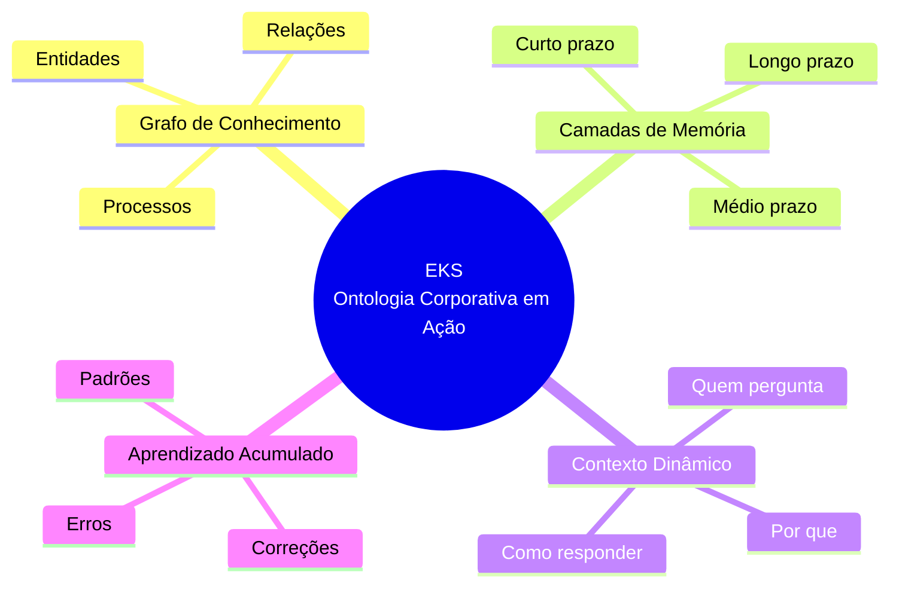
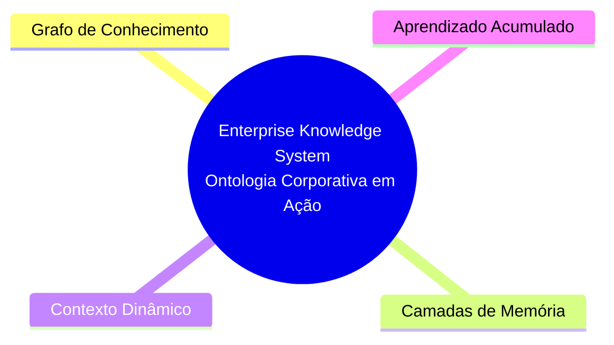
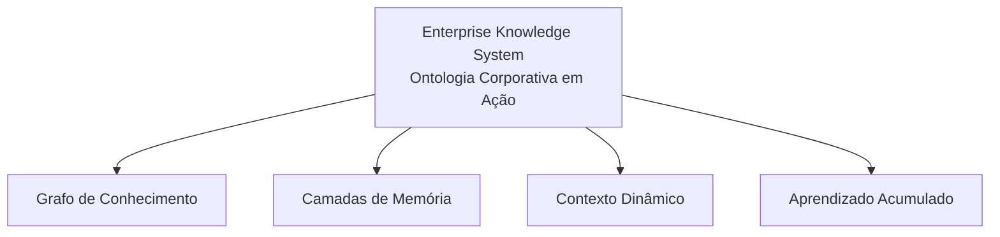

# Diagramas EKS - Enterprise Knowledge System

## Descrição
3 opções de diagrama para o post "O que é EKS e por que você vai ouvir muito sobre isso em 2026"

**Identidade Visual CoCreateAI - Paleta Harmonizada:**
- Coral Principal: #E07B6B (destaque central)
- Coral Claro: #F5D0CC (nós secundários)
- Azul Escuro: #1A202C (texto sobre fundo claro)
- Branco: #FFFFFF (texto sobre fundo escuro)
- Fundo: Branco

---

## Opção 1: MINDMAP COMPLETO (Versão Final)

Com título e nó central maior para melhor visualização.

---

## Opção 2: MINDMAP COM TÍTULO (Versão Final)

Título explícito + 4 pilares principais.

---

## Opção 3: FLOWCHART COM TÍTULO (Versão Final)

Hierarquia clara com título completo.

---

## Paleta de Cores Harmonizada

| Elemento | Cor | Hex | Texto |
|----------|-----|-----|-------|
| Centro/Destaque | Coral | #E07B6B | Branco #FFFFFF |
| Nós Secundários | Coral Claro | #F5D0CC | Escuro #1A202C |
| Fundo Terciário | Rosa Suave | #FFF5F4 | Escuro #1A202C |
| Linhas | Coral | #E07B6B | — |

**Regra de contraste:**
- Fundo escuro → Texto branco
- Fundo claro → Texto escuro

---

## Recomendação

**Para LinkedIn (1080x1080):**
- **Opção 2** (Mindmap Simples) - mais limpo, legível
- Paleta monocromática coral = elegante e harmonizado

---

*Diagramas criados em: 20/01/2026*
*Identidade Visual: CoCreateAI*
*Referência: Post 001_o-que-e-eks.md*
