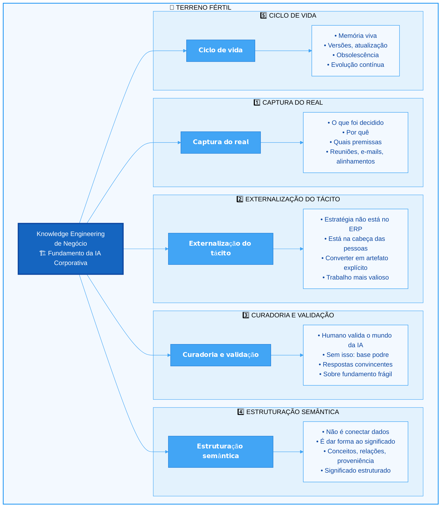
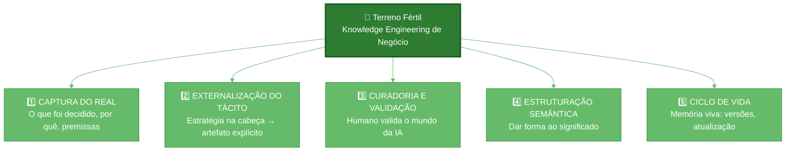

# Diagrama Mermaid - Terreno Fértil: Knowledge Engineering de Negócio

## Código Mermaid

## Versão Simplificada (para LinkedIn)

## Como Gerar a Imagem

1. **Opção 1 - Mermaid Live**: 
   - Acesse https://mermaid.live
   - Copie o código da versão simplificada
   - Exporte como PNG/SVG

2. **Opção 2 - VS Code**:
   - Instale extensão "Mermaid Preview"
   - Cole o código em arquivo .md
   - Use preview para exportar

3. **Opção 3 - Online**:
   - https://mermaidchart.com
   - https://diagrams.net (draw.io) - suporta Mermaid

## Sugestão para o Post

Use a **versão simplificada** (verde) — mais limpa e legível no LinkedIn. O azul mais detalhado pode ser usado em artigos ou apresentações futuras.

---

*Diagrama criado em: 13/02/2026*
*Para uso no post LinkedIn "Terreno Fértil"*
