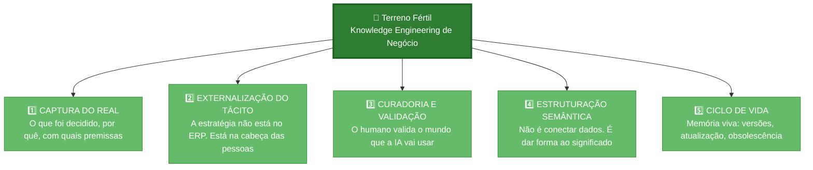

# Terreno Fértil — Diagrama (Mermaid)

```mermaid
flowchart TD
    ROOT["🌱 Terreno Fértil<br/>Knowledge Engineering de Negócio"]

    ROOT --> N1["1️⃣ CAPTURA DO REAL<br/>O que foi decidido, por quê, com quais premissas"]
    ROOT --> N2["2️⃣ EXTERNALIZAÇÃO DO TÁCITO<br/>A estratégia não está no ERP. Está na cabeça das pessoas"]
    ROOT --> N3["3️⃣ CURADORIA E VALIDAÇÃO<br/>O humano valida o mundo que a IA vai usar"]
    ROOT --> N4["4️⃣ ESTRUTURAÇÃO SEMÂNTICA<br/>Não é conectar dados. É dar forma ao significado"]
    ROOT --> N5["5️⃣ CICLO DE VIDA<br/>Memória viva: versões, atualização, obsolescência"]

    style ROOT fill:#2e7d32,color:#ffffff,stroke:#1b5e20,stroke-width:3px
    style N1 fill:#66bb6a,color:#ffffff,stroke:#388e3c
    style N2 fill:#66bb6a,color:#ffffff,stroke:#388e3c
    style N3 fill:#66bb6a,color:#ffffff,stroke:#388e3c
    style N4 fill:#66bb6a,color:#ffffff,stroke:#388e3c
    style N5 fill:#66bb6a,color:#ffffff,stroke:#388e3c
```
