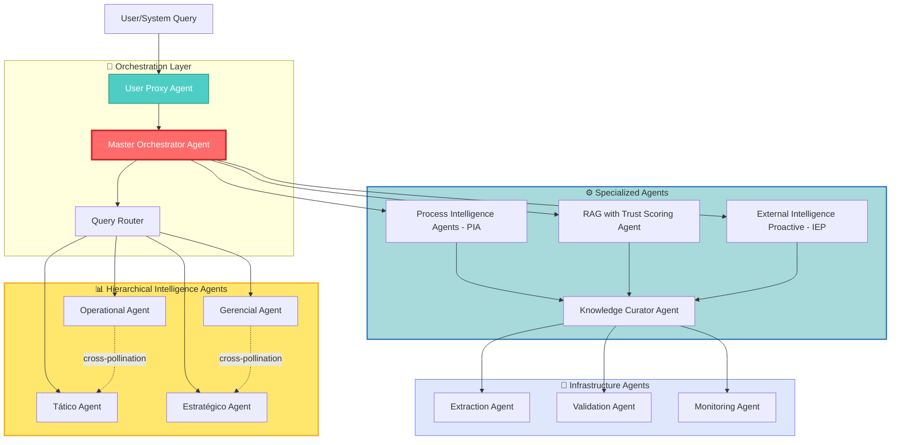
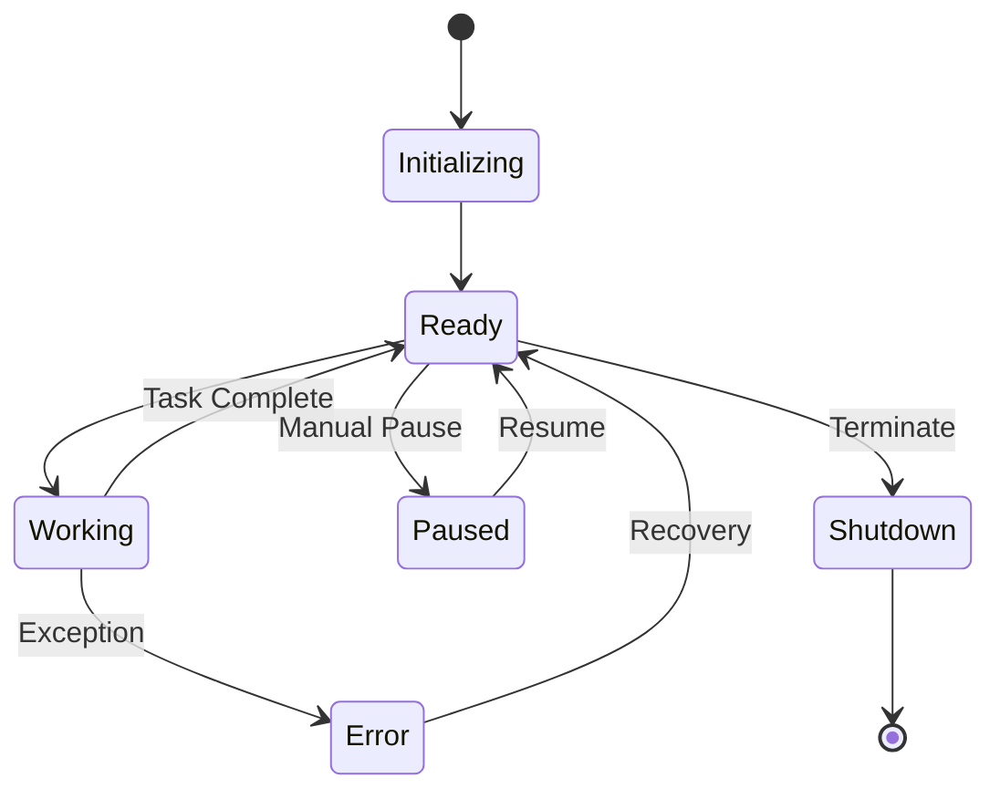

# Agent Framework - EKS Project

> Architecture and specification for the multi-agent ecosystem

**Created**: 2024-12-13  
**Last Updated**: 2024-12-13  
**Status**: 🔴 Design Phase

---

## 🤖 Agent Ecosystem Overview

The EKS project features a sophisticated multi-agent architecture where specialized agents collaborate to provide enterprise intelligence.



---

## 🎯 Core Agent Specifications

### 1. Master Orchestrator Agent

**Role**: Central coordinator and decision maker

**Responsibilities**:
- Route queries to appropriate agents
- Orchestrate multi-agent collaboration
- Synthesize responses from multiple agents
- Manage agent lifecycles
- Resolve conflicts between agent responses
- Maintain conversation context

**Communication Protocol**:
```python
class MessagePacket:
    claim: str
    rationale: str
    evidence_refs: List[str]
    risk: float  # 0-1
    cost: float  # 0-1
    time: float  # 0-1
    impact: float  # 0-1
    novelty: float  # 0-1
    confidence: float  # 0-1
    needs: List[str]
```

**Decision Algorithm**:
- Rank by: `(impact * novelty * confidence) / (cost * time + ε)`
- Create debate pairs for cross-pollination
- Converge via clustering and synthesis

---

### 2. User Proxy Agent

**Role**: User intent understanding and translation

**Responsibilities**:
- Normalize user queries into structured briefs
- Identify user persona and context
- Extract constraints and preferences
- Reformulate ambiguous queries
- Maintain user session state

**Input**: Natural language query  
**Output**: Structured brief with:
- Job-to-be-done
- Constraints
- Persona level (operational/gerencial/tático/estratégico)
- Expected output format
- Priority

---

### 3. Hierarchical Intelligence Agents

#### 3a. Operational Agent
- **Focus**: Data, processes, SLAs, integrations, daily operations
- **Horizon**: Hours to days
- **Queries**: "What's the current status?", "How does this process work?"

#### 3b. Gerencial Agent
- **Focus**: KPIs, costs, capacity, compliance, team management
- **Horizon**: Days to weeks
- **Queries**: "Are we meeting targets?", "Where are the bottlenecks?"

#### 3c. Tático Agent
- **Focus**: Options, trade-offs, short/medium-term roadmap
- **Horizon**: Weeks to quarters
- **Queries**: "What are our options?", "What's the best approach?"

#### 3d. Estratégico Agent
- **Focus**: Value thesis, regulation, positioning, systemic risk
- **Horizon**: Quarters to years
- **Queries**: "What's our long-term strategy?", "What are market threats?"

**Cross-Pollination Patterns**:
- Operational ↔ Tático (viability vs options)
- Gerencial ↔ Estratégico (financial viability vs strategic thesis)

---

## ⚙️ Specialized Agent Specifications

### 4. Process Intelligence Agents (PIA)

**Modular System** with multiple sub-agents:

#### 4a. PIA-Collector
- Guides collaborators through process mapping
- Generates mapping roteiro (roadmap) based on role
- Adapts questions to persona (board, manager, operational)

#### 4b. PIA-Cartographer
- Converts mapping responses into flowcharts
- Creates graph nodes and relationships
- Maintains BPMN-lite process models

#### 4c. PIA-Connector
- Identifies handoffs between areas
- Validates input/output matches
- Detects broken connections

#### 4d. PIA-Auditor
- Points out conflicts and gaps
- Validates completeness
- Flags duplications

#### 4e. PIA-Gamification
- Calculates contribution scores
- Generates missions and badges
- Maintains leaderboards

**Key Metrics**:
- Coverage: % of processes mapped
- Profundity: Detail richness
- Connectivity: Handoff completeness
- Validation: Peer confirmation rate

---

### 5. RAG with Trust Scoring Agent

**Purpose**: Retrieval-augmented generation with explicit confidence

**Components**:
- Chunk extraction with lineage
- Multi-signal trust scoring
- Evidence tracking
- Confidence propagation

**Trust Signals**:
```python
trust_score = σ(
    w_source * source_trust +
    w_extraction * extraction_conf +
    w_semantic * nli_consistency +
    w_corroboration * corroboration_score +
    w_temporal * temporal_freshness +
    w_security * security_score +
    w_feedback * human_feedback
)
```

**Output Format**:
```json
{
  "answer": "...",
  "confidence": 0.87,
  "trust_band": "High",
  "evidence": [
    {
      "chunk_id": "...",
      "source": "email:12345",
      "trust_score": 0.89,
      "excerpt": "..."
    }
  ],
  "trust_breakdown": {
    "source": 0.28,
    "extraction": 0.19,
    "corroboration": 0.24,
    ...
  }
}
```

---

### 6. External Intelligence Proactive (IEP)

**Purpose**: Proactive monitoring of external signals

**Per-Persona Profiles**:
- CFO: taxes, incentives, energy prices, financial risk
- Legal/Compliance: laws, regulations, clauses, decisions
- COO: supply chain, strikes, SLA changes, technical requirements
- CSO/ESG: ESG norms, reporting deadlines, taxonomies
- Sales/CS: client news, competitor moves, market shifts
- Product: tech trends, CVEs, competitor features
- IT/Security: vulnerabilities, patches, incidents, status pages

**Cadence**:
- **Continuous** (near real-time): Regulatory, security incidents, cloud status
- **Hourly**: Competition, strategic clients
- **Daily**: CVEs, macro indicators
- **Weekly**: Research, pricing movements
- **Monthly**: Standards reviews, executive synthesis

**Scoring**:
```python
impact_score = (
    relevance_to_KPI * 
    temporal_proximity * 
    amplitude * 
    source_confidence
)
```

---

### 7. Knowledge Curator Agent

**Purpose**: Maintain graph integrity and quality

**Responsibilities**:
- Validate extracted concepts
- Resolve duplicate entities
- Maintain ontology consistency
- Version knowledge artifacts
- Detect and flag contradictions
- Trigger human curation when needed

**Curation Triggers**:
- Confidence < 0.6
- Contradictory relationships detected
- Orphan nodes (no connections)
- High-impact changes
- Regulatory/compliance content

---

## 🔧 Infrastructure Agent Specifications

### 8. Extraction Agent

**Purpose**: Convert unstructured data to graph

**Two-Phase Process**:

**Phase 1 - Structural (Python, deterministic)**:
- Segment conversations into blocks
- Extract metadata (author, timestamp, context)
- Identify decision blocks, explanations, examples
- Create artifact nodes

**Phase 2 - Semantic (LLM-assisted)**:
- Classify blocks into entity types
- Suggest relationships
- Generate proposals (versioned, auditable)
- Await validation

---

### 9. Validation Agent

**Purpose**: Quality assurance for knowledge

**Validation Levels**:
1. **Syntactic**: Schema compliance
2. **Semantic**: Ontology consistency
3. **Pragmatic**: Business rule compliance
4. **Social**: Peer review flagging

**Output**: Validation report with pass/fail per level

---

### 10. Monitoring Agent

**Purpose**: System health and performance

**Monitors**:
- Agent response times
- Query success rates
- Graph growth rate
- Confidence score distributions
- User feedback sentiment
- Resource utilization

**Alerts**:
- Agent timeout/failure
- Confidence drop below threshold
- Unusual query patterns
- Resource constraints

---

## 🔄 Agent Communication Protocol

### Message Format

```python
@dataclass
class AgentMessage:
    id: str
    from_agent: str
    to_agent: str
    message_type: MessageType  # query | response | proposal | debate | synthesis
    timestamp: datetime
    content: Dict[str, Any]
    context: Optional[Dict[str, Any]]
    requires_response: bool
    deadline: Optional[datetime]
```

### Communication Patterns

**1. Request-Response** (simple queries)
```
User → User Proxy → Master → RAG Agent → Master → User Proxy → User
```

**2. Brainstorming** (complex queries)
```
User → User Proxy → Master → [Hierarchical Agents in parallel]
→ Cross-pollination pairs → Convergence → Synthesis → User
```

**3. Background Processing** (monitoring, curation)
```
Scheduler → IEP/Monitor → Findings → Curator → Graph Update → Alert if needed
```

---

## 📊 Agent Performance Metrics

| Agent | Key Metric | Target |
|-------|-----------|---------|
| Master Orchestrator | Response time | < 5s for simple, < 30s for complex |
| User Proxy | Intent accuracy | > 90% |
| Hierarchical Agents | Response quality | > 85% user satisfaction |
| PIA | Mapping completion rate | > 70% of processes |
| RAG Agent | Answer relevance | > 80% |
| IEP | Signal-to-noise ratio | > 60% |
| Curator | False positive rate | < 10% |

---

## 🔄 Agent Lifecycle Management

### State Machine



### Failure Handling

- **Timeout**: 5 minutes max per agent
- **Retry**: 3 attempts with exponential backoff
- **Fallback**: Master can delegate to alternative agent
- **Circuit Breaker**: Disable failing agent temporarily

---

## 🎯 Development Roadmap

### Phase 1: Foundation (Months 1-2)
- [ ] Implement Master Orchestrator
- [ ] Implement User Proxy
- [ ] Create agent communication protocol
- [ ] Build agent registry and lifecycle management

### Phase 2: Hierarchical Intelligence (Months 2-3)
- [ ] Implement 4 hierarchical agents
- [ ] Build cross-pollination mechanism
- [ ] Create brainstorming cycle orchestration

### Phase 3: Specialized Agents (Months 3-5)
- [ ] Build PIA system (all 5 sub-agents)
- [ ] Implement RAG with trust scoring
- [ ] Create IEP monitoring system

### Phase 4: Infrastructure (Months 5-6)
- [ ] Build extraction pipeline
- [ ] Implement validation framework
- [ ] Create monitoring and alerting

---

## 🔄 Version History

| Version | Date | Changes |
|---------|------|---------|
| 0.1 | 2024-12-13 | Initial agent framework design |

---

## 🎯 Next Steps

1. Create detailed specification for Master Orchestrator (run `/speckit-specify`)
2. Design agent communication protocol
3. Implement agent base class and registry
4. Build simple prototype with 2 agents (Master + User Proxy)
