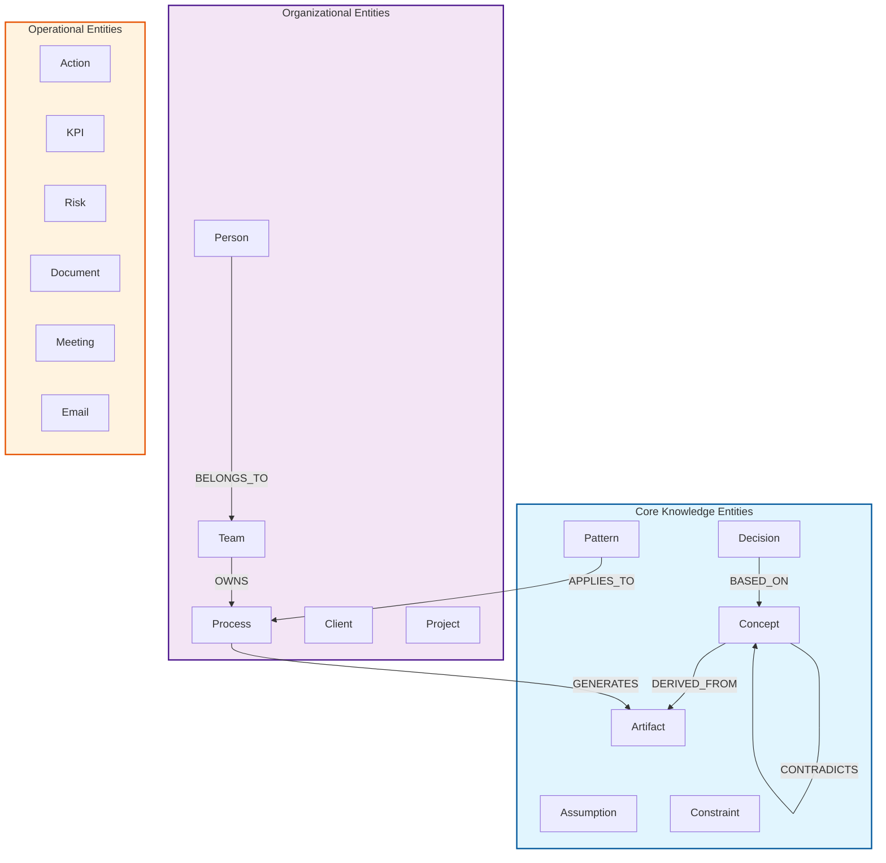

# Database Schema - EKS Project

> ⚠️ **DEPRECATED** - Este arquivo está desatualizado (2024-12-13).  
> **USE**: [`EKS/specs/015-neo4j-graph-model`](../EKS/specs/015-neo4j-graph-model/spec.md) - Modelo canônico  
> **USE**: [`EKS/specs/050-meta-graph-schema`](../EKS/specs/050-meta-graph-schema/spec.md) - Meta-Grafo

---

> Neo4j graph database schema for Enterprise Knowledge System

**Created**: 2024-12-13  
**Last Updated**: 2024-12-13  
**Database**: Neo4j 5.x  
**Status**: ⚠️ DEPRECATED

---

## 🗺️ Schema Overview



---

## 📦 Node Types

### Core Knowledge Nodes

#### Concept
```cypher
CREATE (:Concept {
    id: STRING (UUID),
    name: STRING,
    description: STRING,
    domain: STRING,
    tags: LIST<STRING>,
    confidence: FLOAT [0-1],
    created_at: DATETIME,
    updated_at: DATETIME,
    version: INTEGER
})
```

#### Decision
```cypher
CREATE (:Decision {
    id: STRING (UUID),
    title: STRING,
    context: STRING,
    rationale: STRING,
    alternatives_considered: LIST<STRING>,
    impact: STRING,
    decision_maker: STRING,
    decided_at: DATETIME,
    status: STRING (pending|approved|implemented|deprecated),
    confidence: FLOAT [0-1]
})
```

#### Pattern
```cypher
CREATE (:Pattern {
    id: STRING (UUID),
    name: STRING,
    description: STRING,
    type: STRING (architectural|process|behavioral|anti-pattern),
    domain: STRING,
    use_cases: LIST<STRING>,
    benefits: LIST<STRING>,
    drawbacks: LIST<STRING>,
    confidence: FLOAT [0-1]
})
```

#### Assumption
```cypher
CREATE (:Assumption {
    id: STRING (UUID),
    description: STRING,
    type: STRING (business|technical|organizational),
    validity: STRING (valid|invalid|unverified),
    risk_if_false: STRING (low|medium|high|critical),
    verification_method: STRING,
    verified_at: DATETIME,
    created_at: DATETIME
})
```

#### Constraint
```cypher
CREATE (:Constraint {
    id: STRING (UUID),
    description: STRING,
    type: STRING (technical|legal|business|resource|temporal),
    severity: STRING (must|should|nice-to-have),
    scope: STRING,
    source: STRING,
    expires_at: DATETIME,
    created_at: DATETIME
})
```

#### Artifact
```cypher
CREATE (:Artifact {
    id: STRING (UUID),
    type: STRING (code|document|diagram|conversation|spec),
    title: STRING,
    content: STRING,
    source: STRING,
    author: STRING,
    url: STRING,
    file_path: STRING,
    created_at: DATETIME,
    updated_at: DATETIME,
    version: STRING
})
```

---

### Organizational Nodes

#### Person
```cypher
CREATE (:Person {
    id: STRING (UUID),
    name: STRING,
    email: STRING (UNIQUE),
    role: STRING,
    level: STRING (operational|gerencial|tático|estratégico),
    department: STRING,
    skills: LIST<STRING>,
    active: BOOLEAN,
    created_at: DATETIME
})
```

#### Team
```cypher
CREATE (:Team {
    id: STRING (UUID),
    name: STRING,
    mission: STRING,
    department: STRING,
    size: INTEGER,
    created_at: DATETIME
})
```

#### Process
```cypher
CREATE (:Process {
    id: STRING (UUID),
    name: STRING,
    description: STRING,
    type: STRING,
    inputs: LIST<STRING>,
    outputs: LIST<STRING>,
    steps: LIST<STRING>,
    sla: INTEGER (seconds),
    business_rules: LIST<STRING>,
    created_at: DATETIME,
    updated_at: DATETIME,
    mapped_by: STRING,
    confidence: FLOAT [0-1]
})
```

---

### Operational Nodes

#### Action
```cypher
CREATE (:Action {
    id: STRING (UUID),
    description: STRING,
    owner: STRING,
    due_date: DATETIME,
    status: STRING (pending|in_progress|completed|blocked),
    priority: STRING (P1|P2|P3),
    created_from: STRING,
    completed_at: DATETIME
})
```

#### KPI
```cypher
CREATE (:KPI {
    id: STRING (UUID),
    name: STRING,
    formula: STRING,
    target: FLOAT,
    current_value: FLOAT,
    unit: STRING,
    frequency: STRING (daily|weekly|monthly),
    owner: STRING,
    last_updated: DATETIME
})
```

#### Risk
```cypher
CREATE (:Risk {
    id: STRING (UUID),
    description: STRING,
    category: STRING,
    probability: STRING (low|medium|high),
    impact: STRING (low|medium|high),
    mitigation: STRING,
    owner: STRING,
    status: STRING (identified|mitigating|mitigated|accepted),
    identified_at: DATETIME
})
```

---

## 🔗 Relationship Types

### Knowledge Relationships

```cypher
// Core knowledge evolution
(:Concept)-[:DERIVED_FROM {confidence: FLOAT, extracted_at: DATETIME}]->(:Artifact)
(:Concept)-[:REFINES {description: STRING, version: INTEGER}]->(:Concept)
(:Concept)-[:CONTRADICTS {reason: STRING, severity: STRING}]->(:Concept)
(:Concept)-[:DEPENDS_ON {type: STRING, critical: BOOLEAN}]->(:Concept)
(:Concept)-[:EVOLVED_FROM {changes: STRING, version: INTEGER}]->(:Concept)

// Decision traceability
(:Decision)-[:BASED_ON {weight: FLOAT}]->(:Concept)
(:Decision)-[:SUPERSEDES {reason: STRING}]->(:Decision)
(:Decision)-[:AFFECTS {impact_type: STRING, severity: STRING}]->(:Process|:Project)

// Pattern application
(:Pattern)-[:APPLIES_TO {context: STRING, confidence: FLOAT}]->(:Process|:Component)
(:Pattern)-[:SIMILAR_TO {similarity_score: FLOAT}]->(:Pattern)
```

### Organizational Relationships

```cypher
// People and teams
(:Person)-[:BELONGS_TO {since: DATETIME, role: STRING}]->(:Team)
(:Person)-[:REPORTS_TO {since: DATETIME}]->(:Person)
(:Person)-[:HAS_EXPERTISE {level: STRING, years: INTEGER}]->(:Concept)

// Process ownership
(:Team)-[:OWNS {since: DATETIME, responsibility: STRING}]->(:Process)
(:Person)-[:CONTRIBUTES_TO {role: STRING, hours_per_week: FLOAT}]->(:Process)
(:Process)-[:DEPENDS_ON {type: STRING, critical: BOOLEAN}]->(:Process)
(:Process)-[:DELIVERS_TO {frequency: STRING, format: STRING}]->(:Team|:Client)
```

### Operational Relationships

```cypher
// Actions and execution
(:Action)-[:ASSIGNED_TO]->(:Person)
(:Action)-[:BLOCKS]->(:Action)
(:Action)-[:IMPLEMENTS]->(:Decision)
(:Action)-[:ADDRESSES]->(:Risk)

// KPIs and measurement
(:KPI)-[:MEASURES]->(:Process|:Project)
(:KPI)-[:OWNED_BY]->(:Person)
(:Risk)-[:THREATENS]->(:KPI|:Process|:Project)
```

---

## 🔍 Index Strategy

```cypher
// Unique constraints
CREATE CONSTRAINT unique_person_email IF NOT EXISTS FOR (p:Person) REQUIRE p.email IS UNIQUE;
CREATE CONSTRAINT unique_concept_id IF NOT EXISTS FOR (c:Concept) REQUIRE c.id IS UNIQUE;
CREATE CONSTRAINT unique_artifact_id IF NOT EXISTS FOR (a:Artifact) REQUIRE a.id IS UNIQUE;

// Performance indexes
CREATE INDEX concept_name_index IF NOT EXISTS FOR (c:Concept) ON (c.name);
CREATE INDEX concept_domain_index IF NOT EXISTS FOR (c:Concept) ON (c.domain);
CREATE INDEX artifact_type_index IF NOT EXISTS FOR (a:Artifact) ON (a.type);
CREATE INDEX process_name_index IF NOT EXISTS FOR (p:Process) ON (p.name);
CREATE INDEX person_role_index IF NOT EXISTS FOR (p:Person) ON (p.role);

// Full-text search indexes
CREATE FULLTEXT INDEX concept_search IF NOT EXISTS FOR (c:Concept) ON EACH [c.name, c.description];
CREATE FULLTEXT INDEX artifact_search IF NOT EXISTS FOR (a:Artifact) ON EACH [a.title, a.content];
```

---

## 🎯 Sample Queries

### Find all concepts related to a topic
```cypher
MATCH path = (c:Concept {name: 'Enterprise Knowledge Graph'})-[*1..3]-(related:Concept)
RETURN c, related, relationships(path)
LIMIT 50
```

### Get process dependencies
```cypher
MATCH path = (p:Process {name: 'Knowledge Extraction'})-[:DEPENDS_ON*]->(dep:Process)
RETURN p.name AS process, 
       collect(dep.name) AS dependencies,
       length(path) AS depth
ORDER BY depth
```

### Find decisions without implementation
```cypher
MATCH (d:Decision {status: 'approved'})
WHERE NOT (d)<-[:IMPLEMENTS]-(:Action)
RETURN d.title, d.decided_at, d.decision_maker
ORDER BY d.decided_at DESC
```

---

## 📊 Schema Statistics (Target for MVP)

| Entity Type | Target Count | Status |
|-------------|--------------|--------|
| Concepts | 200+ | 🔴 0 |
| Decisions | 50+ | 🔴 0 |
| Patterns | 30+ | 🔴 0 |
| Processes | 100+ | 🔴 0 |
| People | 20+ | 🔴 0 |
| Artifacts | 1000+ | 🔴 0 |

---

## 🔄 Version History

| Version | Date | Changes |
|---------|------|---------|
| 0.1 | 2024-12-13 | Initial schema design |

---

## 🎯 Next Steps

1. Create Neo4j database instance
2. Implement schema creation scripts
3. Build test data generators
4. Create migration framework for schema evolution
