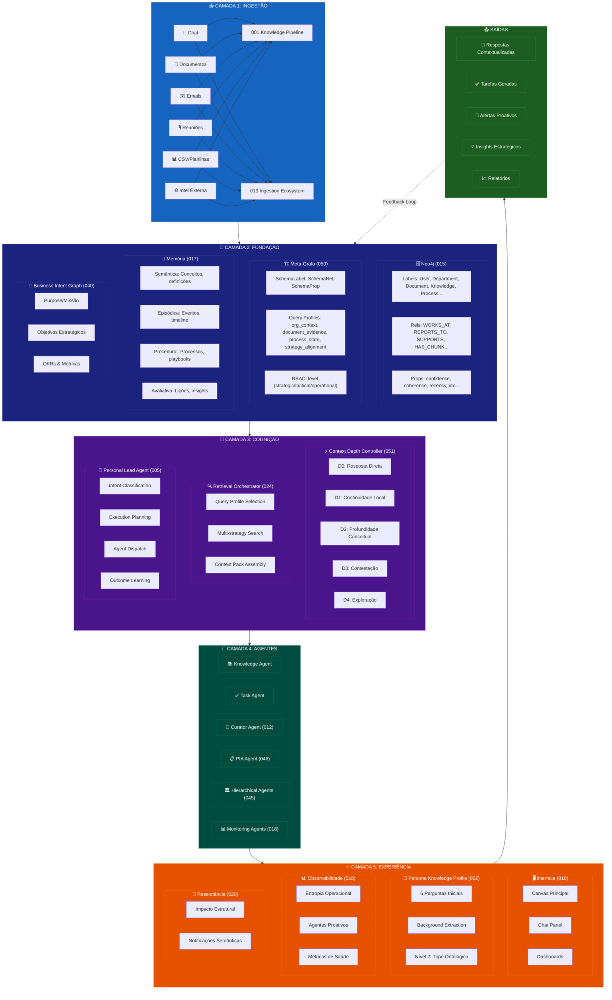
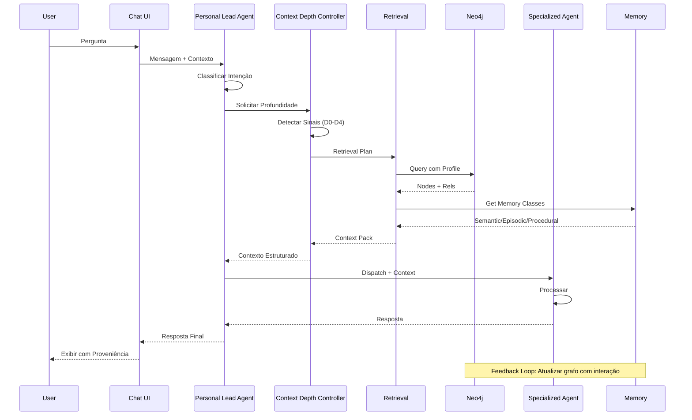
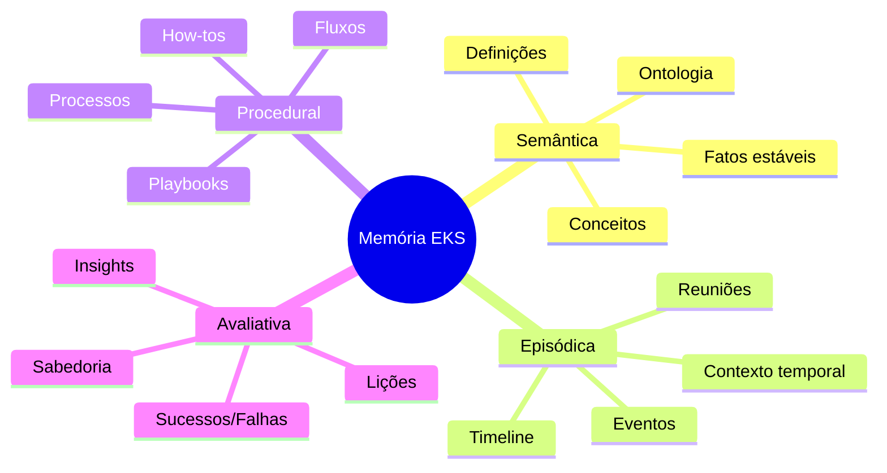
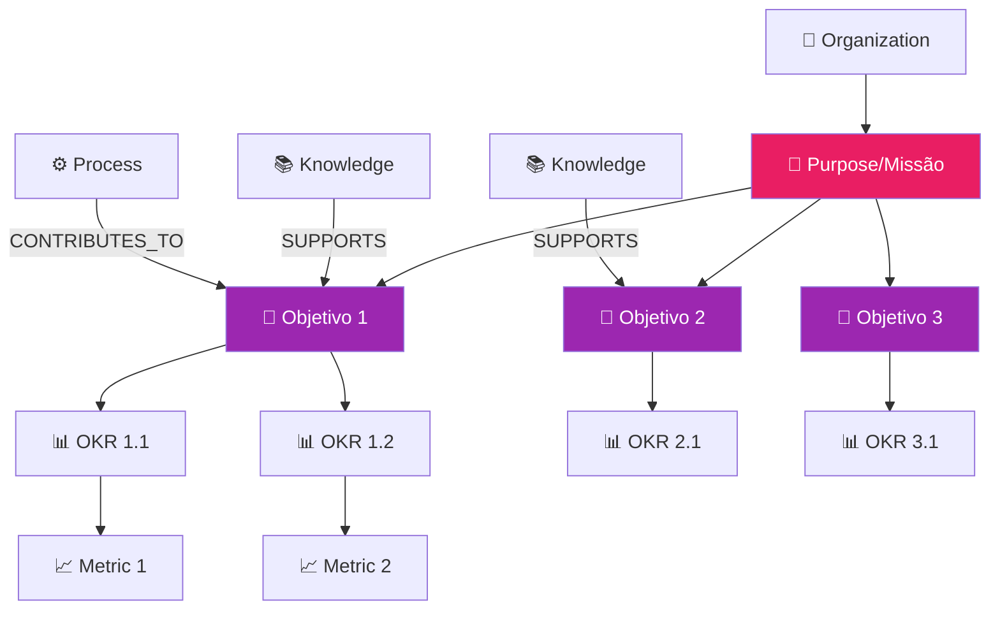
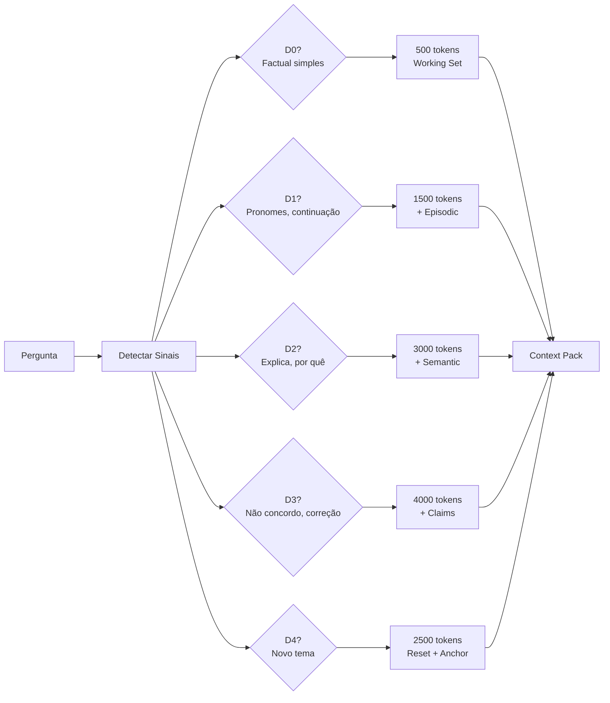
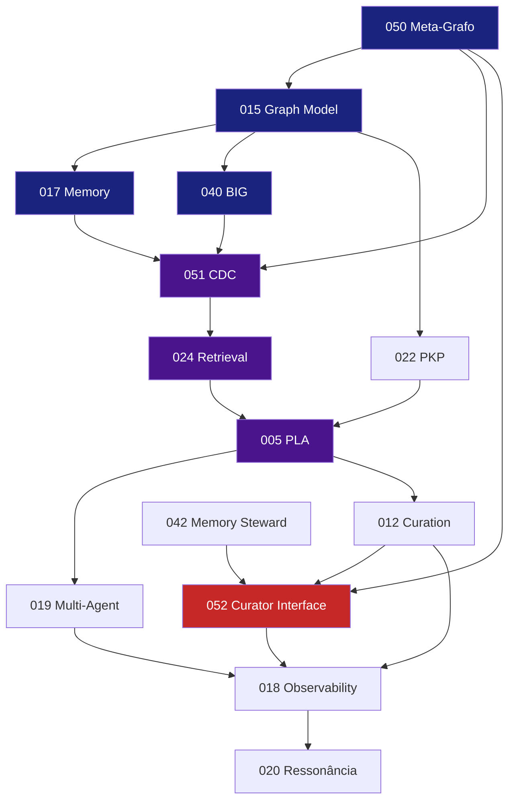
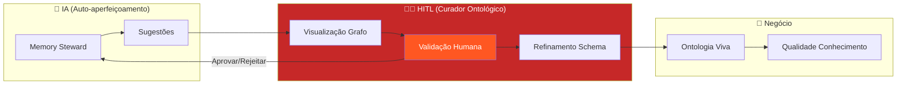

# EKS - Arquitetura Macro do Sistema

> **Atualizado**: 2025-01-19  
> **Status**: Consolidado após revisão de specs

---

## 🎯 Visão do Sistema

O **EKS (Enterprise Knowledge System)** é uma plataforma de inteligência organizacional que:

1. **Captura** conhecimento de múltiplas fontes (chat, documentos, reuniões, emails)
2. **Estrutura** em um grafo de conhecimento vivo (Neo4j)
3. **Classifica** por 4 classes de memória cognitiva
4. **Ancora** a objetivos de negócNio (Business Intent Graph)
5. **Recupera** com profundidade controlada (CDC D0-D4)
6. **Orquestra** agentes especializados (PLA)
7. **Gera** insights proativos (não apenas respostas)

---

## 📐 Arquitetura em 5 Camadas

---

## 🔑 Specs Core por Camada

### Camada 1: Ingestão
| Spec | Propósito |
|------|-----------|
| 001-knowledge-pipeline | Pipeline de extração de conhecimento |
| 007-chat-knowledge-capture | Captura de conhecimento do chat |
| 013-ingestion-ecosystem | Ecossistema de ingestão de documentos |

### Camada 2: Fundação
| Spec | Propósito |
|------|-----------|
| 015-neo4j-graph-model | Modelo de dados canônico |
| 017-memory-ecosystem | 4 classes de memória + bitemporal |
| 040-business-intent-graph | Ancoragem a objetivos |
| 050-meta-graph-schema | Schema-as-data + Query Profiles |

### Camada 3: Cognição
| Spec | Propósito |
|------|-----------|
| 051-context-depth-controller | Controle de profundidade D0-D4 |
| 024-retrieval-orchestration | Orquestração de recuperação |
| 005-agent-router (PLA) | Personal Lead Agent |

### Camada 4: Agentes
| Spec | Propósito |
|------|-----------|
| 012-graph-curation-ecosystem | Curadoria do grafo |
| 019-multi-agent-orchestration | Orquestração de times |
| 045-hierarchical-brainstorm | Debate multi-nível |
| 046-pia-process-intelligence | Mapeamento de processos |

### Camada HITL (Human-in-the-Loop)
| Spec | Propósito |
|------|-----------|
| **052-ontological-curator-interface** | **Epicentro HITL** - Interface para Curador Ontológico refinar a ontologia viva do negócio através de visualização interativa do grafo |

> **Crítico**: O Curador Ontológico NÃO é um Admin nem um Agente IA. É o humano especialista que conhece o negócio e atua sobre o schema semântico dinâmico. Sem esse papel, o EKS não é um sistema cognitivo organizacional - é apenas um RAG sofisticado.

### Camada 5: Experiência
| Spec | Propósito |
|------|-----------|
| 016-main-interface-layout | Layout da interface |
| 018-observability-dashboard | Observabilidade + Entropia |
| 020-gamification-user-kpis | Ressonância |
| 022-onboarding-ai-profile | PKP |

---

## 🔄 Fluxo de Dados Principal

---

## 🧠 As 4 Classes de Memória

---

## 🎯 Business Intent Graph (BIG)

---

## ⚡ Context Depth Controller (CDC)

---

## 📊 Specs Consolidadas (26 Core)

| # | Spec | Camada | Status |
|---|------|--------|--------|
| 001 | knowledge-pipeline | Ingestão | ✅ Core |
| 005 | agent-router (PLA) | Cognição | ✅ Core |
| 007 | chat-knowledge-capture | Ingestão | ✅ Core |
| 012 | graph-curation-ecosystem | Agentes | ✅ Core |
| 013 | ingestion-ecosystem | Ingestão | ✅ Core |
| 014 | provenance-system | Agentes | ✅ Core |
| 015 | neo4j-graph-model | Fundação | ✅ Core |
| 016 | main-interface-layout | Experiência | ✅ Core |
| 017 | memory-ecosystem | Fundação | ✅ Core |
| 018 | observability-dashboard | Experiência | ✅ Core |
| 019 | multi-agent-orchestration | Agentes | ✅ Core |
| 020 | gamification-user-kpis | Experiência | ✅ Core |
| 021 | notification-center | Experiência | ✅ Core |
| 022 | onboarding-ai-profile (PKP) | Experiência | ✅ Core |
| 024 | retrieval-orchestration | Cognição | ✅ Core |
| 040 | business-intent-graph | Fundação | ✅ Core |
| 045 | hierarchical-brainstorm | Agentes | ✅ Core |
| 046 | pia-process-intelligence | Agentes | ✅ Core |
| 050 | meta-graph-schema | Fundação | ✅ Core |
| 051 | context-depth-controller | Cognição | ✅ Core |
| **052** | **ontological-curator-interface** | **HITL** | ✅ **Core (P0)** |

---

## 🔗 Dependências Entre Specs

---

## 🧑‍🔬 O Curador Ontológico (HITL Core)

> "O EKS só se autoaperfeiçoa de forma sustentável quando o aprendizado estatístico é subordinado a uma ontologia de negócio curada visualmente por humanos que entendem a organização."

### O que o Curador Faz
- **Explora** o grafo visualmente para identificar padrões/anomalias
- **Valida** sugestões do Memory Steward (aprovar/rejeitar/modificar)
- **Cria** relacionamentos entre entidades
- **Refina** o schema (novos labels, propriedades, regras)
- **Detecta** antipadrões organizacionais (centralizadores, ciclos, órfãos)
- **Ensina** a IA através de feedback (reinforcement learning)

---

**Última Atualização**: 2025-01-19

---

## 📚 Fontes Canônicas

> Este é o **documento mestre** de arquitetura. Outros arquivos na pasta `project-context/` estão deprecados.

| Aspecto | Fonte Canônica |
|---------|----------------|
| **Arquitetura Geral** | Este arquivo (`eks-architecture.md`) |
| **Modelo de Dados** | `EKS/specs/015-neo4j-graph-model/spec.md` |
| **Meta-Grafo** | `EKS/specs/050-meta-graph-schema/spec.md` |
| **Memória** | `EKS/specs/017-memory-ecosystem/spec.md` |
| **CDC** | `EKS/specs/051-context-depth-controller/spec.md` |
| **HITL / Curador Ontológico** | `EKS/specs/052-ontological-curator-interface/spec.md` |
| **Agentes** | `EKS/specs/019-multi-agent-orchestration/spec.md` |
| **Roadmap** | `EKS/specs/_ROADMAP.md` |
| **Env Vars** | `project-context/env-vars.md` (operacional) |
| **Tools** | `project-context/tools-registry.md` (operacional) |

### Arquivos Deprecados

- ~~`project-overview.md`~~ → Use este arquivo
- ~~`agent-framework.md`~~ → Use spec 019
- ~~`database-schema.md`~~ → Use spec 015 + 050
- ~~`project-workplan.md`~~ → Use `_ROADMAP.md`

