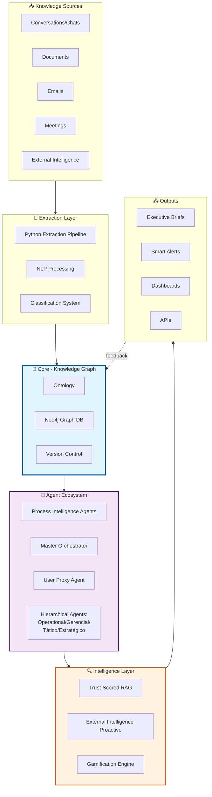

# Project Overview - EKS (Enterprise Knowledge System)

> 📊 **DASHBOARD ARTIFACT** - Macro view of the project, functional blocks, status, and gaps.

**Project**: EKS - Enterprise Knowledge System  
**Vision**: Create an AI-native enterprise framework that transforms organizational knowledge into a living, queryable, multi-agent ecosystem  
**Created**: 2024-12-13  
**Last Updated**: 2024-12-13

---

## 🎯 Project Vision

Build a comprehensive Enterprise Knowledge System that:

1. **Extracts and structures** organizational knowledge from multiple sources (conversations, documents, emails, meetings)
2. **Maintains a living graph** of concepts, decisions, processes, and relationships
3. **Enables multi-agent intelligence** with specialized agents for different organizational perspectives
4. **Provides proactive insights** through external intelligence monitoring
5. **Supports collaborative mapping** with gamification for continuous knowledge contribution
6. **Ensures quality** through trust-scored retrieval and validation mechanisms

---

## 🏗️ System Architecture (High-Level)

---

## 📦 Functional Blocks

### 1. Knowledge Extraction & Classification 🔴 NOT STARTED
**Purpose**: Extract structured knowledge from unstructured sources

**Components**:
- Python-based conversation parser
- NLP classification engine
- Concept extraction system
- Relationship detection

**Key Concepts from Source Material**:
- Extract without "wasting LLM" - deterministic extraction first
- Two-phase: structural (Python) + semantic (LLM-assisted)
- Graph as source of truth, not text

**Gaps** `[?]`:
- Which NLP framework? (spaCy, Hugging Face, custom)
- Batch processing strategy for large conversation archives
- Error handling for malformed input

---

### 2. Enterprise Knowledge Graph (EKG) 🔴 NOT STARTED
**Purpose**: Living graph of organizational knowledge

**Components**:
- Neo4j database
- Ontology definition (domain-agnostic base + domain-specific extensions)
- Versioning system
- Query optimization layer

**Core Entities** (from conversations):
- `Concept`, `Decision`, `Pattern`, `Assumption`, `Constraint`, `Artifact`
- `Person`, `Team`, `Process`, `Client`, `Project`, `KPI`, `Risk`

**Core Relationships**:
- `DERIVED_FROM`, `REFINES`, `CONTRADICTS`, `DEPENDS_ON`, `VALID_IN_CONTEXT`, `EVOLVED_FROM`

**Gaps** `[?]`:
- Graph partitioning strategy for scale
- Backup and disaster recovery
- Migration path for ontology evolution

---

### 3. Process Intelligence Agents (PIA) 🔴 NOT STARTED
**Purpose**: Collaborative process mapping with automated analysis

**Components**:
- Mapping interface (gamified)
- Coherence analyzer (input/output matching between areas)
- Gap detection engine
- Business rules extractor
- Human curation interface

**Key Features from Conversations**:
- Collaborators map macro→micro
- PIA validates connections between areas
- Automatic conflict detection
- Extracts business rules from process descriptions

**Gaps** `[?]`:
- Gamification mechanics details
- Curation workflow design
- Integration with existing process management tools

---

### 4. Multi-Agent Brainstorming System 🔴 NOT STARTED
**Purpose**: Intelligent query resolution through agent collaboration

**Components**:
- Master orchestrator
- User proxy agent
- Hierarchical agents (Operational, Gerencial, Tático, Estratégico)
- Cross-pollination protocol
- Convergence engine

**Architecture from Conversations**:
- Graph-based communication (not linear)
- 5-phase cycle: Intenção → Divergência → Cross-pollination → Convergência → Verificação
- Scoring: impact * novelty * confidence / (cost * time)

**Gaps** `[?]`:
- Message format specification
- Conflict resolution protocol
- Performance optimization for high-volume queries

---

### 5. Trust-Scored RAG 🔴 NOT STARTED
**Purpose**: Retrieval with confidence metrics

**Components**:
- Chunk extraction with trust scoring
- Multi-signal confidence calculation
- Evidence tracking
- Validation interface

**Trust Signals** (from conversations):
- Source/Authorship
- Extraction quality
- Content consistency
- Corroboration
- Temporal freshness
- Security/Integrity

**Gaps** `[?]`:
- Calibration methodology
- Real-time vs batch scoring
- Integration with existing document management

---

### 6. External Intelligence Proactive (IEP) 🔴 NOT STARTED
**Purpose**: Proactive monitoring of external signals

**Components**:
- Persona-based observation profiles
- Source collectors (RSS, APIs, web scraping)
- Impact scoring engine
- Alert routing system

**Monitoring Areas**:
- Regulatory changes
- Competition movements
- Client/supplier signals
- Technology/CVE updates
- Market macro indicators

**Gaps** `[?]`:
- Source reliability scoring
- Alert fatigue prevention
- Integration with existing intelligence tools

---

## 🎨 Key Innovations

### Innovation 1: Spec-Driven Graph Simulation
Build graphs through simulation, not design-first. The specification emerges from use.

### Innovation 2: Knowledge as Graph, Not Text
Text is a projection. Graph is the source of truth. Documents are generated views.

### Innovation 3: Multi-Level Agent Architecture
Hierarchical agents (Op/Ger/Tac/Est) with cross-level debates, not single-agent responses.

### Innovation 4: Gamified Collaborative Mapping
Employees become "sensors" of organizational knowledge through micro-tasks and badges.

### Innovation 5: Trust-Transparent RAG
Every chunk has explicit confidence score and evidence trail. No "black box" responses.

---

## 🚧 Known Gaps & Open Questions

### Architecture Gaps
- [ ] **Gap A1**: How to handle conflicting knowledge from different sources?
- [ ] **Gap A2**: Graph partitioning strategy for enterprise scale (millions of nodes)?
- [ ] **Gap A3**: Real-time vs batch processing decision criteria?

### Integration Gaps
- [ ] **Gap I1**: Integration with existing enterprise tools (CRM, ERP, PM)?
- [ ] **Gap I2**: Single sign-on and RBAC strategy?
- [ ] **Gap I3**: Data privacy and GDPR compliance for personal information in graph?

### Operational Gaps
- [ ] **Gap O1**: Deployment architecture (cloud, on-prem, hybrid)?
- [ ] **Gap O2**: Monitoring and observability strategy?
- [ ] **Gap O3**: Cost estimation for Neo4j at scale?

### User Experience Gaps
- [ ] **Gap U1**: Dashboard design for different personas (C-level, managers, operational)?
- [ ] **Gap U2**: Mobile access requirements?
- [ ] **Gap U3**: Notification preferences and overload prevention?

---

## 📊 Project Metrics

**Complexity**: 🔴 High (Multi-agent system + Graph database + ML components)  
**Innovation Level**: 🟢 Very High (Novel architecture combining multiple cutting-edge concepts)  
**Team Size Recommended**: 4-6 developers + 1 architect + 1 UX designer  
**Estimated Timeline**: 9-12 months for MVP

---

## 🎯 Success Criteria

### MVP Success (3-4 months)
- [ ] Knowledge extraction from 10 sample conversations → graph
- [ ] Basic ontology with 20+ entity types
- [ ] 3 working agents (User Proxy, Master, 1 hierarchical)
- [ ] Simple RAG with trust scores
- [ ] Demo dashboard

### Production Success (9-12 months)
- [ ] Full PIA system with gamification
- [ ] Complete multi-agent architecture (6+ agents)
- [ ] Trust-scored RAG with validation workflows
- [ ] External intelligence monitoring (5+ sources)
- [ ] Enterprise-grade security and compliance
- [ ] 10,000+ nodes in production graph

---

## 📚 Source Knowledge Base

This project is built on insights from **10 extensive conversations** covering:
- Enterprise Knowledge Systems philosophy
- Ontology and graph design principles
- Multi-agent architecture patterns
- Process intelligence and mapping
- RAG quality and trust mechanisms
- Gamification for knowledge contribution
- External intelligence monitoring
- Spec-driven development methodology

**Source Files**: `chat/chat001.txt` through `chat/chat010.txt`

---

## 🔄 Version History

| Version | Date | Changes | Author |
|---------|------|---------|--------|
| 0.1 | 2024-12-13 | Initial overview creation from conversation analysis | Cascade |

---

## 🎯 Next Steps

1. **IMMEDIATE**: Run `/speckit-constitution` to extract and formalize core principles
2. Create first specification: "Knowledge Extraction Pipeline" using `/speckit-specify`
3. Create second specification: "Base Ontology Design" using `/speckit-specify`
4. Begin development environment setup

---

**🔄 This overview is continuously updated as the project evolves. It serves as the macro dashboard for all stakeholders and AI agents.**
