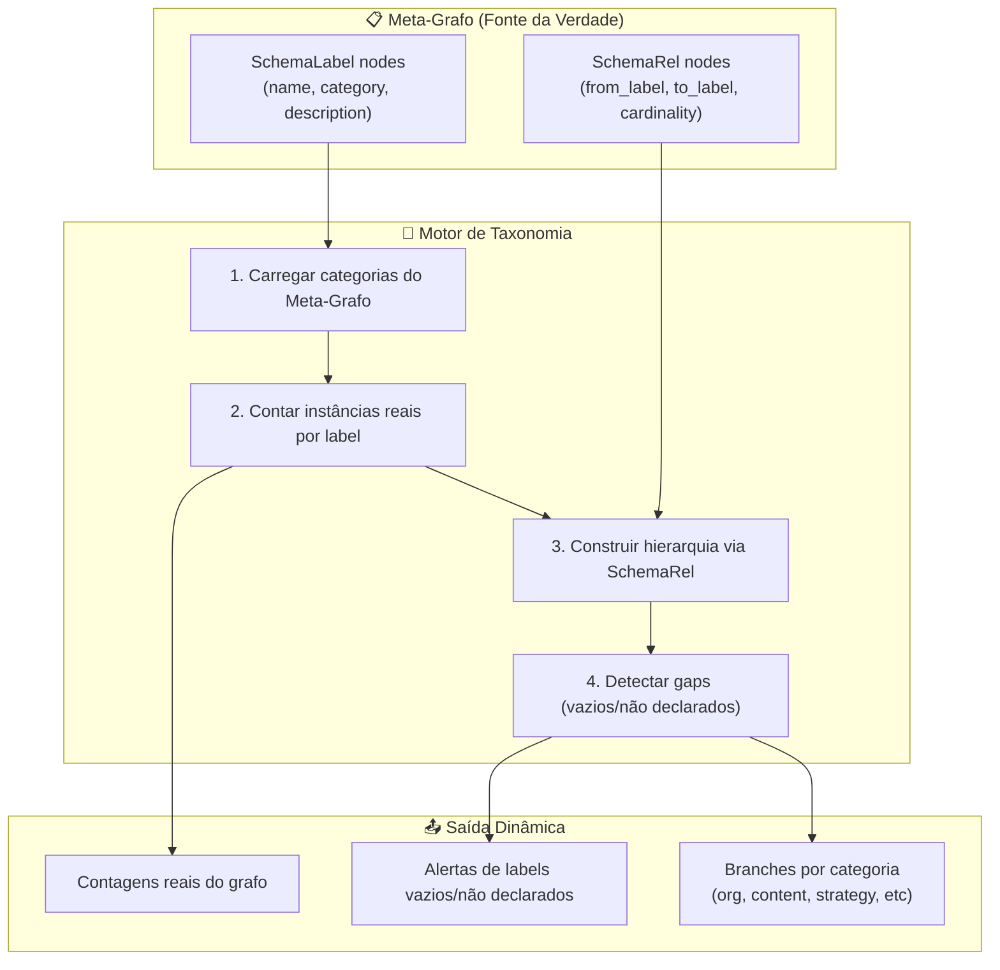
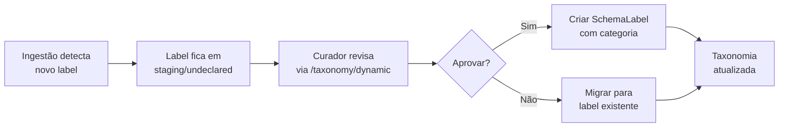

# Taxonomia Dinâmica - EKS

**Criado**: 2026-02-24  
**Status**: Implementado  
**Endpoint**: `GET /ontology/taxonomy/dynamic`

---

## Visão Geral

A **Taxonomia Dinâmica** é a representação navegável da estrutura do grafo EKS, **gerada automaticamente** a partir do Meta-Grafo (Spec 050) e das instâncias reais no Neo4j.

### Diferença da Taxonomia Estática

| Aspecto | Taxonomia Estática (`/taxonomy`) | Taxonomia Dinâmica (`/taxonomy/dynamic`) |
|---------|----------------------------------|------------------------------------------|
| **Fonte** | Hardcoded (3 branches fixas) | Meta-Grafo + contagens reais |
| **Atualização** | Manual (código) | Automática (a cada ingestão) |
| **Cobertura** | Parcial (Org, Strategy, Projects) | Completa (todas as categorias) |
| **Gaps** | Não detecta | Detecta labels vazios e não declarados |
| **Hierarquia** | Fixa | Dinâmica via SchemaRel |

---

## Arquitetura



---

## Endpoint: `GET /ontology/taxonomy/dynamic`

### Resposta

```typescript
{
  success: true,
  data: {
    hasMetaGraph: boolean,           // Se Meta-Grafo está bootstrapped
    categories: [                     // Categorias do Meta-Grafo
      {
        name: "organization",
        displayName: "Estrutura Organizacional",
        labels: [
          {
            label: "Company",
            count: 1,                 // Instâncias reais no grafo
            description: "Empresas e organizações",
            empty: false,             // Se count === 0
            undeclared: false,        // Se não está no Meta-Grafo
            children: [               // Hierarquia via SchemaRel
              {
                label: "Department",
                count: 5,
                description: "Departamentos e áreas",
                empty: false,
                undeclared: false,
                children: []
              }
            ]
          }
        ]
      },
      {
        name: "content",
        displayName: "Conhecimento & Conteúdo",
        labels: [...]
      }
    ],
    gaps: [                           // Labels problemáticos
      {
        label: "Process",
        category: "process",
        issue: "empty",               // "empty" | "undeclared"
        message: "Definido no Meta-Grafo (process) mas sem instâncias no grafo"
      },
      {
        label: "CustomEntity",
        category: "unknown",
        issue: "undeclared",
        message: "23 instâncias no grafo mas não declarado no Meta-Grafo"
      }
    ],
    totalLabels: 15,                  // Total de labels no grafo
    totalInstances: 342,              // Total de nós no grafo
    lastUpdated: "2026-02-24T22:45:00Z"
  }
}
```

---

## Categorias do Meta-Grafo

| Categoria | Display Name | Labels Típicos |
|-----------|--------------|----------------|
| `organization` | Estrutura Organizacional | Company, Department, Area |
| `person` | Pessoas | User, Person |
| `content` | Conhecimento & Conteúdo | Document, Chunk, Knowledge, DocSummary |
| `strategy` | Estratégia (BIG) | Objective, OKR, Purpose |
| `process` | Processos & Tarefas | Process, Task, Plan, Action |
| `memory` | Conversas & Memória | Conversation, Message |
| `unknown` | Não Categorizado | Labels não declarados no Meta-Grafo |

---

## Detecção de Gaps

### 1. Labels Vazios (Empty)

**Definição**: Label está declarado no Meta-Grafo mas **não tem instâncias** no grafo.

**Exemplo**:
```json
{
  "label": "Process",
  "category": "process",
  "issue": "empty",
  "message": "Definido no Meta-Grafo (process) mas sem instâncias no grafo"
}
```

**Ação do Curador**:
- ✅ Normal se label ainda não foi ingerido
- ⚠️ Priorizar ingestão se for label essencial
- ❌ Remover do Meta-Grafo se label foi deprecado

---

### 2. Labels Não Declarados (Undeclared)

**Definição**: Label **existe no grafo** mas não está declarado no Meta-Grafo.

**Exemplo**:
```json
{
  "label": "CustomEntity",
  "category": "unknown",
  "issue": "undeclared",
  "message": "23 instâncias no grafo mas não declarado no Meta-Grafo"
}
```

**Ação do Curador**:
1. **Revisar**: O label é válido ou é lixo de ingestão?
2. **Categorizar**: Em qual categoria ele se encaixa?
3. **Criar SchemaLabel**:
   ```cypher
   CREATE (:SchemaLabel {
     name: 'CustomEntity',
     category: 'content',
     description: 'Entidades customizadas do domínio X',
     created_at: datetime()
   })
   ```
4. **Ou Migrar**: Se for duplicata, migrar para label existente

---

## Hierarquia Dinâmica

A hierarquia é construída automaticamente a partir dos **relacionamentos hierárquicos**:

| Relacionamento | Hierarquia |
|----------------|------------|
| `HAS_DEPARTMENT` | Company → Department |
| `HAS_AREA` | Company → Area |
| `PART_OF` | Department → SubDepartment |
| `BELONGS_TO_OBJECTIVE` | OKR → Objective |
| `HAS_CHUNK` | Document → Chunk |
| `HAS_TASK` | Plan → Task |

**Exemplo**:
```
Company (1)
  └─ Department (5)
       └─ User (12)

Objective (3)
  └─ OKR (8)

Document (23)
  └─ Chunk (156)
```

---

## Fallback sem Meta-Grafo

Se o Meta-Grafo **não estiver bootstrapped** (`hasMetaGraph: false`), o endpoint usa **heurística** para categorizar labels conhecidos:

```typescript
const heuristicCategories = {
  organization: ['Company', 'Department', 'Area', 'Organization'],
  person: ['User', 'Person'],
  content: ['Document', 'Chunk', 'Knowledge', 'DocSummary'],
  strategy: ['Objective', 'OKR', 'Purpose', 'StrategicObjective'],
  process: ['Process', 'Task', 'Plan', 'Action'],
  memory: ['Conversation', 'Message'],
};
```

**Limitação**: Labels customizados vão para categoria `unknown`.

---

## Papel do Curador Ontológico

### Responsabilidades na Taxonomia

#### 1. **Validação de Categorias**
- Revisar se labels estão na categoria correta
- Ex: `User` está em `organization` ou `person`?
- Ajustar `SchemaLabel.category` se necessário

#### 2. **Detecção de Inconsistências**
- Labels não declarados no Meta-Grafo → criar SchemaLabel
- Hierarquias quebradas (ex: OKR sem Objective pai) → corrigir dados
- Relacionamentos invertidos → ajustar SchemaRel

#### 3. **Enriquecimento Semântico**
- Adicionar `description` em SchemaLabel
- Definir `cardinality` em SchemaRel (1:1, 1:N, N:M)
- Marcar propriedades obrigatórias em SchemaProp

#### 4. **Aprovação de Mudanças**
- Novos labels só entram no Meta-Grafo após curadoria
- Mudanças de categoria precisam de aprovação
- Deprecação de labels antigos (migração de dados)

---

### Fluxo de Curadoria



---

### Queries de Curadoria

#### Criar SchemaLabel para label não declarado

```cypher
CREATE (:SchemaLabel {
  name: 'NewLabel',
  category: 'content',
  description: 'Descrição semântica do label',
  is_abstract: false,
  created_at: datetime(),
  updated_at: datetime()
})
```

#### Migrar instâncias de label duplicado

```cypher
// Migrar CustomEntity → Knowledge
MATCH (n:CustomEntity)
SET n:Knowledge
REMOVE n:CustomEntity
```

#### Corrigir categoria de label existente

```cypher
MATCH (sl:SchemaLabel {name: 'User'})
SET sl.category = 'person',
    sl.updated_at = datetime()
```

---

## Integração com Análise Semântica

A Taxonomia Dinâmica alimenta o endpoint `/ontology/semantic-analysis`:

- **Labels vazios** → aparecem como `info` findings
- **Labels não declarados** → aparecem como `warning` findings
- **Cobertura por categoria** → `categoryMap` no semantic-analysis

---

## Exemplo de Uso

### 1. Consultar taxonomia atual

```bash
GET /ontology/taxonomy/dynamic
```

### 2. Identificar gaps

```json
{
  "gaps": [
    {
      "label": "Process",
      "category": "process",
      "issue": "empty",
      "message": "Definido no Meta-Grafo (process) mas sem instâncias no grafo"
    }
  ]
}
```

### 3. Curador decide: priorizar ingestão de Process

- Ingerir dados de processos via CSV/API
- Próxima chamada ao endpoint: `Process.count > 0`, gap desaparece

### 4. Identificar label não declarado

```json
{
  "gaps": [
    {
      "label": "Milestone",
      "category": "unknown",
      "issue": "undeclared",
      "message": "15 instâncias no grafo mas não declarado no Meta-Grafo"
    }
  ]
}
```

### 5. Curador cria SchemaLabel

```cypher
CREATE (:SchemaLabel {
  name: 'Milestone',
  category: 'process',
  description: 'Marcos de projeto',
  created_at: datetime()
})
```

### 6. Próxima chamada: Milestone aparece em `process` category

---

## Atualização Automática

A taxonomia é **sempre dinâmica**:

1. **Nova ingestão** → novos labels aparecem automaticamente
2. **Curador cria SchemaLabel** → label sai de `unknown` para categoria correta
3. **Dados deletados** → `count` diminui, pode virar `empty`
4. **SchemaRel criado** → hierarquia atualizada automaticamente

**Não há cache**: cada chamada ao endpoint reflete o estado atual do grafo.

---

## Próximos Passos

1. ✅ Endpoint implementado
2. ⏳ Frontend: UI de navegação da taxonomia (tree view)
3. ⏳ Frontend: Aba "Gaps" no OntologyHealth
4. ⏳ Curador: Interface de aprovação de labels não declarados
5. ⏳ Automação: Script de bootstrap do Meta-Grafo (Spec 050)

---

## Referências

- **Spec 050**: Meta-Grafo e Schema Operacional
- **Spec 015**: Neo4j Graph Data Model
- **Endpoint**: `EKS/backend/src/routes/ontology.routes.ts` (linha 385)
- **Análise Semântica**: `GET /ontology/semantic-analysis`
