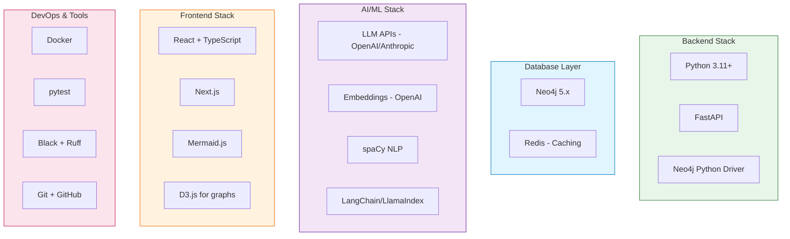

# Tools & Technology Registry - EKS Project

> Complete inventory of tools, frameworks, and MCPs used in the project

**Created**: 2024-12-13  
**Last Updated**: 2024-12-13

---

## 🗂️ Tech Stack Overview



---

## 🐍 Python Dependencies

### Core Framework
```toml
[tool.poetry.dependencies]
python = "^3.11"
fastapi = "^0.109.0"
uvicorn = {extras = ["standard"], version = "^0.27.0"}
pydantic = "^2.5.0"
pydantic-settings = "^2.1.0"
```

### Graph Database
```toml
neo4j = "^5.16.0"
neo4j-driver = "^5.16.0"
```

### AI/ML
```toml
openai = "^1.10.0"
anthropic = "^0.18.0"
langchain = "^0.1.0"
langchain-community = "^0.0.20"
langchain-openai = "^0.0.5"
spacy = "^3.7.2"
tiktoken = "^0.5.2"
```

### NLP & Text Processing
```toml
spacy = "^3.7.2"
transformers = "^4.37.0"
sentence-transformers = "^2.3.1"
nltk = "^3.8.1"
beautifulsoup4 = "^4.12.0"
html2text = "^2024.2.26"
```

### Data Processing
```toml
pandas = "^2.2.0"
numpy = "^1.26.0"
pydantic = "^2.5.0"
python-dateutil = "^2.8.2"
```

### Utilities
```toml
python-dotenv = "^1.0.0"
tenacity = "^8.2.3"
httpx = "^0.26.0"
redis = "^5.0.1"
celery = "^5.3.6"
```

### Development Tools
```toml
[tool.poetry.dev-dependencies]
pytest = "^8.0.0"
pytest-asyncio = "^0.23.0"
pytest-cov = "^4.1.0"
black = "^24.1.0"
ruff = "^0.2.0"
mypy = "^1.8.0"
pre-commit = "^3.6.0"
```

---

## 🗄️ Database & Storage

### Neo4j
- **Version**: 5.x
- **Purpose**: Primary graph database for knowledge graph
- **Connection**: Bolt protocol (port 7687)
- **Plugins**: APOC, Graph Data Science Library
- **Backup**: Neo4j Enterprise backup tools

### Redis
- **Version**: 7.x
- **Purpose**: Caching, session management, task queue
- **Use Cases**:
  - Query result caching
  - Rate limiting
  - Temporary data storage
  - Celery message broker

---

## 🤖 AI/LLM Services

### OpenAI
- **Models**: 
  - `gpt-4-turbo-preview` - Main reasoning
  - `gpt-3.5-turbo` - Fast queries
  - `text-embedding-3-large` - Embeddings (3072 dim)
- **Rate Limits**: Enterprise tier
- **Use Cases**: Semantic extraction, classification, reasoning

### Anthropic Claude (Optional backup)
- **Models**: `claude-3-opus`, `claude-3-sonnet`
- **Use Cases**: Fallback for complex reasoning

---

## 🛠️ Development Tools

### Code Quality
```bash
# Formatter
black

 --line-length 100 --target-version py311

# Linter
ruff check src/ --fix

# Type checker
mypy src/ --strict

# Pre-commit hooks
pre-commit run --all-files
```

### Testing
```bash
# Unit tests
pytest tests/unit/ -v --cov=src --cov-report=html

# Integration tests
pytest tests/integration/ -v

# E2E tests
pytest tests/e2e/ -v
```

### Git Hooks (pre-commit)
```yaml
# .pre-commit-config.yaml
repos:
  - repo: https://github.com/psf/black
    rev: 24.1.0
    hooks:
      - id: black
  - repo: https://github.com/astral-sh/ruff-pre-commit
    rev: v0.2.0
    hooks:
      - id: ruff
  - repo: https://github.com/pre-commit/mirrors-mypy
    rev: v1.8.0
    hooks:
      - id: mypy
```

---

## 🌐 Frontend Technologies

### Framework
- **React** 18+ with TypeScript
- **Next.js** 14+ for SSR and routing
- **Tailwind CSS** for styling

### Visualization
- **Mermaid.js** - Diagram rendering
- **D3.js** - Interactive graph visualization
- **Recharts** - Charts and dashboards
- **React Flow** - Node-based UI

### State Management
- **Zustand** or **Jotai** - Lightweight state
- **React Query** - Server state management

---

## 🔧 MCPs & Integrations (Planned)

### MongoDB MCP (if needed)
```json
{
  "mcp": {
    "servers": {
      "mongodb": {
        "command": "npx",
        "args": ["-y", "@modelcontextprotocol/server-mongodb"],
        "env": {
          "MONGODB_URI": "mongodb://localhost:27017"
        }
      }
    }
  }
}
```

### Custom EKS MCP (Future)
```json
{
  "mcp": {
    "servers": {
      "eks": {
        "command": "python",
        "args": ["-m", "eks.mcp_server"],
        "env": {
          "NEO4J_URI": "${NEO4J_URI}",
          "NEO4J_USER": "${NEO4J_USER}",
          "NEO4J_PASSWORD": "${NEO4J_PASSWORD}"
        }
      }
    }
  }
}
```

---

## 📦 Deployment Tools

### Containerization
```dockerfile
# Docker
FROM python:3.11-slim
# ... configuration
```

### Orchestration (Future)
- **Docker Compose** - Local development
- **Kubernetes** - Production deployment
- **Helm Charts** - K8s configuration management

### CI/CD
- **GitHub Actions** - Automated testing and deployment
- **Pre-commit hooks** - Local quality gates

---

## 📊 Monitoring & Observability

### Logging
- **structlog** - Structured logging
- **JSON log format** - Machine-parseable logs

### Metrics
- **Prometheus** - Metrics collection
- **Grafana** - Dashboards

### Tracing (Future)
- **OpenTelemetry** - Distributed tracing
- **Jaeger** - Trace visualization

---

## 🔐 Security Tools

### Authentication
- **JWT** - Token-based auth
- **OAuth2** - Third-party authentication

### Secrets Management
- **python-dotenv** - Local development
- **HashiCorp Vault** or **Azure Key Vault** - Production

### Dependency Scanning
- **Safety** - Python dependency vulnerability scanner
- **Dependabot** - Automated dependency updates

---

## 📚 Documentation Tools

### API Documentation
- **FastAPI auto-docs** - Interactive API docs (Swagger/ReDoc)

### Project Documentation
- **MkDocs** - Documentation site generator
- **Mermaid** - Diagrams in markdown

---

## 🔄 Version Control

### Git Strategy
- **Main branch** - Production-ready code
- **Develop branch** - Integration branch
- **Feature branches** - `feature/feature-name`
- **Commit convention**: Conventional Commits

```bash
# Commit types
feat:     # New feature
fix:      # Bug fix
docs:     # Documentation only
style:    # Code style (formatting, etc.)
refactor: # Code refactoring
test:     # Adding tests
chore:    # Maintenance tasks
```

---

## 🎯 Tool Selection Rationale

| Tool | Why Chosen | Alternatives Considered |
|------|------------|------------------------|
| **Neo4j** | Industry standard for enterprise graphs, excellent query language (Cypher) | TigerGraph, Amazon Neptune |
| **FastAPI** | Modern, fast, automatic API docs, async support | Flask, Django REST |
| **React + Next.js** | Component-based, SSR for better SEO, large ecosystem | Vue.js, Svelte |
| **spaCy** | Fast, production-ready NLP, good entity extraction | NLTK, Hugging Face |
| **OpenAI** | Best-in-class reasoning, reliable API | Anthropic, local models |
| **Poetry** | Modern Python dependency management | pip, conda |
| **Docker** | Standard containerization, reproducible environments | Podman, LXC |

---

## 🔄 Version History

| Version | Date | Changes |
|---------|------|---------|
| 0.1 | 2024-12-13 | Initial tools registry |

---

## 🎯 Next Steps

1. Create `pyproject.toml` with Poetry configuration
2. Setup Docker development environment
3. Configure pre-commit hooks
4. Initialize testing framework
5. Setup CI/CD pipeline
